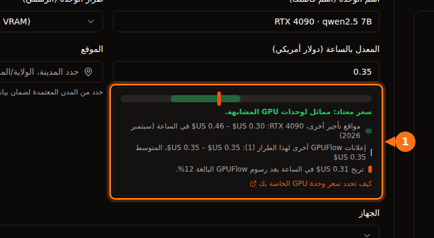

إذا كانت لديك بطاقة رسومات للألعاب تبقى خاملة معظم اليوم، يمكنك تأجيرها على سوق والحصول على أجر بالساعة. أما هل يستحق الأمر العناء، فالجواب يتوقف على أربعة أرقام:

1. **ما يدفعه المستأجرون** في الساعة مقابل بطاقتك.
2. **ما تحتفظ به المنصة.**
3. **ما تكلّفك الكهرباء** أثناء التشغيل.
4. **عدد الساعات التي تُستأجر فيها فعلاً كل يوم.**

من السهل معرفة الأرقام الثلاثة الأولى. أما الرابع فلا أحد يستطيع أن يعدك به، لذلك نعرض نطاقاً. راجعنا كل الأسعار أدناه في سبتمبر 2026، والمصادر في آخر المقال.

## 1. ما يدفعه المستأجرون

هذه أسعار معتادة للاستئجار عند الطلب بالساعة على مواقع استئجار GPU (Vast.ai وRunPod وSalad وSimplePod وTensorDock وHyperstack وLambda) في سبتمبر 2026:

| GPU | السعر المعتاد بالساعة | منتصف النطاق |
| --- | --- | --- |
| RTX 3060 12 GB | $0.05 – $0.08 | $0.065 |
| RTX 4070 | $0.07 – $0.15 | $0.11 |
| RTX 3090 | $0.11 – $0.31 | $0.21 |
| RTX 4080 | $0.23 – $0.27 | $0.25 |
| RTX 4090 | $0.30 – $0.46 | $0.38 |
| RTX 5090 | $0.41 – $0.69 | $0.55 |

الذاكرة مهمة بقدر السرعة. بطاقة بذاكرة 24 GB مثل 3090 أو 4090 تستطيع تشغيل نماذج ذكاء اصطناعي أكبر مما تشغّله بطاقة بذاكرة 12 GB أو 16 GB، والمستأجرون يدفعون مقابل ذلك.

## 2. ما تحتفظ به المنصة

| المنصة | الحصة | السحب |
| --- | --- | --- |
| GPUFlow | تحتفظ بـ 12%، وتحصل أنت على 88% | إلى حسابك المصرفي عبر Stripe. الحد الأدنى $25، و$2.50 لكل عملية سحب. |
| Vast.ai | تقول Vast إن الأسعار المعروضة أعلى عادةً بنحو 25% مما يربحه المضيفون | Wise أو PayPal أو Stripe. الحد الأدنى $20، وتصدر الفواتير أسبوعياً. |
| Salad | غير منشورة | PayPal وبطاقات الهدايا والألعاب وغيرها |

وتختلف طريقة الإعداد أيضاً. يشغّل مضيفو Vast.ai نظام Ubuntu، ويحصل المستأجرون على حاويات على جهاز المضيف مع وصول عبر SSH أو Jupyter. ويعمل Salad على Windows 10 أو 11. أما على GPUFlow فتنفّذ أمراً واحداً على كمبيوتر يعمل بنظام Linux مع systemd؛ ولا يصل المستأجرون إلى نماذج الذكاء الاصطناعي لديك إلا عبر API، ولا يحصلون أبداً على سطر أوامر (shell) على جهازك. [ما يستطيع المستأجرون الوصول إليه وما لا يستطيعون](https://docs.gpuflow.app/ar/providers/security/).

## 3. ما تكلّفه الكهرباء

المعادلة: **استهلاك الطاقة بالكيلوواط × سعر الكيلوواط ساعة لديك = التكلفة في الساعة.**

لاستهلاك الطاقة، نستخدم قدرة اللوحة الرسمية (board power) لكل بطاقة. هذه القيمة قريبة من أقصى ما تسحبه البطاقة نفسها؛ وأثناء توليد النصوص بالذكاء الاصطناعي تسحب غالباً أقل منها. ويضيف باقي الكمبيوتر استهلاكه فوقها. والطريقة الأدق هي القياس: يعرض GPUFlow استهلاك الطاقة المباشر لوحدة GPU في **أجهزتي**، ويعرض مقياس طاقة يوصَل بالمقبس استهلاك الكمبيوتر كله.

| GPU | قدرة اللوحة |
| --- | --- |
| RTX 3060 | 170 W |
| RTX 4070 | 200 W |
| RTX 3090 | 350 W |
| RTX 4080 | 320 W |
| RTX 4090 | 450 W |
| RTX 5090 | 575 W |

ما تكلّفه ساعة واحدة من RTX 4090 بقدرة 450 W من الكهرباء:

| المكان | السعر المنزلي | ساعة واحدة بقدرة 450 W |
| --- | --- | --- |
| الولايات المتحدة (متوسط متوقع لعام 2026) | 18.2 ¢/kWh | نحو $0.08 |
| كندا | C$0.170/kWh | نحو C$0.08 |
| المملكة المتحدة (سقف الأسعار لأكتوبر–ديسمبر 2026) | 26.32 p/kWh | نحو 11.8 p |
| ألمانيا | €0.3869/kWh | نحو €0.17 |
| فرنسا | €0.2561/kWh | نحو €0.12 |

في الولايات المتحدة، تأخذ الكهرباء نحو ربع ما تربحه 4090 عن كل ساعة استئجار. وفي ألمانيا تكلّف الساعة نفسها نحو €0.17، فتحقق من سعرك قبل أن تحدد سعر التأجير.

## 4. تجميع الأرقام

عن كل ساعة استئجار بسعر منتصف النطاق، مع حصة GPUFlow البالغة 88% ومتوسط كهرباء الولايات المتحدة بكامل قدرة اللوحة:

| GPU | ما تحصل عليه (88%) | الكهرباء | المتبقي عن كل ساعة استئجار | 4 ساعات يومياً (120 ساعة شهرياً) | 12 ساعة يومياً (360 ساعة شهرياً) |
| --- | --- | --- | --- | --- | --- |
| RTX 3060 12 GB | $0.057 | $0.031 | **$0.026** | $3.15 | $9.45 |
| RTX 4070 | $0.097 | $0.036 | **$0.060** | $7.25 | $21.74 |
| RTX 3090 | $0.185 | $0.064 | **$0.121** | $14.53 | $43.60 |
| RTX 4080 | $0.220 | $0.058 | **$0.162** | $19.41 | $58.23 |
| RTX 4090 | $0.334 | $0.082 | **$0.253** | $30.30 | $90.90 |
| RTX 5090 | $0.484 | $0.105 | **$0.379** | $45.52 | $136.57 |

ثلاثة أشياء لا يشملها هذا الجدول:

- **وقت الانتظار.** يجب أن يكون الكمبيوتر يعمل ومتصلاً حتى يجده المستأجرون. وأثناء الانتظار يستهلك الكهرباء أيضاً. قِس استهلاك الكمبيوتر وهو خامل واطرحه كذلك.
- **التآكل.** تبلى المراوح والمعجون الحراري أسرع تحت الأحمال الطويلة. احرص على تهوية جيدة للصندوق وراقب الحرارة.
- **الضرائب.** دخل التأجير دخل. وطريقة فرض الضريبة عليه تعتمد على مكان إقامتك.

## ماذا تقول الأرقام

- **RTX 3090 و4080 و4090 و5090** يمكن أن تربح مبلغاً له قيمة، إذا استُؤجرت عدة ساعات يومياً. وتبقى 3090 الخيار الأفضل قيمةً: ذاكرة 24 GB مع تكلفة كهرباء منخفضة.
- **RTX 3060 و4070** تربحان القليل جداً في الساعة. بمعدل $3 شهرياً، تحتاج 3060 إلى نحو ثمانية أشهر لتبلغ الحد الأدنى للسحب في GPUFlow وهو $25. لا يستحق الأمر إلا إذا كانت الكهرباء رخيصة لديك أو كان الكمبيوتر يعمل في كل الأحوال.
- **نسبة الاستخدام تحسم كل شيء.** RTX 4090 نفسها تربح $30 أو $91 شهرياً بحسب ما إذا استُؤجرت 4 ساعات أو 12 ساعة يومياً. السعر المنصف والجهاز المتصل باستمرار يجلبان استئجارات أكثر من خصم ببضعة سنتات.

## كيف تحصل على ساعات استئجار أكثر

1. **اختر في البداية سعراً في النصف الأدنى من النطاق.** المستأجرون يقارنون. ويمكنك رفع السعر حين تبدأ الاستئجارات.
2. **ابقَ متصلاً.** لا يمكن استئجار GPU غير متصل. على GPUFlow يستطيع المستأجرون النقر على **إعلامي عند الاتصال** على وحدة GPU غير متصلة، فيصلك بريد إلكتروني عندما ينتظر أحد.
3. **قدّم نماذج شائعة.** اذكر في إعلانك النماذج التي تشغّلها، مثل `qwen2.5:7b` أو `llama3.1:8b`. المستأجرون يبحثون عنها.
4. **راجع الوضع بعد أسبوع.** مستأجرة معظم الوقت؟ ارفع السعر قليلاً. لا استئجارات؟ خفّضه قليلاً.

على GPUFlow، يعرض نموذج الإعلان موقع سعرك مقارنةً بمواقع التأجير الأخرى وبإعلانات GPUFlow الأخرى للبطاقة نفسها، وما تربحه في الساعة بعد الرسوم:

## أين يعمل السحب في GPUFlow

يدفع GPUFlow الأرباح عبر Stripe إلى حسابات مصرفية في **الولايات المتحدة وكندا والمملكة المتحدة وسويسرا والمنطقة الاقتصادية الأوروبية**. إذا كنت تقيم في مكان آخر، فما زال بإمكانك عرض GPU للتأجير وإنفاق ما تربحه على استئجار وحدات GPU أخرى، لكنك لا تستطيع السحب إلى حساب مصرفي بعد. وتُحتجز الأرباح 7 أيام (14 يوماً للحسابات التي يقل عمرها عن 30 يوماً) قبل أن تتمكن من سحبها. [الحصول على أرباحك في GPUFlow](https://docs.gpuflow.app/ar/providers/getting-paid/).

## جرّب الحساب بأرقامك

**(السعر بالساعة × 0.88) − (الواط ÷ 1,000 × سعر الكيلوواط ساعة) = المتبقي عن كل ساعة استئجار**

ثم اضرب الناتج في عدد الساعات التي تتوقعها بواقعية. إذا كانت النتيجة بضعة دولارات شهرياً، فالأرجح أنها لا تستحق تآكل البطاقة. وإذا كانت عشرات الدولارات، فالأمر يستحق التجربة لمدة شهر ثم النظر في الأرقام الحقيقية.

للبدء، راجع [اجعل GPU الخاص بك متصلاً](https://docs.gpuflow.app/ar/providers/getting-started/) و[كيف تحدد سعر GPU الخاص بك](https://docs.gpuflow.app/ar/providers/pricing/).

## مقالات ذات صلة

- [GPUFlow أم Vast.ai أم RunPod أم SaladCloud: أيها يناسب عملك](/ar/gpuflow-vs-vast-ai-vs-runpod/)
- [التكلفة الحقيقية لاستئجار GPU: ما لا يظهر في السعر بالساعة](/ar/hidden-fees-in-gpu-rental/)

## المصادر

راجعناها كلها في سبتمبر 2026.

- نطاقات أسعار استئجار GPU: [وثائق GPUFlow، كيف تحدد سعر GPU الخاص بك](https://docs.gpuflow.app/ar/providers/pricing/)
- رسوم GPUFlow والاحتجاز والسحب: [وثائق GPUFlow، الحصول على أرباحك](https://docs.gpuflow.app/ar/providers/getting-paid/)
- أرباح المضيفين في Vast.ai: [مقال vast.ai](https://vast.ai/article/how-much-money-can-you-earn-renting-out-your-gpu-on-vast-ai) (18 مايو 2026)؛ السحب: [docs.vast.ai/host/payment.md](https://docs.vast.ai/host/payment.md)؛ متطلبات الاستضافة: [docs.vast.ai/host/hosting-overview.md](https://docs.vast.ai/host/hosting-overview.md)
- Salad: [salad.com/download](https://salad.com/download/)، [الاسترداد عبر PayPal](https://support.salad.com/rewards/redeeming-your-rewards/how-to-redeem-paypal/)
- قدرة اللوحة: صفحات منتجات NVIDIA لـ [RTX 3060](https://www.nvidia.com/en-us/geforce/graphics-cards/30-series/rtx-3060-3060ti/) و[RTX 4080](https://www.nvidia.com/en-us/geforce/graphics-cards/40-series/rtx-4080-family/) و[RTX 4090](https://www.nvidia.com/en-us/geforce/graphics-cards/40-series/rtx-4090/) و[RTX 5090](https://www.nvidia.com/en-us/geforce/graphics-cards/50-series/rtx-5090/)؛ RTX 3090: [TechPowerUp](https://www.techpowerup.com/gpu-specs/geforce-rtx-3090.c3622)؛ RTX 4070: [TechSpot](https://www.techspot.com/review/2663-nvidia-geforce-rtx-4070/)
- الكهرباء في الولايات المتحدة: [توقعات الطاقة قصيرة المدى من EIA](https://www.eia.gov/outlooks/steo/report/elec_coal_renew.php) (سبتمبر 2026)
- الكهرباء في المملكة المتحدة: [سقف أسعار Ofgem](https://www.ofgem.gov.uk/your-energy-supply/your-energy-bill/energy-price-cap-unit-rates-and-standing-charges)
- الكهرباء في ألمانيا وفرنسا، النصف الثاني من 2025: [إحصاءات أسعار الكهرباء من Eurostat](https://ec.europa.eu/eurostat/statistics-explained/index.php?title=Electricity_price_statistics)، [بيانات Eurostat nrg_pc_204 لفرنسا](https://ec.europa.eu/eurostat/api/dissemination/statistics/1.0/data/nrg_pc_204?geo=FR&nrg_cons=KWH2500-4999&unit=KWH&tax=I_TAX&currency=EUR&lastTimePeriod=1)
- الكهرباء في كندا، يونيو 2025: [GlobalPetrolPrices](https://www.globalpetrolprices.com/Canada/electricity_prices/)
