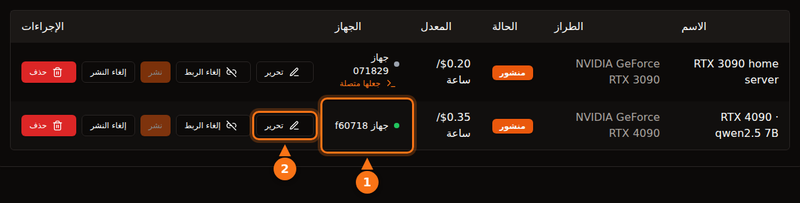

التأجير آمن بقدر معقول إذا اخترت المنصة وأنت تعرف ما تفعل، لكن كلمة "آمن" تعني أشياء مختلفة على منصات مختلفة. على منصات الحاويات مثل Vast.ai، يشغّل المستأجر كوده الخاص على جهازك وتخرج حركة بياناته من عنوان IP الخاص بك؛ العزل يُبعده عن ملفاتك، لكنه لا يُبعده عن شبكتك ولا عن فاتورة الكهرباء. وفي تصميم يقدّم API فقط مثل GPUFlow، لا يستطيع المستأجر إلا إرسال طلبات محادثة إلى النماذج التي ثبّتّها، وينعكس الخطر: الموجّهات قابلة للقراءة على جهازك، فلا ينبغي للمستأجرين إرسال أي شيء سري.

يتناول هذا المقال الاتجاهين. راجعنا ادعاءات المنصات الأخرى في وثائق كل منصة في سبتمبر 2026، وكل ما يخص GPUFlow مأخوذ من كوده المصدري ووثائقه. المصادر في آخر المقال.

## ما يستطيع المستأجر فعله على منصة حاويات

معظم أسواق GPU تؤجّر حاوية. يختار المستأجر صورة، ويحصل على سطر أوامر، ويشغّل ما يشاء. وهذا يعطيك، بصفتك المضيف، خمسة أمور تستحق التفكير.

- **كود عشوائي.** يعمل كود المستأجر على نواة نظامك، داخل حاوية أو آلة افتراضية. العزل جيد لكنه ليس كاملاً؛ الهروب من الحاوية نادر، وهو بالضبط نوع الثغرات التي تُسدّ في تحديثات النواة والتعريفات التي يجب أن تثبّتها.
- **عنوان IP الخاص بك.** تخرج حركة البيانات الصادرة من الحاوية عبر اتصالك بالإنترنت. إذا جمع المستأجر بيانات من موقع آلياً، أو أرسل رسائل مزعجة، أو مسح الإنترنت، يذهب بلاغ إساءة الاستخدام إلى مزوّد الإنترنت لديك، باسم عنوان IP الخاص بك. تنص شروط Vast.ai على أن المستخدمين يعوّضون المزوّدين عن المطالبات الناشئة عن محتوى المستخدم، وهذا يفيد في نزاع مع طرف ثالث، لكنه لا يمنع مزوّد الإنترنت من إرسال تحذير إليك.
- **منافذ مفتوحة.** يقول دليل الاستضافة في Vast.ai: "يحتاج العملاء إلى منافذ مفتوحة للاتصال بالجهاز مباشرة في معظم المهام"، فتوجّه منافذ على الراوتر.
- **القرص.** ينزّل المستأجرون صوراً ونماذج ومجموعات بيانات على أقراصك. يحرّر Vast.ai المساحة عندما يحذف العميل وحدة التخزين، لكنها ملكه طوال مدة الاستئجار.
- **الطاقة والحرارة والتعريفات.** يقول Vast.ai للمضيفين: "توقّع أن يُستخدم GPU بقدرة قريبة من الحد الأقصى طوال مدة الاستئجار". هذا يعني ساعات من استهلاك البطاقة لكامل طاقتها، وحرارة في الغرفة، ومراوح تدور. وتحتاج منصات الحاويات أيضاً إلى إعداد محدد: يذكر دليل Vast.ai تثبيت Ubuntu، وتقسيم الأقراص، وتثبيت تعريفات NVIDIA، وفتح منافذ الراوتر.

## كيف يعزل Vast.ai وSalad وRunPod المستأجرين

| | Vast.ai | Salad | RunPod Community Cloud |
| --- | --- | --- | --- |
| **ما يحصل عليه المستأجر** | حاوية (أو آلة افتراضية) مع SSH أو Jupyter | حاوية نشرها بنفسه، مع SSH وطرفية ويب داخلها | Pod (حاوية) |
| **العزل** | حاويات Docker بلا صلاحيات مميزة | آلة Linux افتراضية فوق hypervisor، والحاوية بداخلها | "حاوية خاصة به مع فصل صارم" |
| **المنافذ الواردة** | مطلوبة لمعظم المهام | محجوبة افتراضياً | غير مذكور |
| **مضيفون جدد** | نعم، على Ubuntu | نعم، على Windows 10/11 | لم يعد يقبلهم |

- **Vast.ai** يقول: "العملاء معزولون في حاويات Docker بلا صلاحيات مميزة، ولا يصلون إلا إلى بياناتهم"، مع فصل مساحات الأسماء (namespaces) وcgroups والشبكة ونظام الملفات والعمليات. ويحذّر المستأجرين أيضاً من أن "أمان المزوّدين يتفاوت كثيراً"، ويوجّه الأعمال الحساسة إلى فئة Secure Cloud المكوّنة من مراكز بيانات معتمدة.
- **Salad** يقول: "يعمل حمل العمل لديك داخل حاوية متوافقة مع OCI على آلة Linux افتراضية، معزولاً عن Windows وعن كل عملية أخرى على الجهاز المضيف"، مع حجب الاتصالات الواردة افتراضياً. ويحمي المستأجرين من المضيفين أيضاً: إذا حاول المضيف "الوصول إلى بيئة Linux، ندمّر البيئة تلقائياً ونضع الجهاز في القائمة السوداء". وبشكل منفصل، يقدّم Salad مهام اختيارية لمشاركة عرض النطاق "تعالج محتوى فيديو من منصات بث مدفوعة" عبر اتصالك؛ وتحذّر صفحة الدعم لديه من أن ذلك يرفع استهلاكك للبيانات وقد يسبب "تقييداً نادراً ومؤقتاً (عادةً 1-2 يوم) للمحتوى على منصات البث تلك".
- **RunPod** يقول: "لم يعد Runpod يقبل مضيفين جدداً في Community Cloud". أما السعة الموجودة، فـ "كل Pod أو عامل (worker) يعمل في حاوية خاصة به"، وشروطه "تمنع المضيفين من فحص بيانات الـ Pod أو العامل الخاص بك".

المنصات الثلاث تعزل المستأجر عن نظامك. ولا تستطيع أي منها منع حركة بيانات تبدو مشروعة من الخروج عبر اتصالك، ولا تدّعي أي منها ذلك.

## كيف يختلف تصميم GPUFlow

يؤجّر GPUFlow نموذج ذكاء اصطناعي خلف API متوافق مع OpenAI، لا جهازاً. وهذا يغيّر ما يستطيع المستأجر الوصول إليه. إليك ما يفعله الكود.

**الوكيل.** يضع برنامج التثبيت ملفاً تنفيذياً واحداً مكتوباً بلغة Go في `/usr/local/bin/gpuflow-agent` ويشغّله كخدمة systemd. لا يوجد Docker. تستخدم وحدة الخدمة `DynamicUser=yes` (مستخدم مؤقت بلا صلاحيات مميزة)، و`NoNewPrivileges=yes` (لا يستطيع اكتساب صلاحيات)، و`ProtectSystem=strict` (النظام للقراءة فقط بالنسبة إليه)، و`ProtectHome=yes` (المجلدات الشخصية غير مرئية)، و`PrivateTmp=yes`. محرّك الاستدلال هو Ollama افتراضياً، ويثبّته برنامج تثبيت Ollama نفسه كخدمة مستقلة (ويستطيع المزوّد بدلاً من ذلك توجيه الوكيل إلى خادمه الخاص المتوافق مع OpenAI). إجراءات التحصين تنطبق على الوكيل، لا على Ollama.

**الشبكة.** لا ينشئ الوكيل إلا اتصالات صادرة: اتصال WebSocket عبر TLS إلى `wss://ws.gpuflow.app`، واتصال HTTPS إلى `gpuflow.app` للتسجيل ولإرسال نبضة (heartbeat) كل 15 ثانية. لا يفتح أي منافذ، ولا توجّه أي شيء على الراوتر، ولا يعرف المستأجرون عنوان IP الخاص بك أبداً. ويتواصل مع Ollama على `127.0.0.1:11434`، وهو عنوان الاسترجاع الافتراضي في Ollama.

**ما يستطيع المستأجر استدعاءه.** يحصل المستأجر على مفتاح API لـ `https://gpuflow.app/v1`. يجيب GPUFlow بنفسه عن `GET /v1/models`، والطلب الوحيد الذي يمرّره إلى جهازك هو `POST /v1/chat/completions`. وللوكيل قفل ثانٍ خاص به: لا يمرّر إلا أربعة مسارات محددة بالضبط (`/v1/chat/completions` و`/v1/completions` و`/v1/embeddings` و`/v1/models`) ويرفض كل ما عداها، بما في ذلك نقاط `/api/*` الأصلية في Ollama التي تنزّل النماذج أو تحذفها أو تنشئها. يتعامل الوكيل مع نوع رسائل واحد، هو طلب الاستدلال؛ وكل ما عداه يُتجاهل.

إذن ليس لدى المستأجر سطر أوامر، ولا SSH، ولا ملفات، ولا وصول شبكي إلى جهازك. لا يستطيع تنزيل نموذج بحجم 70 GB على قرصك، ولا استخدام اتصالك للوصول إلى الإنترنت. ما يستطيعه هو إبقاء GPU مشغولاً طوال الساعات التي حجزها، وتسمية أي نموذج ثبّتّه في الحقل `model`.

<figure>
<svg viewBox="0 0 720 380" role="img" aria-labelledby="d1-title" xmlns="http://www.w3.org/2000/svg" font-family="system-ui, sans-serif" font-size="15">
<title id="d1-title">ما يستطيع المستأجر فعله على مضيف حاويات مقارنةً بتصميم يقدّم API فقط مثل GPUFlow</title>
<rect x="0" y="0" width="720" height="380" fill="#ffffff"/>
<text x="20" y="40" fill="#64748b" font-weight="bold" text-anchor="end" direction="rtl">ما يستطيع المستأجر فعله</text>
<text x="470" y="40" text-anchor="middle" fill="#1e1b4b" font-weight="bold" direction="rtl">مضيف حاويات</text>
<text x="630" y="40" text-anchor="middle" fill="#1e1b4b" font-weight="bold">GPUFlow ‏(API)</text>
<line x1="20" y1="55" x2="700" y2="55" stroke="#e2e8f0" stroke-width="2"/>
<text x="20" y="89" fill="#1e1b4b" text-anchor="end" direction="rtl">تشغيل برامجه الخاصة</text>
<rect x="430" y="70" width="80" height="28" rx="14" fill="#fff7ed" stroke="#f97316" stroke-width="2"/>
<text x="470" y="89" text-anchor="middle" fill="#1e1b4b" direction="rtl">نعم</text>
<rect x="590" y="70" width="80" height="28" rx="14" fill="#f0fdf4" stroke="#16a34a" stroke-width="2"/>
<text x="630" y="89" text-anchor="middle" fill="#1e1b4b" direction="rtl">لا</text>
<line x1="20" y1="110" x2="700" y2="110" stroke="#e2e8f0" stroke-width="1"/>
<text x="20" y="133" fill="#1e1b4b" text-anchor="end" direction="rtl">فتح سطر أوامر أو SSH</text>
<rect x="430" y="114" width="80" height="28" rx="14" fill="#fff7ed" stroke="#f97316" stroke-width="2"/>
<text x="470" y="133" text-anchor="middle" fill="#1e1b4b" direction="rtl">نعم</text>
<rect x="590" y="114" width="80" height="28" rx="14" fill="#f0fdf4" stroke="#16a34a" stroke-width="2"/>
<text x="630" y="133" text-anchor="middle" fill="#1e1b4b" direction="rtl">لا</text>
<line x1="20" y1="154" x2="700" y2="154" stroke="#e2e8f0" stroke-width="1"/>
<text x="20" y="177" fill="#1e1b4b" text-anchor="end" direction="rtl">كتابة ملفات على قرصك</text>
<rect x="430" y="158" width="80" height="28" rx="14" fill="#fff7ed" stroke="#f97316" stroke-width="2"/>
<text x="470" y="177" text-anchor="middle" fill="#1e1b4b" direction="rtl">نعم</text>
<rect x="590" y="158" width="80" height="28" rx="14" fill="#f0fdf4" stroke="#16a34a" stroke-width="2"/>
<text x="630" y="177" text-anchor="middle" fill="#1e1b4b" direction="rtl">لا</text>
<line x1="20" y1="198" x2="700" y2="198" stroke="#e2e8f0" stroke-width="1"/>
<text x="20" y="221" fill="#1e1b4b" text-anchor="end" direction="rtl">إرسال بيانات من عنوان IP الخاص بك</text>
<rect x="430" y="202" width="80" height="28" rx="14" fill="#fff7ed" stroke="#f97316" stroke-width="2"/>
<text x="470" y="221" text-anchor="middle" fill="#1e1b4b" direction="rtl">نعم</text>
<rect x="590" y="202" width="80" height="28" rx="14" fill="#f0fdf4" stroke="#16a34a" stroke-width="2"/>
<text x="630" y="221" text-anchor="middle" fill="#1e1b4b" direction="rtl">لا</text>
<line x1="20" y1="242" x2="700" y2="242" stroke="#e2e8f0" stroke-width="1"/>
<text x="20" y="265" fill="#1e1b4b" text-anchor="end" direction="rtl">يحتاج إلى منافذ مفتوحة على الراوتر</text>
<rect x="430" y="246" width="80" height="28" rx="14" fill="#fff7ed" stroke="#f97316" stroke-width="2"/>
<text x="470" y="265" text-anchor="middle" fill="#1e1b4b" direction="rtl">غالباً</text>
<rect x="590" y="246" width="80" height="28" rx="14" fill="#f0fdf4" stroke="#16a34a" stroke-width="2"/>
<text x="630" y="265" text-anchor="middle" fill="#1e1b4b" direction="rtl">لا</text>
<line x1="20" y1="286" x2="700" y2="286" stroke="#e2e8f0" stroke-width="1"/>
<text x="20" y="309" fill="#1e1b4b" text-anchor="end" direction="rtl">تنزيل النماذج أو حذفها</text>
<rect x="430" y="290" width="80" height="28" rx="14" fill="#fff7ed" stroke="#f97316" stroke-width="2"/>
<text x="470" y="309" text-anchor="middle" fill="#1e1b4b" direction="rtl">نعم</text>
<rect x="590" y="290" width="80" height="28" rx="14" fill="#f0fdf4" stroke="#16a34a" stroke-width="2"/>
<text x="630" y="309" text-anchor="middle" fill="#1e1b4b" direction="rtl">لا</text>
<line x1="20" y1="330" x2="700" y2="330" stroke="#e2e8f0" stroke-width="1"/>
<text x="20" y="353" fill="#1e1b4b" text-anchor="end" direction="rtl">إبقاء GPU مشغولاً لساعات</text>
<rect x="430" y="334" width="80" height="28" rx="14" fill="#eef2ff" stroke="#6366f1" stroke-width="2"/>
<text x="470" y="353" text-anchor="middle" fill="#1e1b4b" direction="rtl">نعم</text>
<rect x="590" y="334" width="80" height="28" rx="14" fill="#eef2ff" stroke="#6366f1" stroke-width="2"/>
<text x="630" y="353" text-anchor="middle" fill="#1e1b4b" direction="rtl">نعم</text>
</svg>
<figcaption>عمود الحاويات يصف استضافة على طريقة Vast.ai، حيث تبقى الملفات وحركة البيانات داخل حاوية المستأجر لكنها تستخدم قرصك واتصالك مع ذلك. التفاصيل تختلف: يشغّل Salad الحاويات داخل آلة Linux افتراضية ويحجب الاتصالات الواردة افتراضياً. على GPUFlow لا يرسل المستأجر إلا طلبات محادثة إلى النماذج التي ثبّتّها.</figcaption>
</figure>

## مسار البيانات، مرحلة بمرحلة

هذا الجزء موجّه إلى المستأجرين. يمر طلب المحادثة عبر أربعة برامج، والنص قابل للقراءة في أكثر من واحد منها.

<figure>
<svg viewBox="0 0 720 330" role="img" aria-labelledby="d2-title" xmlns="http://www.w3.org/2000/svg" font-family="system-ui, sans-serif" font-size="15">
<title id="d2-title">ينتقل طلب المحادثة في GPUFlow من تطبيق المستأجر إلى gpuflow.app، ثم خادم الترحيل، ثم الوكيل على كمبيوتر المزوّد، ثم Ollama، وتعود الإجابة بالطريق نفسه</title>
<rect x="0" y="0" width="720" height="330" fill="#ffffff"/>
<rect x="480" y="50" width="230" height="200" rx="12" fill="#fff7ed" stroke="#f97316" stroke-width="2" stroke-dasharray="6 4"/>
<text x="595" y="76" text-anchor="middle" fill="#1e1b4b" font-weight="bold" direction="rtl">كمبيوتر المزوّد</text>
<rect x="10" y="110" width="110" height="70" rx="10" fill="#eef2ff" stroke="#6366f1" stroke-width="2"/>
<text x="65" y="141" text-anchor="middle" fill="#1e1b4b" direction="rtl">تطبيق</text>
<text x="65" y="161" text-anchor="middle" fill="#1e1b4b" direction="rtl">المستأجر</text>
<rect x="160" y="110" width="120" height="70" rx="10" fill="#eef2ff" stroke="#6366f1" stroke-width="2"/>
<text x="220" y="141" text-anchor="middle" fill="#1e1b4b">GPUFlow API</text>
<text x="220" y="161" text-anchor="middle" fill="#64748b" font-size="12">gpuflow.app/v1</text>
<rect x="320" y="110" width="105" height="70" rx="10" fill="#eef2ff" stroke="#6366f1" stroke-width="2"/>
<text x="372" y="141" text-anchor="middle" fill="#1e1b4b" font-size="13" direction="rtl">خادم الترحيل</text>
<text x="372" y="161" text-anchor="middle" fill="#64748b" font-size="12">ws.gpuflow.app</text>
<rect x="492" y="110" width="90" height="70" rx="10" fill="#ffffff" stroke="#6366f1" stroke-width="2"/>
<text x="537" y="141" text-anchor="middle" fill="#1e1b4b" direction="rtl">وكيل</text>
<text x="537" y="161" text-anchor="middle" fill="#1e1b4b">GPUFlow</text>
<rect x="610" y="110" width="90" height="70" rx="10" fill="#ffffff" stroke="#6366f1" stroke-width="2"/>
<text x="655" y="141" text-anchor="middle" fill="#1e1b4b">Ollama</text>
<text x="655" y="161" text-anchor="middle" fill="#64748b" font-size="12">127.0.0.1</text>
<line x1="124" y1="145" x2="156" y2="145" stroke="#16a34a" stroke-width="4"/>
<line x1="284" y1="145" x2="316" y2="145" stroke="#64748b" stroke-width="4"/>
<line x1="429" y1="145" x2="488" y2="145" stroke="#16a34a" stroke-width="4"/>
<line x1="586" y1="145" x2="606" y2="145" stroke="#f97316" stroke-width="4"/>
<text x="140" y="102" text-anchor="middle" fill="#16a34a" font-size="13">TLS</text>
<text x="300" y="102" text-anchor="middle" fill="#64748b" font-size="13" direction="rtl">داخلي</text>
<text x="452" y="102" text-anchor="middle" fill="#16a34a" font-size="13">TLS</text>
<text x="596" y="102" text-anchor="middle" fill="#f97316" font-size="13" direction="rtl">غير مشفّر</text>
<text x="65" y="212" text-anchor="middle" fill="#64748b" font-size="12" direction="rtl">هنا يُكتب</text>
<text x="65" y="228" text-anchor="middle" fill="#64748b" font-size="12" direction="rtl">النص</text>
<text x="220" y="212" text-anchor="middle" fill="#64748b" font-size="12" direction="rtl">يقرأ النص،</text>
<text x="220" y="228" text-anchor="middle" fill="#64748b" font-size="12" direction="rtl">ولا يخزّن إلا</text>
<text x="220" y="244" text-anchor="middle" fill="#64748b" font-size="12" direction="rtl">عدد التوكنات</text>
<text x="372" y="212" text-anchor="middle" fill="#64748b" font-size="12" direction="rtl">يمرّره،</text>
<text x="372" y="228" text-anchor="middle" fill="#64748b" font-size="12" direction="rtl">ولا يسجّل</text>
<text x="372" y="244" text-anchor="middle" fill="#64748b" font-size="12" direction="rtl">المحتوى</text>
<text x="595" y="212" text-anchor="middle" fill="#1e1b4b" font-size="13" font-weight="bold" direction="rtl">نص غير مشفّر في الذاكرة</text>
<text x="595" y="230" text-anchor="middle" fill="#1e1b4b" font-size="13" font-weight="bold" direction="rtl">المالك لديه صلاحيات root</text>
<line x1="20" y1="295" x2="50" y2="295" stroke="#16a34a" stroke-width="4"/>
<text x="58" y="300" fill="#1e1b4b" font-size="13" text-anchor="end" direction="rtl">TLS عبر الإنترنت</text>
<line x1="235" y1="295" x2="265" y2="295" stroke="#64748b" stroke-width="4"/>
<text x="273" y="300" fill="#1e1b4b" font-size="13" text-anchor="end" direction="rtl">داخل GPUFlow</text>
<line x1="420" y1="295" x2="450" y2="295" stroke="#f97316" stroke-width="4"/>
<text x="458" y="300" fill="#1e1b4b" font-size="13" text-anchor="end" direction="rtl">غير مشفّر على كمبيوتر المزوّد</text>
</svg>
<figcaption>يسير الطلب من اليسار إلى اليمين، وتعود الإجابة بالطريق نفسه. يحمي TLS كل مرحلة تعبر الإنترنت، لكنه ينتهي عند كل خادم، فيكون النص قابلاً للقراءة في خوادم GPUFlow أثناء تمريره، وعلى كمبيوتر المزوّد حيث يشغّل Ollama النموذج.</figcaption>
</figure>

1. **من المستأجر إلى gpuflow.app:** ‏HTTPS. الموقع يعمل خلف Cloudflare.
2. **من API الخاص بـ GPUFlow إلى خادم الترحيل:** اتصال داخلي على جانب GPUFlow. يتحقق الـ API من المفتاح، ويمرّر محتوى الطلب دون تغيير، ويسجّل عدد التوكنات. لا يخزّن نص الطلبات أو الإجابات، وتنص سياسة الخصوصية على ذلك.
3. **من خادم الترحيل إلى وكيل المزوّد:** اتصال WebSocket عبر TLS فتحه الوكيل. يسجّل خادم الترحيل نوع كل رسالة، لا محتواها.
4. **من الوكيل إلى Ollama:** ‏HTTP غير مشفّر على عنوان الاسترجاع داخل كمبيوتر المزوّد. والوكيل لا يسجّل محتوى الطلبات أيضاً.

لا يوجد تشفير من طرف إلى طرف حتى النموذج، ولا يمكن أن يوجد مع محرّك استدلال عادي: يجب أن يقرأ النموذج الموجّه ليجيب عنه.

## ما يستطيع المزوّد رؤيته

بصراحة: **كمبيوتر المزوّد يعالج موجّهاتك وإجاباتك كنص غير مشفّر.** يعمل Ollama هناك، ولدى المزوّد صلاحيات root على الجهاز (برنامج التثبيت يتطلبها). المزوّد الذي يريد ذلك يستطيع التقاط حركة البيانات على عنوان الاسترجاع، أو تغيير المحرّك، أو توجيه الوكيل إلى خادم آخر.

ما يقف في طريقه تعاقدي. تنص شروط GPUFlow على أن المزوّدين "يجب ألا يسجّلوا طلبات المستأجرين أو إجاباتهم أو يقرؤوها أو يحتفظوا بها أو يشاركوها، ولا أن يغيّروا الإجابات". هذه قاعدة لها عواقب على الحساب، وليست حاجزاً تقنياً. وسياسة الخصوصية تقول الشيء نفسه للمستأجرين: الطلبات والإجابات تمر عبر كمبيوتر المزوّد طوال مدة الاستئجار.

إلى جانب الموجّهات، يرى المزوّد اسم المستخدم الخاص بك في GPUFlow ويتلقى إشعاراً عند بدء الاستئجار (معرّف الاستئجار، والإعلان، وعدد الساعات). أما المستأجرون فلا يرون شيئاً من إحصاءات جهاز المزوّد؛ حرارة GPU وVRAM واستهلاك الطاقة وغيرها من بيانات القياس تذهب إلى لوحة تحكم المالك فقط.

القاعدة العملية للمستأجرين: **لا ترسل أسراراً أو بيانات اعتماد أو بيانات شخصية عن أشخاص آخرين أو بيانات خاضعة للتنظيم (صحية أو مالية أو سرية خاصة بالعملاء) عبر أي GPU مجتمعي.** ينطبق هذا على GPUFlow، وبالقدر نفسه على حاوية في كمبيوتر منزلي لدى شخص ما، حيث يستطيع المضيف فحص الذاكرة والقرص بصلاحيات root نفسها. للأعمال الحساسة، شغّل النموذج على عتاد تتحكم فيه، أو استخدم مزوّداً يوقّع الاتفاقية التي تتطلبها متطلبات الامتثال لديك. مقال [لماذا تحظر بعض الشركات أدوات الذكاء الاصطناعي العامة](/ar/why-corporate-policies-banning-chatgpt/) يتناول جانب السياسات، ومقال [تأمين مجموعة بيانات على عقدة GPU عامة](/ar/how-to-secure-dataset-on-public-gpu-node/) يتناول جانب الحاويات.

## ما يبقى فيه خطر على GPUFlow

تقديم API فقط يقلّص سطح الهجوم، لكنه لا يلغيه، وأفضّل أن أعدّد ما تبقى على أن أتظاهر بغير ذلك.

- **Ollama يحلّل مدخلات غير موثوقة.** كل طلب من مستأجر ينتهي على شكل JSON يُسلَّم إلى Ollama. الثغرة في Ollama هي الطريق الأرجح للاختراق، فحافظ على تحديثه. قائمة المسموحات في الوكيل تُبعد المستأجرين عن نقاط إدارة النماذج في Ollama، لكنها لا تستطيع إصلاح ثغرة في مسار المحادثة.
- **برنامج التثبيت يعمل بصلاحيات root.** تمرّر سكربتاً من gpuflow.app إلى `sudo bash`، ويشغّل هو أيضاً سكربت تثبيت Ollama. اقرأ الاثنين أولاً؛ هذه ممارسة جيدة مع أي برنامج استضافة.
- **لا تحديث تلقائي.** لا يحدّث الوكيل نفسه. للحصول على إصدار جديد، أعد تشغيل برنامج التثبيت، الذي يتحقق من الملف التنفيذي مقابل ملف SHA256SUMS عند نشره.
- **الحمل.** لا يوجد حد لعدد الطلبات. يستطيع المستأجر إبقاء GPU تحت حمل كامل طوال كل ساعة حجزها، ويستطيع استخدام أي نموذج ثبّتّه، بما في ذلك أكبرها.
- **الحرارة والطاقة.** كما في أي مكان آخر: الساعات المؤجّرة ساعات تحت الحمل.

## قائمة تحقق للمزوّدين

1. **استخدم جهازاً تتحمّل إعارته.** الأفضل جهاز مخصص. وعلى الأقل، لا تحتفظ بملفات العمل أو مخازن كلمات المرور على الكمبيوتر الذي تؤجّره، أياً كانت المنصة. على GPUFlow يعمل الوكيل أصلاً كمستخدم نظام مؤقت مع إخفاء المجلدات الشخصية، لكن Ollama خدمة منفصلة.
2. **حدّد سقفاً للطاقة.** ‏`sudo nvidia-smi -pl 280` يضبط حد طاقة البطاقة بالواط (يحتاج إلى صلاحيات root، ويجب أن تكون القيمة بين الحدين الأدنى والأقصى للبطاقة). تذكر Puget Systems أن بطاقات RTX 3090 المحدودة عند 270-280 W احتفظت بنحو 95% من أدائها، وتشرح كيف تعيد تطبيق الحد عند كل إقلاع بوحدة systemd.
3. **احسب تكلفة الكهرباء أولاً.** اقرأ استهلاك الطاقة في **أجهزتي** بينما GPU مشغول، ثم اضرب الكيلوواط في سعر الكيلوواط ساعة لديك. مقال [كم يمكن أن تكسب بطاقة الألعاب لديك](/ar/how-much-can-you-earn-renting-out-your-gpu/) يجري هذا الحساب لبطاقات شائعة وخمس دول.
4. **راقب الحرارة.** تعرض الإحصاءات المباشرة حرارة GPU والنقطة الأسخن (hotspot) والذاكرة وسرعة المروحة. تأكد من أن صندوق الكمبيوتر يحصل على تهوية.
5. **حافظ على تحديث النظام.** ثبّت تحديثات Linux وتعريف GPU وOllama. لا يدير برنامج تثبيت GPUFlow تعريف GPU لديك؛ ويعيد systemd تشغيل الوكيل بعد إعادة التشغيل.
6. **اعرف كيف توقف التأجير مؤقتاً.** ألغِ نشر الإعلان في **وحداتي**، أو نفّذ `sudo systemctl stop gpuflow-agent` (والأمر `start` يعيده). أثناء استئجار نشط، لا تغيّر لوحة التحكم الإعلان أو الجهاز، ولا يمكنك إنهاء استئجار المستأجر منها. إيقاف الوكيل أثناء الاستئجار ينهي الاستئجار بعد 10 دقائق، ولا تحصل على أجرك إلا حتى آخر نبضة.
7. **اعرف كيف تزيل التثبيت.** الخطوات موجودة في [وثائق حل المشكلات](https://docs.gpuflow.app/ar/providers/troubleshooting/). يبقى Ollama مثبتاً حتى تزيله.

على منصات الحاويات، أضف بندين: قرّر هل تريد فعلاً منافذ مفتوحة على الراوتر، واسأل مزوّد الإنترنت لديك ماذا يفعل ببلاغات إساءة الاستخدام، لأن حركة بيانات المستأجرين ستحمل عنوان IP الخاص بك.

## قائمة تحقق للمستأجرين

1. **تعامل مع كل GPU مجتمعي على أنه كمبيوتر شخص غريب.** لا مفاتيح API، ولا كلمات مرور، ولا سجلات عملاء، ولا بيانات طبية أو مالية في الموجّهات.
2. **احذف ما لا تحتاج إليه.** استبدل الأسماء وأرقام الحسابات بعناصر نائبة قبل الإرسال.
3. **احمِ مفتاحك.** على GPUFlow يتوقف المفتاح عن العمل عند انتهاء الاستئجار. إذا تسرّب، فإن **مفتاح جديد** يلغي المفتاح القديم فوراً، و**إنهاء الآن** يوقف الفوترة ويعيد الوقت غير المستخدم.
4. **افترض أن الإجابات قد تكون خاطئة أو معدّلة.** تمنع الشروط المزوّدين من تغيير الإجابات، لكن تحقّق من كل ما هو مهم.
5. **استخدم الأداة المناسبة للأعمال الحساسة.** استضف النموذج بنفسك، أو استخدم مزوّداً يقدّم العقد الذي تحتاج إليه. ومقال [كيف تستخدم المفتاح في تطبيقاتك](/ar/use-openai-compatible-api-key-in-apps/) لكل ما عدا ذلك.

## المصادر

راجعناها كلها في سبتمبر 2026.

- GPUFlow: [ما يمكن للمستأجرين الوصول إليه](https://docs.gpuflow.app/ar/providers/security/)، [البدء للمزوّدين](https://docs.gpuflow.app/ar/providers/getting-started/)، [التسعير والكهرباء](https://docs.gpuflow.app/ar/providers/pricing/)، [حل المشكلات وإزالة التثبيت](https://docs.gpuflow.app/ar/providers/troubleshooting/)، [البدء السريع مع API](https://docs.gpuflow.app/ar/renters/api-quickstart/)
- Vast.ai: [نظرة عامة على الاستضافة](https://docs.vast.ai/host/hosting-overview.md)، [الأسئلة الشائعة عن الأمان](https://docs.vast.ai/documentation/reference/faq/security)، [آلات Linux الافتراضية](https://docs.vast.ai/linux-virtual-machines)، [شروط الخدمة](https://vast.ai/terms)، [تشغيل نماذج ذكاء اصطناعي خاصة](https://vast.ai/article/running-private-ai-models-without-the-risk-of-data-exposure)
- Salad: [الأمان](https://salad.com/security)، [أحمال الحاويات وكمبيوترك](https://community.salad.com/container-workloads-and-your-pc/)، [مشاركة عرض النطاق](https://support.salad.com/faq/jobs/what-is-bandwidth-sharing/)، [SSH والطرفية](https://docs.salad.com/container-engine/explanation/container-groups/ssh-and-terminal.md)، [التنزيل ومتطلبات النظام](https://salad.com/download/)
- RunPod: [اختيار Pod](https://docs.runpod.io/pods/choose-a-pod)، [أمان البيانات والامتثال القانوني](https://docs.runpod.io/hosting/partner-requirements)
- Ollama: [الأسئلة الشائعة (عنوان الربط الافتراضي)](https://docs.ollama.com/faq)
- NVIDIA: [دليل nvidia-smi](https://docs.nvidia.com/deploy/nvidia-smi/index.html)
- Puget Systems: [تحديد طاقة RTX 3090 باستخدام systemd وnvidia-smi](https://www.pugetsystems.com/labs/hpc/quad-rtx3090-gpu-power-limiting-with-systemd-and-nvidia-smi-1983/)
