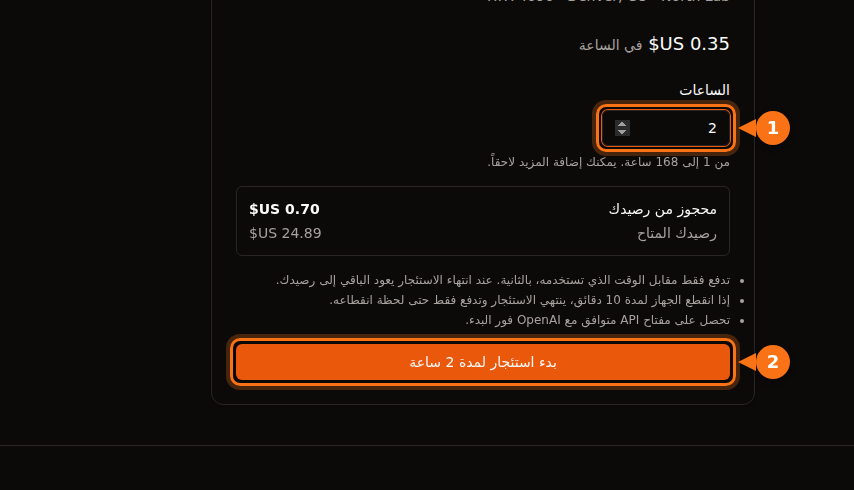

بسعر $0.40 في الساعة، يكلّف تشغيل اختباري مدته 90 ثانية 1¢ إذا كانت الفوترة بالثانية مع حد أدنى 60 ثانية، و1.3¢ إذا كانت بالدقيقة، و40¢ إذا كانت بالساعة الكاملة. هذا الفرق البالغ 40 ضعفاً هو كل القصة في المهام القصيرة. وبمجرد أن تتجاوز المهمة بضع دقائق، يصبح الفرق بين الفوترة بالثانية والفوترة بالدقيقة أقل من سنت، وتحدد الفاتورةَ عندئذ أوقاتُ الخمول والإعداد والتخزين.

فيما يلي: القواعد المنشورة لكل منصة، وأمثلة محسوبة مع الحساب كاملاً، ورسم بمقياس دقيق، وكيف يتحول نموذج GPUFlow القائم على الحجز ثم الاسترداد إلى مبلغ مخصوم. القواعد والأسعار كما كانت في سبتمبر 2026، والمصادر في آخر المقال.

## ثلاث طرق لاحتساب وقت GPU

لكل استئجار GPU سعر بالساعة. الفرق هو كيف يتحول الوقت الذي استخدمته إلى وقت قابل للفوترة قبل ضربه في ذلك السعر.

- **بالثانية مع حد أدنى.** تُعدّ الثواني. إذا كان المجموع أقل من الحد الأدنى (عادةً 60 ثانية)، يُفوتر الحد الأدنى. التكلفة = max(60, الثواني) × السعر بالساعة / 3,600.
- **بالدقيقة.** تُعدّ الدقائق. تختلف المنصات في التعامل مع الدقيقة الجزئية: بعضها يقرّبها إلى الأعلى، وAzure تسقطها. في الأمثلة أدناه أقرّب إلى الأعلى، وهي الحالة الأسوأ بالنسبة إليك. التكلفة = الدقائق × السعر بالساعة / 60.
- **الساعة الكاملة.** أي ساعة بدأت تُحتسب ساعة كاملة. مهمة مدتها 61 دقيقة تُحتسب ساعتين. التكلفة = ceil(الثواني / 3,600) × السعر بالساعة.

الحد الأدنى أهم مما يتوقعه الناس. الفوترة بالثانية مع حد أدنى 60 ثانية والفوترة بالدقيقة متطابقتان في أي شيء أقل من دقيقة. ووحدة الفوترة لا تغيّر إلا الكسر المتبقي في نهاية المهمة، فلا يمكن أن تكلّفك أكثر من وحدة واحدة في كل جلسة: أقل بقليل من 40¢ لكل جلسة مع الفوترة بالساعة بسعر $0.40، وأقل من 0.7¢ لكل جلسة مع الفوترة بالدقيقة بالسعر نفسه (59 ثانية × 40 / 3,600 = 0.66¢).

## ما تستخدمه كل منصة

هذه هي القواعد المنشورة للمثيلات عند الطلب (on-demand)، وقد راجعناها في وثائق كل مزوّد في سبتمبر 2026.

| المنصة | وحدة الفوترة | الحد الأدنى | ملاحظة من الوثائق |
| --- | --- | --- | --- |
| AWS EC2 On-Demand | بالثانية | 60 ثانية | تنطبق على Linux وWindows وRHEL وUbuntu Pro. أما SUSE Linux Enterprise Server فيُفوتر بالساعة الكاملة. |
| Google Cloud Compute Engine | بالثانية | دقيقة واحدة | "تُحتسب جميع وحدات vCPU وGPU وكل GB من الذاكرة لمدة دقيقة واحدة على الأقل." |
| Azure Virtual Machines | بالدقيقة | غير مذكور | تفوتر "عدد الدقائق الكاملة"؛ الآلة التي تعمل 6 د 45 ث تُفوتر على 6 دقائق. |
| Lambda (سحابة عند الطلب) | بالدقيقة | غير مذكور | تفوتر "بزيادات قدرها دقيقة واحدة" من لحظة اجتياز المثيل فحوص السلامة حتى تنهيه. |
| RunPod Pods | بالثانية | غير مذكور | الحوسبة والتخزين كلاهما يُفوتران بالثانية. |
| Vast.ai | بالثانية | غير مذكور | الاستئجار النشط يُفوتر كل ثانية؛ والتخزين يُفوتر كل ثانية يكون فيها المثيل موجوداً إلا إذا كان غير متصل. |
| GPUFlow | بالثانية | 60 ثانية | ثوانٍ كاملة، مقرّبة إلى السنت، بحد أقصى هو المبلغ المحجوز. |

ملاحظتان لقراءة الجدول. قاعدة Azure تقرّب فعلياً إلى الأسفل: تقول أسئلتها الشائعة إنك "لا تُفوتر على أي ثوانٍ إضافية". ووثائق Lambda تذكر زيادات قدرها دقيقة واحدة دون أن تقول في أي اتجاه تُقرَّب الدقيقة الجزئية، فلم أفترض أياً من الاتجاهين. و"غير مذكور" تعني ذلك بالضبط: الوثائق التي قرأتها لا تذكر حداً أدنى، وهذا يختلف عن حد أدنى موثّق يساوي صفراً.

لا تقرّب أي من هذه المنصات حوسبة GPU إلى الساعة الكاملة لأنواع المثيلات المذكورة أعلاه. لكن التقريب إلى الساعة ما زال يظهر في التفاصيل الدقيقة، كما في SUSE على AWS، فراجع صفحة الفوترة قبل أن تشغّل كثيراً من المهام القصيرة على منصة جديدة.

## خمس مهام بسعر $0.40 في الساعة

هذا سعر واحد، $0.40 في الساعة، مطبّق على خمس مدد للمهام. أي 40¢ لكل 3,600 ثانية، أو 1/90 من السنت في الثانية.

**اختبار مدته 90 ثانية.** بالثانية: 90 × 40 / 3,600 = 1.0¢. بالدقيقة: دقيقتان × 40 / 60 = 1.33¢. بالساعة الكاملة: 40¢. فاتورة الساعة تساوي 40 ضعف فاتورة الثانية.

**7 دقائق و30 ثانية.** بالثانية: 450 × 40 / 3,600 = 5.0¢. بالدقيقة: 8 دقائق × 40 / 60 = 5.33¢. بالساعة الكاملة: 40¢، أي 8 أضعاف.

**38 دقيقة و20 ثانية.** بالثانية: 2,300 × 40 / 3,600 = 25.56¢. بالدقيقة: 39 دقيقة × 40 / 60 = 26.0¢. بالساعة الكاملة: 40¢، أي نحو 1.57 ضعف.

**61 دقيقة.** بالثانية: 3,660 × 40 / 3,600 = 40.67¢. بالدقيقة: 61 × 40 / 60 = 40.67¢ (المهمة تنتهي عند دقيقة كاملة، فتتطابق الطريقتان). بالساعة الكاملة: ساعتان، 80¢. دقيقة إضافية واحدة تكاد تضاعف فاتورة الساعة.

| مدة المهمة | بالثانية (حد أدنى 60 ث) | بالدقيقة (تقريب للأعلى) | ساعة كاملة | ما يخصمه GPUFlow |
| --- | --- | --- | --- | --- |
| دقيقة و30 ثانية | 1.00¢ | 1.33¢ | 40¢ | 1¢ |
| 7 دقائق و30 ثانية | 5.00¢ | 5.33¢ | 40¢ | 5¢ |
| 38 دقيقة و20 ثانية | 25.56¢ | 26.00¢ | 40¢ | 26¢ |
| 61 دقيقة | 40.67¢ | 40.67¢ | 80¢ | 41¢ |
| 20 مهمة مدة كل منها دقيقتان و30 ثانية | 33.33¢ | 40.00¢ | $8.00 | 40¢ ‏(20 استئجاراً) |

عمود GPUFlow هو نتيجة الفوترة بالثانية مقرّبة إلى الأعلى إلى سنت كامل لكل استئجار، وهذا ما يفعله كود الفوترة لديه. الصف الأخير مشروح بعد قسمين.

## التكلفة مقابل مدة المهمة، بمقياس دقيق

يمتد الرسم الأول من 0 إلى 150 دقيقة. درجات الفوترة بالدقيقة عرضها دقيقة واحدة وارتفاعها 0.67¢، فتنطبق عند هذا المقياس على خط الفوترة بالثانية. الدرج المهم هو خط الساعة الكاملة: يقفز 40¢ عند 0 و60 و120 دقيقة.

<figure>
<svg viewBox="0 0 720 400" role="img" aria-labelledby="d1-title" xmlns="http://www.w3.org/2000/svg" font-family="system-ui, sans-serif" font-size="15">
<title id="d1-title">تكلفة مهمة واحدة بسعر 0.40 دولار في الساعة من 0 إلى 150 دقيقة، بالفوترة بالثانية وبالدقيقة وبالساعة الكاملة</title>
<rect x="0" y="0" width="720" height="400" fill="#ffffff"/>
<line x1="90" y1="320.0" x2="690" y2="320.0" stroke="#e2e8f0" stroke-width="1"/>
<text x="82" y="325.0" text-anchor="end" fill="#64748b" font-size="13">$0.00</text>
<line x1="90" y1="275.0" x2="690" y2="275.0" stroke="#e2e8f0" stroke-width="1"/>
<text x="82" y="280.0" text-anchor="end" fill="#64748b" font-size="13">$0.20</text>
<line x1="90" y1="230.0" x2="690" y2="230.0" stroke="#e2e8f0" stroke-width="1"/>
<text x="82" y="235.0" text-anchor="end" fill="#64748b" font-size="13">$0.40</text>
<line x1="90" y1="185.0" x2="690" y2="185.0" stroke="#e2e8f0" stroke-width="1"/>
<text x="82" y="190.0" text-anchor="end" fill="#64748b" font-size="13">$0.60</text>
<line x1="90" y1="140.0" x2="690" y2="140.0" stroke="#e2e8f0" stroke-width="1"/>
<text x="82" y="145.0" text-anchor="end" fill="#64748b" font-size="13">$0.80</text>
<line x1="90" y1="95.0" x2="690" y2="95.0" stroke="#e2e8f0" stroke-width="1"/>
<text x="82" y="100.0" text-anchor="end" fill="#64748b" font-size="13">$1.00</text>
<line x1="90" y1="50.0" x2="690" y2="50.0" stroke="#e2e8f0" stroke-width="1"/>
<text x="82" y="55.0" text-anchor="end" fill="#64748b" font-size="13">$1.20</text>
<line x1="90.0" y1="320" x2="90.0" y2="325" stroke="#64748b" stroke-width="1"/>
<text x="90.0" y="342" text-anchor="middle" fill="#64748b" font-size="13">0</text>
<line x1="210.0" y1="320" x2="210.0" y2="325" stroke="#64748b" stroke-width="1"/>
<text x="210.0" y="342" text-anchor="middle" fill="#64748b" font-size="13">30</text>
<line x1="330.0" y1="320" x2="330.0" y2="325" stroke="#64748b" stroke-width="1"/>
<text x="330.0" y="342" text-anchor="middle" fill="#64748b" font-size="13">60</text>
<line x1="450.0" y1="320" x2="450.0" y2="325" stroke="#64748b" stroke-width="1"/>
<text x="450.0" y="342" text-anchor="middle" fill="#64748b" font-size="13">90</text>
<line x1="570.0" y1="320" x2="570.0" y2="325" stroke="#64748b" stroke-width="1"/>
<text x="570.0" y="342" text-anchor="middle" fill="#64748b" font-size="13">120</text>
<line x1="690.0" y1="320" x2="690.0" y2="325" stroke="#64748b" stroke-width="1"/>
<text x="690.0" y="342" text-anchor="middle" fill="#64748b" font-size="13">150</text>
<line x1="90" y1="320" x2="690" y2="320" stroke="#64748b" stroke-width="1.5"/>
<line x1="90" y1="50" x2="90" y2="320" stroke="#64748b" stroke-width="1.5"/>
<text x="390.0" y="365" text-anchor="middle" fill="#1e1b4b" direction="rtl">مدة المهمة (بالدقائق)</text>
<text x="22" y="185.0" text-anchor="middle" fill="#1e1b4b" transform="rotate(-90 22 185.0)" direction="rtl">التكلفة بسعر $0.40 في الساعة</text>
<polyline fill="none" stroke="#f97316" stroke-width="3" points="90.0,230.0 330.0,230.0 330.0,140.0 570.0,140.0 570.0,50.0 690.0,50.0"/>
<polyline fill="none" stroke="#16a34a" stroke-width="2.5" stroke-dasharray="6 4" points="90.0,318.5 94.0,318.5 94.0,317.0 98.0,317.0 98.0,315.5 102.0,315.5 102.0,314.0 106.0,314.0 106.0,312.5 110.0,312.5 110.0,311.0 114.0,311.0 114.0,309.5 118.0,309.5 118.0,308.0 122.0,308.0 122.0,306.5 126.0,306.5 126.0,305.0 130.0,305.0 130.0,303.5 134.0,303.5 134.0,302.0 138.0,302.0 138.0,300.5 142.0,300.5 142.0,299.0 146.0,299.0 146.0,297.5 150.0,297.5 150.0,296.0 154.0,296.0 154.0,294.5 158.0,294.5 158.0,293.0 162.0,293.0 162.0,291.5 166.0,291.5 166.0,290.0 170.0,290.0 170.0,288.5 174.0,288.5 174.0,287.0 178.0,287.0 178.0,285.5 182.0,285.5 182.0,284.0 186.0,284.0 186.0,282.5 190.0,282.5 190.0,281.0 194.0,281.0 194.0,279.5 198.0,279.5 198.0,278.0 202.0,278.0 202.0,276.5 206.0,276.5 206.0,275.0 210.0,275.0 210.0,273.5 214.0,273.5 214.0,272.0 218.0,272.0 218.0,270.5 222.0,270.5 222.0,269.0 226.0,269.0 226.0,267.5 230.0,267.5 230.0,266.0 234.0,266.0 234.0,264.5 238.0,264.5 238.0,263.0 242.0,263.0 242.0,261.5 246.0,261.5 246.0,260.0 250.0,260.0 250.0,258.5 254.0,258.5 254.0,257.0 258.0,257.0 258.0,255.5 262.0,255.5 262.0,254.0 266.0,254.0 266.0,252.5 270.0,252.5 270.0,251.0 274.0,251.0 274.0,249.5 278.0,249.5 278.0,248.0 282.0,248.0 282.0,246.5 286.0,246.5 286.0,245.0 290.0,245.0 290.0,243.5 294.0,243.5 294.0,242.0 298.0,242.0 298.0,240.5 302.0,240.5 302.0,239.0 306.0,239.0 306.0,237.5 310.0,237.5 310.0,236.0 314.0,236.0 314.0,234.5 318.0,234.5 318.0,233.0 322.0,233.0 322.0,231.5 326.0,231.5 326.0,230.0 330.0,230.0 330.0,228.5 334.0,228.5 334.0,227.0 338.0,227.0 338.0,225.5 342.0,225.5 342.0,224.0 346.0,224.0 346.0,222.5 350.0,222.5 350.0,221.0 354.0,221.0 354.0,219.5 358.0,219.5 358.0,218.0 362.0,218.0 362.0,216.5 366.0,216.5 366.0,215.0 370.0,215.0 370.0,213.5 374.0,213.5 374.0,212.0 378.0,212.0 378.0,210.5 382.0,210.5 382.0,209.0 386.0,209.0 386.0,207.5 390.0,207.5 390.0,206.0 394.0,206.0 394.0,204.5 398.0,204.5 398.0,203.0 402.0,203.0 402.0,201.5 406.0,201.5 406.0,200.0 410.0,200.0 410.0,198.5 414.0,198.5 414.0,197.0 418.0,197.0 418.0,195.5 422.0,195.5 422.0,194.0 426.0,194.0 426.0,192.5 430.0,192.5 430.0,191.0 434.0,191.0 434.0,189.5 438.0,189.5 438.0,188.0 442.0,188.0 442.0,186.5 446.0,186.5 446.0,185.0 450.0,185.0 450.0,183.5 454.0,183.5 454.0,182.0 458.0,182.0 458.0,180.5 462.0,180.5 462.0,179.0 466.0,179.0 466.0,177.5 470.0,177.5 470.0,176.0 474.0,176.0 474.0,174.5 478.0,174.5 478.0,173.0 482.0,173.0 482.0,171.5 486.0,171.5 486.0,170.0 490.0,170.0 490.0,168.5 494.0,168.5 494.0,167.0 498.0,167.0 498.0,165.5 502.0,165.5 502.0,164.0 506.0,164.0 506.0,162.5 510.0,162.5 510.0,161.0 514.0,161.0 514.0,159.5 518.0,159.5 518.0,158.0 522.0,158.0 522.0,156.5 526.0,156.5 526.0,155.0 530.0,155.0 530.0,153.5 534.0,153.5 534.0,152.0 538.0,152.0 538.0,150.5 542.0,150.5 542.0,149.0 546.0,149.0 546.0,147.5 550.0,147.5 550.0,146.0 554.0,146.0 554.0,144.5 558.0,144.5 558.0,143.0 562.0,143.0 562.0,141.5 566.0,141.5 566.0,140.0 570.0,140.0 570.0,138.5 574.0,138.5 574.0,137.0 578.0,137.0 578.0,135.5 582.0,135.5 582.0,134.0 586.0,134.0 586.0,132.5 590.0,132.5 590.0,131.0 594.0,131.0 594.0,129.5 598.0,129.5 598.0,128.0 602.0,128.0 602.0,126.5 606.0,126.5 606.0,125.0 610.0,125.0 610.0,123.5 614.0,123.5 614.0,122.0 618.0,122.0 618.0,120.5 622.0,120.5 622.0,119.0 626.0,119.0 626.0,117.5 630.0,117.5 630.0,116.0 634.0,116.0 634.0,114.5 638.0,114.5 638.0,113.0 642.0,113.0 642.0,111.5 646.0,111.5 646.0,110.0 650.0,110.0 650.0,108.5 654.0,108.5 654.0,107.0 658.0,107.0 658.0,105.5 662.0,105.5 662.0,104.0 666.0,104.0 666.0,102.5 670.0,102.5 670.0,101.0 674.0,101.0 674.0,99.5 678.0,99.5 678.0,98.0 682.0,98.0 682.0,96.5 686.0,96.5 686.0,95.0 690.0,95.0"/>
<polyline fill="none" stroke="#6366f1" stroke-width="2.5" points="90.0,318.5 94.0,318.5 690.0,95.0"/>
<line x1="110" y1="22" x2="138" y2="22" stroke="#6366f1" stroke-width="3"/><text x="144" y="27" fill="#1e1b4b" font-size="13" text-anchor="end" direction="rtl">بالثانية، حد أدنى 60 ث</text>
<line x1="330" y1="22" x2="358" y2="22" stroke="#16a34a" stroke-width="3" stroke-dasharray="6 4"/><text x="364" y="27" fill="#1e1b4b" text-anchor="end" direction="rtl">بالدقيقة</text>
<line x1="480" y1="22" x2="508" y2="22" stroke="#f97316" stroke-width="3"/><text x="514" y="27" fill="#1e1b4b" text-anchor="end" direction="rtl">ساعة كاملة</text>
</svg>
<figcaption>تكلفة مهمة واحدة بسعر $0.40 في الساعة. الفوترة بالساعة (البرتقالي) تحتسب درجة الـ 40¢ كاملة لحظة بدء ساعة جديدة؛ أما الفوترة بالثانية وبالدقيقة فتكادان تكونان خطاً واحداً.</figcaption>
</figure>

الفجوة بين الدرج البرتقالي والخط الأزرق هي ما يكلّفه التقريب إلى الساعة لكل مهمة: تكون في أكبرها بعد كل درجة مباشرة، وتساوي صفراً عند الساعات الكاملة.

عند التكبير على الدقائق العشر الأولى، تظهر درجات الفوترة بالدقيقة، ويظهر الحد الأدنى البالغ 60 ثانية كبداية مسطحة لخط الفوترة بالثانية. أما الفوترة بالساعة الكاملة فستكون خطاً مسطحاً عند 40¢، أعلى بخمس مرات من قمة هذا الرسم.

<figure>
<svg viewBox="0 0 720 400" role="img" aria-labelledby="d2-title" xmlns="http://www.w3.org/2000/svg" font-family="system-ui, sans-serif" font-size="15">
<title id="d2-title">تكبير على أول 10 دقائق بسعر 0.40 دولار في الساعة: الفوترة بالثانية وبالدقيقة، والفوترة بالساعة الكاملة خارج المقياس</title>
<rect x="0" y="0" width="720" height="400" fill="#ffffff"/>
<line x1="90" y1="320.0" x2="690" y2="320.0" stroke="#e2e8f0" stroke-width="1"/>
<text x="82" y="325.0" text-anchor="end" fill="#64748b" font-size="13">0¢</text>
<line x1="90" y1="252.5" x2="690" y2="252.5" stroke="#e2e8f0" stroke-width="1"/>
<text x="82" y="257.5" text-anchor="end" fill="#64748b" font-size="13">2¢</text>
<line x1="90" y1="185.0" x2="690" y2="185.0" stroke="#e2e8f0" stroke-width="1"/>
<text x="82" y="190.0" text-anchor="end" fill="#64748b" font-size="13">4¢</text>
<line x1="90" y1="117.5" x2="690" y2="117.5" stroke="#e2e8f0" stroke-width="1"/>
<text x="82" y="122.5" text-anchor="end" fill="#64748b" font-size="13">6¢</text>
<line x1="90" y1="50.0" x2="690" y2="50.0" stroke="#e2e8f0" stroke-width="1"/>
<text x="82" y="55.0" text-anchor="end" fill="#64748b" font-size="13">8¢</text>
<line x1="90.0" y1="320" x2="90.0" y2="325" stroke="#64748b" stroke-width="1"/>
<text x="90.0" y="342" text-anchor="middle" fill="#64748b" font-size="13">0</text>
<line x1="150.0" y1="320" x2="150.0" y2="325" stroke="#64748b" stroke-width="1"/>
<text x="150.0" y="342" text-anchor="middle" fill="#64748b" font-size="13">1</text>
<line x1="210.0" y1="320" x2="210.0" y2="325" stroke="#64748b" stroke-width="1"/>
<text x="210.0" y="342" text-anchor="middle" fill="#64748b" font-size="13">2</text>
<line x1="270.0" y1="320" x2="270.0" y2="325" stroke="#64748b" stroke-width="1"/>
<text x="270.0" y="342" text-anchor="middle" fill="#64748b" font-size="13">3</text>
<line x1="330.0" y1="320" x2="330.0" y2="325" stroke="#64748b" stroke-width="1"/>
<text x="330.0" y="342" text-anchor="middle" fill="#64748b" font-size="13">4</text>
<line x1="390.0" y1="320" x2="390.0" y2="325" stroke="#64748b" stroke-width="1"/>
<text x="390.0" y="342" text-anchor="middle" fill="#64748b" font-size="13">5</text>
<line x1="450.0" y1="320" x2="450.0" y2="325" stroke="#64748b" stroke-width="1"/>
<text x="450.0" y="342" text-anchor="middle" fill="#64748b" font-size="13">6</text>
<line x1="510.0" y1="320" x2="510.0" y2="325" stroke="#64748b" stroke-width="1"/>
<text x="510.0" y="342" text-anchor="middle" fill="#64748b" font-size="13">7</text>
<line x1="570.0" y1="320" x2="570.0" y2="325" stroke="#64748b" stroke-width="1"/>
<text x="570.0" y="342" text-anchor="middle" fill="#64748b" font-size="13">8</text>
<line x1="630.0" y1="320" x2="630.0" y2="325" stroke="#64748b" stroke-width="1"/>
<text x="630.0" y="342" text-anchor="middle" fill="#64748b" font-size="13">9</text>
<line x1="690.0" y1="320" x2="690.0" y2="325" stroke="#64748b" stroke-width="1"/>
<text x="690.0" y="342" text-anchor="middle" fill="#64748b" font-size="13">10</text>
<line x1="90" y1="320" x2="690" y2="320" stroke="#64748b" stroke-width="1.5"/>
<line x1="90" y1="50" x2="90" y2="320" stroke="#64748b" stroke-width="1.5"/>
<text x="390.0" y="365" text-anchor="middle" fill="#1e1b4b" direction="rtl">مدة المهمة (بالدقائق)</text>
<text x="22" y="185.0" text-anchor="middle" fill="#1e1b4b" transform="rotate(-90 22 185.0)" direction="rtl">التكلفة بسعر $0.40 في الساعة</text>
<polyline fill="none" stroke="#16a34a" stroke-width="2.5" stroke-dasharray="6 4" points="90.0,297.5 150.0,297.5 150.0,275.0 210.0,275.0 210.0,252.5 270.0,252.5 270.0,230.0 330.0,230.0 330.0,207.5 390.0,207.5 390.0,185.0 450.0,185.0 450.0,162.5 510.0,162.5 510.0,140.0 570.0,140.0 570.0,117.5 630.0,117.5 630.0,95.0 690.0,95.0"/>
<polyline fill="none" stroke="#6366f1" stroke-width="2.5" points="90.0,297.5 150.0,297.5 690.0,95.0"/>
<text x="104" y="74" text-anchor="end" fill="#f97316" direction="rtl">ساعة كاملة: $0.40 لأي مدة هنا (خارج الرسم)</text>
<line x1="110" y1="22" x2="138" y2="22" stroke="#6366f1" stroke-width="3"/><text x="144" y="27" fill="#1e1b4b" font-size="13" text-anchor="end" direction="rtl">بالثانية، حد أدنى 60 ث</text>
<line x1="330" y1="22" x2="358" y2="22" stroke="#16a34a" stroke-width="3" stroke-dasharray="6 4"/><text x="364" y="27" fill="#1e1b4b" text-anchor="end" direction="rtl">بالدقيقة</text>
<line x1="480" y1="22" x2="508" y2="22" stroke="#f97316" stroke-width="3"/><text x="514" y="27" fill="#1e1b4b" text-anchor="end" direction="rtl">ساعة كاملة</text>
</svg>
<figcaption>أول 10 دقائق بسعر $0.40 في الساعة. يبدأ الخطان عند 0.67¢ بسبب الحد الأدنى البالغ دقيقة واحدة. خط الفوترة بالدقيقة (الأخضر) لا يرتفع أبداً أكثر من 0.67¢ فوق خط الفوترة بالثانية (الأزرق).</figcaption>
</figure>

## يوم من المهام القصيرة

نادراً ما تأتي المهام القصيرة منفردة. لنفترض أنك تشغّل 20 مهمة في يوم عمل، مدة كل منها دقيقتان و30 ثانية، وتبدأ مثيلاً جديداً لكل واحدة.

- **بالثانية:** ‏20 × 150 ث = 3,000 ث، و3,000 × 40 / 3,600 = 33.33¢.
- **بالدقيقة مع التقريب للأعلى:** كل مهمة 3 دقائق، أي 60 دقيقة إجمالاً: 40¢.
- **بالساعة الكاملة:** كل مهمة ساعة بدأت: 20 × 40¢ = $8.00.

الفوترة بالساعة تكلّف 24 ضعفاً مقابل الخمسين دقيقة نفسها من عمل GPU. الحل البديهي هو إبقاء جهاز واحد يعمل طوال اليوم. ثماني ساعات بسعر $0.40 تساوي $3.20، وهذا أفضل من $8.00 لكنه ما زال 9.6 أضعاف فاتورة الثانية، لأنك الآن تدفع مقابل الفجوات بين المهام.

لكن هذا المثال يجامل طريقة المثيل الجديد لكل مهمة، لأنه يفترض أن المهمة تبدأ لحظة بدء الجهاز. وهذا غير صحيح. على سبيل التوضيح، لنفترض أن كل تشغيل يستغرق 3 دقائق في الإقلاع وتنزيل الصورة وتحميل النموذج قبل أن يبدأ العمل (رقمك سيختلف). عندئذ تحتسب الفوترة بالثانية 20 × 330 ث = 6,600 ث، أي 73.33¢، أكثر من ضعف الـ 33.33¢ الخاصة بالعمل الفعلي. وحدة الفوترة لم تتغير؛ الهدر انتقل إلى الإعداد.

على GPUFlow يبدو اليوم نفسه مختلفاً قليلاً، لأن الاستئجار يُحجز بساعات كاملة ويُفوتر بالثانية. بدء 20 استئجاراً منفصلاً مدة كل منها 150 ث يكلّف ceil(150 × 40 / 3,600) = ceil(1.67) = 2¢ لكل منها، أي 40¢ إجمالاً. تقريب كل استئجار إلى سنت كامل يضيف هنا 0.33¢ لكل مهمة، ومن هنا تأتي الـ 6.67¢ الإضافية فوق مجموع الفوترة بالثانية. وإذا كانت المهام متقاربة زمنياً، فانتبه إلى حد 10 استئجارات جديدة في الساعة لكل مستخدم. أما إبقاء استئجار واحد مفتوحاً طوال اليوم فيكلّف الوقت الفعلي كاملاً، 8 ساعات = $3.20، لأن GPUFlow يفوتر الوقت ولا يحتسب التوكنات.

## ما هو أهم من وحدة الفوترة

بمجرد أن تتجاوز المهام عشر دقائق تقريباً، يصبح الفرق بين الثانية والدقيقة خطأ تقريب. أما الأمور الثلاثة التالية فليست كذلك. نتناولها بتفصيل أكبر في [التكلفة الحقيقية لاستئجار GPU](/ar/hidden-fees-in-gpu-rental/).

### وقت الخمول

كل منصة تفوتر بالثانية تحتسب المثيل الذي يعمل سواء كان GPU يعمل أم لا. وثائق Lambda تقول ذلك صراحة: تُفوتر المثيلات "سواء كانت مستخدمة فعلياً أم لا". ويوم المهام القصيرة أعلاه يبيّن الحجم: 50 دقيقة من العمل، و$3.20 إذا بقي الجهاز يعمل 8 ساعات. لا توجد وحدة فوترة تعالج جهازاً نسيت إيقافه.

### وقت الإعداد

الإقلاع وتنزيل الصور والنماذج كلها تحدث والعدّاد يعمل. تبدأ Lambda الفوترة بمجرد أن يجتاز المثيل فحوص السلامة، قبل أن يفعل كودك أي شيء. الفوترة بالثانية لا تزيل هذه التكلفة؛ أنت تدفعها مع كل تشغيل.

### التخزين أثناء الإيقاف

إيقاف الجهاز يوقف عادةً رسوم GPU. أما القرص فيستمر في الفوترة. تفوتر RunPod قرص وحدة التخزين في Pod متوقف بسعر $0.20 لكل GB شهرياً، وهو ضعف سعره أثناء التشغيل، وتحذّر وثائقها من أن "رسوم التخزين تستمر في التراكم على الـ Pods المتوقفة". ويقول Vast.ai بوضوح إن "إيقاف المثيل لا يعفيك من تكاليف التخزين". وحدة تخزين بحجم 100 GB متروكة على Pod متوقف في RunPod تكلّف 100 × $0.20 = $20 شهرياً، أي ما يعادل 50 ساعة من وقت GPU بسعر $0.40.

إذا كان حمل العمل لديك عبارة عن استدعاءات لنموذج بدلاً من كودك الخاص على جهاز، فقارن أيضاً بالتسعير بالتوكن: مقال [GPU بالساعة أم API بالتوكن](/ar/hourly-gpu-vs-per-token-api/) يشرح متى يكون كل منهما أرخص.

## كيف يفوتر GPUFlow: الحجز أولاً، ثم استرداد الباقي

يؤجّر GPUFlow الاستدلال: تحصل على مفتاح API متوافق مع OpenAI لنموذج يعمل على GPU لدى شخص آخر، لا على جهاز. لا يوجد سطر أوامر ولا قرص ولا صورة تدفع مقابلها، فلا ينطبق التخزين والإعداد من القسم السابق. أما وقت الخمول فينطبق: يُفوتر الاستئجار من بدايته إلى نهايته، مشغولاً كان أم لا.

الخطوات هي:

1. تختار إعلاناً وعدداً صحيحاً من الساعات (من 1 إلى 168 افتراضياً). يُحوَّل سعر المزوّد بالساعة إلى سنتات كاملة.
2. عند البدء، يُحجز المبلغ الكامل للساعات المحجوزة من رصيدك: السعر بالسنت × الساعات. هذا هو المبلغ كله، ويُحجز مقدماً.
3. عند انتهاء الاستئجار، يُحسب المبلغ المخصوم مرة واحدة: الثواني الكاملة المستخدمة، بحد أدنى 60، مضروبة في السعر بالسنت، مقسومة على 3,600، مقرّبة إلى السنت التالي، ولا تتجاوز أبداً المبلغ المحجوز.
4. ما يتبقى من المبلغ المحجوز يعود إلى رصيدك المتاح في الخطوة نفسها.

يعرض نموذج الاستئجار المبلغ المحجوز قبل أن تبدأ: ساعتان بسعر $0.35 تحجزان $0.70.

### مثال محسوب

احجز 3 ساعات بسعر $0.40. المبلغ المحجوز 40¢ × 3 = 120¢ ‏($1.20). تنقر على **إنهاء الآن** بعد 38 دقيقة و20 ثانية، أي 2,300 ثانية.

- المبلغ المخصوم: ceil(2,300 × 40 / 3,600) = ceil(25.56) = **26¢**.
- المبلغ العائد إلى رصيدك: 120 − 26 = **94¢**.
- رسوم المنصة 12% من المبلغ المخصوم، مقرّبة إلى أقرب سنت لكل استئجار: round(26 × 0.12) = round(3.12) = 3¢. يحصل المزوّد على 26 − 3 = 23¢، أي 88.5% من هذا المبلغ بدلاً من 88% بالضبط. في المبالغ الأكبر يقل أثر التقريب.

<figure>
<svg viewBox="0 0 720 230" role="img" aria-labelledby="d3-title" xmlns="http://www.w3.org/2000/svg" font-family="system-ui, sans-serif" font-size="15">
<title id="d3-title">مبلغ محجوز قدره 120 سنتاً لحجز مدته 3 ساعات بسعر 0.40 دولار في الساعة، أُنهي بعد 38 دقيقة و20 ثانية: خُصم 26 سنتاً وعاد 94 سنتاً، وقُسّمت الـ 26 سنتاً إلى 23 سنتاً للمزوّد و3 سنتات لـ GPUFlow</title>
<rect x="0" y="0" width="720" height="230" fill="#ffffff"/>
<text x="60" y="30" fill="#1e1b4b" text-anchor="end" direction="rtl">محجوز عند البدء: 120¢ ‏($0.40 × 3 ساعات)</text>
<rect x="60" y="45" width="130" height="50" fill="#6366f1"/>
<rect x="190" y="45" width="470" height="50" fill="#eef2ff" stroke="#6366f1" stroke-width="2"/>
<text x="125" y="76" text-anchor="middle" fill="#ffffff">26¢</text>
<text x="425" y="76" text-anchor="middle" fill="#1e1b4b" direction="rtl">94¢ تعود إلى رصيدك</text>
<line x1="60" y1="95" x2="60" y2="150" stroke="#64748b" stroke-width="1.5" stroke-dasharray="4 4"/>
<line x1="190" y1="95" x2="190" y2="150" stroke="#64748b" stroke-width="1.5" stroke-dasharray="4 4"/>
<text x="205" y="127" fill="#64748b" text-anchor="end" direction="rtl">خُصم مقابل 38 د 20 ث، ثم قُسّم</text>
<rect x="60" y="150" width="115" height="50" fill="#16a34a"/>
<rect x="175" y="150" width="15" height="50" fill="#f97316"/>
<text x="117" y="181" text-anchor="middle" fill="#ffffff">23¢</text>
<text x="205" y="172" fill="#1e1b4b" text-anchor="end" direction="rtl">المزوّد: 23¢</text>
<text x="205" y="195" fill="#1e1b4b" text-anchor="end" direction="rtl">رسوم GPUFlow: ‏3¢ (12% من 26¢، مقرّبة)</text>
</svg>
<figcaption>المبلغ المحجوز البالغ 120¢ من المثال، مرسوماً بمقياس دقيق: خُصم 26¢ مقابل 38 دقيقة و20 ثانية من الاستخدام، وعاد 94¢ إلى الرصيد، وقُسّمت الـ 26¢ بين المزوّد وGPUFlow.</figcaption>
</figure>

### عندما ينتهي الاستئجار دون تدخلك

إذا انتهت الساعات المحجوزة، تسوّي الاستئجارَ مهمةٌ في الخلفية تعمل كل دقيقة. يُحسب المبلغ حتى وقت الانتهاء المحجوز، فلا تدفع مقابل أي تأخير قبل أن تعمل المهمة. يتوقف مفتاح API عن العمل عند وقت الانتهاء. إذا أردت وقتاً إضافياً، فإن **إضافة ساعات** يحجز رصيداً إضافياً ويحتفظ بالمفتاح نفسه.

وإذا صمت جهاز المزوّد، ينتهي الاستئجار أيضاً. يرسل الوكيل على جهاز المزوّد نبضة (heartbeat) كل 15 ثانية. بعد 10 دقائق دون نبضة، يُنهى الاستئجار ولا يُفوتر إلا حتى آخر نبضة. بسعر $0.40 في الساعة، الجهاز الذي ينقطع بعد 25 دقيقة من حجز مدته 3 ساعات يكلّف ceil(1,500 × 40 / 3,600) = 17¢، وتعود الـ 103¢ الأخرى من المبلغ المحجوز البالغ 120¢.

وهناك نقطة يجب الانتباه إليها في الحجز بساعات كاملة والمهمة ذات الـ 61 دقيقة. إذا حجزت ساعة واحدة ونسيت النقر على **إضافة ساعات** قبل انتهائها، يتوقف المفتاح عند 60 دقيقة وتدفع 40¢ مقابل مهمة لم تكتمل. احجز ساعتين (80¢ محجوزة) وأنهِ عند 61 دقيقة، فتدفع 41¢ ويعود إليك 39¢. عند الشك، احجز مدة أطول وأنهِ مبكراً؛ الوقت غير المستخدم لا يكلّف شيئاً.

## اختيار نموذج الفوترة حسب شكل المهمة

- **مهام كثيرة أقل من 10 دقائق:** الفوترة بالثانية أو بالدقيقة، وتحقق من الحد الأدنى. أي شيء يقرّب إلى الساعة هو الأداة الخطأ هنا.
- **مهام من 30 إلى 90 دقيقة:** تجنّب التقريب إلى الساعة الكاملة (مهمة مدتها 61 دقيقة تدفع مقابل ساعتين). الفرق بين الثانية والدقيقة أقل من سنت لكل مهمة.
- **تشغيلات طويلة لساعات كثيرة:** وحدة الفوترة بالكاد تُلاحظ. انظر بدلاً من ذلك إلى وقت الخمول والإعداد والتخزين.
- **استدعاءات متقطعة لنموذج واحد على مدار اليوم:** الجهاز الجديد لكل دفعة يدفع ثمن الإعداد في كل مرة، والجهاز الذي يبقى يعمل يدفع ثمن الفجوات. استئجار الاستدلال الذي يُبقي النموذج جاهزاً طريقة لتجنّب جزء الإعداد، لكن العدّاد يستمر بين الاستدعاءات، فاجعل الحجز يطابق أوقات عملك الفعلية.

إذا أردت التجربة، فإن [سوق GPUFlow](https://gpuflow.app/ar/marketplace) يعرض الأسعار بالساعة لكل GPU، ومقال [ما تحتاج إليه لاستئجار GPU](/ar/what-you-need-to-rent-a-gpu/) يتناول جانب الحساب والدفع.

## المصادر

- AWS، أسعار Amazon EC2 On-Demand (تفاصيل الفوترة): [aws.amazon.com/ec2/pricing/on-demand](https://aws.amazon.com/ec2/pricing/on-demand/)
- Google Cloud، أسعار مثيلات الآلات الافتراضية (نموذج الفوترة): [cloud.google.com/compute/vm-instance-pricing](https://cloud.google.com/compute/vm-instance-pricing)
- Microsoft Azure، أسعار آلات Linux الافتراضية (الأسئلة الشائعة): [azure.microsoft.com/pricing/details/virtual-machines/linux](https://azure.microsoft.com/en-us/pricing/details/virtual-machines/linux/)
- Lambda، نظرة عامة على الفوترة: [docs.lambda.ai/public-cloud/billing](https://docs.lambda.ai/public-cloud/billing/)
- RunPod، أسعار الـ Pods: [docs.runpod.io/pods/pricing](https://docs.runpod.io/pods/pricing)
- Vast.ai، مرجع الفوترة: [docs.vast.ai/documentation/reference/billing](https://docs.vast.ai/documentation/reference/billing)
- وثائق GPUFlow، الرصيد والفوترة والاسترداد: [docs.gpuflow.app/ar/renters/billing](https://docs.gpuflow.app/ar/renters/billing/)

راجعناها كلها في سبتمبر 2026.
