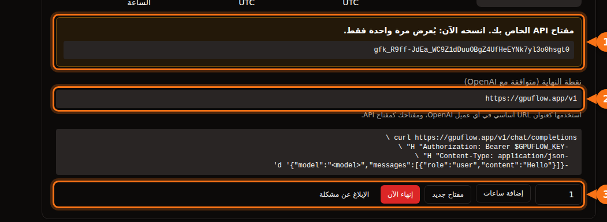

كثير من أدوات الذكاء الاصطناعي تسمح لك باستبدال OpenAI بمزوّد آخر، ما دام يدعم الـ API نفسه. وفي كل مرة تحتاج إلى الأشياء الثلاثة نفسها:

| ما تحتاج إليه | مثال |
| --- | --- |
| **العنوان الأساسي** (يُسمّى أيضاً API base أو endpoint أو host) | `https://gpuflow.app/v1` |
| **مفتاح API** | `gfk_...` |
| **اسم النموذج** | `qwen2.5:7b` |

نستخدم استئجاراً على GPUFlow مثالاً في المقال كله، لكن الخطوات نفسها تنطبق على أي خادم متوافق مع OpenAI: Ollama أو llama.cpp محلياً، وvLLM، وOpenRouter وغيرها كثير. غيّر القيم الثلاث فقط.

على GPUFlow تجد القيم الثلاث في **لوحة التحكم ← الإيجارات الحالية** بعد أن تستأجر GPU:



## قبل أن تبدأ: تحقق من نقطة الاتصال واسم النموذج

أمر واحد يخبرك بأن المفتاح يعمل وبالاسم الدقيق للنموذج:

```bash
curl https://gpuflow.app/v1/models \
  -H "Authorization: Bearer gfk_your_key"
```

تعرض الإجابة قائمة النماذج. انسخ قيمة `id`، مثل `qwen2.5:7b`، كما هي تماماً. الخطأ في اسم النموذج هو السبب الأكثر شيوعاً لرفض التطبيق العمل.

**اعرف ما تدعمه نقطة الاتصال لديك.** تقدّم نقطة اتصال GPUFlow المسارين `/v1/models` و`/v1/chat/completions`، مع البث المتدفق (streaming). ولا تقدّم embeddings ولا Responses API الأحدث ولا توليد الصور. بعض ميزات التطبيقات تحتاج إلى هذه الأشياء، وننبّه إليها أدناه.

## تطبيقات المحادثة

### Open WebUI

1. افتح **Settings → Admin → Connections**.
2. تحت **Manage OpenAI API Connections**، انقر على **+ (Add Connection)**.
3. املأ الحقول:
   - **URL:** `https://gpuflow.app/v1`
   - **API Key:** مفتاحك
4. انقر على **Verify Connection** لاختبار الاتصال (الحفظ وحده لا يختبره)، ثم على **Save**.

يقرأ Open WebUI قائمة النماذج من `/models` تلقائياً. إذا كنت تشغّله عبر Docker، يمكنك بدلاً من ذلك ضبط `OPENAI_API_BASE_URL` و`OPENAI_API_KEY`، لكنهما لا يُقرآن إلا عند أول تشغيل لـ Open WebUI. بعد ذلك غيّرهما من شاشة الإدارة.

رفع المستندات والبحث فيها في Open WebUI يعتمدان على نموذج embeddings صغير يعمل محلياً افتراضياً، لذلك يستمران في العمل. لا تغيّر محرك embeddings إلى OpenAI وتضع عنوان نقطة اتصال المحادثة عنواناً له.

### LibreChat

أضف نقطة اتصال مخصصة إلى `librechat.yaml`:

```yaml
endpoints:
  custom:
    - name: "GPUFlow"
      apiKey: "${GPUFLOW_API_KEY}"
      baseURL: "https://gpuflow.app/v1"
      models:
        default: ["qwen2.5:7b"]
        fetch: true
      titleConvo: true
      titleModel: "qwen2.5:7b"
      modelDisplayLabel: "GPUFlow"
```

ضع مفتاحك في `.env` بالصيغة `GPUFLOW_API_KEY=gfk_...`. واستخدم `apiKey: "user_provided"` إذا كان على كل مستخدم أن يُدخل مفتاحه الخاص. ومع `fetch: true` يقرأ LibreChat قائمة النماذج من نقطة الاتصال.

يستخدم البحث في المستندات في LibreChat (أي RAG API) نماذج embeddings من OpenAI افتراضياً. أبقِه على OpenAI أو Ollama أو Hugging Face، ولا توجّه `RAG_OPENAI_BASEURL` إلى نقطة اتصال للمحادثة فقط.

### AnythingLLM

1. افتح إعدادات LLM واختر **Generic OpenAI**.
2. املأ **Base URL** (`https://gpuflow.app/v1`) و**API Key** و**Chat Model Name** (`qwen2.5:7b`) و**Token context window** و**Max Tokens**.

مع Docker، الإعدادات نفسها متاحة كمتغيرات بيئة:

```bash
LLM_PROVIDER='generic-openai'
GENERIC_OPEN_AI_BASE_PATH='https://gpuflow.app/v1'
GENERIC_OPEN_AI_MODEL_PREF='qwen2.5:7b'
GENERIC_OPEN_AI_MODEL_TOKEN_LIMIT=32768
GENERIC_OPEN_AI_API_KEY=gfk_your_key
```

اترك أداة embeddings على **AnythingLLM Default**.

### Jan

1. افتح **Settings → Model Providers** وانقر على **Add Provider**.
2. اختر **OpenAI-compatible**.
3. أدخل اسماً، و**Base URL** مع `/v1` في آخره، و**API key** الخاص بك. انقر على **Create**.

يحمّل Jan قائمة النماذج عند الحفظ. إذا لم يفعل، أضف اسم النموذج يدوياً بالزر **+** في قائمة نماذج المزوّد.

## مساعدو البرمجة

### Continue (في VS Code وJetBrains)

أضف نموذجاً إلى ملف `config.yaml`:

```yaml
models:
  - name: GPUFlow Qwen 2.5 7B
    provider: openai
    model: qwen2.5:7b
    apiBase: https://gpuflow.app/v1
    apiKey: ${{ secrets.GPUFLOW_API_KEY }}
    roles:
      - chat
      - edit
      - apply
```

لا تمنحه الدورين `autocomplete` و`embed`: فنقطة الاتصال هذه لا تقدّم إلا المحادثة، والـ embeddings تحتاج إلى `/v1/embeddings`. في VS Code، لدى Continue أداة embeddings مدمجة للبحث في قاعدة الكود. أما في JetBrains فلا توجد، لذا اضبط هناك نموذج embeddings منفصلاً.

يحتاج وضع Agent في Continue إلى نموذج يتعامل مع استدعاء الأدوات (tool calls). لا تضف `capabilities: [tool_use]` إلا إذا كنت تعرف أن نموذجك يدعم ذلك.

### Cline

1. افتح إعدادات Cline.
2. اضبط **API Provider** على **OpenAI Compatible**.
3. املأ **Base URL** و**API Key** و**Model** (`qwen2.5:7b`).
4. تحت **Model Configuration**، اضبط نافذة السياق بما يطابق نموذجك.

ملاحظة عن **Roo Code**: تقول وثائقه إنه لا يعمل إلا مع النماذج التي تدعم استدعاء الأدوات الأصلي (native tool calling)، دون بديل احتياطي. لذلك قد لا تعمل معه نقطة اتصال محادثة عادية.

## الكود

### مكتبات OpenAI للغتي Python وNode

Python (`pip install openai`):

```python
from openai import OpenAI

client = OpenAI(base_url="https://gpuflow.app/v1", api_key="gfk_your_key")

reply = client.chat.completions.create(
    model="qwen2.5:7b",
    messages=[{"role": "user", "content": "Say hello in five languages."}],
)
print(reply.choices[0].message.content)
```

Node (`npm install openai`):

```js
import OpenAI from "openai";

const client = new OpenAI({ baseURL: "https://gpuflow.app/v1", apiKey: "gfk_your_key" });

const reply = await client.chat.completions.create({
  model: "qwen2.5:7b",
  messages: [{ role: "user", content: "Say hello in five languages." }],
});
console.log(reply.choices[0].message.content);
```

تقرأ المكتبتان أيضاً `OPENAI_BASE_URL` و`OPENAI_API_KEY` من البيئة. لاحظ أن ملفات README الخاصة بهما تبدأ الآن بـ `client.responses.create(...)`. هذا هو Responses API؛ استخدم `client.chat.completions.create(...)` كما في المثال أعلاه.

### LangChain

Python (`pip install -U langchain-openai`):

```python
from langchain_openai import ChatOpenAI

llm = ChatOpenAI(
    model="qwen2.5:7b",
    base_url="https://gpuflow.app/v1",
    api_key="gfk_your_key",
    use_responses_api=False,
)
print(llm.invoke("Name three uses for a GPU.").content)
```

JavaScript (`npm install @langchain/openai @langchain/core`). اضبط مفتاحك في البيئة أولاً، `export OPENAI_API_KEY=gfk_your_key`، ثم:

```js
import { ChatOpenAI } from "@langchain/openai";

const llm = new ChatOpenAI({
  model: "qwen2.5:7b",
  configuration: { baseURL: "https://gpuflow.app/v1" },
});
```

ينتقل LangChain إلى Responses API عندما تستخدم ميزات معيّنة، مثل الأدوات المدمجة أو مخرجات الاستدلال (reasoning). الخيار `use_responses_api=False` يبقيه على Chat Completions.

### LlamaIndex

استخدم `OpenAILike` (`pip install llama-index-llms-openai-like`):

```python
from llama_index.llms.openai_like import OpenAILike

llm = OpenAILike(
    model="qwen2.5:7b",
    api_base="https://gpuflow.app/v1",
    api_key="gfk_your_key",
    context_window=32768,
    is_chat_model=True,
    is_function_calling_model=False,
)
```

**اضبط `is_chat_model=True`.** قيمته الافتراضية `False`، وهي ترسل الطلبات إلى `/v1/completions` بدلاً من `/v1/chat/completions`. ولفهرسة المستندات، اضبط `Settings.embed_model` على نموذج embeddings حقيقي؛ إذ يستخدم LlamaIndex نماذج embeddings من OpenAI افتراضياً.

## أدوات لن تعمل مع نقطة اتصال للمحادثة فقط

- **Codex CLI.** أوقف دعم Chat Completions في أوائل 2026، وأصبح لا يقبل إلا Responses API.
- **OpenAI Agents SDK.** يستخدم Responses API افتراضياً. استدعِ `set_default_openai_api("chat_completions")`، أو غلّف العميل في `OpenAIChatCompletionsModel`، وأوقف التتبّع بـ `set_tracing_disabled(True)`، لأن التتبّع يحتاج إلى مفتاح OpenAI.
- **أي شيء يحتاج إلى embeddings** من نقطة الاتصال نفسها: البحث في المستندات، و"المحادثة مع ملفاتك"، والبحث الدلالي في الكود. استخدم أداة embeddings المدمجة في التطبيق أو مزوّد embeddings منفصلاً.

## إذا استمرت المشكلة

| ما تراه | السبب المعتاد |
| --- | --- |
| `404` أو "not found" | العنوان الأساسي ينقصه `/v1`، أو أن التطبيق يضيف `/v1` بنفسه فأضفته أنت مرتين. |
| `401` أو `invalid_api_key` | المفتاح خاطئ، أو انتهى الاستئجار. على GPUFlow، انقر على **مفتاح جديد** في الإيجارات الحالية إذا أضعت المفتاح. |
| "Model not found" | اسم النموذج لا يطابق `/v1/models` تماماً. |
| الطلبات إلى `/v1/completions` أو `/v1/responses` تفشل | التطبيق يستخدم API مختلفاً. ابحث عن إعداد باسم "chat model" أو "chat completions". |

## مقالات ذات صلة

- [GPU بالساعة أم API بالتوكن؟ التكلفة الحقيقية لتشغيل نموذج 7B–8B](/ar/hourly-gpu-vs-per-token-api/)
- [GPUFlow أم Vast.ai أم RunPod أم SaladCloud: أيها يناسب عملك](/ar/gpuflow-vs-vast-ai-vs-runpod/)

## المصادر

راجعناها كلها في سبتمبر 2026.

- Open WebUI: [المزوّدون المتوافقون مع OpenAI](https://docs.openwebui.com/getting-started/quick-start/connect-a-provider/starting-with-openai-compatible/)، [متغيرات البيئة](https://docs.openwebui.com/reference/env-configuration)
- LibreChat: [نقاط الاتصال المخصصة](https://www.librechat.ai/docs/configuration/librechat_yaml/object_structure/custom_endpoint)، [RAG API](https://www.librechat.ai/docs/configuration/rag_api)
- AnythingLLM: [Generic OpenAI](https://docs.anythingllm.com/setup/llm-configuration/cloud/openai-generic)
- Jan: [نقاط الاتصال المخصصة](https://www.jan.ai/docs/desktop/remote-models/custom-endpoint)
- Continue: [مزوّد OpenAI](https://docs.continue.dev/customize/model-providers/top-level/openai)، [مرجع الإعدادات](https://docs.continue.dev/reference)
- Cline: [OpenAI Compatible](https://docs.cline.bot/provider-config/openai-compatible)؛ Roo Code: [OpenAI Compatible](https://roocodeinc.github.io/Roo-Code/providers/openai-compatible/)
- مكتبات OpenAI: [openai-python](https://github.com/openai/openai-python)، [openai-node](https://github.com/openai/openai-node)
- LangChain: [Python](https://docs.langchain.com/oss/python/integrations/chat/openai)، [JavaScript](https://docs.langchain.com/oss/javascript/integrations/chat/openai)
- LlamaIndex: [OpenAILike](https://developers.llamaindex.ai/python/framework-api-reference/llms/openai_like/)
- OpenAI Agents SDK: [النماذج](https://openai.github.io/openai-agents-python/models/)
- Codex وChat Completions: [github.com/openai/codex/discussions/7782](https://github.com/openai/codex/discussions/7782)
- GPUFlow API: [استخدام مفتاح API](https://docs.gpuflow.app/ar/renters/api-quickstart/)
