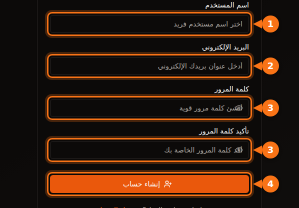
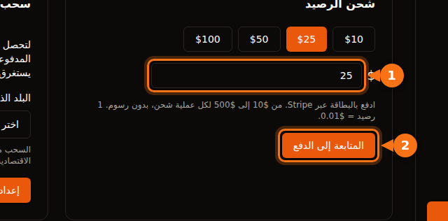

قبل أن تستأجر أول GPU، تطلب منك كل منصة شيئاً ما: عنوان بريد إلكتروني، وبطاقة، وأحياناً رقم هاتف، وعلى السحابات الكبرى طلب حصة قد يستغرق أياماً. يسرد هذا المقال ما تطلبه كل منصة، لتختار واحدة تتيح لك البدء اليوم.

راجعنا كل شيء في سبتمبر 2026 على وثائق المنصات نفسها. والمصادر في آخر المقال.

## مقارنة سريعة

| المنصة | لإنشاء حساب | قبل أن تستأجر | التحقق من هوية المستأجرين | الحد الأدنى للبدء |
| --- | --- | --- | --- | --- |
| **GPUFlow** | بريد إلكتروني وكلمة مرور، أو Google أو GitHub | تأكيد البريد الإلكتروني، وشحن الرصيد بالبطاقة | لا يوجد في خطوات المستأجر | شحن بقيمة $10، دون رسوم |
| **Vast.ai** | بريد إلكتروني | تأكيد البريد الإلكتروني، وإضافة رصيد | غير مذكور في الوثائق | إيداع $5 |
| **RunPod** | بريد إلكتروني | إضافة رصيد | فقط قبل أول دفعة بالعملات المشفرة | رصيد ساعة واحدة؛ $100 لكل عملية بالبطاقة مسبقة الدفع |
| **SaladCloud** | حساب على البوابة | إضافة وسيلة فوترة إلى مؤسستك | غير مذكور في الوثائق | الشحن من $5 |
| **Lambda** | حساب | إضافة بطاقة ائتمان | غير مذكور في الوثائق | تفويض مسبق بقيمة $10 على البطاقة، يُعاد لاحقاً |
| **TensorDock** | حساب | إيداع مبلغ | تسمح الشروط بالتحقق من الحسابات | "ابتداءً من $5 فقط" |
| **AWS** | بريد إلكتروني، والتحقق من الهاتف برمز PIN، ووسيلة دفع، وCAPTCHA | طلب حصة GPU: الحسابات الجديدة تبدأ من 0 | ليس لمعظم الحسابات | الدفع حسب الاستخدام |
| **Google Cloud** | حساب مع فوترة مفعّلة | طلب حصة GPU؛ حسابات الفترة التجريبية المجانية لا تحصل على أي حصة | ليس لمعظم الحسابات | الدفع حسب الاستخدام |

"غير مذكور في الوثائق" يعني أننا لم نجد في وثائق المنصة شرطاً للتحقق من هوية المستأجرين. ومع ذلك قد تطلب المنصات التحقق إذا بدا شيء غير معتاد.

## المنصات الصغيرة: دقائق لا أيام

Vast.ai وRunPod وSaladCloud وTensorDock وGPUFlow كلها تعمل بالدفع المسبق. تضيف المال أولاً ثم تنفقه بالثانية أو بالدقيقة. ولأنك لا تستطيع مراكمة فاتورة لم تدفعها، فهي لا تحتاج إلى التحقق من ملاءتك الائتمانية أو من شركتك.

أما ما تختلف فيه:

- **تأكيد البريد الإلكتروني.** تشترطه Vast.ai وGPUFlow كلتاهما قبل أن تستأجر أو تشحن رصيداً. تحقق من مجلد الرسائل غير المرغوب فيها إذا لم تصلك الرسالة.
- **وسائل الدفع.**
  - Vast.ai: بطاقة، BitPay، Crypto.com.
  - RunPod: Visa وMastercard وAmex والعملات المشفرة، والدفع بالفواتير لما يزيد على $5,000.
  - SaladCloud: بطاقة، أو USDC وUSDT وRENDER على شبكة Solana.
  - Lambda: بطاقات الائتمان الرئيسية فقط، وفي البلدان المدعومة فقط.
  - GPUFlow: البطاقات عبر Stripe.
- **مصير مالك إذا لم تستخدمه.** تنتهي صلاحية رصيد SaladCloud بعد 12 شهراً من الشراء. أما رصيد GPUFlow فلا تنتهي صلاحيته.

## السحابات الكبرى: خطّط لطلب حصة

لا توقفك AWS وGoogle Cloud عند التسجيل، بل عندما تطلب GPU.

- **AWS:** حصة "Running On-Demand G and VT instances" (فئة المثيلات التي تضم NVIDIA L4 وA10G) تبدأ من **0 vCPU** في الحسابات الجديدة. تطلب زيادتها من وحدة تحكم Service Quotas. وترفع AWS الحصص تلقائياً أيضاً كلما تراكم استخدام الحساب.
- **Google Cloud:** حسابات الفترة التجريبية المجانية لا تحصل على حصة GPU. وبعد أن يصبح للمشروع سجل فوترة، تُقبل طلبات الحصص بسهولة أكبر. والحصة محددة لكل منطقة، ووحدات GPU القابلة للمقاطعة (preemptible) تحتاج إلى حصة خاصة بها.

إذا كنت تحتاج إلى GPU اليوم، فلا تبدأ بحساب جديد على AWS أو Google Cloud.

## التسجيل في GPUFlow خطوة بخطوة

صُمّم GPUFlow لحالة "أحتاج إلى نموذج ذكاء اصطناعي خلال خمس دقائق". ما تحصل عليه هو مفتاح API متوافق مع OpenAI لوحدة GPU، لا جهاز.

1. **أنشئ حساباً** على gpuflow.app باسم مستخدم وعنوان بريدك الإلكتروني وكلمة مرور، أو باستخدام Google أو GitHub.

   

2. **أكّد بريدك الإلكتروني.** انقر على الرابط في الرسالة التي يرسلها إليك GPUFlow. لا يمكنك شحن الرصيد قبل ذلك.
3. **اشحن رصيدك** من **لوحة التحكم ← المدفوعات**، بمبلغ من $10 إلى $500 بالبطاقة عبر Stripe. ‏1 رصيد = $0.01، ولا توجد رسوم.

   

4. **استأجر GPU** لعدد الساعات الذي تريده، وانسخ مفتاح API. [تدفع بالثانية](/ar/per-second-vs-hourly-gpu-billing/)؛ وإذا أنهيت مبكراً، يعود الباقي إلى رصيدك.

الشرح الكامل مع كل الشاشات موجود في الوثائق: [استأجر GPU خطوة بخطوة](https://docs.gpuflow.app/ar/renters/getting-started/).

## إذا كنت تريد تأجير GPU بدلاً من ذلك

عند تلقّي الأموال يأتي دور التحقق من الهوية. فشركات الدفع ملزمة بمعرفة من ترسل إليه المال.

- **GPUFlow:** لتسحب أرباحك، تُعدّ حساب سحب لدى Stripe، التي تتحقق من هويتك وتطلب بياناتك المصرفية. يتوفر السحب في الولايات المتحدة وكندا والمملكة المتحدة وسويسرا والمنطقة الاقتصادية الأوروبية.
- **Vast.ai:** يتلقى المضيفون أموالهم عبر Wise أو PayPal أو Stripe، وهذه الخدمات تتولى التحقق من الهوية.
- **Salad:** تُصرف المكافآت عبر PayPal وبطاقات الهدايا وخيارات أخرى.

المزيد عمّا تدرّه الاستضافة في [كم تربح من تأجير بطاقة الرسومات](/ar/how-much-can-you-earn-renting-out-your-gpu/).

## قبل أن تدفع: قائمة تحقق قصيرة

1. **أكّد بريدك الإلكتروني أولاً**، حتى لا تتعطل عند خطوة الدفع.
2. **تحقق من أن بلدك وبطاقتك مدعومان.** Lambda مثلاً لا تقبل الدفع إلا من قائمة محددة من البلدان.
3. **اعرف رسوم المعاملات الأجنبية لدى مصرفك.** معظم المنصات تتقاضى بالدولار الأمريكي. [المزيد عن التكاليف الخفية](/ar/hidden-fees-in-gpu-rental/).
4. **ابدأ بمبلغ صغير.** أضف ما يكفي لبضع ساعات، واختبر، ثم أضف المزيد.

## مقالات ذات صلة

- [GPUFlow أم Vast.ai أم RunPod أم SaladCloud: أيها يناسب عملك](/ar/gpuflow-vs-vast-ai-vs-runpod/)
- [كيف تستخدم مفتاح API متوافقاً مع OpenAI في Open WebUI وContinue وLangChain وغيرها](/ar/use-openai-compatible-api-key-in-apps/)

## المصادر

راجعناها كلها في سبتمبر 2026.

- GPUFlow: [استأجر GPU خطوة بخطوة](https://docs.gpuflow.app/ar/renters/getting-started/)، [الرصيد والفوترة](https://docs.gpuflow.app/ar/renters/billing/)، [الحصول على الأرباح](https://docs.gpuflow.app/ar/providers/getting-paid/)
- Vast.ai: [البدء السريع](https://docs.vast.ai/guides/get-started/quickstart.md)، [الفوترة](https://docs.vast.ai/documentation/reference/billing)، [مدفوعات المضيفين](https://docs.vast.ai/host/payment.md)
- RunPod: [معلومات الفوترة](https://docs.runpod.io/references/billing-information)
- SaladCloud: [إعداد الحساب](https://docs.salad.com/general/tutorials/account-setup.md)، [الفوترة](https://docs.salad.com/general/explanation/billing.md)
- Lambda: [إدارة الفوترة](https://docs.lambda.ai/public-cloud/manage-billing/)
- TensorDock: [وحدات GPU السحابية](https://www.tensordock.com/cloud-gpus.html)، [شروط الخدمة](https://docs.tensordock.com/legal-information/terms-of-service-tos)
- AWS: [إنشاء حساب](https://docs.aws.amazon.com/accounts/latest/reference/manage-acct-creating.html)، [حصص مثيلات On-Demand](https://docs.aws.amazon.com/AWSEC2/latest/UserGuide/ec2-on-demand-instances.html)
- Google Cloud: [حل مشكلات حصص GPU](https://docs.cloud.google.com/deep-learning-vm/docs/troubleshooting)
- مكافآت Salad: [الاسترداد عبر PayPal](https://support.salad.com/rewards/redeeming-your-rewards/how-to-redeem-paypal/)
