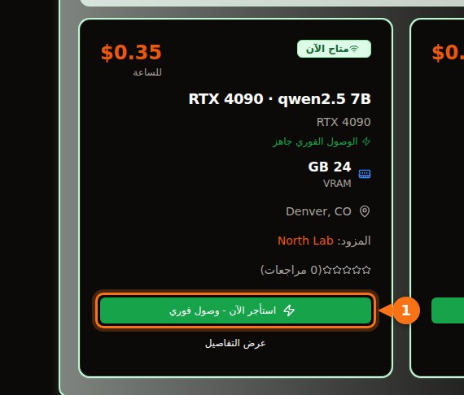

بتكميم 4-bit الذي يأتي به Ollama افتراضياً، يحتاج نموذج 7B أو 8B إلى بطاقة 8 GB، وتحتاج نماذج 12B إلى 14B إلى 12 GB (أو 16 GB إذا أردت موجّهات طويلة)، وتحتاج نماذج 27B إلى 32B إلى 24 GB. أما نموذج 70B بتكميم 4-bit فحجمه 43 GB، أي أنه يحتاج إلى 48 GB من VRAM أو أكثر.

التفاصيل مهمة لأن حجم التنزيل ليس كل الحساب. السياق الذي تستخدمه يستهلك ذاكرة أيضاً، والنموذج الذي يبدو أنه يتسع قد ينتهي به الأمر نصفه على المعالج المركزي وأبطأ بعدة مرات. فيما يلي المعادلة التي أستخدمها، ومعنى تسميات التكميم، وجدول بالنماذج المفتوحة الحالية وأحجام تنزيلها الحقيقية من مكتبة Ollama. راجعت الأحجام والمواصفات في سبتمبر 2026، والمصادر في آخر المقال.

## الإجابة السريعة حسب حجم VRAM

| VRAM | بطاقات نموذجية | ما يعمل بالكامل على GPU ‏(4-bit) |
| --- | --- | --- |
| 8 GB | RTX 4060، RTX 5060، RTX 3070 | نماذج 7B إلى 8B: ‏Llama 3.1 8B وQwen3 8B وMistral 7B |
| 12 GB | RTX 3060 12 GB، RTX 4070، RTX 5070 | نماذج 12B إلى 14B بسياق قصير؛ و7B إلى 8B بصيغة Q8_0 |
| 16 GB | RTX 4060 Ti 16 GB، RTX 4080، RTX 5080 | 14B بسياق طويل، وgpt-oss 20B |
| 24 GB | RTX 3090، RTX 4090 | من 24B إلى 32B: ‏Mistral Small 3.2 وGemma 3 27B وQwen3 32B |
| 32 GB | RTX 5090 | 32B بسياق طويل، ونماذج مزيج الخبراء (MoE) بحجم 35B |
| 48 إلى 80 GB | L40S ‏(48 GB)، H100 ‏(80 GB) | 70B بتكميم 4-bit، وgpt-oss 120B على 80 GB |

أحجام ذاكرة البطاقات مأخوذة من صفحات المواصفات لدى NVIDIA. بعض البطاقات تأتي بنسختين: RTX 3060 موجودة بذاكرة 12 GB و8 GB، وRTX 4060 Ti وRTX 5060 Ti بذاكرة 16 GB و8 GB. تأكد من النسخة التي تشتريها أو تستأجرها.

## كيف تقدّر مقدار VRAM الذي يحتاجه النموذج

ثلاثة أشياء تشغل ذاكرة GPU بينما يجيبك النموذج:

1. **الأوزان.** عدد المعاملات × البتات لكل وزن ÷ 8 = عدد البايتات.
2. **ذاكرة KV المؤقتة (KV cache).** يحتفظ النموذج بالمفاتيح والقيم لكل توكن في المحادثة حتى لا يعيد حسابها. لكل توكن يساوي ذلك 2 × عدد الطبقات × عدد رؤوس KV × حجم الرأس × 2 بايت (مع الذاكرة الافتراضية بدقة 16 بت). اضرب الناتج في طول السياق.
3. **الحمل الإضافي.** سياق CUDA ومخازن العمل المؤقتة وبيئة التشغيل نفسها. أحسب له نحو 1 GB. يختلف حسب المحرك والإعدادات، فاعتبره قاعدة تقريبية لا مواصفة.

تجد عدد الطبقات والرؤوس في ملف `config.json` لكل نموذج على Hugging Face.

### مثال محسوب: Qwen 2.5 14B على بطاقة 16 GB

لدى Qwen 2.5 14B ‏14.7 مليار معامل، و48 طبقة، و8 رؤوس KV، وحجم رأس 128 (حجم مخفي 5,120 ÷ 40 رأس انتباه).

- **الأوزان بصيغة Q4_K_M:** يذكر llama.cpp أن Q4_K_M يستخدم نحو 4.89 بت لكل وزن. ‏14.7 مليار × 4.89 ÷ 8 = 8.99 GB. حجم تنزيل `qwen2.5:14b` في Ollama هو 9.0 GB، فالحساب يطابق الملف الحقيقي.
- **ذاكرة KV لكل توكن:** ‏2 × 48 × 8 × 128 × 2 بايت = 196,608 بايت، أي نحو 0.2 MB.
- **ذاكرة KV للسياق كله:** ‏4,096 توكن = 0.8 GB. ‏16,384 توكن = 3.2 GB. ‏32,768 توكن = 6.4 GB.
- **المجموع:** ‏9.0 + 0.8 + 1 = 10.8 GB بسياق 4K. ‏9.0 + 3.2 + 1 = 13.2 GB بسياق 16K. ‏9.0 + 6.4 + 1 = 16.4 GB بسياق 32K، وهذا لم يعد يتسع في بطاقة 16 GB.

<figure>
<svg viewBox="0 0 720 340" role="img" aria-labelledby="d1-title" xmlns="http://www.w3.org/2000/svg" font-family="system-ui, sans-serif" font-size="15">
<title id="d1-title">ما يملأ VRAM عند تشغيل Qwen 2.5 14B بصيغة Q4_K_M على بطاقة 16 GB: الأوزان، وذاكرة KV بثلاثة أطوال للسياق، والحمل الإضافي</title>
<rect x="0" y="0" width="720" height="340" fill="#ffffff"/>
<rect x="150" y="20" width="16" height="16" rx="3" fill="#6366f1"/>
<text x="172" y="33" fill="#1e1b4b" text-anchor="end" direction="rtl">الأوزان 9.0 GB</text>
<rect x="330" y="20" width="16" height="16" rx="3" fill="#a5b4fc"/>
<text x="352" y="33" fill="#1e1b4b" text-anchor="end" direction="rtl">ذاكرة KV</text>
<rect x="510" y="20" width="16" height="16" rx="3" fill="#e2e8f0"/>
<text x="532" y="33" fill="#1e1b4b" text-anchor="end" direction="rtl">الحمل الإضافي ~1 GB</text>
<line x1="582.0" y1="66" x2="582.0" y2="278" stroke="#f97316" stroke-width="2" stroke-dasharray="5 4"/>
<text x="576.0" y="60" text-anchor="start" fill="#f97316" font-weight="600" direction="rtl">بطاقة 16 GB</text>
<text x="140" y="106" text-anchor="start" fill="#1e1b4b" direction="rtl">سياق 4K</text>
<rect x="150" y="80" width="243.0" height="40" fill="#6366f1"/>
<text x="271.5" y="106" text-anchor="middle" fill="#ffffff" direction="rtl">الأوزان</text>
<rect x="393.0" y="80" width="21.6" height="40" fill="#a5b4fc"/>
<rect x="414.6" y="80" width="27.0" height="40" fill="#e2e8f0"/>
<text x="449.6" y="106" fill="#16a34a" font-weight="600">10.8 GB</text>
<text x="140" y="180" text-anchor="start" fill="#1e1b4b" direction="rtl">سياق 16K</text>
<rect x="150" y="154" width="243.0" height="40" fill="#6366f1"/>
<text x="271.5" y="180" text-anchor="middle" fill="#ffffff" direction="rtl">الأوزان</text>
<rect x="393.0" y="154" width="86.4" height="40" fill="#a5b4fc"/>
<text x="436.2" y="180" text-anchor="middle" fill="#1e1b4b">3.2</text>
<rect x="479.4" y="154" width="27.0" height="40" fill="#e2e8f0"/>
<text x="514.4" y="180" fill="#16a34a" font-weight="600">13.2 GB</text>
<text x="140" y="254" text-anchor="start" fill="#1e1b4b" direction="rtl">سياق 32K</text>
<rect x="150" y="228" width="243.0" height="40" fill="#6366f1"/>
<text x="271.5" y="254" text-anchor="middle" fill="#ffffff" direction="rtl">الأوزان</text>
<rect x="393.0" y="228" width="172.8" height="40" fill="#a5b4fc"/>
<text x="479.4" y="254" text-anchor="middle" fill="#1e1b4b">6.4</text>
<rect x="565.8" y="228" width="27.0" height="40" fill="#e2e8f0"/>
<text x="600.8" y="254" fill="#f97316" font-weight="600">16.4 GB</text>
<line x1="150" y1="278" x2="690" y2="278" stroke="#64748b"/>
<line x1="150.0" y1="278" x2="150.0" y2="283" stroke="#64748b"/>
<text x="150.0" y="300" text-anchor="middle" fill="#64748b">0</text>
<line x1="258.0" y1="278" x2="258.0" y2="283" stroke="#64748b"/>
<text x="258.0" y="300" text-anchor="middle" fill="#64748b">4</text>
<line x1="366.0" y1="278" x2="366.0" y2="283" stroke="#64748b"/>
<text x="366.0" y="300" text-anchor="middle" fill="#64748b">8</text>
<line x1="474.0" y1="278" x2="474.0" y2="283" stroke="#64748b"/>
<text x="474.0" y="300" text-anchor="middle" fill="#64748b">12</text>
<line x1="582.0" y1="278" x2="582.0" y2="283" stroke="#64748b"/>
<text x="582.0" y="300" text-anchor="middle" fill="#64748b">16</text>
<line x1="690.0" y1="278" x2="690.0" y2="283" stroke="#64748b"/>
<text x="690.0" y="300" text-anchor="middle" fill="#64748b">20</text>
<text x="420.0" y="326" text-anchor="middle" fill="#64748b" direction="rtl">VRAM بوحدة GB</text>
</svg>
<figcaption>‏Qwen 2.5 14B بصيغة Q4_K_M على بطاقة 16 GB. تبقى الأوزان عند 9.0 GB، وتكبر ذاكرة KV مع السياق حتى يتجاوز المجموع 16 GB عند 32K توكن. الحمل الإضافي قاعدة تقريبية بمقدار 1 GB.</figcaption>
</figure>

ينتج عن ذلك أمران. الأول أن السياق الذي تحدده قد يكلّف من الذاكرة بقدر ما يكلّف النموذج نفسه. يحتاج Llama 3.1 8B ‏(32 طبقة، و8 رؤوس KV، وحجم رأس 128) إلى 131,072 بايت من ذاكرة KV لكل توكن، فسياقه الكامل البالغ 128K يحتاج إلى 17.2 GB لذاكرة KV وحدها، أي نحو ثلاثة أضعاف ونصف حجم تنزيله البالغ 4.9 GB. والثاني أن حجم ذاكرة KV لكل توكن يختلف كثيراً من نموذج إلى آخر. لدى Qwen 2.5 7B أربعة رؤوس KV فقط و28 طبقة، فيحتاج إلى 57,344 بايت لكل توكن، أي أقل من نصف ما يحتاجه Llama 3.1 8B. راجع ملف الإعدادات قبل أن تفترض شيئاً.

### ما يفعله Ollama بالسياق افتراضياً

يختار Ollama طول السياق الافتراضي حسب VRAM الذي يجده: ‏4K توكن تحت 24 GiB، و32K توكن من 24 إلى 48 GiB، و256K من 48 GiB فما فوق. يمكنك تغييره بمتغير البيئة `OLLAMA_CONTEXT_LENGTH`، ويعرض `ollama ps` السياق المخصص فعلاً في عمود CONTEXT. وهناك إعدادان آخران يغيّران الحساب:

- `OLLAMA_NUM_PARALLEL` (القيمة الافتراضية 1): تقول وثائق Ollama إن الطلبات المتوازية تزيد حجم السياق بعدد الطلبات المتوازية. أربع خانات متوازية تعني أربعة أضعاف ذاكرة KV.
- `OLLAMA_KV_CACHE_TYPE`: ‏`q8_0` يستخدم نحو نصف ذاكرة الإعداد الافتراضي `f16`، و`q4_0` نحو الربع. ويتطلب ذلك تفعيل flash attention.

## ماذا تعني مستويات التكميم

تُنشر النماذج المفتوحة بدقة 16 بت (ملفات الإعدادات المذكورة أدناه تذكر bfloat16)، أي بايتان لكل معامل. التكميم يخزّن الأوزان بعدد أقل من البتات. في ملفات GGUF، وهي الصيغة التي يستخدمها Ollama وllama.cpp، تعني التسميات تقريباً ما يلي:

| التسمية | بت لكل وزن | حجم Llama 3.1 8B | الحيرة على Llama 3 8B (الأقل أفضل) |
| --- | --- | --- | --- |
| F16 | 16.0 | 14.96 GiB | 6.233 |
| Q8_0 | 8.50 | 7.95 GiB | 6.234 |
| Q6_K | 6.56 | 6.14 GiB | 6.253 |
| Q5_K_M | 5.70 | 5.33 GiB | 6.289 |
| Q4_K_M | 4.89 | 4.58 GiB | 6.407 |
| Q3_K_M | 4.00 | 3.74 GiB | 6.888 |
| Q2_K_S / Q2_K | 2.97 | 2.78 GiB | 9.752 ‏(Q2_K) |

البتات لكل وزن والأحجام مأخوذة من ملف README الخاص بأداة quantize في llama.cpp ‏(Llama 3.1 8B). والحيرة مأخوذة من ملف README الخاص بأداة perplexity في llama.cpp ‏(Llama 3 8B، على Wikitext). أنواع "K" هي k-quants في llama.cpp، وهي تمزج بين مستويات دقة مختلفة داخل النموذج؛ و`_S` و`_M` و`_L` تعني مزيجاً صغيراً ومتوسطاً وكبيراً.

ما تقوله الأرقام: Q8_0 بلا خسارة عملياً (حيرة 6.234 مقابل 6.233). ‏Q4_K_M يكلّف نحو 3% في الحيرة، ويذكر ملف README نفسه أن التوكن التالي الأرجح لديه يطابق النموذج بالدقة الكاملة في 91.9% من الحالات. ‏Q3 أسوأ بشكل ملحوظ، وQ2 ينهار.

الحيرة ليست هي نفسها الفائدة العملية، ولذلك من المفيد أن دراسة نشرها Uygar Kurt في يناير 2026 أخضعت Llama 3.1 8B Instruct لاختبارات في الاستدلال والمعرفة واتباع التعليمات والصدق عند كل مستوى من مستويات llama.cpp. كان المتوسط غير الموزون 69.47 عند F16، و69.41 عند Q8_0، و69.36 عند Q5_K_M، و69.15 عند Q4_K_M. لهذا السبب يعتمد الجميع تقريباً، ومنهم Ollama، على Q4_K_M افتراضياً: الملف أقل من ثلث حجم FP16، مقابل خسارة نادراً ما تلاحظها. في Ollama، الوسم المختصر هو نسخة 4-bit هذه: ‏`qwen3:8b` و`qwen3:8b-q4_K_M` كلاهما 5.2 GB، و`phi4:14b` و`phi4:14b-q4_K_M` كلاهما 9.1 GB.

قاعدتي: اختر أكبر نموذج يتسع بصيغة Q4_K_M قبل أن تختار نموذجاً أصغر بصيغة Q8_0. نموذج 14B بصيغة Q4 يتفوق عادةً على نموذج 7B بصيغة Q8، والملفان متقاربان في الحجم. انتقل إلى Q5 أو Q8 عندما تتبقى لديك ذاكرة وتكون المهمة حساسة للأخطاء الصغيرة، مثل كتابة الكود أو الاستخراج الدقيق.

تتضمن وسوم Ollama الأحدث أيضاً صيغاً مثل `qat` (نسخ Gemma المدرَّبة مع مراعاة التكميم) و`nvfp4` و`mxfp8`. أما gpt-oss فتنشره OpenAI نفسها بصيغة MXFP4، بمعدل 4.25 بت لكل معامل لأوزان مزيج الخبراء.

## أي النماذج تتسع: الأحجام وفئات VRAM

يعرض الجدول النماذج المفتوحة الحالية في مكتبة Ollama حتى سبتمبر 2026 مع أحجام تنزيلها. عمود "4-bit" هو حجم الوسم الافتراضي. في معظم النماذج هو الملف نفسه الذي يحمل الوسم `q4_K_M`؛ وحيث يكون الافتراضي نسخة مختلفة، يذكر الجدول الحجمين (الافتراضي في Mistral Nemo حجمه 7.1 GB، و`q4_K_M` حجمه 7.5 GB). "أصغر بطاقة" تعني أن النموذج مع نحو 1 GB من الحمل الإضافي وسياق من 4K إلى 8K يتسع بالكامل على GPU. تريد سياقاً طويلاً؟ اصعد فئة واحدة.

| النموذج | وسم Ollama | الحجم بـ 4-bit | الحجم بـ Q8_0 | أصغر بطاقة (4-bit / Q8_0) |
| --- | --- | --- | --- | --- |
| Mistral 7B v0.3 | [`mistral:7b`](https://ollama.com/library/mistral/tags) | 4.4 GB | 7.7 GB | 8 GB / 12 GB |
| Qwen 2.5 7B | [`qwen2.5:7b`](https://ollama.com/library/qwen2.5/tags) | 4.7 GB | 8.1 GB | 8 GB / 12 GB |
| DeepSeek-R1 المقطَّر 7B ‏(Qwen 2.5) | [`deepseek-r1:7b`](https://ollama.com/library/deepseek-r1/tags) | 4.7 GB | لم نتحقق منه | 8 GB |
| Llama 3.1 8B | [`llama3.1:8b`](https://ollama.com/library/llama3.1/tags) | 4.9 GB | 8.5 GB | 8 GB / 12 GB |
| Qwen3 8B | [`qwen3:8b`](https://ollama.com/library/qwen3/tags) | 5.2 GB | 8.9 GB | 8 GB / 12 GB |
| DeepSeek-R1-0528 ‏(Qwen3 8B) | [`deepseek-r1:8b`](https://ollama.com/library/deepseek-r1/tags) | 5.2 GB | لم نتحقق منه | 8 GB |
| Qwen3.5 9B | [`qwen3.5:9b`](https://ollama.com/library/qwen3.5/tags) | 6.6 GB | 11 GB | 8 GB بسياق قصير فقط / 16 GB |
| Mistral Nemo 12B | [`mistral-nemo:12b`](https://ollama.com/library/mistral-nemo/tags) | 7.1 GB ‏(q4_K_M: ‏7.5 GB) | 13 GB | 12 GB / 16 GB |
| Gemma 4 12B | [`gemma4:12b`](https://ollama.com/library/gemma4/tags) | 7.6 GB | 13 GB | 12 GB / 16 GB |
| Gemma 3 12B | [`gemma3:12b`](https://ollama.com/library/gemma3/tags) | 8.1 GB | 13 GB | 12 GB / 16 GB |
| Qwen 2.5 14B | [`qwen2.5:14b`](https://ollama.com/library/qwen2.5/tags) | 9.0 GB | 16 GB | 12 GB / 24 GB |
| DeepSeek-R1 المقطَّر 14B ‏(Qwen 2.5) | [`deepseek-r1:14b`](https://ollama.com/library/deepseek-r1/tags) | 9.0 GB | لم نتحقق منه | 12 GB |
| Phi-4 14B | [`phi4:14b`](https://ollama.com/library/phi4/tags) | 9.1 GB | 16 GB | 12 GB / 24 GB |
| Qwen3 14B | [`qwen3:14b`](https://ollama.com/library/qwen3/tags) | 9.3 GB | 16 GB | 12 GB / 24 GB |
| gpt-oss 20B ‏(MoE) | [`gpt-oss:20b`](https://ollama.com/library/gpt-oss/tags) | 14 GB ‏(MXFP4) | لا ينطبق | 16 GB |
| Mistral Small 3.2 24B | [`mistral-small3.2:24b`](https://ollama.com/library/mistral-small3.2/tags) | 15 GB | 26 GB | 24 GB / 32 GB |
| Gemma 3 27B | [`gemma3:27b`](https://ollama.com/library/gemma3/tags) | 17 GB | 30 GB | 24 GB / 48 GB |
| Qwen3.5 27B | [`qwen3.5:27b`](https://ollama.com/library/qwen3.5/tags) | 17 GB | 30 GB | 24 GB / 48 GB |
| Qwen3.6 27B | [`qwen3.6:27b`](https://ollama.com/library/qwen3.6/tags) | 18 GB ‏(q4_K_M: ‏17 GB) | 30 GB | 24 GB / 48 GB |
| Gemma 4 26B ‏(MoE، ‏3.8B نشطة) | [`gemma4:26b`](https://ollama.com/library/gemma4/tags) | 19 GB ‏(q4_K_M: ‏18 GB) | 28 GB | 24 GB / 32 GB |
| Qwen3 30B-A3B ‏(MoE) | [`qwen3:30b`](https://ollama.com/library/qwen3/tags) | 19 GB | لم نتحقق منه | 24 GB |
| Gemma 4 31B | [`gemma4:31b`](https://ollama.com/library/gemma4/tags) | 20 GB | 34 GB | 24 GB / 48 GB |
| Qwen3 32B | [`qwen3:32b`](https://ollama.com/library/qwen3/tags) | 20 GB | 35 GB | 24 GB / 48 GB |
| Qwen 2.5 32B | [`qwen2.5:32b`](https://ollama.com/library/qwen2.5/tags) | 20 GB | 35 GB | 24 GB / 48 GB |
| DeepSeek-R1 المقطَّر 32B ‏(Qwen 2.5) | [`deepseek-r1:32b`](https://ollama.com/library/deepseek-r1/tags) | 20 GB | لم نتحقق منه | 24 GB |
| Qwen3.6 35B-A3B ‏(MoE) | [`qwen3.6:35b`](https://ollama.com/library/qwen3.6/tags) | 23 GB ‏(q4_K_M: ‏24 GB) | 39 GB | 32 GB / 48 GB |
| Qwen3.5 35B-A3B ‏(MoE) | [`qwen3.5:35b`](https://ollama.com/library/qwen3.5/tags) | 24 GB | 39 GB | 32 GB / 48 GB |
| Llama 3.3 70B | [`llama3.3:70b`](https://ollama.com/library/llama3.3/tags) | 43 GB | 75 GB | 48 GB بالكاد / 80 GB بالكاد |
| Qwen 2.5 72B | [`qwen2.5:72b`](https://ollama.com/library/qwen2.5/tags) | 47 GB | لم نتحقق منه | 80 GB |
| gpt-oss 120B ‏(MoE) | [`gpt-oss:120b`](https://ollama.com/library/gpt-oss/tags) | 65 GB ‏(MXFP4) | لا ينطبق | 80 GB |

اعتمدت حجم الوسم الافتراضي لتحديد الفئة، لأنه ما ينزّله `ollama pull` عند استخدام الاسم المختصر.

في فئتي 24 GB و32 GB نقطة يجب الانتباه إليها. يقفز السياق الافتراضي في Ollama من 4K إلى 32K عند 24 GiB، فقد يحصل نموذج بحجم 20 GB على RTX 4090 على ذاكرة KV لسياق 32K لا تتسع بجانبه. إذا أظهر `ollama ps` حصة للمعالج المركزي، فاضبط سياقاً أصغر. ولا تحكم على النموذج من الرقم في اسمه: نموذج Gemma 4 المخصص للأجهزة الطرفية `gemma4:e4b` ‏(4.5B معامل فعلي) حجم تنزيله 9.6 GB، أكبر من `gemma4:12b` البالغ 7.6 GB. تحقق من الحجم.

<figure>
<svg viewBox="0 0 720 546" role="img" aria-labelledby="d2-title" xmlns="http://www.w3.org/2000/svg" font-family="system-ui, sans-serif" font-size="14">
<title id="d2-title">حجم تنزيل نماذج Ollama الشائعة بتكميم 4-bit الافتراضي، مقارنةً بذاكرة VRAM بحجم 8 و12 و16 و24 و32 GB</title>
<rect x="0" y="0" width="720" height="546" fill="#ffffff"/>
<line x1="320.0" y1="58" x2="320.0" y2="486" stroke="#f97316" stroke-width="2" stroke-dasharray="5 4"/>
<text x="320.0" y="50" text-anchor="middle" fill="#f97316" font-weight="600">8 GB</text>
<line x1="380.0" y1="58" x2="380.0" y2="486" stroke="#f97316" stroke-width="2" stroke-dasharray="5 4"/>
<text x="380.0" y="50" text-anchor="middle" fill="#f97316" font-weight="600">12 GB</text>
<line x1="440.0" y1="58" x2="440.0" y2="486" stroke="#f97316" stroke-width="2" stroke-dasharray="5 4"/>
<text x="440.0" y="50" text-anchor="middle" fill="#f97316" font-weight="600">16 GB</text>
<line x1="560.0" y1="58" x2="560.0" y2="486" stroke="#f97316" stroke-width="2" stroke-dasharray="5 4"/>
<text x="560.0" y="50" text-anchor="middle" fill="#f97316" font-weight="600">24 GB</text>
<line x1="680.0" y1="58" x2="680.0" y2="486" stroke="#f97316" stroke-width="2" stroke-dasharray="5 4"/>
<text x="680.0" y="50" text-anchor="middle" fill="#f97316" font-weight="600">32 GB</text>
<text x="20" y="50" fill="#64748b" text-anchor="end" direction="rtl">فئات VRAM</text>
<text x="190" y="84" text-anchor="end" fill="#1e1b4b">mistral:7b</text>
<rect x="200" y="70" width="66.0" height="18" rx="3" fill="#6366f1"/>
<text x="272.0" y="84" fill="#1e1b4b">4.4</text>
<text x="190" y="110" text-anchor="end" fill="#1e1b4b">qwen2.5:7b</text>
<rect x="200" y="96" width="70.5" height="18" rx="3" fill="#6366f1"/>
<text x="276.5" y="110" fill="#1e1b4b">4.7</text>
<text x="190" y="136" text-anchor="end" fill="#1e1b4b">llama3.1:8b</text>
<rect x="200" y="122" width="73.5" height="18" rx="3" fill="#6366f1"/>
<text x="279.5" y="136" fill="#1e1b4b">4.9</text>
<text x="190" y="162" text-anchor="end" fill="#1e1b4b">qwen3:8b</text>
<rect x="200" y="148" width="78.0" height="18" rx="3" fill="#6366f1"/>
<text x="284.0" y="162" fill="#1e1b4b">5.2</text>
<text x="190" y="188" text-anchor="end" fill="#1e1b4b">qwen3.5:9b</text>
<rect x="200" y="174" width="99.0" height="18" rx="3" fill="#6366f1"/>
<text x="297.0" y="188" text-anchor="end" fill="#ffffff">6.6</text>
<text x="190" y="214" text-anchor="end" fill="#1e1b4b">gemma4:12b</text>
<rect x="200" y="200" width="114.0" height="18" rx="3" fill="#6366f1"/>
<text x="324.0" y="214" fill="#1e1b4b">7.6</text>
<text x="190" y="240" text-anchor="end" fill="#1e1b4b">gemma3:12b</text>
<rect x="200" y="226" width="121.5" height="18" rx="3" fill="#6366f1"/>
<text x="327.5" y="240" fill="#1e1b4b">8.1</text>
<text x="190" y="266" text-anchor="end" fill="#1e1b4b">qwen2.5:14b</text>
<rect x="200" y="252" width="135.0" height="18" rx="3" fill="#6366f1"/>
<text x="341.0" y="266" fill="#1e1b4b">9.0</text>
<text x="190" y="292" text-anchor="end" fill="#1e1b4b">qwen3:14b</text>
<rect x="200" y="278" width="139.5" height="18" rx="3" fill="#6366f1"/>
<text x="345.5" y="292" fill="#1e1b4b">9.3</text>
<text x="190" y="318" text-anchor="end" fill="#1e1b4b">gpt-oss:20b</text>
<rect x="200" y="304" width="210.0" height="18" rx="3" fill="#6366f1"/>
<text x="416.0" y="318" fill="#1e1b4b">14</text>
<text x="190" y="344" text-anchor="end" fill="#1e1b4b">mistral-small3.2:24b</text>
<rect x="200" y="330" width="225.0" height="18" rx="3" fill="#6366f1"/>
<text x="423.0" y="344" text-anchor="end" fill="#ffffff">15</text>
<text x="190" y="370" text-anchor="end" fill="#1e1b4b">gemma3:27b</text>
<rect x="200" y="356" width="255.0" height="18" rx="3" fill="#6366f1"/>
<text x="461.0" y="370" fill="#1e1b4b">17</text>
<text x="190" y="396" text-anchor="end" fill="#1e1b4b">qwen3.5:27b</text>
<rect x="200" y="382" width="255.0" height="18" rx="3" fill="#6366f1"/>
<text x="461.0" y="396" fill="#1e1b4b">17</text>
<text x="190" y="422" text-anchor="end" fill="#1e1b4b">gemma4:31b</text>
<rect x="200" y="408" width="300.0" height="18" rx="3" fill="#6366f1"/>
<text x="506.0" y="422" fill="#1e1b4b">20</text>
<text x="190" y="448" text-anchor="end" fill="#1e1b4b">qwen3:32b</text>
<rect x="200" y="434" width="300.0" height="18" rx="3" fill="#6366f1"/>
<text x="506.0" y="448" fill="#1e1b4b">20</text>
<text x="190" y="474" text-anchor="end" fill="#1e1b4b">qwen3.6:35b</text>
<rect x="200" y="460" width="345.0" height="18" rx="3" fill="#6366f1"/>
<text x="539.0" y="474" text-anchor="end" fill="#ffffff">23</text>
<line x1="200" y1="486" x2="680" y2="486" stroke="#64748b" stroke-width="1"/>
<line x1="200.0" y1="486" x2="200.0" y2="491" stroke="#64748b"/>
<text x="200.0" y="506" text-anchor="middle" fill="#64748b">0</text>
<line x1="260.0" y1="486" x2="260.0" y2="491" stroke="#64748b"/>
<text x="260.0" y="506" text-anchor="middle" fill="#64748b">4</text>
<line x1="320.0" y1="486" x2="320.0" y2="491" stroke="#64748b"/>
<text x="320.0" y="506" text-anchor="middle" fill="#64748b">8</text>
<line x1="380.0" y1="486" x2="380.0" y2="491" stroke="#64748b"/>
<text x="380.0" y="506" text-anchor="middle" fill="#64748b">12</text>
<line x1="440.0" y1="486" x2="440.0" y2="491" stroke="#64748b"/>
<text x="440.0" y="506" text-anchor="middle" fill="#64748b">16</text>
<line x1="500.0" y1="486" x2="500.0" y2="491" stroke="#64748b"/>
<text x="500.0" y="506" text-anchor="middle" fill="#64748b">20</text>
<line x1="560.0" y1="486" x2="560.0" y2="491" stroke="#64748b"/>
<text x="560.0" y="506" text-anchor="middle" fill="#64748b">24</text>
<line x1="620.0" y1="486" x2="620.0" y2="491" stroke="#64748b"/>
<text x="620.0" y="506" text-anchor="middle" fill="#64748b">28</text>
<line x1="680.0" y1="486" x2="680.0" y2="491" stroke="#64748b"/>
<text x="680.0" y="506" text-anchor="middle" fill="#64748b">32</text>
<text x="440.0" y="530" text-anchor="middle" fill="#64748b" direction="rtl">حجم التنزيل بوحدة GB (الوسم الافتراضي في Ollama، ‏4-bit)</text>
</svg>
<figcaption>أحجام تنزيل وسوم Ollama الافتراضية بتكميم 4-bit، مرسومة بمقياس دقيق مقابل أحجام VRAM الشائعة. لكي يتسع النموذج يجب أن ينتهي شريطه قبل الخط بمسافة واضحة: اترك نحو 1 GB للحمل الإضافي، ومساحة لذاكرة KV.</figcaption>
</figure>

## نماذج مزيج الخبراء تغيّر الصورة قليلاً

‏gpt-oss وGemma 4 26B ونماذج Qwen من نوع "A3B" هي نماذج مزيج خبراء (MoE). مع كل توكن، لا يعمل إلا عدد قليل من الخبراء: لدى Gemma 4 26B ‏25.2B معامل، لكن 3.8B منها فقط نشطة. قاعدة الذاكرة لا تتغير، لأن كل الأوزان يجب أن تُحمَّل في مكان ما. ما يتغير هو السرعة عندما لا تتسع كلها. لأن كل توكن لا يمر إلا بجزء من الأوزان، يتباطأ نموذج MoE الذي يفيض إلى ذاكرة النظام أقل بكثير من نموذج كثيف بالحجم نفسه. تبيّن القياسات في القسم التالي حجم هذا الفرق.

## ماذا يحدث عندما لا يتسع النموذج

لا يرفض Ollama تحميل نموذج أكبر من اللازم. يضع على GPU أكبر عدد ممكن من الطبقات، ويشغّل الباقي على المعالج المركزي من ذاكرة النظام. يخبرك `ollama ps` بالحالة التي أنت فيها: `100% GPU` تعني أن كل شيء يتسع، و`100% CPU` تعني أن لا شيء يتسع، ومزيج مثل `48%/52% CPU/GPU` يعني تقسيماً.

التقسيم مكلف، لأن توليد كل توكن يتطلب قراءة كل وزن نشط، وذاكرة النظام أبطأ بكثير من VRAM. مجموعة من تشغيلات llama.cpp على بطاقة RTX 4080 بذاكرة 16 GB، نشرها Rost على DEV Community في أبريل 2026، تُظهر ذلك بوضوح:

| النموذج (التكميم، حجم الملف) | السياق | حمل GPU / CPU | توكن في الثانية |
| --- | --- | --- | --- |
| Qwen3.5 27B كثيف (IQ3_XXS، ‏11.5 GB) | 32K | 98% / 100% | 45.1 |
| Qwen3.5 27B كثيف | 64K | 45% / 410% | 22.7 |
| Qwen3.5 27B كثيف | 128K | 16% / 625% | 9.6 |
| Qwen3.5 35B-A3B MoE ‏(IQ3_S، ‏13.6 GB) | 64K | 88% / 115% | 136.8 |
| Qwen3.5 122B-A10B MoE ‏(IQ3_XXS، ‏44.7 GB) | 32K | 30% / 480% | 21.8 |

رقم CPU مرتفع مع رقم GPU منخفض يعني أن معظم العمل انتقل إلى المعالج المركزي؛ والكاتب يقرأ الأرقام بالطريقة نفسها.

فقد النموذج الكثيف نفسه نصف سرعته عند الانتقال من سياق 32K إلى 64K، فقط لأن ذاكرة KV الأكبر أخرجت طبقات من GPU، وفقد نحو 80% منها عند 128K. أما نموذج MoE بحجم 122B، وهو ملف بحجم 44.7 GB على بطاقة 16 GB، فبقي يعمل بنحو 22 توكن في الثانية لأن 10B معامل فقط نشطة لكل توكن. في النماذج الكثيفة، اعتبر "جزئياً على المعالج المركزي" مرادفاً لـ "أبطأ بعدة مرات". أما في نماذج MoE فقد يكون ذلك مقايضة مقبولة.

إذا وقعت في التقسيم، فهذه الحلول مرتبة حسب تكلفتها: خفّض السياق، أو كمّم ذاكرة KV إلى `q8_0`، أو اختر تكميماً أصغر للنموذج نفسه (Q4_K_M بدلاً من Q5)، أو اختر نموذجاً أصغر، أو انتقل إلى بطاقة بذاكرة أكبر.

## بطاقات 32 GB وبطاقات مراكز البيانات

لدى RTX 5090 ذاكرة 32 GB. يتيح لك ذلك تشغيل نموذج 32B بتكميم 4-bit مع سياق طويل، أو نماذج MoE من نوع 35B-A3B بحجم 23 إلى 24 GB مع مساحة لذاكرة KV. لكنه لا يوصلك إلى 70B: ‏`llama3.3:70b` حجمه 43 GB حتى بتكميم 4-bit.

لنماذج 70B تحتاج إلى 48 GB أو أكثر. لدى L40S ذاكرة 48 GB، تتسع للملف البالغ 43 GB مع مساحة صغيرة للسياق. ولدى H100 SXM ذاكرة 80 GB (ولدى H100 NVL ‏94 GB)، تتسع لـ Llama 3.3 70B بتكميم 4-bit مع سياق طويل، أو لـ gpt-oss 120B ‏(65 GB، وتقول صفحته في Ollama إنه يتسع في GPU واحد بذاكرة 80 GB)، أو لـ Llama 3.3 70B بصيغة Q8_0 ‏(75 GB) مع سياق قصير. أما Qwen3.5 122B بحجم 81 GB فيتجاوز بالفعل بطاقة واحدة بذاكرة 80 GB.

## الاستئجار بدلاً من الشراء: كيف تفحص إعلاناً على GPUFlow

إذا استأجرت GPU على GPUFlow، فإن المزوّد يقدّم النماذج من جهازه (عبر Ollama، الذي يثبّته برنامج تثبيت GPUFlow افتراضياً) ويختار النماذج المثبتة. لا تنزّل النماذج بنفسك: تحصل على مفتاح API متوافق مع OpenAI لتلك الوحدة، لا على سطر أوامر. يستخدم برنامج تثبيت GPUFlow ‏`qwen2.5:7b` افتراضياً، والوسوم المذكورة في برنامج التثبيت والوثائق هي `qwen2.5:0.5b` و`deepseek-r1:1.5b` و`qwen2.5:7b` و`deepseek-r1:7b` و`llama3.1:8b` و`qwen2.5:14b`. ويستطيع المزوّدون تثبيت نماذج أخرى.

في [السوق](https://gpuflow.app/ar/marketplace)، تعرض كل بطاقة وحدة GPU ومقدار VRAM والسعر بالساعة، ويذكر وصف المزوّد النماذج التي يقدّمها. تعطي وثائق GPUFlow صيغة أكثر حذراً قليلاً للقاعدة نفسها: نموذج 7B يعمل جيداً على 8 GB أو أكثر، ونموذج 14B على 16 GB أو أكثر. بعد أن تحصل على مفتاح، يعيد `GET /v1/models` اسم نموذج واحد؛ وإذا ذكر الوصف نماذج أخرى، يمكنك استخدام أسمائها في الحقل `model` أيضاً.

أمران يجب أن تعرفهما. لا يفرض GPUFlow حداً خاصاً به للسياق، فتسري إعدادات Ollama الافتراضية على جهاز المزوّد ما لم يغيّرها. والنموذج الذي لم يثبّته المزوّد غير متاح لك، فاختر الإعلان حسب النموذج الذي تحتاج إليه أولاً، ثم حسب GPU. [ربط المفتاح بـ Open WebUI أو Continue أو LangChain](/ar/use-openai-compatible-api-key-in-apps/) يتم بالطريقة نفسها كما مع أي API على نمط OpenAI.

## مقالات ذات صلة

- [كيف تستخدم مفتاح API متوافقاً مع OpenAI في Open WebUI وContinue وLangChain وغيرها](/ar/use-openai-compatible-api-key-in-apps/)
- [GPU بالساعة أم API بالتوكن؟ التكلفة الحقيقية لتشغيل نموذج 7B–8B](/ar/hourly-gpu-vs-per-token-api/)
- [Ollama أم vLLM أم TGI: اختبار أداء الاستدلال على RTX 4090](/ar/ollama-vs-vllm-vs-tgi-rtx-4090-benchmark/)
- [مقارنة أسعار استئجار GPU لعام 2026](/ar/gpu-rental-pricing-comparison-2026/)

## المصادر

راجعناها كلها في سبتمبر 2026.

- أحجام التنزيل في مكتبة Ollama: [mistral](https://ollama.com/library/mistral/tags)، [qwen2.5](https://ollama.com/library/qwen2.5/tags)، [qwen3](https://ollama.com/library/qwen3/tags)، [qwen3.5](https://ollama.com/library/qwen3.5/tags)، [qwen3.6](https://ollama.com/library/qwen3.6/tags)، [llama3.1](https://ollama.com/library/llama3.1/tags)، [llama3.3](https://ollama.com/library/llama3.3/tags)، [deepseek-r1](https://ollama.com/library/deepseek-r1/tags)، [صفحة نموذج DeepSeek-R1 (النماذج الأساسية للنسخ المقطَّرة)](https://ollama.com/library/deepseek-r1)، [gemma3](https://ollama.com/library/gemma3/tags)، [gemma4](https://ollama.com/library/gemma4/tags)، [صفحة نموذج Gemma 4 ‏(MoE والمعاملات النشطة)](https://ollama.com/library/gemma4)، [mistral-nemo](https://ollama.com/library/mistral-nemo/tags)، [mistral-small3.2](https://ollama.com/library/mistral-small3.2/tags)، [phi4](https://ollama.com/library/phi4/tags)، [gpt-oss](https://ollama.com/library/gpt-oss/tags)، [صفحة نموذج gpt-oss ‏(MXFP4، الذاكرة)](https://ollama.com/library/gpt-oss)، [فهرس مكتبة Ollama](https://ollama.com/library)
- بنية النماذج: [بطاقة نموذج Qwen2.5-14B-Instruct](https://huggingface.co/Qwen/Qwen2.5-14B-Instruct)، [ملف config.json لـ Qwen2.5-14B-Instruct](https://huggingface.co/Qwen/Qwen2.5-14B-Instruct/blob/main/config.json)، [ملف config.json لـ Qwen2.5-7B-Instruct](https://huggingface.co/Qwen/Qwen2.5-7B-Instruct/blob/main/config.json)، [ملف config.json لـ Llama-3.1-8B-Instruct (نسخة unsloth)](https://huggingface.co/unsloth/Llama-3.1-8B-Instruct/blob/main/config.json)
- إعدادات السياق والذاكرة في Ollama: [وثائق Ollama، طول السياق](https://docs.ollama.com/context-length)، [الأسئلة الشائعة في Ollama](https://docs.ollama.com/faq)
- أحجام التكميم والبتات لكل وزن: [ملف README لأداة quantize في llama.cpp](https://github.com/ggml-org/llama.cpp/blob/master/tools/quantize/README.md)
- الحيرة حسب التكميم: [ملف README لأداة perplexity في llama.cpp](https://github.com/ggml-org/llama.cpp/blob/master/tools/perplexity/README.md)
- دراسة قياس أداء التكميم: [Uygar Kurt، أي تكميم يجب أن أستخدم؟ (arXiv 2601.14277)](https://arxiv.org/abs/2601.14277)
- قياسات التفريغ إلى المعالج المركزي: [Rost، قياسات أداء نماذج اللغة على 16 GB من VRAM مع llama.cpp ‏(DEV Community، أبريل 2026)](https://dev.to/rosgluk/16-gb-vram-llm-benchmarks-with-llamacpp-speed-and-context-3hgg)
- أحجام ذاكرة GPU: [مقارنة سلسلة NVIDIA RTX 50](https://www.nvidia.com/en-us/geforce/graphics-cards/compare/)، [سلسلة RTX 40](https://www.nvidia.com/en-us/geforce/graphics-cards/40-series/)، [سلسلة RTX 30](https://www.nvidia.com/en-us/geforce/graphics-cards/30-series/)، [L40S](https://www.nvidia.com/en-us/data-center/l40s/)، [H100](https://www.nvidia.com/en-us/data-center/h100/)
- GPUFlow: [استئجار GPU خطوة بخطوة](https://docs.gpuflow.app/ar/renters/getting-started/)، [البدء السريع مع API](https://docs.gpuflow.app/ar/renters/api-quickstart/)، [البدء للمزوّدين](https://docs.gpuflow.app/ar/providers/getting-started/)
