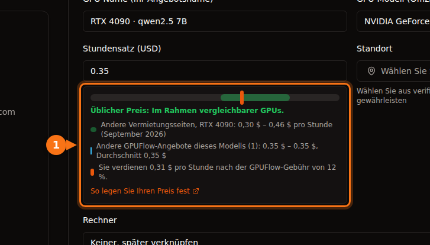

Im September 2026 kostet eine H100 etwa 6,90 $ pro Stunde bei AWS oder Azure, 11,06 $ pro GPU bei Google Cloud, 3,99 $ bei Lambda, 2,69 $ bis 3,49 $ bei RunPod und ab etwa 1,50 $ bei Vast.ai. Consumer-Karten gibt es nur auf den Marktplätzen: Eine RTX 4090 kostet am günstigen Ende 0,31 $ bis 0,34 $ pro Stunde und 0,74 $ in der Rechenzentrumsstufe von RunPod. Für dieselbe H100 kostet die teuerste On-Demand-Stunde etwa siebeneinhalbmal so viel wie die günstigste.

Der Rest dieses Beitrags zeigt, woher jede Zahl kommt, was im Stundenpreis steckt und was drei typische Jobs insgesamt kosten. Alle Preise sind On-Demand, sofern nicht anders angegeben, in US-Regionen (us-east-1 bei AWS, East US bei Azure, us-central1 bei Google Cloud), mit Linux, geprüft im September 2026. Preise ändern sich jeden Monat. Betrachten Sie sie als Momentaufnahme und prüfen Sie die Quelle, bevor Sie Geld ausgeben.

## Preise im Überblick

Rechenzentrums-GPUs, Dollar pro GPU und Stunde:

| Anbieter | L4 24 GB | A10G / A10 24 GB | A100 80 GB | H100 |
| --- | --- | --- | --- | --- |
| AWS | 0,81 $ (g6.xlarge) | 1,01 $ (g5.xlarge, A10G) | 3,43 $ (nur p4de mit 8 GPUs) | 6,88 $ (p5.4xlarge) |
| Google Cloud | 0,71 $ (g2-standard-4) | – | 5,07 $ (a2-ultragpu-1g) | 11,06 $ (A3 mit 8 GPUs, ÷ 8) |
| Azure | – | 3,20 $ (NV36ads A10 v5) | 3,67 $ (NC24ads A100 v4) | 6,98 $ (NC40ads H100 v5, NVL 94 GB) |
| Lambda | – | – | 2,79 $ | 3,99 $ |
| RunPod Community / Secure | – / 0,49 $ | – | 1,39 $ / 1,59 $ | 2,69 $ / 3,49 $ |
| Vast.ai | ab etwa 0,27 $ | – | ab etwa 0,43 $ | ab etwa 1,47 $ |

Ein Strich bedeutet, dass wir in der Preisliste des Anbieters keine passende Option mit einer einzelnen GPU gefunden haben. Consumer-Karten, Dollar pro Stunde:

| GPU | Vast.ai (günstigstes Angebot) | RunPod Community / Secure | Übliche Spanne auf Vermietungsseiten |
| --- | --- | --- | --- |
| RTX 3090 24 GB | 0,11 $ – 0,13 $ | 0,22 $ / 0,50 $ | 0,11 $ – 0,31 $ |
| RTX 4090 24 GB | 0,31 $ – 0,33 $ | 0,34 $ / 0,74 $ | 0,30 $ – 0,46 $ |
| RTX 5090 32 GB | 0,41 $ – 0,47 $ | 0,69 $ / 0,99 $ | 0,41 $ – 0,69 $ |

AWS, Google Cloud, Azure und Lambda führen keine RTX-Karten für Endkunden. Die Werte für Vast.ai sind Spannen, weil zwei Abrufe von getdeploying.com am selben Tag leicht unterschiedliche Tiefstpreise ergaben. Das sagt schon einiges über Marktplatzpreise. Die letzte Spalte ist die Spanne, die der [GPUFlow-Leitfaden zur Preisgestaltung für Anbieter](https://docs.gpuflow.app/de/providers/pricing/) im September 2026 bei Vast.ai, RunPod, Salad, SimplePod, TensorDock, Hyperstack und Lambda erhoben hat.

## Was im Stundenpreis steckt

Diese Zahlen beschreiben nicht ganz dasselbe Produkt, und das ist wichtiger als die zweite Nachkommastelle.

Eine Instanz bei einem Hyperscaler enthält neben der GPU noch einiges andere. Die p5.4xlarge von AWS kommt mit 16 vCPUs, 256 GiB RAM und 3,84 TB lokalem NVMe. Die NC24ads A100 v4 von Azure hat 24 vCPUs und 220 GiB RAM. Die Azure-Größe mit voller A10, NV36ads A10 v5, hat 36 vCPUs, 440 GiB RAM und eine GRID-Lizenz für virtuelle Workstations. Das erklärt zum Teil, warum sie das Dreifache dessen kostet, was AWS für eine ähnliche Karte verlangt. Wenn Sie nur die GPU brauchen, zahlen Sie das alles trotzdem mit.

Manche GPUs gibt es nur in großen Maschinen. Bei AWS wird die A100 80 GB als p4de.24xlarge verkauft: acht GPUs, 27,45 $ pro Stunde, keine kleinere Größe. Die A3-High-Maschine mit H100 von Google Cloud in unserer Tabelle ist die a3-highgpu-8g mit 8 GPUs für 88,49 $ pro Stunde. Die Preisliste von Lambda zeigt einen Preis pro GPU, aber die daneben aufgeführten Maschinendaten zur H100 (208 vCPUs, 1.800 GiB RAM) beschreiben ein System mit mehreren GPUs. Prüfen Sie also, welche Größen tatsächlich verfügbar sind, bevor Sie mit 3,99 $ planen.

Marktplatzpreise legt fest, wem die Maschine gehört. Auf Vast.ai setzt jeder Host seinen eigenen Preis, und Speicher und Bandbreite werden pro Angebot separat berechnet. Die Community Cloud von RunPod verbindet unabhängige Anbieter, die Secure Cloud läuft in Rechenzentren der Tier-Stufen 3 und 4. Dieselbe RTX 4090 kostet in der ersten 0,34 $ und in der zweiten 0,74 $.

Was der Stundenpreis nicht enthält (Festplatte, Datenübertragung, Einrichtungszeit, Leerlauf), behandelt [GPU mieten: Was der Stundenpreis verschweigt und was Sie wirklich zahlen](/de/hidden-fees-in-gpu-rental/). Bei einem kleinen Job können diese Posten größer sein als die GPU-Zeit.

## H100-Preise im Vergleich

<figure>
<svg viewBox="0 0 720 380" role="img" aria-labelledby="d1-title" xmlns="http://www.w3.org/2000/svg" font-family="system-ui, sans-serif" font-size="15">
<title id="d1-title">Balkendiagramm der On-Demand-Preise für eine H100 pro GPU und Stunde im September 2026, von 11,06 Dollar bei Google Cloud bis 1,47 Dollar bei Vast.ai</title>
<rect x="0" y="0" width="720" height="380" fill="#ffffff"/>
<text x="20" y="28" fill="#1e1b4b" font-weight="600">Eine H100, On-Demand, Dollar pro GPU-Stunde</text>
<line x1="190" y1="44" x2="190" y2="316" stroke="#e2e8f0" stroke-width="1"/>
<text x="190" y="336" text-anchor="middle" fill="#64748b" font-size="13">0 $</text>
<line x1="270" y1="44" x2="270" y2="316" stroke="#e2e8f0" stroke-width="1"/>
<text x="270" y="336" text-anchor="middle" fill="#64748b" font-size="13">2 $</text>
<line x1="350" y1="44" x2="350" y2="316" stroke="#e2e8f0" stroke-width="1"/>
<text x="350" y="336" text-anchor="middle" fill="#64748b" font-size="13">4 $</text>
<line x1="430" y1="44" x2="430" y2="316" stroke="#e2e8f0" stroke-width="1"/>
<text x="430" y="336" text-anchor="middle" fill="#64748b" font-size="13">6 $</text>
<line x1="510" y1="44" x2="510" y2="316" stroke="#e2e8f0" stroke-width="1"/>
<text x="510" y="336" text-anchor="middle" fill="#64748b" font-size="13">8 $</text>
<line x1="590" y1="44" x2="590" y2="316" stroke="#e2e8f0" stroke-width="1"/>
<text x="590" y="336" text-anchor="middle" fill="#64748b" font-size="13">10 $</text>
<line x1="670" y1="44" x2="670" y2="316" stroke="#e2e8f0" stroke-width="1"/>
<text x="670" y="336" text-anchor="middle" fill="#64748b" font-size="13">12 $</text>
<text x="180" y="69" text-anchor="end" fill="#1e1b4b">Google Cloud</text>
<rect x="190" y="50" width="442.4" height="26" rx="3" fill="#6366f1"/>
<text x="640.4" y="69" fill="#1e1b4b">11,06 $</text>
<text x="180" y="107" text-anchor="end" fill="#1e1b4b">Azure (H100 NVL)</text>
<rect x="190" y="88" width="279.2" height="26" rx="3" fill="#6366f1"/>
<text x="477.2" y="107" fill="#1e1b4b">6,98 $</text>
<text x="180" y="145" text-anchor="end" fill="#1e1b4b">AWS</text>
<rect x="190" y="126" width="275.2" height="26" rx="3" fill="#6366f1"/>
<text x="473.2" y="145" fill="#1e1b4b">6,88 $</text>
<text x="180" y="183" text-anchor="end" fill="#1e1b4b">Lambda</text>
<rect x="190" y="164" width="159.6" height="26" rx="3" fill="#16a34a"/>
<text x="357.6" y="183" fill="#1e1b4b">3,99 $</text>
<text x="180" y="221" text-anchor="end" fill="#1e1b4b">RunPod Secure</text>
<rect x="190" y="202" width="139.6" height="26" rx="3" fill="#16a34a"/>
<text x="337.6" y="221" fill="#1e1b4b">3,49 $</text>
<text x="180" y="259" text-anchor="end" fill="#1e1b4b">RunPod Community</text>
<rect x="190" y="240" width="107.6" height="26" rx="3" fill="#16a34a"/>
<text x="305.6" y="259" fill="#1e1b4b">2,69 $</text>
<text x="180" y="297" text-anchor="end" fill="#1e1b4b">Vast.ai (günstigstes)</text>
<rect x="190" y="278" width="58.8" height="26" rx="3" fill="#16a34a"/>
<text x="256.8" y="297" fill="#1e1b4b">1,47 $</text>
<line x1="190" y1="44" x2="190" y2="316" stroke="#64748b" stroke-width="1.5"/>
<rect x="190" y="352" width="14" height="14" fill="#6366f1"/>
<text x="212" y="364" fill="#64748b" font-size="13">Hyperscaler</text>
<rect x="360" y="352" width="14" height="14" fill="#16a34a"/>
<text x="382" y="364" fill="#64748b" font-size="13">GPU-Clouds und Marktplätze</text>
</svg>
<figcaption>On-Demand-Preise für eine einzelne H100, September 2026. Der Preis von Google Cloud ist die A3-Maschine mit 8 GPUs geteilt durch 8. Die Azure-Größe mit einer GPU nutzt die H100 NVL mit 94 GB. Für Vast.ai steht das günstigste Angebot, das getdeploying.com an diesem Tag gemeldet hat.</figcaption>
</figure>

Das Diagramm ist maßstabsgetreu. Zwei Dinge fallen auf. Die drei großen Clouds liegen bei rund 7 $ pro GPU, Google Cloud mit der A3-Maschine mit 8 GPUs deutlich darüber. Und zwischen AWS und dem günstigsten Angebot auf Vast.ai liegt mehr als Faktor vier, für eine Karte, die dieselben Rechenoperationen ausführt.

Was Sie für das zusätzliche Geld bekommen, ist real: ein SLA, Compliance-Unterlagen, den Rest Ihrer Infrastruktur nebenan und einen Supportvertrag. Was Sie auf einem Marktplatz aufgeben, ist ebenso real: Der Host kann ein kleiner Betreiber sein, die Zuverlässigkeit schwankt von Angebot zu Angebot, und es gibt kein SLA. Für ein Experiment am Wochenende gewinnt der Marktplatz klar. Für ein reguliertes Produktivsystem kommt er oft gar nicht in Frage.

## Spot- und unterbrechbare Preise

Jeder Anbieter in diesem Vergleich verkauft freie Kapazität günstiger, mit dem Risiko, dass er sie zurücknimmt.

| Instanz | On-Demand | Spot | Ersparnis |
| --- | --- | --- | --- |
| AWS g6.xlarge (1× L4) | 0,805 $ | 0,605 $ | 25 % |
| AWS g5.xlarge (1× A10G) | 1,006 $ | 0,469 $ | 53 % |
| AWS p5.4xlarge (1× H100) | 6,88 $ | 2,623 $ | 62 % |
| Google Cloud g2-standard-4 (1× L4) | 0,707 $ | 0,403 $ | 43 % |
| Google Cloud a3-highgpu-8g (8× H100) | 88,49 $ | 41,60 $ | 53 % |
| Azure NC24ads A100 v4 (1× A100 80 GB) | 3,673 $ | 0,679 $ | 82 % |
| Azure NC40ads H100 v5 (1× H100 NVL) | 6,98 $ | 1,29 $ | 82 % |

Die Spot-Preise von Azure stammen aus der Retail-Preis-API, in der die Spot-Tarife für A100 und H100 im Juli und August 2026 in Kraft traten. Der Spot-Tarif der H100 lag unter dem günstigsten On-Demand-Angebot für eine H100, das wir auf den Marktplätzen gefunden haben. Spot-Preise ändern sich oft, und die Verfügbarkeit ist nicht garantiert. Nehmen Sie das also als Momentaufnahme.

Auf Vast.ai sind unterbrechbare Instanzen laut Doku „oft 50 %+ günstiger als On-Demand“; getdeploying.com zeigte unterbrechbare Angebote für die RTX 3090 ab 0,08 $. Spot spart nur Geld, wenn Ihr Job Checkpoints schreibt und dort weitermachen kann, wo er aufgehört hat. Sonst bedeutet eine Unterbrechung, dass Sie dieselben Stunden zweimal bezahlen.

## Wo GPUFlow einzuordnen ist

GPUFlow ist ebenfalls ein Marktplatz, vermietet aber etwas Engeres. Anbieter betreiben KI-Modelle (meist mit Ollama) auf ihren eigenen Linux-Rechnern, und Sie mieten eine dieser GPUs stundenweise und bekommen dafür einen OpenAI-kompatiblen API-Schlüssel (Basis-URL `https://gpuflow.app/v1`, mit `/v1/chat/completions` und `/v1/models`). Es gibt kein SSH, keine Shell und keinen Dateizugriff. Trainieren, Fine-Tuning oder eigener Code sind also nicht möglich. Wenn Sie ein offenes Modell aus einem Skript oder einer App aufrufen wollen, entfällt die Einrichtung komplett: Das Modell ist auf dem Rechner des Anbieters schon installiert.

GPUFlow legt keine Preise fest, deshalb gibt es keinen GPUFlow-Preis für die Tabellen. So funktioniert die Preisbildung stattdessen:

- Jeder Anbieter legt für sein Angebot einen Stundenpreis in US-Dollar fest. Beim Festlegen zeigt das Formular, wo der Preis im Vergleich zur Spanne auf anderen Vermietungsseiten liegt und was er nach der Gebühr verdient.
- Sie buchen ganze Stunden, standardmäßig 1 bis 168. Der volle gebuchte Betrag wird beim Start der Miete von Ihren Credits reserviert.
- Sie zahlen sekundengenau mit 1 Minute Mindestdauer, aufgerundet auf den nächsten Cent ([GPU-Abrechnung pro Sekunde oder pro Stunde](/de/per-second-vs-hourly-gpu-billing/) rechnet das durch). Wenn Sie früher beenden oder die Zeit abläuft, geht der ungenutzte Teil der Reservierung direkt zurück an Ihre Credits.
- Reagiert der Rechner des Anbieters 10 Minuten lang nicht, endet die Miete, und Sie zahlen nur bis zum letzten Heartbeat des Rechners.
- Tokens werden gezählt, aber nicht berechnet. Auf der Rechnung gibt es keinen Posten für Festplatte oder Datenübertragung, weil Sie nie eine Maschine bekommen, auf der Sie Dateien ablegen könnten.
- Credits kaufen Sie per Karte über Stripe, 10 $ bis 500 $ pro Aufladung, ohne Gebühr. 1 Credit entspricht 0,01 $, und Credits verfallen nicht. Anbieter behalten 88 % jeder Abbuchung, GPUFlow behält 12 %.

Einen ausführlicheren Vergleich zwischen der Miete eines API-Schlüssels und der Miete eines Containers finden Sie in [GPUFlow vs. Vast.ai vs. RunPod vs. SaladCloud](/de/gpuflow-vs-vast-ai-vs-runpod/). Wenn Sie GPU-Stundenpreise mit APIs mit Abrechnung pro Token vergleichen, [steht die Rechnung hier](/de/hourly-gpu-vs-per-token-api/).

## Rechenbeispiel 1: ein Batch-Job von 3 Stunden auf einer 24-GB-Karte

Angenommen, Sie wollen ein offenes 7B- bis 8B-Modell etwa drei Stunden lang über einen Stapel Dokumente laufen lassen. Jede Karte mit 24 GB reicht.

| Option | Rechnung | GPU-Kosten |
| --- | --- | --- |
| Vast.ai RTX 4090 | 3 × 0,31 $ | 0,93 $ |
| RunPod Community RTX 4090 | 3 × 0,34 $ | 1,02 $ |
| Google Cloud L4 (g2-standard-4) | 3 × 0,707 $ | 2,12 $ |
| RunPod Secure RTX 4090 | 3 × 0,74 $ | 2,22 $ |
| AWS L4 (g6.xlarge) | 3 × 0,805 $ | 2,42 $ |
| AWS A10G (g5.xlarge) | 3 × 1,006 $ | 3,02 $ |

Bei jeder dieser Optionen zahlen Sie außerdem die Einrichtung: Inferenzserver installieren und Modell herunterladen, alles auf bezahlter Zeit. Zwanzig Minuten davon kosten 0,10 $ extra auf der Vast.ai-Karte und 0,27 $ auf der AWS L4.

Auf GPUFlow nehmen wir als Beispiel ein Angebot zu 0,35 $ pro Stunde (das ist der Preis aus unserem Screenshot, keine Preiszusage). Sie buchen 3 Stunden, also werden 1,05 $ reserviert. Der Job ist nach 2 Stunden 10 Minuten (7.800 Sekunden) fertig, und Sie beenden die Miete. Die Abbuchung beträgt 7.800 × 35 ÷ 3.600 = 75,8 Cent, aufgerundet 0,76 $, und 0,29 $ gehen zurück an Ihre Credits. Das funktioniert nur, wenn ein Anbieter das Modell betreibt, das Sie brauchen.

## Rechenbeispiel 2: 8 Stunden Fine-Tuning auf einer A100 80 GB

Für Fine-Tuning brauchen Sie eine Maschine, die Sie selbst steuern. GPUFlow scheidet hier also aus.

| Option | Rechnung | Kosten |
| --- | --- | --- |
| Vast.ai, günstigstes A100-Angebot | 8 × 0,43 $ | 3,44 $ |
| RunPod Community A100 SXM | 8 × 1,39 $ | 11,12 $ |
| RunPod Secure A100 SXM | 8 × 1,59 $ | 12,72 $ |
| Lambda A100 SXM 80 GB | 8 × 2,79 $ | 22,32 $ |
| Azure NC24ads A100 v4 | 8 × 3,673 $ | 29,38 $ |
| Google Cloud a2-ultragpu-1g | 8 × 5,069 $ | 40,55 $ |
| AWS p4de.24xlarge (8 GPUs) | 8 × 27,45 $ | 219,60 $ |

Die Zeile für Vast.ai ist das günstigste A100-Angebot, das getdeploying.com gemeldet hat (eine SXM-Karte in einer Maschine mit 2 GPUs; die Speichergröße war nicht angegeben). Prüfen Sie das Angebot also, bevor Sie mit diesem Preis rechnen. Die AWS-Zeile ist kein Tippfehler: Wenn Sie bei AWS eine A100 80 GB brauchen, mieten Sie acht. Die Lambda-Zeile setzt eine Größe voraus, die Sie tatsächlich bekommen; siehe den Hinweis oben.

Wenn Ihre Trainingsschleife alle 15 bis 30 Minuten Checkpoints speichert, bringt der Azure-Spot-Preis von 0,679 $ pro Stunde diesen Job auf 5,43 $, allerdings nur, wenn Sie die Kapazität bekommen.

## Rechenbeispiel 3: eine L4, die rund um die Uhr Anfragen bedient

Ein kleiner Inferenz-Endpunkt, der einen Monat mit 720 Stunden läuft:

| Option | Rechnung | Pro Monat |
| --- | --- | --- |
| Vast.ai L4, günstigstes Angebot | 720 × 0,27 $ | 194,40 $ |
| RunPod Secure L4 | 720 × 0,49 $ | 352,80 $ |
| AWS g6.xlarge, 1 Jahr reserviert | 720 × 0,524 $ | 377,28 $ |
| Google Cloud g2-standard-4 | 720 × 0,707 $ | 509,04 $ |
| AWS g6.xlarge, On-Demand | 720 × 0,805 $ | 579,60 $ |

Bei dieser Laufzeit zählen die Rabatte für Laufzeitverträge: Der reservierte Tarif von AWS über 1 Jahr liegt für dieselbe Instanz 35 % unter On-Demand. Der Marktplatz ist immer noch am günstigsten, aber ein einzelner Host ist ein Single Point of Failure. Hat der Endpunkt Nutzer, wollen Sie wahrscheinlich zwei Maschinen. Das verdoppelt die Marktplatz-Zeile, und der Abstand ist kleiner, als er aussieht.

## Wie ich wählen würde

Für Experimente, Bildgenerierung, LoRA-Training und alles, was Sie neu starten können: eine RTX 3090 oder 4090 vom Marktplatz. Das günstige Ende liegt bei 0,11 $ bis 0,34 $ pro Stunde, und bei den großen Clouds kommt nichts auch nur in die Nähe.

Für ein großes Modell, das eine A100 oder H100 braucht und keinen regulatorischen Vorgaben unterliegt: zuerst RunPod oder Lambda, Vast.ai, wenn Sie bereit sind, den Zuverlässigkeitswert jedes Hosts zu prüfen. Schauen Sie sich vor der Entscheidung die Spot-Preise bei Azure und Google Cloud an; im September 2026 waren sie überraschend konkurrenzfähig.

Für regulierte Daten, ein Unternehmen, das schon auf AWS, Azure oder Google Cloud läuft, oder alles, was ein SLA braucht: Bleiben Sie in Ihrer Cloud und senken Sie den Preis mit Laufzeitverträgen oder Spot-Kapazität. 7 $ pro Stunde für eine H100 sind oft billiger als die Sicherheitsprüfung eines neuen Anbieters.

Wenn Sie ein offenes Modell aus Code aufrufen wollen, ohne einen Server zu betreiben: eine API. Entweder eine API mit Abrechnung pro Token, falls es eine gibt, die das gewünschte Modell hostet, oder eine Stundenmiete auf GPUFlow, wenn Sie einen festen Stundenpreis für das Modell eines bestimmten Anbieters wollen. [Was Sie zum Mieten einer GPU brauchen](/de/what-you-need-to-rent-a-gpu/) erklärt die Seite mit Konto und Zahlung.

## Quellen

- AWS: [EC2-Preise On-Demand](https://aws.amazon.com/ec2/pricing/on-demand/), [P5-Instanzen](https://aws.amazon.com/ec2/instance-types/p5/), [P4-Instanzen](https://aws.amazon.com/ec2/instance-types/p4/). Stundenpreise aus der Kopie der AWS-Preisliste bei Vantage: [g6.xlarge](https://instances.vantage.sh/aws/ec2/g6.xlarge?region=us-east-1), [g5.xlarge](https://instances.vantage.sh/aws/ec2/g5.xlarge?region=us-east-1), [p5.4xlarge](https://instances.vantage.sh/aws/ec2/p5.4xlarge?region=us-east-1), [p5.48xlarge](https://instances.vantage.sh/aws/ec2/p5.48xlarge?region=us-east-1), [p4de.24xlarge](https://instances.vantage.sh/aws/ec2/p4de.24xlarge?region=us-east-1)
- Google Cloud: [Preise für beschleunigungsoptimierte VMs](https://cloud.google.com/products/compute/pricing/accelerator-optimized), [Preise für VM-Instanzen](https://cloud.google.com/compute/vm-instance-pricing)
- Azure: [Preise für Linux-VMs](https://azure.microsoft.com/en-us/pricing/details/virtual-machines/linux/), [Azure-Retail-Preis-API](https://prices.azure.com/api/retail/prices), Größen: [NC A100 v4](https://learn.microsoft.com/en-us/azure/virtual-machines/sizes/gpu-accelerated/nca100v4-series), [NCads H100 v5](https://learn.microsoft.com/en-us/azure/virtual-machines/sizes/gpu-accelerated/ncadsh100v5-series), [NVads A10 v5](https://learn.microsoft.com/en-us/azure/virtual-machines/sizes/gpu-accelerated/nvadsa10v5-series)
- Lambda: [Preise](https://lambda.ai/pricing)
- RunPod: [Preise](https://www.runpod.io/pricing), [RTX 3090](https://www.runpod.io/gpu-models/rtx-3090), [RTX 4090](https://www.runpod.io/gpu-models/rtx-4090), [RTX 5090](https://www.runpod.io/gpu-models/rtx-5090), [A100 SXM](https://www.runpod.io/gpu-models/a100-sxm), [H100 SXM](https://www.runpod.io/gpu-models/h100-sxm), [Überblick über Pods](https://docs.runpod.io/pods/overview)
- Vast.ai: [Doku zu Preisen](https://docs.vast.ai/guides/instances/pricing.md). Marktplatzpreise von getdeploying.com: [Vast.ai](https://getdeploying.com/vast-ai), [RTX 3090](https://getdeploying.com/reference/cloud-gpu/nvidia-rtx-3090), [RTX 4090](https://getdeploying.com/reference/cloud-gpu/nvidia-rtx-4090), [RTX 5090](https://getdeploying.com/reference/cloud-gpu/nvidia-rtx-5090), [A100](https://getdeploying.com/reference/cloud-gpu/nvidia-a100), [H100](https://getdeploying.com/reference/cloud-gpu/nvidia-h100)
- GPUFlow: [Den Preis für Ihre GPU festlegen](https://docs.gpuflow.app/de/providers/pricing/), [Abrechnung](https://docs.gpuflow.app/de/renters/billing/), [API-Schnellstart](https://docs.gpuflow.app/de/renters/api-quickstart/), [Marktplatz](https://gpuflow.app/de/marketplace)

Alle geprüft im September 2026.
