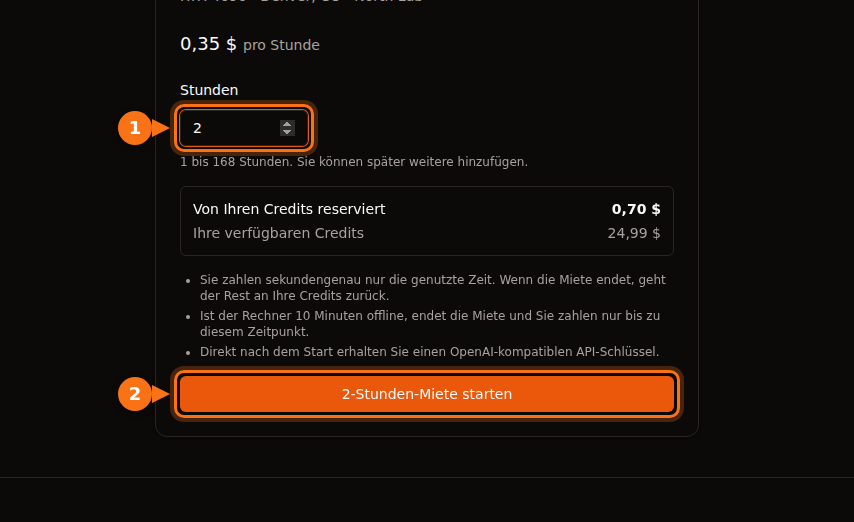

Der Stundenpreis in einem GPU-Angebot deckt GPU-Zeit ab und sonst nichts. Auf den meisten Plattformen zahlen Sie zusätzlich für Speicherplatz (oft mehr, während die Maschine gestoppt ist, als während sie läuft), auf manchen Marktplätzen für Datenübertragung, für Einrichtung und Leerlauf, die der Zähler wie echte Arbeit behandelt, und für die Währungsgebühr Ihrer Bank. Im Rechenbeispiel weiter unten wird aus einem Monat, der mit 13,60 $ RTX-4090-Zeit geplant war, eine Rechnung über 42,23 $.

Nichts davon ist absichtlich versteckt. Es geht nur leicht unter, wenn man Plattformen nach der Zahl in der Überschrift vergleicht. Alles hier wurde im September 2026 in der Doku und auf den Preisseiten der jeweiligen Plattform geprüft; die Links stehen am Ende. Die Stundenpreise selbst finden Sie im [GPU-Preisvergleich 2026](/de/gpu-rental-pricing-comparison-2026/).

## Die Zusatzkosten nach Plattform

| Kosten | Vast.ai | RunPod | Lambda | AWS EC2 | GPUFlow |
| --- | --- | --- | --- | --- | --- |
| Abrechnungstakt | Pro Sekunde | Pro Sekunde | Pro Minute | Pro Sekunde, 60 s Mindestdauer | Pro Sekunde, 1 Min. Mindestdauer |
| Speicher im gestoppten Zustand | Zum Preis des Hosts | Volume-Disk 0,20 $/GB/Monat | Dateisysteme pro GiB/Monat | EBS wird weiter berechnet | Keiner |
| Datenübertragung | Preis des Hosts, jedes Byte | Keine Gebühren | Keine Gebühren | Ausgehend: 100 GB/Monat frei, danach pro GB | Keine |
| Zum Start | 5 $ Mindesteinzahlung | 1 Stunde Guthaben; 100 $ bei Prepaid-Karten | 10 $ Reservierung auf der Karte | Eine Zahlungsmethode | 10 $ Aufladung; Buchung voll reserviert |
| Guthaben bei null | Gestoppt, später gelöscht | Gestoppt; ohne Network Volume sind die Daten weg | Wöchentliche Abrechnung im Nachhinein | – | Während einer Miete nicht möglich |

GPUFlow kann die Zeilen für Speicher und Datenübertragung auslassen, weil es etwas anderes vermietet: einen OpenAI-kompatiblen API-Schlüssel für KI-Modelle, die schon auf der GPU eines Anbieters laufen, keine Maschine, auf der Sie sich einloggen. Die Kehrseite: Sie können dort keinen eigenen Code ausführen, nicht trainieren und kein Fine-Tuning machen. Wenn Sie eine Maschine brauchen, gelten für Sie die anderen vier Spalten.

## Speicher, vor allem im gestoppten Zustand

Auf jeder Plattform, die Ihnen eine Maschine oder einen Container vermietet, liegen Ihre Dateien auf einer Festplatte, und die kostet Geld, solange sie existiert.

- **RunPod** berechnet 0,10 $ pro GB und Monat für Container- und Volume-Disk, solange der Pod läuft. Wenn Sie den Pod stoppen, wird die Container-Disk gelöscht und kostet nichts, aber die Volume-Disk steigt auf 0,20 $ pro GB und Monat. Network Volumes kosten 0,07 $ pro GB und Monat unter 1 TB und 0,05 $ darüber, ob der Pod läuft oder nicht. Savings Plans decken nur GPU-Rechenzeit ab; Speicher wird zum Standardpreis berechnet.
- **Vast.ai** berechnet Speicher „für jede einzelne Sekunde, die Ihre Instanz existiert“, in jedem Zustand außer offline. Die Doku sagt es unverblümt: „Das Stoppen einer Instanz vermeidet keine Speicherkosten.“ Den Preis legt der Host fest.
- **AWS** berechnet für eine gestoppte Instanz keine Rechenzeit und keine Datenübertragung, aber „für die Speicherung von Amazon-EBS-Volumes fallen Kosten an“, und eine Elastic IP an einer gestoppten Instanz wird weiter berechnet. Ein gp3-Volume in us-east-1 kostet etwa 0,08 $ pro GB und Monat.
- **Lambda** berechnet Dateisysteme pro genutztem GiB und Monat, in Schritten von einer Stunde.

Eine Volume-Disk mit 200 GB an einem gestoppten RunPod-Pod kostet 200 × 0,20 $ = 40 $ im Monat, auch wenn Sie den Pod nie wieder starten. Das sind mehr als 100 Stunden RTX 4090 zum Preis der Community Cloud von RunPod.

Wenn das Guthaben ausgeht, wird es schlimmer. Fällt ein RunPod-Guthaben auf 0 $, stoppen die Pods, und „Pods ohne Network Volume werden beendet, ihre Daten lassen sich nicht wiederherstellen“. Vast.ai stoppt Instanzen ebenfalls, und ohne hinterlegte Karte werden „Ihre Instanzen und gespeicherten Daten gelöscht“, nach einer kurzen Frist. Ein vergessenes Volume kostet Sie also entweder weiter Geld oder verschwindet mitsamt Ihrer Arbeit.

Was ich mache: Volumes am Tag des Projektendes löschen, nur das, was ich noch brauche, auf einem kleinen Network Volume behalten und von allem Wichtigen eine Kopie außerhalb der GPU-Plattform aufbewahren.

## Datenübertragung

Ein Modell mit 15 GB herunterladen und einen Datensatz hochladen: Das kann pro Sitzung Dutzende Gigabyte bewegen.

- **Vast.ai** berechnet „Bandbreitenpreise für jedes Byte, das an die Instanz gesendet oder von ihr empfangen wird, unabhängig von ihrem Zustand“. Jeder Host legt eigene Preise für Upload und Download fest, und die Doku warnt, dass das „die Gesamtkosten bei datenintensiven Workloads erheblich beeinflussen kann“. Schauen Sie vor der Miete im Angebot nach.
- **RunPod** gibt an, dass für Pods „keine Gebühren für eingehenden und ausgehenden Datenverkehr“ anfallen.
- **Lambda**: „Eingehender und ausgehender Datenverkehr wird Ihnen nicht berechnet.“
- **AWS**: Eingehende Daten sind kostenlos. Ausgehende Daten ins Internet sind für die ersten 100 GB im Monat über alle Dienste und Regionen hinweg kostenlos und werden danach pro GB nach Staffelpreisen berechnet. Jede öffentliche IPv4-Adresse kostet 0,005 $ pro Stunde, ob sie genutzt wird oder nicht. Das sind 3,60 $ in einem Monat mit 720 Stunden.

## Einzahlungen, Reservierungen und Prepaid-Guthaben

Die meisten GPU-Plattformen arbeiten mit Vorkasse: Sie kaufen Guthaben und geben es dann aus. Das Geld, das dort liegt, kostet auch etwas, vor allem, wenn es nicht zurückkommen kann.

- **Vast.ai**: Mindesteinzahlung 5 $, per Karte, BitPay oder Crypto.com. Nicht ausgegebenes Guthaben, das per Karte gekauft wurde, kann auf Anfrage über den Chat der Website erstattet werden; ausgegebenes nicht.
- **RunPod**: Sie brauchen mindestens eine Stunde Guthaben für den gewählten Pod, und mit Prepaid-Karten sollten Sie mindestens 100 $ pro Transaktion einzahlen. Guthaben wird nicht erstattet und kann nicht ausgezahlt werden.
- **Lambda** macht es umgekehrt: Es rechnet wöchentlich die Nutzung der Vorwoche ab und reserviert 10 $ auf der Karte, wenn Sie sie hinzufügen; die Reservierung wird nach ein paar Tagen aufgehoben. Lambda akzeptiert nur gängige Kreditkarten; Prepaid- und Debitkarten werden abgelehnt.
- **SaladCloud**: Aufladungen von 5 $ bis 10.000 $, und Guthaben verfällt 12 Monate nach dem Kauf.
- **GPUFlow**: Aufladungen von 10 $ bis 500 $ per Karte über Stripe, ohne Gebühr, und Credits verfallen nicht. Wenn Sie eine Miete starten, wird der volle gebuchte Betrag von Ihren Credits reserviert, keine kleine Anzahlung. Buchen Sie 10 Stunden zu 0,40 $, werden 4,00 $ reserviert, bis die Miete endet; was Sie nicht genutzt haben, kommt dann zurück. Gekaufte Credits können nicht ausgezahlt werden, und Kartenerstattungen gibt es nur bei doppelter oder irrtümlicher Belastung, bei Credits, die nie angekommen sind, oder wenn das Gesetz es verlangt, jeweils innerhalb von 60 Tagen.

Guthaben, das verfällt oder auf einer Plattform liegt, die Sie nicht mehr nutzen, ist ausgegebenes Geld. Laden Sie für die Arbeit auf, die Sie diesen Monat erwarten, nicht für das ganze Jahr.

## Einrichtung und Leerlauf

Eine gemietete Maschine wird nach Zeit abgerechnet, nicht nach Arbeit. Zwei Arten von Zeit kosten so viel wie echte Arbeit und bringen nichts.

### Einrichtung

Der Zähler läuft, sobald die Maschine läuft. Bei Lambda „beginnt die Abrechnung, sobald Sie eine Instanz starten und sie die Health Checks besteht“. Bibliotheken installieren, ein Container-Image ziehen und ein Modell herunterladen: Das alles passiert auf bezahlter Zeit. Bei 0,34 $ pro Stunde kosten 15 Minuten Einrichtung etwa 0,09 $. Einmal ist das wenig, aber jeden Tag über einen Monat sind es ein paar Stunden GPU-Zeit.

Zwei Dinge helfen: Starten Sie mit einem Template oder Image, das Ihren Stack schon enthält, und legen Sie Modelle auf ein Volume, damit Sie sie nur einmal herunterladen (und wägen Sie das gegen die Speicherkosten oben ab).

Bei GPUFlow gibt es auf Ihrer Seite keine Einrichtung: Der Anbieter hat die Modelle schon auf dem Rechner installiert, und Sie bekommen den API-Schlüssel direkt nach dem Start der Miete.

### Leerlauf

Lambda sagt es klar: „Instanzen werden berechnet, solange sie laufen, egal ob sie aktiv genutzt werden.“ Google Cloud sagt dasselbe über eine untätige VM im Zustand RUNNING. Einen Pod über Nacht laufen zu lassen, damit er morgens bereit ist, kostet eine Nacht GPU-Zeit.

Azure hat eine zusätzliche Falle. Eine VM, die nur „Stopped“ ist (zum Beispiel aus dem Betriebssystem heraus heruntergefahren), wird weiter für ihre Kerne berechnet. Sie muss im Portal oder über die CLI in den Zustand „Stopped (Deallocated)“ versetzt werden, bevor die Rechenkosten enden.

Auch GPUFlow ist nicht davor gefeit: Sie zahlen, bis Sie auf **Jetzt beenden** klicken oder die gebuchte Zeit abläuft. Vorzeitiges Beenden kostet nichts, und der ungenutzte Teil der Reservierung kommt zurück. Die Lösung ist also einfach, die Miete zu beenden, wenn Sie fertig sind. [So funktioniert die Abrechnung bei GPUFlow](https://docs.gpuflow.app/de/renters/billing/).

## Abrechnungstakt und Mindestdauer

Sekundengenaue Abrechnung ist inzwischen üblich, aber die Details unterscheiden sich:

| Plattform | Wie Zeit abgerechnet wird |
| --- | --- |
| Vast.ai | Pro Sekunde |
| RunPod Pods | Pro Sekunde (die Überblicksseite zu Pods nennt noch pro Minute) |
| RunPod Serverless | Pro Sekunde, aufgerundet, einschließlich Startzeit des Workers und eines Idle-Timeouts (standardmäßig 5 Sekunden) |
| Lambda | Schritte von einer Minute |
| AWS EC2 (Linux) | Pro Sekunde, 60 Sekunden Mindestdauer |
| Google Cloud | Pro Sekunde nach 1 Minute Mindestdauer |
| Azure | Volle Minuten |
| GPUFlow | Pro Sekunde, 1 Minute Mindestdauer, aufgerundet auf den nächsten Cent |

Bei langen Jobs sind diese Unterschiede Rauschen. Sie zählen bei vielen kurzen Sitzungen und bei Serverless, wo Startzeit und Idle-Timeout zusätzlich zu den Anfragen berechnet werden. Wenn Sie kurze Anfragen mit Pausen dazwischen senden, kann das mehr kosten als die Anfragen selbst. [GPU-Abrechnung pro Sekunde oder pro Stunde](/de/per-second-vs-hourly-gpu-billing/) rechnet das durch.

## Unterbrechbare Instanzen

Unterbrechbare Kapazität (Spot) ist günstiger, manchmal viel günstiger, kann aber zurückgenommen werden.

- Vast.ai gibt an, dass unterbrechbare Instanzen „oft 50 %+ günstiger als On-Demand“ sind.
- Bei AWS kostete eine p5.4xlarge (eine H100) im September 2026 als Spot-Instanz 2,62 $ pro Stunde, On-Demand 6,88 $.
- Bei TensorDock wird Speicher zum Standardpreis zusätzlich zu Ihrem Gebot berechnet, und Sie zahlen ihn weiter, während Sie überboten sind. Hosts legen ein Mindestgebot fest, meist rund 50 % des On-Demand-Preises.

Die versteckten Kosten sind doppelte Arbeit. Wenn Ihr Job nicht von einem Checkpoint aus neu starten kann, kann eine einzige Unterbrechung die Ersparnis auffressen. Speichern Sie Checkpoints so oft, dass der Verlust des letzten Intervalls nicht wehtut.

## Die Gebühren Ihrer Bank

Fast jede GPU-Plattform, GPUFlow eingeschlossen, rechnet in US-Dollar ab. Ist Ihre Karte in einer anderen Währung, kann Ihre Bank eine eigene Gebühr aufschlagen:

- Auslandseinsatzentgelte liegen meist bei 1 % bis 3 %, und manche Banken berechnen sie bei Käufen von ausländischen Händlern auch dann, wenn der Preis in US-Dollar angezeigt wird.
- Die meisten kanadischen Kreditkarten verlangen etwa 2,5 % auf Käufe in einer anderen Währung.
- In Brasilien beträgt die IOF-Steuer auf internationale Kartenzahlungen seit Juli 2025 3,5 %.

Bei einer Aufladung von 100 $ sind das 1 $ bis 3,50 $, die Sie auf der Rechnung der Plattform nicht sehen. Eine Karte ohne Auslandseinsatzentgelt beseitigt den Großteil davon.

## Ein Rechenbeispiel: 0,34 $ pro Stunde, 42 $ im Monat

Hier ist ein realistischer Monat auf einer RTX 4090 aus der Community Cloud von RunPod zu 0,34 $ pro Stunde, bezahlt mit einer kanadischen Kreditkarte:

- 40 Stunden tatsächliche Arbeit: 40 × 0,34 $ = 13,60 $. Das ist die Zahl, mit der man plant.
- 20 Sitzungen mit je 15 Minuten Einrichtung, also 5 Stunden: 5 × 0,34 $ = 1,70 $.
- Zwei Nächte, in denen der Pod weiterlief, je 10 Stunden: 20 × 0,34 $ = 6,80 $.
- Eine Volume-Disk mit 100 GB, den ganzen Monat behalten. Sie läuft 65 der 720 Stunden des Monats und ist die übrigen 655 gestoppt: 100 × (0,10 $ × 65/720 + 0,20 $ × 655/720) = etwa 19,10 $.
- Zwischensumme 41,20 $, plus 2,5 % Auslandseinsatzentgelt: 1,03 $.

Summe: 42,23 $, etwa das 3,1-Fache der geplanten GPU-Arbeit. RunPod berechnet keine Datenübertragung; bei einem Vast.ai-Host mit Bandbreitenpreis käme also noch ein Posten dazu.

<figure>
<svg viewBox="0 0 720 300" role="img" aria-labelledby="d1-title" xmlns="http://www.w3.org/2000/svg" font-family="system-ui, sans-serif" font-size="15">
<title id="d1-title">Gestapeltes Balkendiagramm: Aus einem Monat, der mit 13,60 Dollar RTX-4090-Zeit geplant war, wird nach Einrichtung, Leerlauf-Nächten, Festplattenspeicher und einer Kartengebühr eine Rechnung über 42,23 Dollar</title>
<rect x="0" y="0" width="720" height="300" fill="#ffffff"/>
<text x="20" y="28" fill="#1e1b4b" font-weight="600">Ein Monat auf einer RTX 4090 zu 0,34 $ pro Stunde</text>
<line x1="130" y1="50" x2="130" y2="170" stroke="#e2e8f0" stroke-width="1"/>
<text x="130" y="190" text-anchor="middle" fill="#64748b" font-size="13">0 $</text>
<line x1="250" y1="50" x2="250" y2="170" stroke="#e2e8f0" stroke-width="1"/>
<text x="250" y="190" text-anchor="middle" fill="#64748b" font-size="13">10 $</text>
<line x1="370" y1="50" x2="370" y2="170" stroke="#e2e8f0" stroke-width="1"/>
<text x="370" y="190" text-anchor="middle" fill="#64748b" font-size="13">20 $</text>
<line x1="490" y1="50" x2="490" y2="170" stroke="#e2e8f0" stroke-width="1"/>
<text x="490" y="190" text-anchor="middle" fill="#64748b" font-size="13">30 $</text>
<line x1="610" y1="50" x2="610" y2="170" stroke="#e2e8f0" stroke-width="1"/>
<text x="610" y="190" text-anchor="middle" fill="#64748b" font-size="13">40 $</text>
<text x="120" y="84" text-anchor="end" fill="#1e1b4b">Geplant</text>
<rect x="130" y="62" width="163.2" height="34" rx="3" fill="#6366f1"/>
<text x="301.2" y="84" fill="#1e1b4b">13,60 $</text>
<text x="120" y="144" text-anchor="end" fill="#1e1b4b">Berechnet</text>
<rect x="130" y="122" width="163.2" height="34" fill="#6366f1"/>
<rect x="293.2" y="122" width="20.4" height="34" fill="#eef2ff" stroke="#6366f1" stroke-width="1.5"/>
<rect x="313.6" y="122" width="81.6" height="34" fill="#f97316"/>
<rect x="395.2" y="122" width="229.2" height="34" fill="#64748b"/>
<rect x="624.4" y="122" width="12.4" height="34" fill="#1e1b4b"/>
<text x="644.8" y="144" fill="#1e1b4b" font-weight="600">42,23 $</text>
<line x1="130" y1="50" x2="130" y2="170" stroke="#64748b" stroke-width="1.5"/>
<rect x="20" y="209" width="16" height="16" fill="#6366f1"/>
<text x="44" y="222" fill="#1e1b4b">GPU-Arbeit: 13,60 $</text>
<rect x="250" y="209" width="16" height="16" fill="#eef2ff" stroke="#6366f1" stroke-width="1.5"/>
<text x="274" y="222" fill="#1e1b4b">Einrichtung: 1,70 $</text>
<rect x="480" y="209" width="16" height="16" fill="#f97316"/>
<text x="504" y="222" fill="#1e1b4b">Leerlauf-Nächte: 6,80 $</text>
<rect x="20" y="245" width="16" height="16" fill="#64748b"/>
<text x="44" y="258" fill="#1e1b4b">Volume-Disk: 19,10 $</text>
<rect x="250" y="245" width="16" height="16" fill="#1e1b4b"/>
<text x="274" y="258" fill="#1e1b4b">Kartengebühr: 1,03 $</text>
</svg>
<figcaption>Das Rechenbeispiel aus diesem Abschnitt, maßstabsgetreu: 40 Stunden echte GPU-Arbeit zu 0,34 $ pro Stunde, dazu 5 Stunden Einrichtung, zwei vergessene Nächte, eine Volume-Disk mit 100 GB über den ganzen Monat und 2,5 % Kartengebühr. Die GPU-Arbeit ist weniger als ein Drittel der Rechnung.</figcaption>
</figure>

Der größte Posten ist gar nicht die GPU, sondern eine Festplatte, die 91 % des Monats gestoppt herumlag. Die Lösung ist unspektakulär: Volume löschen oder verkleinern und den Pod beenden, wenn Sie mit der Arbeit aufhören.

### Checkliste vor der Miete

1. Rechnen Sie GPU-Zeit plus Speicher für die gesamte Zeit zusammen, in der Sie die Dateien behalten, zum Preis im gestoppten Zustand.
2. Prüfen Sie den Bandbreitenpreis im Angebot, falls die Plattform einen hat, und schätzen Sie, wie viel Sie herunterladen.
3. Zählen Sie Einrichtungszeit als bezahlte Zeit.
4. Wissen Sie, wie Sie aufhören zu zahlen: Miete beenden, Maschine stoppen oder freigeben, Volume löschen.
5. Wissen Sie, was mit Ihren Daten passiert, wenn das Guthaben auf null fällt.
6. Prüfen Sie das Auslandseinsatzentgelt Ihrer Karte.

Wenn Sie ein KI-Modell brauchen, das Sie aus Ihrem Code aufrufen, und keine Maschine für eigene Software, spart eine API-basierte Miete die Posten für Speicher, Übertragung und Einrichtung komplett. [GPU pro Stunde oder API pro Token?](/de/hourly-gpu-vs-per-token-api/) vergleicht das mit der Bezahlung pro Token, und [GPUFlow vs. Vast.ai vs. RunPod vs. SaladCloud](/de/gpuflow-vs-vast-ai-vs-runpod/) zeigt, welche Plattform zu welchem Job passt. Für Training oder alles andere, was eine vollständige Maschine braucht, hält diese Checkliste die Rechnung nah am Stundenpreis.

## Quellen

- RunPod: [Preise für Pods und Speicher](https://docs.runpod.io/pods/pricing), [Preisseite](https://www.runpod.io/pricing), [Überblick über Pods](https://docs.runpod.io/pods/overview), [Preise für Serverless](https://docs.runpod.io/serverless/pricing), [Informationen zur Abrechnung](https://docs.runpod.io/references/billing-information), [Preise für die RTX 4090](https://www.runpod.io/gpu-models/rtx-4090)
- Vast.ai: [Preise](https://docs.vast.ai/guides/instances/pricing.md), [Abrechnung](https://docs.vast.ai/documentation/reference/billing), [Schnellstart (Mindesteinzahlung)](https://docs.vast.ai/guides/get-started/quickstart.md)
- Lambda: [Abrechnung](https://docs.lambda.ai/public-cloud/billing/), [Abrechnung verwalten](https://docs.lambda.ai/public-cloud/manage-billing/)
- SaladCloud: [Abrechnung](https://docs.salad.com/general/explanation/billing.md)
- TensorDock: [Spot-Instanzen](https://docs.tensordock.com/virtual-machines/spot-instances)
- AWS: [EC2-Preise On-Demand](https://aws.amazon.com/ec2/pricing/on-demand/), [So funktionieren Stoppen und Starten](https://docs.aws.amazon.com/AWSEC2/latest/UserGuide/how-ec2-instance-stop-start-works.html), [VPC-Preise (öffentliche IPv4)](https://aws.amazon.com/vpc/pricing/), [Preise der p5.4xlarge über Vantage](https://instances.vantage.sh/aws/ec2/p5.4xlarge?region=us-east-1), gp3-Preis: [EBS-Preisleitfaden von CloudBurn](https://cloudburn.io/blog/amazon-ebs-pricing)
- Google Cloud: [Preise für VM-Instanzen](https://cloud.google.com/compute/vm-instance-pricing)
- Azure: [Preise und FAQ für Linux-VMs](https://azure.microsoft.com/en-us/pricing/details/virtual-machines/linux/)
- Kartengebühren: [Experian](https://www.experian.com/blogs/ask-experian/what-is-a-foreign-transaction-fee/), [NerdWallet Kanada](https://www.nerdwallet.com/ca/p/best/credit-cards/best-no-foreign-transaction-fee-credit-cards), IOF in Brasilien: [Wise Brasilien](https://wise.com/br/blog/iof-cartao-internacional)
- GPUFlow: [Abrechnung](https://docs.gpuflow.app/de/renters/billing/), [Erste Schritte](https://docs.gpuflow.app/de/renters/getting-started/), [Marktplatz](https://gpuflow.app/de/marketplace)

Alle geprüft im September 2026.
