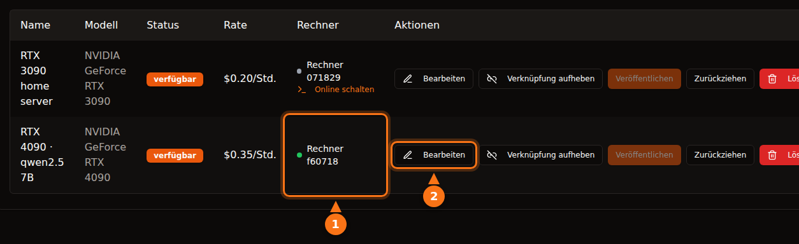

Es ist einigermaßen sicher, wenn Sie die Plattform mit offenen Augen wählen. Aber „sicher“ bedeutet auf jeder Plattform etwas anderes. Auf Container-Plattformen wie Vast.ai führt ein Mieter seinen eigenen Code auf Ihrem Rechner aus, und sein Traffic geht von Ihrer IP-Adresse aus. Die Isolation hält ihn von Ihren Dateien fern, nicht aber von Ihrem Netzwerk oder Ihrer Stromrechnung. Bei einem reinen API-Design wie GPUFlow kann ein Mieter nur Chat-Anfragen an die Modelle schicken, die Sie installiert haben, und das Risiko dreht sich um: Die Prompts sind auf Ihrem Rechner lesbar, Mieter sollten also nichts Geheimes senden.

Dieser Artikel geht beide Richtungen durch. Angaben zu anderen Anbietern wurden im September 2026 in der jeweiligen Plattform-Doku geprüft; alles zu GPUFlow stammt aus dem Quellcode und der Doku. Die Quellen stehen am Ende.

## Was ein Mieter auf einer Container-Plattform tun kann

Die meisten GPU-Marktplätze vermieten einen Container. Der Mieter wählt ein Image, bekommt eine Shell und führt aus, was er will. Für Sie als Host ergeben sich daraus fünf Punkte.

- **Beliebiger Code.** Der Code des Mieters läuft auf Ihrem Kernel, in einem Container oder einer VM. Die Isolation ist gut, aber nicht perfekt. Ausbrüche aus Containern sind selten, und genau diese Art von Fehler wird mit Kernel- und Treiber-Updates behoben, die Sie installieren müssen.
- **Ihre IP-Adresse.** Ausgehender Traffic aus dem Container läuft über Ihre Internetverbindung. Wenn ein Mieter eine Website scrapt, Spam verschickt oder das Internet scannt, landet die Abuse-Meldung bei Ihrem Provider, adressiert an Ihre IP. Laut den Nutzungsbedingungen von Vast.ai stellen Nutzer die Anbieter von Ansprüchen aus Nutzerinhalten frei. Das hilft bei einem Streit mit Dritten, hält Ihren Internetanbieter aber nicht davon ab, Ihnen eine Verwarnung zu schicken.
- **Offene Ports.** Laut der Hosting-Anleitung von Vast.ai brauchen Kunden „für die meisten Jobs offene Ports, um sich direkt mit dem Rechner zu verbinden“. Sie leiten also Ports an Ihrem Router weiter.
- **Festplatte.** Mieter laden Images, Modelle und Datensätze auf Ihre Laufwerke. Vast.ai gibt den Platz frei, wenn ein Kunde ein Volume löscht, aber solange die Miete läuft, gehört er ihm.
- **Strom, Wärme und Treiber.** Vast.ai sagt Hosts, sie sollten damit rechnen, dass die GPU „während der Mietdauer nahe an der maximalen Kapazität genutzt wird“. Das heißt stundenlang volle Leistungsaufnahme der Karte, Wärme im Raum und laufende Lüfter. Container-Plattformen brauchen außerdem eine bestimmte Einrichtung: Die Anleitung von Vast.ai nennt die Installation von Ubuntu, das Partitionieren der Laufwerke, die Installation der NVIDIA-Treiber und das Öffnen von Router-Ports.

## Wie Vast.ai, Salad und RunPod Mieter isolieren

| | Vast.ai | Salad | RunPod Community Cloud |
| --- | --- | --- | --- |
| **Mieter bekommt** | Einen Container (oder eine VM) mit SSH oder Jupyter | Einen selbst bereitgestellten Container; SSH und ein Web-Terminal darin | Einen Pod (Container) |
| **Isolation** | Docker-Container ohne Root-Rechte | Linux-VM auf einem Hypervisor, Container darin | „Eigener Container mit strikter Trennung“ |
| **Eingehende Ports** | Für die meisten Jobs nötig | Standardmäßig gesperrt | Keine Angabe |
| **Neue Hosts** | Ja, unter Ubuntu | Ja, unter Windows 10/11 | Werden nicht mehr angenommen |

- **Vast.ai** schreibt, Kunden seien „in Docker-Containern ohne Root-Rechte isoliert und haben nur Zugriff auf ihre eigenen Daten“, mit eigenen Namespaces und cgroups sowie Netzwerk-, Dateisystem- und Prozessisolation. Mieter warnt Vast.ai außerdem, dass die „Sicherheit bei den Anbietern stark schwankt“, und verweist bei sensiblen Aufgaben auf seine Secure Cloud mit zertifizierten Rechenzentren.
- **Salad** schreibt, der Workload laufe „in einem OCI-kompatiblen Container auf einer virtuellen Linux-Maschine, isoliert von Windows und jedem anderen Prozess auf dem Host“, wobei eingehende Verbindungen standardmäßig gesperrt sind. Salad schützt Mieter auch vor Hosts: Versucht ein Host, auf die Linux-Umgebung zuzugreifen, wird laut Salad „die Umgebung automatisch zerstört und der Rechner auf die Sperrliste gesetzt“. Unabhängig davon bietet Salad optionale Bandbreiten-Jobs an, die über Ihre Verbindung „Videoinhalte von Premium-Streamingplattformen verarbeiten“. Die Support-Seite warnt, dass das Ihr Datenvolumen erhöht und „in seltenen Fällen eine vorübergehende (meist 1–2 Tage) Inhaltssperre auf diesen Streamingplattformen“ auslösen kann.
- **RunPod** schreibt, dass es für die Community Cloud „keine neuen Hosts mehr annimmt“. Für bestehende Kapazität gilt: „Jeder Pod/Worker läuft in seinem eigenen Container“, und die Nutzungsbedingungen „verbieten Hosts, die Daten Ihres Pods/Workers einzusehen“.

Alle drei isolieren den Mieter von Ihrem System. Keine kann verhindern, dass legitim aussehender Traffic eines Mieters über Ihre Verbindung hinausgeht, und keine behauptet das.

## Was bei GPUFlow anders ist

GPUFlow vermietet ein KI-Modell hinter einer OpenAI-kompatiblen API, keinen Rechner. Das ändert, worauf ein Mieter zugreifen kann. Das macht der Code:

**Der Agent.** Der Installer legt ein einzelnes Go-Binary unter `/usr/local/bin/gpuflow-agent` ab und startet es als systemd-Dienst. Docker gibt es nicht. Die Service-Unit nutzt `DynamicUser=yes` (ein temporärer Benutzer ohne Rechte), `NoNewPrivileges=yes` (er kann keine Rechte hinzugewinnen), `ProtectSystem=strict` (das System ist für ihn schreibgeschützt), `ProtectHome=yes` (Home-Verzeichnisse sind unsichtbar) und `PrivateTmp=yes`. Die Inferenz-Engine ist standardmäßig Ollama, installiert über den eigenen Installer von Ollama als eigener Dienst (ein Anbieter kann den Agenten stattdessen auf einen eigenen OpenAI-kompatiblen Server zeigen lassen). Die Härtung gilt für den Agenten, nicht für Ollama.

**Netzwerk.** Der Agent baut nur ausgehende Verbindungen auf: einen WebSocket über TLS zu `wss://ws.gpuflow.app` und HTTPS zu `gpuflow.app`, um sich zu registrieren und alle 15 Sekunden einen Heartbeat zu senden. Er öffnet keine Ports, Sie leiten am Router nichts weiter, und Mieter erfahren Ihre IP-Adresse nie. Mit Ollama spricht er über `127.0.0.1:11434`, die Standard-Loopback-Adresse von Ollama.

**Was Mieter aufrufen können.** Ein Mieter bekommt einen API-Schlüssel für `https://gpuflow.app/v1`. `GET /v1/models` beantwortet GPUFlow selbst, und die einzige Anfrage, die an Ihren Rechner weitergeleitet wird, ist `POST /v1/chat/completions`. Der Agent hat zusätzlich eine eigene Sperre: Er leitet nur vier exakte Pfade weiter (`/v1/chat/completions`, `/v1/completions`, `/v1/embeddings` und `/v1/models`) und lehnt alles andere ab, auch die nativen `/api/*`-Endpunkte von Ollama, mit denen sich Modelle herunterladen, löschen oder anlegen ließen. Der Agent verarbeitet genau einen Nachrichtentyp, eine Inferenz-Anfrage; alles andere wird ignoriert.

Ein Mieter hat also keine Shell, kein SSH, keine Dateien und keinen Netzwerkzugang zu Ihrem Rechner. Er kann kein 70-GB-Modell auf Ihre Festplatte laden und Ihre Verbindung nicht nutzen, um ins Internet zu gehen. Was er tun kann: Ihre GPU für die gebuchten Stunden auslasten und im Feld `model` jedes Modell angeben, das Sie installiert haben.

<figure>
<svg viewBox="0 0 720 380" role="img" aria-labelledby="d1-title" xmlns="http://www.w3.org/2000/svg" font-family="system-ui, sans-serif" font-size="15">
<title id="d1-title">Was ein Mieter auf einem Container-Host tun kann, verglichen mit einem reinen API-Design wie GPUFlow</title>
<rect x="0" y="0" width="720" height="380" fill="#ffffff"/>
<text x="20" y="40" fill="#64748b" font-weight="bold">Was der Mieter tun kann</text>
<text x="470" y="40" text-anchor="middle" fill="#1e1b4b" font-weight="bold">Container-Host</text>
<text x="630" y="40" text-anchor="middle" fill="#1e1b4b" font-weight="bold">GPUFlow (API)</text>
<line x1="20" y1="55" x2="700" y2="55" stroke="#e2e8f0" stroke-width="2"/>
<text x="20" y="89" fill="#1e1b4b">Eigene Programme ausführen</text>
<rect x="430" y="70" width="80" height="28" rx="14" fill="#fff7ed" stroke="#f97316" stroke-width="2"/>
<text x="470" y="89" text-anchor="middle" fill="#1e1b4b">Ja</text>
<rect x="590" y="70" width="80" height="28" rx="14" fill="#f0fdf4" stroke="#16a34a" stroke-width="2"/>
<text x="630" y="89" text-anchor="middle" fill="#1e1b4b">Nein</text>
<line x1="20" y1="110" x2="700" y2="110" stroke="#e2e8f0" stroke-width="1"/>
<text x="20" y="133" fill="#1e1b4b">Eine Shell oder SSH öffnen</text>
<rect x="430" y="114" width="80" height="28" rx="14" fill="#fff7ed" stroke="#f97316" stroke-width="2"/>
<text x="470" y="133" text-anchor="middle" fill="#1e1b4b">Ja</text>
<rect x="590" y="114" width="80" height="28" rx="14" fill="#f0fdf4" stroke="#16a34a" stroke-width="2"/>
<text x="630" y="133" text-anchor="middle" fill="#1e1b4b">Nein</text>
<line x1="20" y1="154" x2="700" y2="154" stroke="#e2e8f0" stroke-width="1"/>
<text x="20" y="177" fill="#1e1b4b">Dateien auf Ihre Festplatte schreiben</text>
<rect x="430" y="158" width="80" height="28" rx="14" fill="#fff7ed" stroke="#f97316" stroke-width="2"/>
<text x="470" y="177" text-anchor="middle" fill="#1e1b4b">Ja</text>
<rect x="590" y="158" width="80" height="28" rx="14" fill="#f0fdf4" stroke="#16a34a" stroke-width="2"/>
<text x="630" y="177" text-anchor="middle" fill="#1e1b4b">Nein</text>
<line x1="20" y1="198" x2="700" y2="198" stroke="#e2e8f0" stroke-width="1"/>
<text x="20" y="221" fill="#1e1b4b">Traffic über Ihre IP senden</text>
<rect x="430" y="202" width="80" height="28" rx="14" fill="#fff7ed" stroke="#f97316" stroke-width="2"/>
<text x="470" y="221" text-anchor="middle" fill="#1e1b4b">Ja</text>
<rect x="590" y="202" width="80" height="28" rx="14" fill="#f0fdf4" stroke="#16a34a" stroke-width="2"/>
<text x="630" y="221" text-anchor="middle" fill="#1e1b4b">Nein</text>
<line x1="20" y1="242" x2="700" y2="242" stroke="#e2e8f0" stroke-width="1"/>
<text x="20" y="265" fill="#1e1b4b">Offene Ports am Router brauchen</text>
<rect x="430" y="246" width="80" height="28" rx="14" fill="#fff7ed" stroke="#f97316" stroke-width="2"/>
<text x="470" y="265" text-anchor="middle" fill="#1e1b4b">Oft</text>
<rect x="590" y="246" width="80" height="28" rx="14" fill="#f0fdf4" stroke="#16a34a" stroke-width="2"/>
<text x="630" y="265" text-anchor="middle" fill="#1e1b4b">Nein</text>
<line x1="20" y1="286" x2="700" y2="286" stroke="#e2e8f0" stroke-width="1"/>
<text x="20" y="309" fill="#1e1b4b">Modelle herunterladen oder löschen</text>
<rect x="430" y="290" width="80" height="28" rx="14" fill="#fff7ed" stroke="#f97316" stroke-width="2"/>
<text x="470" y="309" text-anchor="middle" fill="#1e1b4b">Ja</text>
<rect x="590" y="290" width="80" height="28" rx="14" fill="#f0fdf4" stroke="#16a34a" stroke-width="2"/>
<text x="630" y="309" text-anchor="middle" fill="#1e1b4b">Nein</text>
<line x1="20" y1="330" x2="700" y2="330" stroke="#e2e8f0" stroke-width="1"/>
<text x="20" y="353" fill="#1e1b4b">Ihre GPU stundenlang auslasten</text>
<rect x="430" y="334" width="80" height="28" rx="14" fill="#eef2ff" stroke="#6366f1" stroke-width="2"/>
<text x="470" y="353" text-anchor="middle" fill="#1e1b4b">Ja</text>
<rect x="590" y="334" width="80" height="28" rx="14" fill="#eef2ff" stroke="#6366f1" stroke-width="2"/>
<text x="630" y="353" text-anchor="middle" fill="#1e1b4b">Ja</text>
</svg>
<figcaption>Die Container-Spalte beschreibt Hosting im Stil von Vast.ai: Dateien und Traffic bleiben im Container des Mieters, nutzen aber trotzdem Ihre Festplatte und Ihre Verbindung. Die Details unterscheiden sich: Salad führt Container in einer Linux-VM aus und sperrt eingehende Verbindungen standardmäßig. Bei GPUFlow schickt der Mieter nur Chat-Anfragen an Modelle, die Sie installiert haben.</figcaption>
</figure>

## Der Datenweg, Station für Station

Diesen Teil sollten Mieter lesen. Eine Chat-Anfrage läuft durch vier Softwarekomponenten, und an mehr als einer davon ist der Text lesbar.

<figure>
<svg viewBox="0 0 720 330" role="img" aria-labelledby="d2-title" xmlns="http://www.w3.org/2000/svg" font-family="system-ui, sans-serif" font-size="15">
<title id="d2-title">Eine Chat-Anfrage bei GPUFlow läuft von der App des Mieters zu gpuflow.app, zum Relay, zum Agenten auf dem PC des Anbieters und zu Ollama; die Antwort kommt auf demselben Weg zurück</title>
<rect x="0" y="0" width="720" height="330" fill="#ffffff"/>
<rect x="480" y="50" width="230" height="200" rx="12" fill="#fff7ed" stroke="#f97316" stroke-width="2" stroke-dasharray="6 4"/>
<text x="595" y="76" text-anchor="middle" fill="#1e1b4b" font-weight="bold">PC des Anbieters</text>
<rect x="10" y="110" width="110" height="70" rx="10" fill="#eef2ff" stroke="#6366f1" stroke-width="2"/>
<text x="65" y="141" text-anchor="middle" fill="#1e1b4b">App des</text>
<text x="65" y="161" text-anchor="middle" fill="#1e1b4b">Mieters</text>
<rect x="160" y="110" width="120" height="70" rx="10" fill="#eef2ff" stroke="#6366f1" stroke-width="2"/>
<text x="220" y="141" text-anchor="middle" fill="#1e1b4b">GPUFlow-API</text>
<text x="220" y="161" text-anchor="middle" fill="#64748b" font-size="12">gpuflow.app/v1</text>
<rect x="320" y="110" width="105" height="70" rx="10" fill="#eef2ff" stroke="#6366f1" stroke-width="2"/>
<text x="372" y="141" text-anchor="middle" fill="#1e1b4b">Relay</text>
<text x="372" y="161" text-anchor="middle" fill="#64748b" font-size="12">ws.gpuflow.app</text>
<rect x="492" y="110" width="90" height="70" rx="10" fill="#ffffff" stroke="#6366f1" stroke-width="2"/>
<text x="537" y="141" text-anchor="middle" fill="#1e1b4b">GPUFlow-</text>
<text x="537" y="161" text-anchor="middle" fill="#1e1b4b">Agent</text>
<rect x="610" y="110" width="90" height="70" rx="10" fill="#ffffff" stroke="#6366f1" stroke-width="2"/>
<text x="655" y="141" text-anchor="middle" fill="#1e1b4b">Ollama</text>
<text x="655" y="161" text-anchor="middle" fill="#64748b" font-size="12">127.0.0.1</text>
<line x1="124" y1="145" x2="156" y2="145" stroke="#16a34a" stroke-width="4"/>
<line x1="284" y1="145" x2="316" y2="145" stroke="#64748b" stroke-width="4"/>
<line x1="429" y1="145" x2="488" y2="145" stroke="#16a34a" stroke-width="4"/>
<line x1="586" y1="145" x2="606" y2="145" stroke="#f97316" stroke-width="4"/>
<text x="140" y="102" text-anchor="middle" fill="#16a34a" font-size="13">TLS</text>
<text x="300" y="102" text-anchor="middle" fill="#64748b" font-size="13">intern</text>
<text x="452" y="102" text-anchor="middle" fill="#16a34a" font-size="13">TLS</text>
<text x="596" y="102" text-anchor="middle" fill="#f97316" font-size="13">Klartext</text>
<text x="65" y="212" text-anchor="middle" fill="#64748b" font-size="12">Hier entsteht</text>
<text x="65" y="228" text-anchor="middle" fill="#64748b" font-size="12">der Text</text>
<text x="220" y="212" text-anchor="middle" fill="#64748b" font-size="12">Liest den Text,</text>
<text x="220" y="228" text-anchor="middle" fill="#64748b" font-size="12">speichert nur</text>
<text x="220" y="244" text-anchor="middle" fill="#64748b" font-size="12">Token-Zahlen</text>
<text x="372" y="212" text-anchor="middle" fill="#64748b" font-size="12">Leitet ihn weiter,</text>
<text x="372" y="228" text-anchor="middle" fill="#64748b" font-size="12">protokolliert</text>
<text x="372" y="244" text-anchor="middle" fill="#64748b" font-size="12">keine Inhalte</text>
<text x="595" y="212" text-anchor="middle" fill="#1e1b4b" font-size="13" font-weight="bold">Klartext im Speicher</text>
<text x="595" y="230" text-anchor="middle" fill="#1e1b4b" font-size="13" font-weight="bold">Der Besitzer hat Root</text>
<line x1="20" y1="295" x2="50" y2="295" stroke="#16a34a" stroke-width="4"/>
<text x="58" y="300" fill="#1e1b4b" font-size="13">TLS über das Internet</text>
<line x1="235" y1="295" x2="265" y2="295" stroke="#64748b" stroke-width="4"/>
<text x="273" y="300" fill="#1e1b4b" font-size="13">intern bei GPUFlow</text>
<line x1="420" y1="295" x2="450" y2="295" stroke="#f97316" stroke-width="4"/>
<text x="458" y="300" fill="#1e1b4b" font-size="13">Klartext auf dem PC des Anbieters</text>
</svg>
<figcaption>Die Anfrage läuft von links nach rechts, die Antwort kommt auf demselben Weg zurück. TLS schützt jeden Abschnitt, der über das Internet geht, endet aber an jedem Server. Der Text ist also auf den Servern von GPUFlow lesbar, während sie ihn weiterleiten, und auf dem PC des Anbieters, wo Ollama das Modell ausführt.</figcaption>
</figure>

1. **Mieter zu gpuflow.app:** HTTPS. Die Seite liegt hinter Cloudflare.
2. **GPUFlow-API zum Relay:** eine interne Verbindung auf der Seite von GPUFlow. Die API prüft den Schlüssel, leitet den Request-Body unverändert weiter und erfasst die Token-Zahlen. Den Text von Anfragen oder Antworten speichert sie nicht, und so steht es auch in der Datenschutzerklärung.
3. **Relay zum Agenten des Anbieters:** ein TLS-WebSocket, den der Agent aufgebaut hat. Das Relay protokolliert den Typ jeder Nachricht, nicht ihren Inhalt.
4. **Agent zu Ollama:** unverschlüsseltes HTTP über die Loopback-Adresse im PC des Anbieters. Auch der Agent protokolliert keine Request-Bodys.

Es gibt keine Ende-zu-Ende-Verschlüsselung bis zum Modell, und mit einer gewöhnlichen Inferenz-Engine kann es sie auch nicht geben: Das Modell muss den Prompt lesen, um ihn zu beantworten.

## Was der Anbieter sehen kann

Ganz direkt gesagt: **Der Computer des Anbieters verarbeitet Ihre Prompts und Antworten im Klartext.** Dort läuft Ollama, und der Anbieter hat Root-Rechte auf dem Rechner (der Installer setzt sie voraus). Ein Anbieter, der es darauf anlegt, könnte den Loopback-Traffic mitschneiden, die Engine austauschen oder den Agenten auf einen anderen Server zeigen lassen.

Was dem im Weg steht, ist vertraglicher Natur. In den Nutzungsbedingungen von GPUFlow steht, dass Anbieter die Anfragen oder Antworten von Mietern „nicht aufzeichnen, lesen, aufbewahren oder weitergeben und die Antworten nicht verändern“ dürfen. Das ist eine Regel mit Folgen für das Konto, keine technische Sperre. Die Datenschutzerklärung sagt Mietern dasselbe: Anfragen und Antworten laufen während der Miete über den Computer des Anbieters.

Über die Prompts hinaus sieht der Anbieter Ihren GPUFlow-Benutzernamen und bekommt beim Start einer Miete eine Benachrichtigung (Miet-ID, Angebot und Stunden). Mieter sehen nichts von den Rechnerdaten des Anbieters; GPU-Temperatur, VRAM, Leistungsaufnahme und andere Telemetrie erscheinen nur im Dashboard des Besitzers.

Die praktische Regel für Mieter: **Senden Sie keine Geheimnisse, Zugangsdaten, personenbezogenen Daten anderer Menschen oder regulierten Daten (Gesundheit, Finanzen, vertrauliche Kundendaten) über eine Community-GPU.** Das gilt für GPUFlow und genauso für einen Container auf dem Heim-PC eines Fremden, wo der Host mit denselben Root-Rechten Speicher und Festplatte einsehen kann. Für sensible Arbeit führen Sie das Modell auf Hardware aus, die Sie kontrollieren, oder nutzen einen Anbieter, der den Vertrag unterschreibt, den Ihre Compliance verlangt. [Warum manche Unternehmen öffentliche KI-Tools verbieten](/de/why-corporate-policies-banning-chatgpt/) behandelt die Richtlinienseite, [Datensätze auf gemieteten GPU-Servern schützen](/de/how-to-secure-dataset-on-public-gpu-node/) die Container-Seite.

## Was bei GPUFlow trotzdem ein Risiko bleibt

Ein reines API-Design verkleinert die Angriffsfläche. Es beseitigt sie nicht, und ich zähle lieber auf, was bleibt, als so zu tun, als gäbe es nichts.

- **Ollama verarbeitet nicht vertrauenswürdige Eingaben.** Jede Anfrage eines Mieters landet als JSON bei Ollama. Ein Fehler in Ollama ist der wahrscheinlichste Weg hinein, also halten Sie es aktuell. Die Allowlist des Agenten hält Mieter von den Modellverwaltungs-Endpunkten von Ollama fern, kann aber keinen Fehler im Chat-Pfad beheben.
- **Der Installer läuft als Root.** Sie leiten ein Skript von gpuflow.app an `sudo bash` weiter, und es führt auch das Installationsskript von Ollama aus. Lesen Sie beide vorher; das ist bei jeder Hosting-Software gute Praxis.
- **Keine automatischen Updates.** Der Agent aktualisiert sich nicht selbst. Für eine neue Version führen Sie den Installer erneut aus; er prüft das Binary gegen eine SHA256SUMS-Datei, sofern eine veröffentlicht ist.
- **Last.** Es gibt kein Anfragelimit. Ein Mieter kann Ihre GPU jede gebuchte Stunde voll auslasten und jedes installierte Modell nutzen, auch das größte.
- **Wärme und Strom.** Wie überall: Gemietete Stunden sind Stunden unter Last.

## Checkliste für Anbieter

1. **Nehmen Sie einen Rechner, den Sie entbehren können.** Idealerweise ein eigenes Gerät nur dafür. Mindestens aber: Keine Arbeitsdateien oder Passwort-Tresore auf dem Computer, den Sie vermieten, egal auf welcher Plattform. Bei GPUFlow läuft der Agent zwar schon als temporärer Systembenutzer mit ausgeblendeten Home-Verzeichnissen, aber Ollama ist ein separater Dienst.
2. **Begrenzen Sie die Leistung.** `sudo nvidia-smi -pl 280` setzt das Leistungslimit der Karte in Watt (dafür braucht es Root, und der Wert muss zwischen dem Mindest- und Höchstlimit der Karte liegen). Puget Systems berichtet, dass RTX 3090 mit einem Limit von 270–280 W etwa 95 % ihrer Leistung behalten, und zeigt, wie man das Limit bei jedem Start per systemd-Unit neu setzt.
3. **Rechnen Sie zuerst den Strom durch.** Lesen Sie die Leistungsaufnahme unter **Meine Rechner** ab, während die GPU arbeitet, und multiplizieren Sie die Kilowatt mit Ihrem Preis pro kWh. [Was Ihre Gaming-GPU verdienen kann](/de/how-much-can-you-earn-renting-out-your-gpu/) rechnet das für gängige Karten und fünf Länder durch.
4. **Behalten Sie die Temperatur im Blick.** Die Live-Werte zeigen GPU-, Hotspot- und Speichertemperatur sowie die Lüfterdrehzahl. Sorgen Sie dafür, dass das Gehäuse Luft bekommt.
5. **Halten Sie das System aktuell.** Installieren Sie Updates für Linux, den GPU-Treiber und Ollama. Den GPU-Treiber verwaltet der GPUFlow-Installer nicht; nach einem Neustart startet systemd den Agenten wieder.
6. **Wissen Sie, wie Sie pausieren.** Ziehen Sie das Angebot unter **Meine GPUs** zurück, oder führen Sie `sudo systemctl stop gpuflow-agent` aus (`start` bringt ihn zurück). Während eine Miete läuft, lässt das Dashboard keine Änderungen an Angebot oder Rechner zu, und Sie können die Miete eines Mieters dort nicht beenden. Wenn Sie den Agenten während einer Miete stoppen, endet die Miete nach 10 Minuten, und Sie werden nur bis zum letzten Heartbeat bezahlt.
7. **Wissen Sie, wie Sie deinstallieren.** Die Schritte stehen in der [Doku zur Fehlerbehebung](https://docs.gpuflow.app/de/providers/troubleshooting/). Ollama bleibt installiert, bis Sie es entfernen.

Auf Container-Plattformen kommen zwei Punkte hinzu: Entscheiden Sie, ob Sie wirklich offene Ports an Ihrem Router wollen, und fragen Sie Ihren Internetanbieter, wie er mit Abuse-Meldungen umgeht, denn der Traffic der Mieter trägt Ihre IP-Adresse.

## Checkliste für Mieter

1. **Behandeln Sie jede Community-GPU wie den Computer eines Fremden.** Keine API-Schlüssel, Passwörter, Kundendaten, Gesundheits- oder Finanzdaten in Prompts.
2. **Lassen Sie weg, was Sie nicht brauchen.** Ersetzen Sie Namen und Kontonummern vor dem Senden durch Platzhalter.
3. **Schützen Sie Ihren Schlüssel.** Bei GPUFlow funktioniert der Schlüssel nach dem Ende der Miete nicht mehr. Wenn er nach außen gelangt, widerruft **Neuer Schlüssel** den alten sofort, und **Jetzt beenden** stoppt die Abrechnung und erstattet die ungenutzte Zeit.
4. **Rechnen Sie damit, dass Antworten falsch oder verändert sein können.** Die Nutzungsbedingungen verbieten Anbietern, Antworten zu verändern, aber prüfen Sie alles Wichtige.
5. **Nehmen Sie für sensible Arbeit das richtige Werkzeug.** Hosten Sie selbst, oder nutzen Sie einen Anbieter, der den Vertrag bietet, den Sie brauchen. [So nutzen Sie den Schlüssel in Ihren Apps](/de/use-openai-compatible-api-key-in-apps/) gilt für alles andere.

## Quellen

Alle geprüft im September 2026.

- GPUFlow: [Worauf Mieter zugreifen können](https://docs.gpuflow.app/de/providers/security/), [Erste Schritte für Anbieter](https://docs.gpuflow.app/de/providers/getting-started/), [Preise und Strom](https://docs.gpuflow.app/de/providers/pricing/), [Fehlerbehebung und Deinstallation](https://docs.gpuflow.app/de/providers/troubleshooting/), [API-Schnellstart](https://docs.gpuflow.app/de/renters/api-quickstart/)
- Vast.ai: [Hosting-Überblick](https://docs.vast.ai/host/hosting-overview.md), [Sicherheits-FAQ](https://docs.vast.ai/documentation/reference/faq/security), [Virtuelle Linux-Maschinen](https://docs.vast.ai/linux-virtual-machines), [Nutzungsbedingungen](https://vast.ai/terms), [Private KI-Modelle betreiben](https://vast.ai/article/running-private-ai-models-without-the-risk-of-data-exposure)
- Salad: [Sicherheit](https://salad.com/security), [Container-Workloads und Ihr PC](https://community.salad.com/container-workloads-and-your-pc/), [Bandbreiten-Sharing](https://support.salad.com/faq/jobs/what-is-bandwidth-sharing/), [SSH und Terminal](https://docs.salad.com/container-engine/explanation/container-groups/ssh-and-terminal.md), [Download und Systemanforderungen](https://salad.com/download/)
- RunPod: [Einen Pod wählen](https://docs.runpod.io/pods/choose-a-pod), [Datensicherheit und rechtliche Anforderungen](https://docs.runpod.io/hosting/partner-requirements)
- Ollama: [FAQ (Standard-Bind-Adresse)](https://docs.ollama.com/faq)
- NVIDIA: [Handbuch zu nvidia-smi](https://docs.nvidia.com/deploy/nvidia-smi/index.html)
- Puget Systems: [Leistungsbegrenzung der RTX 3090 mit systemd und nvidia-smi](https://www.pugetsystems.com/labs/hpc/quad-rtx3090-gpu-power-limiting-with-systemd-and-nvidia-smi-1983/)
