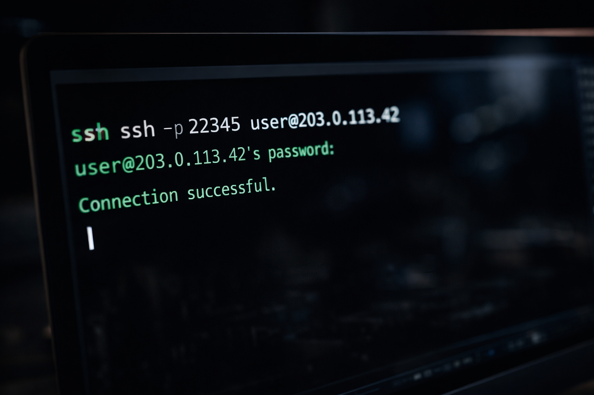
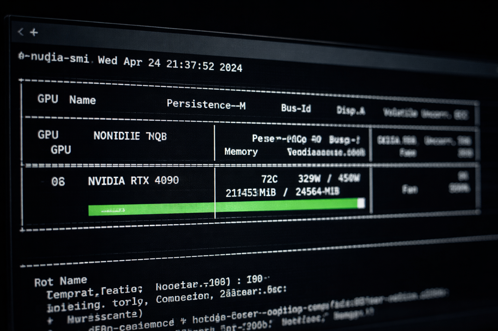

Wenn Sie dies lesen, verfügen Sie wahrscheinlich über einen Datensatz, den Sie nicht – oder nicht guten Gewissens – zu OpenAI hochladen können.

Damit sind Sie nicht allein. Für viele Unternehmen und unabhängige Entwickler wird die Bequemlichkeit von ChatGPT durch ein nicht vertretbares Risiko von Datenabfluss aufgewogen. Ob es sich um medizinische Unterlagen handelt, die dem HIPAA unterliegen, um proprietäre Codebasen, in denen jahrelange Entwicklungsarbeit steckt, oder um sensible Finanzmodelle mit Marktrelevanz – die Nutzung von Cloud‑KI bedeutet in der Praxis, einem Dritten Ihr wertvollstes geistiges Eigentum anzuvertrauen.

Wenn dieser Dritte ein Technologiekonzern ist, der in der Vergangenheit Kundendaten zum Training zukünftiger Modelle verwendet hat, wird das Wort „Vertrauen“ problematisch.

Die Lösung besteht nicht darin, auf KI zu verzichten. Die Lösung besteht darin, die Infrastruktur selbst zu kontrollieren.

Die Feinabstimmung von Open‑Weights‑Modellen auf Hardware unter eigener Kontrolle ist längst kein akademisches Nischenthema mehr. Für datenschutzbewusste Organisationen ist sie eine betriebliche Notwendigkeit. Modelle wie Llama, Mistral, Qwen und zahlreiche weitere stehen für die kommerzielle Nutzung ohne API‑Gebühren und ohne Verpflichtung zur Datenweitergabe zur Verfügung. Die eigentliche Hürde war stets der Zugang zu Rechenleistung. Der Erwerb von NVIDIA‑H100‑Clustern erfordert Investitionen in Millionenhöhe. Die Anmietung über AWS setzt Identitätsprüfung, Unternehmensverträge und Stundensätze voraus, die längere Trainingsläufe wirtschaftlich unattraktiv machen.

Dieser Leitfaden zeigt einen dritten Weg. Sie lernen, wie Sie ein Open‑Weights‑Sprachmodell über dezentrale GPU‑Mietplattformen feinabstimmen – Hardware im Besitz privater Betreiber weltweit, zugänglich über einen Peer‑to‑Peer‑Marktplatz. Wir behandeln die Einrichtung der Umgebung, Sicherheitsprotokolle für den Betrieb auf öffentlichen Nodes und die vollständige Durchführung des Trainings.

Die Codebeispiele verwenden Llama‑3.1‑8B als konkrete Referenz, doch der Ablauf gilt identisch für jedes mit Hugging Face kompatible Modell. Tauschen Sie einfach die Modellkennung aus, und Sie können Mistral‑7B, Qwen2‑7B oder jede andere Open‑Weights‑Version feinabstimmen, die zu Ihrem Anwendungsfall passt.

All dies erfolgt ohne KYC‑Verifizierung, ohne langfristige Verträge und zu einem Bruchteil der Kosten klassischer Cloud‑Anbieter.



## Die Wirtschaftlichkeit privater Feinabstimmung

Bevor wir uns der technischen Umsetzung widmen, ist der finanzielle Rahmen zu klären.

Das Training eines Modells auf AWS erfordert zunächst den Zugang zu knappen Instanzen. Die Instanz p4d.24xlarge (8× A100 GPUs) kostet 32,77 US‑Dollar pro Stunde – sofern sie überhaupt verfügbar ist. Lambda Labs bietet günstigere Preise, arbeitet jedoch häufig mit Wartelisten über mehrere Wochen. Beide Anbieter verlangen Kreditkarten, Identitätsprüfung und erzeugen detaillierte Abrechnungsdaten, die Ihre KI‑Aktivitäten Ihrer rechtlichen Identität zuordnen.

In einem dezentralen Marktplatz mieten Sie Rechenleistung direkt von Hardware‑Besitzern. Es handelt sich um Peer‑to‑Peer‑Infrastruktur auf Blockchain‑basierten Zahlungswegen. Die Konsequenzen sind erheblich:

**Kostenreduktion:** Eine RTX 4090 kostet auf den meisten dezentralen Plattformen zwischen 0,40 und 0,60 US‑Dollar pro Stunde. Für 8B‑Parameter‑Modelle mit QLoRA genügt eine einzelne 4090 mit 24GB VRAM, um ein Fine‑Tuning in zwei bis sechs Stunden – abhängig von Datensatzgröße – abzuschließen. Die Gesamtkosten liegen somit zwischen drei und acht US‑Dollar.

**Privatsphäre durch Architektur:** Zahlungen erfolgen über [Stablecoin‑Transaktionen](/de/stable-coins-are-the-smartest-way-to-pay-for-gpu-rental) in Netzwerken wie Polygon. Es gibt keine Kreditkarte, die Ihre Identität mit der Anmietung verknüpft. Der Marktplatz‑Smart‑Contract übernimmt die treuhänderische Abwicklung, wie in unserer [Escrow‑Dokumentation](/de/smart-contract-escrow) erläutert, sodass keine Partei die andere benachteiligen kann.

**Keine Gatekeeper:** Sie benötigen keine Genehmigung eines Enterprise‑Vertriebsteams. Sie unterzeichnen keine Nutzungsbedingungen, die dem Anbieter Inspektionsrechte über Ihre Workloads einräumen. Sie verbinden Ihre Wallet und mieten Hardware.

Zum Vergleich: Der gleiche Fine‑Tuning‑Prozess auf AWS mit einer einzelnen A10G‑Instanz (die günstigste Option mit ausreichendem VRAM) kostet rund 1,50 US‑Dollar pro Stunde. Rechnet man Einrichtungszeit, Leerlaufzeiten während der Konfiguration und den Verzicht auf anonyme Zahlung hinzu, liegen die tatsächlichen Kosten bei 150 bis 300 US‑Dollar für einen Vorgang, der auf dezentraler Infrastruktur weniger als zehn US‑Dollar kostet.

Eine detaillierte Gegenüberstellung finden Sie in unserem [GPU‑Mietpreisvergleich 2026](/de/gpu-rental-pricing-comparison-2026).

## Voraussetzungen

Dieses Tutorial setzt Vertrautheit mit der Linux‑Kommandozeile voraus. Ein akademischer Abschluss im Bereich Machine Learning ist nicht erforderlich, wohl aber ein sicherer Umgang mit dem Dateisystem, dem Bearbeiten von Textdateien und der Interpretation von Fehlermeldungen.

**Hardware‑Anforderungen:**

- **GPU:** Mindestens 24GB VRAM. Geeignet sind RTX 3090, RTX 4090 oder A10G. Für das 70B‑Modell sind 48GB oder mehr erforderlich (A6000, duale A100 oder H100).
- **Arbeitsspeicher:** 32GB oder mehr. Beim Laden des Modells werden Gewichte zunächst im Hauptspeicher zwischengespeichert, bevor sie auf die GPU übertragen werden.
- **Speicherplatz:** 100GB oder mehr NVMe‑SSD. Die Basisgewichte von Llama‑3 8B belegen etwa 16GB. Datensatz, Checkpoints und Adapter erhöhen den Bedarf zusätzlich.

**Hinweis zur Modellauswahl:** Dieses Tutorial verwendet Meta Llama‑3.1‑8B als Referenz, da es die größte Modellklasse darstellt, die mit QLoRA‑Quantisierung auf einer einzelnen 24GB‑GPU betrieben werden kann. Die Llama‑Familie umfasst inzwischen auch Llama 4 Scout und Maverick, die jedoch eine Mixture‑of‑Experts‑Architektur mit 109B bzw. 400B Parametern nutzen und Multi‑GPU‑Konfigurationen erfordern, die über den Rahmen einer Einzel‑Node‑Miete hinausgehen. Der hier beschriebene Workflow gilt gleichermaßen für Mistral‑7B, Qwen2‑7B, Gemma‑2‑9B und jedes andere mit Hugging Face kompatible Modell, das in den VRAM‑Grenzen Ihrer gemieteten Hardware betrieben werden kann.

**Software‑Voraussetzungen:**

- Python 3.10 oder höher
- Grundkenntnisse in PyTorch
- Ein Hugging‑Face‑Konto (erforderlich zum Herunterladen lizenzgebundener Modelle wie Llama, die eine Lizenzakzeptanz voraussetzen)
- Eine Kryptowallet (MetaMask oder vergleichbar) mit USDC oder MATIC im Polygon‑Netzwerk

Falls Sie noch keine Wallet für dezentrale GPU‑Miete eingerichtet haben, folgen Sie zunächst unserer [MetaMask‑ und Polygon‑Einrichtungsanleitung](/de/setting-up-metamask-polygon-gpu-rental). Der Vorgang dauert etwa fünfzehn Minuten.

## Schritt 1: Absicherung Ihres Compute‑Nodes

Der erste Schritt besteht darin, Hardware zu mieten. Bei zentralisierten Cloud‑Anbietern bedeutet dies Kontoerstellung, Identitätsprüfung, Genehmigungsprozesse und Hinterlegung einer Zahlungsmethode. Hier verläuft der Prozess deutlich direkter.

Navigieren Sie zum GPUFlow‑Marktplatz. Verbinden Sie Ihre Wallet über die Schaltfläche oben rechts. Die Oberfläche zeigt verfügbare Maschinen mit Spezifikationen, Stundenpreisen und Zuverlässigkeitswerten.

Filtern Sie nach folgenden Eigenschaften:

- **GPU:** RTX 4090 (24GB VRAM) oder RTX 6000 Ada (48GB VRAM)
- **RAM:** mindestens 32GB
- **Speicher:** 100GB+ verfügbar
- **Zuverlässigkeit:** 95 % oder höherer Uptime‑Wert

Wählen Sie einen Node aus und starten Sie die Miete. Der Smart Contract verlangt eine Kaution entsprechend Ihrer geschätzten Nutzungsdauer. Wie dieser Escrow‑Mechanismus beide Parteien schützt, erläutern wir in unserer [Erklärung zum Smart‑Contract‑Escrow](/de/smart-contract-escrow).

**Sicherheitsüberlegungen bei öffentlichen Nodes:**

Wenn Sie eine Maschine in einem fremden Netzwerk mieten, greifen Sie auf Hardware zu, die physisch von einer unbekannten Person kontrolliert wird. Die Virtualisierung bietet eine sinnvolle Isolation, dennoch ist umsichtiges Vorgehen erforderlich:

1. **Speichern Sie keine privaten Schlüssel auf dem Remote‑System.** Ihre Wallet, SSH‑Schlüssel anderer Systeme und API‑Tokens für Produktionsumgebungen dürfen niemals auf einem Miet‑Node abgelegt werden.
2. **Behandeln Sie das Dateisystem als potenziell kompromittiert.** Gehen Sie davon aus, dass geschriebene Daten theoretisch wiederhergestellt werden könnten. Sichere Löschverfahren behandeln wir in Schritt 6.
3. **Verschlüsseln Sie sensible Daten bei der Übertragung.** Details folgen in Schritt 3.
4. **Verwenden Sie keine wiederverwendeten Passwörter.** Ändern Sie Standardzugangsdaten sofort oder erstellen Sie ein neues SSH‑Schlüsselpaar.

Nach Bestätigung der Miete erhalten Sie die Verbindungsdaten. Der SSH‑Befehl sieht typischerweise folgendermaßen aus:

```bash
ssh -p 22345 user@203.0.113.42
```

Öffnen Sie Ihr lokales Terminal und führen Sie den Befehl aus. Bestätigen Sie den Host‑Key‑Fingerprint. Sie sind nun mit Ihrem gemieteten GPU‑Node verbunden.

Überprüfen Sie die Hardware:

```bash
nvidia-smi
```

Die Ausgabe sollte Ihre gemietete GPU, deren Speichergröße und die installierte Treiberversion anzeigen. Falls die Angaben nicht mit Ihrer Bestellung übereinstimmen, trennen Sie die Verbindung sofort und melden Sie den Vorfall über das Marktplatz‑System.

## Schritt 2: Einrichtung der Umgebung

Mit einer verifizierten SSH‑Verbindung ist die nächste Priorität eine saubere Python‑Umgebung. Die meisten Nodes verfügen über vorinstallierte NVIDIA‑Treiber und CUDA‑Toolkits. Die Verwendung systemweiter Python‑Pakete führt jedoch häufig zu Versionskonflikten.

Wir erstellen daher eine isolierte virtuelle Umgebung.

```bash
mkdir ~/llama3-finetune
cd ~/llama3-finetune
python3 -m venv venv
source venv/bin/activate
```

Ihr Prompt sollte nun `(venv)` anzeigen. Alle Installationen erfolgen innerhalb dieses Verzeichnisses.

Überprüfen Sie zunächst die CUDA‑Version:

```bash
nvcc --version
```

Notieren Sie die Versionsnummer. Üblich sind CUDA 11.8 oder 12.1. Falls `nvcc` nicht gefunden wird:

```bash
source /etc/profile.d/cuda.sh
```

Installieren Sie anschließend PyTorch passend zu Ihrer CUDA‑Version. Beispiel für CUDA 12.1:

```bash
pip install torch torchvision torchaudio --index-url https://download.pytorch.org/whl/cu121
```

Nun installieren wir die erforderlichen Bibliotheken:

```bash
pip install transformers==4.40.0 datasets==2.19.0 peft==0.10.0 bitsandbytes==0.43.1 trl==0.8.6 accelerate==0.29.0
```

**Versionsbindung ist entscheidend.** Ungepinnt installierte Pakete führen häufig zu Inkompatibilitäten.

Authentifizieren Sie sich anschließend bei Hugging Face. Akzeptieren Sie zunächst die Lizenzbedingungen im entsprechenden Modell‑Repository auf [Hugging Face](https://huggingface.co) und generieren Sie einen Access‑Token.

```bash
huggingface-cli login
```

Fügen Sie Ihren Token ein. Dieser wird unter `~/.cache/huggingface/token` gespeichert.


## Schritt 3: Sichere Datenübertragung

Der Hauptgrund für dezentrale Rechenleistung ist Datensouveränität.

In klassischen Cloud‑Workflows laden Sie Ihren Datensatz in S3, Google Cloud Storage oder Azure Blob hoch und anschließend auf Ihre Compute‑Instanz herunter. Dadurch entstehen mehrere Kopien sensibler Daten.

Wir umgehen dies vollständig über verschlüsselte Direktübertragung.

Öffnen Sie ein **neues Terminalfenster** auf Ihrem **lokalen Rechner** und führen Sie aus:

```bash
scp -P 22345 /path/to/your/dataset.jsonl user@203.0.113.42:~/llama3-finetune/
```

Für große Datensätze:

```bash
# Lokal
gzip -k dataset.jsonl
scp -P 22345 dataset.jsonl.gz user@203.0.113.42:~/llama3-finetune/

# Remote
gunzip dataset.jsonl.gz
```

Für erhöhte Sicherheitsanforderungen kann zusätzliche Verschlüsselung mit `age` erfolgen:

```bash
age -p dataset.jsonl > dataset.jsonl.age
scp -P 22345 dataset.jsonl.age user@203.0.113.42:~/llama3-finetune/

# Remote
age -d dataset.jsonl.age > dataset.jsonl
rm dataset.jsonl.age
```

SSH verwendet AES‑256‑Verschlüsselung. Für die meisten Anwendungsfälle ist dies ausreichend.

## Schritt 4: Das Fine‑Tuning‑Skript

Wir verwenden `SFTTrainer` aus der TRL‑Bibliothek für überwachte Feinabstimmung.

**Datensatzformat:**

JSONL‑Datei mit einem `text`‑Feld pro Zeile.

Wichtige Anforderungen:

1. Jede JSON‑Struktur muss exakt eine Zeile belegen.
2. Zeilenumbrüche innerhalb des Textes als `\n` escapen.
3. Anführungszeichen mit `\"` escapen.
4. UTF‑8‑Kodierung verwenden.

Erstellen Sie das Trainingsskript:

```bash
cd ~/llama3-finetune
nano train.py
```

(Fügen Sie den vollständigen Python‑Code aus Teil 1 unverändert ein.)

Speichern Sie die Datei.

Wichtige Parameter:

- **LORA_RANK:** Steuert Anpassungskapazität.
- **MAX_SEQ_LENGTH:** Reduzieren bei OOM‑Fehlern.
- **BATCH_SIZE:** Ebenfalls reduzieren bei Speicherengpässen.

Training starten:

```bash
python train.py
```

Das Modell (ca. 16GB) wird einmalig heruntergeladen. Anschließend beginnt das Training mit periodischer Verlustausgabe.

## Schritt 5: Überwachung des Trainingslaufs

Während das Training läuft, müssen Sie den Zustand der GPU überwachen. Wenn der VRAM vollständig ausgelastet ist oder die Temperaturen kritische Werte erreichen, kann der Prozess abbrechen – im ungünstigsten Fall mit beschädigten Checkpoints und verlorener Mietzeit.

Öffnen Sie ein zweites Terminalfenster auf Ihrem lokalen Rechner und stellen Sie eine weitere SSH‑Verbindung her:

```bash
ssh -p 22345 user@203.0.113.42
```

Führen Sie anschließend aus:

```bash
watch -n 1 nvidia-smi
```



Die Anzeige aktualisiert sich im Sekundentakt und zeigt Speicherauslastung, GPU‑Nutzung und Temperatur.

Auf einer RTX 4090 mit der in diesem Leitfaden beschriebenen Konfiguration sollten Sie typischerweise beobachten:

- **Speichernutzung:** 18GB bis 22GB von 24GB
- **GPU‑Auslastung:** 90 % bis 100 % während aktiver Trainingsschritte
- **Temperatur:** 60 °C bis 80 °C abhängig von der Kühlung des Hosts

**Typische Probleme und Lösungen:**

**Speichergrenze erreicht:** Reduzieren Sie `BATCH_SIZE` auf 2 oder 1. Alternativ senken Sie `MAX_SEQ_LENGTH` auf 256.

**GPU‑Auslastung nahe 0 %:** Hinweis auf einen Daten‑Engpass. In seltenen Fällen hilft Vorverarbeitung in ein effizienteres Format (Arrow/Parquet).

**Temperatur über 85 °C:** Beenden Sie im Zweifel die Miete und wählen Sie einen anderen Node.

**Interpretation des Loss‑Werts:**

- **Anfangs‑Loss:** 1,5 bis 3,0
- **Trend:** gleichmäßiger Abfall
- **Finaler Loss:** 0,5 bis 1,5 bei sauberer Konfiguration

Bleibt der Loss konstant, ist die Lernrate möglicherweise zu niedrig. Steigt er stark an, ist sie zu hoch. Der Standardwert `2e-4` ist in der Regel geeignet.

Ein Training mit 1.000 Beispielen dauert auf einer RTX 4090 etwa 30 bis 60 Minuten. 10.000 Beispiele benötigen typischerweise 5 bis 10 Stunden.

## Schritt 6: Modell herunterladen und Umgebung bereinigen

Nach Abschluss befindet sich Ihr LoRA‑Adapter im angegebenen Ausgabeverzeichnis.

```bash
ls -la ~/llama3-finetune/llama-3-8b-custom/
```

Sie sollten Dateien wie `adapter_config.json` und `adapter_model.safetensors` sehen.

Laden Sie den Adapter auf Ihren lokalen Rechner herunter:

```bash
scp -r -P 22345 user@203.0.113.42:~/llama3-finetune/llama-3-8b-custom ./
```

**Wichtig:** Bereinigen Sie anschließend die Remote‑Umgebung.

```bash
rm -rf ~/llama3-finetune
rm -rf ~/.cache/huggingface
rm -rf ~/.cache/pip
history -c
cat /dev/null > ~/.bash_history
sync
```

Optional mit `shred` für gründlichere Löschung:

```bash
find ~/llama3-finetune -type f -exec shred -u {} \;
rm -rf ~/llama3-finetune
```

SSH‑Sitzung beenden:

```bash
exit
```

Beenden Sie die Miete im GPUFlow‑Dashboard. Nicht verbrauchte Kaution wird automatisch zurückerstattet.

## Inferenz mit Ihrem feinabgestimmten Modell

Minimalbeispiel:

```python
import torch
from transformers import AutoModelForCausalLM, AutoTokenizer, BitsAndBytesConfig
from peft import PeftModel

bnb_config = BitsAndBytesConfig(
    load_in_4bit=True,
    bnb_4bit_quant_type="nf4",
    bnb_4bit_compute_dtype=torch.float16,
)

base_model = AutoModelForCausalLM.from_pretrained(
    "meta-llama/Meta-Llama-3-8B",
    quantization_config=bnb_config,
    device_map="auto",
)

model = PeftModel.from_pretrained(base_model, "./llama-3-8b-custom")
tokenizer = AutoTokenizer.from_pretrained("meta-llama/Llama-3.1-8B")

prompt = "### Instruction: Fassen Sie die Vertragsklausel zusammen.\n\n### Input: The Licensee shall not reverse engineer, decompile, or disassemble the Software.\n\n### Response:"

inputs = tokenizer(prompt, return_tensors="pt").to("cuda")
outputs = model.generate(**inputs, max_new_tokens=100, temperature=0.7)
response = tokenizer.decode(outputs[0], skip_special_tokens=True)

print(response)
```

Für produktive Umgebungen empfiehlt sich die Bereitstellung über FastAPI, Flask oder Inferenz‑Server wie vLLM oder TGI.

## Fazit

Sie haben ein modernes Large Language Model mit proprietären Daten feinabgestimmt – ohne diese Daten einem Dritten offenzulegen. Ohne Unternehmensvertrag. Ohne Identitätsprüfung. Ohne Abhängigkeit von geschlossenen APIs.

Die Gesamtkosten eines zweistündigen Trainings auf einer RTX 4090 bei 0,45 US‑Dollar pro Stunde betragen weniger als einen Dollar. Der vergleichbare Ablauf bei AWS liegt bei 100 bis 200 US‑Dollar.

Entscheidend ist jedoch nicht nur der Preis, sondern die Kontrolle. Keine Nutzungsbedingungen regeln Ihre Trainingsdaten. Keine Plattform speichert Aktivitätsprotokolle, die Ihre Identität mit Ihrem Modelltraining verknüpfen.

Dezentrale GPU‑Infrastruktur verschiebt die Kontrolle über Rechenleistung, Kosten und Daten zurück zu denen, die Wert schaffen.

Ihr feinabgestimmtes Modell befindet sich nun auf Infrastruktur unter Ihrer Kontrolle. Wie Sie es einsetzen, wem Sie Zugriff gewähren und zu welchem Zweck es dient, entscheiden allein Sie.

---

## Weiterführende Artikel

**Kosten und Zahlungsmodelle:**

- [GPU Rental Pricing Comparison 2026](/de/gpu-rental-pricing-comparison-2026)
- [Stablecoins Are the Smartest Way to Pay for GPU Rental](/de/stable-coins-are-the-smartest-way-to-pay-for-gpu-rental)
- [How to Rent a GPU Without KYC](/de/how-to-rent-gpu-without-kyc)

**Plattformmechanik:**

- [Setting Up MetaMask for Polygon GPU Rental](/de/setting-up-metamask-polygon-gpu-rental)
- [Smart Contract Escrow Explained](/de/smart-contract-escrow)
- [Hidden Fees in GPU Rental](/de/hidden-fees-in-gpu-rental)

**Vergleich:**

- [RunPod vs Vast.ai Comparison](/de/runpod-vs-vastapi-comparison)
