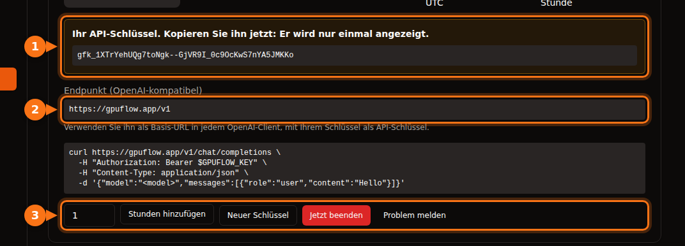

Viele KI-Tools lassen sich statt mit OpenAI auch mit einem anderen Anbieter betreiben, solange dieser dieselbe API spricht. Dafür brauchen Sie immer dieselben drei Dinge:

| Was | Beispiel |
| --- | --- |
| **Base URL** (auch API base, Endpunkt oder Host genannt) | `https://gpuflow.app/v1` |
| **API-Schlüssel** | `gfk_...` |
| **Modellname** | `qwen2.5:7b` |

Als Beispiel verwenden wir durchgehend eine GPUFlow-Miete, aber die Schritte sind für jeden OpenAI-kompatiblen Server gleich: ein lokales Ollama oder llama.cpp, vLLM, OpenRouter und viele mehr. Sie ändern nur die drei Werte.

Bei GPUFlow finden Sie alle drei nach dem Mieten einer GPU unter **Dashboard → Aktuelle Mieten**:



## Bevor Sie anfangen: Endpunkt und Modellnamen prüfen

Ein einziger Befehl zeigt Ihnen, ob der Schlüssel funktioniert und wie das Modell heißt:

```bash
curl https://gpuflow.app/v1/models \
  -H "Authorization: Bearer gfk_your_key"
```

Die Antwort listet die Modelle auf. Kopieren Sie die `id`, zum Beispiel `qwen2.5:7b`, genau so, wie sie dasteht. Ein falscher Modellname ist der häufigste Grund, warum eine App nicht funktioniert.

**Prüfen Sie, was Ihr Endpunkt unterstützt.** Der Endpunkt von GPUFlow bietet `/v1/models` und `/v1/chat/completions`, mit Streaming. Embeddings, die neuere Responses API und Bildgenerierung bietet er nicht. Manche App-Funktionen brauchen genau das; wir weisen weiter unten darauf hin.

## Chat-Apps

### Open WebUI

1. Öffnen Sie **Settings → Admin → Connections**.
2. Klicken Sie unter **Manage OpenAI API Connections** auf **+ (Add Connection)**.
3. Tragen Sie ein:
   - **URL:** `https://gpuflow.app/v1`
   - **API Key:** Ihren Schlüssel
4. Klicken Sie auf **Verify Connection**, um die Verbindung zu testen (Speichern allein testet nichts), und dann auf **Save**.

Open WebUI liest die Modellliste selbstständig über `/models` ein. Wenn Sie es mit Docker betreiben, können Sie stattdessen `OPENAI_API_BASE_URL` und `OPENAI_API_KEY` setzen. Diese werden aber nur beim allerersten Start von Open WebUI gelesen. Danach ändern Sie die Werte im Admin-Bereich.

Das Hochladen und Durchsuchen von Dokumenten nutzt in Open WebUI standardmäßig ein kleines, lokal laufendes Embedding-Modell und funktioniert deshalb weiter. Stellen Sie die Embedding-Engine nicht auf OpenAI mit Ihrem Chat-Endpunkt als URL um.

### LibreChat

Fügen Sie in `librechat.yaml` einen eigenen Endpunkt hinzu:

```yaml
endpoints:
  custom:
    - name: "GPUFlow"
      apiKey: "${GPUFLOW_API_KEY}"
      baseURL: "https://gpuflow.app/v1"
      models:
        default: ["qwen2.5:7b"]
        fetch: true
      titleConvo: true
      titleModel: "qwen2.5:7b"
      modelDisplayLabel: "GPUFlow"
```

Tragen Sie Ihren Schlüssel in `.env` als `GPUFLOW_API_KEY=gfk_...` ein. Verwenden Sie `apiKey: "user_provided"`, wenn jeder Nutzer seinen eigenen Schlüssel eingeben soll. Mit `fetch: true` liest LibreChat die Modellliste vom Endpunkt.

Die Dokumentensuche von LibreChat (die RAG API) nutzt standardmäßig OpenAI-Embeddings. Belassen Sie sie bei OpenAI, Ollama oder Hugging Face; richten Sie `RAG_OPENAI_BASEURL` nicht auf einen reinen Chat-Endpunkt.

### AnythingLLM

1. Öffnen Sie die LLM-Einstellungen und wählen Sie **Generic OpenAI**.
2. Füllen Sie **Base URL** (`https://gpuflow.app/v1`), **API Key**, **Chat Model Name** (`qwen2.5:7b`), **Token context window** und **Max Tokens** aus.

Mit Docker sind dieselben Einstellungen Umgebungsvariablen:

```bash
LLM_PROVIDER='generic-openai'
GENERIC_OPEN_AI_BASE_PATH='https://gpuflow.app/v1'
GENERIC_OPEN_AI_MODEL_PREF='qwen2.5:7b'
GENERIC_OPEN_AI_MODEL_TOKEN_LIMIT=32768
GENERIC_OPEN_AI_API_KEY=gfk_your_key
```

Lassen Sie den Embedder auf **AnythingLLM Default**.

### Jan

1. Öffnen Sie **Settings → Model Providers** und klicken Sie auf **Add Provider**.
2. Wählen Sie **OpenAI-compatible**.
3. Geben Sie einen Namen, die **Base URL** mit `/v1` am Ende und Ihren **API key** ein. Klicken Sie auf **Create**.

Jan lädt die Modellliste beim Speichern. Falls nicht, fügen Sie den Modellnamen mit der Schaltfläche **+** in der Modellliste des Providers von Hand hinzu.

## Coding-Assistenten

### Continue (VS Code und JetBrains)

Fügen Sie in Ihrer `config.yaml` ein Modell hinzu:

```yaml
models:
  - name: GPUFlow Qwen 2.5 7B
    provider: openai
    model: qwen2.5:7b
    apiBase: https://gpuflow.app/v1
    apiKey: ${{ secrets.GPUFLOW_API_KEY }}
    roles:
      - chat
      - edit
      - apply
```

Lassen Sie die Rollen `autocomplete` und `embed` weg: Dieser Endpunkt bietet nur Chat, und Embeddings brauchen `/v1/embeddings`. In VS Code hat Continue einen eingebauten Embedder für die Codebase-Suche. In JetBrains fehlt er, dort richten Sie also ein separates Embedding-Modell ein.

Der Agent-Modus von Continue braucht ein Modell, das mit Tool Calls umgehen kann. Fügen Sie `capabilities: [tool_use]` nur hinzu, wenn Sie wissen, dass Ihres das kann.

### Cline

1. Öffnen Sie die Einstellungen von Cline.
2. Stellen Sie **API Provider** auf **OpenAI Compatible**.
3. Füllen Sie **Base URL**, **API Key** und **Model** (`qwen2.5:7b`) aus.
4. Stellen Sie unter **Model Configuration** das Kontextfenster [passend zu Ihrem Modell](/de/which-ai-models-fit-your-gpu-vram/) ein.

Ein Hinweis zu **Roo Code**: Laut Doku funktioniert es nur mit Modellen, die natives Tool Calling unterstützen, ohne Fallback. Mit einem einfachen Chat-Endpunkt klappt es daher unter Umständen nicht.

## Code

### Die Python- und Node-Bibliotheken von OpenAI

Python (`pip install openai`):

```python
from openai import OpenAI

client = OpenAI(base_url="https://gpuflow.app/v1", api_key="gfk_your_key")

reply = client.chat.completions.create(
    model="qwen2.5:7b",
    messages=[{"role": "user", "content": "Say hello in five languages."}],
)
print(reply.choices[0].message.content)
```

Node (`npm install openai`):

```js
import OpenAI from "openai";

const client = new OpenAI({ baseURL: "https://gpuflow.app/v1", apiKey: "gfk_your_key" });

const reply = await client.chat.completions.create({
  model: "qwen2.5:7b",
  messages: [{ role: "user", content: "Say hello in five languages." }],
});
console.log(reply.choices[0].message.content);
```

Beide Bibliotheken lesen auch `OPENAI_BASE_URL` und `OPENAI_API_KEY` aus der Umgebung. Beachten Sie, dass ihre READMEs inzwischen mit `client.responses.create(...)` beginnen. Das ist die Responses API; verwenden Sie wie oben `client.chat.completions.create(...)`.

### LangChain

Python (`pip install -U langchain-openai`):

```python
from langchain_openai import ChatOpenAI

llm = ChatOpenAI(
    model="qwen2.5:7b",
    base_url="https://gpuflow.app/v1",
    api_key="gfk_your_key",
    use_responses_api=False,
)
print(llm.invoke("Name three uses for a GPU.").content)
```

JavaScript (`npm install @langchain/openai @langchain/core`). Setzen Sie zuerst Ihren Schlüssel in der Umgebung, `export OPENAI_API_KEY=gfk_your_key`, dann:

```js
import { ChatOpenAI } from "@langchain/openai";

const llm = new ChatOpenAI({
  model: "qwen2.5:7b",
  configuration: { baseURL: "https://gpuflow.app/v1" },
});
```

LangChain wechselt zur Responses API, wenn Sie bestimmte Funktionen nutzen, etwa eingebaute Tools oder Reasoning-Ausgaben. `use_responses_api=False` hält es bei Chat Completions.

### LlamaIndex

Verwenden Sie `OpenAILike` (`pip install llama-index-llms-openai-like`):

```python
from llama_index.llms.openai_like import OpenAILike

llm = OpenAILike(
    model="qwen2.5:7b",
    api_base="https://gpuflow.app/v1",
    api_key="gfk_your_key",
    context_window=32768,
    is_chat_model=True,
    is_function_calling_model=False,
)
```

**Setzen Sie `is_chat_model=True`.** Der Standardwert ist `False`, und dann gehen Anfragen an `/v1/completions` statt an `/v1/chat/completions`. Zum Indexieren von Dokumenten setzen Sie `Settings.embed_model` auf ein echtes Embedding-Modell; LlamaIndex nutzt standardmäßig OpenAI-Embeddings.

## Tools, die mit einem reinen Chat-Endpunkt nicht funktionieren

- **Codex CLI.** Die Unterstützung für Chat Completions wurde Anfang 2026 gestrichen, akzeptiert wird nur noch die Responses API.
- **OpenAI Agents SDK.** Es nutzt standardmäßig die Responses API. Rufen Sie `set_default_openai_api("chat_completions")` auf oder verpacken Sie Ihren Client in `OpenAIChatCompletionsModel`, und schalten Sie das Tracing mit `set_tracing_disabled(True)` ab, denn Tracing braucht einen OpenAI-Schlüssel.
- **Alles, was Embeddings** vom selben Endpunkt braucht: Dokumentensuche, „Chat mit Ihren Dateien“, semantische Codesuche. Nutzen Sie den eingebauten Embedder der App oder einen separaten Embedding-Anbieter.

## Wenn es immer noch nicht funktioniert

| Was Sie sehen | Übliche Ursache |
| --- | --- |
| `404` oder „not found“ | In der Base URL fehlt `/v1`, oder die App hängt `/v1` selbst an und Sie haben es doppelt eingetragen. |
| `401` oder `invalid_api_key` | Falscher Schlüssel, oder die Miete ist beendet. Bei GPUFlow klicken Sie unter **Aktuelle Mieten** auf **Neuer Schlüssel**, wenn Sie ihn verloren haben. |
| „Model not found“ | Der Modellname stimmt nicht exakt mit `/v1/models` überein. |
| Anfragen an `/v1/completions` oder `/v1/responses` schlagen fehl | Die App nutzt eine andere API. Suchen Sie nach einer Einstellung wie „chat model“ oder „chat completions“. |

## Verwandte Artikel

- [GPU pro Stunde oder API pro Token? Was ein 7B–8B-Modell wirklich kostet](/de/hourly-gpu-vs-per-token-api/)
- [GPUFlow vs. Vast.ai vs. RunPod vs. SaladCloud: Welche Plattform passt zu Ihrem Vorhaben](/de/gpuflow-vs-vast-ai-vs-runpod/)

## Quellen

Alle geprüft im September 2026.

- Open WebUI: [OpenAI-kompatible Anbieter](https://docs.openwebui.com/getting-started/quick-start/connect-a-provider/starting-with-openai-compatible/), [Umgebungsvariablen](https://docs.openwebui.com/reference/env-configuration)
- LibreChat: [eigene Endpunkte](https://www.librechat.ai/docs/configuration/librechat_yaml/object_structure/custom_endpoint), [RAG API](https://www.librechat.ai/docs/configuration/rag_api)
- AnythingLLM: [Generic OpenAI](https://docs.anythingllm.com/setup/llm-configuration/cloud/openai-generic)
- Jan: [eigene Endpunkte](https://www.jan.ai/docs/desktop/remote-models/custom-endpoint)
- Continue: [OpenAI-Provider](https://docs.continue.dev/customize/model-providers/top-level/openai), [Konfigurationsreferenz](https://docs.continue.dev/reference)
- Cline: [OpenAI Compatible](https://docs.cline.bot/provider-config/openai-compatible); Roo Code: [OpenAI Compatible](https://roocodeinc.github.io/Roo-Code/providers/openai-compatible/)
- OpenAI-Bibliotheken: [openai-python](https://github.com/openai/openai-python), [openai-node](https://github.com/openai/openai-node)
- LangChain: [Python](https://docs.langchain.com/oss/python/integrations/chat/openai), [JavaScript](https://docs.langchain.com/oss/javascript/integrations/chat/openai)
- LlamaIndex: [OpenAILike](https://developers.llamaindex.ai/python/framework-api-reference/llms/openai_like/)
- OpenAI Agents SDK: [Modelle](https://openai.github.io/openai-agents-python/models/)
- Codex und Chat Completions: [github.com/openai/codex/discussions/7782](https://github.com/openai/codex/discussions/7782)
- GPUFlow-API: [Ihren API-Schlüssel verwenden](https://docs.gpuflow.app/de/renters/api-quickstart/)
