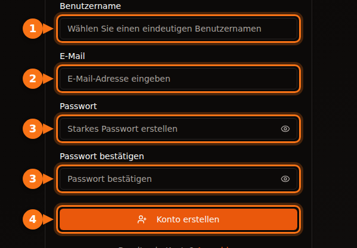
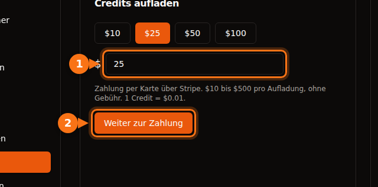

Bevor Sie Ihre erste GPU mieten, verlangt jede Plattform etwas von Ihnen: eine E-Mail-Adresse, eine Karte, manchmal eine Telefonnummer und bei den großen Clouds einen Kontingentantrag, der Tage dauern kann. Dieser Artikel listet auf, was jede Plattform verlangt, damit Sie eine wählen können, mit der Sie noch heute loslegen.

Alles wurde im September 2026 in der Doku der jeweiligen Plattform geprüft. Die Quellen stehen am Ende.

## Der schnelle Vergleich

| Plattform | Zum Anlegen eines Kontos | Bevor Sie mieten können | Identitätsprüfung für Mieter | Minimum zum Start |
| --- | --- | --- | --- | --- |
| **GPUFlow** | E-Mail und Passwort, oder Google bzw. GitHub | E-Mail bestätigen, Credits per Karte aufladen | Keine in den Schritten für Mieter | 10 $ Aufladung, ohne Gebühr |
| **Vast.ai** | E-Mail | E-Mail bestätigen, Guthaben aufladen | Nicht in der Doku | 5 $ Einzahlung |
| **RunPod** | E-Mail | Guthaben aufladen | Nur vor einer ersten Krypto-Zahlung | Guthaben für 1 Stunde; 100 $ pro Transaktion mit Prepaid-Karte |
| **SaladCloud** | Portal-Konto | Eine Zahlungsmethode für Ihre Organisation hinterlegen | Nicht in der Doku | Aufladungen ab 5 $ |
| **Lambda** | Konto | Eine Kreditkarte hinterlegen | Nicht in der Doku | 10 $ Reservierung auf der Karte, wird freigegeben |
| **TensorDock** | Konto | Geld einzahlen | Die Nutzungsbedingungen erlauben Kontoprüfungen | „Schon ab 5 $“ |
| **AWS** | E-Mail, PIN-Prüfung per Telefon, Zahlungsmethode, CAPTCHA | GPU-Kontingent beantragen: Neue Konten starten bei 0 | Bei den meisten Konten nicht | Nutzungsbasierte Abrechnung |
| **Google Cloud** | Konto mit Abrechnung | GPU-Kontingent beantragen; Testkonten bekommen keins | Bei den meisten Konten nicht | Nutzungsbasierte Abrechnung |

„Nicht in der Doku“ heißt, dass wir in der Dokumentation der Plattform keine Pflicht zur Identitätsprüfung für Mieter gefunden haben. Plattformen können trotzdem Prüfungen verlangen, wenn ihnen etwas ungewöhnlich vorkommt.

## Die kleinen Plattformen: Minuten statt Tage

Vast.ai, RunPod, SaladCloud, TensorDock und GPUFlow arbeiten alle mit Vorauszahlung. Sie zahlen zuerst Geld ein und verbrauchen es dann sekunden- oder minutengenau. Weil Sie keine Rechnung auflaufen lassen können, die Sie nicht schon bezahlt haben, müssen diese Plattformen weder Ihre Bonität noch Ihr Unternehmen prüfen.

Worin sie sich unterscheiden:

- **E-Mail-Bestätigung.** Vast.ai und GPUFlow verlangen sie beide, bevor Sie mieten oder Credits aufladen können. Sehen Sie im Spam-Ordner nach, wenn die E-Mail nicht ankommt.
- **Zahlungsmethoden.**
  - Vast.ai: Karte, BitPay, Crypto.com.
  - RunPod: Visa, Mastercard, Amex, Krypto und Zahlung auf Rechnung bei Beträgen über 5.000 $.
  - SaladCloud: Karte oder USDC, USDT und RENDER auf Solana.
  - Lambda: nur gängige Kreditkarten und nur in unterstützten Ländern.
  - GPUFlow: Karten über Stripe.
- **Was mit ungenutztem Geld passiert.** Guthaben bei SaladCloud verfällt 12 Monate nach dem Kauf. Credits bei GPUFlow verfallen nicht.

## Die großen Clouds: Planen Sie einen Kontingentantrag ein

AWS und Google Cloud bremsen Sie nicht bei der Registrierung aus, sondern erst bei der GPU.

- **AWS:** Das Kontingent für „Running On-Demand G and VT instances“ (die Instanzfamilie mit NVIDIA L4 und A10G) liegt bei neuen Konten bei **0 vCPUs**. Mehr beantragen Sie in der Service-Quotas-Konsole. AWS hebt Kontingente außerdem automatisch an, wenn ein Konto mit der Zeit mehr genutzt wird.
- **Google Cloud:** Konten im kostenlosen Testzeitraum bekommen kein GPU-Kontingent. Sobald das Projekt eine Abrechnungshistorie hat, werden Kontingentanträge eher bewilligt. Kontingente gelten pro Region, und präemptive GPUs brauchen ein eigenes Kontingent.

Wenn Sie heute eine GPU brauchen, fangen Sie nicht mit einem neuen AWS- oder Google-Cloud-Konto an.

## Registrierung bei GPUFlow, Schritt für Schritt

GPUFlow ist für den Fall „Ich brauche in fünf Minuten ein KI-Modell“ gebaut. Sie bekommen einen OpenAI-kompatiblen API-Schlüssel für eine GPU, keine Maschine.

1. **Legen Sie auf gpuflow.app ein Konto an**, mit Benutzernamen, E-Mail-Adresse und Passwort oder mit Google bzw. GitHub.

   

2. **Bestätigen Sie Ihre E-Mail-Adresse.** Klicken Sie auf den Link in der E-Mail, die GPUFlow Ihnen schickt. Vorher können Sie keine Credits aufladen.
3. **Laden Sie unter Dashboard → Zahlungen Credits auf**: 10 $ bis 500 $ per Karte über Stripe. 1 Credit = 0,01 $, und es fällt keine Gebühr an.

   

4. **Mieten Sie eine GPU** für die gewünschte Zahl von Stunden und kopieren Sie Ihren API-Schlüssel. Sie [zahlen sekundengenau](/de/per-second-vs-hourly-gpu-billing/); beenden Sie die Miete früher, wird der Rest Ihren Credits gutgeschrieben.

Die vollständige Anleitung mit allen Screenshots steht in der Doku: [GPU mieten, Schritt für Schritt](https://docs.gpuflow.app/de/renters/getting-started/).

## Wenn Sie stattdessen eine GPU vermieten möchten

Bei Auszahlungen kommen Identitätsprüfungen ins Spiel. Zahlungsdienstleister sind verpflichtet zu wissen, an wen sie Geld überweisen.

- **GPUFlow:** Für Auszahlungen richten Sie ein Auszahlungskonto bei Stripe ein. Stripe prüft Ihre Identität und fragt nach Ihrer Bankverbindung. Auszahlungen funktionieren in den USA, in Kanada, im Vereinigten Königreich, in der Schweiz und im Europäischen Wirtschaftsraum.
- **Vast.ai:** Hosts werden über Wise, PayPal oder Stripe bezahlt, und diese Dienste übernehmen die Identitätsprüfung.
- **Salad:** Belohnungen werden über PayPal, als Geschenkkarten und auf weiteren Wegen ausgezahlt.

Was das Vermieten einbringt, lesen Sie in [Was Ihre Gaming-GPU verdient](/de/how-much-can-you-earn-renting-out-your-gpu/).

## Vor dem Bezahlen: eine kurze Checkliste

1. **Bestätigen Sie zuerst Ihre E-Mail-Adresse**, damit Sie nicht beim Bezahlen hängen bleiben.
2. **Prüfen Sie, ob Ihr Land und Ihre Karte unterstützt werden.** Lambda zum Beispiel akzeptiert nur Zahlungen aus bestimmten Ländern.
3. **Klären Sie die Auslandseinsatzgebühr Ihrer Bank.** Die meisten Plattformen rechnen in US-Dollar ab. [Mehr zu versteckten Kosten](/de/hidden-fees-in-gpu-rental/).
4. **Fangen Sie klein an.** Laden Sie genug für ein paar Stunden auf, testen Sie und laden Sie dann nach.

## Verwandte Artikel

- [GPUFlow vs. Vast.ai vs. RunPod vs. SaladCloud: Welche Plattform passt zu Ihrem Vorhaben](/de/gpuflow-vs-vast-ai-vs-runpod/)
- [OpenAI-kompatiblen API-Schlüssel in Open WebUI, Continue, LangChain und anderen Tools nutzen](/de/use-openai-compatible-api-key-in-apps/)

## Quellen

Alle geprüft im September 2026.

- GPUFlow: [GPU mieten, Schritt für Schritt](https://docs.gpuflow.app/de/renters/getting-started/), [Credits und Abrechnung](https://docs.gpuflow.app/de/renters/billing/), [Auszahlungen](https://docs.gpuflow.app/de/providers/getting-paid/)
- Vast.ai: [Quickstart](https://docs.vast.ai/guides/get-started/quickstart.md), [Abrechnung](https://docs.vast.ai/documentation/reference/billing), [Auszahlungen an Hosts](https://docs.vast.ai/host/payment.md)
- RunPod: [Informationen zur Abrechnung](https://docs.runpod.io/references/billing-information)
- SaladCloud: [Kontoeinrichtung](https://docs.salad.com/general/tutorials/account-setup.md), [Abrechnung](https://docs.salad.com/general/explanation/billing.md)
- Lambda: [Abrechnung verwalten](https://docs.lambda.ai/public-cloud/manage-billing/)
- TensorDock: [Cloud-GPUs](https://www.tensordock.com/cloud-gpus.html), [Nutzungsbedingungen](https://docs.tensordock.com/legal-information/terms-of-service-tos)
- AWS: [Konto anlegen](https://docs.aws.amazon.com/accounts/latest/reference/manage-acct-creating.html), [Kontingente für On-Demand-Instanzen](https://docs.aws.amazon.com/AWSEC2/latest/UserGuide/ec2-on-demand-instances.html)
- Google Cloud: [Fehlerbehebung bei GPU-Kontingenten](https://docs.cloud.google.com/deep-learning-vm/docs/troubleshooting)
- Belohnungen bei Salad: [Einlösen über PayPal](https://support.salad.com/rewards/redeeming-your-rewards/how-to-redeem-paypal/)
