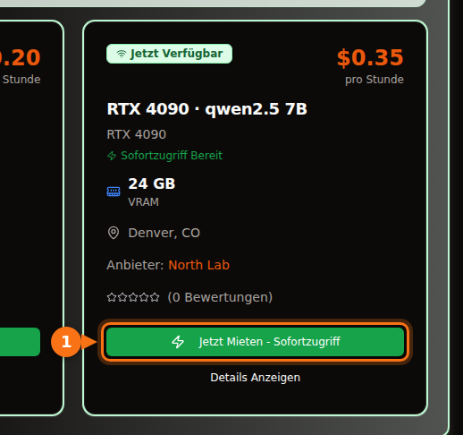

Mit der 4-Bit-Quantisierung, die Ollama standardmäßig ausliefert, braucht ein 7B- oder 8B-Modell eine 8-GB-Karte, 12B- bis 14B-Modelle brauchen 12 GB (16 GB, wenn Sie lange Prompts wollen), und 27B- bis 32B-Modelle brauchen 24 GB. Ein 70B-Modell ist in 4 Bit 43 GB groß, also brauchen Sie 48 GB VRAM oder mehr.

Die ausführliche Antwort ist wichtig, weil die Download-Größe nicht die ganze Rechnung ist. Auch der Kontext belegt Speicher, und ein Modell, das scheinbar passt, kann am Ende zur Hälfte auf der CPU laufen und um ein Vielfaches langsamer sein. Unten finden Sie die Formel, mit der ich rechne, was die Quantisierungsbezeichnungen bedeuten, und eine Tabelle aktueller offener Modelle mit ihren echten Download-Größen aus der Ollama-Bibliothek. Größen und technische Daten wurden im September 2026 geprüft; die Quellen stehen am Ende.

## Die kurze Antwort nach VRAM-Größe

| VRAM | Typische Karten | Was komplett auf der GPU läuft (4 Bit) |
| --- | --- | --- |
| 8 GB | RTX 4060, RTX 5060, RTX 3070 | Modelle mit 7B bis 8B: Llama 3.1 8B, Qwen3 8B, Mistral 7B |
| 12 GB | RTX 3060 12 GB, RTX 4070, RTX 5070 | 12B- bis 14B-Modelle bei kurzem Kontext; 7B bis 8B in Q8_0 |
| 16 GB | RTX 4060 Ti 16 GB, RTX 4080, RTX 5080 | 14B mit langem Kontext, gpt-oss 20B |
| 24 GB | RTX 3090, RTX 4090 | 24B bis 32B: Mistral Small 3.2, Gemma 3 27B, Qwen3 32B |
| 32 GB | RTX 5090 | 32B mit langem Kontext, 35B-Mixture-of-Experts-Modelle |
| 48 bis 80 GB | L40S (48 GB), H100 (80 GB) | 70B in 4 Bit, gpt-oss 120B auf 80 GB |

Die Speichergrößen der Karten stammen aus den Datenblättern von NVIDIA. Manche Karten gibt es in zwei Versionen: die RTX 3060 mit 12 GB und mit 8 GB, die RTX 4060 Ti und die RTX 5060 Ti mit 16 GB und mit 8 GB. Prüfen Sie, welche Sie kaufen oder mieten.

## So schätzen Sie den VRAM-Bedarf eines Modells

Während ein Modell antwortet, liegen drei Dinge im GPU-Speicher:

1. **Die Gewichte.** Parameter × Bits pro Gewicht ÷ 8 = Bytes.
2. **Der KV-Cache.** Das Modell hält die Keys und Values jedes Tokens im Gespräch vor, damit es sie nicht neu berechnen muss. Pro Token sind das 2 × Schichten × KV-Heads × Head-Größe × 2 Bytes (beim standardmäßigen 16-Bit-Cache). Das multiplizieren Sie mit der Kontextlänge.
3. **Overhead.** Der CUDA-Kontext, Arbeitspuffer und die Laufzeitumgebung selbst. Ich plane etwa 1 GB ein. Der Wert schwankt je nach Engine und Einstellungen; nehmen Sie ihn als Faustregel, nicht als Spezifikation.

Die Zahl der Schichten und Heads steht in der `config.json` jedes Modells auf Hugging Face.

### Rechenbeispiel: Qwen 2.5 14B auf einer 16-GB-Karte

Qwen 2.5 14B hat 14,7 Milliarden Parameter, 48 Schichten, 8 KV-Heads und eine Head-Größe von 128 (5.120 Hidden Size ÷ 40 Attention-Heads).

- **Gewichte in Q4_K_M:** llama.cpp gibt für Q4_K_M etwa 4,89 Bits pro Gewicht an. 14,7 Milliarden × 4,89 ÷ 8 = 8,99 GB. Der Download von `qwen2.5:14b` bei Ollama ist 9,0 GB groß; die Rechnung stimmt also mit der echten Datei überein.
- **KV-Cache pro Token:** 2 × 48 × 8 × 128 × 2 Bytes = 196.608 Bytes, etwa 0,2 MB.
- **KV-Cache für den ganzen Kontext:** 4.096 Tokens = 0,8 GB. 16.384 Tokens = 3,2 GB. 32.768 Tokens = 6,4 GB.
- **Summe:** 9,0 + 0,8 + 1 = 10,8 GB bei 4K Kontext. 9,0 + 3,2 + 1 = 13,2 GB bei 16K. 9,0 + 6,4 + 1 = 16,4 GB bei 32K, und das passt nicht mehr auf eine 16-GB-Karte.

<figure>
<svg viewBox="0 0 720 340" role="img" aria-labelledby="d1-title" xmlns="http://www.w3.org/2000/svg" font-family="system-ui, sans-serif" font-size="15">
<title id="d1-title">Was bei Qwen 2.5 14B in Q4_K_M auf einer 16-GB-Karte den VRAM füllt: Gewichte, KV-Cache bei drei Kontextlängen und Overhead</title>
<rect x="0" y="0" width="720" height="340" fill="#ffffff"/>
<rect x="150" y="20" width="16" height="16" rx="3" fill="#6366f1"/>
<text x="172" y="33" fill="#1e1b4b">Gewichte 9,0 GB</text>
<rect x="330" y="20" width="16" height="16" rx="3" fill="#a5b4fc"/>
<text x="352" y="33" fill="#1e1b4b">KV-Cache</text>
<rect x="510" y="20" width="16" height="16" rx="3" fill="#e2e8f0"/>
<text x="532" y="33" fill="#1e1b4b">Overhead ~1 GB</text>
<line x1="582.0" y1="66" x2="582.0" y2="278" stroke="#f97316" stroke-width="2" stroke-dasharray="5 4"/>
<text x="576.0" y="60" text-anchor="end" fill="#f97316" font-weight="600">16-GB-Karte</text>
<text x="140" y="106" text-anchor="end" fill="#1e1b4b">4K Kontext</text>
<rect x="150" y="80" width="243.0" height="40" fill="#6366f1"/>
<text x="271.5" y="106" text-anchor="middle" fill="#ffffff">Gewichte</text>
<rect x="393.0" y="80" width="21.6" height="40" fill="#a5b4fc"/>
<rect x="414.6" y="80" width="27.0" height="40" fill="#e2e8f0"/>
<text x="449.6" y="106" fill="#16a34a" font-weight="600">10,8 GB</text>
<text x="140" y="180" text-anchor="end" fill="#1e1b4b">16K Kontext</text>
<rect x="150" y="154" width="243.0" height="40" fill="#6366f1"/>
<text x="271.5" y="180" text-anchor="middle" fill="#ffffff">Gewichte</text>
<rect x="393.0" y="154" width="86.4" height="40" fill="#a5b4fc"/>
<text x="436.2" y="180" text-anchor="middle" fill="#1e1b4b">3,2</text>
<rect x="479.4" y="154" width="27.0" height="40" fill="#e2e8f0"/>
<text x="514.4" y="180" fill="#16a34a" font-weight="600">13,2 GB</text>
<text x="140" y="254" text-anchor="end" fill="#1e1b4b">32K Kontext</text>
<rect x="150" y="228" width="243.0" height="40" fill="#6366f1"/>
<text x="271.5" y="254" text-anchor="middle" fill="#ffffff">Gewichte</text>
<rect x="393.0" y="228" width="172.8" height="40" fill="#a5b4fc"/>
<text x="479.4" y="254" text-anchor="middle" fill="#1e1b4b">6,4</text>
<rect x="565.8" y="228" width="27.0" height="40" fill="#e2e8f0"/>
<text x="600.8" y="254" fill="#f97316" font-weight="600">16,4 GB</text>
<line x1="150" y1="278" x2="690" y2="278" stroke="#64748b"/>
<line x1="150.0" y1="278" x2="150.0" y2="283" stroke="#64748b"/>
<text x="150.0" y="300" text-anchor="middle" fill="#64748b">0</text>
<line x1="258.0" y1="278" x2="258.0" y2="283" stroke="#64748b"/>
<text x="258.0" y="300" text-anchor="middle" fill="#64748b">4</text>
<line x1="366.0" y1="278" x2="366.0" y2="283" stroke="#64748b"/>
<text x="366.0" y="300" text-anchor="middle" fill="#64748b">8</text>
<line x1="474.0" y1="278" x2="474.0" y2="283" stroke="#64748b"/>
<text x="474.0" y="300" text-anchor="middle" fill="#64748b">12</text>
<line x1="582.0" y1="278" x2="582.0" y2="283" stroke="#64748b"/>
<text x="582.0" y="300" text-anchor="middle" fill="#64748b">16</text>
<line x1="690.0" y1="278" x2="690.0" y2="283" stroke="#64748b"/>
<text x="690.0" y="300" text-anchor="middle" fill="#64748b">20</text>
<text x="420.0" y="326" text-anchor="middle" fill="#64748b">GB VRAM</text>
</svg>
<figcaption>Qwen 2.5 14B in Q4_K_M auf einer 16-GB-Karte. Die Gewichte bleiben bei 9,0 GB; der KV-Cache wächst mit dem Kontext, bis die Summe bei 32K Tokens über 16 GB liegt. Der Overhead ist mit 1 GB als Faustregel angesetzt.</figcaption>
</figure>

Daraus folgen zwei Dinge. Erstens kann der eingestellte Kontext so viel Speicher kosten wie das Modell selbst. Llama 3.1 8B (32 Schichten, 8 KV-Heads, Head-Größe 128) braucht 131.072 Bytes KV-Cache pro Token. Der volle Kontext von 128K bräuchte also allein 17,2 GB Cache, etwa dreieinhalbmal so viel wie der Download mit 4,9 GB. Zweitens unterscheidet sich die KV-Cache-Größe pro Token stark zwischen Modellen. Qwen 2.5 7B hat nur 4 KV-Heads und 28 Schichten und braucht deshalb 57.344 Bytes pro Token, weniger als die Hälfte von Llama 3.1 8B. Sehen Sie in die Config, bevor Sie etwas annehmen.

### Was Ollama standardmäßig mit dem Kontext macht

Ollama wählt die Standard-Kontextlänge nach dem VRAM, den es vorfindet: 4K Tokens unter 24 GiB, 32K Tokens von 24 bis 48 GiB und 256K ab 48 GiB. Ändern können Sie das mit der Umgebungsvariable `OLLAMA_CONTEXT_LENGTH`, und `ollama ps` zeigt in der Spalte CONTEXT den tatsächlich reservierten Kontext. Zwei weitere Einstellungen ändern die Rechnung:

- `OLLAMA_NUM_PARALLEL` (Standard 1): Laut der Ollama-Doku vergrößern parallele Anfragen den Kontext um die Zahl der parallelen Anfragen. Vier parallele Slots bedeuten den vierfachen KV-Cache.
- `OLLAMA_KV_CACHE_TYPE`: `q8_0` braucht etwa halb so viel Speicher wie der Standard-Cache `f16`, `q4_0` etwa ein Viertel. Dafür muss Flash Attention aktiviert sein.

## Was die Quantisierungsstufen bedeuten

Offene Modelle werden in 16-Bit-Genauigkeit veröffentlicht (die unten verlinkten Configs nennen bfloat16): zwei Bytes pro Parameter. Quantisierung speichert die Gewichte mit weniger Bits. In GGUF-Dateien, dem Format von Ollama und llama.cpp, bedeuten die Bezeichnungen ungefähr Folgendes:

| Bezeichnung | Bits pro Gewicht | Größe Llama 3.1 8B | Perplexity bei Llama 3 8B (niedriger ist besser) |
| --- | --- | --- | --- |
| F16 | 16,0 | 14,96 GiB | 6,233 |
| Q8_0 | 8,50 | 7,95 GiB | 6,234 |
| Q6_K | 6,56 | 6,14 GiB | 6,253 |
| Q5_K_M | 5,70 | 5,33 GiB | 6,289 |
| Q4_K_M | 4,89 | 4,58 GiB | 6,407 |
| Q3_K_M | 4,00 | 3,74 GiB | 6,888 |
| Q2_K_S / Q2_K | 2,97 | 2,78 GiB | 9,752 (Q2_K) |

Bits pro Gewicht und Größen stammen aus der README zu `quantize` von llama.cpp (Llama 3.1 8B), die Perplexity aus der README zu `perplexity` von llama.cpp (Llama 3 8B, Wikitext). Die „K“-Typen sind die K-Quants von llama.cpp, die unterschiedliche Genauigkeiten im Modell mischen; `_S`, `_M` und `_L` stehen für kleine, mittlere und große Mischungen.

Was die Zahlen zeigen: Q8_0 ist praktisch verlustfrei (Perplexity 6,234 gegenüber 6,233). Q4_K_M kostet etwa 3 % Perplexity, und laut derselben README stimmt das wahrscheinlichste nächste Token in 91,9 % der Fälle mit dem Modell in voller Genauigkeit überein. Q3 ist spürbar schlechter, und Q2 bricht ein.

Perplexity ist nicht dasselbe wie Nützlichkeit. Deshalb hilft eine Studie von Uygar Kurt aus dem Januar 2026: Sie hat Llama 3.1 8B Instruct auf jeder llama.cpp-Stufe durch Benchmarks für Reasoning, Wissen, Befolgen von Anweisungen und Wahrhaftigkeit geschickt. Der ungewichtete Durchschnitt lag bei 69,47 in F16, 69,41 in Q8_0, 69,36 in Q5_K_M und 69,15 in Q4_K_M. Das ist der Grund, warum fast alle, Ollama eingeschlossen, standardmäßig Q4_K_M verwenden: Die Datei ist kleiner als ein Drittel von FP16, und den Verlust bemerken Sie selten. Bei Ollama ist der einfache Tag genau dieser 4-Bit-Build: `qwen3:8b` und `qwen3:8b-q4_K_M` sind beide 5,2 GB groß, `phi4:14b` und `phi4:14b-q4_K_M` beide 9,1 GB.

Meine Regel: Nehmen Sie lieber das größte Modell, das in Q4_K_M passt, als ein kleineres in Q8_0. Ein 14B in Q4 schlägt meist ein 7B in Q8, und die Dateien sind ungefähr gleich groß. Zu Q5 oder Q8 greifen Sie, wenn Speicher übrig ist und die Aufgabe empfindlich auf kleine Fehler reagiert, etwa bei Code oder exakter Extraktion.

Neuere Ollama-Tags enthalten außerdem Formate wie `qat` (die quantisierungsbewusst trainierten Builds von Gemma), `nvfp4` und `mxfp8`. gpt-oss liefert OpenAI selbst in MXFP4 aus, mit 4,25 Bits pro Parameter für die Mixture-of-Experts-Gewichte.

## Welche Modelle passen: Größen und VRAM-Stufen

Die Tabelle zeigt aktuelle offene Modelle aus der Ollama-Bibliothek, Stand September 2026, mit ihren Download-Größen. Die Spalte „4 Bit“ gibt die Größe des Standard-Tags an. Bei den meisten Modellen ist das dieselbe Datei wie beim Tag `q4_K_M`; wo der Standard ein anderer Build ist, stehen beide Größen in der Tabelle (bei Mistral Nemo ist der Standard 7,1 GB groß, `q4_K_M` 7,5 GB). „Kleinste Karte“ heißt: Das Modell plus etwa 1 GB Overhead plus 4K bis 8K Kontext passt komplett auf die GPU. Sie wollen langen Kontext? Gehen Sie eine Stufe höher.

| Modell | Ollama-Tag | Größe 4 Bit | Größe Q8_0 | Kleinste Karte (4 Bit / Q8_0) |
| --- | --- | --- | --- | --- |
| Mistral 7B v0.3 | [`mistral:7b`](https://ollama.com/library/mistral/tags) | 4,4 GB | 7,7 GB | 8 GB / 12 GB |
| Qwen 2.5 7B | [`qwen2.5:7b`](https://ollama.com/library/qwen2.5/tags) | 4,7 GB | 8,1 GB | 8 GB / 12 GB |
| DeepSeek-R1 Distill 7B (Qwen 2.5) | [`deepseek-r1:7b`](https://ollama.com/library/deepseek-r1/tags) | 4,7 GB | nicht geprüft | 8 GB |
| Llama 3.1 8B | [`llama3.1:8b`](https://ollama.com/library/llama3.1/tags) | 4,9 GB | 8,5 GB | 8 GB / 12 GB |
| Qwen3 8B | [`qwen3:8b`](https://ollama.com/library/qwen3/tags) | 5,2 GB | 8,9 GB | 8 GB / 12 GB |
| DeepSeek-R1-0528 (Qwen3 8B) | [`deepseek-r1:8b`](https://ollama.com/library/deepseek-r1/tags) | 5,2 GB | nicht geprüft | 8 GB |
| Qwen3.5 9B | [`qwen3.5:9b`](https://ollama.com/library/qwen3.5/tags) | 6,6 GB | 11 GB | 8 GB, nur kurzer Kontext / 16 GB |
| Mistral Nemo 12B | [`mistral-nemo:12b`](https://ollama.com/library/mistral-nemo/tags) | 7,1 GB (q4_K_M: 7,5 GB) | 13 GB | 12 GB / 16 GB |
| Gemma 4 12B | [`gemma4:12b`](https://ollama.com/library/gemma4/tags) | 7,6 GB | 13 GB | 12 GB / 16 GB |
| Gemma 3 12B | [`gemma3:12b`](https://ollama.com/library/gemma3/tags) | 8,1 GB | 13 GB | 12 GB / 16 GB |
| Qwen 2.5 14B | [`qwen2.5:14b`](https://ollama.com/library/qwen2.5/tags) | 9,0 GB | 16 GB | 12 GB / 24 GB |
| DeepSeek-R1 Distill 14B (Qwen 2.5) | [`deepseek-r1:14b`](https://ollama.com/library/deepseek-r1/tags) | 9,0 GB | nicht geprüft | 12 GB |
| Phi-4 14B | [`phi4:14b`](https://ollama.com/library/phi4/tags) | 9,1 GB | 16 GB | 12 GB / 24 GB |
| Qwen3 14B | [`qwen3:14b`](https://ollama.com/library/qwen3/tags) | 9,3 GB | 16 GB | 12 GB / 24 GB |
| gpt-oss 20B (MoE) | [`gpt-oss:20b`](https://ollama.com/library/gpt-oss/tags) | 14 GB (MXFP4) | entfällt | 16 GB |
| Mistral Small 3.2 24B | [`mistral-small3.2:24b`](https://ollama.com/library/mistral-small3.2/tags) | 15 GB | 26 GB | 24 GB / 32 GB |
| Gemma 3 27B | [`gemma3:27b`](https://ollama.com/library/gemma3/tags) | 17 GB | 30 GB | 24 GB / 48 GB |
| Qwen3.5 27B | [`qwen3.5:27b`](https://ollama.com/library/qwen3.5/tags) | 17 GB | 30 GB | 24 GB / 48 GB |
| Qwen3.6 27B | [`qwen3.6:27b`](https://ollama.com/library/qwen3.6/tags) | 18 GB (q4_K_M: 17 GB) | 30 GB | 24 GB / 48 GB |
| Gemma 4 26B (MoE, 3,8B aktiv) | [`gemma4:26b`](https://ollama.com/library/gemma4/tags) | 19 GB (q4_K_M: 18 GB) | 28 GB | 24 GB / 32 GB |
| Qwen3 30B-A3B (MoE) | [`qwen3:30b`](https://ollama.com/library/qwen3/tags) | 19 GB | nicht geprüft | 24 GB |
| Gemma 4 31B | [`gemma4:31b`](https://ollama.com/library/gemma4/tags) | 20 GB | 34 GB | 24 GB / 48 GB |
| Qwen3 32B | [`qwen3:32b`](https://ollama.com/library/qwen3/tags) | 20 GB | 35 GB | 24 GB / 48 GB |
| Qwen 2.5 32B | [`qwen2.5:32b`](https://ollama.com/library/qwen2.5/tags) | 20 GB | 35 GB | 24 GB / 48 GB |
| DeepSeek-R1 Distill 32B (Qwen 2.5) | [`deepseek-r1:32b`](https://ollama.com/library/deepseek-r1/tags) | 20 GB | nicht geprüft | 24 GB |
| Qwen3.6 35B-A3B (MoE) | [`qwen3.6:35b`](https://ollama.com/library/qwen3.6/tags) | 23 GB (q4_K_M: 24 GB) | 39 GB | 32 GB / 48 GB |
| Qwen3.5 35B-A3B (MoE) | [`qwen3.5:35b`](https://ollama.com/library/qwen3.5/tags) | 24 GB | 39 GB | 32 GB / 48 GB |
| Llama 3.3 70B | [`llama3.3:70b`](https://ollama.com/library/llama3.3/tags) | 43 GB | 75 GB | 48 GB, knapp / 80 GB, knapp |
| Qwen 2.5 72B | [`qwen2.5:72b`](https://ollama.com/library/qwen2.5/tags) | 47 GB | nicht geprüft | 80 GB |
| gpt-oss 120B (MoE) | [`gpt-oss:120b`](https://ollama.com/library/gpt-oss/tags) | 65 GB (MXFP4) | entfällt | 80 GB |

Für die Stufe habe ich die Größe des Standard-Tags genommen, denn den lädt `ollama pull` mit dem kurzen Namen herunter.

Die Stufen für Karten mit 24 GB und 32 GB haben einen Haken. Der Standard-Kontext von Ollama springt bei 24 GiB von 4K auf 32K. Ein 20-GB-Modell auf einer RTX 4090 bekommt also womöglich einen 32K-Cache, der nicht mehr daneben passt. Zeigt `ollama ps` einen CPU-Anteil, stellen Sie einen kleineren Kontext ein. Und beurteilen Sie ein Modell nicht nach der Zahl im Namen: Das Edge-Modell von Gemma 4, `gemma4:e4b` (4,5B effektive Parameter), ist ein Download von 9,6 GB und damit größer als `gemma4:12b` mit 7,6 GB. Prüfen Sie die Größe.

<figure>
<svg viewBox="0 0 720 546" role="img" aria-labelledby="d2-title" xmlns="http://www.w3.org/2000/svg" font-family="system-ui, sans-serif" font-size="14">
<title id="d2-title">Download-Größe beliebter Ollama-Modelle in ihrer Standard-Quantisierung mit 4 Bit, verglichen mit 8, 12, 16, 24 und 32 GB VRAM</title>
<rect x="0" y="0" width="720" height="546" fill="#ffffff"/>
<line x1="320.0" y1="58" x2="320.0" y2="486" stroke="#f97316" stroke-width="2" stroke-dasharray="5 4"/>
<text x="320.0" y="50" text-anchor="middle" fill="#f97316" font-weight="600">8 GB</text>
<line x1="380.0" y1="58" x2="380.0" y2="486" stroke="#f97316" stroke-width="2" stroke-dasharray="5 4"/>
<text x="380.0" y="50" text-anchor="middle" fill="#f97316" font-weight="600">12 GB</text>
<line x1="440.0" y1="58" x2="440.0" y2="486" stroke="#f97316" stroke-width="2" stroke-dasharray="5 4"/>
<text x="440.0" y="50" text-anchor="middle" fill="#f97316" font-weight="600">16 GB</text>
<line x1="560.0" y1="58" x2="560.0" y2="486" stroke="#f97316" stroke-width="2" stroke-dasharray="5 4"/>
<text x="560.0" y="50" text-anchor="middle" fill="#f97316" font-weight="600">24 GB</text>
<line x1="680.0" y1="58" x2="680.0" y2="486" stroke="#f97316" stroke-width="2" stroke-dasharray="5 4"/>
<text x="680.0" y="50" text-anchor="middle" fill="#f97316" font-weight="600">32 GB</text>
<text x="20" y="50" fill="#64748b">VRAM-Stufen</text>
<text x="190" y="84" text-anchor="end" fill="#1e1b4b">mistral:7b</text>
<rect x="200" y="70" width="66.0" height="18" rx="3" fill="#6366f1"/>
<text x="272.0" y="84" fill="#1e1b4b">4,4</text>
<text x="190" y="110" text-anchor="end" fill="#1e1b4b">qwen2.5:7b</text>
<rect x="200" y="96" width="70.5" height="18" rx="3" fill="#6366f1"/>
<text x="276.5" y="110" fill="#1e1b4b">4,7</text>
<text x="190" y="136" text-anchor="end" fill="#1e1b4b">llama3.1:8b</text>
<rect x="200" y="122" width="73.5" height="18" rx="3" fill="#6366f1"/>
<text x="279.5" y="136" fill="#1e1b4b">4,9</text>
<text x="190" y="162" text-anchor="end" fill="#1e1b4b">qwen3:8b</text>
<rect x="200" y="148" width="78.0" height="18" rx="3" fill="#6366f1"/>
<text x="284.0" y="162" fill="#1e1b4b">5,2</text>
<text x="190" y="188" text-anchor="end" fill="#1e1b4b">qwen3.5:9b</text>
<rect x="200" y="174" width="99.0" height="18" rx="3" fill="#6366f1"/>
<text x="297.0" y="188" text-anchor="end" fill="#ffffff">6,6</text>
<text x="190" y="214" text-anchor="end" fill="#1e1b4b">gemma4:12b</text>
<rect x="200" y="200" width="114.0" height="18" rx="3" fill="#6366f1"/>
<text x="324.0" y="214" fill="#1e1b4b">7,6</text>
<text x="190" y="240" text-anchor="end" fill="#1e1b4b">gemma3:12b</text>
<rect x="200" y="226" width="121.5" height="18" rx="3" fill="#6366f1"/>
<text x="327.5" y="240" fill="#1e1b4b">8,1</text>
<text x="190" y="266" text-anchor="end" fill="#1e1b4b">qwen2.5:14b</text>
<rect x="200" y="252" width="135.0" height="18" rx="3" fill="#6366f1"/>
<text x="341.0" y="266" fill="#1e1b4b">9,0</text>
<text x="190" y="292" text-anchor="end" fill="#1e1b4b">qwen3:14b</text>
<rect x="200" y="278" width="139.5" height="18" rx="3" fill="#6366f1"/>
<text x="345.5" y="292" fill="#1e1b4b">9,3</text>
<text x="190" y="318" text-anchor="end" fill="#1e1b4b">gpt-oss:20b</text>
<rect x="200" y="304" width="210.0" height="18" rx="3" fill="#6366f1"/>
<text x="416.0" y="318" fill="#1e1b4b">14</text>
<text x="190" y="344" text-anchor="end" fill="#1e1b4b">mistral-small3.2:24b</text>
<rect x="200" y="330" width="225.0" height="18" rx="3" fill="#6366f1"/>
<text x="423.0" y="344" text-anchor="end" fill="#ffffff">15</text>
<text x="190" y="370" text-anchor="end" fill="#1e1b4b">gemma3:27b</text>
<rect x="200" y="356" width="255.0" height="18" rx="3" fill="#6366f1"/>
<text x="461.0" y="370" fill="#1e1b4b">17</text>
<text x="190" y="396" text-anchor="end" fill="#1e1b4b">qwen3.5:27b</text>
<rect x="200" y="382" width="255.0" height="18" rx="3" fill="#6366f1"/>
<text x="461.0" y="396" fill="#1e1b4b">17</text>
<text x="190" y="422" text-anchor="end" fill="#1e1b4b">gemma4:31b</text>
<rect x="200" y="408" width="300.0" height="18" rx="3" fill="#6366f1"/>
<text x="506.0" y="422" fill="#1e1b4b">20</text>
<text x="190" y="448" text-anchor="end" fill="#1e1b4b">qwen3:32b</text>
<rect x="200" y="434" width="300.0" height="18" rx="3" fill="#6366f1"/>
<text x="506.0" y="448" fill="#1e1b4b">20</text>
<text x="190" y="474" text-anchor="end" fill="#1e1b4b">qwen3.6:35b</text>
<rect x="200" y="460" width="345.0" height="18" rx="3" fill="#6366f1"/>
<text x="539.0" y="474" text-anchor="end" fill="#ffffff">23</text>
<line x1="200" y1="486" x2="680" y2="486" stroke="#64748b" stroke-width="1"/>
<line x1="200.0" y1="486" x2="200.0" y2="491" stroke="#64748b"/>
<text x="200.0" y="506" text-anchor="middle" fill="#64748b">0</text>
<line x1="260.0" y1="486" x2="260.0" y2="491" stroke="#64748b"/>
<text x="260.0" y="506" text-anchor="middle" fill="#64748b">4</text>
<line x1="320.0" y1="486" x2="320.0" y2="491" stroke="#64748b"/>
<text x="320.0" y="506" text-anchor="middle" fill="#64748b">8</text>
<line x1="380.0" y1="486" x2="380.0" y2="491" stroke="#64748b"/>
<text x="380.0" y="506" text-anchor="middle" fill="#64748b">12</text>
<line x1="440.0" y1="486" x2="440.0" y2="491" stroke="#64748b"/>
<text x="440.0" y="506" text-anchor="middle" fill="#64748b">16</text>
<line x1="500.0" y1="486" x2="500.0" y2="491" stroke="#64748b"/>
<text x="500.0" y="506" text-anchor="middle" fill="#64748b">20</text>
<line x1="560.0" y1="486" x2="560.0" y2="491" stroke="#64748b"/>
<text x="560.0" y="506" text-anchor="middle" fill="#64748b">24</text>
<line x1="620.0" y1="486" x2="620.0" y2="491" stroke="#64748b"/>
<text x="620.0" y="506" text-anchor="middle" fill="#64748b">28</text>
<line x1="680.0" y1="486" x2="680.0" y2="491" stroke="#64748b"/>
<text x="680.0" y="506" text-anchor="middle" fill="#64748b">32</text>
<text x="440.0" y="530" text-anchor="middle" fill="#64748b">Download-Größe in GB (Ollama-Standard-Tag, 4 Bit)</text>
</svg>
<figcaption>Download-Größen der Ollama-Standard-Tags mit 4 Bit, maßstabsgetreu neben gängigen VRAM-Größen. Damit ein Modell passt, muss sein Balken deutlich links vor der Linie enden: Rechnen Sie etwa 1 GB Overhead plus Platz für den KV-Cache ein.</figcaption>
</figure>

## Mixture-of-Experts-Modelle ändern das Bild ein wenig

gpt-oss, Gemma 4 26B und die „A3B“-Modelle von Qwen sind Mixture-of-Experts-Modelle (MoE). Pro Token laufen nur wenige Experten: Gemma 4 26B hat 25,2B Parameter, aber nur 3,8B davon sind aktiv. An der Speicherregel ändert das nichts, denn alle Gewichte müssen trotzdem irgendwo geladen sein. Was sich ändert, ist die Geschwindigkeit, wenn nicht alles passt. Weil jedes Token nur einen Bruchteil der Gewichte berührt, wird ein MoE-Modell, das in den Arbeitsspeicher überläuft, weit weniger langsam als ein dichtes Modell gleicher Größe. Wie groß der Unterschied ist, zeigen die Messungen im nächsten Abschnitt.

## Was passiert, wenn ein Modell nicht passt

Ollama weigert sich nicht, ein zu großes Modell zu laden. Es legt so viele Schichten auf die GPU, wie hineinpassen, und führt den Rest auf der CPU aus dem Arbeitsspeicher aus. `ollama ps` zeigt, welcher Fall vorliegt: `100% GPU` heißt, alles passt, `100% CPU` heißt, nichts passt, und eine Mischung wie `48%/52% CPU/GPU` bedeutet eine Aufteilung.

Eine Aufteilung ist teuer, denn für jedes erzeugte Token muss jedes aktive Gewicht gelesen werden, und der Arbeitsspeicher ist viel langsamer als VRAM. Eine Reihe von llama.cpp-Läufen auf einer RTX 4080 mit 16 GB, die Rost im April 2026 auf DEV Community veröffentlicht hat, zeigt das deutlich:

| Modell (Quantisierung, Dateigröße) | Kontext | Last GPU / CPU | Tokens pro Sekunde |
| --- | --- | --- | --- |
| Qwen3.5 27B dicht (IQ3_XXS, 11,5 GB) | 32K | 98 % / 100 % | 45,1 |
| Qwen3.5 27B dicht | 64K | 45 % / 410 % | 22,7 |
| Qwen3.5 27B dicht | 128K | 16 % / 625 % | 9,6 |
| Qwen3.5 35B-A3B MoE (IQ3_S, 13,6 GB) | 64K | 88 % / 115 % | 136,8 |
| Qwen3.5 122B-A10B MoE (IQ3_XXS, 44,7 GB) | 32K | 30 % / 480 % | 21,8 |

Ein hoher CPU-Wert bei niedrigem GPU-Wert heißt, dass der Großteil der Arbeit auf die CPU gewandert ist; der Autor liest die Zahlen genauso.

Dasselbe dichte Modell verlor beim Schritt von 32K auf 64K Kontext die Hälfte seiner Geschwindigkeit, nur weil der größere KV-Cache Schichten von der GPU verdrängte, und bei 128K fast 80 %. Das 122B-MoE-Modell, eine Datei mit 44,7 GB auf einer 16-GB-Karte, lief immer noch mit etwa 22 Tokens pro Sekunde, weil pro Token nur 10B Parameter aktiv sind. Bei dichten Modellen heißt „teilweise auf der CPU“ so viel wie „um ein Vielfaches langsamer“. Bei MoE-Modellen kann es ein akzeptabler Kompromiss sein.

Wenn Sie auf eine Aufteilung stoßen, sind das die Abhilfen, von billig nach teuer: Kontext verkleinern, den KV-Cache auf `q8_0` quantisieren, eine kleinere Quantisierung desselben Modells wählen (Q4_K_M statt Q5), ein kleineres Modell nehmen oder auf eine Karte mit mehr Speicher wechseln.

## 32 GB und Rechenzentrumskarten

Die RTX 5090 hat 32 GB. Damit bekommen Sie ein 32B-Modell in 4 Bit mit langem Kontext unter oder die 35B-A3B-MoE-Modelle mit 23 bis 24 GB samt Platz für den Cache. Für 70B reicht es nicht: `llama3.3:70b` ist selbst in 4 Bit 43 GB groß.

Für 70B brauchen Sie 48 GB oder mehr. Eine L40S hat 48 GB; darauf passt die 43-GB-Datei, aber mit wenig Platz für Kontext. Eine H100 SXM hat 80 GB (die H100 NVL 94 GB). Darauf passen Llama 3.3 70B in 4 Bit mit langem Kontext, gpt-oss 120B (65 GB; laut der Ollama-Seite passt es auf eine einzelne GPU mit 80 GB) oder Llama 3.3 70B in Q8_0 (75 GB) mit kurzem Kontext. Qwen3.5 122B ist mit 81 GB schon zu groß für eine einzelne Karte mit 80 GB.

## Mieten statt kaufen: ein GPUFlow-Angebot prüfen

Wenn Sie bei GPUFlow eine GPU mieten, stellt der Anbieter die Modelle von seinem eigenen Rechner bereit (mit Ollama, das der GPUFlow-Installer standardmäßig einrichtet) und entscheidet, welche Modelle installiert sind. Sie laden selbst keine Modelle herunter: Sie bekommen einen OpenAI-kompatiblen API-Schlüssel für diese GPU, keine Shell. Der GPUFlow-Installer verwendet standardmäßig `qwen2.5:7b`, und die im Installer und in der Doku genannten Tags sind `qwen2.5:0.5b`, `deepseek-r1:1.5b`, `qwen2.5:7b`, `deepseek-r1:7b`, `llama3.1:8b` und `qwen2.5:14b`. Anbieter können weitere installieren.

Auf dem [Marktplatz](https://gpuflow.app/de/marketplace) zeigt jede Karte die GPU, ihren VRAM und den Preis pro Stunde, und in der Beschreibung nennt der Anbieter die Modelle, die er bereitstellt. Die GPUFlow-Doku formuliert dieselbe Regel etwas vorsichtiger: Ein 7B-Modell läuft gut ab 8 GB, ein 14B-Modell ab 16 GB. Sobald Sie einen Schlüssel haben, liefert `GET /v1/models` einen Modellnamen zurück; nennt die Beschreibung weitere Modelle, können Sie auch deren Namen im Feld `model` verwenden.

Zwei Dinge sollten Sie wissen. GPUFlow setzt kein eigenes Kontextlimit, es gelten also die Standardwerte von Ollama auf dem Rechner des Anbieters, sofern er sie nicht geändert hat. Und ein Modell, das der Anbieter nicht installiert hat, steht Ihnen nicht zur Verfügung. Wählen Sie das Angebot also zuerst nach dem Modell, das Sie brauchen, und erst dann nach der GPU. [Den Schlüssel mit Open WebUI, Continue oder LangChain verbinden](/de/use-openai-compatible-api-key-in-apps/) funktioniert wie mit jeder API im OpenAI-Stil.

## Verwandte Artikel

- [OpenAI-kompatiblen API-Schlüssel in Open WebUI, Continue, LangChain und anderen Tools nutzen](/de/use-openai-compatible-api-key-in-apps/)
- [GPU pro Stunde oder API pro Token? Was ein 7B–8B-Modell wirklich kostet](/de/hourly-gpu-vs-per-token-api/)
- [Ollama vs. vLLM vs. TGI: Inference-Benchmark auf der RTX 4090](/de/ollama-vs-vllm-vs-tgi-rtx-4090-benchmark/)
- [GPU mieten: Preisvergleich 2026](/de/gpu-rental-pricing-comparison-2026/)

## Quellen

Alle geprüft im September 2026.

- Download-Größen aus der Ollama-Bibliothek: [mistral](https://ollama.com/library/mistral/tags), [qwen2.5](https://ollama.com/library/qwen2.5/tags), [qwen3](https://ollama.com/library/qwen3/tags), [qwen3.5](https://ollama.com/library/qwen3.5/tags), [qwen3.6](https://ollama.com/library/qwen3.6/tags), [llama3.1](https://ollama.com/library/llama3.1/tags), [llama3.3](https://ollama.com/library/llama3.3/tags), [deepseek-r1](https://ollama.com/library/deepseek-r1/tags), [Modellseite DeepSeek-R1 (Basismodelle der Distills)](https://ollama.com/library/deepseek-r1), [gemma3](https://ollama.com/library/gemma3/tags), [gemma4](https://ollama.com/library/gemma4/tags), [Modellseite Gemma 4 (MoE und aktive Parameter)](https://ollama.com/library/gemma4), [mistral-nemo](https://ollama.com/library/mistral-nemo/tags), [mistral-small3.2](https://ollama.com/library/mistral-small3.2/tags), [phi4](https://ollama.com/library/phi4/tags), [gpt-oss](https://ollama.com/library/gpt-oss/tags), [Modellseite gpt-oss (MXFP4, Speicher)](https://ollama.com/library/gpt-oss), [Übersicht der Ollama-Bibliothek](https://ollama.com/library)
- Modellarchitektur: [Modellkarte Qwen2.5-14B-Instruct](https://huggingface.co/Qwen/Qwen2.5-14B-Instruct), [config.json von Qwen2.5-14B-Instruct](https://huggingface.co/Qwen/Qwen2.5-14B-Instruct/blob/main/config.json), [config.json von Qwen2.5-7B-Instruct](https://huggingface.co/Qwen/Qwen2.5-7B-Instruct/blob/main/config.json), [config.json von Llama-3.1-8B-Instruct (Spiegel von unsloth)](https://huggingface.co/unsloth/Llama-3.1-8B-Instruct/blob/main/config.json)
- Kontext- und Speichereinstellungen von Ollama: [Ollama-Doku, Context length](https://docs.ollama.com/context-length), [Ollama-FAQ](https://docs.ollama.com/faq)
- Quantisierungsgrößen und Bits pro Gewicht: [README zu quantize in llama.cpp](https://github.com/ggml-org/llama.cpp/blob/master/tools/quantize/README.md)
- Perplexity nach Quantisierung: [README zu perplexity in llama.cpp](https://github.com/ggml-org/llama.cpp/blob/master/tools/perplexity/README.md)
- Benchmark-Studie zur Quantisierung: [Uygar Kurt, Which Quantization Should I Use? (arXiv 2601.14277)](https://arxiv.org/abs/2601.14277)
- Messungen zum CPU-Offload: [Rost, 16 GB VRAM LLM benchmarks with llama.cpp (DEV Community, April 2026)](https://dev.to/rosgluk/16-gb-vram-llm-benchmarks-with-llamacpp-speed-and-context-3hgg)
- Speichergrößen der GPUs: [NVIDIA-Vergleich RTX 50 Serie](https://www.nvidia.com/en-us/geforce/graphics-cards/compare/), [RTX 40 Serie](https://www.nvidia.com/en-us/geforce/graphics-cards/40-series/), [RTX 30 Serie](https://www.nvidia.com/en-us/geforce/graphics-cards/30-series/), [L40S](https://www.nvidia.com/en-us/data-center/l40s/), [H100](https://www.nvidia.com/en-us/data-center/h100/)
- GPUFlow: [Eine GPU mieten, Schritt für Schritt](https://docs.gpuflow.app/de/renters/getting-started/), [API-Schnellstart](https://docs.gpuflow.app/de/renters/api-quickstart/), [Erste Schritte für Anbieter](https://docs.gpuflow.app/de/providers/getting-started/)
