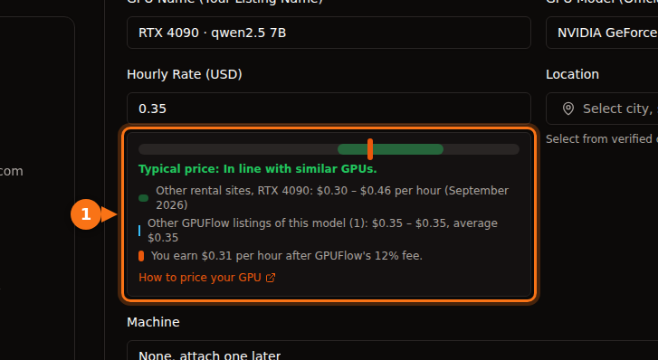

In September 2026, one H100 costs about $6.90 an hour on AWS or Azure, $11.06 per GPU on Google Cloud, $3.99 on Lambda, $2.69 to $3.49 on RunPod and from about $1.50 on Vast.ai. Consumer cards are only on the marketplaces: an RTX 4090 runs $0.31 to $0.34 an hour at the cheap end and $0.74 on RunPod's data-center tier. For the same H100, the most expensive on-demand hour costs about seven and a half times the cheapest.

The rest of this post shows where each number comes from, what the hourly price includes, and what three typical jobs cost end to end. Every price is on-demand unless marked otherwise, US regions (us-east-1 on AWS, East US on Azure, us-central1 on Google Cloud), Linux, checked in September 2026. Prices move every month, so treat them as a snapshot and check the source before you commit money.

## Prices at a glance

Datacenter GPUs, dollars per GPU per hour:

| Provider | L4 24 GB | A10G / A10 24 GB | A100 80 GB | H100 |
| --- | --- | --- | --- | --- |
| AWS | $0.81 (g6.xlarge) | $1.01 (g5.xlarge, A10G) | $3.43 (8-GPU p4de only) | $6.88 (p5.4xlarge) |
| Google Cloud | $0.71 (g2-standard-4) | n/a | $5.07 (a2-ultragpu-1g) | $11.06 (8-GPU A3, ÷ 8) |
| Azure | n/a | $3.20 (NV36ads A10 v5) | $3.67 (NC24ads A100 v4) | $6.98 (NC40ads H100 v5, NVL 94 GB) |
| Lambda | n/a | n/a | $2.79 | $3.99 |
| RunPod Community / Secure | n/a / $0.49 | n/a | $1.39 / $1.59 | $2.69 / $3.49 |
| Vast.ai | from about $0.27 | n/a | from about $0.43 | from about $1.47 |

n/a means we found no matching single-GPU option on that provider's price list. Consumer cards, dollars per hour:

| GPU | Vast.ai (lowest listing) | RunPod Community / Secure | Typical range across rental sites |
| --- | --- | --- | --- |
| RTX 3090 24 GB | $0.11 – $0.13 | $0.22 / $0.50 | $0.11 – $0.31 |
| RTX 4090 24 GB | $0.31 – $0.33 | $0.34 / $0.74 | $0.30 – $0.46 |
| RTX 5090 32 GB | $0.41 – $0.47 | $0.69 / $0.99 | $0.41 – $0.69 |

AWS, Google Cloud, Azure and Lambda don't list consumer RTX cards. The Vast.ai figures are ranges because two getdeploying.com snapshots on the same day gave slightly different minimums, which tells you something about marketplace prices. The last column is the range the [GPUFlow provider pricing guide](https://docs.gpuflow.app/providers/pricing/) collected from Vast.ai, RunPod, Salad, SimplePod, TensorDock, Hyperstack and Lambda in September 2026.

## What the hourly price includes

These numbers are not quite the same product, and that matters more than the second decimal.

A hyperscaler instance bundles a lot besides the GPU. AWS's p5.4xlarge comes with 16 vCPUs, 256 GiB of RAM and 3.84 TB of local NVMe. Azure's NC24ads A100 v4 has 24 vCPUs and 220 GiB of RAM. Azure's full-A10 size NV36ads A10 v5 has 36 vCPUs, 440 GiB of RAM and a GRID license for virtual workstations, which helps explain why it costs three times what AWS charges for a similar card. If you only need the GPU, you pay for all of that anyway.

Some GPUs only come in big boxes. On AWS the A100 80 GB is sold as p4de.24xlarge: eight GPUs, $27.45 an hour, no smaller size. Google Cloud's A3 High H100 machine in our table is the 8-GPU a3-highgpu-8g at $88.49 an hour. Lambda's price list shows a per-GPU price, but the machine specs it lists next to the H100 (208 vCPUs, 1,800 GiB RAM) describe a multi-GPU system, so check which sizes are actually available before you plan around $3.99.

Marketplace prices are set by whoever owns the machine. On Vast.ai each host sets its own rate, and storage and bandwidth are priced separately per listing. RunPod's Community Cloud connects independent providers; its Secure Cloud runs in Tier 3 and Tier 4 data centers. The same RTX 4090 costs $0.34 in the first and $0.74 in the second.

What the hourly price leaves out (disk, data transfer, setup time, idle time) is covered in [the real cost of renting a GPU](/en/hidden-fees-in-gpu-rental/). On a small job those extras can be larger than the GPU time.

## H100 prices side by side

<figure>
<svg viewBox="0 0 720 380" role="img" aria-labelledby="d1-title" xmlns="http://www.w3.org/2000/svg" font-family="system-ui, sans-serif" font-size="15">
<title id="d1-title">Bar chart of on-demand H100 prices per GPU per hour in September 2026, from 11.06 dollars on Google Cloud to 1.47 dollars on Vast.ai</title>
<rect x="0" y="0" width="720" height="380" fill="#ffffff"/>
<text x="20" y="28" fill="#1e1b4b" font-weight="600">One H100, on-demand, dollars per GPU-hour</text>
<line x1="190" y1="44" x2="190" y2="316" stroke="#e2e8f0" stroke-width="1"/>
<text x="190" y="336" text-anchor="middle" fill="#64748b" font-size="13">$0</text>
<line x1="270" y1="44" x2="270" y2="316" stroke="#e2e8f0" stroke-width="1"/>
<text x="270" y="336" text-anchor="middle" fill="#64748b" font-size="13">$2</text>
<line x1="350" y1="44" x2="350" y2="316" stroke="#e2e8f0" stroke-width="1"/>
<text x="350" y="336" text-anchor="middle" fill="#64748b" font-size="13">$4</text>
<line x1="430" y1="44" x2="430" y2="316" stroke="#e2e8f0" stroke-width="1"/>
<text x="430" y="336" text-anchor="middle" fill="#64748b" font-size="13">$6</text>
<line x1="510" y1="44" x2="510" y2="316" stroke="#e2e8f0" stroke-width="1"/>
<text x="510" y="336" text-anchor="middle" fill="#64748b" font-size="13">$8</text>
<line x1="590" y1="44" x2="590" y2="316" stroke="#e2e8f0" stroke-width="1"/>
<text x="590" y="336" text-anchor="middle" fill="#64748b" font-size="13">$10</text>
<line x1="670" y1="44" x2="670" y2="316" stroke="#e2e8f0" stroke-width="1"/>
<text x="670" y="336" text-anchor="middle" fill="#64748b" font-size="13">$12</text>
<text x="180" y="69" text-anchor="end" fill="#1e1b4b">Google Cloud</text>
<rect x="190" y="50" width="442.4" height="26" rx="3" fill="#6366f1"/>
<text x="640.4" y="69" fill="#1e1b4b">$11.06</text>
<text x="180" y="107" text-anchor="end" fill="#1e1b4b">Azure (H100 NVL)</text>
<rect x="190" y="88" width="279.2" height="26" rx="3" fill="#6366f1"/>
<text x="477.2" y="107" fill="#1e1b4b">$6.98</text>
<text x="180" y="145" text-anchor="end" fill="#1e1b4b">AWS</text>
<rect x="190" y="126" width="275.2" height="26" rx="3" fill="#6366f1"/>
<text x="473.2" y="145" fill="#1e1b4b">$6.88</text>
<text x="180" y="183" text-anchor="end" fill="#1e1b4b">Lambda</text>
<rect x="190" y="164" width="159.6" height="26" rx="3" fill="#16a34a"/>
<text x="357.6" y="183" fill="#1e1b4b">$3.99</text>
<text x="180" y="221" text-anchor="end" fill="#1e1b4b">RunPod Secure</text>
<rect x="190" y="202" width="139.6" height="26" rx="3" fill="#16a34a"/>
<text x="337.6" y="221" fill="#1e1b4b">$3.49</text>
<text x="180" y="259" text-anchor="end" fill="#1e1b4b">RunPod Community</text>
<rect x="190" y="240" width="107.6" height="26" rx="3" fill="#16a34a"/>
<text x="305.6" y="259" fill="#1e1b4b">$2.69</text>
<text x="180" y="297" text-anchor="end" fill="#1e1b4b">Vast.ai (lowest)</text>
<rect x="190" y="278" width="58.8" height="26" rx="3" fill="#16a34a"/>
<text x="256.8" y="297" fill="#1e1b4b">$1.47</text>
<line x1="190" y1="44" x2="190" y2="316" stroke="#64748b" stroke-width="1.5"/>
<rect x="190" y="352" width="14" height="14" fill="#6366f1"/>
<text x="212" y="364" fill="#64748b" font-size="13">Hyperscale clouds</text>
<rect x="360" y="352" width="14" height="14" fill="#16a34a"/>
<text x="382" y="364" fill="#64748b" font-size="13">GPU clouds and marketplaces</text>
</svg>
<figcaption>On-demand H100 prices for one GPU, September 2026. Google Cloud's price is its 8-GPU A3 machine divided by 8. Azure's single-GPU size uses the 94 GB H100 NVL. Vast.ai is the lowest listing reported by getdeploying.com that day.</figcaption>
</figure>

The chart is drawn to scale. Two things stand out. The big three clouds cluster around $7 per GPU, with Google Cloud well above that for the 8-GPU A3 machine. And the gap between AWS and the cheapest Vast.ai listing is more than four times for a card that does the same arithmetic.

What you buy with the extra money is real: an SLA, compliance paperwork, the rest of your infrastructure next door, and a support contract. What you give up on a marketplace is also real: the host can be a small operator, reliability varies by listing, and you get no SLA. For a weekend experiment the marketplace wins easily. For a regulated production system it often isn't an option at all.

## Spot and interruptible prices

Every provider in this comparison sells spare capacity for less, with the risk that it gets taken back.

| Instance | On-demand | Spot | Saving |
| --- | --- | --- | --- |
| AWS g6.xlarge (1× L4) | $0.805 | $0.605 | 25% |
| AWS g5.xlarge (1× A10G) | $1.006 | $0.469 | 53% |
| AWS p5.4xlarge (1× H100) | $6.88 | $2.623 | 62% |
| Google Cloud g2-standard-4 (1× L4) | $0.707 | $0.403 | 43% |
| Google Cloud a3-highgpu-8g (8× H100) | $88.49 | $41.60 | 53% |
| Azure NC24ads A100 v4 (1× A100 80 GB) | $3.673 | $0.679 | 82% |
| Azure NC40ads H100 v5 (1× H100 NVL) | $6.98 | $1.29 | 82% |

Azure's spot prices come from its retail price API, where the A100 and H100 spot rates took effect in July and August 2026. The H100 spot rate was below the cheapest on-demand H100 listing we found on the marketplaces. Spot prices change often and availability is not guaranteed, so treat that as a snapshot.

On Vast.ai, interruptible instances are "often 50%+ cheaper than on-demand" according to its docs; getdeploying.com showed RTX 3090 interruptible offers from $0.08. Spot only saves money if your job writes checkpoints and can pick up where it stopped. Otherwise an interruption means paying twice for the same hours.

## Where GPUFlow fits

GPUFlow is a marketplace too, but it rents something narrower. Providers run AI models (usually with Ollama) on their own Linux machines, and you rent one of those GPUs by the hour to get an OpenAI-compatible API key (base URL `https://gpuflow.app/v1`, with `/v1/chat/completions` and `/v1/models`). There's no SSH, no shell and no file access, so you can't train, fine-tune or run your own code. For calling an open model from a script or an app, you skip the setup entirely: the model is already installed on the provider's machine.

GPUFlow doesn't set prices, so there is no GPUFlow price to put in the tables. Here is how pricing works instead:

- Each provider sets an hourly price in US dollars for their listing. When they set it, the listing form shows where it sits against the range on other rental sites and what they'll earn after the fee.
- You book whole hours, 1 to 168 by default. The full booked amount is held from your credits when the rental starts.
- You pay per second, with a 1-minute minimum, rounded up to the next cent ([per-second vs hourly billing](/en/per-second-vs-hourly-gpu-billing/) works through the numbers). When you end early or time runs out, the unused part of the hold goes straight back to your credits.
- If the provider's machine stops responding for 10 minutes, the rental ends and you pay only up to the machine's last heartbeat.
- Tokens are counted but not billed. There is no disk or data transfer line on the bill, because you never get a machine to store files on.
- Credits are bought by card through Stripe, $10 to $500 per top-up, with no fee. 1 credit is $0.01 and credits don't expire. Providers keep 88% of each charge and GPUFlow keeps 12%.

For a longer comparison of renting an API key versus renting a container, see [GPUFlow vs Vast.ai vs RunPod vs SaladCloud](/en/gpuflow-vs-vast-ai-vs-runpod/). If you're comparing hourly GPU prices with per-token APIs, [that math is here](/en/hourly-gpu-vs-per-token-api/).

## Worked example 1: a 3-hour batch job on a 24 GB card

Say you want to run a 7B to 8B open model over a pile of documents for about three hours. Any 24 GB card will do.

| Option | Calculation | GPU cost |
| --- | --- | --- |
| Vast.ai RTX 4090 | 3 × $0.31 | $0.93 |
| RunPod Community RTX 4090 | 3 × $0.34 | $1.02 |
| Google Cloud L4 (g2-standard-4) | 3 × $0.707 | $2.12 |
| RunPod Secure RTX 4090 | 3 × $0.74 | $2.22 |
| AWS L4 (g6.xlarge) | 3 × $0.805 | $2.42 |
| AWS A10G (g5.xlarge) | 3 × $1.006 | $3.02 |

On every one of these you also pay for setup: installing an inference server and downloading the model on paid time. Twenty minutes of that adds $0.10 on the Vast.ai card and $0.27 on the AWS L4.

On GPUFlow, take a listing at $0.35 an hour as an example (it's the price in our screenshot, not a quote). You book 3 hours, so $1.05 is held. The job finishes after 2 hours 10 minutes (7,800 seconds) and you end the rental. The charge is 7,800 × 35 ÷ 3,600 = 75.8 cents, rounded up to $0.76, and $0.29 goes back to your credits. That works only if a provider runs the model you want.

## Worked example 2: 8 hours of fine-tuning on an A100 80 GB

Fine-tuning needs a machine you control, so GPUFlow is out here.

| Option | Calculation | Cost |
| --- | --- | --- |
| Vast.ai, lowest A100 listing | 8 × $0.43 | $3.44 |
| RunPod Community A100 SXM | 8 × $1.39 | $11.12 |
| RunPod Secure A100 SXM | 8 × $1.59 | $12.72 |
| Lambda A100 SXM 80 GB | 8 × $2.79 | $22.32 |
| Azure NC24ads A100 v4 | 8 × $3.673 | $29.38 |
| Google Cloud a2-ultragpu-1g | 8 × $5.069 | $40.55 |
| AWS p4de.24xlarge (8 GPUs) | 8 × $27.45 | $219.60 |

The Vast.ai line is the cheapest A100 listing getdeploying.com reported (an SXM card in a 2-GPU machine; the memory size wasn't shown), so check the listing before you count on that price. The AWS line is not a typo: if you need one A100 80 GB on AWS, you rent eight. The Lambda line assumes a size you can actually get, see the note above.

If your training loop saves checkpoints every 15 to 30 minutes, the Azure spot price of $0.679 an hour brings that job to $5.43, but only if you can get the capacity.

## Worked example 3: an L4 serving around the clock

A small inference endpoint running for a 720-hour month:

| Option | Calculation | Per month |
| --- | --- | --- |
| Vast.ai L4, lowest listing | 720 × $0.27 | $194.40 |
| RunPod Secure L4 | 720 × $0.49 | $352.80 |
| AWS g6.xlarge, 1-year reserved | 720 × $0.524 | $377.28 |
| Google Cloud g2-standard-4 | 720 × $0.707 | $509.04 |
| AWS g6.xlarge, on-demand | 720 × $0.805 | $579.60 |

At this duration the commitment discounts start to matter: AWS's 1-year reserved rate for the same instance is 35% below on-demand. The marketplace is still cheapest, but a single host is a single point of failure. If the endpoint has users, you probably want two machines, which doubles the marketplace line and makes the gap smaller than it looks.

## How I'd choose

For experiments, image generation, [LoRA training](/en/stable-diffusion-lora-training-under-10-dollars/) and anything you can restart: a marketplace RTX 3090 or 4090. The cheap end is $0.11 to $0.34 an hour, and nothing on the big clouds comes close.

For a big model that needs an A100 or H100 and is not regulated: RunPod or Lambda first, [Vast.ai if you're willing to check each host's reliability score](/en/runpod-vs-vastapi-comparison/). Look at the spot prices on Azure and Google Cloud before you decide; in September 2026 they were surprisingly competitive.

For regulated data, a company that already runs on AWS, Azure or Google Cloud, or anything that needs an SLA: stay on your cloud and buy commitments or spot capacity to bring the price down. Paying $7 an hour for an H100 is often cheaper than a security review of a new vendor.

For calling an open model from code without running a server: an API. Either a per-token API if one hosts the model you want, or an hourly rental on GPUFlow if you want a fixed hourly price on a specific provider's model. [What you need to rent a GPU](/en/what-you-need-to-rent-a-gpu/) walks through the account side.

## Sources

- AWS: [EC2 on-demand pricing](https://aws.amazon.com/ec2/pricing/on-demand/), [P5 instances](https://aws.amazon.com/ec2/instance-types/p5/), [P4 instances](https://aws.amazon.com/ec2/instance-types/p4/). Hourly prices read from Vantage's copy of the AWS price list: [g6.xlarge](https://instances.vantage.sh/aws/ec2/g6.xlarge?region=us-east-1), [g5.xlarge](https://instances.vantage.sh/aws/ec2/g5.xlarge?region=us-east-1), [p5.4xlarge](https://instances.vantage.sh/aws/ec2/p5.4xlarge?region=us-east-1), [p5.48xlarge](https://instances.vantage.sh/aws/ec2/p5.48xlarge?region=us-east-1), [p4de.24xlarge](https://instances.vantage.sh/aws/ec2/p4de.24xlarge?region=us-east-1)
- Google Cloud: [accelerator-optimized VM pricing](https://cloud.google.com/products/compute/pricing/accelerator-optimized), [VM instance pricing](https://cloud.google.com/compute/vm-instance-pricing)
- Azure: [Linux VM pricing](https://azure.microsoft.com/en-us/pricing/details/virtual-machines/linux/), [Azure retail prices API](https://prices.azure.com/api/retail/prices), sizes: [NC A100 v4](https://learn.microsoft.com/en-us/azure/virtual-machines/sizes/gpu-accelerated/nca100v4-series), [NCads H100 v5](https://learn.microsoft.com/en-us/azure/virtual-machines/sizes/gpu-accelerated/ncadsh100v5-series), [NVads A10 v5](https://learn.microsoft.com/en-us/azure/virtual-machines/sizes/gpu-accelerated/nvadsa10v5-series)
- Lambda: [pricing](https://lambda.ai/pricing)
- RunPod: [pricing](https://www.runpod.io/pricing), [RTX 3090](https://www.runpod.io/gpu-models/rtx-3090), [RTX 4090](https://www.runpod.io/gpu-models/rtx-4090), [RTX 5090](https://www.runpod.io/gpu-models/rtx-5090), [A100 SXM](https://www.runpod.io/gpu-models/a100-sxm), [H100 SXM](https://www.runpod.io/gpu-models/h100-sxm), [pods overview](https://docs.runpod.io/pods/overview)
- Vast.ai: [pricing docs](https://docs.vast.ai/guides/instances/pricing.md). Marketplace prices from getdeploying.com: [Vast.ai](https://getdeploying.com/vast-ai), [RTX 3090](https://getdeploying.com/reference/cloud-gpu/nvidia-rtx-3090), [RTX 4090](https://getdeploying.com/reference/cloud-gpu/nvidia-rtx-4090), [RTX 5090](https://getdeploying.com/reference/cloud-gpu/nvidia-rtx-5090), [A100](https://getdeploying.com/reference/cloud-gpu/nvidia-a100), [H100](https://getdeploying.com/reference/cloud-gpu/nvidia-h100)
- GPUFlow: [how to price your GPU](https://docs.gpuflow.app/providers/pricing/), [billing](https://docs.gpuflow.app/renters/billing/), [API quickstart](https://docs.gpuflow.app/renters/api-quickstart/), [marketplace](https://gpuflow.app/en/marketplace)

All checked in September 2026.
