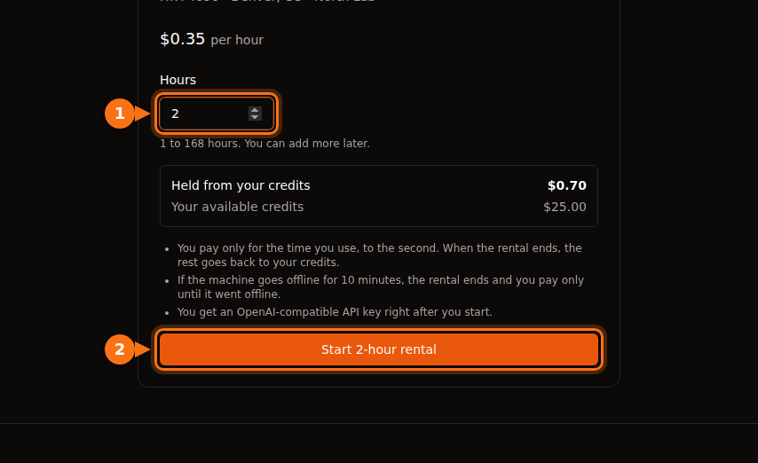

The hourly price on a GPU listing covers GPU time and nothing else. On most platforms you also pay for disk space (often more while the machine is stopped than while it runs), for data transfer on some marketplaces, for setup and idle time the meter counts like real work, and for your bank's currency fee. In the worked example further down, a month planned at $13.60 of RTX 4090 time ends up as a $42.23 bill.

None of this is hidden on purpose. It's just easy to miss when you compare platforms by the headline number. Everything below was checked on each platform's own docs and pricing pages in September 2026; links are at the end. For the headline prices themselves, see the [GPU rental pricing comparison](/en/gpu-rental-pricing-comparison-2026/).

## The extras by platform

| Cost | Vast.ai | RunPod | Lambda | AWS EC2 | GPUFlow |
| --- | --- | --- | --- | --- | --- |
| Billing unit | Per second | Per second | Per minute | Per second, 60 s minimum | Per second, 1 min minimum |
| Storage while stopped | Billed at the host's rate | Volume disk $0.20/GB/month | Filesystems billed per GiB/month | EBS keeps billing | None |
| Data transfer | Host's rate, every byte | No fees | No fees | Out: 100 GB/month free, then per GB | None |
| To start | $5 minimum deposit | 1 hour of credit; $100 for prepaid cards | $10 card pre-authorization | A payment method | $10 top-up; booking held in full |
| Balance hits zero | Stopped, later destroyed | Stopped; no network volume = data gone | Billed weekly after use | n/a | Can't happen mid-rental |

GPUFlow can skip the storage and transfer rows because it rents something different: an OpenAI-compatible API key for AI models already running on a provider's GPU, not a machine you log into. The flip side is that you can't run your own code, train or fine-tune on it. If you need a machine, the other four columns are the ones that apply to you.

## Storage, especially while stopped

On any platform that rents you a machine or a container, your files live on a disk, and the disk costs money for as long as it exists.

- **RunPod** charges $0.10 per GB per month for container and volume disk while the pod runs. When you stop the pod, the container disk is erased and costs nothing, but the volume disk goes up to $0.20 per GB per month. Network volumes cost $0.07 per GB per month under 1 TB and $0.05 above, running or not. Savings plans cover GPU compute only; storage is billed at standard rates.
- **Vast.ai** bills storage "for every single second your instance exists", in every state except offline. Its docs are blunt: "Stopping an instance does not avoid storage costs." The host sets the rate.
- **AWS** doesn't charge for a stopped instance's compute or data transfer, but "charges are incurred to store Amazon EBS storage volumes", and an Elastic IP attached to a stopped instance keeps billing. A gp3 volume in us-east-1 costs about $0.08 per GB per month.
- **Lambda** bills filesystems per GiB used per month, in one-hour increments.

A 200 GB volume disk on a stopped RunPod pod costs 200 × $0.20 = $40 a month, even if you never start the pod again. That's more than 100 hours of an RTX 4090 at RunPod's Community Cloud price.

Running out of credit makes it worse. When a RunPod balance hits $0, pods stop, and "Pods without a network volume are terminated, and their data can't be recovered." Vast.ai stops instances too, and if you have no saved card, "your instances and stored data will be destroyed" after a short grace period. So a forgotten volume either keeps charging you or disappears with your work on it.

What I do: delete volumes the day a project ends, keep only what I still need on a small network volume, and keep a copy of anything important somewhere other than the GPU platform.

## Data transfer

Downloading a 15 GB model and uploading a dataset can move tens of gigabytes per session.

- **Vast.ai** charges "bandwidth prices for every byte sent or received to or from the instance, regardless of what state it is in." Each host sets its own upload and download price, and the docs warn it "can significantly impact total costs for data-intensive workloads." Look at it on the listing before you rent.
- **RunPod** says pods have "no fees for ingress/egress."
- **Lambda**: "You are not charged for ingress or egress."
- **AWS**: data in is free. Data out to the internet is free for the first 100 GB a month across all services and regions, then billed per GB on a tiered scale. Each public IPv4 address costs $0.005 an hour whether it's in use or idle, which is $3.60 over a 720-hour month.

## Deposits, holds and prepaid credit

Most GPU platforms are prepaid: you buy credit, then spend it. The money you park there is a cost too, especially when it can't come back.

- **Vast.ai**: minimum deposit $5, by card, BitPay or Crypto.com. Unspent credit bought by card can be refunded on request through the site chat; spent credit can't.
- **RunPod**: you need at least one hour's worth of credit for the pod you pick, and prepaid cards should deposit at least $100 per transaction. Credits are non-refundable and can't be withdrawn.
- **Lambda** works the other way round: it bills weekly for last week's usage, and makes a $10 pre-authorization when you add a card, refunded in a few days. It accepts only major credit cards; prepaid and debit cards are declined.
- **SaladCloud**: top-ups from $5 to $10,000, and credit expires 12 months after purchase.
- **GPUFlow**: top-ups from $10 to $500 by card through Stripe, no fee, and credits don't expire. When you start a rental, the full booked amount is held from your credits, not a small deposit. Book 10 hours at $0.40 and $4.00 is held until the rental ends; what you didn't use comes back at that point. Bought credits can't be cashed out, and card refunds are only for a double or mistaken charge, credits that never arrived, or a legal requirement, within 60 days.

Credit that expires, or sits on a platform you've stopped using, is money spent. Top up for the work you expect this month, not for the year.

## Setup and idle time

A rented machine bills for time, not for work. Two kinds of time cost the same as real work and produce nothing.

### Setup

The meter starts when the machine does. On Lambda, "billing begins the moment you launch an instance and the instance passes health checks." Installing libraries, pulling a container image and downloading a model all happen on paid time. At $0.34 an hour, 15 minutes of setup is about $0.09. Small once, but do it every day for a month and it's a few hours of GPU time.

Two things help: start from a template or image that already has your stack, and keep models on a volume so you download them once (then weigh that against the storage cost above).

On GPUFlow there is no setup step on your side: the provider has already installed the models on the machine, and you get the API key right after the rental starts.

### Idle

Lambda says it plainly: "Instances are billed for as long as they're running, regardless if they're actively being used." Google Cloud says the same about an idle VM still in the RUNNING state. Leaving a pod up overnight so it's ready in the morning costs a night of GPU time.

Azure has an extra trap. A VM that is merely "Stopped" (for example, shut down from inside the OS) still bills for its cores. It has to be "Stopped (Deallocated)" from the portal or CLI before the compute charge ends.

GPUFlow isn't immune either: you pay until you click **End now** or the booked time runs out. Ending early is free and the unused part of the hold comes back, so the fix is simply to end the rental when you're done. [How GPUFlow billing works](https://docs.gpuflow.app/renters/billing/).

## Billing increments and minimums

Per-second billing is common now, but the details differ:

| Platform | How time is billed |
| --- | --- |
| Vast.ai | Per second |
| RunPod pods | Per second (the pods overview page still says per minute) |
| RunPod serverless | Per second, rounded up, including worker start time and an idle timeout (5 seconds by default) |
| Lambda | One-minute increments |
| AWS EC2 (Linux) | Per second, 60-second minimum |
| Google Cloud | Per second after a 1-minute minimum |
| Azure | Full minutes |
| GPUFlow | Per second, 1-minute minimum, rounded up to the next cent |

For long jobs these differences are noise. They matter for many short sessions and for serverless, where start time and idle timeout are billed on top of the requests. If you send short requests with gaps between them, those can cost more than the requests. [Per-second vs hourly billing](/en/per-second-vs-hourly-gpu-billing/) works through the numbers.

## Interruptible instances

Interruptible (spot) capacity is cheaper, sometimes much cheaper, but it can be taken back.

- Vast.ai says interruptible instances are "often 50%+ cheaper than on-demand."
- On AWS in September 2026, a p5.4xlarge (one H100) was $2.62 an hour on spot against $6.88 on demand.
- On TensorDock, storage is billed at the standard rate on top of your bid, and you keep paying it while you're outbid. Hosts set a minimum bid, typically around 50% of the on-demand price.

The hidden cost is repeated work. If your job can't restart from a checkpoint, one interruption can wipe out the saving. Save checkpoints often enough that losing the last interval doesn't hurt.

## Your bank's fees

Almost every GPU platform, GPUFlow included, charges in US dollars. If your card is in another currency, your bank may add its own fee:

- Foreign transaction fees are usually 1% to 3%, and some banks charge them on purchases from foreign merchants even when the price is shown in US dollars.
- Most Canadian credit cards charge about 2.5% on purchases in another currency.
- In Brazil, IOF tax on international card purchases has been 3.5% since July 2025.

On a $100 top-up that's $1 to $3.50 you won't see on the platform's invoice. A card without a foreign transaction fee removes most of it.

## A worked example: $0.34 an hour, $42 a month

Here is a realistic month on an RTX 4090 from RunPod's Community Cloud at $0.34 an hour, with a Canadian credit card:

- 40 hours of actual work: 40 × $0.34 = $13.60. This is the number people budget.
- 20 sessions with 15 minutes of setup each, 5 hours: 5 × $0.34 = $1.70.
- Two nights the pod was left running, 10 hours each: 20 × $0.34 = $6.80.
- A 100 GB volume disk kept all month. It runs for 65 of the month's 720 hours and sits stopped for the other 655: 100 × ($0.10 × 65/720 + $0.20 × 655/720) = about $19.10.
- Subtotal $41.20, plus a 2.5% foreign transaction fee: $1.03.

Total: $42.23, about 3.1 times the GPU work you planned for. RunPod doesn't charge for data transfer, so on a Vast.ai host with a bandwidth price there would be one more line.

<figure>
<svg viewBox="0 0 720 300" role="img" aria-labelledby="d1-title" xmlns="http://www.w3.org/2000/svg" font-family="system-ui, sans-serif" font-size="15">
<title id="d1-title">Stacked bar chart: a month planned as 13.60 dollars of RTX 4090 time becomes a 42.23 dollar bill after setup time, idle nights, disk storage and a card fee</title>
<rect x="0" y="0" width="720" height="300" fill="#ffffff"/>
<text x="20" y="28" fill="#1e1b4b" font-weight="600">One month on an RTX 4090 at $0.34 per hour</text>
<line x1="130" y1="50" x2="130" y2="170" stroke="#e2e8f0" stroke-width="1"/>
<text x="130" y="190" text-anchor="middle" fill="#64748b" font-size="13">$0</text>
<line x1="250" y1="50" x2="250" y2="170" stroke="#e2e8f0" stroke-width="1"/>
<text x="250" y="190" text-anchor="middle" fill="#64748b" font-size="13">$10</text>
<line x1="370" y1="50" x2="370" y2="170" stroke="#e2e8f0" stroke-width="1"/>
<text x="370" y="190" text-anchor="middle" fill="#64748b" font-size="13">$20</text>
<line x1="490" y1="50" x2="490" y2="170" stroke="#e2e8f0" stroke-width="1"/>
<text x="490" y="190" text-anchor="middle" fill="#64748b" font-size="13">$30</text>
<line x1="610" y1="50" x2="610" y2="170" stroke="#e2e8f0" stroke-width="1"/>
<text x="610" y="190" text-anchor="middle" fill="#64748b" font-size="13">$40</text>
<text x="120" y="84" text-anchor="end" fill="#1e1b4b">Planned</text>
<rect x="130" y="62" width="163.2" height="34" rx="3" fill="#6366f1"/>
<text x="301.2" y="84" fill="#1e1b4b">$13.60</text>
<text x="120" y="144" text-anchor="end" fill="#1e1b4b">Billed</text>
<rect x="130" y="122" width="163.2" height="34" fill="#6366f1"/>
<rect x="293.2" y="122" width="20.4" height="34" fill="#eef2ff" stroke="#6366f1" stroke-width="1.5"/>
<rect x="313.6" y="122" width="81.6" height="34" fill="#f97316"/>
<rect x="395.2" y="122" width="229.2" height="34" fill="#64748b"/>
<rect x="624.4" y="122" width="12.4" height="34" fill="#1e1b4b"/>
<text x="644.8" y="144" fill="#1e1b4b" font-weight="600">$42.23</text>
<line x1="130" y1="50" x2="130" y2="170" stroke="#64748b" stroke-width="1.5"/>
<rect x="20" y="209" width="16" height="16" fill="#6366f1"/>
<text x="44" y="222" fill="#1e1b4b">GPU work: $13.60</text>
<rect x="250" y="209" width="16" height="16" fill="#eef2ff" stroke="#6366f1" stroke-width="1.5"/>
<text x="274" y="222" fill="#1e1b4b">Setup: $1.70</text>
<rect x="480" y="209" width="16" height="16" fill="#f97316"/>
<text x="504" y="222" fill="#1e1b4b">Idle nights: $6.80</text>
<rect x="20" y="245" width="16" height="16" fill="#64748b"/>
<text x="44" y="258" fill="#1e1b4b">Volume disk: $19.10</text>
<rect x="250" y="245" width="16" height="16" fill="#1e1b4b"/>
<text x="274" y="258" fill="#1e1b4b">Card fee: $1.03</text>
</svg>
<figcaption>The worked example from this section, drawn to scale: 40 hours of real GPU work at $0.34 per hour, plus 5 hours of setup, two forgotten nights, a 100 GB volume disk kept all month and a 2.5% card fee. The GPU work is less than a third of the bill.</figcaption>
</figure>

The biggest item isn't the GPU at all, it's a disk that sat stopped for 91% of the month. The fix is boring: delete the volume or shrink it, and end the pod when you stop working.

### A checklist before you rent

1. Add up GPU time plus storage for as long as you'll keep the files, at the stopped rate.
2. Check the bandwidth price on the listing if the platform has one, and estimate how much you'll download.
3. Count setup time as paid time.
4. Know how you'll stop paying: end the rental, stop or deallocate the machine, delete the volume.
5. Know [what happens to your data if the balance hits zero](/en/runpod-vs-vastapi-comparison/).
6. Check your card's foreign transaction fee.

If what you need is an AI model you can call from your code, and not a machine to run your own software, an API-based rental avoids the storage, transfer and setup lines entirely. [Hourly GPU or per-token API](/en/hourly-gpu-vs-per-token-api/) compares that with paying per token, and [GPUFlow vs Vast.ai vs RunPod vs SaladCloud](/en/gpuflow-vs-vast-ai-vs-runpod/) covers which platform fits which job. For training or anything else that needs a full machine, this checklist is how you keep the bill close to the hourly price.

## Sources

- RunPod: [pod pricing and storage](https://docs.runpod.io/pods/pricing), [pricing page](https://www.runpod.io/pricing), [pods overview](https://docs.runpod.io/pods/overview), [serverless pricing](https://docs.runpod.io/serverless/pricing), [billing information](https://docs.runpod.io/references/billing-information), [RTX 4090 prices](https://www.runpod.io/gpu-models/rtx-4090)
- Vast.ai: [pricing](https://docs.vast.ai/guides/instances/pricing.md), [billing](https://docs.vast.ai/documentation/reference/billing), [quickstart (minimum deposit)](https://docs.vast.ai/guides/get-started/quickstart.md)
- Lambda: [billing](https://docs.lambda.ai/public-cloud/billing/), [manage billing](https://docs.lambda.ai/public-cloud/manage-billing/)
- SaladCloud: [billing](https://docs.salad.com/general/explanation/billing.md)
- TensorDock: [spot instances](https://docs.tensordock.com/virtual-machines/spot-instances)
- AWS: [EC2 on-demand pricing](https://aws.amazon.com/ec2/pricing/on-demand/), [how stop and start works](https://docs.aws.amazon.com/AWSEC2/latest/UserGuide/how-ec2-instance-stop-start-works.html), [VPC pricing (public IPv4)](https://aws.amazon.com/vpc/pricing/), [p5.4xlarge prices via Vantage](https://instances.vantage.sh/aws/ec2/p5.4xlarge?region=us-east-1), gp3 price: [CloudBurn EBS pricing guide](https://cloudburn.io/blog/amazon-ebs-pricing)
- Google Cloud: [VM instance pricing](https://cloud.google.com/compute/vm-instance-pricing)
- Azure: [Linux VM pricing and FAQ](https://azure.microsoft.com/en-us/pricing/details/virtual-machines/linux/)
- Card fees: [Experian](https://www.experian.com/blogs/ask-experian/what-is-a-foreign-transaction-fee/), [NerdWallet Canada](https://www.nerdwallet.com/ca/p/best/credit-cards/best-no-foreign-transaction-fee-credit-cards), Brazil IOF: [Wise Brazil](https://wise.com/br/blog/iof-cartao-internacional)
- GPUFlow: [billing](https://docs.gpuflow.app/renters/billing/), [getting started](https://docs.gpuflow.app/renters/getting-started/), [marketplace](https://gpuflow.app/en/marketplace)

All checked in September 2026.
