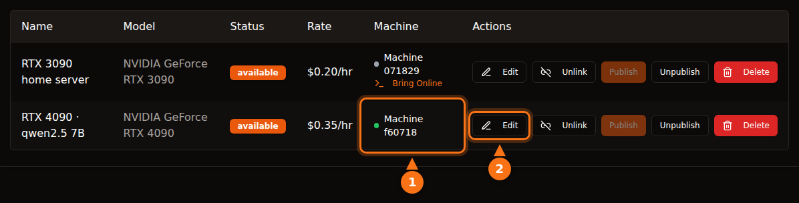

It is reasonably safe if you pick the platform with your eyes open, but "safe" means different things on different platforms. On container platforms like Vast.ai, a renter runs their own code on your machine and their traffic leaves from your IP address; isolation keeps them out of your files, not off your network or your power bill. On an API-only design like GPUFlow, a renter can only send chat requests to the models you installed, and the risk turns around: the prompts are readable on your machine, so renters should not send anything secret.

This post goes through both directions. Third-party claims were checked on each platform's own docs in September 2026, and everything about GPUFlow comes from its source code and docs. Sources are at the end.

## What a renter can do on a container platform

Most GPU marketplaces rent out a container. The renter picks an image, gets a shell and runs whatever they want. That gives you, the host, five things to think about.

- **Arbitrary code.** The renter's code runs on your kernel, inside a container or VM. Isolation is good but not perfect; container escapes are rare, and they are exactly the kind of bug that gets patched in kernel and driver updates you need to install.
- **Your IP address.** Outgoing traffic from the container leaves through your internet connection. If a renter scrapes a site, sends spam or scans the internet, the abuse report goes to your ISP, addressed to your IP. Vast.ai's terms say users indemnify providers against claims arising from user content, which helps in a dispute with a third party but does nothing to stop your ISP from sending you a warning.
- **Open ports.** Vast.ai's hosting guide says "Clients require open ports to directly connect to the machine for most jobs", so you forward ports on your router.
- **Disk.** Renters download images, models and datasets onto your drives. Vast.ai frees the space when a client deletes a volume, but while the rental runs, it is theirs.
- **Power, heat and drivers.** Vast.ai tells hosts to "Expect that the GPU is going to be used at close to max capacity for the rental period." That is hours of full board power, heat in the room and fans spinning. Container platforms also need a specific setup: Vast.ai's guide lists installing Ubuntu, partitioning disks, installing NVIDIA drivers and opening router ports.

## How Vast.ai, Salad and RunPod isolate renters

| | Vast.ai | Salad | RunPod Community Cloud |
| --- | --- | --- | --- |
| **Renter gets** | A container (or a VM) with SSH or Jupyter | A container they deployed; SSH and a web terminal into it | A pod (container) |
| **Isolation** | Unprivileged Docker containers | Linux VM on a hypervisor, container inside | "Its own container with strict separation" |
| **Inbound ports** | Needed for most jobs | Blocked by default | Not stated |
| **New hosts** | Yes, on Ubuntu | Yes, on Windows 10/11 | No longer accepted |

- **Vast.ai** says "Clients are isolated in unprivileged Docker containers and only have access to their own data", with separate namespaces and cgroups, network, file system and process isolation. It also warns renters that "Provider security varies significantly" and points sensitive work to its Secure Cloud tier of certified data centers.
- **Salad** says "Your workload runs inside an OCI-compatible container on a Linux virtual machine, isolated from Windows and every other process on the host," with inbound connections blocked by default. It protects renters from hosts too: if a host "attempts to access the Linux environment we automatically implode the environment and blacklist the machine." Separately, Salad offers optional bandwidth-sharing jobs that "process video content from premium streaming platforms" over your connection; its support page warns this raises your data usage and can cause "a rare, temporary (typically 1-2 days) content restriction on those streaming platforms."
- **RunPod** says "Runpod is no longer accepting new hosts for Community Cloud." For existing capacity, "Each Pod/worker operates in its own container," and its terms "prohibit hosts from inspecting your Pod/worker data."

All three isolate the renter from your system. None of them can stop a renter's legitimate-looking traffic from leaving through your connection, and none claim to.

## How GPUFlow's design differs

GPUFlow rents out an AI model behind an OpenAI-compatible API, not a machine. That changes what a renter can reach. Here is what the code does.

**The agent.** The installer puts a single Go binary at `/usr/local/bin/gpuflow-agent` and runs it as a systemd service. There is no Docker. The service unit uses `DynamicUser=yes` (a temporary unprivileged user), `NoNewPrivileges=yes` (it can't gain rights), `ProtectSystem=strict` (the system is read-only to it), `ProtectHome=yes` (home folders are invisible) and `PrivateTmp=yes`. The inference engine is Ollama by default, installed by Ollama's own installer as its own service (a provider can instead point the agent at their own OpenAI-compatible server). The agent hardening applies to the agent, not to Ollama.

**Network.** The agent only makes outgoing connections: a WebSocket over TLS to `wss://ws.gpuflow.app`, and HTTPS to `gpuflow.app` to enroll and send a heartbeat every 15 seconds. It opens no ports, you forward nothing on your router, and renters never learn your IP address. It talks to Ollama on `127.0.0.1:11434`, which is Ollama's default loopback address.

**What renters can call.** A renter gets an API key for `https://gpuflow.app/v1`. GPUFlow answers `GET /v1/models` itself, and the only request it forwards to your machine is `POST /v1/chat/completions`. The agent has a second lock of its own: it proxies only four exact paths (`/v1/chat/completions`, `/v1/completions`, `/v1/embeddings` and `/v1/models`) and refuses everything else, including Ollama's native `/api/*` endpoints that would pull, delete or create models. The agent handles one message type, an inference request; anything else is ignored.

So a renter has no shell, no SSH, no files and no network access to your machine. They can't download a 70 GB model onto your disk, and they can't use your connection to reach the internet. What they can do is keep your GPU busy for the hours they booked and name any model you installed in the `model` field.

<figure>
<svg viewBox="0 0 720 380" role="img" aria-labelledby="d1-title" xmlns="http://www.w3.org/2000/svg" font-family="system-ui, sans-serif" font-size="15">
<title id="d1-title">What a renter can do on a container host compared with an API-only design like GPUFlow</title>
<rect x="0" y="0" width="720" height="380" fill="#ffffff"/>
<text x="20" y="40" fill="#64748b" font-weight="bold">What the renter can do</text>
<text x="470" y="40" text-anchor="middle" fill="#1e1b4b" font-weight="bold">Container host</text>
<text x="630" y="40" text-anchor="middle" fill="#1e1b4b" font-weight="bold">GPUFlow (API)</text>
<line x1="20" y1="55" x2="700" y2="55" stroke="#e2e8f0" stroke-width="2"/>
<text x="20" y="89" fill="#1e1b4b">Run their own programs</text>
<rect x="430" y="70" width="80" height="28" rx="14" fill="#fff7ed" stroke="#f97316" stroke-width="2"/>
<text x="470" y="89" text-anchor="middle" fill="#1e1b4b">Yes</text>
<rect x="590" y="70" width="80" height="28" rx="14" fill="#f0fdf4" stroke="#16a34a" stroke-width="2"/>
<text x="630" y="89" text-anchor="middle" fill="#1e1b4b">No</text>
<line x1="20" y1="110" x2="700" y2="110" stroke="#e2e8f0" stroke-width="1"/>
<text x="20" y="133" fill="#1e1b4b">Open a shell or SSH</text>
<rect x="430" y="114" width="80" height="28" rx="14" fill="#fff7ed" stroke="#f97316" stroke-width="2"/>
<text x="470" y="133" text-anchor="middle" fill="#1e1b4b">Yes</text>
<rect x="590" y="114" width="80" height="28" rx="14" fill="#f0fdf4" stroke="#16a34a" stroke-width="2"/>
<text x="630" y="133" text-anchor="middle" fill="#1e1b4b">No</text>
<line x1="20" y1="154" x2="700" y2="154" stroke="#e2e8f0" stroke-width="1"/>
<text x="20" y="177" fill="#1e1b4b">Write files to your disk</text>
<rect x="430" y="158" width="80" height="28" rx="14" fill="#fff7ed" stroke="#f97316" stroke-width="2"/>
<text x="470" y="177" text-anchor="middle" fill="#1e1b4b">Yes</text>
<rect x="590" y="158" width="80" height="28" rx="14" fill="#f0fdf4" stroke="#16a34a" stroke-width="2"/>
<text x="630" y="177" text-anchor="middle" fill="#1e1b4b">No</text>
<line x1="20" y1="198" x2="700" y2="198" stroke="#e2e8f0" stroke-width="1"/>
<text x="20" y="221" fill="#1e1b4b">Send traffic from your IP</text>
<rect x="430" y="202" width="80" height="28" rx="14" fill="#fff7ed" stroke="#f97316" stroke-width="2"/>
<text x="470" y="221" text-anchor="middle" fill="#1e1b4b">Yes</text>
<rect x="590" y="202" width="80" height="28" rx="14" fill="#f0fdf4" stroke="#16a34a" stroke-width="2"/>
<text x="630" y="221" text-anchor="middle" fill="#1e1b4b">No</text>
<line x1="20" y1="242" x2="700" y2="242" stroke="#e2e8f0" stroke-width="1"/>
<text x="20" y="265" fill="#1e1b4b">Need open ports on your router</text>
<rect x="430" y="246" width="80" height="28" rx="14" fill="#fff7ed" stroke="#f97316" stroke-width="2"/>
<text x="470" y="265" text-anchor="middle" fill="#1e1b4b">Often</text>
<rect x="590" y="246" width="80" height="28" rx="14" fill="#f0fdf4" stroke="#16a34a" stroke-width="2"/>
<text x="630" y="265" text-anchor="middle" fill="#1e1b4b">No</text>
<line x1="20" y1="286" x2="700" y2="286" stroke="#e2e8f0" stroke-width="1"/>
<text x="20" y="309" fill="#1e1b4b">Download or delete models</text>
<rect x="430" y="290" width="80" height="28" rx="14" fill="#fff7ed" stroke="#f97316" stroke-width="2"/>
<text x="470" y="309" text-anchor="middle" fill="#1e1b4b">Yes</text>
<rect x="590" y="290" width="80" height="28" rx="14" fill="#f0fdf4" stroke="#16a34a" stroke-width="2"/>
<text x="630" y="309" text-anchor="middle" fill="#1e1b4b">No</text>
<line x1="20" y1="330" x2="700" y2="330" stroke="#e2e8f0" stroke-width="1"/>
<text x="20" y="353" fill="#1e1b4b">Keep your GPU busy for hours</text>
<rect x="430" y="334" width="80" height="28" rx="14" fill="#eef2ff" stroke="#6366f1" stroke-width="2"/>
<text x="470" y="353" text-anchor="middle" fill="#1e1b4b">Yes</text>
<rect x="590" y="334" width="80" height="28" rx="14" fill="#eef2ff" stroke="#6366f1" stroke-width="2"/>
<text x="630" y="353" text-anchor="middle" fill="#1e1b4b">Yes</text>
</svg>
<figcaption>The container column describes Vast.ai-style hosting, where files and traffic stay inside the renter's container but still use your disk and your connection. Details vary: Salad runs containers in a Linux VM and blocks inbound connections by default. On GPUFlow the renter only sends chat requests to models you installed.</figcaption>
</figure>

## The data path, hop by hop

This is the part renters should read. A chat request travels through four pieces of software, and the text is readable at more than one of them.

<figure>
<svg viewBox="0 0 720 330" role="img" aria-labelledby="d2-title" xmlns="http://www.w3.org/2000/svg" font-family="system-ui, sans-serif" font-size="15">
<title id="d2-title">A GPUFlow chat request travels from the renter's app to gpuflow.app, the relay, the agent on the provider's PC and Ollama, and the answer streams back the same way</title>
<rect x="0" y="0" width="720" height="330" fill="#ffffff"/>
<rect x="480" y="50" width="230" height="200" rx="12" fill="#fff7ed" stroke="#f97316" stroke-width="2" stroke-dasharray="6 4"/>
<text x="595" y="76" text-anchor="middle" fill="#1e1b4b" font-weight="bold">Provider's PC</text>
<rect x="10" y="110" width="110" height="70" rx="10" fill="#eef2ff" stroke="#6366f1" stroke-width="2"/>
<text x="65" y="141" text-anchor="middle" fill="#1e1b4b">Renter's</text>
<text x="65" y="161" text-anchor="middle" fill="#1e1b4b">app</text>
<rect x="160" y="110" width="120" height="70" rx="10" fill="#eef2ff" stroke="#6366f1" stroke-width="2"/>
<text x="220" y="141" text-anchor="middle" fill="#1e1b4b">GPUFlow API</text>
<text x="220" y="161" text-anchor="middle" fill="#64748b" font-size="12">gpuflow.app/v1</text>
<rect x="320" y="110" width="105" height="70" rx="10" fill="#eef2ff" stroke="#6366f1" stroke-width="2"/>
<text x="372" y="141" text-anchor="middle" fill="#1e1b4b">Relay</text>
<text x="372" y="161" text-anchor="middle" fill="#64748b" font-size="12">ws.gpuflow.app</text>
<rect x="492" y="110" width="90" height="70" rx="10" fill="#ffffff" stroke="#6366f1" stroke-width="2"/>
<text x="537" y="141" text-anchor="middle" fill="#1e1b4b">GPUFlow</text>
<text x="537" y="161" text-anchor="middle" fill="#1e1b4b">agent</text>
<rect x="610" y="110" width="90" height="70" rx="10" fill="#ffffff" stroke="#6366f1" stroke-width="2"/>
<text x="655" y="141" text-anchor="middle" fill="#1e1b4b">Ollama</text>
<text x="655" y="161" text-anchor="middle" fill="#64748b" font-size="12">127.0.0.1</text>
<line x1="124" y1="145" x2="156" y2="145" stroke="#16a34a" stroke-width="4"/>
<line x1="284" y1="145" x2="316" y2="145" stroke="#64748b" stroke-width="4"/>
<line x1="429" y1="145" x2="488" y2="145" stroke="#16a34a" stroke-width="4"/>
<line x1="586" y1="145" x2="606" y2="145" stroke="#f97316" stroke-width="4"/>
<text x="140" y="102" text-anchor="middle" fill="#16a34a" font-size="13">TLS</text>
<text x="300" y="102" text-anchor="middle" fill="#64748b" font-size="13">internal</text>
<text x="452" y="102" text-anchor="middle" fill="#16a34a" font-size="13">TLS</text>
<text x="596" y="102" text-anchor="middle" fill="#f97316" font-size="13">plain</text>
<text x="65" y="212" text-anchor="middle" fill="#64748b" font-size="12">Text is</text>
<text x="65" y="228" text-anchor="middle" fill="#64748b" font-size="12">written here</text>
<text x="220" y="212" text-anchor="middle" fill="#64748b" font-size="12">Reads the text,</text>
<text x="220" y="228" text-anchor="middle" fill="#64748b" font-size="12">stores token</text>
<text x="220" y="244" text-anchor="middle" fill="#64748b" font-size="12">counts only</text>
<text x="372" y="212" text-anchor="middle" fill="#64748b" font-size="12">Passes it on,</text>
<text x="372" y="228" text-anchor="middle" fill="#64748b" font-size="12">does not</text>
<text x="372" y="244" text-anchor="middle" fill="#64748b" font-size="12">log bodies</text>
<text x="595" y="212" text-anchor="middle" fill="#1e1b4b" font-size="13" font-weight="bold">Plaintext in memory</text>
<text x="595" y="230" text-anchor="middle" fill="#1e1b4b" font-size="13" font-weight="bold">The owner has root</text>
<line x1="20" y1="295" x2="50" y2="295" stroke="#16a34a" stroke-width="4"/>
<text x="58" y="300" fill="#1e1b4b" font-size="13">TLS over the internet</text>
<line x1="235" y1="295" x2="265" y2="295" stroke="#64748b" stroke-width="4"/>
<text x="273" y="300" fill="#1e1b4b" font-size="13">inside GPUFlow</text>
<line x1="420" y1="295" x2="450" y2="295" stroke="#f97316" stroke-width="4"/>
<text x="458" y="300" fill="#1e1b4b" font-size="13">plaintext on the provider's PC</text>
</svg>
<figcaption>The request goes left to right and the answer streams back the same way. TLS protects each hop that crosses the internet, but it ends at each server, so the text is readable at GPUFlow's servers while they forward it and on the provider's PC, where Ollama runs the model.</figcaption>
</figure>

1. **Renter to gpuflow.app:** HTTPS. The site sits behind Cloudflare.
2. **GPUFlow's API to its relay:** an internal connection on GPUFlow's side. The API checks the key, forwards the request body unchanged and records token counts. It does not store the text of requests or answers, and its privacy policy says so.
3. **Relay to the provider's agent:** a TLS WebSocket that the agent opened. The relay logs the type of each message, not its contents.
4. **Agent to Ollama:** plain HTTP on the loopback address inside the provider's PC. The agent doesn't log request bodies either.

There is no end-to-end encryption to the model, and there can't be with an ordinary inference engine: the model has to read the prompt to answer it.

## What the provider can see

Stated plainly: **the provider's computer handles your prompts and answers in plaintext.** Ollama runs there, and the provider has root on the machine (the installer requires it). A provider who wanted to could capture the loopback traffic, change the engine or point the agent at a different server.

What stands in the way is contractual. GPUFlow's terms say providers "must not record, read, keep or share renters' requests or answers, or change the answers." That is a rule with account consequences, not a technical block. The privacy policy tells renters the same thing: requests and answers pass through the provider's computer while the rental runs.

Beyond the prompts, the provider sees your GPUFlow username and gets a notice when a rental starts (rental id, listing and hours). Renters see nothing of the provider's machine stats; the GPU temperature, VRAM, power draw and other telemetry go only to the owner's dashboard.

The practical rule for renters: **do not send secrets, credentials, personal data about other people or regulated data (health, financial, client-confidential) through any community GPU.** That applies to GPUFlow and equally to a container on someone's home PC, where the host can inspect memory and disk with the same root access. For sensitive work, run the model on hardware you control, or use a provider that signs the agreement your compliance needs. [Why some companies ban public AI tools](/en/why-corporate-policies-banning-chatgpt/) covers the policy side, and [securing a dataset on a public GPU node](/en/how-to-secure-dataset-on-public-gpu-node/) covers the container side.

## What still carries risk on GPUFlow

API-only shrinks the attack surface. It doesn't remove it, and I'd rather list what is left than pretend otherwise.

- **Ollama parses untrusted input.** Every renter request ends up as JSON handed to Ollama. A bug in Ollama is the most likely way in, so update it. The agent's allowlist keeps renters away from Ollama's model-management endpoints, but it can't fix a bug in the chat path.
- **The installer runs as root.** You pipe a script from gpuflow.app into `sudo bash`, and it also runs Ollama's install script. Read both first; that is good practice for any hosting software.
- **No auto-update.** The agent doesn't update itself. To get a new version, re-run the installer, which checks the binary against a SHA256SUMS file when one is published.
- **Load.** There is no request cap. A renter can keep your GPU at full load for every hour they booked, and they can use any model you installed, including the biggest one.
- **Heat and power.** Same as anywhere else: rented hours are loaded hours.

## Checklist for providers

1. **Use a machine you can afford to lend.** Ideally a dedicated box. At minimum, don't keep work files or password stores on the computer you rent out, whatever the platform. On GPUFlow the agent already runs as a temporary system user with home folders hidden, but Ollama is a separate service.
2. **Cap the power.** `sudo nvidia-smi -pl 280` sets the board power limit in watts (it needs root, and the value must be between the card's min and max limits). Puget Systems reports RTX 3090s limited to 270-280 W keeping about 95% of their performance, and shows how to reapply the limit at every boot with a systemd unit.
3. **Do the electricity math first.** Read the power draw on **My Machines** while the GPU is busy, then multiply kilowatts by your price per kWh. [What your gaming GPU can earn](/en/how-much-can-you-earn-renting-out-your-gpu/) does this for common cards and five countries.
4. **Watch the temperature.** The live stats show GPU, hotspot and memory temperatures and fan speed. Make sure the case gets air.
5. **Keep the system updated.** Install Linux, GPU driver and Ollama updates. GPUFlow's installer doesn't manage your GPU driver; systemd restarts the agent after a reboot.
6. **Know how to pause.** Unpublish the listing on **My GPUs**, or run `sudo systemctl stop gpuflow-agent` (`start` brings it back). While a rental is active, the dashboard won't change the listing or machine, and you can't end a renter's rental from it. Stopping the agent mid-rental ends the rental after 10 minutes, and you are paid only up to the last heartbeat.
7. **Know how to uninstall.** The steps are in the [troubleshooting docs](https://docs.gpuflow.app/providers/troubleshooting/). Ollama stays installed until you remove it.

On container platforms, add two items: decide if you really want open ports on your router, and ask your ISP what it does with abuse reports, because renters' traffic will carry your IP address.

## Checklist for renters

1. **Treat every community GPU as a stranger's computer.** No API keys, passwords, customer records, medical or financial data in prompts.
2. **Strip what you don't need.** Replace names and account numbers with placeholders before sending.
3. **Guard your key.** On GPUFlow the key stops working when the rental ends. If it leaks, **New key** revokes the old one at once, and **End now** stops billing and refunds the unused time.
4. **Assume answers can be wrong or altered.** The terms forbid providers from changing answers, but check anything important.
5. **Use the right tool for sensitive work.** Self-host, or use a provider that offers the contract you need. [How to use the key in your apps](/en/use-openai-compatible-api-key-in-apps/) is for everything else.

## Sources

All checked in September 2026.

- GPUFlow: [what renters can reach](https://docs.gpuflow.app/providers/security/), [provider getting started](https://docs.gpuflow.app/providers/getting-started/), [pricing and electricity](https://docs.gpuflow.app/providers/pricing/), [troubleshooting and uninstall](https://docs.gpuflow.app/providers/troubleshooting/), [API quickstart](https://docs.gpuflow.app/renters/api-quickstart/)
- Vast.ai: [hosting overview](https://docs.vast.ai/host/hosting-overview.md), [security FAQ](https://docs.vast.ai/documentation/reference/faq/security), [Linux virtual machines](https://docs.vast.ai/linux-virtual-machines), [terms of service](https://vast.ai/terms), [running private AI models](https://vast.ai/article/running-private-ai-models-without-the-risk-of-data-exposure)
- Salad: [security](https://salad.com/security), [container workloads and your PC](https://community.salad.com/container-workloads-and-your-pc/), [bandwidth sharing](https://support.salad.com/faq/jobs/what-is-bandwidth-sharing/), [SSH and terminal](https://docs.salad.com/container-engine/explanation/container-groups/ssh-and-terminal.md), [download and system requirements](https://salad.com/download/)
- RunPod: [choose a pod](https://docs.runpod.io/pods/choose-a-pod), [data security and legal compliance](https://docs.runpod.io/hosting/partner-requirements)
- Ollama: [FAQ (default bind address)](https://docs.ollama.com/faq)
- NVIDIA: [nvidia-smi manual](https://docs.nvidia.com/deploy/nvidia-smi/index.html)
- Puget Systems: [RTX 3090 power limiting with systemd and nvidia-smi](https://www.pugetsystems.com/labs/hpc/quad-rtx3090-gpu-power-limiting-with-systemd-and-nvidia-smi-1983/)
