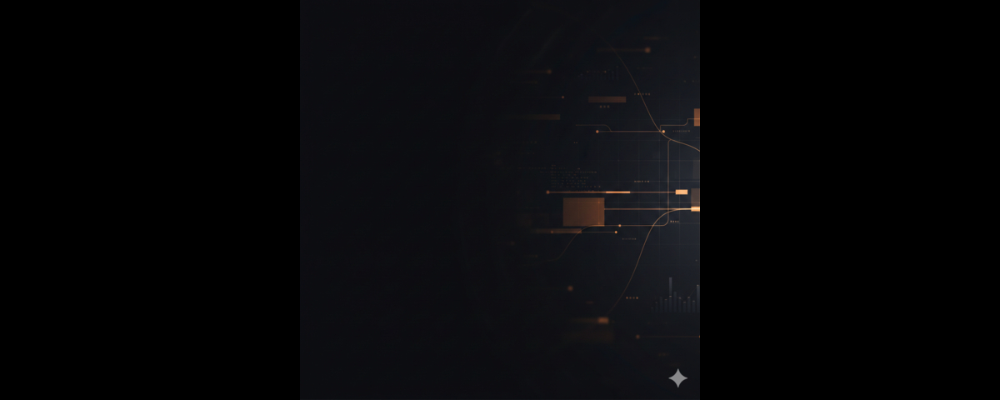
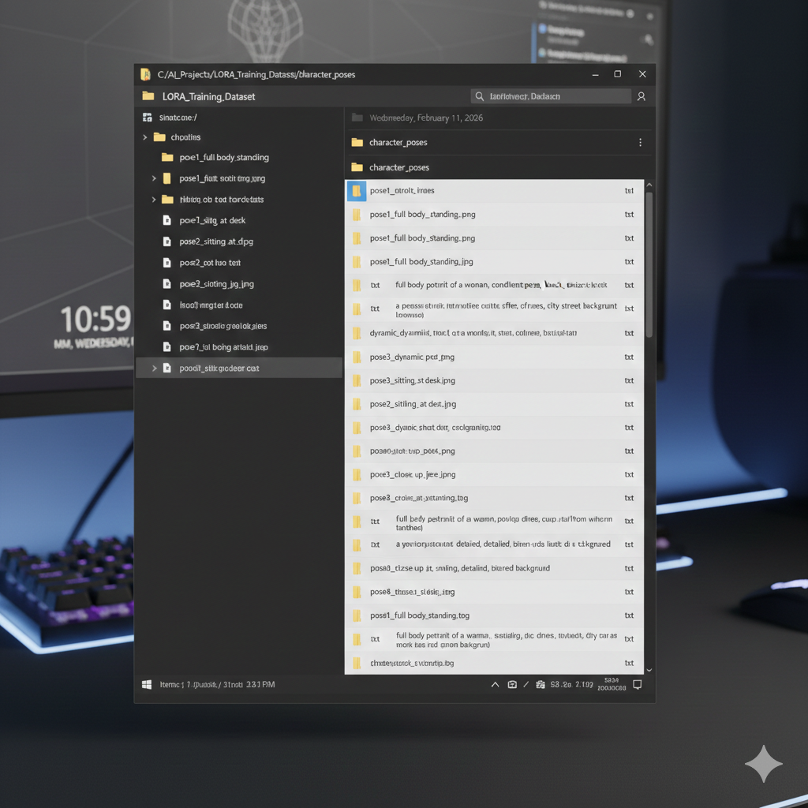
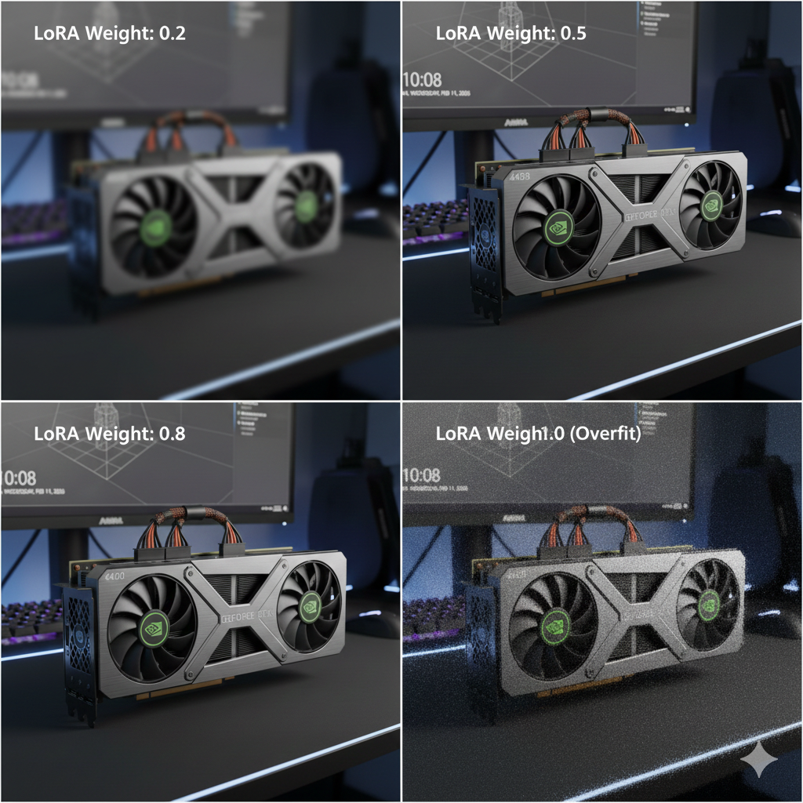

# How to Train Stable Diffusion LoRA Models for Under $10

Training custom LoRA models for Stable Diffusion has become one of the most accessible ways to create personalized AI-generated imagery. Whether you want to reproduce a specific artistic style, generate consistent character faces, or fine-tune the model on product photography, LoRA training allows you to achieve these goals without the computational expense of full model fine-tuning.

The common assumption is that this process requires either expensive local hardware or substantial cloud computing budgets. Neither is true. With current GPU rental pricing and efficient training configurations, you can train production-quality LoRA models for under ten dollars—often considerably less.

This guide walks through the complete process: selecting appropriate hardware, preparing your training dataset, configuring the training parameters, executing the training run, and validating your results. I will be specific about costs at each stage, because vague promises of "affordable AI training" help no one planning an actual project budget.

**What you will need before starting:**

- Twenty to one hundred training images (more on selection criteria below)
- Basic familiarity with command-line interfaces
- A cryptocurrency wallet or credit card for GPU rental payment
- Approximately two to four hours of focused time
- A budget of five to fifteen dollars for your first training run


---

## Table of Contents

- [Understanding LoRA and Why It Matters](#understanding-lora-and-why-it-matters)
- [Selecting the Right GPU for Training](#selecting-the-right-gpu-for-training)
- [GPU Rental Provider Comparison](#gpu-rental-provider-comparison)
- [Preparing Your Training Dataset](#preparing-your-training-dataset)
- [Setting Up the Training Environment](#setting-up-the-training-environment)
- [Configuring Training Parameters](#configuring-training-parameters)
- [Executing the Training Run](#executing-the-training-run)
- [Validating and Testing Your LoRA](#validating-and-testing-your-lora)
- [Cost Optimization Strategies](#cost-optimization-strategies)
- [Common Problems and Solutions](#common-problems-and-solutions)
- [Frequently Asked Questions](#frequently-asked-questions)

---

## Understanding LoRA and Why It Matters

LoRA, which stands for Low-Rank Adaptation, is a technique for fine-tuning large neural networks by training a small number of additional parameters rather than modifying the entire model. The original Stable Diffusion model contains nearly a billion parameters. Full fine-tuning would require modifying all of them, demanding substantial GPU memory and extended training times.

LoRA sidesteps this problem by freezing the original model weights and training small adapter matrices that modify how the model processes information. A typical LoRA file is between ten and two hundred megabytes, compared to the two to six gigabyte size of a full Stable Diffusion checkpoint.

The practical implications are significant:

**Memory efficiency.** LoRA training requires far less GPU VRAM than full fine-tuning. A 24GB GPU can comfortably train LoRAs for SDXL models that would otherwise require 40GB or more for full fine-tuning.

**Training speed.** Because you are training fewer parameters, each training epoch completes faster. What might take twelve hours for full fine-tuning can often be accomplished in ninety minutes with LoRA.

**Composability.** Multiple LoRAs can be combined at inference time. You might use one LoRA for artistic style and another for character consistency, mixing them at different strengths without retraining.

**Storage and distribution.** Small file sizes make LoRAs practical to share and maintain. You can reasonably keep dozens of specialized LoRAs on hand without storage concerns.

The cost reduction from these efficiencies is what makes sub-ten-dollar training possible. You are renting expensive hardware for one to three hours rather than eight to twenty-four hours.

---

## Selecting the Right GPU for Training

GPU selection involves balancing three factors: VRAM capacity, training speed, and rental cost. The minimum viable option and the optimal choice differ significantly.

### VRAM Requirements

For Stable Diffusion 1.5 LoRA training, 12GB of VRAM is the practical minimum. You can make it work with 8GB by reducing batch sizes and resolution, but the training quality often suffers.

For SDXL LoRA training, 16GB is the minimum, with 24GB strongly preferred. SDXL models are larger and more demanding. Attempting SDXL training on insufficient VRAM results in constant memory swapping, dramatically slowing the process and often causing training failures.

### Speed and Cost Tradeoffs

More expensive GPUs train faster, but the per-hour cost increase does not always proportionally reduce total project cost. Consider this comparison for training a typical SD 1.5 LoRA:

| GPU         | VRAM | Approximate Training Time | Typical Hourly Rate | Estimated Total Cost |
| ----------- | ---- | ------------------------- | ------------------- | -------------------- |
| RTX 3090    | 24GB | 2.5 hours                 | $0.50               | $1.25                |
| RTX 4090    | 24GB | 1.5 hours                 | $0.70               | $1.05                |
| RTX A6000   | 48GB | 1.5 hours                 | $0.80               | $1.20                |
| A100 (40GB) | 40GB | 1.0 hours                 | $1.50               | $1.50                |

The RTX 4090 typically offers the best cost efficiency. It trains nearly as fast as datacenter GPUs at significantly lower hourly rates. The RTX 3090 remains viable when 4090 availability is limited, with only marginally higher total costs.

For SDXL LoRA training, the calculations shift slightly because the larger model benefits more from additional VRAM and memory bandwidth. The A100 becomes more competitive for complex SDXL projects where training might otherwise take four or more hours on consumer hardware.

For a comprehensive analysis of GPU rental pricing across all major providers, including enterprise cloud options and marketplace platforms, see our [complete GPU rental pricing comparison for 2026](/en/gpu-rental-pricing-comparison-2026/).



---

## GPU Rental Provider Comparison

Three providers warrant consideration for LoRA training workloads. Each has distinct characteristics that matter depending on your payment preferences, technical comfort level, and cost sensitivity.

### Vast.ai

Vast.ai operates a peer-to-peer marketplace where individual GPU owners list their hardware for rent. This model produces the lowest prices in the market, with RTX 4090 GPUs frequently available at $0.35 to $0.60 per hour.

The tradeoff involves variability. Provider reliability ranges from 97% to 99.9% depending on the individual host. Availability fluctuates based on demand. You may need to try multiple providers before finding one with acceptable network speeds for your dataset upload.

For experienced users comfortable evaluating provider metrics, Vast.ai offers the lowest possible training costs. Budget an additional thirty minutes for initial setup and provider evaluation.

### RunPod

RunPod positions itself between pure marketplaces and enterprise cloud providers. The platform offers both community-sourced GPUs and dedicated "Secure Cloud" instances with more consistent performance.

Pricing runs slightly higher than Vast.ai, typically $0.59 per hour for RTX 4090 access on the Secure Cloud tier. The platform compensates with easier setup, pre-configured templates for common AI workloads, and more predictable availability.

For users new to GPU rentals or those who value straightforward interfaces over minimal cost optimization, RunPod represents a reasonable middle ground.

### GPUFlow

GPUFlow operates a peer-to-peer marketplace built on blockchain infrastructure, using smart contract escrow for payment processing. The platform accepts cryptocurrency payments and requires no identity verification.

Pricing typically falls between Vast.ai and RunPod, with RTX 4090 access at $0.50 to $0.80 per hour. The distinguishing features are payment privacy, instant setup (typically under thirty seconds to a running instance), and lower platform fees than competing marketplaces.

For users who prefer cryptocurrency payments, value transaction privacy, or want to avoid the account verification processes common with traditional providers, GPUFlow provides a streamlined alternative.

### Provider Summary

| Provider | RTX 4090 Price Range    | Setup Time   | Payment Options     | Best For             |
| -------- | ----------------------- | ------------ | ------------------- | -------------------- |
| Vast.ai  | $0.35-0.60/hr           | 5-15 minutes | Credit card         | Maximum cost savings |
| RunPod   | $0.59/hr (Secure Cloud) | 2-5 minutes  | Credit card, crypto | Ease of use          |
| GPUFlow  | $0.50-0.80/hr           | 30 seconds   | Crypto only         | Privacy, speed       |

---

## Preparing Your Training Dataset

Dataset quality determines training outcome more than any other factor. A carefully curated set of thirty images will produce better results than a carelessly assembled collection of two hundred.

### Image Selection Criteria

**Consistency.** All images should represent the concept you want the model to learn. If training on a specific person's face, every image should clearly show that face. If training on an artistic style, every image should exemplify that style.

**Variety within consistency.** While maintaining conceptual consistency, vary the technical aspects. Include different angles, lighting conditions, backgrounds, and contexts. This variety teaches the model to generalize rather than overfit to specific compositions.

**Technical quality.** Use sharp, well-exposed images. Motion blur, noise, compression artifacts, and poor lighting all become part of what the model learns. If your training images are grainy, your generated images will tend toward grain.

**Resolution.** Training images should be at least 512x512 pixels for SD 1.5, and at least 1024x1024 for SDXL. Higher resolution source images allow the training pipeline to crop and resize without quality loss.

### Dataset Size Guidelines

The optimal dataset size depends on concept complexity:

**Simple concepts (single face, basic style):** 20-40 images
**Moderate concepts (character with multiple outfits, nuanced style):** 40-80 images
**Complex concepts (detailed environment, highly variable style):** 80-150 images

More images require more training steps, increasing time and cost. Start with the smaller end of these ranges for your first attempts.

### Captioning Your Images

Each training image requires a text caption describing its contents. These captions teach the model what textual concepts to associate with the visual patterns.

Effective captions are specific and consistent:

**Poor caption:** "a woman"
**Better caption:** "a photograph of Sarah Miller, a woman with short brown hair and green eyes, wearing a blue sweater"

**Poor caption:** "fantasy art"
**Better caption:** "a digital painting in the style of luminescent fantasy, featuring glowing mushrooms in a dark forest, detailed linework, vibrant purple and blue color palette"

The trigger word or phrase you want to use during inference should appear in every caption. If you want to invoke your LoRA with "in the style of luminescent fantasy," that exact phrase should appear in each training caption.

Captioning can be done manually for small datasets. For larger collections, tools like BLIP or WD14 Tagger can generate initial captions that you then review and refine.



### Directory Structure

Organize your training data in a specific structure that the training scripts expect:

```
training_data/
├── 10_concept_name/
│   ├── image001.jpg
│   ├── image001.txt
│   ├── image002.jpg
│   ├── image002.txt
│   └── ...
```

The folder name prefix (the "10" in this example) indicates how many times each image in that folder should be repeated during training. Higher numbers increase the weight of those images in the training process.

The underscore-separated name after the number becomes the default trigger word if you choose not to use custom captions.

---

## Setting Up the Training Environment

With your dataset prepared and GPU rental secured, the next step is configuring the training environment. The standard toolchain for LoRA training is kohya_ss/sd-scripts, an open-source collection of training scripts maintained by the community.

### Initial Environment Setup

After connecting to your rented GPU instance, you will need to clone the training repository and install dependencies. The following commands establish the basic environment:

```bash
# Clone the training scripts repository
git clone https://github.com/kohya-ss/sd-scripts.git
cd sd-scripts

# Create and activate a virtual environment
python -m venv venv
source venv/bin/activate

# Install dependencies
pip install torch torchvision --index-url https://download.pytorch.org/whl/cu121
pip install -r requirements.txt
pip install xformers
```

This installation typically takes five to ten minutes depending on network speed. The xformers package is optional but recommended, as it significantly reduces memory usage during training.

### Downloading the Base Model

LoRA training requires a base Stable Diffusion model to train against. You will need to download this to your instance:

```bash
# Create a models directory
mkdir -p models/sd

# Download Stable Diffusion 1.5 (approximately 4GB)
wget -O models/sd/v1-5-pruned.safetensors \
  "https://huggingface.co/runwayml/stable-diffusion-v1-5/resolve/main/v1-5-pruned.safetensors"
```

For SDXL training, substitute the SDXL base model, which is approximately 6.5GB.

### Uploading Your Training Data

Transfer your prepared dataset to the GPU instance. Most providers support SCP or SFTP:

```bash
# From your local machine
scp -r ./training_data user@gpu-instance-ip:~/sd-scripts/
```

Alternatively, if your dataset is stored in cloud storage, you can download it directly to the instance using wget or rclone.

### GPUFlow-Specific Setup

If using GPUFlow, the platform provides pre-configured environments that eliminate most manual setup. After connecting through the web-based terminal:

```bash
# GPUFlow instances include a pre-installed training environment
cd /workspace/sd-scripts

# Upload your dataset using the web interface or SCP
# The training scripts are pre-configured and ready to use
```

This pre-configuration typically saves fifteen to twenty minutes compared to setting up a bare instance from scratch. For occasional training runs, this time savings can represent a meaningful percentage of your total GPU rental.

---

## Configuring Training Parameters

Training configuration significantly impacts both output quality and training duration. The parameters below represent conservative starting points that produce reliable results without excessive computation.

### Essential Parameters

Create a configuration file named `training_config.toml`:

```toml
[model]
pretrained_model_name_or_path = "./models/sd/v1-5-pruned.safetensors"
v2 = false
v_parameterization = false

[dataset]
train_data_dir = "./training_data"
resolution = 512
batch_size = 2
enable_bucket = true
min_bucket_reso = 256
max_bucket_reso = 1024

[training]
output_dir = "./output"
output_name = "my_lora"
max_train_epochs = 10
learning_rate = 1e-4
unet_lr = 1e-4
text_encoder_lr = 5e-5
lr_scheduler = "cosine_with_restarts"
lr_warmup_steps = 100
network_dim = 32
network_alpha = 16
optimizer_type = "AdamW8bit"
mixed_precision = "fp16"
save_every_n_epochs = 2
save_model_as = "safetensors"
```

### Parameter Explanations

**resolution:** Match this to your target inference resolution. 512 for SD 1.5, 1024 for SDXL.

**batch_size:** Higher values train faster but require more VRAM. Start with 2, increase to 4 if memory allows.

**max_train_epochs:** One epoch means the model sees every training image once. Ten epochs is a reasonable starting point for most datasets.

**learning_rate:** Controls how aggressively the model updates. The values above are conservative. If results are weak, try increasing to 2e-4 or 3e-4.

**network_dim and network_alpha:** These control LoRA capacity. Dim 32 with alpha 16 balances quality and file size. Higher dimensions (64, 128) can capture more detail but produce larger files and risk overfitting.

**optimizer_type:** AdamW8bit reduces memory usage substantially with minimal quality impact. Essential for 24GB cards training SDXL.

**mixed_precision:** FP16 training halves memory requirements compared to FP32. Quality impact is negligible for most use cases.

### Adjusting for Your Hardware

For RTX 4090 with 24GB VRAM:

- batch_size = 4 is typically safe for SD 1.5
- batch_size = 2 for SDXL

For RTX 3090 with 24GB VRAM:

- batch_size = 2 for SD 1.5
- batch_size = 1 for SDXL (enable gradient checkpointing)

For A100 with 40GB VRAM:

- batch_size = 6-8 for SD 1.5
- batch_size = 4 for SDXL

Higher batch sizes reduce total training time proportionally. Doubling batch size roughly halves the number of optimization steps required.


---

## Executing the Training Run

With environment configured and parameters set, initiate training:

```bash
accelerate launch --num_cpu_threads_per_process=4 train_network.py \
  --config_file="./training_config.toml" \
  --logging_dir="./logs"
```

### Monitoring Progress

Training output displays loss values and progress information:

```
epoch 1/10, step 50/500, loss=0.0823
epoch 1/10, step 100/500, loss=0.0756
epoch 1/10, step 150/500, loss=0.0691
...
```

**What to watch for:**

Loss should generally decrease over the first few epochs, then stabilize. A typical training run might show:

- Epoch 1: loss around 0.08-0.10
- Epoch 5: loss around 0.05-0.07
- Epoch 10: loss around 0.04-0.06

If loss increases after initial decrease, the model may be overfitting. If loss remains flat from the start, learning rate may be too low.

### Checkpointing

The configuration saves checkpoints every two epochs. These intermediate saves serve two purposes:

1. **Recovery.** If training crashes or you need to terminate early, you can resume from the last checkpoint.

2. **Selection.** Different epochs sometimes produce different characteristics. Epoch 6 might capture your concept well while epoch 10 overfits. Having checkpoints lets you test and choose.

### Expected Training Times

For a 50-image SD 1.5 LoRA with the configuration above:

| GPU      | Approximate Time |
| -------- | ---------------- |
| RTX 3090 | 90-120 minutes   |
| RTX 4090 | 60-90 minutes    |
| A100     | 45-60 minutes    |

SDXL training requires approximately 1.5x to 2x these durations.

---

## Validating and Testing Your LoRA

Training completion produces a .safetensors file in your output directory. This file needs testing before you can consider the project complete.

### Basic Validation

Copy the LoRA file to your local machine or a system running Stable Diffusion WebUI:

```bash
# Download from GPU instance
scp user@gpu-instance-ip:~/sd-scripts/output/my_lora.safetensors ./
```

In Automatic1111 WebUI, place the file in the `models/Lora` directory. For ComfyUI, use the `models/loras` directory.

### Testing Methodology

Generate a series of test images varying these factors:

**LoRA weight:** Test at 0.5, 0.7, 0.8, and 1.0 strength. Some LoRAs work best below full strength.

**Prompt positioning:** Include your trigger word at different positions in the prompt. Beginning, middle, and end positions can produce subtly different results.

**Negative prompts:** Test with and without your concept in negative prompts. Sometimes adding the trigger to negatives and using low weight creates interesting inversions.

**Different seed values:** Use at least five different seeds per configuration to distinguish consistent patterns from random variation.

### Quality Assessment

Evaluate your results against these criteria:

**Concept accuracy:** Does the generated output reflect your training concept? If you trained on a face, is that face recognizable?

**Integration:** Does the LoRA concept integrate naturally with other prompt elements? Can you place your trained character in varied scenes?

**Artifacts:** Look for repeated patterns, unnatural elements, or distortions that appear consistently. These indicate training problems or overfitting.

**Flexibility:** Test edge cases. If you trained a character, can they be depicted at different ages? In different clothing? Performing various actions?

If results are unsatisfactory, common remedies include:

- Training for more epochs (underfitting)
- Training for fewer epochs (overfitting)
- Adjusting learning rate
- Improving caption quality
- Adding more varied training images



---

## Cost Optimization Strategies

The difference between a five-dollar training run and a twenty-dollar training run often comes down to workflow efficiency rather than provider selection.

### Pre-Upload Dataset Preparation

Complete all dataset curation, cropping, and captioning on your local machine before starting the GPU rental. Paying $0.70 per hour to manually review and rename files is an expensive use of that hardware.

Checklist before starting rental:

- All images cropped to appropriate aspect ratios
- All captions written and reviewed
- Dataset organized in correct folder structure
- Training configuration file prepared
- Test commands written and ready to paste

### Batch Training

If you need multiple LoRAs, train them in a single session. The fixed costs of environment setup and model download amortize across all training runs.

For example, training three separate LoRAs:

- Three separate sessions: 3 × (20 min setup + 90 min training) = 330 minutes
- One batched session: 20 min setup + (3 × 90 min training) = 290 minutes

The forty-minute savings represents approximately 15% cost reduction.

### Checkpoint Testing Strategy

Rather than training to epoch 15 and hoping for good results, consider:

1. Train to epoch 6 (approximately 60% of full training time)
2. Test the checkpoint
3. If satisfactory, stop and save remaining GPU time
4. If underfitting, continue training from checkpoint

This approach often catches good results earlier than expected, reducing total costs.

### Terminate Promptly

GPU billing typically continues until you explicitly stop the instance. Close your session immediately after copying your output files. A forgotten running instance overnight at $0.70 per hour adds twelve dollars to your project cost.

### Provider Selection Timing

GPU availability and pricing fluctuate based on demand. Training at off-peak hours (weekday mornings in US time zones, for example) often provides better pricing and GPU availability than weekend evenings.

---

## Common Problems and Solutions

### CUDA Out of Memory

**Symptom:** Training crashes with "CUDA out of memory" error.

**Solutions:**

- Reduce batch_size in configuration
- Enable gradient checkpointing by adding `gradient_checkpointing = true`
- Lower resolution (though this affects output quality)
- Use a GPU with more VRAM

### Training Loss Does Not Decrease

**Symptom:** Loss values remain flat or fluctuate randomly throughout training.

**Solutions:**

- Increase learning rate (try 2e-4 or 3e-4)
- Check that captions correctly describe images
- Verify images are correctly formatted and readable
- Ensure base model path is correct

### LoRA Has No Effect on Generation

**Symptom:** Generated images look identical with LoRA enabled or disabled.

**Solutions:**

- Verify LoRA file is in correct directory for your UI
- Check that trigger words match what you used in training captions
- Increase LoRA weight/strength setting
- Try a different checkpoint from training

### LoRA Overfit and Inflexible

**Symptom:** LoRA produces training images nearly exactly, but fails with varied prompts.

**Solutions:**

- Train for fewer epochs
- Reduce network_dim value
- Add more variety to training dataset
- Reduce learning rate

### Slow Training Speed

**Symptom:** Training progresses much slower than expected times.

**Solutions:**

- Verify GPU is actually being used (nvidia-smi should show high GPU utilization)
- Ensure xformers is installed
- Check that mixed_precision is enabled
- Reduce network_dim if using very high values

---

## Frequently Asked Questions

### Can I train LoRA models using my own GPU instead of renting?

Yes, provided you have an NVIDIA GPU with at least 12GB of VRAM, such as an RTX 3060 or better. However, the electricity costs, hardware wear, and significantly longer training times on consumer hardware often make renting a more economical choice for occasional projects. A two-hour training run at $0.70 per hour costs less than the electricity most home setups consume running at full load for the four to six hours required on slower hardware.

### How long does a typical LoRA training session take?

Most LoRA training sessions complete within one to three hours when using an RTX 4090 or RTX 3090. The exact duration depends on your dataset size, the number of training epochs, and your batch size configuration. SDXL models require approximately 50-100% more time than SD 1.5 for equivalent training runs.

### What is the minimum number of images required for LoRA training?

You can produce reasonable results with as few as fifteen to twenty images. However, datasets containing thirty to one hundred well-captioned images typically yield better quality. Image quality and caption accuracy matter more than raw quantity. A well-curated set of thirty images usually outperforms a hastily assembled collection of one hundred.

### Which GPU rental provider offers the best value for LoRA training?

Vast.ai typically offers the lowest hourly rates for RTX 4090 GPUs, often $0.35 to $0.50 per hour. GPUFlow provides competitive pricing with cryptocurrency payment options and no identity verification requirements. RunPod offers the most straightforward interface for users new to GPU rentals. For a detailed comparison of all providers and current pricing, see our [comprehensive GPU rental pricing comparison](/en/gpu-rental-pricing-comparison-2026/).

### Is it more cost-effective to train multiple LoRA models in a single session?

Yes. Batch training multiple LoRAs in one extended session eliminates repeated setup time and minimizes idle GPU charges. Training three to five LoRA models in a four-hour session typically costs less than half what you would spend training them individually across separate rentals.

### Can I use trained LoRAs commercially?

This depends on the license of your base model. Stable Diffusion 1.5 uses the CreativeML Open RAIL-M license, which permits commercial use with certain restrictions. SDXL has similar permissive licensing. Your LoRA inherits restrictions from its base model. Training images may also carry licensing requirements—ensure you have appropriate rights to any images you use for training.

---

## Conclusion

Training custom LoRA models has become remarkably accessible. The computational barriers that once required significant hardware investment now amount to a few dollars in GPU rental fees. The techniques described in this guide, applied to a well-prepared dataset, consistently produce usable results on the first attempt.

The critical success factors remain unchanged from more expensive training approaches: quality training data, appropriate parameter selection, and careful validation of results. No amount of computational power compensates for poor source images or misconfigured training runs.

Start with a modest dataset of twenty to thirty images. Train at conservative settings. Test your results thoroughly before expanding to larger projects. The per-attempt cost is low enough that iteration is practical—treating your first few training runs as learning experiences rather than production outputs.

For those comparing GPU rental options across all provider types and price points, our [GPU rental pricing comparison](/en/gpu-rental-pricing-comparison-2026/) provides current rates for consumer GPUs, datacenter hardware, and enterprise cloud options.

---

_This guide was last updated February 12, 2026. GPU rental pricing and training tool configurations change frequently. Verify current pricing with providers directly before committing to a training project._
