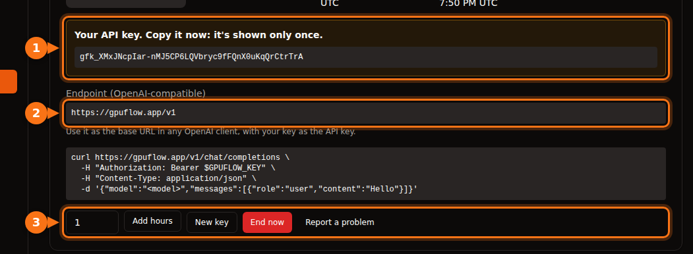

Many AI tools let you swap OpenAI for another provider, as long as it speaks the same API. You always need the same three things:

| What | Example |
| --- | --- |
| **Base URL** (also called API base, endpoint or host) | `https://gpuflow.app/v1` |
| **API key** | `gfk_...` |
| **Model name** | `qwen2.5:7b` |

We use a GPUFlow rental as the example throughout, but the steps are the same for any OpenAI-compatible server: a local Ollama or llama.cpp, vLLM, OpenRouter and many more. Just change the three values.

On GPUFlow you find all three on **Dashboard → Current Rentals** after you rent a GPU:



## Before you start: check the endpoint and the model name

One command tells you that the key works and what the model is called:

```bash
curl https://gpuflow.app/v1/models \
  -H "Authorization: Bearer gfk_your_key"
```

The answer lists the models. Copy the `id`, for example `qwen2.5:7b`, exactly as written. A wrong model name is the most common reason an app refuses to work.

**Know what your endpoint supports.** GPUFlow's endpoint offers `/v1/models` and `/v1/chat/completions`, with streaming. It doesn't offer embeddings, the newer Responses API, or image generation. Some app features need those, and we point them out below.

## Chat apps

### Open WebUI

1. Open **Settings → Admin → Connections**.
2. Under **Manage OpenAI API Connections**, click **+ (Add Connection)**.
3. Fill in:
   - **URL:** `https://gpuflow.app/v1`
   - **API Key:** your key
4. Click **Verify Connection** to test it (saving alone doesn't test), then **Save**.

Open WebUI reads the model list from `/models` on its own. If you run it with Docker, you can set `OPENAI_API_BASE_URL` and `OPENAI_API_KEY` instead, but they're only read the first time Open WebUI starts. After that, change them in the admin screen.

Document upload and search in Open WebUI use a small embedding model that runs locally by default, so they keep working. Don't switch the embedding engine to OpenAI with your chat endpoint as its URL.

### LibreChat

Add a custom endpoint to `librechat.yaml`:

```yaml
endpoints:
  custom:
    - name: "GPUFlow"
      apiKey: "${GPUFLOW_API_KEY}"
      baseURL: "https://gpuflow.app/v1"
      models:
        default: ["qwen2.5:7b"]
        fetch: true
      titleConvo: true
      titleModel: "qwen2.5:7b"
      modelDisplayLabel: "GPUFlow"
```

Put your key in `.env` as `GPUFLOW_API_KEY=gfk_...`. Use `apiKey: "user_provided"` if each user should enter their own key. With `fetch: true`, LibreChat reads the model list from the endpoint.

LibreChat's document search (the RAG API) uses OpenAI embeddings by default. Keep it on OpenAI, Ollama or Hugging Face; don't point `RAG_OPENAI_BASEURL` at a chat-only endpoint.

### AnythingLLM

1. Open the LLM settings and choose **Generic OpenAI**.
2. Fill in **Base URL** (`https://gpuflow.app/v1`), **API Key**, **Chat Model Name** (`qwen2.5:7b`), **Token context window** and **Max Tokens**.

With Docker, the same settings are environment variables:

```bash
LLM_PROVIDER='generic-openai'
GENERIC_OPEN_AI_BASE_PATH='https://gpuflow.app/v1'
GENERIC_OPEN_AI_MODEL_PREF='qwen2.5:7b'
GENERIC_OPEN_AI_MODEL_TOKEN_LIMIT=32768
GENERIC_OPEN_AI_API_KEY=gfk_your_key
```

Leave the embedder on **AnythingLLM Default**.

### Jan

1. Open **Settings → Model Providers** and click **Add Provider**.
2. Choose **OpenAI-compatible**.
3. Enter a name, the **Base URL** with `/v1` at the end, and your **API key**. Click **Create**.

Jan loads the model list when you save. If it doesn't, add the model name by hand with the **+** button in the provider's model list.

## Coding assistants

### Continue (VS Code and JetBrains)

Add a model to your `config.yaml`:

```yaml
models:
  - name: GPUFlow Qwen 2.5 7B
    provider: openai
    model: qwen2.5:7b
    apiBase: https://gpuflow.app/v1
    apiKey: ${{ secrets.GPUFLOW_API_KEY }}
    roles:
      - chat
      - edit
      - apply
```

Leave out the `autocomplete` and `embed` roles: this endpoint only offers chat, and embeddings need `/v1/embeddings`. In VS Code, Continue has a built-in embedder for codebase search. In JetBrains it doesn't, so set a separate embeddings model there.

Continue's Agent mode needs a model that handles tool calls. Only add `capabilities: [tool_use]` if you know yours does.

### Cline

1. Open Cline's settings.
2. Set **API Provider** to **OpenAI Compatible**.
3. Fill in **Base URL**, **API Key** and **Model** (`qwen2.5:7b`).
4. Under **Model Configuration**, set the context window to match your model.

A note on **Roo Code**: its docs say it only works with models that support native tool calling, with no fallback. A plain chat endpoint may not work with it.

## Code

### OpenAI's Python and Node libraries

Python (`pip install openai`):

```python
from openai import OpenAI

client = OpenAI(base_url="https://gpuflow.app/v1", api_key="gfk_your_key")

reply = client.chat.completions.create(
    model="qwen2.5:7b",
    messages=[{"role": "user", "content": "Say hello in five languages."}],
)
print(reply.choices[0].message.content)
```

Node (`npm install openai`):

```js
import OpenAI from "openai";

const client = new OpenAI({ baseURL: "https://gpuflow.app/v1", apiKey: "gfk_your_key" });

const reply = await client.chat.completions.create({
  model: "qwen2.5:7b",
  messages: [{ role: "user", content: "Say hello in five languages." }],
});
console.log(reply.choices[0].message.content);
```

Both libraries also read `OPENAI_BASE_URL` and `OPENAI_API_KEY` from the environment. Note that their READMEs now open with `client.responses.create(...)`. That's the Responses API; use `client.chat.completions.create(...)` as above.

### LangChain

Python (`pip install -U langchain-openai`):

```python
from langchain_openai import ChatOpenAI

llm = ChatOpenAI(
    model="qwen2.5:7b",
    base_url="https://gpuflow.app/v1",
    api_key="gfk_your_key",
    use_responses_api=False,
)
print(llm.invoke("Name three uses for a GPU.").content)
```

JavaScript (`npm install @langchain/openai @langchain/core`). Set your key in the environment first, `export OPENAI_API_KEY=gfk_your_key`, then:

```js
import { ChatOpenAI } from "@langchain/openai";

const llm = new ChatOpenAI({
  model: "qwen2.5:7b",
  configuration: { baseURL: "https://gpuflow.app/v1" },
});
```

LangChain switches to the Responses API when you use certain features, such as built-in tools or reasoning output. `use_responses_api=False` keeps it on Chat Completions.

### LlamaIndex

Use `OpenAILike` (`pip install llama-index-llms-openai-like`):

```python
from llama_index.llms.openai_like import OpenAILike

llm = OpenAILike(
    model="qwen2.5:7b",
    api_base="https://gpuflow.app/v1",
    api_key="gfk_your_key",
    context_window=32768,
    is_chat_model=True,
    is_function_calling_model=False,
)
```

**Set `is_chat_model=True`.** It defaults to `False`, which sends requests to `/v1/completions` instead of `/v1/chat/completions`. For indexing documents, set `Settings.embed_model` to a real embedding model; LlamaIndex uses OpenAI embeddings by default.

## Tools that won't work with a chat-only endpoint

- **Codex CLI.** It dropped Chat Completions support in early 2026 and only accepts the Responses API now.
- **OpenAI Agents SDK.** It uses the Responses API by default. Call `set_default_openai_api("chat_completions")`, or wrap your client in `OpenAIChatCompletionsModel`, and turn off tracing with `set_tracing_disabled(True)`, since tracing needs an OpenAI key.
- **Anything that needs embeddings** from the same endpoint: document search, "chat with your files", semantic code search. Use the app's built-in embedder or a separate embeddings provider.

## If it still doesn't work

| What you see | Usual cause |
| --- | --- |
| `404` or "not found" | The base URL is missing `/v1`, or the app adds `/v1` itself and you added it twice. |
| `401` or `invalid_api_key` | Wrong key, or the rental has ended. On GPUFlow, click **New key** on Current Rentals if you lost it. |
| "Model not found" | The model name doesn't match `/v1/models` exactly. |
| Requests to `/v1/completions` or `/v1/responses` fail | The app is using a different API. Look for a "chat model" or "chat completions" setting. |

## Related articles

- [Hourly GPU or per-token API? What running a 7B–8B model really costs](/en/hourly-gpu-vs-per-token-api/)
- [GPUFlow vs Vast.ai vs RunPod vs SaladCloud: which one fits your job](/en/gpuflow-vs-vast-ai-vs-runpod/)

## Sources

All checked in September 2026.

- Open WebUI: [OpenAI-compatible providers](https://docs.openwebui.com/getting-started/quick-start/connect-a-provider/starting-with-openai-compatible/), [environment variables](https://docs.openwebui.com/reference/env-configuration)
- LibreChat: [custom endpoints](https://www.librechat.ai/docs/configuration/librechat_yaml/object_structure/custom_endpoint), [RAG API](https://www.librechat.ai/docs/configuration/rag_api)
- AnythingLLM: [Generic OpenAI](https://docs.anythingllm.com/setup/llm-configuration/cloud/openai-generic)
- Jan: [custom endpoints](https://www.jan.ai/docs/desktop/remote-models/custom-endpoint)
- Continue: [OpenAI provider](https://docs.continue.dev/customize/model-providers/top-level/openai), [config reference](https://docs.continue.dev/reference)
- Cline: [OpenAI Compatible](https://docs.cline.bot/provider-config/openai-compatible); Roo Code: [OpenAI Compatible](https://roocodeinc.github.io/Roo-Code/providers/openai-compatible/)
- OpenAI libraries: [openai-python](https://github.com/openai/openai-python), [openai-node](https://github.com/openai/openai-node)
- LangChain: [Python](https://docs.langchain.com/oss/python/integrations/chat/openai), [JavaScript](https://docs.langchain.com/oss/javascript/integrations/chat/openai)
- LlamaIndex: [OpenAILike](https://developers.llamaindex.ai/python/framework-api-reference/llms/openai_like/)
- OpenAI Agents SDK: [models](https://openai.github.io/openai-agents-python/models/)
- Codex and Chat Completions: [github.com/openai/codex/discussions/7782](https://github.com/openai/codex/discussions/7782)
- GPUFlow API: [Use your API key](https://docs.gpuflow.app/renters/api-quickstart/)
