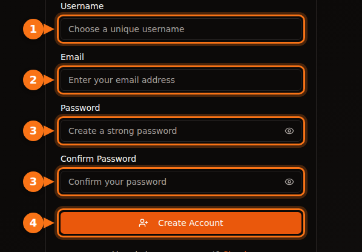
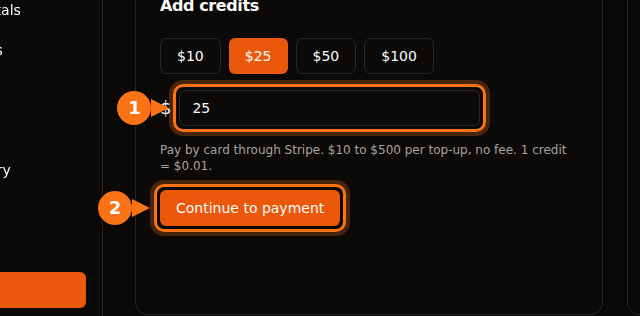

Before you rent your first GPU, every platform asks for something: an email address, a card, sometimes a phone number, and on the big clouds a quota request that can take days. This article lists what each one asks for, so you can pick one that gets you started today.

Everything was checked in September 2026 on the platforms' own docs. Sources are at the end.

## The quick comparison

| Platform | To create an account | Before you can rent | ID check for renters | Minimum to start |
| --- | --- | --- | --- | --- |
| **GPUFlow** | Email and password, or Google or GitHub | Confirm your email, add credits by card | None in the renter steps | $10 top-up, no fee |
| **Vast.ai** | Email | Verify your email, add credit | Not in the docs | $5 deposit |
| **RunPod** | Email | Add credit | Only before a first crypto payment | 1 hour of credit; $100 per transaction with a prepaid card |
| **SaladCloud** | Portal account | Add a billing method to your organization | Not in the docs | Top-ups from $5 |
| **Lambda** | Account | Add a credit card | Not in the docs | $10 card pre-authorization, refunded |
| **TensorDock** | Account | Deposit money | The terms allow account checks | "As little as $5" |
| **AWS** | Email, phone PIN check, payment method, CAPTCHA | Request a GPU quota: new accounts start at 0 | Not for most accounts | Pay as you go |
| **Google Cloud** | Account with billing | Request GPU quota; free-trial accounts get none | Not for most accounts | Pay as you go |

"Not in the docs" means we didn't find an ID requirement for renters in that platform's documentation. Platforms can still ask for checks when something looks unusual.

## The small platforms: minutes, not days

Vast.ai, RunPod, SaladCloud, TensorDock and GPUFlow are all prepaid. You add money first and spend it by the second or minute. Because you can't run up a bill you haven't paid for, they don't need to check your credit or your company.

What they do differ on:

- **Email verification.** Vast.ai and GPUFlow both require it before you can rent or add credits. Check your spam folder if the email doesn't arrive.
- **Payment methods.**
  - Vast.ai: card, BitPay, Crypto.com.
  - RunPod: Visa, Mastercard, Amex, crypto, and invoicing for payments over $5,000.
  - SaladCloud: card, or USDC, USDT and RENDER on Solana.
  - Lambda: major credit cards only, and only in supported countries.
  - GPUFlow: cards through Stripe.
- **Where your money goes if you don't use it.** SaladCloud credit expires 12 months after purchase. GPUFlow credits don't expire.

## The big clouds: plan for a quota request

AWS and Google Cloud don't block you at sign-up. They block you at the GPU.

- **AWS:** the quota for "Running On-Demand G and VT instances" (the instance family with the NVIDIA L4 and A10G) starts at **0 vCPUs** on new accounts. You ask for more in the Service Quotas console. AWS also raises quotas automatically as an account builds up usage.
- **Google Cloud:** free-trial accounts get no GPU quota. Once the project has billing history, quota requests are granted more readily. Quota is per region, and preemptible GPUs need their own quota.

If you need a GPU today, don't start with a new AWS or Google Cloud account.

## Signing up on GPUFlow, step by step

GPUFlow is built for the "I need an AI model in five minutes" case. What you get is an OpenAI-compatible API key for a GPU, not a machine.

1. **Create an account** at gpuflow.app with a username, your email address and a password, or with Google or GitHub.

   

2. **Confirm your email.** Click the link in the email GPUFlow sends you. You can't add credits until you do.
3. **Add credits** on **Dashboard → Payments**, from $10 to $500 by card through Stripe. 1 credit = $0.01, and there's no fee.

   

4. **Rent a GPU** for the number of hours you want, and copy your API key. You pay by the second; if you end early, the rest goes back to your credits.

The full walkthrough with every screen is in the docs: [rent a GPU, step by step](https://docs.gpuflow.app/renters/getting-started/).

## If you want to rent out a GPU instead

Being paid is where identity checks come in. Payment companies are required to know who they send money to.

- **GPUFlow:** to cash out, you set up a payout account with Stripe, which checks your identity and asks for your bank details. Payouts work in the United States, Canada, the United Kingdom, Switzerland and the European Economic Area.
- **Vast.ai:** hosts are paid through Wise, PayPal or Stripe, and those services handle identity checks.
- **Salad:** rewards go out through PayPal, gift cards and other options.

More on what hosting pays in [what your gaming GPU can earn](/en/how-much-can-you-earn-renting-out-your-gpu/).

## Before you pay: a short checklist

1. **Confirm your email first**, so you're not stuck at the payment step.
2. **Check that your country and card are supported.** Lambda, for example, only accepts payments from a list of countries.
3. **Know your bank's foreign transaction fee.** Most platforms charge in US dollars. [More on hidden costs](/en/hidden-fees-in-gpu-rental/).
4. **Start small.** Add enough for a few hours, test, then add more.

## Related articles

- [GPUFlow vs Vast.ai vs RunPod vs SaladCloud: which one fits your job](/en/gpuflow-vs-vast-ai-vs-runpod/)
- [How to use an OpenAI-compatible API key in Open WebUI, Continue, LangChain and more](/en/use-openai-compatible-api-key-in-apps/)

## Sources

All checked in September 2026.

- GPUFlow: [rent a GPU, step by step](https://docs.gpuflow.app/renters/getting-started/), [credits and billing](https://docs.gpuflow.app/renters/billing/), [getting paid](https://docs.gpuflow.app/providers/getting-paid/)
- Vast.ai: [quickstart](https://docs.vast.ai/guides/get-started/quickstart.md), [billing](https://docs.vast.ai/documentation/reference/billing), [host payouts](https://docs.vast.ai/host/payment.md)
- RunPod: [billing information](https://docs.runpod.io/references/billing-information)
- SaladCloud: [account setup](https://docs.salad.com/general/tutorials/account-setup.md), [billing](https://docs.salad.com/general/explanation/billing.md)
- Lambda: [managing billing](https://docs.lambda.ai/public-cloud/manage-billing/)
- TensorDock: [cloud GPUs](https://www.tensordock.com/cloud-gpus.html), [terms of service](https://docs.tensordock.com/legal-information/terms-of-service-tos)
- AWS: [creating an account](https://docs.aws.amazon.com/accounts/latest/reference/manage-acct-creating.html), [On-Demand instance quotas](https://docs.aws.amazon.com/AWSEC2/latest/UserGuide/ec2-on-demand-instances.html)
- Google Cloud: [GPU quota troubleshooting](https://docs.cloud.google.com/deep-learning-vm/docs/troubleshooting)
- Salad rewards: [PayPal redemption](https://support.salad.com/rewards/redeeming-your-rewards/how-to-redeem-paypal/)
