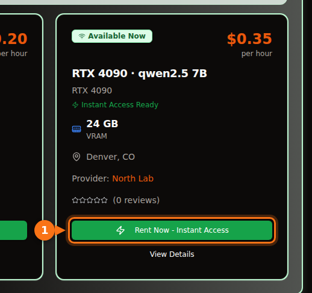

At the 4-bit quantization Ollama ships by default, a 7B or 8B model needs an 8 GB card, 12B to 14B models need 12 GB (16 GB if you want long prompts), and 27B to 32B models need 24 GB. A 70B model at 4-bit is 43 GB, which means 48 GB or more of VRAM.

The longer version matters because the download size is not the whole bill. The context you use takes memory too, and a model that looks like it fits can end up half on the CPU and several times slower. Below is the formula I use, what the quantization labels mean, and a table of current open models with their real download sizes from the Ollama library. Sizes and specs were checked in September 2026; sources are at the end.

## Quick answer by VRAM size

| VRAM | Typical cards | What runs fully on the GPU (4-bit) |
| --- | --- | --- |
| 8 GB | RTX 4060, RTX 5060, RTX 3070 | 7B to 8B models: Llama 3.1 8B, Qwen3 8B, Mistral 7B |
| 12 GB | RTX 3060 12 GB, RTX 4070, RTX 5070 | 12B to 14B models at short context; 7B to 8B at Q8_0 |
| 16 GB | RTX 4060 Ti 16 GB, RTX 4080, RTX 5080 | 14B with long context, gpt-oss 20B |
| 24 GB | RTX 3090, RTX 4090 | 24B to 32B: Mistral Small 3.2, Gemma 3 27B, Qwen3 32B |
| 32 GB | RTX 5090 | 32B with long context, 35B mixture-of-experts models |
| 48 to 80 GB | L40S (48 GB), H100 (80 GB) | 70B at 4-bit, gpt-oss 120B on 80 GB |

Card memory sizes are from NVIDIA's spec pages. Some cards come in two versions: the RTX 3060 exists with 12 GB and 8 GB, and the RTX 4060 Ti and RTX 5060 Ti with 16 GB and 8 GB. Check which one you are buying or renting.

## How to estimate the VRAM a model needs

Three things sit in GPU memory while a model answers you:

1. **The weights.** Parameters × bits per weight ÷ 8 = bytes.
2. **The KV cache.** The model keeps the keys and values of every token in the conversation so it does not recompute them. Per token that is 2 × layers × KV heads × head size × 2 bytes (at the default 16-bit cache). Multiply by the context length.
3. **Overhead.** The CUDA context, scratch buffers and the runtime itself. I budget about 1 GB. It varies by engine and settings, so treat it as a rule of thumb, not a spec.

The layer and head counts are in each model's `config.json` on Hugging Face.

### Worked example: Qwen 2.5 14B on a 16 GB card

Qwen 2.5 14B has 14.7 billion parameters, 48 layers, 8 KV heads and a head size of 128 (5,120 hidden size ÷ 40 attention heads).

- **Weights at Q4_K_M:** llama.cpp lists Q4_K_M at about 4.89 bits per weight. 14.7 billion × 4.89 ÷ 8 = 8.99 GB. Ollama's `qwen2.5:14b` download is 9.0 GB, so the arithmetic matches the real file.
- **KV cache per token:** 2 × 48 × 8 × 128 × 2 bytes = 196,608 bytes, about 0.2 MB.
- **KV cache for the whole context:** 4,096 tokens = 0.8 GB. 16,384 tokens = 3.2 GB. 32,768 tokens = 6.4 GB.
- **Total:** 9.0 + 0.8 + 1 = 10.8 GB at 4K context. 9.0 + 3.2 + 1 = 13.2 GB at 16K. 9.0 + 6.4 + 1 = 16.4 GB at 32K, which no longer fits on a 16 GB card.

<figure>
<svg viewBox="0 0 720 340" role="img" aria-labelledby="d1-title" xmlns="http://www.w3.org/2000/svg" font-family="system-ui, sans-serif" font-size="15">
<title id="d1-title">What fills VRAM for Qwen 2.5 14B at Q4_K_M on a 16 GB card: weights, KV cache at three context lengths, and overhead</title>
<rect x="0" y="0" width="720" height="340" fill="#ffffff"/>
<rect x="150" y="20" width="16" height="16" rx="3" fill="#6366f1"/>
<text x="172" y="33" fill="#1e1b4b">Weights 9.0 GB</text>
<rect x="330" y="20" width="16" height="16" rx="3" fill="#a5b4fc"/>
<text x="352" y="33" fill="#1e1b4b">KV cache</text>
<rect x="510" y="20" width="16" height="16" rx="3" fill="#e2e8f0"/>
<text x="532" y="33" fill="#1e1b4b">Overhead ~1 GB</text>
<line x1="582.0" y1="66" x2="582.0" y2="278" stroke="#f97316" stroke-width="2" stroke-dasharray="5 4"/>
<text x="576.0" y="60" text-anchor="end" fill="#f97316" font-weight="600">16 GB card</text>
<text x="140" y="106" text-anchor="end" fill="#1e1b4b">4K context</text>
<rect x="150" y="80" width="243.0" height="40" fill="#6366f1"/>
<text x="271.5" y="106" text-anchor="middle" fill="#ffffff">weights</text>
<rect x="393.0" y="80" width="21.6" height="40" fill="#a5b4fc"/>
<rect x="414.6" y="80" width="27.0" height="40" fill="#e2e8f0"/>
<text x="449.6" y="106" fill="#16a34a" font-weight="600">10.8 GB</text>
<text x="140" y="180" text-anchor="end" fill="#1e1b4b">16K context</text>
<rect x="150" y="154" width="243.0" height="40" fill="#6366f1"/>
<text x="271.5" y="180" text-anchor="middle" fill="#ffffff">weights</text>
<rect x="393.0" y="154" width="86.4" height="40" fill="#a5b4fc"/>
<text x="436.2" y="180" text-anchor="middle" fill="#1e1b4b">3.2</text>
<rect x="479.4" y="154" width="27.0" height="40" fill="#e2e8f0"/>
<text x="514.4" y="180" fill="#16a34a" font-weight="600">13.2 GB</text>
<text x="140" y="254" text-anchor="end" fill="#1e1b4b">32K context</text>
<rect x="150" y="228" width="243.0" height="40" fill="#6366f1"/>
<text x="271.5" y="254" text-anchor="middle" fill="#ffffff">weights</text>
<rect x="393.0" y="228" width="172.8" height="40" fill="#a5b4fc"/>
<text x="479.4" y="254" text-anchor="middle" fill="#1e1b4b">6.4</text>
<rect x="565.8" y="228" width="27.0" height="40" fill="#e2e8f0"/>
<text x="600.8" y="254" fill="#f97316" font-weight="600">16.4 GB</text>
<line x1="150" y1="278" x2="690" y2="278" stroke="#64748b"/>
<line x1="150.0" y1="278" x2="150.0" y2="283" stroke="#64748b"/>
<text x="150.0" y="300" text-anchor="middle" fill="#64748b">0</text>
<line x1="258.0" y1="278" x2="258.0" y2="283" stroke="#64748b"/>
<text x="258.0" y="300" text-anchor="middle" fill="#64748b">4</text>
<line x1="366.0" y1="278" x2="366.0" y2="283" stroke="#64748b"/>
<text x="366.0" y="300" text-anchor="middle" fill="#64748b">8</text>
<line x1="474.0" y1="278" x2="474.0" y2="283" stroke="#64748b"/>
<text x="474.0" y="300" text-anchor="middle" fill="#64748b">12</text>
<line x1="582.0" y1="278" x2="582.0" y2="283" stroke="#64748b"/>
<text x="582.0" y="300" text-anchor="middle" fill="#64748b">16</text>
<line x1="690.0" y1="278" x2="690.0" y2="283" stroke="#64748b"/>
<text x="690.0" y="300" text-anchor="middle" fill="#64748b">20</text>
<text x="420.0" y="326" text-anchor="middle" fill="#64748b">GB of VRAM</text>
</svg>
<figcaption>Qwen 2.5 14B at Q4_K_M on a 16 GB card. The weights stay at 9.0 GB; the KV cache grows with context until, at 32K tokens, the total passes 16 GB. Overhead is a rule-of-thumb 1 GB.</figcaption>
</figure>

Two things follow from this. First, the context you set can cost as much memory as the model. Llama 3.1 8B (32 layers, 8 KV heads, head size 128) needs 131,072 bytes of KV cache per token, so its full 128K context would need 17.2 GB of cache alone, about three and a half times its 4.9 GB download. Second, KV cache size per token varies a lot between models. Qwen 2.5 7B has only 4 KV heads and 28 layers, so it needs 57,344 bytes per token, less than half of Llama 3.1 8B. Check the config before you assume.

### What Ollama does with context by default

Ollama picks a default context length from the VRAM it finds: 4K tokens below 24 GiB, 32K tokens from 24 to 48 GiB, and 256K from 48 GiB up. You can change it with the `OLLAMA_CONTEXT_LENGTH` environment variable, and `ollama ps` shows the context actually allocated in its CONTEXT column. Two more settings change the math:

- `OLLAMA_NUM_PARALLEL` (default 1): Ollama's docs say parallel requests increase the context size by the number of parallel requests. Four parallel slots means four times the KV cache.
- `OLLAMA_KV_CACHE_TYPE`: `q8_0` uses about half the memory of the default `f16` cache, `q4_0` about a quarter. It requires flash attention to be enabled.

## What quantization levels mean

Open models are published in 16-bit precision (the configs linked below list bfloat16): two bytes per parameter. Quantization stores the weights in fewer bits. In GGUF files, the format Ollama and llama.cpp use, the labels mean roughly this:

| Label | Bits per weight | Llama 3.1 8B size | Perplexity on Llama 3 8B (lower is better) |
| --- | --- | --- | --- |
| F16 | 16.0 | 14.96 GiB | 6.233 |
| Q8_0 | 8.50 | 7.95 GiB | 6.234 |
| Q6_K | 6.56 | 6.14 GiB | 6.253 |
| Q5_K_M | 5.70 | 5.33 GiB | 6.289 |
| Q4_K_M | 4.89 | 4.58 GiB | 6.407 |
| Q3_K_M | 4.00 | 3.74 GiB | 6.888 |
| Q2_K_S / Q2_K | 2.97 | 2.78 GiB | 9.752 (Q2_K) |

Bits per weight and sizes come from the llama.cpp quantize README (Llama 3.1 8B). Perplexity comes from the llama.cpp perplexity README (Llama 3 8B, Wikitext). The "K" types are llama.cpp's k-quants, which mix precisions across the model; `_S`, `_M` and `_L` are small, medium and large mixes.

What the numbers say: Q8_0 is practically lossless (perplexity 6.234 against 6.233). Q4_K_M costs about 3% in perplexity, and the same README reports that its most likely next token matches the full-precision model 91.9% of the time. Q3 is noticeably worse, and Q2 falls apart.

Perplexity is not the same as usefulness, so it helps that a January 2026 study by Uygar Kurt ran Llama 3.1 8B Instruct through reasoning, knowledge, instruction-following and truthfulness benchmarks at each llama.cpp level. The unweighted average was 69.47 at F16, 69.41 at Q8_0, 69.36 at Q5_K_M and 69.15 at Q4_K_M. That is the reason almost everyone, Ollama included, defaults to Q4_K_M: the file is less than a third of FP16 for a loss you will rarely notice. On Ollama the plain tag is that 4-bit build: `qwen3:8b` and `qwen3:8b-q4_K_M` are both 5.2 GB, `phi4:14b` and `phi4:14b-q4_K_M` both 9.1 GB.

My rule: take the biggest model that fits at Q4_K_M before you take a smaller model at Q8_0. A 14B at Q4 usually beats a 7B at Q8, and the files are about the same size. Go to Q5 or Q8 when you have memory left over and the task is sensitive to small errors, such as code or exact extraction.

Newer Ollama tags also include formats such as `qat` (Gemma's quantization-aware trained builds), `nvfp4` and `mxfp8`. gpt-oss ships in MXFP4 from OpenAI itself, at 4.25 bits per parameter for the mixture-of-experts weights.

## Which models fit: sizes and VRAM tiers

The table lists current open models in the Ollama library as of September 2026 with their download sizes. The "4-bit" column is the size of the default tag. For most models that is the same file as the `q4_K_M` tag; where the default is a different build, the table gives both sizes (Mistral Nemo's default is 7.1 GB, its `q4_K_M` 7.5 GB). "Smallest card" means the model plus about 1 GB overhead plus a 4K to 8K context fits fully on the GPU. Want long context? Go one tier up.

| Model | Ollama tag | 4-bit size | Q8_0 size | Smallest card (4-bit / Q8_0) |
| --- | --- | --- | --- | --- |
| Mistral 7B v0.3 | [`mistral:7b`](https://ollama.com/library/mistral/tags) | 4.4 GB | 7.7 GB | 8 GB / 12 GB |
| Qwen 2.5 7B | [`qwen2.5:7b`](https://ollama.com/library/qwen2.5/tags) | 4.7 GB | 8.1 GB | 8 GB / 12 GB |
| DeepSeek-R1 distill 7B (Qwen 2.5) | [`deepseek-r1:7b`](https://ollama.com/library/deepseek-r1/tags) | 4.7 GB | not checked | 8 GB |
| Llama 3.1 8B | [`llama3.1:8b`](https://ollama.com/library/llama3.1/tags) | 4.9 GB | 8.5 GB | 8 GB / 12 GB |
| Qwen3 8B | [`qwen3:8b`](https://ollama.com/library/qwen3/tags) | 5.2 GB | 8.9 GB | 8 GB / 12 GB |
| DeepSeek-R1-0528 (Qwen3 8B) | [`deepseek-r1:8b`](https://ollama.com/library/deepseek-r1/tags) | 5.2 GB | not checked | 8 GB |
| Qwen3.5 9B | [`qwen3.5:9b`](https://ollama.com/library/qwen3.5/tags) | 6.6 GB | 11 GB | 8 GB, short context only / 16 GB |
| Mistral Nemo 12B | [`mistral-nemo:12b`](https://ollama.com/library/mistral-nemo/tags) | 7.1 GB (q4_K_M: 7.5 GB) | 13 GB | 12 GB / 16 GB |
| Gemma 4 12B | [`gemma4:12b`](https://ollama.com/library/gemma4/tags) | 7.6 GB | 13 GB | 12 GB / 16 GB |
| Gemma 3 12B | [`gemma3:12b`](https://ollama.com/library/gemma3/tags) | 8.1 GB | 13 GB | 12 GB / 16 GB |
| Qwen 2.5 14B | [`qwen2.5:14b`](https://ollama.com/library/qwen2.5/tags) | 9.0 GB | 16 GB | 12 GB / 24 GB |
| DeepSeek-R1 distill 14B (Qwen 2.5) | [`deepseek-r1:14b`](https://ollama.com/library/deepseek-r1/tags) | 9.0 GB | not checked | 12 GB |
| Phi-4 14B | [`phi4:14b`](https://ollama.com/library/phi4/tags) | 9.1 GB | 16 GB | 12 GB / 24 GB |
| Qwen3 14B | [`qwen3:14b`](https://ollama.com/library/qwen3/tags) | 9.3 GB | 16 GB | 12 GB / 24 GB |
| gpt-oss 20B (MoE) | [`gpt-oss:20b`](https://ollama.com/library/gpt-oss/tags) | 14 GB (MXFP4) | n/a | 16 GB |
| Mistral Small 3.2 24B | [`mistral-small3.2:24b`](https://ollama.com/library/mistral-small3.2/tags) | 15 GB | 26 GB | 24 GB / 32 GB |
| Gemma 3 27B | [`gemma3:27b`](https://ollama.com/library/gemma3/tags) | 17 GB | 30 GB | 24 GB / 48 GB |
| Qwen3.5 27B | [`qwen3.5:27b`](https://ollama.com/library/qwen3.5/tags) | 17 GB | 30 GB | 24 GB / 48 GB |
| Qwen3.6 27B | [`qwen3.6:27b`](https://ollama.com/library/qwen3.6/tags) | 18 GB (q4_K_M: 17 GB) | 30 GB | 24 GB / 48 GB |
| Gemma 4 26B (MoE, 3.8B active) | [`gemma4:26b`](https://ollama.com/library/gemma4/tags) | 19 GB (q4_K_M: 18 GB) | 28 GB | 24 GB / 32 GB |
| Qwen3 30B-A3B (MoE) | [`qwen3:30b`](https://ollama.com/library/qwen3/tags) | 19 GB | not checked | 24 GB |
| Gemma 4 31B | [`gemma4:31b`](https://ollama.com/library/gemma4/tags) | 20 GB | 34 GB | 24 GB / 48 GB |
| Qwen3 32B | [`qwen3:32b`](https://ollama.com/library/qwen3/tags) | 20 GB | 35 GB | 24 GB / 48 GB |
| Qwen 2.5 32B | [`qwen2.5:32b`](https://ollama.com/library/qwen2.5/tags) | 20 GB | 35 GB | 24 GB / 48 GB |
| DeepSeek-R1 distill 32B (Qwen 2.5) | [`deepseek-r1:32b`](https://ollama.com/library/deepseek-r1/tags) | 20 GB | not checked | 24 GB |
| Qwen3.6 35B-A3B (MoE) | [`qwen3.6:35b`](https://ollama.com/library/qwen3.6/tags) | 23 GB (q4_K_M: 24 GB) | 39 GB | 32 GB / 48 GB |
| Qwen3.5 35B-A3B (MoE) | [`qwen3.5:35b`](https://ollama.com/library/qwen3.5/tags) | 24 GB | 39 GB | 32 GB / 48 GB |
| Llama 3.3 70B | [`llama3.3:70b`](https://ollama.com/library/llama3.3/tags) | 43 GB | 75 GB | 48 GB, tight / 80 GB, tight |
| Qwen 2.5 72B | [`qwen2.5:72b`](https://ollama.com/library/qwen2.5/tags) | 47 GB | not checked | 80 GB |
| gpt-oss 120B (MoE) | [`gpt-oss:120b`](https://ollama.com/library/gpt-oss/tags) | 65 GB (MXFP4) | n/a | 80 GB |

I used the default tag's size for the tier, since that is what `ollama pull` with the short name downloads.

The tiers for 24 GB and 32 GB cards have a catch. Ollama's default context jumps from 4K to 32K at 24 GiB, so a 20 GB model on an RTX 4090 may be given a 32K cache that does not fit next to it. If `ollama ps` shows a CPU share, set a smaller context. And don't judge a model by the number in its name: Gemma 4's edge model `gemma4:e4b` (4.5B effective parameters) is a 9.6 GB download, larger than `gemma4:12b` at 7.6 GB. Check the size.

<figure>
<svg viewBox="0 0 720 546" role="img" aria-labelledby="d2-title" xmlns="http://www.w3.org/2000/svg" font-family="system-ui, sans-serif" font-size="14">
<title id="d2-title">Download size of popular Ollama models at their default 4-bit quantization, compared with 8, 12, 16, 24 and 32 GB of VRAM</title>
<rect x="0" y="0" width="720" height="546" fill="#ffffff"/>
<line x1="320.0" y1="58" x2="320.0" y2="486" stroke="#f97316" stroke-width="2" stroke-dasharray="5 4"/>
<text x="320.0" y="50" text-anchor="middle" fill="#f97316" font-weight="600">8 GB</text>
<line x1="380.0" y1="58" x2="380.0" y2="486" stroke="#f97316" stroke-width="2" stroke-dasharray="5 4"/>
<text x="380.0" y="50" text-anchor="middle" fill="#f97316" font-weight="600">12 GB</text>
<line x1="440.0" y1="58" x2="440.0" y2="486" stroke="#f97316" stroke-width="2" stroke-dasharray="5 4"/>
<text x="440.0" y="50" text-anchor="middle" fill="#f97316" font-weight="600">16 GB</text>
<line x1="560.0" y1="58" x2="560.0" y2="486" stroke="#f97316" stroke-width="2" stroke-dasharray="5 4"/>
<text x="560.0" y="50" text-anchor="middle" fill="#f97316" font-weight="600">24 GB</text>
<line x1="680.0" y1="58" x2="680.0" y2="486" stroke="#f97316" stroke-width="2" stroke-dasharray="5 4"/>
<text x="680.0" y="50" text-anchor="middle" fill="#f97316" font-weight="600">32 GB</text>
<text x="20" y="50" fill="#64748b">VRAM tiers</text>
<text x="190" y="84" text-anchor="end" fill="#1e1b4b">mistral:7b</text>
<rect x="200" y="70" width="66.0" height="18" rx="3" fill="#6366f1"/>
<text x="272.0" y="84" fill="#1e1b4b">4.4</text>
<text x="190" y="110" text-anchor="end" fill="#1e1b4b">qwen2.5:7b</text>
<rect x="200" y="96" width="70.5" height="18" rx="3" fill="#6366f1"/>
<text x="276.5" y="110" fill="#1e1b4b">4.7</text>
<text x="190" y="136" text-anchor="end" fill="#1e1b4b">llama3.1:8b</text>
<rect x="200" y="122" width="73.5" height="18" rx="3" fill="#6366f1"/>
<text x="279.5" y="136" fill="#1e1b4b">4.9</text>
<text x="190" y="162" text-anchor="end" fill="#1e1b4b">qwen3:8b</text>
<rect x="200" y="148" width="78.0" height="18" rx="3" fill="#6366f1"/>
<text x="284.0" y="162" fill="#1e1b4b">5.2</text>
<text x="190" y="188" text-anchor="end" fill="#1e1b4b">qwen3.5:9b</text>
<rect x="200" y="174" width="99.0" height="18" rx="3" fill="#6366f1"/>
<text x="297.0" y="188" text-anchor="end" fill="#ffffff">6.6</text>
<text x="190" y="214" text-anchor="end" fill="#1e1b4b">gemma4:12b</text>
<rect x="200" y="200" width="114.0" height="18" rx="3" fill="#6366f1"/>
<text x="324.0" y="214" fill="#1e1b4b">7.6</text>
<text x="190" y="240" text-anchor="end" fill="#1e1b4b">gemma3:12b</text>
<rect x="200" y="226" width="121.5" height="18" rx="3" fill="#6366f1"/>
<text x="327.5" y="240" fill="#1e1b4b">8.1</text>
<text x="190" y="266" text-anchor="end" fill="#1e1b4b">qwen2.5:14b</text>
<rect x="200" y="252" width="135.0" height="18" rx="3" fill="#6366f1"/>
<text x="341.0" y="266" fill="#1e1b4b">9.0</text>
<text x="190" y="292" text-anchor="end" fill="#1e1b4b">qwen3:14b</text>
<rect x="200" y="278" width="139.5" height="18" rx="3" fill="#6366f1"/>
<text x="345.5" y="292" fill="#1e1b4b">9.3</text>
<text x="190" y="318" text-anchor="end" fill="#1e1b4b">gpt-oss:20b</text>
<rect x="200" y="304" width="210.0" height="18" rx="3" fill="#6366f1"/>
<text x="416.0" y="318" fill="#1e1b4b">14</text>
<text x="190" y="344" text-anchor="end" fill="#1e1b4b">mistral-small3.2:24b</text>
<rect x="200" y="330" width="225.0" height="18" rx="3" fill="#6366f1"/>
<text x="423.0" y="344" text-anchor="end" fill="#ffffff">15</text>
<text x="190" y="370" text-anchor="end" fill="#1e1b4b">gemma3:27b</text>
<rect x="200" y="356" width="255.0" height="18" rx="3" fill="#6366f1"/>
<text x="461.0" y="370" fill="#1e1b4b">17</text>
<text x="190" y="396" text-anchor="end" fill="#1e1b4b">qwen3.5:27b</text>
<rect x="200" y="382" width="255.0" height="18" rx="3" fill="#6366f1"/>
<text x="461.0" y="396" fill="#1e1b4b">17</text>
<text x="190" y="422" text-anchor="end" fill="#1e1b4b">gemma4:31b</text>
<rect x="200" y="408" width="300.0" height="18" rx="3" fill="#6366f1"/>
<text x="506.0" y="422" fill="#1e1b4b">20</text>
<text x="190" y="448" text-anchor="end" fill="#1e1b4b">qwen3:32b</text>
<rect x="200" y="434" width="300.0" height="18" rx="3" fill="#6366f1"/>
<text x="506.0" y="448" fill="#1e1b4b">20</text>
<text x="190" y="474" text-anchor="end" fill="#1e1b4b">qwen3.6:35b</text>
<rect x="200" y="460" width="345.0" height="18" rx="3" fill="#6366f1"/>
<text x="539.0" y="474" text-anchor="end" fill="#ffffff">23</text>
<line x1="200" y1="486" x2="680" y2="486" stroke="#64748b" stroke-width="1"/>
<line x1="200.0" y1="486" x2="200.0" y2="491" stroke="#64748b"/>
<text x="200.0" y="506" text-anchor="middle" fill="#64748b">0</text>
<line x1="260.0" y1="486" x2="260.0" y2="491" stroke="#64748b"/>
<text x="260.0" y="506" text-anchor="middle" fill="#64748b">4</text>
<line x1="320.0" y1="486" x2="320.0" y2="491" stroke="#64748b"/>
<text x="320.0" y="506" text-anchor="middle" fill="#64748b">8</text>
<line x1="380.0" y1="486" x2="380.0" y2="491" stroke="#64748b"/>
<text x="380.0" y="506" text-anchor="middle" fill="#64748b">12</text>
<line x1="440.0" y1="486" x2="440.0" y2="491" stroke="#64748b"/>
<text x="440.0" y="506" text-anchor="middle" fill="#64748b">16</text>
<line x1="500.0" y1="486" x2="500.0" y2="491" stroke="#64748b"/>
<text x="500.0" y="506" text-anchor="middle" fill="#64748b">20</text>
<line x1="560.0" y1="486" x2="560.0" y2="491" stroke="#64748b"/>
<text x="560.0" y="506" text-anchor="middle" fill="#64748b">24</text>
<line x1="620.0" y1="486" x2="620.0" y2="491" stroke="#64748b"/>
<text x="620.0" y="506" text-anchor="middle" fill="#64748b">28</text>
<line x1="680.0" y1="486" x2="680.0" y2="491" stroke="#64748b"/>
<text x="680.0" y="506" text-anchor="middle" fill="#64748b">32</text>
<text x="440.0" y="530" text-anchor="middle" fill="#64748b">Download size in GB (Ollama default tag, 4-bit)</text>
</svg>
<figcaption>Download sizes of the default 4-bit Ollama tags, drawn to scale against common VRAM sizes. A bar has to end well left of a line to fit: leave about 1 GB for overhead plus room for the KV cache.</figcaption>
</figure>

## Mixture-of-experts models change the picture a little

gpt-oss, Gemma 4 26B and the Qwen "A3B" models are mixture-of-experts (MoE) models. For each token, only a few experts run: Gemma 4 26B has 25.2B parameters but 3.8B active. The memory rule does not change, since all the weights still have to be loaded somewhere. What changes is speed when they do not all fit. Because each token only touches a fraction of the weights, an MoE model that spills into system RAM slows down far less than a dense one of the same size. The measurements in the next section show how big that difference is.

## What happens when a model does not fit

Ollama does not refuse to load a model that is too big. It puts as many layers as fit on the GPU and runs the rest on the CPU from system RAM. `ollama ps` tells you which case you are in: `100% GPU` means everything fits, `100% CPU` means nothing does, and a mix like `48%/52% CPU/GPU` means a split.

A split costs a lot, because generating each token means reading every active weight, and system RAM is much slower than VRAM. A set of llama.cpp runs on a 16 GB RTX 4080, published by Rost on DEV Community in April 2026, shows it clearly:

| Model (quant, file size) | Context | GPU / CPU load | Tokens per second |
| --- | --- | --- | --- |
| Qwen3.5 27B dense (IQ3_XXS, 11.5 GB) | 32K | 98% / 100% | 45.1 |
| Qwen3.5 27B dense | 64K | 45% / 410% | 22.7 |
| Qwen3.5 27B dense | 128K | 16% / 625% | 9.6 |
| Qwen3.5 35B-A3B MoE (IQ3_S, 13.6 GB) | 64K | 88% / 115% | 136.8 |
| Qwen3.5 122B-A10B MoE (IQ3_XXS, 44.7 GB) | 32K | 30% / 480% | 21.8 |

A high CPU figure with a low GPU figure means most of the work moved to the CPU; the author reads the numbers the same way.

The same dense model lost half its speed going from 32K to 64K context, only because the larger KV cache pushed layers off the GPU, and lost almost 80% at 128K. The 122B MoE model, a 44.7 GB file on a 16 GB card, still ran at about 22 tokens per second because only 10B parameters are active per token. For dense models, treat "partly on CPU" as "several times slower". For MoE models it can be an acceptable trade.

If you hit a split, the fixes in order of cost: lower the context, quantize the KV cache to `q8_0`, pick a smaller quantization of the same model (Q4_K_M rather than Q5), pick a smaller model, or move to a card with more memory.

## 32 GB and datacenter cards

The RTX 5090 has 32 GB. That buys you a 32B model at 4-bit with a long context, or the 23 to 24 GB 35B-A3B MoE models with room for cache. It does not get you to 70B: `llama3.3:70b` is 43 GB even at 4-bit.

For 70B you need 48 GB or more. An L40S has 48 GB, which holds the 43 GB file with little room for context. An H100 SXM has 80 GB (the H100 NVL has 94 GB), which fits Llama 3.3 70B at 4-bit with a long context, gpt-oss 120B (65 GB, and Ollama's page says it fits on a single 80 GB GPU), or Llama 3.3 70B at Q8_0 (75 GB) with a short one. Qwen3.5 122B at 81 GB is already past a single 80 GB card.

## Renting instead of buying: checking a GPUFlow listing

If you rent a GPU on GPUFlow, the provider serves the models from their own machine (with Ollama, which the GPUFlow installer sets up by default) and picks which models are installed. You don't pull models yourself: you get an OpenAI-compatible API key for that GPU, not a shell. The GPUFlow installer uses `qwen2.5:7b` by default, and the tags named in the installer and docs are `qwen2.5:0.5b`, `deepseek-r1:1.5b`, `qwen2.5:7b`, `deepseek-r1:7b`, `llama3.1:8b` and `qwen2.5:14b`. Providers can install others.

In the [marketplace](https://gpuflow.app/en/marketplace), each card shows the GPU, its VRAM and the price per hour, and the provider's description lists the models they serve. GPUFlow's docs give a slightly more cautious version of the same rule: a 7B model runs well on 8 GB or more, a 14B model on 16 GB or more. Once you have a key, `GET /v1/models` returns one model name; if the description lists more models, you can use those names in the `model` field too.

Two things to know. GPUFlow does not set a context limit of its own, so Ollama's defaults on the provider's machine apply unless the provider changed them. And a model the provider has not installed is not available to you, so pick the listing by the model you need first and the GPU second. [Connecting the key to Open WebUI, Continue or LangChain](/en/use-openai-compatible-api-key-in-apps/) works the same as with any OpenAI-style API.

## Related articles

- [How to use an OpenAI-compatible API key in Open WebUI, Continue, LangChain and more](/en/use-openai-compatible-api-key-in-apps/)
- [Hourly GPU or per-token API? What running a 7B to 8B model really costs](/en/hourly-gpu-vs-per-token-api/)
- [Ollama vs vLLM vs TGI: RTX 4090 inference benchmark](/en/ollama-vs-vllm-vs-tgi-rtx-4090-benchmark/)
- [GPU rental pricing comparison 2026](/en/gpu-rental-pricing-comparison-2026/)

## Sources

All checked in September 2026.

- Ollama library download sizes: [mistral](https://ollama.com/library/mistral/tags), [qwen2.5](https://ollama.com/library/qwen2.5/tags), [qwen3](https://ollama.com/library/qwen3/tags), [qwen3.5](https://ollama.com/library/qwen3.5/tags), [qwen3.6](https://ollama.com/library/qwen3.6/tags), [llama3.1](https://ollama.com/library/llama3.1/tags), [llama3.3](https://ollama.com/library/llama3.3/tags), [deepseek-r1](https://ollama.com/library/deepseek-r1/tags), [DeepSeek-R1 model page (distill bases)](https://ollama.com/library/deepseek-r1), [gemma3](https://ollama.com/library/gemma3/tags), [gemma4](https://ollama.com/library/gemma4/tags), [Gemma 4 model page (MoE and active parameters)](https://ollama.com/library/gemma4), [mistral-nemo](https://ollama.com/library/mistral-nemo/tags), [mistral-small3.2](https://ollama.com/library/mistral-small3.2/tags), [phi4](https://ollama.com/library/phi4/tags), [gpt-oss](https://ollama.com/library/gpt-oss/tags), [gpt-oss model page (MXFP4, memory)](https://ollama.com/library/gpt-oss), [Ollama library index](https://ollama.com/library)
- Model architecture: [Qwen2.5-14B-Instruct model card](https://huggingface.co/Qwen/Qwen2.5-14B-Instruct), [Qwen2.5-14B-Instruct config.json](https://huggingface.co/Qwen/Qwen2.5-14B-Instruct/blob/main/config.json), [Qwen2.5-7B-Instruct config.json](https://huggingface.co/Qwen/Qwen2.5-7B-Instruct/blob/main/config.json), [Llama-3.1-8B-Instruct config.json (unsloth mirror)](https://huggingface.co/unsloth/Llama-3.1-8B-Instruct/blob/main/config.json)
- Ollama context and memory settings: [Ollama docs, Context length](https://docs.ollama.com/context-length), [Ollama FAQ](https://docs.ollama.com/faq)
- Quantization sizes and bits per weight: [llama.cpp quantize README](https://github.com/ggml-org/llama.cpp/blob/master/tools/quantize/README.md)
- Quantization perplexity: [llama.cpp perplexity README](https://github.com/ggml-org/llama.cpp/blob/master/tools/perplexity/README.md)
- Quantization benchmark study: [Uygar Kurt, Which Quantization Should I Use? (arXiv 2601.14277)](https://arxiv.org/abs/2601.14277)
- CPU offload measurements: [Rost, 16 GB VRAM LLM benchmarks with llama.cpp (DEV Community, April 2026)](https://dev.to/rosgluk/16-gb-vram-llm-benchmarks-with-llamacpp-speed-and-context-3hgg)
- GPU memory sizes: [NVIDIA RTX 50 series compare](https://www.nvidia.com/en-us/geforce/graphics-cards/compare/), [RTX 40 series](https://www.nvidia.com/en-us/geforce/graphics-cards/40-series/), [RTX 30 series](https://www.nvidia.com/en-us/geforce/graphics-cards/30-series/), [L40S](https://www.nvidia.com/en-us/data-center/l40s/), [H100](https://www.nvidia.com/en-us/data-center/h100/)
- GPUFlow: [Rent a GPU, step by step](https://docs.gpuflow.app/renters/getting-started/), [API quickstart](https://docs.gpuflow.app/renters/api-quickstart/), [Provider getting started](https://docs.gpuflow.app/providers/getting-started/)
