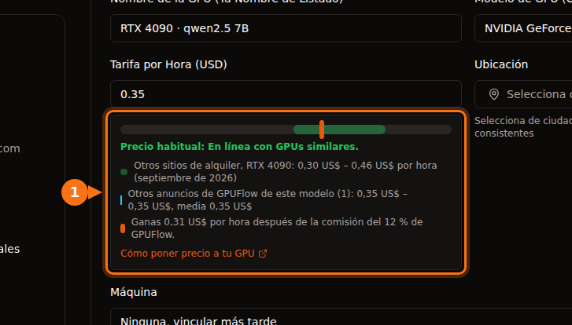

En septiembre de 2026, una H100 cuesta unos 6,90 $ la hora en AWS o Azure, 11,06 $ por GPU en Google Cloud, 3,99 $ en Lambda, entre 2,69 $ y 3,49 $ en RunPod y desde unos 1,50 $ en Vast.ai. Las tarjetas de consumo solo están en los mercados: una RTX 4090 sale por 0,31–0,34 $ la hora en la parte barata y por 0,74 $ en el nivel de centro de datos de RunPod. Para la misma H100, la hora bajo demanda más cara cuesta unas siete veces y media la más barata.

El resto del artículo explica de dónde sale cada cifra, qué incluye el precio por hora y lo que cuestan de principio a fin tres trabajos típicos. Todos los precios son bajo demanda salvo que se indique otra cosa, en regiones de EE. UU. (us-east-1 en AWS, East US en Azure, us-central1 en Google Cloud), con Linux, y comprobados en septiembre de 2026. Los precios cambian cada mes, así que tómalos como una foto fija y revisa la fuente antes de gastar dinero.

## Los precios de un vistazo

GPU de centro de datos, dólares por GPU y hora:

| Proveedor | L4 24 GB | A10G / A10 24 GB | A100 80 GB | H100 |
| --- | --- | --- | --- | --- |
| AWS | 0,81 $ (g6.xlarge) | 1,01 $ (g5.xlarge, A10G) | 3,43 $ (solo p4de de 8 GPU) | 6,88 $ (p5.4xlarge) |
| Google Cloud | 0,71 $ (g2-standard-4) | n/d | 5,07 $ (a2-ultragpu-1g) | 11,06 $ (A3 de 8 GPU, ÷ 8) |
| Azure | n/d | 3,20 $ (NV36ads A10 v5) | 3,67 $ (NC24ads A100 v4) | 6,98 $ (NC40ads H100 v5, NVL 94 GB) |
| Lambda | n/d | n/d | 2,79 $ | 3,99 $ |
| RunPod Community / Secure | n/d / 0,49 $ | n/d | 1,39 $ / 1,59 $ | 2,69 $ / 3,49 $ |
| Vast.ai | desde unos 0,27 $ | n/d | desde unos 0,43 $ | desde unos 1,47 $ |

n/d significa que no encontramos ninguna opción equivalente de una sola GPU en la lista de precios de ese proveedor. Tarjetas de consumo, dólares por hora:

| GPU | Vast.ai (oferta más barata) | RunPod Community / Secure | Rango habitual en sitios de alquiler |
| --- | --- | --- | --- |
| RTX 3090 24 GB | 0,11 – 0,13 $ | 0,22 $ / 0,50 $ | 0,11 – 0,31 $ |
| RTX 4090 24 GB | 0,31 – 0,33 $ | 0,34 $ / 0,74 $ | 0,30 – 0,46 $ |
| RTX 5090 32 GB | 0,41 – 0,47 $ | 0,69 $ / 0,99 $ | 0,41 – 0,69 $ |

AWS, Google Cloud, Azure y Lambda no ofrecen tarjetas RTX de consumo. Las cifras de Vast.ai son rangos porque dos capturas de getdeploying.com del mismo día daban mínimos algo distintos, lo que ya dice algo de los precios de un mercado. La última columna es el rango que la [guía de precios para proveedores de GPUFlow](https://docs.gpuflow.app/es/providers/pricing/) recopiló en Vast.ai, RunPod, Salad, SimplePod, TensorDock, Hyperstack y Lambda en septiembre de 2026.

## Qué incluye el precio por hora

Estas cifras no corresponden exactamente al mismo producto, y eso pesa más que el segundo decimal.

Una instancia de un hiperescalador incluye mucho más que la GPU. La p5.4xlarge de AWS trae 16 vCPU, 256 GiB de RAM y 3,84 TB de NVMe local. La NC24ads A100 v4 de Azure tiene 24 vCPU y 220 GiB de RAM. El tamaño de A10 completa de Azure, NV36ads A10 v5, tiene 36 vCPU, 440 GiB de RAM y una licencia GRID para estaciones de trabajo virtuales, lo que explica en parte que cueste el triple de lo que cobra AWS por una tarjeta parecida. Si solo necesitas la GPU, pagas todo eso igualmente.

Algunas GPU solo vienen en máquinas grandes. En AWS, la A100 de 80 GB se vende como p4de.24xlarge: ocho GPU, 27,45 $ la hora, sin tamaño más pequeño. La máquina A3 High con H100 de Google Cloud de nuestra tabla es la a3-highgpu-8g de 8 GPU, a 88,49 $ la hora. La lista de precios de Lambda muestra un precio por GPU, pero las especificaciones que pone junto a la H100 (208 vCPU, 1.800 GiB de RAM) describen un sistema de varias GPU, así que comprueba qué tamaños hay disponibles de verdad antes de hacer planes con 3,99 $.

En los mercados, el precio lo pone el dueño de la máquina. En Vast.ai cada host fija su tarifa, y el almacenamiento y el ancho de banda tienen precio aparte en cada oferta. La Community Cloud de RunPod conecta proveedores independientes; su Secure Cloud funciona en centros de datos Tier 3 y Tier 4. La misma RTX 4090 cuesta 0,34 $ en la primera y 0,74 $ en la segunda.

Lo que el precio por hora deja fuera (disco, transferencia de datos, tiempo de preparación, tiempo ocioso) se trata en [el coste real de alquilar una GPU](/es/hidden-fees-in-gpu-rental/). En un trabajo pequeño, esos extras pueden superar el tiempo de GPU.

## Precios de la H100, uno al lado del otro

<figure>
<svg viewBox="0 0 720 380" role="img" aria-labelledby="d1-title" xmlns="http://www.w3.org/2000/svg" font-family="system-ui, sans-serif" font-size="15">
<title id="d1-title">Gráfico de barras con los precios bajo demanda de la H100 por GPU y hora en septiembre de 2026, desde 11,06 dólares en Google Cloud hasta 1,47 dólares en Vast.ai</title>
<rect x="0" y="0" width="720" height="380" fill="#ffffff"/>
<text x="20" y="28" fill="#1e1b4b" font-weight="600">Una H100, bajo demanda, dólares por GPU y hora</text>
<line x1="190" y1="44" x2="190" y2="316" stroke="#e2e8f0" stroke-width="1"/>
<text x="190" y="336" text-anchor="middle" fill="#64748b" font-size="13">0 $</text>
<line x1="270" y1="44" x2="270" y2="316" stroke="#e2e8f0" stroke-width="1"/>
<text x="270" y="336" text-anchor="middle" fill="#64748b" font-size="13">2 $</text>
<line x1="350" y1="44" x2="350" y2="316" stroke="#e2e8f0" stroke-width="1"/>
<text x="350" y="336" text-anchor="middle" fill="#64748b" font-size="13">4 $</text>
<line x1="430" y1="44" x2="430" y2="316" stroke="#e2e8f0" stroke-width="1"/>
<text x="430" y="336" text-anchor="middle" fill="#64748b" font-size="13">6 $</text>
<line x1="510" y1="44" x2="510" y2="316" stroke="#e2e8f0" stroke-width="1"/>
<text x="510" y="336" text-anchor="middle" fill="#64748b" font-size="13">8 $</text>
<line x1="590" y1="44" x2="590" y2="316" stroke="#e2e8f0" stroke-width="1"/>
<text x="590" y="336" text-anchor="middle" fill="#64748b" font-size="13">10 $</text>
<line x1="670" y1="44" x2="670" y2="316" stroke="#e2e8f0" stroke-width="1"/>
<text x="670" y="336" text-anchor="middle" fill="#64748b" font-size="13">12 $</text>
<text x="180" y="69" text-anchor="end" fill="#1e1b4b">Google Cloud</text>
<rect x="190" y="50" width="442.4" height="26" rx="3" fill="#6366f1"/>
<text x="640.4" y="69" fill="#1e1b4b">11,06 $</text>
<text x="180" y="107" text-anchor="end" fill="#1e1b4b">Azure (H100 NVL)</text>
<rect x="190" y="88" width="279.2" height="26" rx="3" fill="#6366f1"/>
<text x="477.2" y="107" fill="#1e1b4b">6,98 $</text>
<text x="180" y="145" text-anchor="end" fill="#1e1b4b">AWS</text>
<rect x="190" y="126" width="275.2" height="26" rx="3" fill="#6366f1"/>
<text x="473.2" y="145" fill="#1e1b4b">6,88 $</text>
<text x="180" y="183" text-anchor="end" fill="#1e1b4b">Lambda</text>
<rect x="190" y="164" width="159.6" height="26" rx="3" fill="#16a34a"/>
<text x="357.6" y="183" fill="#1e1b4b">3,99 $</text>
<text x="180" y="221" text-anchor="end" fill="#1e1b4b">RunPod Secure</text>
<rect x="190" y="202" width="139.6" height="26" rx="3" fill="#16a34a"/>
<text x="337.6" y="221" fill="#1e1b4b">3,49 $</text>
<text x="180" y="259" text-anchor="end" fill="#1e1b4b">RunPod Community</text>
<rect x="190" y="240" width="107.6" height="26" rx="3" fill="#16a34a"/>
<text x="305.6" y="259" fill="#1e1b4b">2,69 $</text>
<text x="180" y="297" text-anchor="end" fill="#1e1b4b">Vast.ai (mín.)</text>
<rect x="190" y="278" width="58.8" height="26" rx="3" fill="#16a34a"/>
<text x="256.8" y="297" fill="#1e1b4b">1,47 $</text>
<line x1="190" y1="44" x2="190" y2="316" stroke="#64748b" stroke-width="1.5"/>
<rect x="190" y="352" width="14" height="14" fill="#6366f1"/>
<text x="212" y="364" fill="#64748b" font-size="13">Hiperescaladores</text>
<rect x="360" y="352" width="14" height="14" fill="#16a34a"/>
<text x="382" y="364" fill="#64748b" font-size="13">Nubes de GPU y mercados</text>
</svg>
<figcaption>Precios bajo demanda de la H100 para una GPU, septiembre de 2026. El precio de Google Cloud es el de su máquina A3 de 8 GPU dividido entre 8. El tamaño de una sola GPU de Azure usa la H100 NVL de 94 GB. Vast.ai es la oferta más barata que publicó getdeploying.com ese día.</figcaption>
</figure>

El gráfico está a escala. Llaman la atención dos cosas. Las tres grandes nubes se agrupan en torno a 7 $ por GPU, con Google Cloud muy por encima para la máquina A3 de 8 GPU. Y entre AWS y la oferta más barata de Vast.ai hay más de cuatro veces de diferencia por una tarjeta que hace exactamente las mismas cuentas.

Lo que compras con el dinero de más es real: un SLA, documentación de cumplimiento normativo, el resto de tu infraestructura al lado y un contrato de soporte. Lo que pierdes en un mercado también es real: el host puede ser un operador pequeño, la fiabilidad varía de una oferta a otra y no hay SLA. Para un experimento de fin de semana, el mercado gana de calle. Para un sistema en producción regulado, muchas veces ni siquiera es una opción.

## Precios spot e interrumpibles

Todos los proveedores de esta comparativa venden capacidad sobrante más barata, con el riesgo de que te la quiten.

| Instancia | Bajo demanda | Spot | Ahorro |
| --- | --- | --- | --- |
| AWS g6.xlarge (1× L4) | 0,805 $ | 0,605 $ | 25 % |
| AWS g5.xlarge (1× A10G) | 1,006 $ | 0,469 $ | 53 % |
| AWS p5.4xlarge (1× H100) | 6,88 $ | 2,623 $ | 62 % |
| Google Cloud g2-standard-4 (1× L4) | 0,707 $ | 0,403 $ | 43 % |
| Google Cloud a3-highgpu-8g (8× H100) | 88,49 $ | 41,60 $ | 53 % |
| Azure NC24ads A100 v4 (1× A100 80 GB) | 3,673 $ | 0,679 $ | 82 % |
| Azure NC40ads H100 v5 (1× H100 NVL) | 6,98 $ | 1,29 $ | 82 % |

Los precios spot de Azure salen de su API de precios minoristas, donde las tarifas spot de la A100 y la H100 entraron en vigor en julio y agosto de 2026. La tarifa spot de la H100 quedaba por debajo de la oferta bajo demanda de H100 más barata que encontramos en los mercados. Los precios spot cambian a menudo y la disponibilidad no está garantizada, así que tómalo como una foto fija.

En Vast.ai, las instancias interrumpibles son «a menudo un 50 % o más baratas que las bajo demanda», según su documentación; getdeploying.com mostraba ofertas interrumpibles de RTX 3090 desde 0,08 $. El spot solo ahorra dinero si tu trabajo guarda checkpoints y puede seguir donde se quedó. Si no, una interrupción significa pagar dos veces las mismas horas.

## Dónde encaja GPUFlow

GPUFlow también es un mercado, pero alquila algo más acotado. Los proveedores ejecutan modelos de IA (normalmente con Ollama) en sus propias máquinas Linux, y tú alquilas una de esas GPU por horas para obtener una clave API compatible con OpenAI (URL base `https://gpuflow.app/v1`, con `/v1/chat/completions` y `/v1/models`). No hay SSH, ni shell, ni acceso a archivos, así que no puedes entrenar, hacer fine-tuning ni ejecutar tu propio código. Para llamar a un modelo abierto desde un script o una aplicación, te ahorras toda la preparación: el modelo ya está instalado en la máquina del proveedor.

GPUFlow no fija precios, así que no hay un precio de GPUFlow que poner en las tablas. Así funcionan los precios:

- Cada proveedor fija un precio por hora en dólares estadounidenses para su oferta. Al hacerlo, el formulario le muestra dónde queda frente al rango de otros sitios de alquiler y cuánto ganará después de la comisión.
- Contratas horas enteras, de 1 a 168 por defecto. El importe completo contratado se reserva de tus créditos al empezar el alquiler.
- Pagas por segundo, con un mínimo de 1 minuto, redondeado al céntimo superior ([facturación por segundo o por hora](/es/per-second-vs-hourly-gpu-billing/) hace las cuentas). Cuando terminas antes o se acaba el tiempo, la parte no usada de la reserva vuelve directamente a tus créditos.
- Si la máquina del proveedor deja de responder durante 10 minutos, el alquiler termina y solo pagas hasta la última señal de vida de la máquina.
- Los tokens se cuentan, pero no se cobran. En la factura no hay línea de disco ni de transferencia de datos, porque nunca recibes una máquina en la que guardar archivos.
- Los créditos se compran con tarjeta a través de Stripe, de 10 $ a 500 $ por recarga, sin comisión. 1 crédito equivale a 0,01 $ y los créditos no caducan. Los proveedores se quedan el 88 % de cada cargo y GPUFlow el 12 %.

Para una comparativa más larga entre alquilar una clave API y alquilar un contenedor, consulta [GPUFlow vs Vast.ai vs RunPod vs SaladCloud](/es/gpuflow-vs-vast-ai-vs-runpod/). Si estás comparando precios de GPU por horas con APIs por token, [las cuentas están aquí](/es/hourly-gpu-vs-per-token-api/).

## Ejemplo 1: un trabajo por lotes de 3 horas en una tarjeta de 24 GB

Supón que quieres pasar un modelo abierto de 7B a 8B por un montón de documentos durante unas tres horas. Cualquier tarjeta de 24 GB sirve.

| Opción | Cálculo | Coste de GPU |
| --- | --- | --- |
| Vast.ai RTX 4090 | 3 × 0,31 $ | 0,93 $ |
| RunPod Community RTX 4090 | 3 × 0,34 $ | 1,02 $ |
| Google Cloud L4 (g2-standard-4) | 3 × 0,707 $ | 2,12 $ |
| RunPod Secure RTX 4090 | 3 × 0,74 $ | 2,22 $ |
| AWS L4 (g6.xlarge) | 3 × 0,805 $ | 2,42 $ |
| AWS A10G (g5.xlarge) | 3 × 1,006 $ | 3,02 $ |

En todas estas opciones pagas además la preparación: instalar un servidor de inferencia y descargar el modelo en tiempo facturado. Veinte minutos de eso suman 0,10 $ en la tarjeta de Vast.ai y 0,27 $ en la L4 de AWS.

En GPUFlow, toma como ejemplo una oferta de 0,35 $ la hora (es el precio de nuestra captura, no una cotización). Contratas 3 horas, así que se reservan 1,05 $. El trabajo termina a las 2 horas y 10 minutos (7.800 segundos) y terminas el alquiler. El cargo es 7.800 × 35 ÷ 3.600 = 75,8 céntimos, redondeado a 0,76 $, y 0,29 $ vuelven a tus créditos. Esto solo funciona si algún proveedor ejecuta el modelo que quieres.

## Ejemplo 2: 8 horas de fine-tuning en una A100 de 80 GB

El fine-tuning necesita una máquina que controles tú, así que aquí GPUFlow queda fuera.

| Opción | Cálculo | Coste |
| --- | --- | --- |
| Vast.ai, oferta de A100 más barata | 8 × 0,43 $ | 3,44 $ |
| RunPod Community A100 SXM | 8 × 1,39 $ | 11,12 $ |
| RunPod Secure A100 SXM | 8 × 1,59 $ | 12,72 $ |
| Lambda A100 SXM 80 GB | 8 × 2,79 $ | 22,32 $ |
| Azure NC24ads A100 v4 | 8 × 3,673 $ | 29,38 $ |
| Google Cloud a2-ultragpu-1g | 8 × 5,069 $ | 40,55 $ |
| AWS p4de.24xlarge (8 GPU) | 8 × 27,45 $ | 219,60 $ |

La línea de Vast.ai es la oferta de A100 más barata que publicó getdeploying.com (una tarjeta SXM en una máquina de 2 GPU; no se indicaba la memoria), así que revisa la oferta antes de contar con ese precio. La línea de AWS no es una errata: si necesitas una A100 de 80 GB en AWS, alquilas ocho. La línea de Lambda da por hecho un tamaño que se pueda conseguir de verdad; mira la nota de arriba.

Si tu bucle de entrenamiento guarda checkpoints cada 15 a 30 minutos, el precio spot de Azure, 0,679 $ la hora, deja ese trabajo en 5,43 $, pero solo si consigues la capacidad.

## Ejemplo 3: una L4 sirviendo las 24 horas

Un pequeño endpoint de inferencia funcionando durante un mes de 720 horas:

| Opción | Cálculo | Al mes |
| --- | --- | --- |
| Vast.ai L4, oferta más barata | 720 × 0,27 $ | 194,40 $ |
| RunPod Secure L4 | 720 × 0,49 $ | 352,80 $ |
| AWS g6.xlarge, reservada a 1 año | 720 × 0,524 $ | 377,28 $ |
| Google Cloud g2-standard-4 | 720 × 0,707 $ | 509,04 $ |
| AWS g6.xlarge, bajo demanda | 720 × 0,805 $ | 579,60 $ |

Con esta duración, los descuentos por compromiso empiezan a contar: la tarifa reservada a 1 año de AWS para la misma instancia está un 35 % por debajo de la bajo demanda. El mercado sigue siendo lo más barato, pero un único host es un único punto de fallo. Si el endpoint tiene usuarios, probablemente quieras dos máquinas, lo que duplica la línea del mercado y hace la diferencia menor de lo que parece.

## Cómo elegiría yo

Para experimentos, generación de imágenes, entrenamiento de LoRA y cualquier cosa que puedas reiniciar: una RTX 3090 o 4090 en un mercado. La parte barata va de 0,11 $ a 0,34 $ la hora, y nada en las grandes nubes se le acerca.

Para un modelo grande que necesita una A100 o una H100 y no está regulado: primero RunPod o Lambda, y Vast.ai si estás dispuesto a revisar la puntuación de fiabilidad de cada host. Mira los precios spot de Azure y Google Cloud antes de decidir; en septiembre de 2026 eran sorprendentemente competitivos.

Para datos regulados, una empresa que ya funciona sobre AWS, Azure o Google Cloud, o cualquier cosa que necesite un SLA: quédate en tu nube y compra compromisos o capacidad spot para bajar el precio. Pagar 7 $ la hora por una H100 suele salir más barato que una revisión de seguridad de un proveedor nuevo.

Para llamar a un modelo abierto desde código sin mantener un servidor: una API. O bien una API por token, si alguna aloja el modelo que quieres, o bien un alquiler por horas en GPUFlow, si quieres un precio fijo por hora con el modelo de un proveedor concreto. [Qué necesitas para alquilar una GPU](/es/what-you-need-to-rent-a-gpu/) explica la parte de la cuenta.

## Fuentes

- AWS: [precios bajo demanda de EC2](https://aws.amazon.com/ec2/pricing/on-demand/), [instancias P5](https://aws.amazon.com/ec2/instance-types/p5/), [instancias P4](https://aws.amazon.com/ec2/instance-types/p4/). Precios por hora tomados de la copia de la lista de precios de AWS de Vantage: [g6.xlarge](https://instances.vantage.sh/aws/ec2/g6.xlarge?region=us-east-1), [g5.xlarge](https://instances.vantage.sh/aws/ec2/g5.xlarge?region=us-east-1), [p5.4xlarge](https://instances.vantage.sh/aws/ec2/p5.4xlarge?region=us-east-1), [p5.48xlarge](https://instances.vantage.sh/aws/ec2/p5.48xlarge?region=us-east-1), [p4de.24xlarge](https://instances.vantage.sh/aws/ec2/p4de.24xlarge?region=us-east-1)
- Google Cloud: [precios de las VM optimizadas para aceleradores](https://cloud.google.com/products/compute/pricing/accelerator-optimized), [precios de las instancias de VM](https://cloud.google.com/compute/vm-instance-pricing)
- Azure: [precios de las VM Linux](https://azure.microsoft.com/en-us/pricing/details/virtual-machines/linux/), [API de precios minoristas de Azure](https://prices.azure.com/api/retail/prices), tamaños: [NC A100 v4](https://learn.microsoft.com/en-us/azure/virtual-machines/sizes/gpu-accelerated/nca100v4-series), [NCads H100 v5](https://learn.microsoft.com/en-us/azure/virtual-machines/sizes/gpu-accelerated/ncadsh100v5-series), [NVads A10 v5](https://learn.microsoft.com/en-us/azure/virtual-machines/sizes/gpu-accelerated/nvadsa10v5-series)
- Lambda: [precios](https://lambda.ai/pricing)
- RunPod: [precios](https://www.runpod.io/pricing), [RTX 3090](https://www.runpod.io/gpu-models/rtx-3090), [RTX 4090](https://www.runpod.io/gpu-models/rtx-4090), [RTX 5090](https://www.runpod.io/gpu-models/rtx-5090), [A100 SXM](https://www.runpod.io/gpu-models/a100-sxm), [H100 SXM](https://www.runpod.io/gpu-models/h100-sxm), [descripción general de los pods](https://docs.runpod.io/pods/overview)
- Vast.ai: [documentación de precios](https://docs.vast.ai/guides/instances/pricing.md). Precios de mercado de getdeploying.com: [Vast.ai](https://getdeploying.com/vast-ai), [RTX 3090](https://getdeploying.com/reference/cloud-gpu/nvidia-rtx-3090), [RTX 4090](https://getdeploying.com/reference/cloud-gpu/nvidia-rtx-4090), [RTX 5090](https://getdeploying.com/reference/cloud-gpu/nvidia-rtx-5090), [A100](https://getdeploying.com/reference/cloud-gpu/nvidia-a100), [H100](https://getdeploying.com/reference/cloud-gpu/nvidia-h100)
- GPUFlow: [cómo poner precio a tu GPU](https://docs.gpuflow.app/es/providers/pricing/), [facturación](https://docs.gpuflow.app/es/renters/billing/), [guía rápida de la API](https://docs.gpuflow.app/es/renters/api-quickstart/), [mercado](https://gpuflow.app/es/marketplace)

Todas revisadas en septiembre de 2026.
