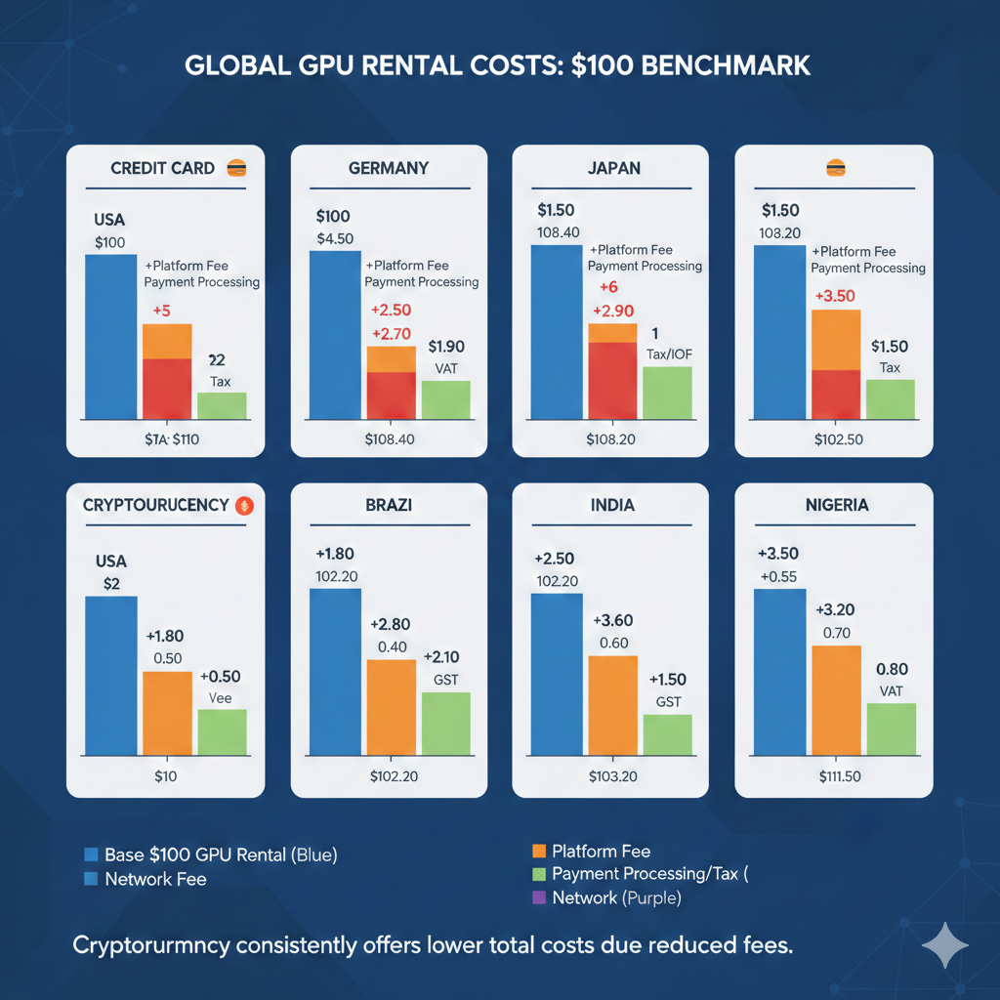
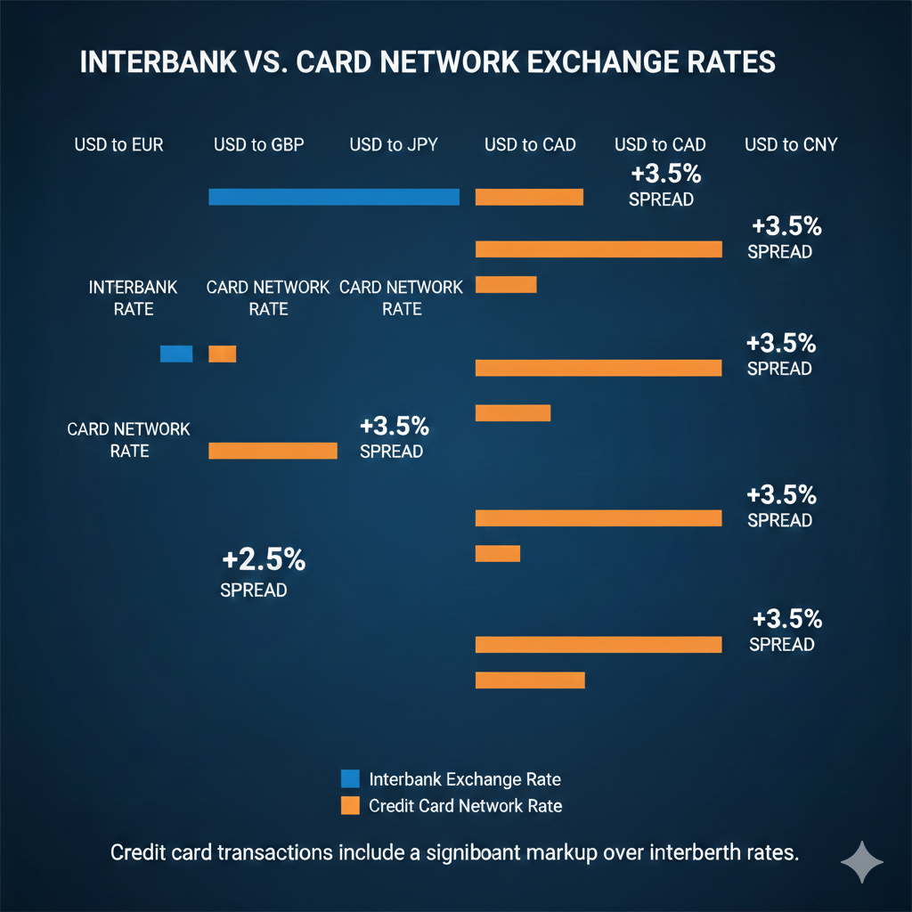
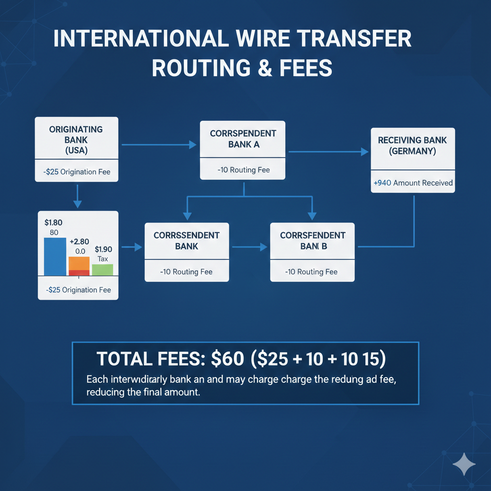
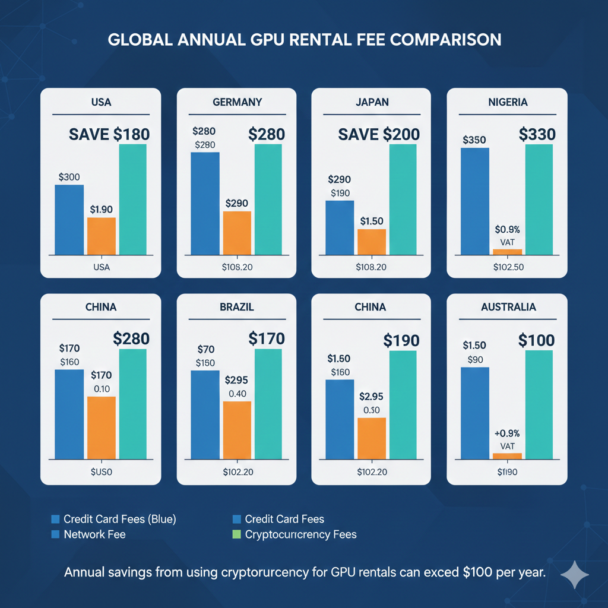
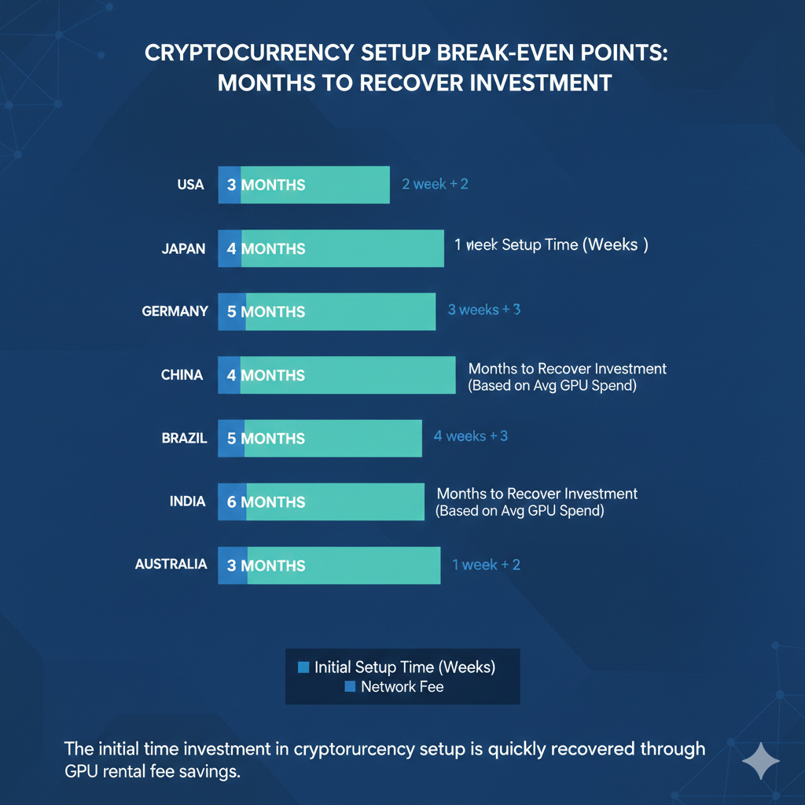
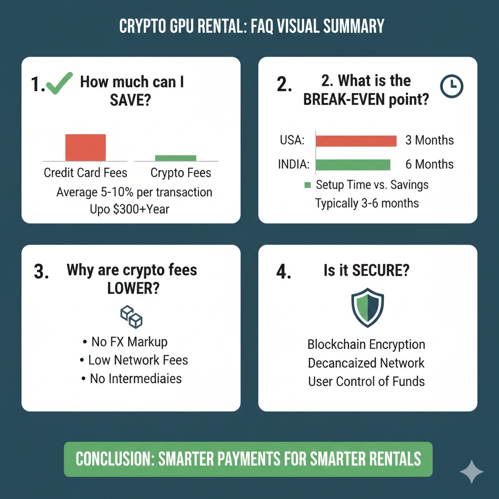

# Tarifas Ocultas en el Alquiler de GPU: Cómo los Pagos con Criptomonedas Ahorran Dinero a los Usuarios Internacionales

Un desarrollador en São Paulo y un desarrollador en San Francisco ambos alquilan la misma RTX 4090 por las mismas diez horas al mismo precio listado de $0.60 por hora. El desarrollador de San Francisco paga $6.00. El desarrollador de São Paulo paga $6.00 más un impuesto IOF del 6.38% sobre transacciones internacionales con tarjeta de crédito, más un margen de conversión de divisas del 2-4% de BRL a USD, más cualquier recargo que su banco aplique al tipo de cambio de Visa/Mastercard. Costo final: aproximadamente $6.55-6.70. Durante un año de uso regular de GPU, esas tarifas ocultas suman un porcentaje significativo del gasto total en computación.

Este artículo desglosa exactamente lo que realmente cuesta el alquiler de GPU desde diferentes países cuando consideras cada tarifa entre tu cuenta bancaria y los ingresos del proveedor de GPU. Luego muestra el mismo cálculo usando criptomonedas en la red Polygon, donde el costo total de transacción es $0.03 independientemente de si estás en Lagos, Tokio o Buenos Aires. Los ahorros no son teóricos. Son específicos, calculables y en algunos países lo suficientemente sustanciales como para financiar horas adicionales de GPU cada mes.

""Para una guía completa del proceso de pago con criptomonedas en sí—incluyendo configuración de wallet, escrow de contratos inteligentes y guías específicas de plataformas—consulta nuestra [Guía Completa para Alquilar GPUs con Criptomonedas](../es/rent-gpu-with-crypto.md).""

---

## El Costo Real de un Alquiler de GPU de $100 desde Seis Países Diferentes

Entender los costos de pagos internacionales requiere examinar la pila completa de tarifas. Cada transacción transfronteriza pasa por múltiples intermediarios, cada uno extrayendo un porcentaje o tarifa fija. Estos costos a menudo son invisibles—enterrados en tipos de cambio, listados como partidas separadas que los usuarios pasan de largo, o simplemente deducidos antes de que el dinero llegue a tu cuenta.

Los siguientes cálculos muestran el costo real de un depósito de alquiler de GPU de $100 (aproximadamente 150-200 horas de tiempo de RTX 3090) desde seis países que representan diferentes regiones y sistemas bancarios. Todos los cálculos usan tipos de cambio de febrero de 2026 y estructuras de tarifas actuales de los principales procesadores de pago y bancos.

### Brasil: El Impuesto IOF del que Nadie te Advierte

**Escenario:** Desarrollador en São Paulo alquila GPUs en RunPod usando tarjeta de crédito Nubank

**Costo de GPU listado:** $100.00 USD

**Desglose de tarifas:**

1. **IOF (Imposto sobre Operações Financeiras):** 6.38%
   - Este impuesto federal aplica a todas las transacciones internacionales con tarjeta de crédito
   - Se cobra sobre el monto de la transacción
   - No negociable, no exonerable
   - **Costo: $6.38**

2. **Margen de conversión de divisas (BRL → USD):** 2.5-4%
   - Tipo de cambio oficial: 4.95 BRL/USD (ejemplo)
   - El banco aplica: 5.10-5.15 BRL/USD
   - El margen representa la ganancia del banco en el cambio
   - **Costo: $2.50-4.00**

3. **Tarifa por transacción internacional:** 3.1%
   - Tarifa de red Visa/Mastercard
   - Cobrada por el emisor de la tarjeta
   - Listada por separado en el estado de cuenta
   - **Costo: $3.10**

**Tarifas totales: $12.00-13.50**  
**Costo real para el desarrollador brasileño: $112.00-113.50**  
**Recargo efectivo: 12-13.5%**

Para un desarrollador que alquila $1,000 en tiempo de GPU mensualmente, estas tarifas cuestan $120-135 adicionales por mes—suficiente para financiar 20-25 horas adicionales de tiempo de RTX 4090.

**Alternativa con criptomonedas:**

- Comprar $100 USDC en Mercado Bitcoin (tarifa 0.5%): $0.50
- Transferir USDC a wallet de Polygon (tarifa de red): $0.02
- Depositar en GPUFlow (sin conversión necesaria): $0.00
- **Costo total: $100.52**
- **Ahorro: $11.50-13.00 (11.5-13%)**

"[Nuestra Guía Completa para Alquilar GPUs con Criptomonedas](../es/rent-gpu-with-crypto) explica el escrow de contratos inteligentes en detalle—el mecanismo que protege tanto tu pago como garantiza el acceso a la GPU."

### India: Tarifas por Transacciones Extranjeras en Cada Compra

**Escenario:** Ingeniero de ML en Bangalore alquila GPUs usando tarjeta de crédito HDFC Bank

**Costo de GPU listado:** $100.00 USD

**Desglose de tarifas:**

1. **Recargo por transacción extranjera:** 3.5%
   - Aplicado por HDFC y la mayoría de los bancos indios
   - A veces dividido entre tarifa del banco y tarifa de red
   - **Costo: $3.50**

2. **Conversión de divisas (INR → USD):** 1.5-2.5%
   - Tasa interbancaria: 83.20 INR/USD (ejemplo)
   - Tasa aplicada: 84.50-85.30 INR/USD
   - La diferencia es ganancia del banco
   - **Costo: $1.50-2.50**

3. **GST sobre transacciones extranjeras:** 18% de las tarifas
   - Aplicado a la tarifa por transacción extranjera misma
   - Impuesto sobre una tarifa (sí, en serio)
   - **Costo: $0.63 (18% de $3.50)**

**Tarifas totales: $5.63-6.63**  
**Costo real para el desarrollador indio: $105.63-106.63**  
**Recargo efectivo: 5.6-6.6%**

Muchos desarrolladores indios desconocen el componente de GST porque aparece como una partida de impuesto separada en lugar de estar integrado en el cargo de alquiler de GPU. Durante un año de gasto mensual de $500 en GPU, estas tarifas totalizan $337-398.

**Alternativa con criptomonedas:**

- Comprar $100 USDC en WazirX (tarifa 0.2%): $0.20
- Transferir a wallet de Polygon (tarifa de red): $0.02
- Depositar en plataforma de GPU: $0.00
- **Costo total: $100.22**
- **Ahorro: $5.41-6.41 (5.4-6.4%)**

Las regulaciones indias restringen el uso de criptomonedas, pero comprar y mantener cripto sigue siendo legal. Usar criptomonedas para pagos de servicios internacionales evita completamente la categoría de tarifas por transacciones extranjeras mientras permanece en cumplimiento con las directrices actuales del RBI.

### Nigeria: Pesadilla de Transferencias Bancarias

**Escenario:** Desarrollador en Lagos intentando financiar alquiler de GPU vía transferencia bancaria (muchas plataformas requieren esto para usuarios nigerianos sin tarjetas de crédito internacionales)

**Costo de GPU listado:** $100.00 USD

**Desglose de tarifas:**

1. **Tarifa de transferencia bancaria internacional saliente:** $25-45
   - Cobrada por banco nigeriano
   - Tarifa fija independiente del monto
   - **Costo: $25-45**

2. **Tarifas de bancos intermediarios:** $10-25
   - Cargos de bancos corresponsales
   - A menudo deducidos del monto de la transferencia
   - No revelados hasta después de la transferencia
   - **Costo: $10-25**

3. **Margen de conversión de divisas (NGN → USD):** 3-5%
   - Tasa oficial: 815 NGN/USD (ejemplo)
   - Tasa aplicada: 840-865 NGN/USD
   - La tasa del mercado paralelo agrega complejidad
   - **Costo: $3.00-5.00**

4. **Tarifa del banco receptor (banco de la plataforma):** $15-20
   - A menudo pasada al cliente
   - A veces absorbida por la plataforma
   - **Costo: $15-20 (si se cobra)**

**Tarifas totales: $53-95**  
**Esto hace que los pequeños alquileres de GPU sean económicamente imposibles vía transferencia bancaria**

Por esta razón, los desarrolladores nigerianos ya sea:

- Usan servicios de pago internacional (TransferWise/Wise) con tarifas del 3-5%
- Dependen de tarjetas de dólar virtuales con tarifas del 4-8%
- Usan criptomonedas

**Alternativa con criptomonedas:**

- Comprar $100 USDC en Luno o Binance (tarifa 0.5%): $0.50
- Transferir a wallet de Polygon (tarifa de red): $0.02
- Depositar en plataforma de GPU: $0.00
- **Costo total: $100.52**
- **Ahorro: $52.50-94.50 (comparado con transferencia bancaria)**

Los ahorros son tan dramáticos que las criptomonedas se convierten en la opción obvia para usuarios nigerianos. Esto explica por qué los desarrolladores nigerianos representan uno de los segmentos de usuarios de más rápido crecimiento en plataformas de GPU nativas de cripto.

### Japón: El Mito de "Sin Tarifas por Transacciones Extranjeras"

**Escenario:** Desarrollador en Tokio usando tarjeta Rakuten (anuncia sin tarifas por transacciones extranjeras)

**Costo de GPU listado:** $100.00 USD

**Desglose de tarifas:**

1. **Tarifa por transacción extranjera:** 0%
   - Rakuten y algunas tarjetas japonesas exoneran esto
   - Comercializado como "amigable para compras en el extranjero"
   - **Costo: $0.00**

2. **Recargo de conversión de divisas (JPY → USD):** 1.6-2.3%
   - Visa/Mastercard aplica tasa de conversión
   - La tasa es tasa mayorista + recargo de 1.6-2.3%
   - Aquí es donde el banco gana dinero
   - No revelado como "tarifa" pero aparece en el tipo de cambio
   - **Costo: $1.60-2.30**

3. **Conversión dinámica de divisas (si se selecciona accidentalmente):** Adicional 3-5%
   - Muchos formularios de pago ofrecen "pagar en JPY"
   - Siempre rechaza esta opción
   - Agrega otra capa de conversión
   - **Costo: $3.00-5.00 si se selecciona**

**Tarifas totales: $1.60-2.30 (asumiendo rechazo apropiado de DCC)**  
**Costo real para el desarrollador japonés: $101.60-102.30**  
**Recargo efectivo: 1.6-2.3%**

Los desarrolladores japoneses pagan las tarifas internacionales más bajas entre nuestros ejemplos debido a la fuerte infraestructura bancaria y ofertas competitivas de tarjetas. Sin embargo, incluso estas tarifas "bajas" se acumulan con el tiempo.

**Alternativa con criptomonedas:**

- Comprar $100 USDC en bitFlyer (tarifa 0.15%): $0.15
- Transferir a wallet de Polygon (tarifa de red): $0.02
- Depositar en plataforma de GPU: $0.00
- **Costo total: $100.17**
- **Ahorro: $1.43-2.13 (1.4-2.1%)**

El ahorro porcentual es menor que en otros países, pero para un desarrollador que gasta $2,000 mensuales en alquiler de GPU, esto todavía representa $28-42 de ahorro mensual o $340-500 anualmente.

### Alemania: Los Límites de SEPA Fuera de Europa

**Escenario:** Ingeniero de ML freelance en Berlín usando cuenta de Deutsche Bank

**Costo de GPU listado:** $100.00 USD

**Desglose de tarifas:**

Para plataformas europeas que aceptan transferencias SEPA:

- **Costo: €0.00** (las transferencias SEPA son gratuitas dentro de la UE)
- Pero la mayoría de las plataformas de GPU están basadas en EE.UU. y requieren USD

Para pago en USD a plataforma de EE.UU.:

1. **Tarifa por transacción extranjera:** 0-1.5%
   - Muchas tarjetas alemanas tienen tarifas bajas o sin tarifas por transacciones extranjeras
   - Las regulaciones de la UE limitan tarifas excesivas
   - **Costo: $0.00-1.50**

2. **Conversión de divisas (EUR → USD):** 1-2%
   - Tasa de red Mastercard/Visa
   - Más transparente que países no UE
   - **Costo: $1.00-2.00**

3. **Transferencia bancaria internacional (si usa transferencia bancaria):** €15-25
   - Para financiamiento bancario directo en lugar de tarjeta
   - **Costo: $16-27 si aplica**

**Tarifas totales (tarjeta de crédito): $1.00-3.50**  
**Costo real para el desarrollador alemán: $101.00-103.50**  
**Recargo efectivo: 1-3.5%**

Alemania representa el mejor escenario para métodos de pago tradicionales debido a las regulaciones de protección al consumidor de la UE y la banca competitiva. Aun así, las tarifas existen.

**Alternativa con criptomonedas:**

- Comprar $100 USDC en Kraken (tarifa 0.26%): $0.26
- Transferir a wallet de Polygon (tarifa de red): $0.02
- Depositar en plataforma de GPU: $0.00
- **Costo total: $100.28**
- **Ahorro: $0.72-3.22 (0.7-3.2%)**

Los ahorros son los más pequeños para usuarios europeos, pero las criptomonedas proporcionan beneficios adicionales: sin esperar transferencias SEPA (que toman 1-2 días hábiles), sin retrasos de fines de semana/feriados, y precios consistentes independientemente del momento del pago.

### Turquía: La Volatilidad de la Moneda Agrega Costos Ocultos

**Escenario:** Desarrollador en Estambul usando tarjeta de crédito İş Bankası

**Costo de GPU listado:** $100.00 USD

**Desglose de tarifas:**

1. **Tarifa por transacción extranjera:** 2.5%
   - Estándar entre bancos turcos
   - **Costo: $2.50**

2. **Conversión de divisas (TRY → USD):** 2-4%
   - La volatilidad de la Lira Turca crea márgenes amplios
   - Los bancos incorporan prima de riesgo
   - La tasa puede cambiar entre la transacción y la facturación
   - **Costo: $2.00-4.00**

3. **Impuesto Especial de Comunicación (ÖİV):** 1% de compra extranjera
   - Impuesto turco sobre transacciones internacionales
   - Aplicado automáticamente
   - **Costo: $1.00**

4. **Impuesto al Valor Agregado (KDV):** 20% en servicios digitales
   - Técnicamente aplica al servicio, no al pago
   - Algunas plataformas lo cobran, otras no
   - Crea complejidad de cumplimiento
   - **Costo: $20.00 si se aplica**

**Tarifas totales: $5.50-7.50 (más potencial $20 de IVA)**  
**Costo real para el desarrollador turco: $105.50-127.50**  
**Recargo efectivo: 5.5-27.5% dependiendo del tratamiento del IVA**

Los desarrolladores turcos enfrentan imprevisibilidad adicional: si el alquiler de GPU se clasifica como un servicio digital sujeto a IVA, el costo efectivo aumenta dramáticamente. La volatilidad de la moneda significa que el monto en TRY cobrado puede diferir significativamente del monto esperado basado en las tasas del día de la transacción.

**Alternativa con criptomonedas:**

- Comprar $100 USDC en Binance TR (tarifa 0.1%): $0.10
- Transferir a wallet de Polygon (tarifa de red): $0.02
- Depositar en plataforma de GPU: $0.00
- **Costo total: $100.12**
- **Ahorro: $5.38-27.38 (5.4-27.4%)**

Las criptomonedas también proporcionan protección contra la depreciación de la Lira. Los fondos mantenidos en USDC mantienen el valor del dólar independientemente de los movimientos del tipo de cambio TRY/USD.

---

## Tarifas por Transacciones Extranjeras de Tarjetas de Crédito: El Impuesto del 3-5% que Quizás No Notes

Las tarifas por transacciones extranjeras de tarjetas de crédito están entre los costos menos transparentes en pagos internacionales. A diferencia de una partida etiquetada como "tarifa", estos cargos a menudo se esconden dentro de los tipos de cambio o aparecen como pequeños porcentajes que parecen insignificantes hasta que se calculan sobre el gasto total.

### Cómo Funcionan Realmente las Tarifas por Transacciones Extranjeras

Cuando usas una tarjeta de crédito para una compra en una moneda diferente a la moneda nativa de tu tarjeta, tres entidades toman una parte:

**1. Red de tarjetas (Visa/Mastercard/Amex):**

- Cobra 1% de "tarifa de evaluación internacional"
- Se aplica a todas las transacciones transfronterizas
- No negociable independientemente del emisor de la tarjeta

**2. Emisor de la tarjeta (tu banco):**

- Agrega 1-3% de tarifa por transacción extranjera
- Varía según el banco y el nivel de la tarjeta
- Las tarjetas premium a veces exoneran esto
- Las tarjetas básicas/económicas cobran el monto completo

**3. Recargo de conversión de divisas:**

- Las redes establecen tipos de cambio ligeramente peores que las tasas interbancarias
- Margen entre tasa interbancaria y tasa aplicada: 0.5-2%
- Publicitado como "conveniencia" pero realmente es ingreso
- Completamente oculto—sin partida en el estado de cuenta

**Impacto total:** 2.5-6% dependiendo de la tarjeta y el banco

### La Ofuscación del Estado de Cuenta

Esto es lo que aparece en tu estado de cuenta de tarjeta de crédito para un alquiler de GPU de $100:

```
FEB 10  RUNPOD.IO            $103.20
        TARIFA TRANS. EXTRANJ.  $3.00
```

La tarifa de $3.00 es obvia. Los $3.20 incrustados en el monto de la transacción no lo son. Esos $0.20 extra vienen del recargo de conversión de divisas—pagaste $100 a un tipo de cambio peor del que obtendrías en los mercados de divisas.

Desglosando esos $103.20:

- $100.00 = costo base de alquiler de GPU
- $2.50 = tarifa por transacción extranjera del emisor de la tarjeta (2.5%)
- $1.00 = evaluación internacional de Visa (1%)
- ~$0.70 = recargo de conversión de divisas (0.7%)
- Recargo total: $4.20, pero solo $3.00 aparece como "tarifa"

### Las Tarjetas Premium No Son Gratis

Las tarjetas de recompensas de viaje y las tarjetas de crédito premium a menudo anuncian "sin tarifas por transacciones extranjeras". Esto es parcialmente cierto y mayormente marketing.

**Lo que exoneran:**

- La tarifa del emisor de la tarjeta del 1-3%
- Hace que la estructura de tarifas sea 1-2% en lugar de 3-5%

**Lo que no exoneran:**

- Evaluación de la red de tarjetas (1%)
- Recargo de conversión de divisas (0.5-2%)
- Cuota anual ($95-550 para mantener la tarjeta)

**Cálculo de ejemplo:**

Chase Sapphire Reserve (cuota anual: $550):

- Tarifa por transacción extranjera: 0%
- Evaluación de Visa: 1%
- Recargo de conversión: ~0.7%
- **Costo total en transacción de $100: $101.70**

Tarjeta de crédito básica (cuota anual: $0):

- Tarifa por transacción extranjera: 3%
- Evaluación de Visa: 1%
- Recargo de conversión: ~0.7%
- **Costo total en transacción de $100: $104.70**

La tarjeta premium ahorra $3 por cada transacción de $100. Para justificar la cuota anual de $550 solo a través del alquiler de GPU se requieren $18,300+ de gasto anual en GPU. La mayoría de los desarrolladores individuales no alcanzan este umbral.



### La Trampa de "Pagar en Tu Moneda"

Muchos formularios de pago ofrecen "Conversión Dinámica de Divisas"—la opción de ver el cargo en tu moneda local en lugar de USD. Esto parece útil. Es costoso.

**Ejemplo:**

Un desarrollador alemán ve:

- Opción A: Pagar $100.00 USD
- Opción B: Pagar €94.50 EUR (¡lo convertimos por ti!)

Verificando los tipos de cambio reales:

- Tasa de mercado: 0.92 EUR/USD
- Conversión de mercado: $100 = €92.00
- Conversión DCC: $100 = €94.50
- **Recargo DCC: €2.50 (2.7%)**

Estos €2.50 son ganancia pura para el procesador de pagos, compartida con el comerciante. Se acumula sobre cualquier tarifa de tarjeta de crédito que ya pagas.

**Nunca selecciones "pagar en moneda local" para transacciones internacionales.** Siempre elige pagar en la moneda del comerciante (USD para plataformas de GPU basadas en EE.UU.) y deja que tu banco maneje la conversión. La tasa de conversión de tu banco, incluso con recargo, es mejor que las tasas de DCC.

### Por Qué Existen Estas Tarifas

Las tarifas por transacciones extranjeras no son requisitos técnicos. Las redes de pago modernas procesan transacciones transfronterizas a un costo marginal insignificante. Las tarifas existen porque:

1. **Generación de ingresos:** Los bancos necesitan ingresos más allá de los márgenes de tasas de interés
2. **Prima de riesgo:** Las transacciones transfronterizas tienen tasas de fraude ligeramente más altas
3. **Segmentación de mercado:** Permite a las tarjetas premium diferenciarse exonerando tarifas
4. **Arbitraje regulatorio:** Diferentes países regulan estas tarifas de manera diferente
5. **Ignorancia del cliente:** La mayoría de los clientes no calculan el impacto total de las tarifas

Las regulaciones europeas (Directiva de Servicios de Pago) limitan las tarifas por transacciones extranjeras dentro de la UE, por eso los desarrolladores alemanes en nuestro ejemplo pagan menos que los desarrolladores brasileños o indios. Las regulaciones de EE.UU. no imponen tales límites, permitiendo las tarifas estándar del 3-5%.

### El Efecto Compuesto

Las tarifas por transacciones extranjeras se componen de maneras que no son obvias desde el análisis de una sola transacción.

**Escenario:** Desarrollador gastando $500 mensuales en alquiler de GPU

Con tarifas por transacciones extranjeras del 4%:

- Costo mensual de tarifas: $20
- Costo anual de tarifas: $240
- Costo de cinco años: $1,200

Esos $1,200 podrían financiar:

- 2,000 horas de tiempo de RTX 3090 (a $0.60/hr)
- 400 horas de tiempo de A100 (a $3.00/hr)
- Aproximadamente 3 meses adicionales de acceso a GPU a la tasa de uso actual

Para un equipo de desarrollo gastando $5,000 mensuales, el costo de tarifas por transacciones extranjeras de cinco años alcanza $12,000—suficiente para contratar un desarrollador junior por un mes en muchos mercados.


---

## Márgenes de Conversión de Divisas: Lo Que Tu Banco Cobra vs. Tipos de Cambio Reales

La conversión de divisas es donde los bancos ganan dinero invisible. A diferencia de las tarifas de transacción reveladas en los estados de cuenta, los márgenes de conversión se esconden dentro de los tipos de cambio. La mayoría de los usuarios nunca notan que están pagando más que las tasas de mercado por el cambio de divisas.

### Entendiendo el Margen

Los tipos de cambio de divisas existen en capas:

**1. Tasa interbancaria (mayorista):**

- Tasa a la que los bancos comercian entre sí
- Mayores volúmenes, márgenes más estrechos
- Lo que ves en Google Finance o Bloomberg
- **No puedes acceder a esta tasa como individuo**

**2. Tasa institucional:**

- Grandes corporaciones y fondos de cobertura
- Tasa interbancaria + margen de 0.1-0.3%
- Requiere alto volumen y negociación

**3. Tasa de red de tarjetas de crédito:**

- Visa/Mastercard establecen tasas diarias
- Tasa interbancaria + margen de 0.5-1.5%
- Se aplica a tu transacción automáticamente

**4. Tasa de banco minorista:**

- El mostrador de cambio de tu banco
- Tasa interbancaria + margen de 2-5%
- Peor tasa disponible, mayor margen de ganancia

Cuando usas una tarjeta de crédito para alquiler de GPU internacional, obtienes la tasa de red (capa 3), que es mejor que ir al banco pero peor que la realidad del mercado.

### Ejemplo Trabajado: Conversión de EUR a USD

**Fecha:** 15 de febrero de 2026  
**Transacción:** Cargo de €92.00 por alquiler de GPU de $100

**Tasa interbancaria:** 0.9150 EUR/USD

- $100 / 0.9150 = €91.50 a la tasa real de mercado

**Tasa de red Visa:** 0.9280 EUR/USD

- $100 / 0.9280 = €92.78 cargados a la tarjeta

**Margen:** €92.78 - €91.50 = €1.28

- Recargo porcentual: 1.4%
- Equivalente en dólares: $1.40

Esos €1.28 son ganancia del banco. No aparecen como una tarifa. Tu estado de cuenta muestra "€92.78 = $100.00 a tasa 0.9280" y la mayoría de los usuarios asumen que ese es el tipo de cambio correcto porque no tienen punto de referencia para comparar.

### Diferencias Regionales de Márgenes

Los márgenes de conversión de divisas varían dramáticamente por país y fortaleza de la moneda:

**Moneda estable, mercado desarrollado (EUR, JPY, GBP):**

- Margen típico: 0.7-1.5%
- Alta liquidez, bajo riesgo
- Mercados bancarios competitivos

**Mercado emergente, moneda volátil (TRY, NGN, ARS):**

- Margen típico: 2-5%
- Menor liquidez, mayor riesgo
- Los bancos incorporan prima de volatilidad
- Las tasas del mercado paralelo complican los precios oficiales

**Comparación de ejemplo para alquiler de GPU de $100:**

| Moneda | Interbancaria | Tasa de Red | Margen | Costo |
| ------ | ------------- | ----------- | ------ | ----- |
| EUR    | 0.9150        | 0.9280      | 1.4%   | $1.40 |
| JPY    | 148.50        | 150.30      | 1.2%   | $1.20 |
| INR    | 83.20         | 84.85       | 2.0%   | $2.00 |
| BRL    | 4.95          | 5.12        | 3.4%   | $3.40 |
| TRY    | 32.15         | 33.45       | 4.0%   | $4.00 |
| NGN    | 815           | 848         | 4.0%   | $4.00 |

Los desarrolladores en países con monedas volátiles pagan el doble o triple del margen de conversión comparado con desarrolladores en regiones de moneda estable.

### Recargos de Fines de Semana y Feriados

Los mercados de divisas cierran los fines de semana y feriados. Los bancos no.

Cuando haces una transacción de alquiler de GPU el sábado:

- Los mercados de forex están cerrados
- Los bancos aplican la tasa de cierre del viernes
- **Más un recargo adicional del 1-3% por fin de semana**
- Justificado como "prima de riesgo por incertidumbre de la tasa"
- En realidad, ganancia pura

**Ejemplo:**

Tasa de cierre del viernes: 0.9200 EUR/USD  
Tasa aplicada de transacción del sábado: 0.9450 EUR/USD  
Recargo de fin de semana: 2.7%

Para un alquiler de GPU de $100 el sábado:

- Costo base de conversión: $1.30 (asumiendo margen normal de 1.3%)
- Recargo de fin de semana: $2.70
- **Costo total de conversión: $4.00**

Evita las transacciones internacionales los fines de semana si usas tarjetas de crédito. Espera hasta el lunes cuando los mercados de forex reabren y los recargos de fin de semana desaparecen.

### La Mentira de la Tasa "En Tiempo Real"

Los procesadores de pago anuncian "tipos de cambio en tiempo real" para crear la impresión de conversión justa. Esto es técnicamente cierto y prácticamente engañoso.

"En tiempo real" significa:

- La tasa es actual al momento de la transacción
- La tasa se actualiza basándose en movimientos del mercado
- **No significa que la tasa es la tasa de mercado**

La tasa es en tiempo real pero incluye el recargo del 0.7-2% mencionado anteriormente. Se mueve en sincronía con las tasas interbancarias mientras mantiene un margen constante.

Piénsalo como un auto siguiendo a otro auto a una distancia fija. El auto que sigue se mueve "en tiempo real" relativo al auto líder, pero nunca lo alcanza. Esa brecha es ganancia del banco.

### Las Criptomonedas Eliminan la Conversión Completamente

Las criptomonedas no resuelven la conversión de divisas ofreciendo mejores tasas. La resuelven eliminando la conversión completamente.

**Flujo de pago tradicional:**

1. Tienes EUR en cuenta bancaria
2. El banco convierte EUR → USD (toma margen de 1-4%)
3. El procesador de pagos convierte USD → cuenta de la plataforma (toma 0.5-1%)
4. El proveedor de GPU recibe USD

**Flujo de pago con criptomonedas:**

1. Tienes USDC en wallet (ya denominado en equivalente a USD)
2. Transfiere USDC a la plataforma (tarifa de red de $0.02)
3. El proveedor de GPU recibe USDC (puede convertir a USD si lo desea, o mantener USDC)

**Costo total de conversión: tarifa de red de $0.02 vs. $1-5 en márgenes tradicionales**

La idea clave: las stablecoins como USDC están denominadas en dólares. Mantener $100 USDC es económicamente equivalente a mantener $100 USD. No ocurre conversión porque ambos lados de la transacción usan la misma unidad de cuenta.

### Ejercicio de Verificación: Verifica Tu Propia Tasa de Conversión

La mayoría de los desarrolladores nunca han calculado lo que su banco realmente cobró por conversión de divisas. Aquí está cómo verificar:

**Paso 1:** Encuentra una transacción internacional en tu estado de cuenta de tarjeta de crédito

**Paso 2:** Anota el monto en tu moneda y el monto en moneda del comerciante

Ejemplo: El estado de cuenta muestra "€92.78 = $100.00"

**Paso 3:** Calcula el tipo de cambio aplicado

Tasa aplicada = Tu moneda / Moneda del comerciante  
Tasa aplicada = €92.78 / $100.00 = 0.9278 EUR/USD

**Paso 4:** Busca la tasa interbancaria para la fecha de la transacción

Busca en Google "EUR USD tasa histórica [fecha]" o usa xe.com  
Tasa interbancaria en esa fecha: 0.9150 EUR/USD

**Paso 5:** Calcula el margen

Margen = (Tasa aplicada - Tasa interbancaria) / Tasa interbancaria  
Margen = (0.9278 - 0.9150) / 0.9150 = 1.4%

**Paso 6:** Calcula el costo en dólares

Costo = Margen × Monto de la transacción  
Costo = 1.4% × $100 = $1.40

Repite esto para varias transacciones para ver el margen promedio de tu banco. La mayoría de los usuarios descubren que están pagando 1-3% en cada transacción internacional sin darse cuenta.



---

## Transferencias Bancarias y ACH: Por Qué los Pagos Bancarios Cuestan Más de lo que Piensas

Las tarjetas de crédito son caras para pagos internacionales, pero las transferencias bancarias pueden ser peores. Muchas plataformas de alquiler de GPU aceptan transferencias bancarias para usuarios sin tarjetas de crédito internacionales o para grandes depósitos prepagados. Las estructuras de tarifas hacen que las transacciones pequeñas sean económicamente irracionales.

### Anatomía de una Transferencia Bancaria Internacional

Cuando envías dinero desde tu banco a una plataforma de GPU basada en EE.UU., la transferencia pasa por múltiples instituciones:

**1. Tu banco (banco originador):**

- Cobra tarifa de transferencia saliente: $15-50
- Aplica conversión de divisas (si no envía USD)
- Puede cobrar "tarifa de manejo" o "tarifa de procesamiento"

**2. Banco(s) corresponsal(es):**

- Bancos intermediarios que facilitan transferencias transfronterizas
- Cada corresponsal cobra $10-25
- Número de corresponsales: 1-3 dependiendo del enrutamiento
- Las tarifas se deducen del monto de la transferencia (envías $100, reciben $75)

**3. Banco receptor (banco de la plataforma):**

- Cobra tarifa de transferencia entrante: $10-25
- Puede ser pasada al cliente o absorbida por la plataforma
- A menudo no se revela hasta después de la transferencia

**4. Red SWIFT:**

- Tarifa de mensaje: $0.05-0.20 por transferencia
- Insignificante comparado con las tarifas bancarias
- La única tarifa que refleja el costo real de mover información

**Gastos totales de transferencia bancaria:** $35-100+ dependiendo del enrutamiento

### Las Transferencias Pequeñas Son Económicamente Imposibles

Las tarifas de transferencia bancaria son en gran parte fijas independientemente del monto. Esto crea una economía devastadora para pequeños depósitos de alquiler de GPU.

**Depósito de alquiler de GPU de $50 vía transferencia bancaria:**

| Componente de Tarifa          | Monto                          |
| ----------------------------- | ------------------------------ |
| Tarifa del banco originador   | $25                            |
| Tarifa del banco corresponsal | $15                            |
| Conversión de divisas (3%)    | $1.50                          |
| **Tarifas totales**           | **$41.50**                     |
| **Costo efectivo**            | **$91.50 por depósito de $50** |
| **Porcentaje de tarifas**     | **83%**                        |

Con 83% de tarifas, pagas $91.50 para depositar $50. Este no es un caso extremo—representa la realidad para desarrolladores en países donde las tarjetas de crédito no están disponibles o están restringidas para uso internacional.

**Depósito de alquiler de GPU de $500 vía transferencia bancaria:**

| Componente de Tarifa          | Monto                         |
| ----------------------------- | ----------------------------- |
| Tarifa del banco originador   | $25                           |
| Tarifa del banco corresponsal | $15                           |
| Conversión de divisas (3%)    | $15.00                        |
| **Tarifas totales**           | **$55.00**                    |
| **Costo efectivo**            | **$555 por depósito de $500** |
| **Porcentaje de tarifas**     | **11%**                       |

A $500, el porcentaje de tarifas baja a 11%—todavía alto pero potencialmente aceptable para usuarios sin alternativas.

**Análisis de punto de equilibrio:** Las transferencias bancarias solo se vuelven competitivas en costo con las tarjetas de crédito aproximadamente a tamaños de transacción de $1,500+, donde las tarifas fijas se distribuyen sobre una base más grande.

### El Problema del Banco Corresponsal

La banca corresponsal agrega costos impredecibles porque no puedes controlar el enrutamiento. Tu banco puede usar un corresponsal; el próximo mes podría usar dos. Las tarifas se deducen silenciosamente.

**Escenario de ejemplo:**

Desarrollador en Kenia envía $200 para financiar alquiler de GPU:

- Envía: $200 desde Equity Bank Kenya
- Tarifa de Equity Bank: $35
- Primer corresponsal (Sudáfrica): $20
- Segundo corresponsal (Nueva York): $15
- Banco receptor: $12
- **Llega a la plataforma:** $118
- **Perdido en tarifas:** $82 (41%)

El desarrollador esperaba que llegaran $165 (contando la tarifa declarada de $35 de su banco). En cambio, $82 desaparecieron a través de bancos corresponsales que no eligió y cuyas tarifas no fueron reveladas por adelantado.

Esta imprevisibilidad hace imposible el presupuesto. No puedes saber el costo real del alquiler de GPU hasta que lleguen los fondos, lo cual puede ser 2-5 días hábiles después de iniciar la transferencia.

### ACH y Transferencias Nacionales: Mejor Pero Limitado

Las transferencias ACH (Automated Clearing House) dentro de Estados Unidos son baratas o gratuitas. Los desarrolladores internacionales no pueden acceder a este sistema.

**Desarrollador de EE.UU. usando ACH:**

- Tarifa de transferencia: $0
- Tiempo de procesamiento: 1-3 días hábiles
- Sin conversión de divisas (USD → USD)
- **Costo total: $0**

**Opciones del desarrollador internacional:**

- Transferencia bancaria: $35-100+ en tarifas
- Tarjeta de crédito: 3-8% en tarifas
- Servicios de terceros (Wise, PayPal): 1-5% en tarifas
- Criptomonedas: $0.02-0.10 en tarifas

La disparidad es marcada. Los desarrolladores de EE.UU. no pagan nada por transferencias bancarias. Los desarrolladores internacionales pagan 3-40%+ dependiendo del método y el monto.

### Servicios de Transferencia de Terceros

Servicios como Wise (anteriormente TransferWise), Remitly y WorldRemit ofrecen tasas mejoradas comparadas con las transferencias bancarias tradicionales. Siguen siendo más caros que las criptomonedas.

**Estructura de tarifas de Wise para transferencia de $100:**

| País de Origen | Tarifa | Recargo de Conversión | Total |
| -------------- | ------ | --------------------- | ----- |
| Brasil         | $2.50  | 1.5%                  | $4.00 |
| India          | $1.80  | 1.2%                  | $3.00 |
| Nigeria        | $4.20  | 2.0%                  | $6.20 |
| Japón          | $1.50  | 0.8%                  | $2.30 |
| Alemania       | $0.80  | 0.6%                  | $1.40 |
| Turquía        | $3.50  | 1.8%                  | $5.30 |

Wise representa una mejora significativa sobre las transferencias bancarias—$4.00 versus $40.00+ para usuarios brasileños. Sin embargo, estas tarifas todavía exceden los costos de transacción de criptomonedas por 20-200x.

**Ventajas de Wise:**

- Revelación transparente de tarifas antes de la transferencia
- Tipos de cambio de mercado medio (sin margen oculto)
- Más rápido que las transferencias tradicionales (1-2 días vs. 3-5 días)
- Mínimos más bajos que los bancos

**Limitaciones de Wise:**

- Todavía requiere cuenta bancaria
- Retrasos de transferencia (no es instantáneo)
- Las tarifas se suman a través de múltiples depósitos
- No disponible en todos los países
- Límites de transferencia diarios/mensuales

### Matriz de Comparación de Métodos de Pago

Para un desarrollador haciendo doce depósitos de alquiler de GPU de $100 por año:

| Método de Pago                             | Tarifa por Transacción | Costo Anual | Notas                     |
| ------------------------------------------ | ---------------------- | ----------- | ------------------------- |
| ACH de EE.UU.                              | $0                     | $0          | Solo residentes de EE.UU. |
| Criptomonedas (Polygon)                    | $0.02                  | $0.24       | Acceso global             |
| Wise                                       | $3-6                   | $36-72      | Varía por país            |
| Tarjeta de crédito (sin tarifa extranjera) | $1.50-2.50             | $18-30      | Solo tarjetas premium     |
| Tarjeta de crédito (estándar)              | $4-8                   | $48-96      | Más común                 |
| Transferencia bancaria                     | $40-80                 | $480-960    | Económicamente irracional |

La diferencia de costo anual entre criptomonedas ($0.24) y tarjetas de crédito estándar ($48-96) representa 80-160 horas adicionales de tiempo de alquiler de RTX 3090.

### Tarifas de Recepción del Lado de la Plataforma

Las plataformas de alquiler de GPU también pagan tarifas para recibir tu pago. Estos costos están incorporados en las tarifas de la plataforma y los precios.

**Costos de procesamiento de pagos de la plataforma:**

| Método                 | La Plataforma Paga | Quién Asume el Costo                |
| ---------------------- | ------------------ | ----------------------------------- |
| Tarjeta de crédito     | 2.5-3.5% + $0.30   | Incorporado en tarifa de plataforma |
| Transferencia bancaria | $15-25 entrante    | A menudo cobrado al cliente         |
| ACH                    | $0.20-0.50         | Absorbido por la plataforma         |
| Criptomonedas          | $0.01-0.10         | Insignificante                      |

Las plataformas que aceptan criptomonedas pueden cobrar tarifas de plataforma más bajas porque sus costos de procesamiento de pagos son cercanos a cero. La tarifa de plataforma del 10-15% de GPUFlow versus la tarifa del ~20% de RunPod refleja parcialmente esta diferencia.

"El escrow de contrato inteligente—cubierto en profundidad en nuestra guía de [alquiler de GPU con criptomonedas](../es/rent-gpu-with-crypto)—reduce aún más los costos de la plataforma al automatizar la resolución de disputas."

Cuando las plataformas reducen los costos de procesamiento de pagos, pueden:

- Reducir las tarifas de la plataforma
- Pagar más a los proveedores de GPU (atrayendo mejor hardware)
- Ofrecer precios competitivos contra los hiperescaladores
- Los tres simultáneamente

El pago con criptomonedas beneficia a ambos lados del mercado, no solo al cliente que paga.



---

## Desglose País por País: Dónde las Cripto Ahorran Más

Diferentes países enfrentan diferentes estructuras de tarifas basadas en la infraestructura bancaria, estabilidad de la moneda, regulaciones y acceso a pagos internacionales. Esta sección proporciona análisis detallado para cada mercado objetivo con estrategias de optimización específicas.

### Brasil: Eliminando el Impuesto IOF

**El problema del IOF:**

El IOF de Brasil (Imposto sobre Operações Financeiras) es un impuesto federal sobre operaciones financieras incluyendo transacciones internacionales con tarjeta de crédito. Con un 6.38%, representa uno de los impuestos sobre transacciones internacionales impuestos por el gobierno más altos a nivel mundial.

El IOF aplica a:

- Compras internacionales con tarjeta de crédito
- Compras de moneda extranjera
- Remesas internacionales
- Ciertas operaciones de inversión

El IOF no aplica a:

- Compras de criptomonedas (gravadas diferentemente bajo ganancias de capital)
- Transacciones nacionales
- Transferencias SWIFT (gravadas a una tasa diferente y más baja)

**Cálculo anual para desarrollador brasileño:**

Gasto mensual en GPU: R$2,500 (~$500 USD)
Gasto anual en GPU: R$30,000 (~$6,000 USD)

**Usando tarjeta de crédito internacional:**
| Tipo de Tarifa | Tasa | Costo Anual |
|----------------|------|-------------|
| Impuesto IOF | 6.38% | $382.80 |
| Tarifa por transacción extranjera | 3.0% | $180.00 |
| Conversión de divisas | 2.5% | $150.00 |
| **Tarifas totales** | **11.88%** | **$712.80** |

**Usando criptomonedas (Polygon USDC):**
| Tipo de Tarifa | Tasa | Costo Anual |
|----------------|------|-------------|
| Tarifa de compra en Mercado Bitcoin | 0.5% | $30.00 |
| Tarifas de transacción Polygon | $0.02 × 12 | $0.24 |
| **Tarifas totales** | **0.5%** | **$30.24** |

**Ahorro anual: $682.56**
**Horas de GPU mensuales financiadas por el ahorro: 113 horas (RTX 3090 a $0.50/hr)**

**Estrategia de optimización para usuarios brasileños:**

1. Comprar USDC en Mercado Bitcoin o Binance Brazil
2. Retirar a wallet personal en red Polygon
3. Usar GPUFlow u otra plataforma nativa de cripto
4. Evitar IOF completamente a través de la clasificación de cripto

La ley tributaria brasileña trata las criptomonedas como un activo sujeto a ganancias de capital, no como una operación financiera sujeta a IOF. Esta diferencia de clasificación crea la oportunidad de ahorro.

**Nota importante:** Consulta con un profesional de impuestos brasileño respecto a los requisitos de declaración de criptomonedas. Las ganancias de capital superiores a R$35,000 mensuales requieren declaración.

### India: Trabajando Alrededor de las Restricciones del RBI

**Panorama regulatorio:**

El Banco de la Reserva de India (RBI) ha implementado varias restricciones de criptomonedas, pero las prohibiciones absolutas han sido revocadas por los tribunales. Estado actual (febrero 2026):

- Comercio de criptomonedas: Legal
- Tenencia de criptomonedas: Legal
- Uso de cripto para pagos: Zona gris, no explícitamente prohibido
- Acceso bancario para exchanges de cripto: Restaurado después del fallo del Tribunal Supremo de 2020

**Desafíos del desarrollador indio:**

1. Altas tarifas por transacciones extranjeras (3.5%+ estándar)
2. GST sobre tarifas por transacciones extranjeras (18% de la tarifa)
3. Disponibilidad limitada de tarjetas de crédito internacionales para muchos usuarios
4. UPI y sistemas de pago nacionales no funcionan internacionalmente

**Comparación de costos para desarrollador indio:**

Gasto mensual en GPU: ₹42,000 (~$500 USD)
Gasto anual en GPU: ₹504,000 (~$6,000 USD)

**Usando tarjeta de crédito HDFC:**
| Tipo de Tarifa | Tasa | Costo Anual |
|----------------|------|-------------|
| Tarifa por transacción extranjera | 3.5% | $210.00 |
| GST sobre tarifa extranjera | 18% de $210 | $37.80 |
| Conversión de divisas | 2.0% | $120.00 |
| **Tarifas totales** | **6.13%** | **$367.80** |

**Usando criptomonedas (WazirX → Polygon):**
| Tipo de Tarifa | Tasa | Costo Anual |
|----------------|------|-------------|
| Tarifa de compra WazirX | 0.2% | $12.00 |
| Retiro a wallet | ₹10 (~$0.12) × 12 | $1.44 |
| Tarifas de transacción Polygon | $0.02 × 12 | $0.24 |
| **Tarifas totales** | **0.23%** | **$13.68** |

**Ahorro anual: $354.12**

**Estrategia de optimización para usuarios indios:**

1. Usar comercio P2P en WazirX o CoinDCX para mejores tasas INR → USDC
2. Retirar USDC directamente a red Polygon (evitar tarifas de Ethereum mainnet)
3. Programar compras para evitar períodos de alto volumen con márgenes más amplios
4. Mantener registros para cumplimiento fiscal (30% impuesto sobre ganancias de capital en cripto)

**Consideración fiscal:** India impone un 30% de impuesto sobre ganancias de criptomonedas más 1% TDS en transacciones superiores a ₹50,000. Para alquiler de GPU (gastar cripto, no vender por fiat), las implicaciones fiscales son complejas. Consulta con un profesional de impuestos indio.

### Nigeria: Escapando de las Tarifas de Transferencia Bancaria

**El desafío de pagos nigeriano:**

Los desarrolladores nigerianos enfrentan el entorno de pagos internacionales más difícil entre nuestros mercados objetivo:

- Tarjetas de crédito internacionales: Raras, a menudo rechazadas, límites estrictos
- Transferencias bancarias: tarifas de $25-50 más cargos de corresponsales
- PayPal: Funcionalidad limitada, altas tarifas
- Inestabilidad del Naira: Las tasas del mercado paralelo divergen 20-40% de las tasas oficiales

Muchos desarrolladores nigerianos simplemente no pueden acceder al alquiler de GPU internacional a través de métodos de pago tradicionales a un costo razonable.

**Comparación de costos para desarrollador nigeriano:**

Gasto mensual en GPU: ₦400,000 (~$500 USD a tasa paralela)
Gasto anual en GPU: ₦4,800,000 (~$6,000 USD)

**Usando transferencia bancaria:**
| Tipo de Tarifa | Monto | Costo Anual |
|----------------|-------|-------------|
| Tarifa de transferencia saliente | $35 × 12 | $420.00 |
| Tarifas de corresponsales | $20 × 12 | $240.00 |
| Margen de divisas (oficial vs. real) | ~15% | $900.00 |
| **Tarifas totales** | **26%** | **$1,560.00** |

**Usando criptomonedas (Luno → Polygon):**
| Tipo de Tarifa | Tasa | Costo Anual |
|----------------|------|-------------|
| Tarifa de compra Luno | 0.5% | $30.00 |
| Retiro a wallet | $1.00 × 12 | $12.00 |
| Tarifas de transacción Polygon | $0.02 × 12 | $0.24 |
| **Tarifas totales** | **0.7%** | **$42.24** |

**Ahorro anual: $1,517.76**
**Porcentaje del presupuesto de GPU recuperado: 25.3%**

Los ahorros son dramáticos. Un desarrollador nigeriano usando criptomonedas efectivamente obtiene 25% más tiempo de GPU que uno usando transferencias bancarias.

**Estrategia de optimización para usuarios nigerianos:**

1. Usar Luno, Quidax o Binance P2P para conversión NGN → USDC
2. P2P a menudo ofrece mejores tasas que los mercados spot de exchanges
3. Comprar durante períodos de baja volatilidad para minimizar el margen
4. Considerar USDT como alternativa (mayor liquidez en el mercado nigeriano)
5. Retirar a Polygon o Solana (evitar tarifas de Ethereum mainnet)

**Consideración del tipo de cambio:** Los mercados cripto P2P nigerianos comercian a tasas que reflejan el mercado paralelo (valor económico real del Naira), no las tasas oficiales del CBN. Esto significa que la conversión cripto a menudo proporciona mejores tipos de cambio efectivos que los canales bancarios tradicionales.



### Japón: Ahorro Marginal, Máxima Conveniencia

**Entorno de pagos japonés:**

Japón tiene uno de los sistemas bancarios y de pagos más desarrollados a nivel mundial. Las tarifas por transacciones internacionales están entre las más bajas para países desarrollados:

- Tarjetas de crédito sin tarifa extranjera: Ampliamente disponibles
- Márgenes de conversión de divisas: Competitivos (1-2%)
- Transferencias bancarias: Caras pero rara vez necesarias
- Criptomonedas: Legal, regulado, accesible

Para los desarrolladores japoneses, las criptomonedas proporcionan ahorros porcentuales menores pero beneficios de conveniencia significativos.

**Comparación de costos para desarrollador japonés:**

Gasto mensual en GPU: ¥75,000 (~$500 USD)
Gasto anual en GPU: ¥900,000 (~$6,000 USD)

**Usando tarjeta Rakuten (sin tarifa extranjera):**
| Tipo de Tarifa | Tasa | Costo Anual |
|----------------|------|-------------|
| Tarifa por transacción extranjera | 0% | $0.00 |
| Recargo de conversión Visa | 1.6% | $96.00 |
| **Tarifas totales** | **1.6%** | **$96.00** |

**Usando criptomonedas (bitFlyer → Polygon):**
| Tipo de Tarifa | Tasa | Costo Anual |
|----------------|------|-------------|
| Tarifa de compra bitFlyer | 0.15% | $9.00 |
| Retiro a wallet | ¥400 (~$2.65) × 12 | $31.80 |
| Tarifas de transacción Polygon | $0.02 × 12 | $0.24 |
| **Tarifas totales** | **0.68%** | **$41.04** |

**Ahorro anual: $54.96**

Los ahorros son modestos comparados con otros países. Sin embargo, los usuarios japoneses se benefician de:

**Ventajas de conveniencia:**

- Liquidación instantánea (vs. procesamiento de tarjeta de crédito de 2-5 días para retiros)
- Sin retrasos de fines de semana/feriados
- Precios consistentes independientemente del momento de la transacción
- Privacidad (sin detalles de transacción en el estado de cuenta de tarjeta de crédito)

**Estrategia de optimización para usuarios japoneses:**

1. Usar bitFlyer o GMO Coin para intercambio regulado JPY → USDC
2. Considerar si los beneficios de conveniencia justifican el esfuerzo de configuración para pequeños ahorros
3. Para usuarios de alto volumen ($1,000+/mes), los ahorros se vuelven más significativos
4. Las criptomonedas proporcionan cobertura contra debilidad futura del Yen

### Alemania: Limitaciones de SEPA y Optimización del EUR

**Contexto de pagos europeo:**

Dentro de la UE, las transferencias SEPA son gratuitas e instantáneas. Sin embargo:

- La mayoría de las plataformas de GPU están basadas en EE.UU., requiriendo USD
- SEPA no se extiende fuera de la Eurozona
- La conversión EUR → USD sigue siendo necesaria para plataformas no UE

Los desarrolladores alemanes enfrentan tarifas más bajas que los mercados emergentes pero tarifas más altas que los desarrolladores de EE.UU.

**Comparación de costos para desarrollador alemán:**

Gasto mensual en GPU: €460 (~$500 USD)
Gasto anual en GPU: €5,520 (~$6,000 USD)

**Usando tarjeta de débito N26:**
| Tipo de Tarifa | Tasa | Costo Anual |
|----------------|------|-------------|
| Tarifa por transacción extranjera | 0% | $0.00 |
| Conversión Mastercard | 1.2% | $72.00 |
| **Tarifas totales** | **1.2%** | **$72.00** |

**Usando criptomonedas (Kraken → Polygon):**
| Tipo de Tarifa | Tasa | Costo Anual |
|----------------|------|-------------|
| Tarifa de compra Kraken | 0.26% | $15.60 |
| Retiro a wallet | €0.80 (~$0.87) × 12 | $10.44 |
| Tarifas de transacción Polygon | $0.02 × 12 | $0.24 |
| **Tarifas totales** | **0.44%** | **$26.28** |

**Ahorro anual: $45.72**

**Estrategia de optimización para usuarios alemanes:**

1. Usar Kraken o Bitstamp (exchanges regulados en la UE)
2. El depósito SEPA al exchange es gratuito y rápido
3. Considerar si el esfuerzo de configuración justifica €45 de ahorro anual
4. Los usuarios de mayor volumen ven beneficios proporcionalmente mayores
5. Las criptomonedas proporcionan precios consistentes vs. tasas de conversión de tarjeta variables

### Turquía: Protección contra la Volatilidad de la Moneda

**Inestabilidad de la Lira Turca:**

La Lira Turca se ha depreciado significativamente frente al USD en los últimos cinco años. Esto crea desafíos únicos:

- La tasa TRY/USD puede moverse 5-10% en una sola semana
- Los bancos amplían los márgenes de conversión durante la volatilidad
- El momento de las transacciones se vuelve críticamente importante
- Mantener TRY expone los ahorros a la depreciación

**Comparación de costos para desarrollador turco:**

Gasto mensual en GPU: ₺16,000 (~$500 USD)
Gasto anual en GPU: ₺192,000 (~$6,000 USD)

**Usando tarjeta de crédito İş Bankası:**
| Tipo de Tarifa | Tasa | Costo Anual |
|----------------|------|-------------|
| Tarifa por transacción extranjera | 2.5% | $150.00 |
| Conversión de divisas | 3.0% | $180.00 |
| Impuesto ÖİV | 1.0% | $60.00 |
| Pérdidas por momento de volatilidad | ~2.0% | $120.00 |
| **Tarifas totales** | **8.5%** | **$510.00** |

Las "pérdidas por momento de volatilidad" representan el costo promedio de realizar transacciones en momentos subóptimos cuando la Lira está débil versus realizar transacciones cuando es favorable.

**Usando criptomonedas (BtcTurk → Polygon):**
| Tipo de Tarifa | Tasa | Costo Anual |
|----------------|------|-------------|
| Tarifa de compra BtcTurk | 0.2% | $12.00 |
| Retiro a wallet | ₺50 (~$1.55) × 12 | $18.60 |
| Tarifas de transacción Polygon | $0.02 × 12 | $0.24 |
| **Tarifas totales** | **0.51%** | **$30.84** |

**Ahorro anual: $479.16**

**Beneficio de protección de moneda:**

Más allá de los ahorros en transacciones, las criptomonedas proporcionan protección contra la depreciación de la Lira:

- Convertir TRY → USDC cuando la Lira está fuerte
- Mantener USDC (denominado en dólares) hasta que se necesite
- El costo de alquiler de GPU permanece estable en términos de dólares
- Evitar la presión del momento por la volatilidad de la moneda

**Estrategia de optimización para usuarios turcos:**

1. Convertir TRY a USDC durante períodos de fortaleza de la Lira
2. Mantener saldo de USDC para gastos de GPU en lugar de convertir por transacción
3. Usar BtcTurk o Paribu para conversión TRY → USDC
4. Considerar USDT como alternativa (mayor liquidez en el mercado turco)
5. Mantener un mayor buffer de USDC para evitar conversión forzada durante debilidad de la Lira

### Argentina: Navegando los Controles de Divisas

**Desafíos del Peso Argentino:**

Argentina mantiene estrictos controles de divisas que hacen los pagos internacionales extremadamente difíciles:

- Tipo de cambio oficial: Mandado por el gobierno, significativamente sobrevaluado
- Tasa del dólar blue: Tasa del mercado paralelo, 20-50% más alta que la oficial
- Compras con tarjeta de crédito: Cobradas a la tasa oficial más 75-100% de impuestos
- Transferencias bancarias: Sujetas a controles y aprobación

Para los desarrolladores argentinos, los pagos internacionales tradicionales son casi imposibles a tasas razonables.

**El problema del "dólar tarjeta":**

Cuando los residentes argentinos usan tarjetas de crédito internacionalmente, pagan:

- Tipo de cambio oficial (artificialmente bajo)
- 30% impuesto PAIS
- 45% impuesto de percepción (anticipo de impuesto a las ganancias)
- **Total: 75%+ sobre el tipo de cambio real**

Esto significa que un alquiler de GPU de $100 cuesta aproximadamente ARS 175,000+ a tasas oficiales—versus ARS 100,000 a tasas del dólar blue.

**Comparación de costos para desarrollador argentino:**

Gasto mensual en GPU: $500 USD equivalente
Gasto anual en GPU: $6,000 USD equivalente

**Usando tarjeta de crédito (dólar tarjeta):**
| Tipo de Tarifa | Tasa | Costo Anual (equivalente USD) |
|----------------|------|-------------------------------|
| Impuesto PAIS | 30% | $1,800.00 |
| Impuesto de percepción | 45% | $2,700.00 |
| Tarifas de tarjeta | 3% | $180.00 |
| **Recargo total** | **78%** | **$4,680.00** |

Un desarrollador argentino paga aproximadamente $10,680 por $6,000 de tiempo de GPU usando tarjetas de crédito.

**Usando criptomonedas (P2P → Polygon):**
| Tipo de Tarifa | Tasa | Costo Anual |
|----------------|------|-------------|
| Compra P2P a tasa blue | 1-2% | $90.00 |
| Transferencia de wallet | $0.50 × 12 | $6.00 |
| Tarifas de transacción Polygon | $0.02 × 12 | $0.24 |
| **Tarifas totales** | **1.6%** | **$96.24** |

**Ahorro anual: $4,583.76**
**Porcentaje del presupuesto de GPU recuperado: 76%**

Los desarrolladores argentinos usando criptomonedas pagan aproximadamente una cuarta parte de lo que pagan los usuarios de tarjetas de crédito por acceso equivalente a GPU.

**Estrategia de optimización para usuarios argentinos:**

1. Usar Binance P2P o plataformas locales para ARS → USDC a tasa blue
2. El comercio P2P te conecta con individuos que venden USDC por ARS
3. La transacción ocurre a tasa de mercado, no a tasa del gobierno
4. Retirar USDC a wallet personal inmediatamente después de la compra
5. Usar GPUFlow u otras plataformas sin KYC para evitar vinculación de identidad

**Consideración legal:** Usar criptomonedas para acceder a tasas del dólar blue opera en una zona gris legal. Consulta con un profesional legal argentino respecto a las regulaciones actuales.


---

## La Ventaja de Costo de las Criptomonedas: Análisis Completo

Habiendo examinado escenarios de países individuales, ahora podemos presentar un análisis comprehensivo de los beneficios de pago con criptomonedas en todos los mercados.

### Resumen de Eliminación de Tarifas

Los pagos con criptomonedas eliminan múltiples categorías de tarifas simultáneamente:

| Tipo de Tarifa                       | Tarjeta de Crédito | Transferencia Bancaria | Criptomonedas |
| ------------------------------------ | ------------------ | ---------------------- | ------------- |
| Tarifa por transacción extranjera    | 1-5%               | N/A                    | 0%            |
| Margen de conversión de divisas      | 1-4%               | 2-5%                   | 0%\*          |
| Evaluación de red de tarjetas        | 1%                 | N/A                    | 0%            |
| Tarifas de transferencia bancaria    | N/A                | $35-100                | 0%            |
| Tarifas de bancos corresponsales     | N/A                | $20-50                 | 0%            |
| Impuestos gubernamentales (IOF, ÖİV) | 1-6.4%             | Varía                  | 0%\*\*        |
| Tarifa de transacción blockchain     | 0%                 | 0%                     | $0.01-0.10    |

\*La conversión de divisas ocurre al comprar stablecoins, pero el margen es típicamente 0.1-0.5% versus 1-4% para transacciones con tarjeta  
\*\*El tratamiento fiscal varía por jurisdicción; algunos países gravan las cripto de manera diferente

### Optimización de Selección de Red

No todas las redes de criptomonedas ofrecen costos de transacción iguales. Seleccionar la red apropiada maximiza los ahorros:

| Red              | Tarifa de Transacción | Tiempo de Confirmación | Soporte de Plataforma GPU |
| ---------------- | --------------------- | ---------------------- | ------------------------- |
| Polygon          | $0.001-0.05           | 2-5 segundos           | GPUFlow, algunas otras    |
| Solana           | $0.0001-0.01          | 400ms-2 segundos       | GPUFlow, limitado         |
| Arbitrum         | $0.01-0.20            | 1-3 segundos           | Soporte creciente         |
| Optimism         | $0.01-0.15            | 1-3 segundos           | Limitado                  |
| Ethereum mainnet | $0.50-5.00            | 15-60 segundos         | La mayoría de plataformas |
| Bitcoin          | $1-15                 | 10-60 minutos          | Vía procesadores de pago  |

**Recomendación:** Usa Polygon o Solana para pagos de alquiler de GPU. Las tarifas de Ethereum mainnet, aunque más bajas que las tarifas bancarias, siguen siendo innecesariamente altas para transacciones rutinarias.

### Selección de Stablecoin

Para pagos de alquiler de GPU, las stablecoins eliminan la volatilidad de precios. La elección entre stablecoins implica compromisos:

**USDC (Circle):**

- Completamente respaldada y auditada
- Entidad estadounidense regulada
- Ampliamente aceptada en plataformas de GPU
- Disponible en todas las redes principales
- **Mejor opción para la mayoría de usuarios**

**USDT (Tether):**

- Mayor liquidez global
- Aceptada en todas partes
- Reservas menos transparentes
- Mejor disponibilidad en algunos mercados emergentes
- **Buena alternativa donde la liquidez de USDC es limitada**

**DAI (MakerDAO):**

- Estabilidad descentralizada, algorítmica
- Sin emisor central que pueda congelar fondos
- Liquidez ligeramente menor
- **Mejor opción para maximalistas de la descentralización**

Para alquiler práctico de GPU, USDC en Polygon proporciona la combinación óptima de estabilidad, aceptación y bajos costos de transacción.

### Comparación de Costo Total: Escenarios de Gasto Anual

**Escenario A: Usuario ligero ($100/mes de gasto en GPU)**

| País      | Tarjeta Crédito Anual | Cripto Anual | Ahorro  |
| --------- | --------------------- | ------------ | ------- |
| Brasil    | $143.28               | $6.24        | $137.04 |
| India     | $73.56                | $2.76        | $70.80  |
| Nigeria   | $312.00               | $8.52        | $303.48 |
| Japón     | $19.20                | $8.28        | $10.92  |
| Alemania  | $14.40                | $5.28        | $9.12   |
| Turquía   | $102.00               | $6.24        | $95.76  |
| Argentina | $936.00               | $19.32       | $916.68 |

**Escenario B: Usuario moderado ($500/mes de gasto en GPU)**

| País      | Tarjeta Crédito Anual | Cripto Anual | Ahorro    |
| --------- | --------------------- | ------------ | --------- |
| Brasil    | $712.80               | $30.24       | $682.56   |
| India     | $367.80               | $13.68       | $354.12   |
| Nigeria   | $1,560.00             | $42.24       | $1,517.76 |
| Japón     | $96.00                | $41.04       | $54.96    |
| Alemania  | $72.00                | $26.28       | $45.72    |
| Turquía   | $510.00               | $30.84       | $479.16   |
| Argentina | $4,680.00             | $96.24       | $4,583.76 |

**Escenario C: Usuario intensivo ($2,000/mes de gasto en GPU)**

| País      | Tarjeta Crédito Anual | Cripto Anual | Ahorro     |
| --------- | --------------------- | ------------ | ---------- |
| Brasil    | $2,851.20             | $120.96      | $2,730.24  |
| India     | $1,471.20             | $54.72       | $1,416.48  |
| Nigeria   | $6,240.00             | $168.96      | $6,071.04  |
| Japón     | $384.00               | $164.16      | $219.84    |
| Alemania  | $288.00               | $105.12      | $182.88    |
| Turquía   | $2,040.00             | $123.36      | $1,916.64  |
| Argentina | $18,720.00            | $384.96      | $18,335.04 |

Para usuarios intensivos en Argentina, las criptomonedas ahorran más de $18,000 anualmente—más que suficiente para contratar recursos de desarrollo adicionales o expandir dramáticamente la capacidad de cómputo de GPU.

### Análisis de Punto de Equilibrio: ¿Cuándo Tiene Sentido Cripto?

Configurar pagos con criptomonedas requiere una inversión de tiempo inicial:

- Crear wallet: 10 minutos
- Financiar wallet vía exchange: 30-60 minutos (incluyendo verificación)
- Aprender la interfaz de la plataforma: 15-30 minutos
- **Tiempo total de configuración: 1-2 horas**

Asumiendo que el tiempo del desarrollador vale $50-100/hora, el costo de configuración es aproximadamente $50-200.

**Niveles de gasto de punto de equilibrio por país:**

| País      | Punto de Recuperación de Costo de Configuración |
| --------- | ----------------------------------------------- |
| Brasil    | Primeros $150-400 en gasto de GPU               |
| India     | Primeros $200-600 en gasto de GPU               |
| Nigeria   | Primeros $50-150 en gasto de GPU                |
| Japón     | Primeros $1,000-4,000 en gasto de GPU           |
| Alemania  | Primeros $1,200-5,000 en gasto de GPU           |
| Turquía   | Primeros $150-400 en gasto de GPU               |
| Argentina | Primeros $25-75 en gasto de GPU                 |

Para desarrolladores en países de altas tarifas (Nigeria, Argentina, Brasil, Turquía), la configuración de criptomonedas se paga por sí misma dentro del primer mes de uso típico. Para desarrolladores en países de bajas tarifas (Japón, Alemania), se requiere un uso más intensivo para justificar la inversión de aprendizaje.

**Umbral de recomendación:** Si esperas gastar más de $500 en total en alquiler de GPU, la configuración de criptomonedas vale la pena independientemente del país. Si estás en Brasil, Nigeria, Turquía, Argentina o mercados similares de altas tarifas, la configuración vale la pena incluso para alquileres únicos de $50.



---

## Conclusión: Capturando el Valor Oculto

El alquiler internacional de GPU conlleva costos que nunca aparecen en las páginas de precios de las plataformas de GPU. Las tarifas por transacciones extranjeras de tarjetas de crédito, los márgenes de conversión de divisas, los cargos por transferencias bancarias y los impuestos gubernamentales se combinan para agregar un 5-25% a los costos de GPU para desarrolladores fuera de Estados Unidos. Estas tarifas fluyen a bancos y procesadores de pago en lugar de a proveedores de GPU—pura fricción en el sistema.

Los pagos con criptomonedas eliminan esta fricción. Una transacción en Polygon cuesta $0.01-0.05 independientemente de si se origina en Lagos, São Paulo, Mumbai o Tokio. El proveedor de GPU recibe la cantidad exacta enviada. Ningún intermediario extrae porcentajes en el camino.

### La Oportunidad de Ahorro Central

**Para desarrolladores en países de altas tarifas (Brasil, Nigeria, Turquía, Argentina, India):**

- Rango de ahorro: 8-77% del gasto en GPU
- Impacto anual: $350-18,000+ dependiendo del uso
- Tiempo de configuración: 45-60 minutos (una vez)
- Gastos generales continuos: Comparable a cualquier método de pago

**Para desarrolladores en países de bajas tarifas (Japón, Alemania, Reino Unido, Canadá):**

- Rango de ahorro: 1-3% del gasto en GPU
- Impacto anual: $50-200 dependiendo del uso
- Beneficios adicionales: Velocidad, consistencia, privacidad
- Punto de equilibrio: 3-12 meses dependiendo del volumen

### Pasos de Acción Inmediatos

**Paso 1: Calcula tus tarifas actuales**

Revisa estados de cuenta recientes de tarjetas de crédito de alquiler de GPU:

- Identifica partidas de tarifas por transacciones extranjeras
- Calcula el margen de conversión de divisas (compara la tasa del estado de cuenta con la tasa interbancaria)
- Suma las tarifas totales como porcentaje del gasto en GPU

**Paso 2: Evalúa si las criptomonedas valen la pena**

- Si las tarifas totales exceden el 3%: Las criptomonedas probablemente ahorran dinero
- Si las tarifas exceden el 5%: Las criptomonedas definitivamente ahorran dinero
- Si el uso excede $500 anualmente: El tiempo de configuración está justificado para la mayoría de países

**Paso 3: Comienza pequeño**

- Crea una wallet MetaMask (10 minutos)
- Compra $20-50 USDC a través de un exchange local
- Haz un pequeño alquiler de GPU
- Experimenta el flujo de trabajo completo antes de comprometer cantidades mayores

**Paso 4: Escala con confianza**

Después de un alquiler de prueba exitoso:

- Establece un flujo de trabajo regular para compras de criptomonedas
- Mantén un pequeño saldo de USDC para uso oportunista de GPU
- Rastrea los ahorros para cuantificar el beneficio

### El Panorama General

La infraestructura de pagos no fue diseñada para una economía global donde un desarrollador en Lagos colabora con un equipo en Londres en infraestructura alojada en Singapur. Las redes de tarjetas de crédito y la banca corresponsal extraen renta de cada transacción transfronteriza porque pueden, no porque el servicio cueste tanto de proporcionar.

Las criptomonedas representan infraestructura diseñada para transacciones globales desde el principio. Los costos de transacción reflejan los recursos computacionales reales requeridos (mínimos), no los márgenes de ganancia de la banca heredada. Esto no es ideología—es ingeniería.

Para el alquiler de GPU específicamente, la combinación importa: oferta global de recursos de cómputo encontrándose con demanda global de recursos de cómputo, conectados por rieles de pago que no penalizan a ninguna parte por su ubicación geográfica.

Los desarrolladores que reconocen este arbitraje—donde recursos de cómputo idénticos cuestan 5-25% menos dependiendo del método de pago—capturan una ventaja competitiva real. Financian más horas de GPU, entrenan modelos más grandes e iteran más rápido que sus pares que pagan tarifas bancarias en cada transacción.

La configuración toma una hora. Los ahorros se componen indefinidamente.

### Recursos Relacionados

**De este sitio:**

- [Guía Completa para Alquilar GPUs con Criptomonedas](/es/renting-gpu-with-cryptocurrency-guide/) — Guía completa de alquiler de GPU con cripto incluyendo escrow de contrato inteligente
- [Comparación de Precios de Alquiler de GPU 2026](/es/gpu-rental-pricing-comparison-2026/) — Precios base en todas las plataformas principales
- [Configurando MetaMask y Polygon para Alquiler de GPU](/es/metamask-polygon-gpu-rental-setup/) — Guía detallada de configuración de wallet

**Recursos externos:**

- [Documentación de MetaMask](https://support.metamask.io) — Configuración oficial de wallet y solución de problemas
- [Red Polygon](https://polygon.technology) — Información de la red y herramientas de bridging
- [CoinGecko](https://coingecko.com) — Comparación de exchanges e información de tarifas


---

## Preguntas Frecuentes

### ¿Cuánto agregan las tarifas internacionales a los costos de alquiler de GPU?

Las tarifas internacionales típicamente agregan un 5-15% a los costos de alquiler de GPU dependiendo de tu país y método de pago. Los usuarios brasileños pagan un 6.38% de impuesto IOF más márgenes de conversión de divisas del 2-4% más tarifas por transacciones extranjeras del 3%, totalizando aproximadamente 12%. Los usuarios indios enfrentan tarifas por transacciones extranjeras del 3.5% más GST más márgenes de conversión, totalizando aproximadamente 6%. Los usuarios nigerianos que pagan por transferencia bancaria pueden perder 25-40% en tarifas fijas y márgenes en transacciones pequeñas. Los usuarios turcos pagan tarifas por transacciones extranjeras del 2.5% más márgenes de conversión del 3% más impuesto ÖİV del 1%. Los usuarios argentinos enfrentan el caso más extremo: 75%+ de tarifas efectivas a través de la estructura de impuestos del "dólar tarjeta". Los pagos con criptomonedas en la red Polygon cuestan $0.01-0.05 independientemente del país, eliminando todas las tarifas internacionales basadas en porcentajes.

### ¿Por qué el alquiler de GPU es más caro fuera de EE.UU.?

Las plataformas de alquiler de GPU fijan precios en USD porque la mayoría del hardware de GPU y la infraestructura de hosting se cotiza en dólares. Los usuarios internacionales deben convertir su moneda local a USD, lo que desencadena múltiples categorías de tarifas: márgenes de conversión de divisas (1-4% dependiendo de la estabilidad de la moneda), tarifas por transacciones extranjeras cobradas por los emisores de tarjetas (1-5%), evaluaciones de redes de tarjetas (1%) e impuestos específicos del país sobre transacciones internacionales (0-6.4%). Estas tarifas se acumulan multiplicativamente. Un alquiler de $100 para un usuario brasileño se convierte en aproximadamente $112 después del impuesto IOF, tarifa por transacción extranjera y margen de conversión. Ninguna de estas tarifas va al proveedor de GPU—fluyen completamente a bancos, redes de tarjetas y autoridades fiscales gubernamentales. Los usuarios de EE.UU. que pagan con tarjetas nacionales evitan todas las categorías de tarifas internacionales, creando una disparidad de precios significativa para recursos de cómputo idénticos.

### ¿Puedo evitar las tarifas por transacciones extranjeras al alquilar GPUs?

Sí. Existen tres enfoques para reducir o eliminar las tarifas por transacciones extranjeras en el alquiler de GPU. Primero, usa tarjetas de crédito premium que exoneran las tarifas por transacciones extranjeras (Chase Sapphire, Capital One Venture, etc.)—esto elimina la tarifa del emisor del 1-3% pero no el recargo de conversión de divisas del 1-2%, y las cuotas anuales pueden exceder los ahorros para usuarios moderados. Segundo, usa servicios de pago de terceros como Wise que ofrecen mejores tasas de conversión que los bancos—esto reduce las tarifas totales al 1-3% pero no las elimina. Tercero, usa pagos con criptomonedas en redes de bajo costo como Polygon o Solana—esto elimina todas las tarifas basadas en porcentajes, dejando solo costos de transacción fijos de $0.01-0.10 por transacción independientemente del monto. Para desarrolladores que gastan más de $500 anualmente en alquiler de GPU, las criptomonedas proporcionan el costo total más bajo en la mayoría de países.

### ¿Qué países ahorran más usando cripto para alquiler de GPU?

Los países con los mayores ahorros por pagos con criptomonedas comparten características: altas tarifas bancarias, monedas volátiles o débiles, impuestos gubernamentales sobre transacciones internacionales y acceso limitado a tarjetas de crédito internacionales. Argentina ahorra más en términos absolutos—las criptomonedas evitan la estructura de impuestos del "dólar tarjeta" del 75%+, ahorrando aproximadamente $4,500 anualmente en $6,000 de gasto en GPU. Nigeria ahorra más porcentualmente en transferencias bancarias—las criptomonedas eliminan tarifas fijas de $40-80 por transacción, crítico para depósitos más pequeños. Brasil elimina el impuesto IOF del 6.38% más márgenes de conversión, ahorrando aproximadamente $680 anualmente en uso moderado. Turquía evita tarifas combinadas del 6-8% más riesgo de momento de la moneda por la volatilidad de la Lira. India elimina tarifas combinadas del 5-6%. Incluso Japón y Alemania, con sistemas bancarios eficientes, ahorran 1-3% a través de criptomonedas—porcentajes más pequeños pero significativos para usuarios de alto volumen. El patrón general: los países con monedas inestables, fuerte regulación de transacciones internacionales o infraestructura bancaria subdesarrollada se benefician más de las características sin fronteras y de bajo costo de las criptomonedas.

### ¿Sigo ahorrando dinero con cripto si las tarifas de Bitcoin son altas?

Sí, porque Bitcoin es la criptomoneda incorrecta para pagos de alquiler de GPU. Las tarifas de transacción de Bitcoin pueden alcanzar $10-30 durante congestión de la red, y la confirmación toma 10-60 minutos. Usa stablecoins (USDC, USDT) en redes de bajo costo en su lugar. La red Polygon cobra $0.001-0.05 por transacción con confirmación de 2-5 segundos. Solana cobra $0.0001-0.01 por transacción con confirmación de menos de un segundo. Estas redes son 100-1000x más baratas que Bitcoin para pagos rutinarios. El ahorro en tarifas de criptomonedas comparado con tarifas bancarias internacionales sigue siendo dramático: máximo $0.05 en Polygon versus $5-50 en tarifas de tarjetas de crédito y transferencias bancarias. Bitcoin sirve como reserva de valor y capa de liquidación; las redes de capa 2 y las cadenas alternativas sirven como rieles de pago. Usar la herramienta apropiada para el propósito apropiado maximiza los ahorros.

### ¿Qué pasa si el precio de las criptomonedas cambia durante mi alquiler?

Si usas stablecoins (USDC, USDT, DAI), no pasa nada—las stablecoins mantienen una paridad 1:1 con el dólar estadounidense por diseño. Tu depósito de $100 USDC permanece valiendo $100 durante todo el alquiler independientemente de lo que hagan Bitcoin, Ethereum u otras criptomonedas volátiles. Si depositas criptomonedas volátiles (ETH, SOL, BTC), tu saldo fluctúa con el precio del mercado. Una caída del 10% en el precio de ETH significa que tu saldo restante compra 10% menos tiempo de GPU. Por esto se recomiendan fuertemente las stablecoins para alquiler de GPU: proporcionan los beneficios de tarifas de las criptomonedas sin el riesgo de volatilidad de precios. El flujo de trabajo práctico es simple: mantén moneda local hasta que estés listo para alquilar, convierte a stablecoins inmediatamente antes del depósito, gasta en alquiler de GPU dentro de horas o días. La exposición a movimientos de precios de criptomonedas puede ser cero o casi cero con el uso apropiado de stablecoins.

### ¿Es seguro y legítimo el alquiler de GPU con criptomonedas?

El alquiler de GPU con criptomonedas es tanto seguro como legítimo cuando se usan plataformas establecidas y prácticas de seguridad apropiadas. GPUFlow, Vast.ai y RunPod son plataformas establecidas con historial y reputación comunitaria. El escrow de contrato inteligente (usado por GPUFlow) proporciona garantías criptográficas de que ninguna de las partes puede robar fondos durante el alquiler—protección más fuerte que confiar a los operadores de la plataforma la custodia de fondos. Existen riesgos pero son manejables: los sitios de phishing pueden hacerse pasar por plataformas legítimas (verifica las URLs cuidadosamente), la seguridad de la wallet depende de proteger tu frase semilla (nunca compartir ni ingresar en sitios web), y existe incertidumbre regulatoria en algunas jurisdicciones (usa exchanges que cumplan). Para el caso de uso de alquiler de GPU específicamente—comprar servicios de cómputo con pago—la transacción es directa y de bajo riesgo comparada con el trading DeFi o la inversión especulativa. Miles de desarrolladores usan criptomonedas para alquiler de GPU diariamente sin incidentes.

### ¿Cuánto tiempo toma la configuración de alquiler de GPU con criptomonedas?

La configuración inicial toma aproximadamente 45-60 minutos, incluyendo creación de wallet (10 minutos), creación de cuenta de exchange y verificación (15-45 minutos dependiendo del exchange y la jurisdicción), primera compra de stablecoin (10-15 minutos) y primer alquiler de GPU (10 minutos). Los depósitos subsiguientes toman 10-15 minutos una vez que el flujo de trabajo está establecido: iniciar sesión en el exchange, comprar stablecoins, retirar a la wallet, depositar en la plataforma. Esto es comparable a otros métodos de pago una vez que la rutina está establecida. La verificación del exchange es el factor variable—algunos exchanges verifican en minutos, otros toman 24-48 horas para confirmación de identidad. Comenzar el proceso de verificación del exchange temprano (incluso antes de decidir definitivamente usar criptomonedas) elimina este potencial retraso. Después de la configuración inicial, la inversión de tiempo continua es mínima y comparable a gestionar cualquier otro método de pago.

### ¿Puedo usar criptomonedas para alquiler de GPU en países donde las cripto están restringidas?

Las regulaciones varían significativamente por país, y la distinción entre "comercio de criptomonedas" y "pagos con criptomonedas por servicios" importa. La mayoría de las restricciones apuntan a exchanges, plataformas de trading o usar cripto como moneda nacional—no usar criptomonedas para comprar servicios internacionales. En India, las criptomonedas son legales pero reguladas con impuestos altos; comprar alquiler de GPU a través de cripto es permisible. En Nigeria, el acceso bancario para exchanges está restringido pero la propiedad de criptomonedas es legal; el comercio P2P permite la adquisición de USDC. En Turquía, los pagos con criptomonedas están prohibidos para compras nacionales pero las compras de servicios internacionales ocupan una zona gris. En China, las criptomonedas están comprehensivamente prohibidas incluyendo el uso. Para la mayoría de las jurisdicciones, usar exchanges locales licenciados para adquirir criptomonedas y luego gastarlas en alquiler de GPU internacional no viola las regulaciones actuales. Sin embargo, las leyes cambian frecuentemente. Consulta con asesoría legal local para orientación definitiva, particularmente en jurisdicciones con desarrollo activo de regulación de criptomonedas. El enfoque conservador: usa exchanges locales licenciados, mantén registros de transacciones, reporta según lo requerido por la ley fiscal y trata las criptomonedas como método de pago en lugar de inversión especulativa.

### ¿Cuál es el monto mínimo donde las criptomonedas tienen sentido?

La transacción mínima viable depende de la estructura de tarifas de tu país. En países de altas tarifas (Nigeria, Argentina, Brasil), las criptomonedas tienen sentido desde la primera transacción independientemente del monto—incluso un alquiler de GPU de $20 ahorra varios dólares versus tarifas de transferencia bancaria o tarjeta de crédito. En países de tarifas moderadas (India, Turquía, México), las criptomonedas alcanzan el punto de equilibrio alrededor de $50-100 en gasto total, contabilizando las tarifas del exchange y la inversión de tiempo de aprendizaje. En países de bajas tarifas (Japón, Alemania, Reino Unido), las criptomonedas alcanzan el punto de equilibrio alrededor de $500-1,500 en gasto total—el ahorro porcentual es menor, por lo que el volumen debe ser mayor para justificar el tiempo de configuración. Para escenarios de uso único (alquiler único de $50), las criptomonedas pueden no justificar el tiempo de configuración a menos que estés en un país de altas tarifas o esperes uso futuro. Para uso continuo (alquileres mensuales), las criptomonedas son casi universalmente ventajosas después del primer mes. El tiempo de configuración es único; los ahorros se componen perpetuamente.



---

**¿Listo para eliminar las tarifas ocultas de tu alquiler de GPU?** [GPUFlow](https://gpuflow.app) acepta pagos con criptomonedas en la red Polygon con escrow de contrato inteligente y sin requisitos de KYC. Conecta tu wallet y comienza a computar en menos de 60 segundos—con las mismas tarifas bajas ya sea que estés en Lagos, São Paulo, Mumbai o cualquier otro lugar.
