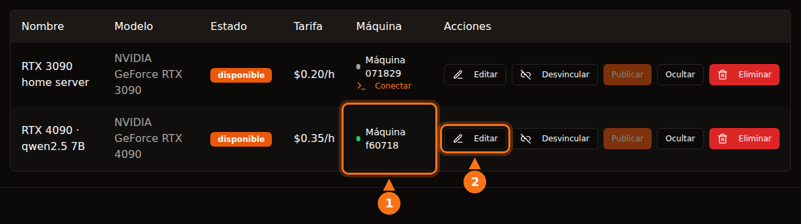

Es razonablemente seguro si eliges la plataforma sabiendo lo que haces, pero «seguro» significa cosas distintas en cada plataforma. En plataformas de contenedores como Vast.ai, el inquilino ejecuta su propio código en tu máquina y su tráfico sale desde tu dirección IP; el aislamiento lo mantiene fuera de tus archivos, no fuera de tu red ni de tu factura de la luz. En un diseño solo de API como GPUFlow, el inquilino solo puede enviar peticiones de chat a los modelos que instalaste, y el riesgo se invierte: los prompts se pueden leer en tu máquina, así que los inquilinos no deberían enviar nada secreto.

Este artículo recorre las dos direcciones. Lo que afirman terceros se comprobó en la documentación de cada plataforma en septiembre de 2026, y todo lo relativo a GPUFlow sale de su código fuente y su documentación. Las fuentes están al final.

## Qué puede hacer un inquilino en una plataforma de contenedores

La mayoría de los mercados de GPU alquilan un contenedor. El inquilino elige una imagen, obtiene una shell y ejecuta lo que quiera. A ti, como anfitrión, eso te deja cinco cosas en las que pensar.

- **Código arbitrario.** El código del inquilino se ejecuta sobre tu kernel, dentro de un contenedor o una VM. El aislamiento es bueno, pero no perfecto; las fugas de contenedor son raras, y son justo el tipo de fallo que se corrige en las actualizaciones del kernel y de los drivers que tienes que instalar.
- **Tu dirección IP.** El tráfico saliente del contenedor sale por tu conexión a internet. Si un inquilino hace scraping de una web, envía spam o escanea internet, la denuncia por abuso llega a tu proveedor de internet, dirigida a tu IP. Las condiciones de Vast.ai dicen que los usuarios indemnizan a los proveedores frente a reclamaciones derivadas del contenido de los usuarios, lo que ayuda en una disputa con un tercero, pero no impide que tu proveedor de internet te mande un aviso.
- **Puertos abiertos.** La guía para anfitriones de Vast.ai dice que «los clientes necesitan puertos abiertos para conectarse directamente a la máquina en la mayoría de los trabajos», así que redirigirás puertos en tu router.
- **Disco.** Los inquilinos descargan imágenes, modelos y conjuntos de datos en tus discos. Vast.ai libera el espacio cuando un cliente borra un volumen, pero mientras dura el alquiler, es suyo.
- **Consumo, calor y drivers.** Vast.ai avisa a los anfitriones: «cuenta con que la GPU se usará cerca de su capacidad máxima durante el alquiler». Eso son horas a plena potencia de la tarjeta, calor en la habitación y ventiladores girando. Las plataformas de contenedores también piden una instalación concreta: la guía de Vast.ai incluye instalar Ubuntu, particionar discos, instalar los drivers de NVIDIA y abrir puertos en el router.

## Cómo aíslan a los inquilinos Vast.ai, Salad y RunPod

| | Vast.ai | Salad | RunPod Community Cloud |
| --- | --- | --- | --- |
| **El inquilino obtiene** | Un contenedor (o una VM) con SSH o Jupyter | Un contenedor que ha desplegado; SSH y un terminal web dentro de él | Un pod (contenedor) |
| **Aislamiento** | Contenedores Docker sin privilegios | VM Linux sobre un hipervisor, con el contenedor dentro | «Su propio contenedor con separación estricta» |
| **Puertos de entrada** | Necesarios para la mayoría de los trabajos | Bloqueados por defecto | No se indica |
| **Nuevos anfitriones** | Sí, en Ubuntu | Sí, en Windows 10/11 | Ya no se aceptan |

- **Vast.ai** dice que «los clientes están aislados en contenedores Docker sin privilegios y solo tienen acceso a sus propios datos», con espacios de nombres y cgroups separados y aislamiento de red, de sistema de archivos y de procesos. También advierte a los inquilinos de que «la seguridad de los proveedores varía mucho» y remite el trabajo sensible a su nivel Secure Cloud de centros de datos certificados.
- **Salad** dice: «tu carga se ejecuta en un contenedor compatible con OCI dentro de una máquina virtual Linux, aislada de Windows y de cualquier otro proceso del anfitrión», con las conexiones entrantes bloqueadas por defecto. También protege a los inquilinos de los anfitriones: si un anfitrión «intenta acceder al entorno Linux, destruimos automáticamente el entorno y ponemos la máquina en la lista negra». Aparte, Salad ofrece trabajos opcionales de compartir ancho de banda que «procesan contenido de vídeo de plataformas de streaming de pago» a través de tu conexión; su página de soporte avisa de que esto aumenta tu consumo de datos y puede provocar «una restricción de contenido poco frecuente y temporal (normalmente de 1 a 2 días) en esas plataformas de streaming».
- **RunPod** dice que «ya no acepta nuevos anfitriones en Community Cloud». Para la capacidad existente, «cada pod o worker funciona en su propio contenedor», y sus condiciones «prohíben a los anfitriones inspeccionar los datos de tu pod o worker».

Las tres aíslan al inquilino de tu sistema. Ninguna puede impedir que el tráfico de apariencia legítima de un inquilino salga por tu conexión, y ninguna dice que pueda.

## En qué se diferencia el diseño de GPUFlow

GPUFlow no alquila una máquina, sino un modelo de IA detrás de una API compatible con OpenAI. Eso cambia lo que un inquilino puede tocar. Esto es lo que hace el código.

**El agente.** El instalador coloca un único binario de Go en `/usr/local/bin/gpuflow-agent` y lo ejecuta como servicio de systemd. No hay Docker. La unidad del servicio usa `DynamicUser=yes` (un usuario temporal sin privilegios), `NoNewPrivileges=yes` (no puede ganar permisos), `ProtectSystem=strict` (el sistema es de solo lectura para él), `ProtectHome=yes` (las carpetas personales son invisibles) y `PrivateTmp=yes`. El motor de inferencia es Ollama por defecto, instalado con el instalador del propio Ollama como servicio aparte (un proveedor puede, en su lugar, apuntar el agente a su propio servidor compatible con OpenAI). Este endurecimiento se aplica al agente, no a Ollama.

**Red.** El agente solo hace conexiones salientes: un WebSocket sobre TLS a `wss://ws.gpuflow.app`, y HTTPS a `gpuflow.app` para registrarse y enviar una señal de vida cada 15 segundos. No abre puertos, no rediriges nada en el router y los inquilinos nunca conocen tu dirección IP. Habla con Ollama en `127.0.0.1:11434`, la dirección de loopback por defecto de Ollama.

**Qué pueden llamar los inquilinos.** El inquilino recibe una clave API para `https://gpuflow.app/v1`. GPUFlow responde él mismo a `GET /v1/models`, y la única petición que reenvía a tu máquina es `POST /v1/chat/completions`. El agente tiene además un segundo cerrojo propio: solo hace de proxy para cuatro rutas exactas (`/v1/chat/completions`, `/v1/completions`, `/v1/embeddings` y `/v1/models`) y rechaza todo lo demás, incluidos los endpoints nativos `/api/*` de Ollama que servirían para descargar, borrar o crear modelos. El agente gestiona un único tipo de mensaje, la petición de inferencia; cualquier otro se ignora.

Así que el inquilino no tiene shell, ni SSH, ni archivos, ni acceso de red a tu máquina. No puede descargar un modelo de 70 GB en tu disco ni usar tu conexión para salir a internet. Lo que sí puede hacer es tener tu GPU ocupada durante las horas que ha contratado y poner en el campo `model` cualquier modelo que tengas instalado.

<figure>
<svg viewBox="0 0 720 380" role="img" aria-labelledby="d1-title" xmlns="http://www.w3.org/2000/svg" font-family="system-ui, sans-serif" font-size="15">
<title id="d1-title">Qué puede hacer un inquilino en un anfitrión de contenedores comparado con un diseño solo de API como GPUFlow</title>
<rect x="0" y="0" width="720" height="380" fill="#ffffff"/>
<text x="20" y="40" fill="#64748b" font-weight="bold">Qué puede hacer el inquilino</text>
<text x="470" y="40" text-anchor="middle" fill="#1e1b4b" font-weight="bold">Contenedores</text>
<text x="630" y="40" text-anchor="middle" fill="#1e1b4b" font-weight="bold">GPUFlow (API)</text>
<line x1="20" y1="55" x2="700" y2="55" stroke="#e2e8f0" stroke-width="2"/>
<text x="20" y="89" fill="#1e1b4b">Ejecutar sus propios programas</text>
<rect x="430" y="70" width="80" height="28" rx="14" fill="#fff7ed" stroke="#f97316" stroke-width="2"/>
<text x="470" y="89" text-anchor="middle" fill="#1e1b4b">Sí</text>
<rect x="590" y="70" width="80" height="28" rx="14" fill="#f0fdf4" stroke="#16a34a" stroke-width="2"/>
<text x="630" y="89" text-anchor="middle" fill="#1e1b4b">No</text>
<line x1="20" y1="110" x2="700" y2="110" stroke="#e2e8f0" stroke-width="1"/>
<text x="20" y="133" fill="#1e1b4b">Abrir una shell o SSH</text>
<rect x="430" y="114" width="80" height="28" rx="14" fill="#fff7ed" stroke="#f97316" stroke-width="2"/>
<text x="470" y="133" text-anchor="middle" fill="#1e1b4b">Sí</text>
<rect x="590" y="114" width="80" height="28" rx="14" fill="#f0fdf4" stroke="#16a34a" stroke-width="2"/>
<text x="630" y="133" text-anchor="middle" fill="#1e1b4b">No</text>
<line x1="20" y1="154" x2="700" y2="154" stroke="#e2e8f0" stroke-width="1"/>
<text x="20" y="177" fill="#1e1b4b">Escribir archivos en tu disco</text>
<rect x="430" y="158" width="80" height="28" rx="14" fill="#fff7ed" stroke="#f97316" stroke-width="2"/>
<text x="470" y="177" text-anchor="middle" fill="#1e1b4b">Sí</text>
<rect x="590" y="158" width="80" height="28" rx="14" fill="#f0fdf4" stroke="#16a34a" stroke-width="2"/>
<text x="630" y="177" text-anchor="middle" fill="#1e1b4b">No</text>
<line x1="20" y1="198" x2="700" y2="198" stroke="#e2e8f0" stroke-width="1"/>
<text x="20" y="221" fill="#1e1b4b">Enviar tráfico desde tu IP</text>
<rect x="430" y="202" width="80" height="28" rx="14" fill="#fff7ed" stroke="#f97316" stroke-width="2"/>
<text x="470" y="221" text-anchor="middle" fill="#1e1b4b">Sí</text>
<rect x="590" y="202" width="80" height="28" rx="14" fill="#f0fdf4" stroke="#16a34a" stroke-width="2"/>
<text x="630" y="221" text-anchor="middle" fill="#1e1b4b">No</text>
<line x1="20" y1="242" x2="700" y2="242" stroke="#e2e8f0" stroke-width="1"/>
<text x="20" y="265" fill="#1e1b4b">Necesitar puertos abiertos en tu router</text>
<rect x="430" y="246" width="80" height="28" rx="14" fill="#fff7ed" stroke="#f97316" stroke-width="2"/>
<text x="470" y="265" text-anchor="middle" fill="#1e1b4b" font-size="13">A menudo</text>
<rect x="590" y="246" width="80" height="28" rx="14" fill="#f0fdf4" stroke="#16a34a" stroke-width="2"/>
<text x="630" y="265" text-anchor="middle" fill="#1e1b4b">No</text>
<line x1="20" y1="286" x2="700" y2="286" stroke="#e2e8f0" stroke-width="1"/>
<text x="20" y="309" fill="#1e1b4b">Descargar o borrar modelos</text>
<rect x="430" y="290" width="80" height="28" rx="14" fill="#fff7ed" stroke="#f97316" stroke-width="2"/>
<text x="470" y="309" text-anchor="middle" fill="#1e1b4b">Sí</text>
<rect x="590" y="290" width="80" height="28" rx="14" fill="#f0fdf4" stroke="#16a34a" stroke-width="2"/>
<text x="630" y="309" text-anchor="middle" fill="#1e1b4b">No</text>
<line x1="20" y1="330" x2="700" y2="330" stroke="#e2e8f0" stroke-width="1"/>
<text x="20" y="353" fill="#1e1b4b">Tener tu GPU ocupada durante horas</text>
<rect x="430" y="334" width="80" height="28" rx="14" fill="#eef2ff" stroke="#6366f1" stroke-width="2"/>
<text x="470" y="353" text-anchor="middle" fill="#1e1b4b">Sí</text>
<rect x="590" y="334" width="80" height="28" rx="14" fill="#eef2ff" stroke="#6366f1" stroke-width="2"/>
<text x="630" y="353" text-anchor="middle" fill="#1e1b4b">Sí</text>
</svg>
<figcaption>La columna de contenedores describe un alojamiento al estilo de Vast.ai, donde los archivos y el tráfico se quedan dentro del contenedor del inquilino pero siguen usando tu disco y tu conexión. Los detalles varían: Salad ejecuta los contenedores en una VM Linux y bloquea las conexiones entrantes por defecto. En GPUFlow el inquilino solo envía peticiones de chat a los modelos que instalaste.</figcaption>
</figure>

## El recorrido de los datos, salto a salto

Esta es la parte que deberían leer los inquilinos. Una petición de chat pasa por cuatro programas, y el texto se puede leer en más de uno.

<figure>
<svg viewBox="0 0 720 330" role="img" aria-labelledby="d2-title" xmlns="http://www.w3.org/2000/svg" font-family="system-ui, sans-serif" font-size="15">
<title id="d2-title">Una petición de chat de GPUFlow va de la app del inquilino a gpuflow.app, al relé, al agente en el PC del proveedor y a Ollama, y la respuesta vuelve en streaming por el mismo camino</title>
<rect x="0" y="0" width="720" height="330" fill="#ffffff"/>
<rect x="480" y="50" width="230" height="200" rx="12" fill="#fff7ed" stroke="#f97316" stroke-width="2" stroke-dasharray="6 4"/>
<text x="595" y="76" text-anchor="middle" fill="#1e1b4b" font-weight="bold">PC del proveedor</text>
<rect x="10" y="110" width="110" height="70" rx="10" fill="#eef2ff" stroke="#6366f1" stroke-width="2"/>
<text x="65" y="141" text-anchor="middle" fill="#1e1b4b">App del</text>
<text x="65" y="161" text-anchor="middle" fill="#1e1b4b">inquilino</text>
<rect x="160" y="110" width="120" height="70" rx="10" fill="#eef2ff" stroke="#6366f1" stroke-width="2"/>
<text x="220" y="141" text-anchor="middle" fill="#1e1b4b" font-size="13">API de GPUFlow</text>
<text x="220" y="161" text-anchor="middle" fill="#64748b" font-size="12">gpuflow.app/v1</text>
<rect x="320" y="110" width="105" height="70" rx="10" fill="#eef2ff" stroke="#6366f1" stroke-width="2"/>
<text x="372" y="141" text-anchor="middle" fill="#1e1b4b">Relé</text>
<text x="372" y="161" text-anchor="middle" fill="#64748b" font-size="12">ws.gpuflow.app</text>
<rect x="492" y="110" width="90" height="70" rx="10" fill="#ffffff" stroke="#6366f1" stroke-width="2"/>
<text x="537" y="141" text-anchor="middle" fill="#1e1b4b">Agente</text>
<text x="537" y="161" text-anchor="middle" fill="#1e1b4b">GPUFlow</text>
<rect x="610" y="110" width="90" height="70" rx="10" fill="#ffffff" stroke="#6366f1" stroke-width="2"/>
<text x="655" y="141" text-anchor="middle" fill="#1e1b4b">Ollama</text>
<text x="655" y="161" text-anchor="middle" fill="#64748b" font-size="12">127.0.0.1</text>
<line x1="124" y1="145" x2="156" y2="145" stroke="#16a34a" stroke-width="4"/>
<line x1="284" y1="145" x2="316" y2="145" stroke="#64748b" stroke-width="4"/>
<line x1="429" y1="145" x2="488" y2="145" stroke="#16a34a" stroke-width="4"/>
<line x1="586" y1="145" x2="606" y2="145" stroke="#f97316" stroke-width="4"/>
<text x="140" y="102" text-anchor="middle" fill="#16a34a" font-size="13">TLS</text>
<text x="300" y="102" text-anchor="middle" fill="#64748b" font-size="13">interna</text>
<text x="452" y="102" text-anchor="middle" fill="#16a34a" font-size="13">TLS</text>
<text x="596" y="102" text-anchor="middle" fill="#f97316" font-size="13">sin cifrar</text>
<text x="65" y="212" text-anchor="middle" fill="#64748b" font-size="12">El texto se</text>
<text x="65" y="228" text-anchor="middle" fill="#64748b" font-size="12">escribe aquí</text>
<text x="220" y="212" text-anchor="middle" fill="#64748b" font-size="12">Lee el texto,</text>
<text x="220" y="228" text-anchor="middle" fill="#64748b" font-size="12">solo guarda el</text>
<text x="220" y="244" text-anchor="middle" fill="#64748b" font-size="12">número de tokens</text>
<text x="372" y="212" text-anchor="middle" fill="#64748b" font-size="12">Lo reenvía,</text>
<text x="372" y="228" text-anchor="middle" fill="#64748b" font-size="12">no registra</text>
<text x="372" y="244" text-anchor="middle" fill="#64748b" font-size="12">el contenido</text>
<text x="595" y="212" text-anchor="middle" fill="#1e1b4b" font-size="13" font-weight="bold">Texto sin cifrar en memoria</text>
<text x="595" y="230" text-anchor="middle" fill="#1e1b4b" font-size="13" font-weight="bold">El dueño tiene root</text>
<line x1="20" y1="295" x2="50" y2="295" stroke="#16a34a" stroke-width="4"/>
<text x="58" y="300" fill="#1e1b4b" font-size="13">TLS por internet</text>
<line x1="235" y1="295" x2="265" y2="295" stroke="#64748b" stroke-width="4"/>
<text x="273" y="300" fill="#1e1b4b" font-size="13">dentro de GPUFlow</text>
<line x1="420" y1="295" x2="450" y2="295" stroke="#f97316" stroke-width="4"/>
<text x="458" y="300" fill="#1e1b4b" font-size="13">sin cifrar en el PC del proveedor</text>
</svg>
<figcaption>La petición va de izquierda a derecha y la respuesta vuelve en streaming por el mismo camino. TLS protege cada salto que cruza internet, pero termina en cada servidor, así que el texto se puede leer en los servidores de GPUFlow mientras lo reenvían y en el PC del proveedor, donde Ollama ejecuta el modelo.</figcaption>
</figure>

1. **Del inquilino a gpuflow.app:** HTTPS. La web está detrás de Cloudflare.
2. **De la API de GPUFlow a su relé:** una conexión interna en el lado de GPUFlow. La API comprueba la clave, reenvía el cuerpo de la petición sin cambios y registra el número de tokens. No guarda el texto de las peticiones ni de las respuestas, y así lo dice su política de privacidad.
3. **Del relé al agente del proveedor:** un WebSocket con TLS que abrió el agente. El relé registra el tipo de cada mensaje, no su contenido.
4. **Del agente a Ollama:** HTTP sin cifrar por la dirección de loopback dentro del PC del proveedor. El agente tampoco registra el cuerpo de las peticiones.

No hay cifrado de extremo a extremo hasta el modelo, y con un motor de inferencia normal no puede haberlo: el modelo tiene que leer el prompt para responderlo.

## Qué puede ver el proveedor

Dicho sin rodeos: **el ordenador del proveedor maneja tus prompts y respuestas sin cifrar.** Ollama se ejecuta ahí, y el proveedor tiene root en la máquina (el instalador lo exige). Un proveedor que quisiera podría capturar el tráfico de loopback, cambiar el motor o apuntar el agente a otro servidor.

Lo que lo impide es el contrato. Las condiciones de GPUFlow dicen que los proveedores no deben «grabar, leer, conservar ni compartir las peticiones o respuestas de los inquilinos, ni modificar las respuestas». Es una norma con consecuencias para la cuenta, no un bloqueo técnico. La política de privacidad dice lo mismo a los inquilinos: las peticiones y las respuestas pasan por el ordenador del proveedor mientras dura el alquiler.

Además de los prompts, el proveedor ve tu nombre de usuario de GPUFlow y recibe un aviso cuando empieza un alquiler (id del alquiler, anuncio y horas). Los inquilinos no ven nada de las estadísticas de la máquina del proveedor; la temperatura de la GPU, la VRAM, el consumo y el resto de la telemetría solo llegan al panel del dueño.

La regla práctica para inquilinos: **no envíes secretos, credenciales, datos personales de otras personas ni datos regulados (sanitarios, financieros, confidenciales de clientes) a través de ninguna GPU comunitaria.** Vale para GPUFlow y exactamente igual para un contenedor en el PC de casa de alguien, donde el anfitrión puede inspeccionar la memoria y el disco con el mismo acceso root. Para trabajo sensible, ejecuta el modelo en hardware que controles o usa un proveedor que firme el acuerdo que exige tu cumplimiento normativo. [Por qué algunas empresas prohíben las herramientas de IA públicas](/es/why-corporate-policies-banning-chatgpt/) trata el lado de las políticas, y [cómo proteger un conjunto de datos en un nodo de GPU público](/es/how-to-secure-dataset-on-public-gpu-node/) el lado de los contenedores.

## Lo que sigue teniendo riesgo en GPUFlow

Limitarse a una API reduce la superficie de ataque. No la elimina, y prefiero enumerar lo que queda a fingir lo contrario.

- **Ollama procesa entradas no fiables.** Cada petición de un inquilino acaba como JSON entregado a Ollama. Un fallo en Ollama es la vía de entrada más probable, así que mantenlo actualizado. La lista de rutas permitidas del agente aleja a los inquilinos de los endpoints de gestión de modelos de Ollama, pero no puede arreglar un fallo en la ruta de chat.
- **El instalador se ejecuta como root.** Pasas un script de gpuflow.app a `sudo bash`, y ese script también ejecuta el instalador de Ollama. Léelos antes; es buena práctica con cualquier software de alojamiento.
- **Sin actualización automática.** El agente no se actualiza solo. Para tener una versión nueva, vuelve a ejecutar el instalador, que comprueba el binario contra un archivo SHA256SUMS cuando se publica uno.
- **Carga.** No hay límite de peticiones. Un inquilino puede tener tu GPU a plena carga todas las horas que ha contratado, y puede usar cualquier modelo que tengas instalado, incluido el más grande.
- **Calor y consumo.** Igual que en cualquier otro sitio: horas alquiladas son horas con carga.

## Lista de comprobación para proveedores

1. **Usa una máquina que te puedas permitir prestar.** Lo ideal es un equipo dedicado. Como mínimo, no guardes archivos de trabajo ni gestores de contraseñas en el ordenador que alquilas, sea cual sea la plataforma. En GPUFlow el agente ya se ejecuta como usuario temporal del sistema con las carpetas personales ocultas, pero Ollama es un servicio aparte.
2. **Limita el consumo.** `sudo nvidia-smi -pl 280` fija el límite de potencia de la tarjeta en vatios (necesita root, y el valor tiene que estar entre los límites mínimo y máximo de la tarjeta). Puget Systems informa de que las RTX 3090 limitadas a 270-280 W conservan alrededor del 95 % de su rendimiento, y explica cómo volver a aplicar el límite en cada arranque con una unidad de systemd.
3. **Haz antes la cuenta de la luz.** Mira el consumo en **Mis máquinas** mientras la GPU está ocupada y multiplica los kilovatios por tu precio del kWh. [Lo que puede ganar tu GPU de gaming](/es/how-much-can-you-earn-renting-out-your-gpu/) hace la cuenta para las tarjetas más comunes y cinco países.
4. **Vigila la temperatura.** Las estadísticas en directo muestran la temperatura de la GPU, del punto más caliente y de la memoria, y la velocidad del ventilador. Asegúrate de que a la caja le llega aire.
5. **Mantén el sistema actualizado.** Instala las actualizaciones de Linux, del driver de la GPU y de Ollama. El instalador de GPUFlow no gestiona el driver de tu GPU; systemd vuelve a arrancar el agente después de un reinicio.
6. **Aprende a hacer una pausa.** Oculta el anuncio en **Mis GPUs** o ejecuta `sudo systemctl stop gpuflow-agent` (`start` lo vuelve a poner en marcha). Mientras hay un alquiler activo, el panel no te deja cambiar el anuncio ni la máquina, y no puedes terminar desde ahí el alquiler de un inquilino. Si detienes el agente a mitad de un alquiler, el alquiler termina a los 10 minutos y solo cobras hasta la última señal de vida.
7. **Aprende a desinstalar.** Los pasos están en la [documentación de resolución de problemas](https://docs.gpuflow.app/es/providers/troubleshooting/). Ollama sigue instalado hasta que lo quites.

En las plataformas de contenedores, añade dos puntos: decide si de verdad quieres puertos abiertos en tu router y pregunta a tu proveedor de internet qué hace con las denuncias por abuso, porque el tráfico de los inquilinos llevará tu dirección IP.

## Lista de comprobación para inquilinos

1. **Trata cualquier GPU comunitaria como el ordenador de un desconocido.** Nada de claves API, contraseñas, datos de clientes ni datos médicos o financieros en los prompts.
2. **Quita lo que no necesites.** Sustituye nombres y números de cuenta por marcadores antes de enviar nada.
3. **Protege tu clave.** En GPUFlow la clave deja de funcionar cuando termina el alquiler. Si se filtra, **Nueva clave** revoca la antigua al instante, y **Terminar ahora** detiene la facturación y te devuelve el tiempo no usado.
4. **Da por hecho que las respuestas pueden ser incorrectas o estar alteradas.** Las condiciones prohíben a los proveedores modificar las respuestas, pero comprueba cualquier cosa importante.
5. **Usa la herramienta adecuada para el trabajo sensible.** Aloja el modelo tú mismo o usa un proveedor que ofrezca el contrato que necesitas. [Cómo usar la clave en tus aplicaciones](/es/use-openai-compatible-api-key-in-apps/) sirve para todo lo demás.

## Fuentes

Todas revisadas en septiembre de 2026.

- GPUFlow: [qué pueden tocar los inquilinos](https://docs.gpuflow.app/es/providers/security/), [primeros pasos para proveedores](https://docs.gpuflow.app/es/providers/getting-started/), [precios y electricidad](https://docs.gpuflow.app/es/providers/pricing/), [resolución de problemas y desinstalación](https://docs.gpuflow.app/es/providers/troubleshooting/), [guía rápida de la API](https://docs.gpuflow.app/es/renters/api-quickstart/)
- Vast.ai: [resumen para anfitriones](https://docs.vast.ai/host/hosting-overview.md), [FAQ de seguridad](https://docs.vast.ai/documentation/reference/faq/security), [máquinas virtuales Linux](https://docs.vast.ai/linux-virtual-machines), [condiciones del servicio](https://vast.ai/terms), [ejecutar modelos de IA privados](https://vast.ai/article/running-private-ai-models-without-the-risk-of-data-exposure)
- Salad: [seguridad](https://salad.com/security), [cargas en contenedores y tu PC](https://community.salad.com/container-workloads-and-your-pc/), [compartir ancho de banda](https://support.salad.com/faq/jobs/what-is-bandwidth-sharing/), [SSH y terminal](https://docs.salad.com/container-engine/explanation/container-groups/ssh-and-terminal.md), [descarga y requisitos del sistema](https://salad.com/download/)
- RunPod: [elegir un pod](https://docs.runpod.io/pods/choose-a-pod), [seguridad de datos y cumplimiento legal](https://docs.runpod.io/hosting/partner-requirements)
- Ollama: [FAQ (dirección de escucha por defecto)](https://docs.ollama.com/faq)
- NVIDIA: [manual de nvidia-smi](https://docs.nvidia.com/deploy/nvidia-smi/index.html)
- Puget Systems: [limitar la potencia de las RTX 3090 con systemd y nvidia-smi](https://www.pugetsystems.com/labs/hpc/quad-rtx3090-gpu-power-limiting-with-systemd-and-nvidia-smi-1983/)
