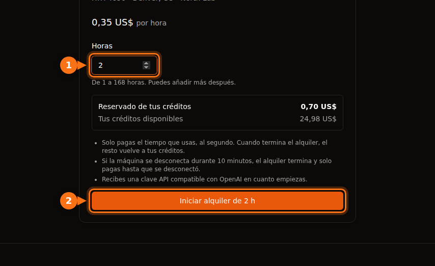

A 0,40 $ la hora, una prueba de 90 segundos cuesta 1 ¢ si te facturan por segundo con un mínimo de 60 segundos, 1,3 ¢ si te facturan por minuto y 40 ¢ si te facturan por hora completa. Esa diferencia de 40 veces es todo lo que hay que saber de los trabajos cortos. En cuanto un trabajo dura más de unos minutos, la facturación por segundo y la facturación por minuto se diferencian en menos de un céntimo, y la factura la deciden el tiempo ocioso, el tiempo de preparación y el almacenamiento.

A continuación: las reglas publicadas de cada plataforma, ejemplos resueltos con las cuentas, un gráfico a escala y cómo el modelo de GPUFlow de reservar primero y devolver después se convierte en un cargo. Las reglas y los precios son de septiembre de 2026; las fuentes están al final.

## Tres formas de contar el tiempo de GPU

Todo alquiler de GPU tiene un precio por hora. La diferencia está en cómo el tiempo que has usado se convierte en tiempo facturable antes de multiplicarlo por ese precio.

- **Por segundo con un mínimo.** Se cuentan los segundos. Si el total no llega al mínimo (normalmente 60 segundos), se factura el mínimo. Coste = max(60, segundos) × precio por hora / 3.600.
- **Por minuto.** Se cuentan los minutos. Las plataformas no coinciden en qué hacer con un minuto a medias: unas redondean hacia arriba y Azure lo descarta. En los ejemplos de abajo redondeo hacia arriba, que es el peor caso para ti. Coste = minutos × precio por hora / 60.
- **Hora completa.** Cualquier hora empezada cuenta como entera. Un trabajo de 61 minutos son dos horas. Coste = ceil(segundos / 3.600) × precio por hora.

El mínimo importa más de lo que se suele pensar. La facturación por segundo con un mínimo de 60 segundos y la facturación por minuto son idénticas para cualquier cosa de menos de un minuto. El incremento solo cambia la fracción que sobra al final de un trabajo, así que nunca te puede costar más de un incremento por sesión: algo menos de 40 ¢ por sesión con facturación por hora a 0,40 $, y menos de 0,7 ¢ por sesión con facturación por minuto al mismo precio (59 segundos × 40 / 3.600 = 0,66 ¢).

## Lo que usa cada plataforma

Estas son las reglas publicadas para instancias bajo demanda, comprobadas en la documentación de cada proveedor en septiembre de 2026.

| Plataforma | Incremento | Mínimo | Nota de la documentación |
| --- | --- | --- | --- |
| AWS EC2 On-Demand | Por segundo | 60 segundos | Se aplica a Linux, Windows, RHEL y Ubuntu Pro. SUSE Linux Enterprise Server se factura por hora completa. |
| Google Cloud Compute Engine | Por segundo | 1 minuto | «Todas las vCPU, GPU y GB de memoria se cobran con un mínimo de 1 minuto». |
| Azure Virtual Machines | Por minuto | No se indica | Factura «el número de minutos completos»; una VM que funciona 6 min 45 s se factura como 6 minutos. |
| Lambda (nube bajo demanda) | Por minuto | No se indica | Factura «en incrementos de un minuto» desde que la instancia supera las comprobaciones de estado hasta que la terminas. |
| RunPod Pods | Por segundo | No se indica | El cómputo y el almacenamiento se facturan por segundo. |
| Vast.ai | Por segundo | No se indica | El alquiler activo se factura cada segundo; el almacenamiento se factura cada segundo que existe la instancia, salvo que esté desconectada. |
| GPUFlow | Por segundo | 60 segundos | Segundos completos, redondeados al céntimo superior, con un tope en lo reservado. |

Dos apuntes para leer la tabla. La regla de Azure en realidad redondea hacia abajo: su FAQ dice que «no se factura ningún segundo adicional». La documentación de Lambda habla de incrementos de un minuto sin decir hacia dónde se redondea un minuto a medias, así que no he dado por hecha ninguna de las dos opciones. Y «no se indica» significa exactamente eso: la documentación que he leído no menciona ningún mínimo, que no es lo mismo que un mínimo documentado de cero.

Ninguna de estas plataformas redondea el cómputo de GPU a la hora completa para los tipos de instancia de arriba. El redondeo por horas sigue apareciendo en la letra pequeña, como con SUSE en AWS, así que revisa la página de facturación antes de lanzar muchos trabajos cortos en un sitio nuevo.

## Cinco trabajos a 0,40 $ la hora

Aquí va un único precio, 0,40 $ por hora, aplicado a cinco duraciones. Son 40 ¢ por cada 3.600 segundos, o 1/90 de céntimo por segundo.

**Una prueba de 90 segundos.** Por segundo: 90 × 40 / 3.600 = 1,0 ¢. Por minuto: 2 minutos × 40 / 60 = 1,33 ¢. Hora completa: 40 ¢. La factura por horas es 40 veces la factura por segundos.

**7 minutos 30 segundos.** Por segundo: 450 × 40 / 3.600 = 5,0 ¢. Por minuto: 8 minutos × 40 / 60 = 5,33 ¢. Hora completa: 40 ¢, 8 veces más.

**38 minutos 20 segundos.** Por segundo: 2.300 × 40 / 3.600 = 25,56 ¢. Por minuto: 39 minutos × 40 / 60 = 26,0 ¢. Hora completa: 40 ¢, unas 1,57 veces más.

**61 minutos.** Por segundo: 3.660 × 40 / 3.600 = 40,67 ¢. Por minuto: 61 × 40 / 60 = 40,67 ¢ (el trabajo termina en un minuto exacto, así que los dos coinciden). Hora completa: dos horas, 80 ¢. Un minuto de más casi duplica la factura por horas.

| Duración del trabajo | Por segundo (mín. 60 s) | Por minuto (hacia arriba) | Hora completa | Cargo en GPUFlow |
| --- | --- | --- | --- | --- |
| 1 min 30 s | 1,00 ¢ | 1,33 ¢ | 40 ¢ | 1 ¢ |
| 7 min 30 s | 5,00 ¢ | 5,33 ¢ | 40 ¢ | 5 ¢ |
| 38 min 20 s | 25,56 ¢ | 26,00 ¢ | 40 ¢ | 26 ¢ |
| 61 min | 40,67 ¢ | 40,67 ¢ | 80 ¢ | 41 ¢ |
| 20 trabajos de 2 min 30 s | 33,33 ¢ | 40,00 ¢ | 8,00 $ | 40 ¢ (20 alquileres) |

La columna de GPUFlow es el resultado por segundo redondeado al céntimo entero superior en cada alquiler, que es lo que hace su código de facturación. La última fila se explica dos secciones más abajo.

## Coste según la duración del trabajo, a escala

El primer gráfico va de 0 a 150 minutos. La escalera de la facturación por minuto tiene peldaños de 1 minuto de ancho y 0,67 ¢ de alto, así que a esta escala queda encima de la línea por segundo. La escalera que importa es la de la hora completa: salta 40 ¢ en los minutos 0, 60 y 120.

<figure>
<svg viewBox="0 0 720 400" role="img" aria-labelledby="d1-title" xmlns="http://www.w3.org/2000/svg" font-family="system-ui, sans-serif" font-size="15">
<title id="d1-title">Coste de un trabajo a 0,40 dólares por hora de 0 a 150 minutos con facturación por segundo, por minuto y por hora completa</title>
<rect x="0" y="0" width="720" height="400" fill="#ffffff"/>
<line x1="90" y1="320.0" x2="690" y2="320.0" stroke="#e2e8f0" stroke-width="1"/>
<text x="82" y="325.0" text-anchor="end" fill="#64748b" font-size="13">0,00 $</text>
<line x1="90" y1="275.0" x2="690" y2="275.0" stroke="#e2e8f0" stroke-width="1"/>
<text x="82" y="280.0" text-anchor="end" fill="#64748b" font-size="13">0,20 $</text>
<line x1="90" y1="230.0" x2="690" y2="230.0" stroke="#e2e8f0" stroke-width="1"/>
<text x="82" y="235.0" text-anchor="end" fill="#64748b" font-size="13">0,40 $</text>
<line x1="90" y1="185.0" x2="690" y2="185.0" stroke="#e2e8f0" stroke-width="1"/>
<text x="82" y="190.0" text-anchor="end" fill="#64748b" font-size="13">0,60 $</text>
<line x1="90" y1="140.0" x2="690" y2="140.0" stroke="#e2e8f0" stroke-width="1"/>
<text x="82" y="145.0" text-anchor="end" fill="#64748b" font-size="13">0,80 $</text>
<line x1="90" y1="95.0" x2="690" y2="95.0" stroke="#e2e8f0" stroke-width="1"/>
<text x="82" y="100.0" text-anchor="end" fill="#64748b" font-size="13">1,00 $</text>
<line x1="90" y1="50.0" x2="690" y2="50.0" stroke="#e2e8f0" stroke-width="1"/>
<text x="82" y="55.0" text-anchor="end" fill="#64748b" font-size="13">1,20 $</text>
<line x1="90.0" y1="320" x2="90.0" y2="325" stroke="#64748b" stroke-width="1"/>
<text x="90.0" y="342" text-anchor="middle" fill="#64748b" font-size="13">0</text>
<line x1="210.0" y1="320" x2="210.0" y2="325" stroke="#64748b" stroke-width="1"/>
<text x="210.0" y="342" text-anchor="middle" fill="#64748b" font-size="13">30</text>
<line x1="330.0" y1="320" x2="330.0" y2="325" stroke="#64748b" stroke-width="1"/>
<text x="330.0" y="342" text-anchor="middle" fill="#64748b" font-size="13">60</text>
<line x1="450.0" y1="320" x2="450.0" y2="325" stroke="#64748b" stroke-width="1"/>
<text x="450.0" y="342" text-anchor="middle" fill="#64748b" font-size="13">90</text>
<line x1="570.0" y1="320" x2="570.0" y2="325" stroke="#64748b" stroke-width="1"/>
<text x="570.0" y="342" text-anchor="middle" fill="#64748b" font-size="13">120</text>
<line x1="690.0" y1="320" x2="690.0" y2="325" stroke="#64748b" stroke-width="1"/>
<text x="690.0" y="342" text-anchor="middle" fill="#64748b" font-size="13">150</text>
<line x1="90" y1="320" x2="690" y2="320" stroke="#64748b" stroke-width="1.5"/>
<line x1="90" y1="50" x2="90" y2="320" stroke="#64748b" stroke-width="1.5"/>
<text x="390.0" y="365" text-anchor="middle" fill="#1e1b4b">Duración del trabajo (minutos)</text>
<text x="22" y="185.0" text-anchor="middle" fill="#1e1b4b" transform="rotate(-90 22 185.0)">Coste a 0,40 $ por hora</text>
<polyline fill="none" stroke="#f97316" stroke-width="3" points="90.0,230.0 330.0,230.0 330.0,140.0 570.0,140.0 570.0,50.0 690.0,50.0"/>
<polyline fill="none" stroke="#16a34a" stroke-width="2.5" stroke-dasharray="6 4" points="90.0,318.5 94.0,318.5 94.0,317.0 98.0,317.0 98.0,315.5 102.0,315.5 102.0,314.0 106.0,314.0 106.0,312.5 110.0,312.5 110.0,311.0 114.0,311.0 114.0,309.5 118.0,309.5 118.0,308.0 122.0,308.0 122.0,306.5 126.0,306.5 126.0,305.0 130.0,305.0 130.0,303.5 134.0,303.5 134.0,302.0 138.0,302.0 138.0,300.5 142.0,300.5 142.0,299.0 146.0,299.0 146.0,297.5 150.0,297.5 150.0,296.0 154.0,296.0 154.0,294.5 158.0,294.5 158.0,293.0 162.0,293.0 162.0,291.5 166.0,291.5 166.0,290.0 170.0,290.0 170.0,288.5 174.0,288.5 174.0,287.0 178.0,287.0 178.0,285.5 182.0,285.5 182.0,284.0 186.0,284.0 186.0,282.5 190.0,282.5 190.0,281.0 194.0,281.0 194.0,279.5 198.0,279.5 198.0,278.0 202.0,278.0 202.0,276.5 206.0,276.5 206.0,275.0 210.0,275.0 210.0,273.5 214.0,273.5 214.0,272.0 218.0,272.0 218.0,270.5 222.0,270.5 222.0,269.0 226.0,269.0 226.0,267.5 230.0,267.5 230.0,266.0 234.0,266.0 234.0,264.5 238.0,264.5 238.0,263.0 242.0,263.0 242.0,261.5 246.0,261.5 246.0,260.0 250.0,260.0 250.0,258.5 254.0,258.5 254.0,257.0 258.0,257.0 258.0,255.5 262.0,255.5 262.0,254.0 266.0,254.0 266.0,252.5 270.0,252.5 270.0,251.0 274.0,251.0 274.0,249.5 278.0,249.5 278.0,248.0 282.0,248.0 282.0,246.5 286.0,246.5 286.0,245.0 290.0,245.0 290.0,243.5 294.0,243.5 294.0,242.0 298.0,242.0 298.0,240.5 302.0,240.5 302.0,239.0 306.0,239.0 306.0,237.5 310.0,237.5 310.0,236.0 314.0,236.0 314.0,234.5 318.0,234.5 318.0,233.0 322.0,233.0 322.0,231.5 326.0,231.5 326.0,230.0 330.0,230.0 330.0,228.5 334.0,228.5 334.0,227.0 338.0,227.0 338.0,225.5 342.0,225.5 342.0,224.0 346.0,224.0 346.0,222.5 350.0,222.5 350.0,221.0 354.0,221.0 354.0,219.5 358.0,219.5 358.0,218.0 362.0,218.0 362.0,216.5 366.0,216.5 366.0,215.0 370.0,215.0 370.0,213.5 374.0,213.5 374.0,212.0 378.0,212.0 378.0,210.5 382.0,210.5 382.0,209.0 386.0,209.0 386.0,207.5 390.0,207.5 390.0,206.0 394.0,206.0 394.0,204.5 398.0,204.5 398.0,203.0 402.0,203.0 402.0,201.5 406.0,201.5 406.0,200.0 410.0,200.0 410.0,198.5 414.0,198.5 414.0,197.0 418.0,197.0 418.0,195.5 422.0,195.5 422.0,194.0 426.0,194.0 426.0,192.5 430.0,192.5 430.0,191.0 434.0,191.0 434.0,189.5 438.0,189.5 438.0,188.0 442.0,188.0 442.0,186.5 446.0,186.5 446.0,185.0 450.0,185.0 450.0,183.5 454.0,183.5 454.0,182.0 458.0,182.0 458.0,180.5 462.0,180.5 462.0,179.0 466.0,179.0 466.0,177.5 470.0,177.5 470.0,176.0 474.0,176.0 474.0,174.5 478.0,174.5 478.0,173.0 482.0,173.0 482.0,171.5 486.0,171.5 486.0,170.0 490.0,170.0 490.0,168.5 494.0,168.5 494.0,167.0 498.0,167.0 498.0,165.5 502.0,165.5 502.0,164.0 506.0,164.0 506.0,162.5 510.0,162.5 510.0,161.0 514.0,161.0 514.0,159.5 518.0,159.5 518.0,158.0 522.0,158.0 522.0,156.5 526.0,156.5 526.0,155.0 530.0,155.0 530.0,153.5 534.0,153.5 534.0,152.0 538.0,152.0 538.0,150.5 542.0,150.5 542.0,149.0 546.0,149.0 546.0,147.5 550.0,147.5 550.0,146.0 554.0,146.0 554.0,144.5 558.0,144.5 558.0,143.0 562.0,143.0 562.0,141.5 566.0,141.5 566.0,140.0 570.0,140.0 570.0,138.5 574.0,138.5 574.0,137.0 578.0,137.0 578.0,135.5 582.0,135.5 582.0,134.0 586.0,134.0 586.0,132.5 590.0,132.5 590.0,131.0 594.0,131.0 594.0,129.5 598.0,129.5 598.0,128.0 602.0,128.0 602.0,126.5 606.0,126.5 606.0,125.0 610.0,125.0 610.0,123.5 614.0,123.5 614.0,122.0 618.0,122.0 618.0,120.5 622.0,120.5 622.0,119.0 626.0,119.0 626.0,117.5 630.0,117.5 630.0,116.0 634.0,116.0 634.0,114.5 638.0,114.5 638.0,113.0 642.0,113.0 642.0,111.5 646.0,111.5 646.0,110.0 650.0,110.0 650.0,108.5 654.0,108.5 654.0,107.0 658.0,107.0 658.0,105.5 662.0,105.5 662.0,104.0 666.0,104.0 666.0,102.5 670.0,102.5 670.0,101.0 674.0,101.0 674.0,99.5 678.0,99.5 678.0,98.0 682.0,98.0 682.0,96.5 686.0,96.5 686.0,95.0 690.0,95.0"/>
<polyline fill="none" stroke="#6366f1" stroke-width="2.5" points="90.0,318.5 94.0,318.5 690.0,95.0"/>
<line x1="110" y1="22" x2="138" y2="22" stroke="#6366f1" stroke-width="3"/><text x="144" y="27" fill="#1e1b4b">Por segundo, mín. 60 s</text>
<line x1="330" y1="22" x2="358" y2="22" stroke="#16a34a" stroke-width="3" stroke-dasharray="6 4"/><text x="364" y="27" fill="#1e1b4b">Por minuto</text>
<line x1="480" y1="22" x2="508" y2="22" stroke="#f97316" stroke-width="3"/><text x="514" y="27" fill="#1e1b4b">Hora completa</text>
</svg>
<figcaption>Coste de un trabajo a 0,40 $ por hora. La facturación por horas (naranja) cobra el escalón entero de 40 ¢ en cuanto empieza una hora nueva; la facturación por segundo y por minuto son casi la misma línea.</figcaption>
</figure>

La distancia entre la escalera naranja y la línea azul es lo que cuesta el redondeo por horas en cada trabajo: máxima justo después de cada escalón y cero en las horas exactas.

Si ampliamos los diez primeros minutos, la facturación por minuto muestra sus peldaños, y el mínimo de 60 segundos aparece como el tramo plano del principio de la línea por segundo. La facturación por hora completa sería una línea plana en 40 ¢, cinco veces por encima del borde superior del gráfico.

<figure>
<svg viewBox="0 0 720 400" role="img" aria-labelledby="d2-title" xmlns="http://www.w3.org/2000/svg" font-family="system-ui, sans-serif" font-size="15">
<title id="d2-title">Detalle de los 10 primeros minutos a 0,40 dólares por hora: facturación por segundo y por minuto, con la facturación por hora completa fuera de escala</title>
<rect x="0" y="0" width="720" height="400" fill="#ffffff"/>
<line x1="90" y1="320.0" x2="690" y2="320.0" stroke="#e2e8f0" stroke-width="1"/>
<text x="82" y="325.0" text-anchor="end" fill="#64748b" font-size="13">0 ¢</text>
<line x1="90" y1="252.5" x2="690" y2="252.5" stroke="#e2e8f0" stroke-width="1"/>
<text x="82" y="257.5" text-anchor="end" fill="#64748b" font-size="13">2 ¢</text>
<line x1="90" y1="185.0" x2="690" y2="185.0" stroke="#e2e8f0" stroke-width="1"/>
<text x="82" y="190.0" text-anchor="end" fill="#64748b" font-size="13">4 ¢</text>
<line x1="90" y1="117.5" x2="690" y2="117.5" stroke="#e2e8f0" stroke-width="1"/>
<text x="82" y="122.5" text-anchor="end" fill="#64748b" font-size="13">6 ¢</text>
<line x1="90" y1="50.0" x2="690" y2="50.0" stroke="#e2e8f0" stroke-width="1"/>
<text x="82" y="55.0" text-anchor="end" fill="#64748b" font-size="13">8 ¢</text>
<line x1="90.0" y1="320" x2="90.0" y2="325" stroke="#64748b" stroke-width="1"/>
<text x="90.0" y="342" text-anchor="middle" fill="#64748b" font-size="13">0</text>
<line x1="150.0" y1="320" x2="150.0" y2="325" stroke="#64748b" stroke-width="1"/>
<text x="150.0" y="342" text-anchor="middle" fill="#64748b" font-size="13">1</text>
<line x1="210.0" y1="320" x2="210.0" y2="325" stroke="#64748b" stroke-width="1"/>
<text x="210.0" y="342" text-anchor="middle" fill="#64748b" font-size="13">2</text>
<line x1="270.0" y1="320" x2="270.0" y2="325" stroke="#64748b" stroke-width="1"/>
<text x="270.0" y="342" text-anchor="middle" fill="#64748b" font-size="13">3</text>
<line x1="330.0" y1="320" x2="330.0" y2="325" stroke="#64748b" stroke-width="1"/>
<text x="330.0" y="342" text-anchor="middle" fill="#64748b" font-size="13">4</text>
<line x1="390.0" y1="320" x2="390.0" y2="325" stroke="#64748b" stroke-width="1"/>
<text x="390.0" y="342" text-anchor="middle" fill="#64748b" font-size="13">5</text>
<line x1="450.0" y1="320" x2="450.0" y2="325" stroke="#64748b" stroke-width="1"/>
<text x="450.0" y="342" text-anchor="middle" fill="#64748b" font-size="13">6</text>
<line x1="510.0" y1="320" x2="510.0" y2="325" stroke="#64748b" stroke-width="1"/>
<text x="510.0" y="342" text-anchor="middle" fill="#64748b" font-size="13">7</text>
<line x1="570.0" y1="320" x2="570.0" y2="325" stroke="#64748b" stroke-width="1"/>
<text x="570.0" y="342" text-anchor="middle" fill="#64748b" font-size="13">8</text>
<line x1="630.0" y1="320" x2="630.0" y2="325" stroke="#64748b" stroke-width="1"/>
<text x="630.0" y="342" text-anchor="middle" fill="#64748b" font-size="13">9</text>
<line x1="690.0" y1="320" x2="690.0" y2="325" stroke="#64748b" stroke-width="1"/>
<text x="690.0" y="342" text-anchor="middle" fill="#64748b" font-size="13">10</text>
<line x1="90" y1="320" x2="690" y2="320" stroke="#64748b" stroke-width="1.5"/>
<line x1="90" y1="50" x2="90" y2="320" stroke="#64748b" stroke-width="1.5"/>
<text x="390.0" y="365" text-anchor="middle" fill="#1e1b4b">Duración del trabajo (minutos)</text>
<text x="22" y="185.0" text-anchor="middle" fill="#1e1b4b" transform="rotate(-90 22 185.0)">Coste a 0,40 $ por hora</text>
<polyline fill="none" stroke="#16a34a" stroke-width="2.5" stroke-dasharray="6 4" points="90.0,297.5 150.0,297.5 150.0,275.0 210.0,275.0 210.0,252.5 270.0,252.5 270.0,230.0 330.0,230.0 330.0,207.5 390.0,207.5 390.0,185.0 450.0,185.0 450.0,162.5 510.0,162.5 510.0,140.0 570.0,140.0 570.0,117.5 630.0,117.5 630.0,95.0 690.0,95.0"/>
<polyline fill="none" stroke="#6366f1" stroke-width="2.5" points="90.0,297.5 150.0,297.5 690.0,95.0"/>
<text x="104" y="74" text-anchor="start" fill="#f97316">Hora completa: 0,40 $ en todos estos casos (fuera del gráfico)</text>
<line x1="110" y1="22" x2="138" y2="22" stroke="#6366f1" stroke-width="3"/><text x="144" y="27" fill="#1e1b4b">Por segundo, mín. 60 s</text>
<line x1="330" y1="22" x2="358" y2="22" stroke="#16a34a" stroke-width="3" stroke-dasharray="6 4"/><text x="364" y="27" fill="#1e1b4b">Por minuto</text>
<line x1="480" y1="22" x2="508" y2="22" stroke="#f97316" stroke-width="3"/><text x="514" y="27" fill="#1e1b4b">Hora completa</text>
</svg>
<figcaption>Los 10 primeros minutos a 0,40 $ por hora. Las dos líneas empiezan en 0,67 ¢ por el mínimo de un minuto. La línea por minuto (verde) nunca está más de 0,67 ¢ por encima de la línea por segundo (azul).</figcaption>
</figure>

## Un día de trabajos cortos

Los trabajos cortos rara vez vienen solos. Supón que lanzas 20 trabajos en una jornada, de 2 minutos 30 segundos cada uno, y arrancas una instancia nueva para cada uno.

- **Por segundo:** 20 × 150 s = 3.000 s, y 3.000 × 40 / 3.600 = 33,33 ¢.
- **Por minuto, redondeando hacia arriba:** cada trabajo son 3 minutos, así que 60 minutos en total: 40 ¢.
- **Hora completa:** cada trabajo es una hora empezada: 20 × 40 ¢ = 8,00 $.

La facturación por horas cuesta 24 veces más por los mismos 50 minutos de trabajo de GPU. El apaño obvio es dejar una sola máquina encendida todo el día. Ocho horas a 0,40 $ son 3,20 $, que mejora los 8,00 $ pero sigue siendo 9,6 veces la factura por segundo, porque ahora pagas los huecos entre trabajos.

Aun así, ese ejemplo favorece a la opción de instancia nueva, porque da por hecho que el trabajo empieza en cuanto arranca la máquina. No es así. Como ilustración, supón que cada arranque pasa 3 minutos iniciándose, descargando una imagen y cargando un modelo antes de empezar el trabajo (tu cifra será otra). La facturación por segundo cobra entonces 20 × 330 s = 6.600 s, es decir, 73,33 ¢, más del doble de los 33,33 ¢ de trabajo real. El incremento es el mismo; el desperdicio se ha ido a la preparación.

En GPUFlow el mismo día se ve un poco distinto, porque un alquiler se contrata por horas enteras y se factura por segundo. Empezar 20 alquileres independientes de 150 s cuesta ceil(150 × 40 / 3.600) = ceil(1,67) = 2 ¢ cada uno, así que 40 ¢ en total. Redondear cada alquiler al céntimo entero superior añade aquí 0,33 ¢ por trabajo, y de ahí salen los 6,67 ¢ de más sobre el total por segundo. Si los trabajos van muy seguidos, ten en cuenta el límite de 10 alquileres nuevos por hora y usuario. Mantener un solo alquiler abierto todo el día cuesta el tiempo real completo, 8 horas = 3,20 $, porque GPUFlow factura por tiempo y no cobra por token.

## Lo que importa más que el incremento

Cuando los trabajos duran más de unos diez minutos, la diferencia entre por segundo y por minuto es un error de redondeo. Estas tres cosas no lo son. Se tratan con más detalle en [el coste real de alquilar una GPU](/es/hidden-fees-in-gpu-rental/).

### Tiempo ocioso

Todas las plataformas que facturan por segundo cobran una instancia en marcha tanto si la GPU trabaja como si no. La documentación de Lambda lo dice claramente: las instancias se facturan «tanto si se están usando como si no». El día de trabajos cortos de arriba muestra la escala: 50 minutos de trabajo, 3,20 $ si la máquina sigue encendida 8 horas. Ningún incremento de facturación arregla una máquina que te olvidaste de apagar.

### Tiempo de preparación

El arranque, la descarga de imágenes y la descarga de modelos corren con el taxímetro en marcha. Lambda empieza a facturar cuando la instancia supera las comprobaciones de estado, antes de que tu código haya hecho nada. La facturación por segundo no elimina ese coste; lo pagas en cada arranque.

### Almacenamiento con la máquina parada

Parar una máquina suele detener el cargo de la GPU. El disco sigue facturando. RunPod cobra el disco de volumen de un pod parado a 0,20 $ por GB al mes, el doble que con el pod en marcha, y su documentación advierte de que «los cargos de almacenamiento siguen acumulándose con los pods parados». Vast.ai dice sin rodeos que «parar una instancia no evita los costes de almacenamiento». Un volumen de 100 GB en un pod parado de RunPod cuesta 100 × 0,20 $ = 20 $ al mes, lo mismo que 50 horas de GPU a 0,40 $.

Si tu carga de trabajo son llamadas a un modelo y no tu propio código en una máquina, compara también con el precio por token: [¿GPU por horas o API por token?](/es/hourly-gpu-vs-per-token-api/) analiza cuándo sale más barata cada opción.

## Cómo factura GPUFlow: primero reserva, luego devuelve el resto

GPUFlow alquila inferencia: recibes una clave API compatible con OpenAI para un modelo que funciona en la GPU de otra persona, no una máquina. No hay shell, disco ni imagen que pagar, así que el almacenamiento y la preparación de la sección anterior no aplican. El tiempo ocioso sí: el alquiler se factura de principio a fin, esté ocupado o no.

Los pasos son:

1. Eliges un anuncio y un número entero de horas (de 1 a 168 por defecto). El precio por hora del proveedor se convierte a céntimos enteros.
2. Al empezar, se reserva de tus créditos el importe completo contratado: precio en céntimos × horas. Es el importe entero y se retiene por adelantado.
3. Cuando el alquiler termina, el cargo se calcula una sola vez: segundos completos usados, como mínimo 60, por el precio en céntimos, entre 3.600, redondeado al céntimo superior y nunca por encima de la reserva.
4. Lo que queda de la reserva vuelve a tus créditos disponibles en ese mismo paso.

El formulario de alquiler muestra la reserva antes de empezar: 2 horas a 0,35 $ reservan 0,70 $.

### Un ejemplo resuelto

Contratas 3 horas a 0,40 $. La reserva es 40 ¢ × 3 = 120 ¢ (1,20 $). Haces clic en **Terminar ahora** a los 38 minutos 20 segundos, es decir, 2.300 segundos.

- Cargo: ceil(2.300 × 40 / 3.600) = ceil(25,56) = **26 ¢**.
- Devuelto a tus créditos: 120 − 26 = **94 ¢**.
- La comisión de la plataforma es el 12 % del cargo, redondeado al céntimo más cercano en cada alquiler: round(26 × 0,12) = round(3,12) = 3 ¢. El proveedor recibe 26 − 3 = 23 ¢, que es el 88,5 % de este cargo y no exactamente el 88 %. Con cargos más grandes el redondeo pesa menos.

<figure>
<svg viewBox="0 0 720 230" role="img" aria-labelledby="d3-title" xmlns="http://www.w3.org/2000/svg" font-family="system-ui, sans-serif" font-size="15">
<title id="d3-title">Una reserva de 120 céntimos por un alquiler de 3 horas a 0,40 dólares por hora, terminado a los 38 minutos 20 segundos: 26 céntimos cobrados, 94 céntimos devueltos, y los 26 céntimos repartidos en 23 céntimos para el proveedor y 3 céntimos para GPUFlow</title>
<rect x="0" y="0" width="720" height="230" fill="#ffffff"/>
<text x="60" y="30" fill="#1e1b4b">Reservado al empezar: 120 ¢ (0,40 $ × 3 horas)</text>
<rect x="60" y="45" width="130" height="50" fill="#6366f1"/>
<rect x="190" y="45" width="470" height="50" fill="#eef2ff" stroke="#6366f1" stroke-width="2"/>
<text x="125" y="76" text-anchor="middle" fill="#ffffff">26 ¢</text>
<text x="425" y="76" text-anchor="middle" fill="#1e1b4b">94 ¢ vuelven a tus créditos</text>
<line x1="60" y1="95" x2="60" y2="150" stroke="#64748b" stroke-width="1.5" stroke-dasharray="4 4"/>
<line x1="190" y1="95" x2="190" y2="150" stroke="#64748b" stroke-width="1.5" stroke-dasharray="4 4"/>
<text x="205" y="127" fill="#64748b">Cobrado por 38 min 20 s y luego repartido</text>
<rect x="60" y="150" width="115" height="50" fill="#16a34a"/>
<rect x="175" y="150" width="15" height="50" fill="#f97316"/>
<text x="117" y="181" text-anchor="middle" fill="#ffffff">23 ¢</text>
<text x="205" y="172" fill="#1e1b4b">Proveedor: 23 ¢</text>
<text x="205" y="195" fill="#1e1b4b">Comisión de GPUFlow: 3 ¢ (12 % de 26 ¢, redondeado)</text>
</svg>
<figcaption>La reserva de 120 ¢ del ejemplo, a escala: 26 ¢ cobrados por 38 min 20 s de uso, 94 ¢ devueltos a los créditos y los 26 ¢ repartidos entre el proveedor y GPUFlow.</figcaption>
</figure>

### Cuando un alquiler termina sin ti

Si se acaban las horas contratadas, un proceso en segundo plano que se ejecuta cada minuto liquida el alquiler. El cargo se calcula hasta la hora de fin contratada, así que no pagas el retraso que pueda haber hasta que se ejecute el proceso. La clave API deja de funcionar a la hora de fin. Si quieres más tiempo, **Añadir horas** reserva más créditos y mantiene la misma clave.

Si la máquina del proveedor deja de dar señales, el alquiler también termina. El agente de la máquina del proveedor envía una señal de vida cada 15 segundos. Tras 10 minutos sin ninguna, el alquiler se termina y se factura solo hasta la última señal de vida. A 0,40 $ la hora, una máquina que se cae a los 25 minutos de un alquiler de 3 horas cuesta ceil(1.500 × 40 / 3.600) = 17 ¢, y los otros 103 ¢ de la reserva de 120 ¢ vuelven.

Contratar por horas enteras tiene una trampa con el trabajo de 61 minutos. Si contratas 1 hora y te olvidas de pulsar **Añadir horas** antes de que se acabe, la clave deja de funcionar a los 60 minutos y pagas 40 ¢ por un trabajo sin terminar. Contrata 2 horas (80 ¢ reservados), termina a los 61 minutos, y pagarás 41 ¢ y recuperarás 39 ¢. Ante la duda, contrata de más y termina antes; el tiempo no usado no cuesta nada.

## Cómo elegir el modelo de facturación según el tipo de trabajo

- **Muchos trabajos de menos de 10 minutos:** facturación por segundo o por minuto, y revisa el mínimo. Cualquier cosa que redondee a la hora es la herramienta equivocada.
- **Trabajos de 30 a 90 minutos:** evita el redondeo a la hora completa (un trabajo de 61 minutos paga dos horas). Entre por segundo y por minuto hay menos de un céntimo por trabajo.
- **Ejecuciones largas de muchas horas:** el incremento apenas se nota. Fíjate en el tiempo ocioso, la preparación y el almacenamiento.
- **Llamadas a ráfagas a un mismo modelo a lo largo del día:** una máquina nueva por ráfaga paga la preparación cada vez, y una máquina siempre encendida paga los huecos. Un alquiler de inferencia que mantiene un modelo listo es una forma de evitar la preparación, pero el reloj sigue corriendo entre llamadas, así que ajusta la contratación a cuando de verdad trabajas.

Si quieres probarlo, el [mercado de GPUFlow](https://gpuflow.app/es/marketplace) muestra los precios por hora de cada GPU, y [qué necesitas para alquilar una GPU](/es/what-you-need-to-rent-a-gpu/) cubre la parte de la cuenta y el pago.

## Fuentes

- AWS, precios de Amazon EC2 On-Demand (detalles de facturación): [aws.amazon.com/ec2/pricing/on-demand](https://aws.amazon.com/ec2/pricing/on-demand/)
- Google Cloud, precios de las instancias de VM (modelo de facturación): [cloud.google.com/compute/vm-instance-pricing](https://cloud.google.com/compute/vm-instance-pricing)
- Microsoft Azure, precios de Linux Virtual Machines (FAQ): [azure.microsoft.com/pricing/details/virtual-machines/linux](https://azure.microsoft.com/en-us/pricing/details/virtual-machines/linux/)
- Lambda, resumen de facturación: [docs.lambda.ai/public-cloud/billing](https://docs.lambda.ai/public-cloud/billing/)
- RunPod, precios de los pods: [docs.runpod.io/pods/pricing](https://docs.runpod.io/pods/pricing)
- Vast.ai, referencia de facturación: [docs.vast.ai/documentation/reference/billing](https://docs.vast.ai/documentation/reference/billing)
- Documentación de GPUFlow, créditos, facturación y reembolsos: [docs.gpuflow.app/es/renters/billing](https://docs.gpuflow.app/es/renters/billing/)

Todas revisadas en septiembre de 2026.
