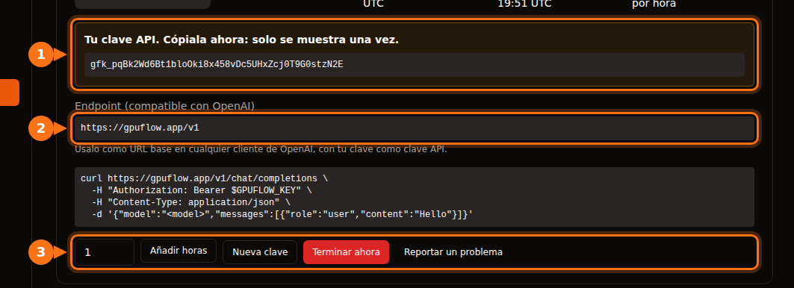

Muchas herramientas de IA te permiten cambiar OpenAI por otro proveedor, siempre que hable la misma API. Siempre necesitas los mismos tres datos:

| Qué | Ejemplo |
| --- | --- |
| **URL base** (también llamada API base, endpoint o host) | `https://gpuflow.app/v1` |
| **Clave API** | `gfk_...` |
| **Nombre del modelo** | `qwen2.5:7b` |

En todo el artículo usamos como ejemplo un alquiler de GPUFlow, pero los pasos son los mismos para cualquier servidor compatible con OpenAI: un Ollama o llama.cpp local, vLLM, OpenRouter y muchos más. Solo tienes que cambiar esos tres valores.

En GPUFlow encontrarás los tres en **Panel → Alquileres Actuales** después de alquilar una GPU:



## Antes de empezar: comprueba el endpoint y el nombre del modelo

Un solo comando te confirma que la clave funciona y cómo se llama el modelo:

```bash
curl https://gpuflow.app/v1/models \
  -H "Authorization: Bearer gfk_your_key"
```

La respuesta enumera los modelos. Copia el `id`, por ejemplo `qwen2.5:7b`, tal cual aparece. Un nombre de modelo incorrecto es el motivo más habitual por el que una aplicación no funciona.

**Ten claro qué admite tu endpoint.** El endpoint de GPUFlow ofrece `/v1/models` y `/v1/chat/completions`, con streaming. No ofrece embeddings, la Responses API (la más reciente) ni generación de imágenes. Algunas funciones de las aplicaciones los necesitan, y te lo indicamos más abajo.

## Aplicaciones de chat

### Open WebUI

1. Abre **Settings → Admin → Connections**.
2. En **Manage OpenAI API Connections**, haz clic en **+ (Add Connection)**.
3. Rellena:
   - **URL:** `https://gpuflow.app/v1`
   - **API Key:** tu clave
4. Haz clic en **Verify Connection** para probarla (guardar no la prueba) y después en **Save**.

Open WebUI lee por su cuenta la lista de modelos desde `/models`. Si lo ejecutas con Docker, también puedes definir `OPENAI_API_BASE_URL` y `OPENAI_API_KEY`, pero solo se leen la primera vez que arranca Open WebUI. Después, cámbialas en la pantalla de administración.

La subida y la búsqueda de documentos en Open WebUI usan por defecto un pequeño modelo de embeddings que se ejecuta en local, así que siguen funcionando. No cambies el motor de embeddings a OpenAI con tu endpoint de chat como URL.

### LibreChat

Añade un endpoint personalizado a `librechat.yaml`:

```yaml
endpoints:
  custom:
    - name: "GPUFlow"
      apiKey: "${GPUFLOW_API_KEY}"
      baseURL: "https://gpuflow.app/v1"
      models:
        default: ["qwen2.5:7b"]
        fetch: true
      titleConvo: true
      titleModel: "qwen2.5:7b"
      modelDisplayLabel: "GPUFlow"
```

Pon tu clave en `.env` como `GPUFLOW_API_KEY=gfk_...`. Usa `apiKey: "user_provided"` si cada usuario debe introducir su propia clave. Con `fetch: true`, LibreChat lee la lista de modelos del endpoint.

La búsqueda en documentos de LibreChat (la RAG API) usa por defecto embeddings de OpenAI. Déjala en OpenAI, Ollama o Hugging Face; no apuntes `RAG_OPENAI_BASEURL` a un endpoint que solo ofrece chat.

### AnythingLLM

1. Abre los ajustes del LLM y elige **Generic OpenAI**.
2. Rellena **Base URL** (`https://gpuflow.app/v1`), **API Key**, **Chat Model Name** (`qwen2.5:7b`), **Token context window** y **Max Tokens**.

Con Docker, esos mismos ajustes son variables de entorno:

```bash
LLM_PROVIDER='generic-openai'
GENERIC_OPEN_AI_BASE_PATH='https://gpuflow.app/v1'
GENERIC_OPEN_AI_MODEL_PREF='qwen2.5:7b'
GENERIC_OPEN_AI_MODEL_TOKEN_LIMIT=32768
GENERIC_OPEN_AI_API_KEY=gfk_your_key
```

Deja el generador de embeddings en **AnythingLLM Default**.

### Jan

1. Abre **Settings → Model Providers** y haz clic en **Add Provider**.
2. Elige **OpenAI-compatible**.
3. Escribe un nombre, la **Base URL** con `/v1` al final y tu **API key**. Haz clic en **Create**.

Jan carga la lista de modelos al guardar. Si no lo hace, añade el nombre del modelo a mano con el botón **+** de la lista de modelos del proveedor.

## Asistentes de programación

### Continue (VS Code y JetBrains)

Añade un modelo a tu `config.yaml`:

```yaml
models:
  - name: GPUFlow Qwen 2.5 7B
    provider: openai
    model: qwen2.5:7b
    apiBase: https://gpuflow.app/v1
    apiKey: ${{ secrets.GPUFLOW_API_KEY }}
    roles:
      - chat
      - edit
      - apply
```

No le asignes los roles `autocomplete` ni `embed`: este endpoint solo ofrece chat, y los embeddings necesitan `/v1/embeddings`. En VS Code, Continue trae un generador de embeddings integrado para buscar en el código. En JetBrains no lo tiene, así que ahí configura un modelo de embeddings aparte.

El modo Agent de Continue necesita un modelo que admita llamadas a herramientas. Añade `capabilities: [tool_use]` solo si sabes que el tuyo las admite.

### Cline

1. Abre los ajustes de Cline.
2. Pon **API Provider** en **OpenAI Compatible**.
3. Rellena **Base URL**, **API Key** y **Model** (`qwen2.5:7b`).
4. En **Model Configuration**, ajusta la ventana de contexto [a la de tu modelo](/es/which-ai-models-fit-your-gpu-vram/).

Una nota sobre **Roo Code**: su documentación dice que solo funciona con modelos que admiten llamadas nativas a herramientas, sin alternativa. Es posible que un endpoint que solo ofrece chat no funcione con él.

## Código

### Las librerías de OpenAI para Python y Node

Python (`pip install openai`):

```python
from openai import OpenAI

client = OpenAI(base_url="https://gpuflow.app/v1", api_key="gfk_your_key")

reply = client.chat.completions.create(
    model="qwen2.5:7b",
    messages=[{"role": "user", "content": "Say hello in five languages."}],
)
print(reply.choices[0].message.content)
```

Node (`npm install openai`):

```js
import OpenAI from "openai";

const client = new OpenAI({ baseURL: "https://gpuflow.app/v1", apiKey: "gfk_your_key" });

const reply = await client.chat.completions.create({
  model: "qwen2.5:7b",
  messages: [{ role: "user", content: "Say hello in five languages." }],
});
console.log(reply.choices[0].message.content);
```

Las dos librerías también leen `OPENAI_BASE_URL` y `OPENAI_API_KEY` del entorno. Ten en cuenta que sus README empiezan ahora con `client.responses.create(...)`. Eso es la Responses API; usa `client.chat.completions.create(...)` como en los ejemplos de arriba.

### LangChain

Python (`pip install -U langchain-openai`):

```python
from langchain_openai import ChatOpenAI

llm = ChatOpenAI(
    model="qwen2.5:7b",
    base_url="https://gpuflow.app/v1",
    api_key="gfk_your_key",
    use_responses_api=False,
)
print(llm.invoke("Name three uses for a GPU.").content)
```

JavaScript (`npm install @langchain/openai @langchain/core`). Primero define tu clave en el entorno, `export OPENAI_API_KEY=gfk_your_key`, y después:

```js
import { ChatOpenAI } from "@langchain/openai";

const llm = new ChatOpenAI({
  model: "qwen2.5:7b",
  configuration: { baseURL: "https://gpuflow.app/v1" },
});
```

LangChain pasa a la Responses API cuando usas ciertas funciones, como las herramientas integradas o la salida de razonamiento. `use_responses_api=False` lo mantiene en Chat Completions.

### LlamaIndex

Usa `OpenAILike` (`pip install llama-index-llms-openai-like`):

```python
from llama_index.llms.openai_like import OpenAILike

llm = OpenAILike(
    model="qwen2.5:7b",
    api_base="https://gpuflow.app/v1",
    api_key="gfk_your_key",
    context_window=32768,
    is_chat_model=True,
    is_function_calling_model=False,
)
```

**Pon `is_chat_model=True`.** Su valor por defecto es `False`, con lo que las peticiones van a `/v1/completions` en lugar de a `/v1/chat/completions`. Para indexar documentos, asigna a `Settings.embed_model` un modelo de embeddings de verdad; LlamaIndex usa por defecto los embeddings de OpenAI.

## Herramientas que no funcionan con un endpoint que solo ofrece chat

- **Codex CLI.** Dejó de admitir Chat Completions a principios de 2026 y ahora solo acepta la Responses API.
- **OpenAI Agents SDK.** Usa la Responses API por defecto. Llama a `set_default_openai_api("chat_completions")` o envuelve tu cliente en `OpenAIChatCompletionsModel`, y desactiva el tracing con `set_tracing_disabled(True)`, porque el tracing necesita una clave de OpenAI.
- **Cualquier cosa que necesite embeddings** del mismo endpoint: búsqueda en documentos, «chatea con tus archivos», búsqueda semántica en el código. Usa el generador de embeddings integrado de la aplicación o un proveedor de embeddings aparte.

## Si sigue sin funcionar

| Lo que ves | Causa habitual |
| --- | --- |
| `404` o «not found» | A la URL base le falta `/v1`, o la aplicación ya añade `/v1` y lo has puesto dos veces. |
| `401` o `invalid_api_key` | Clave incorrecta, o el alquiler ha terminado. En GPUFlow, si la has perdido, haz clic en **Nueva clave** en Alquileres Actuales. |
| «Model not found» | El nombre del modelo no coincide exactamente con el de `/v1/models`. |
| Fallan las peticiones a `/v1/completions` o `/v1/responses` | La aplicación está usando otra API. Busca un ajuste de «chat model» o «chat completions». |

## Artículos relacionados

- [¿GPU por horas o API por token? Lo que cuesta de verdad ejecutar un modelo de 7B–8B](/es/hourly-gpu-vs-per-token-api/)
- [GPUFlow vs Vast.ai vs RunPod vs SaladCloud: cuál encaja con tu trabajo](/es/gpuflow-vs-vast-ai-vs-runpod/)

## Fuentes

Todas consultadas en septiembre de 2026.

- Open WebUI: [proveedores compatibles con OpenAI](https://docs.openwebui.com/getting-started/quick-start/connect-a-provider/starting-with-openai-compatible/), [variables de entorno](https://docs.openwebui.com/reference/env-configuration)
- LibreChat: [endpoints personalizados](https://www.librechat.ai/docs/configuration/librechat_yaml/object_structure/custom_endpoint), [RAG API](https://www.librechat.ai/docs/configuration/rag_api)
- AnythingLLM: [Generic OpenAI](https://docs.anythingllm.com/setup/llm-configuration/cloud/openai-generic)
- Jan: [endpoints personalizados](https://www.jan.ai/docs/desktop/remote-models/custom-endpoint)
- Continue: [proveedor OpenAI](https://docs.continue.dev/customize/model-providers/top-level/openai), [referencia de configuración](https://docs.continue.dev/reference)
- Cline: [OpenAI Compatible](https://docs.cline.bot/provider-config/openai-compatible); Roo Code: [OpenAI Compatible](https://roocodeinc.github.io/Roo-Code/providers/openai-compatible/)
- Librerías de OpenAI: [openai-python](https://github.com/openai/openai-python), [openai-node](https://github.com/openai/openai-node)
- LangChain: [Python](https://docs.langchain.com/oss/python/integrations/chat/openai), [JavaScript](https://docs.langchain.com/oss/javascript/integrations/chat/openai)
- LlamaIndex: [OpenAILike](https://developers.llamaindex.ai/python/framework-api-reference/llms/openai_like/)
- OpenAI Agents SDK: [modelos](https://openai.github.io/openai-agents-python/models/)
- Codex y Chat Completions: [github.com/openai/codex/discussions/7782](https://github.com/openai/codex/discussions/7782)
- API de GPUFlow: [Usar tu clave API](https://docs.gpuflow.app/es/renters/api-quickstart/)
