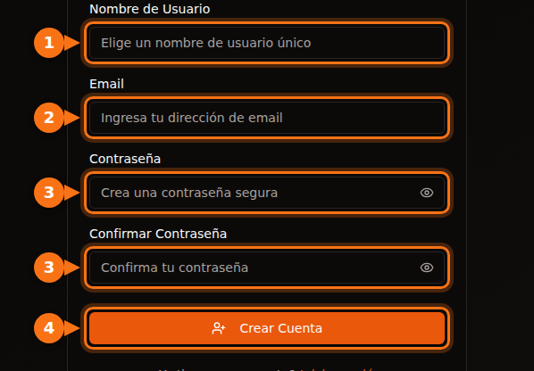
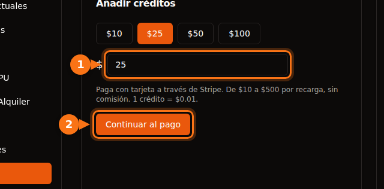

Antes de alquilar tu primera GPU, todas las plataformas te piden algo: una dirección de email, una tarjeta, a veces un número de teléfono y, en las grandes nubes, una solicitud de cuota que puede tardar días. En este artículo recogemos lo que pide cada una, para que elijas una con la que puedas empezar hoy mismo.

Todo se comprobó en septiembre de 2026 en la documentación de las propias plataformas. Las fuentes están al final.

## Comparativa rápida

| Plataforma | Para crear la cuenta | Antes de poder alquilar | Verificación de identidad para quien alquila | Mínimo para empezar |
| --- | --- | --- | --- | --- |
| **GPUFlow** | Email y contraseña, o Google o GitHub | Confirmar tu email, añadir créditos con tarjeta | Ninguna en los pasos para alquilar | Recarga de 10 $, sin comisión |
| **Vast.ai** | Email | Verificar tu email, añadir crédito | No figura en la documentación | Depósito de 5 $ |
| **RunPod** | Email | Añadir crédito | Solo antes del primer pago en criptomonedas | 1 hora de crédito; 100 $ por transacción con tarjeta prepago |
| **SaladCloud** | Cuenta en el portal | Añadir un método de pago a tu organización | No figura en la documentación | Recargas desde 5 $ |
| **Lambda** | Cuenta | Añadir una tarjeta de crédito | No figura en la documentación | Preautorización de 10 $ en la tarjeta, que se devuelve |
| **TensorDock** | Cuenta | Depositar dinero | Las condiciones permiten verificar cuentas | «Desde solo 5 $» |
| **AWS** | Email, verificación por PIN al teléfono, método de pago, CAPTCHA | Solicitar una cuota de GPU: las cuentas nuevas empiezan en 0 | No para la mayoría de las cuentas | Pago por uso |
| **Google Cloud** | Cuenta con facturación | Solicitar cuota de GPU; las cuentas de prueba gratuita no tienen | No para la mayoría de las cuentas | Pago por uso |

«No figura en la documentación» significa que no encontramos ningún requisito de identificación para quien alquila en la documentación de esa plataforma. Aun así, las plataformas pueden pedir verificaciones si algo les parece raro.

## Las plataformas pequeñas: minutos, no días

Vast.ai, RunPod, SaladCloud, TensorDock y GPUFlow son todas de prepago. Primero añades dinero y lo vas gastando por segundo o por minuto. Como no puedes acumular una factura que no hayas pagado, no necesitan comprobar tu solvencia ni tu empresa.

En lo que sí se diferencian:

- **La verificación del email.** Tanto Vast.ai como GPUFlow la exigen antes de que puedas alquilar o añadir créditos. Si el email no llega, mira en la carpeta de spam.
- **Los métodos de pago.**
  - Vast.ai: tarjeta, BitPay, Crypto.com.
  - RunPod: Visa, Mastercard, Amex, criptomonedas y facturación para pagos de más de 5.000 $.
  - SaladCloud: tarjeta, o USDC, USDT y RENDER en Solana.
  - Lambda: solo las principales tarjetas de crédito, y solo en los países admitidos.
  - GPUFlow: tarjetas a través de Stripe.
- **Qué pasa con tu dinero si no lo usas.** El crédito de SaladCloud caduca a los 12 meses de la compra. Los créditos de GPUFlow no caducan.

## Las grandes nubes: cuenta con una solicitud de cuota

AWS y Google Cloud no te frenan en el registro. Te frenan en la GPU.

- **AWS:** la cuota de «Running On-Demand G and VT instances» (la familia de instancias con la NVIDIA L4 y la A10G) empieza en **0 vCPU** en las cuentas nuevas. Para ampliarla, lo solicitas en la consola de Service Quotas. AWS también sube las cuotas automáticamente a medida que la cuenta acumula uso.
- **Google Cloud:** las cuentas de prueba gratuita no tienen cuota de GPU. Cuando el proyecto ya tiene historial de facturación, las solicitudes de cuota se conceden con más facilidad. La cuota es por región, y las GPU interrumpibles (preemptible) necesitan su propia cuota.

Si necesitas una GPU hoy, no empieces con una cuenta nueva de AWS o Google Cloud.

## Registrarse en GPUFlow, paso a paso

GPUFlow está pensado para el caso de «necesito un modelo de IA en cinco minutos». Lo que obtienes es una clave API compatible con OpenAI para una GPU, no una máquina.

1. **Crea una cuenta** en gpuflow.app con un nombre de usuario, tu dirección de email y una contraseña, o con Google o GitHub.

   

2. **Confirma tu email.** Haz clic en el enlace del email que te envía GPUFlow. No puedes añadir créditos hasta que lo hagas.
3. **Añade créditos** en **Panel → Pagos**, de 10 $ a 500 $ con tarjeta a través de Stripe. 1 crédito = 0,01 $, y no hay comisión.

   

4. **Alquila una GPU** durante las horas que quieras y copia tu clave API. [Pagas por segundo](/es/per-second-vs-hourly-gpu-billing/); si terminas antes, el resto vuelve a tus créditos.

La guía completa, con todas las pantallas, está en la documentación: [alquilar una GPU, paso a paso](https://docs.gpuflow.app/es/renters/getting-started/).

## Si lo que quieres es poner tu GPU en alquiler

Las verificaciones de identidad entran en juego cuando cobras. Las empresas de pagos están obligadas a saber a quién envían el dinero.

- **GPUFlow:** para retirar tus ganancias, configuras una cuenta de cobro con Stripe, que verifica tu identidad y te pide tus datos bancarios. Los cobros funcionan en Estados Unidos, Canadá, Reino Unido, Suiza y el Espacio Económico Europeo.
- **Vast.ai:** los hosts cobran a través de Wise, PayPal o Stripe, y esos servicios se encargan de verificar la identidad.
- **Salad:** las recompensas se pagan por PayPal, tarjetas regalo y otras opciones.

Más sobre lo que se gana alquilando tu GPU en [cuánto puedes ganar alquilando tu GPU para gaming](/es/how-much-can-you-earn-renting-out-your-gpu/).

## Antes de pagar: una lista rápida

1. **Confirma primero tu email**, para no quedarte atascado en el paso del pago.
2. **Comprueba que tu país y tu tarjeta están admitidos.** Lambda, por ejemplo, solo acepta pagos desde una lista de países.
3. **Conoce la comisión de tu banco por transacciones en el extranjero.** La mayoría de las plataformas cobran en dólares estadounidenses. [Más sobre los costes ocultos](/es/hidden-fees-in-gpu-rental/).
4. **Empieza con poco.** Añade lo justo para unas horas, prueba y luego añade más.

## Artículos relacionados

- [GPUFlow vs Vast.ai vs RunPod vs SaladCloud: cuál encaja con tu trabajo](/es/gpuflow-vs-vast-ai-vs-runpod/)
- [Cómo usar una clave API compatible con OpenAI en Open WebUI, Continue, LangChain y más](/es/use-openai-compatible-api-key-in-apps/)

## Fuentes

Todas consultadas en septiembre de 2026.

- GPUFlow: [alquilar una GPU, paso a paso](https://docs.gpuflow.app/es/renters/getting-started/), [créditos y facturación](https://docs.gpuflow.app/es/renters/billing/), [cobrar](https://docs.gpuflow.app/es/providers/getting-paid/)
- Vast.ai: [inicio rápido](https://docs.vast.ai/guides/get-started/quickstart.md), [facturación](https://docs.vast.ai/documentation/reference/billing), [cobros de los hosts](https://docs.vast.ai/host/payment.md)
- RunPod: [información de facturación](https://docs.runpod.io/references/billing-information)
- SaladCloud: [configuración de la cuenta](https://docs.salad.com/general/tutorials/account-setup.md), [facturación](https://docs.salad.com/general/explanation/billing.md)
- Lambda: [gestión de la facturación](https://docs.lambda.ai/public-cloud/manage-billing/)
- TensorDock: [GPU en la nube](https://www.tensordock.com/cloud-gpus.html), [condiciones del servicio](https://docs.tensordock.com/legal-information/terms-of-service-tos)
- AWS: [crear una cuenta](https://docs.aws.amazon.com/accounts/latest/reference/manage-acct-creating.html), [cuotas de instancias On-Demand](https://docs.aws.amazon.com/AWSEC2/latest/UserGuide/ec2-on-demand-instances.html)
- Google Cloud: [solución de problemas de cuota de GPU](https://docs.cloud.google.com/deep-learning-vm/docs/troubleshooting)
- Recompensas de Salad: [canje por PayPal](https://support.salad.com/rewards/redeeming-your-rewards/how-to-redeem-paypal/)
