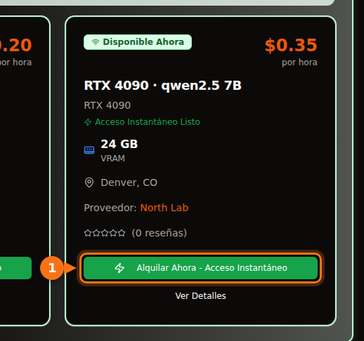

Con la cuantización de 4 bits que Ollama trae por defecto, un modelo de 7B u 8B necesita una tarjeta de 8 GB, los modelos de 12B a 14B necesitan 12 GB (16 GB si quieres prompts largos) y los de 27B a 32B necesitan 24 GB. Un modelo de 70B a 4 bits ocupa 43 GB, es decir, 48 GB de VRAM o más.

La versión larga importa porque el tamaño de la descarga no es toda la factura. El contexto que usas también ocupa memoria, y un modelo que parece caber puede acabar a medias en la CPU y varias veces más lento. Abajo están la fórmula que uso, qué significan las etiquetas de cuantización y una tabla de modelos abiertos actuales con sus tamaños de descarga reales en la biblioteca de Ollama. Los tamaños y las especificaciones se revisaron en septiembre de 2026; las fuentes están al final.

## Respuesta rápida según la VRAM

| VRAM | Tarjetas típicas | Qué funciona entero en la GPU (4 bits) |
| --- | --- | --- |
| 8 GB | RTX 4060, RTX 5060, RTX 3070 | Modelos de 7B a 8B: Llama 3.1 8B, Qwen3 8B, Mistral 7B |
| 12 GB | RTX 3060 12 GB, RTX 4070, RTX 5070 | Modelos de 12B a 14B con contexto corto; de 7B a 8B en Q8_0 |
| 16 GB | RTX 4060 Ti 16 GB, RTX 4080, RTX 5080 | 14B con contexto largo, gpt-oss 20B |
| 24 GB | RTX 3090, RTX 4090 | De 24B a 32B: Mistral Small 3.2, Gemma 3 27B, Qwen3 32B |
| 32 GB | RTX 5090 | 32B con contexto largo, modelos de mezcla de expertos de 35B |
| De 48 a 80 GB | L40S (48 GB), H100 (80 GB) | 70B a 4 bits, gpt-oss 120B en 80 GB |

Las memorias de las tarjetas salen de las fichas técnicas de NVIDIA. Algunas tarjetas existen en dos versiones: la RTX 3060 con 12 GB y con 8 GB, y la RTX 4060 Ti y la RTX 5060 Ti con 16 GB y con 8 GB. Comprueba cuál compras o alquilas.

## Cómo estimar la VRAM que necesita un modelo

Mientras un modelo te responde, en la memoria de la GPU hay tres cosas:

1. **Los pesos.** Parámetros × bits por peso ÷ 8 = bytes.
2. **La caché KV.** El modelo guarda las claves y los valores de cada token de la conversación para no recalcularlos. Por token son 2 × capas × cabezas KV × tamaño de cabeza × 2 bytes (con la caché de 16 bits por defecto). Multiplícalo por la longitud de contexto.
3. **La sobrecarga.** El contexto CUDA, los búferes temporales y el propio motor. Yo cuento con 1 GB, más o menos. Varía según el motor y la configuración, así que tómalo como una regla práctica, no como una especificación.

El número de capas y de cabezas está en el `config.json` de cada modelo en Hugging Face.

### Ejemplo práctico: Qwen 2.5 14B en una tarjeta de 16 GB

Qwen 2.5 14B tiene 14.700 millones de parámetros, 48 capas, 8 cabezas KV y un tamaño de cabeza de 128 (5.120 de tamaño oculto ÷ 40 cabezas de atención).

- **Pesos en Q4_K_M:** llama.cpp da para Q4_K_M unos 4,89 bits por peso. 14.700 millones × 4,89 ÷ 8 = 8,99 GB. La descarga de `qwen2.5:14b` en Ollama ocupa 9,0 GB, así que la cuenta coincide con el archivo real.
- **Caché KV por token:** 2 × 48 × 8 × 128 × 2 bytes = 196.608 bytes, unos 0,2 MB.
- **Caché KV para todo el contexto:** 4.096 tokens = 0,8 GB. 16.384 tokens = 3,2 GB. 32.768 tokens = 6,4 GB.
- **Total:** 9,0 + 0,8 + 1 = 10,8 GB con 4K de contexto. 9,0 + 3,2 + 1 = 13,2 GB con 16K. 9,0 + 6,4 + 1 = 16,4 GB con 32K, que ya no cabe en una tarjeta de 16 GB.

<figure>
<svg viewBox="0 0 720 340" role="img" aria-labelledby="d1-title" xmlns="http://www.w3.org/2000/svg" font-family="system-ui, sans-serif" font-size="15">
<title id="d1-title">Qué llena la VRAM con Qwen 2.5 14B en Q4_K_M en una tarjeta de 16 GB: pesos, caché KV con tres longitudes de contexto y sobrecarga</title>
<rect x="0" y="0" width="720" height="340" fill="#ffffff"/>
<rect x="150" y="20" width="16" height="16" rx="3" fill="#6366f1"/>
<text x="172" y="33" fill="#1e1b4b">Pesos 9,0 GB</text>
<rect x="330" y="20" width="16" height="16" rx="3" fill="#a5b4fc"/>
<text x="352" y="33" fill="#1e1b4b">Caché KV</text>
<rect x="510" y="20" width="16" height="16" rx="3" fill="#e2e8f0"/>
<text x="532" y="33" fill="#1e1b4b">Sobrecarga ~1 GB</text>
<line x1="582.0" y1="66" x2="582.0" y2="278" stroke="#f97316" stroke-width="2" stroke-dasharray="5 4"/>
<text x="576.0" y="60" text-anchor="end" fill="#f97316" font-weight="600">Tarjeta de 16 GB</text>
<text x="140" y="106" text-anchor="end" fill="#1e1b4b">Contexto 4K</text>
<rect x="150" y="80" width="243.0" height="40" fill="#6366f1"/>
<text x="271.5" y="106" text-anchor="middle" fill="#ffffff">pesos</text>
<rect x="393.0" y="80" width="21.6" height="40" fill="#a5b4fc"/>
<rect x="414.6" y="80" width="27.0" height="40" fill="#e2e8f0"/>
<text x="449.6" y="106" fill="#16a34a" font-weight="600">10,8 GB</text>
<text x="140" y="180" text-anchor="end" fill="#1e1b4b">Contexto 16K</text>
<rect x="150" y="154" width="243.0" height="40" fill="#6366f1"/>
<text x="271.5" y="180" text-anchor="middle" fill="#ffffff">pesos</text>
<rect x="393.0" y="154" width="86.4" height="40" fill="#a5b4fc"/>
<text x="436.2" y="180" text-anchor="middle" fill="#1e1b4b">3,2</text>
<rect x="479.4" y="154" width="27.0" height="40" fill="#e2e8f0"/>
<text x="514.4" y="180" fill="#16a34a" font-weight="600">13,2 GB</text>
<text x="140" y="254" text-anchor="end" fill="#1e1b4b">Contexto 32K</text>
<rect x="150" y="228" width="243.0" height="40" fill="#6366f1"/>
<text x="271.5" y="254" text-anchor="middle" fill="#ffffff">pesos</text>
<rect x="393.0" y="228" width="172.8" height="40" fill="#a5b4fc"/>
<text x="479.4" y="254" text-anchor="middle" fill="#1e1b4b">6,4</text>
<rect x="565.8" y="228" width="27.0" height="40" fill="#e2e8f0"/>
<text x="600.8" y="254" fill="#f97316" font-weight="600">16,4 GB</text>
<line x1="150" y1="278" x2="690" y2="278" stroke="#64748b"/>
<line x1="150.0" y1="278" x2="150.0" y2="283" stroke="#64748b"/>
<text x="150.0" y="300" text-anchor="middle" fill="#64748b">0</text>
<line x1="258.0" y1="278" x2="258.0" y2="283" stroke="#64748b"/>
<text x="258.0" y="300" text-anchor="middle" fill="#64748b">4</text>
<line x1="366.0" y1="278" x2="366.0" y2="283" stroke="#64748b"/>
<text x="366.0" y="300" text-anchor="middle" fill="#64748b">8</text>
<line x1="474.0" y1="278" x2="474.0" y2="283" stroke="#64748b"/>
<text x="474.0" y="300" text-anchor="middle" fill="#64748b">12</text>
<line x1="582.0" y1="278" x2="582.0" y2="283" stroke="#64748b"/>
<text x="582.0" y="300" text-anchor="middle" fill="#64748b">16</text>
<line x1="690.0" y1="278" x2="690.0" y2="283" stroke="#64748b"/>
<text x="690.0" y="300" text-anchor="middle" fill="#64748b">20</text>
<text x="420.0" y="326" text-anchor="middle" fill="#64748b">GB de VRAM</text>
</svg>
<figcaption>Qwen 2.5 14B en Q4_K_M en una tarjeta de 16 GB. Los pesos se quedan en 9,0 GB; la caché KV crece con el contexto hasta que, con 32K tokens, el total pasa de 16 GB. La sobrecarga es una regla práctica de 1 GB.</figcaption>
</figure>

De aquí salen dos cosas. La primera: el contexto que configuras puede costar tanta memoria como el modelo. Llama 3.1 8B (32 capas, 8 cabezas KV, tamaño de cabeza 128) necesita 131.072 bytes de caché KV por token, así que su contexto completo de 128K necesitaría 17,2 GB solo de caché, unas tres veces y media su descarga de 4,9 GB. La segunda: el tamaño de la caché KV por token cambia mucho de un modelo a otro. Qwen 2.5 7B tiene solo 4 cabezas KV y 28 capas, así que necesita 57.344 bytes por token, menos de la mitad que Llama 3.1 8B. Mira la configuración antes de dar nada por hecho.

### Qué hace Ollama con el contexto por defecto

Ollama elige una longitud de contexto por defecto según la VRAM que encuentra: 4K tokens por debajo de 24 GiB, 32K tokens de 24 a 48 GiB y 256K a partir de 48 GiB. Puedes cambiarla con la variable de entorno `OLLAMA_CONTEXT_LENGTH`, y `ollama ps` muestra en su columna CONTEXT el contexto realmente reservado. Hay dos ajustes más que cambian la cuenta:

- `OLLAMA_NUM_PARALLEL` (por defecto 1): la documentación de Ollama dice que las peticiones en paralelo multiplican el tamaño del contexto por el número de peticiones en paralelo. Cuatro huecos en paralelo son cuatro veces la caché KV.
- `OLLAMA_KV_CACHE_TYPE`: `q8_0` usa más o menos la mitad de memoria que la caché `f16` por defecto, y `q4_0` una cuarta parte. Requiere tener activada la flash attention.

## Qué significan los niveles de cuantización

Los modelos abiertos se publican con precisión de 16 bits (las configuraciones enlazadas abajo indican bfloat16): dos bytes por parámetro. La cuantización guarda los pesos en menos bits. En los archivos GGUF, el formato que usan Ollama y llama.cpp, las etiquetas significan más o menos esto:

| Etiqueta | Bits por peso | Tamaño de Llama 3.1 8B | Perplejidad en Llama 3 8B (menos es mejor) |
| --- | --- | --- | --- |
| F16 | 16,0 | 14,96 GiB | 6,233 |
| Q8_0 | 8,50 | 7,95 GiB | 6,234 |
| Q6_K | 6,56 | 6,14 GiB | 6,253 |
| Q5_K_M | 5,70 | 5,33 GiB | 6,289 |
| Q4_K_M | 4,89 | 4,58 GiB | 6,407 |
| Q3_K_M | 4,00 | 3,74 GiB | 6,888 |
| Q2_K_S / Q2_K | 2,97 | 2,78 GiB | 9,752 (Q2_K) |

Los bits por peso y los tamaños salen del README de quantize de llama.cpp (Llama 3.1 8B). La perplejidad sale del README de perplexity de llama.cpp (Llama 3 8B, Wikitext). Los tipos «K» son las k-quants de llama.cpp, que mezclan precisiones a lo largo del modelo; `_S`, `_M` y `_L` son mezclas pequeña, mediana y grande.

Lo que dicen los números: Q8_0 es prácticamente sin pérdidas (perplejidad de 6,234 frente a 6,233). Q4_K_M cuesta alrededor de un 3 % de perplejidad, y el mismo README indica que su token siguiente más probable coincide con el del modelo a precisión completa el 91,9 % de las veces. Q3 es claramente peor, y Q2 se desmorona.

La perplejidad no es lo mismo que la utilidad, así que viene bien que un estudio de Uygar Kurt de enero de 2026 pasara Llama 3.1 8B Instruct por benchmarks de razonamiento, conocimiento, seguimiento de instrucciones y veracidad en cada nivel de llama.cpp. La media sin ponderar fue 69,47 en F16, 69,41 en Q8_0, 69,36 en Q5_K_M y 69,15 en Q4_K_M. Por eso casi todo el mundo, Ollama incluido, usa Q4_K_M por defecto: el archivo ocupa menos de un tercio que en FP16 a cambio de una pérdida que rara vez notarás. En Ollama, la etiqueta sin más es esa versión de 4 bits: `qwen3:8b` y `qwen3:8b-q4_K_M` ocupan 5,2 GB los dos, y `phi4:14b` y `phi4:14b-q4_K_M`, 9,1 GB los dos.

Mi regla: coge el modelo más grande que quepa en Q4_K_M antes que un modelo más pequeño en Q8_0. Un 14B en Q4 suele ganar a un 7B en Q8, y los archivos ocupan más o menos lo mismo. Sube a Q5 o Q8 cuando te sobre memoria y la tarea sea sensible a errores pequeños, como el código o la extracción exacta de datos.

Las etiquetas más recientes de Ollama también incluyen formatos como `qat` (las versiones de Gemma entrenadas con cuantización), `nvfp4` y `mxfp8`. gpt-oss lo publica la propia OpenAI en MXFP4, con 4,25 bits por parámetro para los pesos de mezcla de expertos.

## Qué modelos caben: tamaños y niveles de VRAM

La tabla recoge modelos abiertos actuales de la biblioteca de Ollama en septiembre de 2026 con sus tamaños de descarga. La columna «4 bits» es el tamaño de la etiqueta por defecto. En la mayoría de modelos es el mismo archivo que la etiqueta `q4_K_M`; cuando la versión por defecto es otra, la tabla da los dos tamaños (la de Mistral Nemo ocupa 7,1 GB y su `q4_K_M`, 7,5 GB). «Tarjeta mínima» significa que el modelo, más 1 GB de sobrecarga y un contexto de 4K a 8K, cabe entero en la GPU. ¿Quieres contexto largo? Sube un nivel.

| Modelo | Etiqueta de Ollama | Tamaño a 4 bits | Tamaño en Q8_0 | Tarjeta mínima (4 bits / Q8_0) |
| --- | --- | --- | --- | --- |
| Mistral 7B v0.3 | [`mistral:7b`](https://ollama.com/library/mistral/tags) | 4,4 GB | 7,7 GB | 8 GB / 12 GB |
| Qwen 2.5 7B | [`qwen2.5:7b`](https://ollama.com/library/qwen2.5/tags) | 4,7 GB | 8,1 GB | 8 GB / 12 GB |
| DeepSeek-R1 destilado 7B (Qwen 2.5) | [`deepseek-r1:7b`](https://ollama.com/library/deepseek-r1/tags) | 4,7 GB | no comprobado | 8 GB |
| Llama 3.1 8B | [`llama3.1:8b`](https://ollama.com/library/llama3.1/tags) | 4,9 GB | 8,5 GB | 8 GB / 12 GB |
| Qwen3 8B | [`qwen3:8b`](https://ollama.com/library/qwen3/tags) | 5,2 GB | 8,9 GB | 8 GB / 12 GB |
| DeepSeek-R1-0528 (Qwen3 8B) | [`deepseek-r1:8b`](https://ollama.com/library/deepseek-r1/tags) | 5,2 GB | no comprobado | 8 GB |
| Qwen3.5 9B | [`qwen3.5:9b`](https://ollama.com/library/qwen3.5/tags) | 6,6 GB | 11 GB | 8 GB, solo con contexto corto / 16 GB |
| Mistral Nemo 12B | [`mistral-nemo:12b`](https://ollama.com/library/mistral-nemo/tags) | 7,1 GB (q4_K_M: 7,5 GB) | 13 GB | 12 GB / 16 GB |
| Gemma 4 12B | [`gemma4:12b`](https://ollama.com/library/gemma4/tags) | 7,6 GB | 13 GB | 12 GB / 16 GB |
| Gemma 3 12B | [`gemma3:12b`](https://ollama.com/library/gemma3/tags) | 8,1 GB | 13 GB | 12 GB / 16 GB |
| Qwen 2.5 14B | [`qwen2.5:14b`](https://ollama.com/library/qwen2.5/tags) | 9,0 GB | 16 GB | 12 GB / 24 GB |
| DeepSeek-R1 destilado 14B (Qwen 2.5) | [`deepseek-r1:14b`](https://ollama.com/library/deepseek-r1/tags) | 9,0 GB | no comprobado | 12 GB |
| Phi-4 14B | [`phi4:14b`](https://ollama.com/library/phi4/tags) | 9,1 GB | 16 GB | 12 GB / 24 GB |
| Qwen3 14B | [`qwen3:14b`](https://ollama.com/library/qwen3/tags) | 9,3 GB | 16 GB | 12 GB / 24 GB |
| gpt-oss 20B (MoE) | [`gpt-oss:20b`](https://ollama.com/library/gpt-oss/tags) | 14 GB (MXFP4) | n/d | 16 GB |
| Mistral Small 3.2 24B | [`mistral-small3.2:24b`](https://ollama.com/library/mistral-small3.2/tags) | 15 GB | 26 GB | 24 GB / 32 GB |
| Gemma 3 27B | [`gemma3:27b`](https://ollama.com/library/gemma3/tags) | 17 GB | 30 GB | 24 GB / 48 GB |
| Qwen3.5 27B | [`qwen3.5:27b`](https://ollama.com/library/qwen3.5/tags) | 17 GB | 30 GB | 24 GB / 48 GB |
| Qwen3.6 27B | [`qwen3.6:27b`](https://ollama.com/library/qwen3.6/tags) | 18 GB (q4_K_M: 17 GB) | 30 GB | 24 GB / 48 GB |
| Gemma 4 26B (MoE, 3,8B activos) | [`gemma4:26b`](https://ollama.com/library/gemma4/tags) | 19 GB (q4_K_M: 18 GB) | 28 GB | 24 GB / 32 GB |
| Qwen3 30B-A3B (MoE) | [`qwen3:30b`](https://ollama.com/library/qwen3/tags) | 19 GB | no comprobado | 24 GB |
| Gemma 4 31B | [`gemma4:31b`](https://ollama.com/library/gemma4/tags) | 20 GB | 34 GB | 24 GB / 48 GB |
| Qwen3 32B | [`qwen3:32b`](https://ollama.com/library/qwen3/tags) | 20 GB | 35 GB | 24 GB / 48 GB |
| Qwen 2.5 32B | [`qwen2.5:32b`](https://ollama.com/library/qwen2.5/tags) | 20 GB | 35 GB | 24 GB / 48 GB |
| DeepSeek-R1 destilado 32B (Qwen 2.5) | [`deepseek-r1:32b`](https://ollama.com/library/deepseek-r1/tags) | 20 GB | no comprobado | 24 GB |
| Qwen3.6 35B-A3B (MoE) | [`qwen3.6:35b`](https://ollama.com/library/qwen3.6/tags) | 23 GB (q4_K_M: 24 GB) | 39 GB | 32 GB / 48 GB |
| Qwen3.5 35B-A3B (MoE) | [`qwen3.5:35b`](https://ollama.com/library/qwen3.5/tags) | 24 GB | 39 GB | 32 GB / 48 GB |
| Llama 3.3 70B | [`llama3.3:70b`](https://ollama.com/library/llama3.3/tags) | 43 GB | 75 GB | 48 GB, justo / 80 GB, justo |
| Qwen 2.5 72B | [`qwen2.5:72b`](https://ollama.com/library/qwen2.5/tags) | 47 GB | no comprobado | 80 GB |
| gpt-oss 120B (MoE) | [`gpt-oss:120b`](https://ollama.com/library/gpt-oss/tags) | 65 GB (MXFP4) | n/d | 80 GB |

Para el nivel he usado el tamaño de la etiqueta por defecto, porque es lo que descarga `ollama pull` con el nombre corto.

Los niveles de 24 GB y 32 GB tienen trampa. El contexto por defecto de Ollama salta de 4K a 32K a partir de 24 GiB, así que a un modelo de 20 GB en una RTX 4090 le puede tocar una caché de 32K que no cabe a su lado. Si `ollama ps` muestra una parte en CPU, pon un contexto más pequeño. Y no juzgues un modelo por el número de su nombre: el modelo para dispositivos de Gemma 4, `gemma4:e4b` (4.500 millones de parámetros efectivos), es una descarga de 9,6 GB, más grande que `gemma4:12b` con 7,6 GB. Mira el tamaño.

<figure>
<svg viewBox="0 0 720 546" role="img" aria-labelledby="d2-title" xmlns="http://www.w3.org/2000/svg" font-family="system-ui, sans-serif" font-size="14">
<title id="d2-title">Tamaño de descarga de modelos populares de Ollama con su cuantización de 4 bits por defecto, comparado con 8, 12, 16, 24 y 32 GB de VRAM</title>
<rect x="0" y="0" width="720" height="546" fill="#ffffff"/>
<line x1="320.0" y1="58" x2="320.0" y2="486" stroke="#f97316" stroke-width="2" stroke-dasharray="5 4"/>
<text x="320.0" y="50" text-anchor="middle" fill="#f97316" font-weight="600">8 GB</text>
<line x1="380.0" y1="58" x2="380.0" y2="486" stroke="#f97316" stroke-width="2" stroke-dasharray="5 4"/>
<text x="380.0" y="50" text-anchor="middle" fill="#f97316" font-weight="600">12 GB</text>
<line x1="440.0" y1="58" x2="440.0" y2="486" stroke="#f97316" stroke-width="2" stroke-dasharray="5 4"/>
<text x="440.0" y="50" text-anchor="middle" fill="#f97316" font-weight="600">16 GB</text>
<line x1="560.0" y1="58" x2="560.0" y2="486" stroke="#f97316" stroke-width="2" stroke-dasharray="5 4"/>
<text x="560.0" y="50" text-anchor="middle" fill="#f97316" font-weight="600">24 GB</text>
<line x1="680.0" y1="58" x2="680.0" y2="486" stroke="#f97316" stroke-width="2" stroke-dasharray="5 4"/>
<text x="680.0" y="50" text-anchor="middle" fill="#f97316" font-weight="600">32 GB</text>
<text x="20" y="50" fill="#64748b">Niveles de VRAM</text>
<text x="190" y="84" text-anchor="end" fill="#1e1b4b">mistral:7b</text>
<rect x="200" y="70" width="66.0" height="18" rx="3" fill="#6366f1"/>
<text x="272.0" y="84" fill="#1e1b4b">4,4</text>
<text x="190" y="110" text-anchor="end" fill="#1e1b4b">qwen2.5:7b</text>
<rect x="200" y="96" width="70.5" height="18" rx="3" fill="#6366f1"/>
<text x="276.5" y="110" fill="#1e1b4b">4,7</text>
<text x="190" y="136" text-anchor="end" fill="#1e1b4b">llama3.1:8b</text>
<rect x="200" y="122" width="73.5" height="18" rx="3" fill="#6366f1"/>
<text x="279.5" y="136" fill="#1e1b4b">4,9</text>
<text x="190" y="162" text-anchor="end" fill="#1e1b4b">qwen3:8b</text>
<rect x="200" y="148" width="78.0" height="18" rx="3" fill="#6366f1"/>
<text x="284.0" y="162" fill="#1e1b4b">5,2</text>
<text x="190" y="188" text-anchor="end" fill="#1e1b4b">qwen3.5:9b</text>
<rect x="200" y="174" width="99.0" height="18" rx="3" fill="#6366f1"/>
<text x="297.0" y="188" text-anchor="end" fill="#ffffff">6,6</text>
<text x="190" y="214" text-anchor="end" fill="#1e1b4b">gemma4:12b</text>
<rect x="200" y="200" width="114.0" height="18" rx="3" fill="#6366f1"/>
<text x="324.0" y="214" fill="#1e1b4b">7,6</text>
<text x="190" y="240" text-anchor="end" fill="#1e1b4b">gemma3:12b</text>
<rect x="200" y="226" width="121.5" height="18" rx="3" fill="#6366f1"/>
<text x="327.5" y="240" fill="#1e1b4b">8,1</text>
<text x="190" y="266" text-anchor="end" fill="#1e1b4b">qwen2.5:14b</text>
<rect x="200" y="252" width="135.0" height="18" rx="3" fill="#6366f1"/>
<text x="341.0" y="266" fill="#1e1b4b">9,0</text>
<text x="190" y="292" text-anchor="end" fill="#1e1b4b">qwen3:14b</text>
<rect x="200" y="278" width="139.5" height="18" rx="3" fill="#6366f1"/>
<text x="345.5" y="292" fill="#1e1b4b">9,3</text>
<text x="190" y="318" text-anchor="end" fill="#1e1b4b">gpt-oss:20b</text>
<rect x="200" y="304" width="210.0" height="18" rx="3" fill="#6366f1"/>
<text x="416.0" y="318" fill="#1e1b4b">14</text>
<text x="190" y="344" text-anchor="end" fill="#1e1b4b">mistral-small3.2:24b</text>
<rect x="200" y="330" width="225.0" height="18" rx="3" fill="#6366f1"/>
<text x="423.0" y="344" text-anchor="end" fill="#ffffff">15</text>
<text x="190" y="370" text-anchor="end" fill="#1e1b4b">gemma3:27b</text>
<rect x="200" y="356" width="255.0" height="18" rx="3" fill="#6366f1"/>
<text x="461.0" y="370" fill="#1e1b4b">17</text>
<text x="190" y="396" text-anchor="end" fill="#1e1b4b">qwen3.5:27b</text>
<rect x="200" y="382" width="255.0" height="18" rx="3" fill="#6366f1"/>
<text x="461.0" y="396" fill="#1e1b4b">17</text>
<text x="190" y="422" text-anchor="end" fill="#1e1b4b">gemma4:31b</text>
<rect x="200" y="408" width="300.0" height="18" rx="3" fill="#6366f1"/>
<text x="506.0" y="422" fill="#1e1b4b">20</text>
<text x="190" y="448" text-anchor="end" fill="#1e1b4b">qwen3:32b</text>
<rect x="200" y="434" width="300.0" height="18" rx="3" fill="#6366f1"/>
<text x="506.0" y="448" fill="#1e1b4b">20</text>
<text x="190" y="474" text-anchor="end" fill="#1e1b4b">qwen3.6:35b</text>
<rect x="200" y="460" width="345.0" height="18" rx="3" fill="#6366f1"/>
<text x="539.0" y="474" text-anchor="end" fill="#ffffff">23</text>
<line x1="200" y1="486" x2="680" y2="486" stroke="#64748b" stroke-width="1"/>
<line x1="200.0" y1="486" x2="200.0" y2="491" stroke="#64748b"/>
<text x="200.0" y="506" text-anchor="middle" fill="#64748b">0</text>
<line x1="260.0" y1="486" x2="260.0" y2="491" stroke="#64748b"/>
<text x="260.0" y="506" text-anchor="middle" fill="#64748b">4</text>
<line x1="320.0" y1="486" x2="320.0" y2="491" stroke="#64748b"/>
<text x="320.0" y="506" text-anchor="middle" fill="#64748b">8</text>
<line x1="380.0" y1="486" x2="380.0" y2="491" stroke="#64748b"/>
<text x="380.0" y="506" text-anchor="middle" fill="#64748b">12</text>
<line x1="440.0" y1="486" x2="440.0" y2="491" stroke="#64748b"/>
<text x="440.0" y="506" text-anchor="middle" fill="#64748b">16</text>
<line x1="500.0" y1="486" x2="500.0" y2="491" stroke="#64748b"/>
<text x="500.0" y="506" text-anchor="middle" fill="#64748b">20</text>
<line x1="560.0" y1="486" x2="560.0" y2="491" stroke="#64748b"/>
<text x="560.0" y="506" text-anchor="middle" fill="#64748b">24</text>
<line x1="620.0" y1="486" x2="620.0" y2="491" stroke="#64748b"/>
<text x="620.0" y="506" text-anchor="middle" fill="#64748b">28</text>
<line x1="680.0" y1="486" x2="680.0" y2="491" stroke="#64748b"/>
<text x="680.0" y="506" text-anchor="middle" fill="#64748b">32</text>
<text x="440.0" y="530" text-anchor="middle" fill="#64748b">Tamaño de descarga en GB (etiqueta por defecto de Ollama, 4 bits)</text>
</svg>
<figcaption>Tamaños de descarga de las etiquetas de 4 bits por defecto de Ollama, a escala frente a las memorias de VRAM habituales. Para caber, una barra tiene que acabar bastante a la izquierda de la línea: deja 1 GB para la sobrecarga y sitio para la caché KV.</figcaption>
</figure>

## Los modelos de mezcla de expertos cambian un poco las cosas

gpt-oss, Gemma 4 26B y los modelos «A3B» de Qwen son modelos de mezcla de expertos (MoE). Para cada token solo se ejecutan unos pocos expertos: Gemma 4 26B tiene 25.200 millones de parámetros, pero solo 3.800 millones activos. La regla de memoria no cambia, porque todos los pesos tienen que estar cargados en algún sitio. Lo que cambia es la velocidad cuando no caben todos. Como cada token solo toca una fracción de los pesos, un modelo MoE que se desborda a la RAM del sistema se ralentiza mucho menos que uno denso del mismo tamaño. Las mediciones de la sección siguiente muestran lo grande que es esa diferencia.

## Qué pasa cuando un modelo no cabe

Ollama no se niega a cargar un modelo demasiado grande. Pone en la GPU todas las capas que caben y ejecuta el resto en la CPU desde la RAM del sistema. `ollama ps` te dice en qué caso estás: `100% GPU` significa que todo cabe, `100% CPU` que no cabe nada, y una mezcla como `48%/52% CPU/GPU` significa un reparto.

Un reparto sale caro, porque generar cada token obliga a leer todos los pesos activos, y la RAM del sistema es mucho más lenta que la VRAM. Una serie de pruebas con llama.cpp en una RTX 4080 de 16 GB, publicada por Rost en DEV Community en abril de 2026, lo muestra con claridad:

| Modelo (cuantización, tamaño de archivo) | Contexto | Carga GPU / CPU | Tokens por segundo |
| --- | --- | --- | --- |
| Qwen3.5 27B denso (IQ3_XXS, 11,5 GB) | 32K | 98 % / 100 % | 45,1 |
| Qwen3.5 27B denso | 64K | 45 % / 410 % | 22,7 |
| Qwen3.5 27B denso | 128K | 16 % / 625 % | 9,6 |
| Qwen3.5 35B-A3B MoE (IQ3_S, 13,6 GB) | 64K | 88 % / 115 % | 136,8 |
| Qwen3.5 122B-A10B MoE (IQ3_XXS, 44,7 GB) | 32K | 30 % / 480 % | 21,8 |

Una cifra de CPU alta con una de GPU baja significa que la mayor parte del trabajo ha pasado a la CPU; el autor interpreta los números igual.

El mismo modelo denso perdió la mitad de su velocidad al pasar de 32K a 64K de contexto, solo porque la caché KV más grande sacó capas de la GPU, y perdió casi un 80 % con 128K. El modelo MoE de 122B, un archivo de 44,7 GB en una tarjeta de 16 GB, siguió funcionando a unos 22 tokens por segundo porque por cada token solo hay 10.000 millones de parámetros activos. En modelos densos, «en parte en CPU» equivale a «varias veces más lento». En modelos MoE puede ser un intercambio aceptable.

Si te encuentras con un reparto, estas son las soluciones, de menos a más cara: baja el contexto, cuantiza la caché KV a `q8_0`, elige una cuantización más pequeña del mismo modelo (Q4_K_M en lugar de Q5), elige un modelo más pequeño o pasa a una tarjeta con más memoria.

## Tarjetas de 32 GB y de centro de datos

La RTX 5090 tiene 32 GB. Eso te da un modelo de 32B a 4 bits con contexto largo, o los modelos MoE 35B-A3B de 23 a 24 GB con sitio para la caché. No te llega para 70B: `llama3.3:70b` ocupa 43 GB incluso a 4 bits.

Para 70B necesitas 48 GB o más. Una L40S tiene 48 GB, que alojan el archivo de 43 GB con poco margen para contexto. Una H100 SXM tiene 80 GB (la H100 NVL tiene 94 GB), donde caben Llama 3.3 70B a 4 bits con contexto largo, gpt-oss 120B (65 GB; la página de Ollama dice que cabe en una sola GPU de 80 GB) o Llama 3.3 70B en Q8_0 (75 GB) con contexto corto. Qwen3.5 122B, con 81 GB, ya se pasa de una sola tarjeta de 80 GB.

## Alquilar en lugar de comprar: cómo revisar un anuncio de GPUFlow

Si alquilas una GPU en GPUFlow, el proveedor sirve los modelos desde su propia máquina (con Ollama, que el instalador de GPUFlow configura por defecto) y decide qué modelos están instalados. Tú no descargas modelos: recibes una clave API compatible con OpenAI para esa GPU, no una shell. El instalador de GPUFlow usa `qwen2.5:7b` por defecto, y las etiquetas que aparecen en el instalador y en la documentación son `qwen2.5:0.5b`, `deepseek-r1:1.5b`, `qwen2.5:7b`, `deepseek-r1:7b`, `llama3.1:8b` y `qwen2.5:14b`. Los proveedores pueden instalar otros.

En el [mercado](https://gpuflow.app/es/marketplace), cada tarjeta muestra la GPU, su VRAM y el precio por hora, y la descripción del proveedor indica los modelos que sirve. La documentación de GPUFlow da una versión algo más prudente de la misma regla: un modelo de 7B funciona bien con 8 GB o más, y uno de 14B con 16 GB o más. Cuando tengas la clave, `GET /v1/models` devuelve un nombre de modelo; si la descripción menciona más modelos, también puedes usar esos nombres en el campo `model`.

Dos cosas que conviene saber. GPUFlow no fija ningún límite de contexto propio, así que se aplican los valores por defecto de Ollama en la máquina del proveedor, salvo que él los haya cambiado. Y un modelo que el proveedor no tiene instalado no está disponible para ti, así que elige el anuncio primero por el modelo que necesitas y después por la GPU. [Conectar la clave a Open WebUI, Continue o LangChain](/es/use-openai-compatible-api-key-in-apps/) funciona igual que con cualquier API de estilo OpenAI.

## Artículos relacionados

- [Cómo usar una clave API compatible con OpenAI en Open WebUI, Continue, LangChain y más](/es/use-openai-compatible-api-key-in-apps/)
- [¿GPU por horas o API por token? Lo que cuesta de verdad ejecutar un modelo de 7B–8B](/es/hourly-gpu-vs-per-token-api/)
- [Ollama vs vLLM vs TGI: benchmark de inferencia en una RTX 4090](/es/ollama-vs-vllm-vs-tgi-rtx-4090-benchmark/)
- [Comparativa de precios de alquiler de GPU en 2026](/es/gpu-rental-pricing-comparison-2026/)

## Fuentes

Todas revisadas en septiembre de 2026.

- Tamaños de descarga en la biblioteca de Ollama: [mistral](https://ollama.com/library/mistral/tags), [qwen2.5](https://ollama.com/library/qwen2.5/tags), [qwen3](https://ollama.com/library/qwen3/tags), [qwen3.5](https://ollama.com/library/qwen3.5/tags), [qwen3.6](https://ollama.com/library/qwen3.6/tags), [llama3.1](https://ollama.com/library/llama3.1/tags), [llama3.3](https://ollama.com/library/llama3.3/tags), [deepseek-r1](https://ollama.com/library/deepseek-r1/tags), [página del modelo DeepSeek-R1 (bases de los destilados)](https://ollama.com/library/deepseek-r1), [gemma3](https://ollama.com/library/gemma3/tags), [gemma4](https://ollama.com/library/gemma4/tags), [página del modelo Gemma 4 (MoE y parámetros activos)](https://ollama.com/library/gemma4), [mistral-nemo](https://ollama.com/library/mistral-nemo/tags), [mistral-small3.2](https://ollama.com/library/mistral-small3.2/tags), [phi4](https://ollama.com/library/phi4/tags), [gpt-oss](https://ollama.com/library/gpt-oss/tags), [página del modelo gpt-oss (MXFP4, memoria)](https://ollama.com/library/gpt-oss), [índice de la biblioteca de Ollama](https://ollama.com/library)
- Arquitectura de los modelos: [ficha del modelo Qwen2.5-14B-Instruct](https://huggingface.co/Qwen/Qwen2.5-14B-Instruct), [config.json de Qwen2.5-14B-Instruct](https://huggingface.co/Qwen/Qwen2.5-14B-Instruct/blob/main/config.json), [config.json de Qwen2.5-7B-Instruct](https://huggingface.co/Qwen/Qwen2.5-7B-Instruct/blob/main/config.json), [config.json de Llama-3.1-8B-Instruct (réplica de unsloth)](https://huggingface.co/unsloth/Llama-3.1-8B-Instruct/blob/main/config.json)
- Ajustes de contexto y memoria de Ollama: [documentación de Ollama, Context length](https://docs.ollama.com/context-length), [FAQ de Ollama](https://docs.ollama.com/faq)
- Tamaños de cuantización y bits por peso: [README de quantize de llama.cpp](https://github.com/ggml-org/llama.cpp/blob/master/tools/quantize/README.md)
- Perplejidad por cuantización: [README de perplexity de llama.cpp](https://github.com/ggml-org/llama.cpp/blob/master/tools/perplexity/README.md)
- Estudio de benchmarks de cuantización: [Uygar Kurt, Which Quantization Should I Use? (arXiv 2601.14277)](https://arxiv.org/abs/2601.14277)
- Mediciones con descarga a CPU: [Rost, benchmarks de LLM con 16 GB de VRAM en llama.cpp (DEV Community, abril de 2026)](https://dev.to/rosgluk/16-gb-vram-llm-benchmarks-with-llamacpp-speed-and-context-3hgg)
- Memoria de las GPU: [comparativa de la serie RTX 50 de NVIDIA](https://www.nvidia.com/en-us/geforce/graphics-cards/compare/), [serie RTX 40](https://www.nvidia.com/en-us/geforce/graphics-cards/40-series/), [serie RTX 30](https://www.nvidia.com/en-us/geforce/graphics-cards/30-series/), [L40S](https://www.nvidia.com/en-us/data-center/l40s/), [H100](https://www.nvidia.com/en-us/data-center/h100/)
- GPUFlow: [Alquilar una GPU, paso a paso](https://docs.gpuflow.app/es/renters/getting-started/), [guía rápida de la API](https://docs.gpuflow.app/es/renters/api-quickstart/), [primeros pasos para proveedores](https://docs.gpuflow.app/es/providers/getting-started/)
