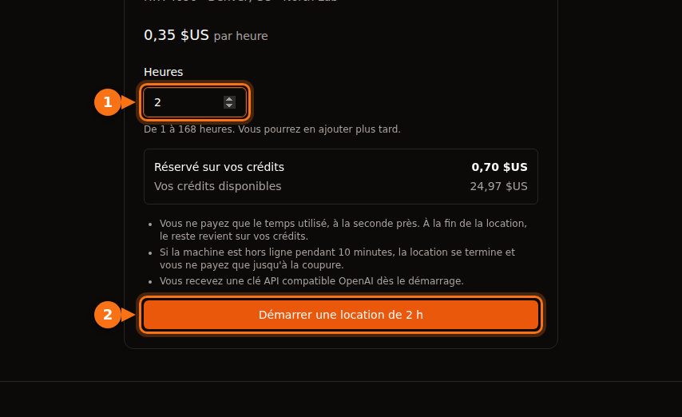

Le prix à l'heure affiché sur une offre de GPU couvre le temps GPU, et rien d'autre. Sur la plupart des plateformes, vous payez aussi l'espace disque (souvent plus cher machine arrêtée que machine en marche), le transfert de données sur certaines places de marché, le temps de mise en route et d'inactivité que le compteur traite comme du vrai travail, et les frais de change de votre banque. Dans l'exemple chiffré plus bas, un mois budgété à 13,60 $ de temps sur RTX 4090 finit en facture de 42,23 $.

Rien de tout cela n'est caché exprès. C'est simplement facile à rater quand on compare les plateformes sur le prix d'appel. Tout ce qui suit a été vérifié dans la documentation et les pages de tarifs de chaque plateforme en septembre 2026 ; les liens sont en fin d'article. Pour les prix d'appel eux-mêmes, voir le [comparatif des prix de location de GPU](/fr/gpu-rental-pricing-comparison-2026/).

## Les frais supplémentaires, plateforme par plateforme

| Coût | Vast.ai | RunPod | Lambda | AWS EC2 | GPUFlow |
| --- | --- | --- | --- | --- | --- |
| Unité de facturation | À la seconde | À la seconde | À la minute | À la seconde, minimum 60 s | À la seconde, minimum 1 min |
| Stockage à l'arrêt | Facturé au tarif de l'hôte | Volume disque 0,20 $/Go/mois | Systèmes de fichiers facturés par Gio/mois | EBS toujours facturé | Aucun |
| Transfert de données | Tarif de l'hôte, à chaque octet | Gratuit | Gratuit | Sortant : 100 Go/mois gratuits, puis au Go | Aucun |
| Pour commencer | Dépôt minimum de 5 $ | 1 heure de crédit ; 100 $ pour les cartes prépayées | Préautorisation de 10 $ sur la carte | Un moyen de paiement | Recharge de 10 $ ; réservation bloquée en totalité |
| Solde à zéro | Arrêt, puis destruction | Arrêt ; sans volume réseau, données perdues | Facturé chaque semaine après usage | n.d. | Impossible en cours de location |

GPUFlow peut se passer des lignes stockage et transfert parce qu'il loue autre chose : une clé API compatible OpenAI pour des modèles d'IA qui tournent déjà sur le GPU d'un fournisseur, pas une machine sur laquelle vous vous connectez. La contrepartie : impossible d'y exécuter votre propre code, d'entraîner ou de fine-tuner. S'il vous faut une machine, ce sont les quatre autres colonnes qui vous concernent.

## Le stockage, surtout à l'arrêt

Sur toute plateforme qui vous loue une machine ou un conteneur, vos fichiers vivent sur un disque, et ce disque coûte de l'argent tant qu'il existe.

- **RunPod** facture 0,10 $ par Go et par mois le disque de conteneur et le volume disque pendant que le pod tourne. Quand vous arrêtez le pod, le disque de conteneur est effacé et ne coûte plus rien, mais le volume disque passe à 0,20 $ par Go et par mois. Les volumes réseau coûtent 0,07 $ par Go et par mois sous 1 To et 0,05 $ au-delà, pod en marche ou non. Les plans d'économie ne couvrent que le calcul GPU ; le stockage est facturé au tarif standard.
- **Vast.ai** facture le stockage « pour chaque seconde d'existence de votre instance », dans tous les états sauf hors ligne. Sa documentation ne prend pas de gants : « Arrêter une instance n'évite pas les frais de stockage. » C'est l'hôte qui fixe le tarif.
- **AWS** ne facture ni le calcul ni le transfert de données d'une instance arrêtée, mais « des frais s'appliquent au stockage des volumes Amazon EBS », et une Elastic IP associée à une instance arrêtée reste facturée. Un volume gp3 en us-east-1 coûte environ 0,08 $ par Go et par mois.
- **Lambda** facture les systèmes de fichiers par Gio utilisé et par mois, par tranches d'une heure.

Un volume disque de 200 Go sur un pod RunPod arrêté coûte 200 × 0,20 $ = 40 $ par mois, même si vous ne redémarrez jamais le pod. C'est plus que 100 heures de RTX 4090 au prix du Community Cloud de RunPod.

Tomber à court de crédit aggrave les choses. Quand un solde RunPod atteint 0 $, les pods s'arrêtent, et « les pods sans volume réseau sont supprimés, et leurs données ne peuvent pas être récupérées ». Vast.ai arrête aussi les instances et, sans carte enregistrée, « vos instances et les données stockées seront détruites » après un court délai de grâce. Un volume oublié continue donc soit de vous coûter, soit disparaît avec votre travail dessus.

Ce que je fais : supprimer les volumes le jour où un projet se termine, ne garder que ce dont j'ai encore besoin sur un petit volume réseau, et conserver une copie de tout ce qui compte ailleurs que sur la plateforme GPU.

## Le transfert de données

Télécharger un modèle de 15 Go et envoyer un jeu de données peut faire transiter des dizaines de gigaoctets par session.

- **Vast.ai** facture « la bande passante pour chaque octet envoyé ou reçu par l'instance, quel que soit son état ». Chaque hôte fixe ses propres prix d'envoi et de téléchargement, et la documentation prévient que cela « peut peser lourd sur le coût total des charges de travail gourmandes en données ». Regardez-le sur l'offre avant de louer.
- **RunPod** indique que les pods n'ont « aucun frais d'entrée ni de sortie ».
- **Lambda** : « Vous n'êtes pas facturé pour les données entrantes ou sortantes. »
- **AWS** : les données entrantes sont gratuites. Les données sortantes vers Internet sont gratuites pour les 100 premiers Go par mois, tous services et régions confondus, puis facturées au Go selon un barème dégressif. Chaque adresse IPv4 publique coûte 0,005 $ de l'heure, utilisée ou non, soit 3,60 $ sur un mois de 720 heures.

## Dépôts, préautorisations et crédit prépayé

La plupart des plateformes GPU fonctionnent en prépayé : vous achetez du crédit, puis vous le dépensez. L'argent que vous y laissez dormir est lui aussi un coût, surtout quand il ne peut pas revenir.

- **Vast.ai** : dépôt minimum de 5 $, par carte, BitPay ou Crypto.com. Le crédit non dépensé acheté par carte peut être remboursé sur demande via le chat du site ; le crédit dépensé, non.
- **RunPod** : il vous faut au moins une heure de crédit pour le pod choisi, et les cartes prépayées doivent déposer au moins 100 $ par transaction. Les crédits ne sont ni remboursables ni retirables.
- **Lambda** fonctionne à l'inverse : elle facture chaque semaine l'usage de la semaine écoulée, et fait une préautorisation de 10 $ quand vous ajoutez une carte, restituée en quelques jours. Elle n'accepte que les grandes cartes de crédit ; les cartes prépayées et de débit sont refusées.
- **SaladCloud** : recharges de 5 $ à 10 000 $, et le crédit expire 12 mois après l'achat.
- **GPUFlow** : recharges de 10 $ à 500 $ par carte via Stripe, sans frais, et les crédits n'expirent pas. Au démarrage d'une location, c'est le montant total réservé qui est bloqué sur vos crédits, pas un petit dépôt. Réservez 10 heures à 0,40 $ et 4,00 $ restent bloqués jusqu'à la fin de la location ; ce que vous n'avez pas utilisé revient à ce moment-là. Les crédits achetés ne peuvent pas être encaissés, et les remboursements sur carte ne concernent qu'un débit en double ou erroné, des crédits jamais reçus, ou une obligation légale, dans un délai de 60 jours.

Un crédit qui expire, ou qui dort sur une plateforme que vous n'utilisez plus, est de l'argent dépensé. Rechargez pour le travail prévu ce mois-ci, pas pour l'année.

## Mise en route et temps d'inactivité

Une machine louée facture du temps, pas du travail. Deux sortes de temps coûtent autant que le vrai travail et ne produisent rien.

### La mise en route

Le compteur démarre avec la machine. Chez Lambda, « la facturation commence dès que vous lancez une instance et qu'elle passe les contrôles de santé ». Installer des bibliothèques, récupérer une image de conteneur et télécharger un modèle, tout cela se fait sur du temps payé. À 0,34 $ de l'heure, 15 minutes de mise en route font environ 0,09 $. Peu de chose une fois, mais répétez-le chaque jour pendant un mois et cela fait quelques heures de GPU.

Deux choses aident : partir d'un modèle de déploiement ou d'une image qui contient déjà votre environnement, et garder les modèles sur un volume pour ne les télécharger qu'une fois (à mettre en balance avec le coût de stockage vu plus haut).

Sur GPUFlow, il n'y a aucune étape de mise en route de votre côté : le fournisseur a déjà installé les modèles sur la machine, et vous obtenez la clé API dès le démarrage de la location.

### L'inactivité

Lambda le dit clairement : « Les instances sont facturées tant qu'elles tournent, qu'elles soient activement utilisées ou non. » Google Cloud dit la même chose d'une VM inactive restée à l'état RUNNING. Laisser un pod allumé toute la nuit pour qu'il soit prêt le matin coûte une nuit de GPU.

Azure tend un piège supplémentaire. Une VM simplement « Stopped » (arrêtée depuis le système d'exploitation, par exemple) reste facturée pour ses cœurs. Elle doit passer en « Stopped (Deallocated) » depuis le portail ou la CLI pour que la facturation du calcul s'arrête.

GPUFlow n'y échappe pas non plus : vous payez jusqu'à ce que vous cliquiez sur **Terminer maintenant** ou que le temps réservé soit écoulé. Terminer plus tôt ne coûte rien et la partie non utilisée du montant bloqué vous revient : la solution consiste simplement à terminer la location quand vous avez fini. [Comment fonctionne la facturation GPUFlow](https://docs.gpuflow.app/fr/renters/billing/).

## Incréments et minimums de facturation

La facturation à la seconde est courante aujourd'hui, mais les détails diffèrent :

| Plateforme | Façon dont le temps est facturé |
| --- | --- |
| Vast.ai | À la seconde |
| RunPod, pods | À la seconde (la page de présentation des pods parle encore de facturation à la minute) |
| RunPod, serverless | À la seconde, arrondi au-dessus, démarrage du worker et délai d'inactivité inclus (5 secondes par défaut) |
| Lambda | Par tranches d'une minute |
| AWS EC2 (Linux) | À la seconde, minimum 60 secondes |
| Google Cloud | À la seconde après un minimum d'une minute |
| Azure | Minutes complètes |
| GPUFlow | À la seconde, minimum d'une minute, arrondi au cent supérieur |

Pour les longues tâches, ces différences sont du bruit. Elles comptent pour de nombreuses sessions courtes et pour le serverless, où le démarrage et le délai d'inactivité sont facturés en plus des requêtes. Si vous envoyez des requêtes courtes espacées dans le temps, ces à-côtés peuvent coûter plus que les requêtes elles-mêmes. [Facturation à la seconde ou à l'heure](/fr/per-second-vs-hourly-gpu-billing/) détaille les calculs.

## Les instances interruptibles

La capacité interruptible (spot) est moins chère, parfois beaucoup moins, mais elle peut vous être reprise.

- Vast.ai annonce des instances interruptibles « souvent 50 % moins chères, voire plus, que les instances à la demande ».
- Chez AWS en septembre 2026, une p5.4xlarge (un H100) coûtait 2,62 $ de l'heure en spot contre 6,88 $ à la demande.
- Chez TensorDock, le stockage est facturé au tarif standard en plus de votre enchère, et vous continuez à le payer quand vous êtes surenchéri. Les hôtes fixent une enchère minimale, généralement autour de 50 % du prix à la demande.

Le coût caché, c'est le travail refait. Si votre tâche ne peut pas reprendre depuis un checkpoint, une seule interruption peut effacer l'économie. Enregistrez des checkpoints assez souvent pour que perdre le dernier intervalle ne fasse pas mal.

## Les frais de votre banque

Presque toutes les plateformes GPU, GPUFlow compris, facturent en dollars américains. Si votre carte est dans une autre devise, votre banque peut ajouter ses propres frais :

- Les frais sur les opérations à l'étranger vont généralement de 1 % à 3 %, et certaines banques les appliquent aux achats auprès de commerçants étrangers même quand le prix est affiché en dollars américains.
- La plupart des cartes de crédit canadiennes prélèvent environ 2,5 % sur les achats dans une autre devise.
- Au Brésil, la taxe IOF sur les achats internationaux par carte est de 3,5 % depuis juillet 2025.

Sur une recharge de 100 $, cela fait de 1 $ à 3,50 $ que vous ne verrez pas sur la facture de la plateforme. Une carte sans frais à l'étranger en supprime l'essentiel.

## Un exemple chiffré : 0,34 $ de l'heure, 42 $ par mois

Voici un mois réaliste sur une RTX 4090 du Community Cloud de RunPod à 0,34 $ de l'heure, payé avec une carte de crédit canadienne :

- 40 heures de travail effectif : 40 × 0,34 $ = 13,60 $. C'est le chiffre que tout le monde budgète.
- 20 sessions avec 15 minutes de mise en route chacune, soit 5 heures : 5 × 0,34 $ = 1,70 $.
- Deux nuits où le pod est resté allumé, 10 heures chacune : 20 × 0,34 $ = 6,80 $.
- Un volume disque de 100 Go conservé tout le mois. Il tourne 65 des 720 heures du mois et reste arrêté les 655 autres : 100 × (0,10 $ × 65/720 + 0,20 $ × 655/720) = environ 19,10 $.
- Sous-total 41,20 $, plus 2,5 % de frais à l'étranger : 1,03 $.

Total : 42,23 $, environ 3,1 fois le travail GPU prévu. RunPod ne facture pas le transfert de données : chez un hôte Vast.ai avec un prix de bande passante, il y aurait une ligne de plus.

<figure>
<svg viewBox="0 0 720 300" role="img" aria-labelledby="d1-title" xmlns="http://www.w3.org/2000/svg" font-family="system-ui, sans-serif" font-size="15">
<title id="d1-title">Diagramme en barres empilées : un mois budgété à 13,60 dollars de temps sur RTX 4090 devient une facture de 42,23 dollars après la mise en route, les nuits d'inactivité, le stockage disque et les frais de carte</title>
<rect x="0" y="0" width="720" height="300" fill="#ffffff"/>
<text x="20" y="28" fill="#1e1b4b" font-weight="600">Un mois sur une RTX 4090 à 0,34 $ de l'heure</text>
<line x1="130" y1="50" x2="130" y2="170" stroke="#e2e8f0" stroke-width="1"/>
<text x="130" y="190" text-anchor="middle" fill="#64748b" font-size="13">0 $</text>
<line x1="250" y1="50" x2="250" y2="170" stroke="#e2e8f0" stroke-width="1"/>
<text x="250" y="190" text-anchor="middle" fill="#64748b" font-size="13">10 $</text>
<line x1="370" y1="50" x2="370" y2="170" stroke="#e2e8f0" stroke-width="1"/>
<text x="370" y="190" text-anchor="middle" fill="#64748b" font-size="13">20 $</text>
<line x1="490" y1="50" x2="490" y2="170" stroke="#e2e8f0" stroke-width="1"/>
<text x="490" y="190" text-anchor="middle" fill="#64748b" font-size="13">30 $</text>
<line x1="610" y1="50" x2="610" y2="170" stroke="#e2e8f0" stroke-width="1"/>
<text x="610" y="190" text-anchor="middle" fill="#64748b" font-size="13">40 $</text>
<text x="120" y="84" text-anchor="end" fill="#1e1b4b">Prévu</text>
<rect x="130" y="62" width="163.2" height="34" rx="3" fill="#6366f1"/>
<text x="301.2" y="84" fill="#1e1b4b">13,60 $</text>
<text x="120" y="144" text-anchor="end" fill="#1e1b4b">Facturé</text>
<rect x="130" y="122" width="163.2" height="34" fill="#6366f1"/>
<rect x="293.2" y="122" width="20.4" height="34" fill="#eef2ff" stroke="#6366f1" stroke-width="1.5"/>
<rect x="313.6" y="122" width="81.6" height="34" fill="#f97316"/>
<rect x="395.2" y="122" width="229.2" height="34" fill="#64748b"/>
<rect x="624.4" y="122" width="12.4" height="34" fill="#1e1b4b"/>
<text x="644.8" y="144" fill="#1e1b4b" font-weight="600">42,23 $</text>
<line x1="130" y1="50" x2="130" y2="170" stroke="#64748b" stroke-width="1.5"/>
<rect x="20" y="209" width="16" height="16" fill="#6366f1"/>
<text x="44" y="222" fill="#1e1b4b">Travail GPU : 13,60 $</text>
<rect x="250" y="209" width="16" height="16" fill="#eef2ff" stroke="#6366f1" stroke-width="1.5"/>
<text x="274" y="222" fill="#1e1b4b">Mise en route : 1,70 $</text>
<rect x="480" y="209" width="16" height="16" fill="#f97316"/>
<text x="504" y="222" fill="#1e1b4b">Nuits inactives : 6,80 $</text>
<rect x="20" y="245" width="16" height="16" fill="#64748b"/>
<text x="44" y="258" fill="#1e1b4b">Volume disque : 19,10 $</text>
<rect x="250" y="245" width="16" height="16" fill="#1e1b4b"/>
<text x="274" y="258" fill="#1e1b4b">Frais de carte : 1,03 $</text>
</svg>
<figcaption>L'exemple de cette section, à l'échelle : 40 heures de vrai travail GPU à 0,34 $ de l'heure, plus 5 heures de mise en route, deux nuits oubliées, un volume disque de 100 Go conservé tout le mois et 2,5 % de frais de carte. Le travail GPU représente moins d'un tiers de la facture.</figcaption>
</figure>

Le plus gros poste n'est pas du tout le GPU : c'est un disque resté à l'arrêt 91 % du mois. Le remède n'a rien de passionnant : supprimez ou réduisez le volume, et arrêtez le pod quand vous arrêtez de travailler.

### Une liste de vérification avant de louer

1. Additionnez le temps GPU et le stockage sur toute la durée où vous garderez les fichiers, au tarif à l'arrêt.
2. Vérifiez le prix de la bande passante sur l'offre si la plateforme en a un, et estimez ce que vous allez télécharger.
3. Comptez le temps de mise en route comme du temps payé.
4. Sachez comment vous cesserez de payer : terminer la location, arrêter ou désallouer la machine, supprimer le volume.
5. Sachez ce que deviennent vos données si le solde tombe à zéro.
6. Vérifiez les frais à l'étranger de votre carte.

Si ce qu'il vous faut est un modèle d'IA à appeler depuis votre code, et non une machine pour faire tourner votre propre logiciel, une location via API supprime entièrement les lignes stockage, transfert et mise en route. [GPU à l'heure ou API au token ?](/fr/hourly-gpu-vs-per-token-api/) compare cette option au paiement par token, et [GPUFlow, Vast.ai, RunPod et SaladCloud comparés](/fr/gpuflow-vs-vast-ai-vs-runpod/) indique quelle plateforme convient à quelle tâche. Pour l'entraînement ou tout ce qui demande une machine complète, cette liste est ce qui garde la facture proche du prix à l'heure.

## Sources

- RunPod : [tarifs des pods et stockage](https://docs.runpod.io/pods/pricing), [page des tarifs](https://www.runpod.io/pricing), [présentation des pods](https://docs.runpod.io/pods/overview), [tarifs serverless](https://docs.runpod.io/serverless/pricing), [informations de facturation](https://docs.runpod.io/references/billing-information), [prix de la RTX 4090](https://www.runpod.io/gpu-models/rtx-4090)
- Vast.ai : [tarifs](https://docs.vast.ai/guides/instances/pricing.md), [facturation](https://docs.vast.ai/documentation/reference/billing), [démarrage rapide (dépôt minimum)](https://docs.vast.ai/guides/get-started/quickstart.md)
- Lambda : [facturation](https://docs.lambda.ai/public-cloud/billing/), [gérer la facturation](https://docs.lambda.ai/public-cloud/manage-billing/)
- SaladCloud : [facturation](https://docs.salad.com/general/explanation/billing.md)
- TensorDock : [instances spot](https://docs.tensordock.com/virtual-machines/spot-instances)
- AWS : [tarification EC2 à la demande](https://aws.amazon.com/ec2/pricing/on-demand/), [fonctionnement de l'arrêt et du démarrage](https://docs.aws.amazon.com/AWSEC2/latest/UserGuide/how-ec2-instance-stop-start-works.html), [tarification VPC (IPv4 publique)](https://aws.amazon.com/vpc/pricing/), [prix de la p5.4xlarge via Vantage](https://instances.vantage.sh/aws/ec2/p5.4xlarge?region=us-east-1), prix gp3 : [guide des prix EBS de CloudBurn](https://cloudburn.io/blog/amazon-ebs-pricing)
- Google Cloud : [tarification des instances de VM](https://cloud.google.com/compute/vm-instance-pricing)
- Azure : [tarification et FAQ des VM Linux](https://azure.microsoft.com/en-us/pricing/details/virtual-machines/linux/)
- Frais de carte : [Experian](https://www.experian.com/blogs/ask-experian/what-is-a-foreign-transaction-fee/), [NerdWallet Canada](https://www.nerdwallet.com/ca/p/best/credit-cards/best-no-foreign-transaction-fee-credit-cards), IOF au Brésil : [Wise Brésil](https://wise.com/br/blog/iof-cartao-internacional)
- GPUFlow : [facturation](https://docs.gpuflow.app/fr/renters/billing/), [premiers pas](https://docs.gpuflow.app/fr/renters/getting-started/), [place de marché](https://gpuflow.app/fr/marketplace)

Tous vérifiés en septembre 2026.
