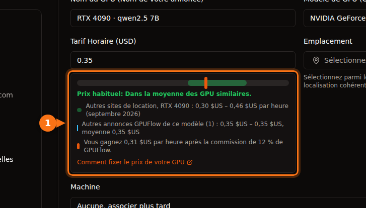

Si vous avez un GPU gaming qui reste inactif la plus grande partie de la journée, vous pouvez le mettre en location sur une place de marché et être payé à l'heure. Que cela vaille la peine ou non dépend de quatre chiffres :

1. **Ce que paient les locataires** par heure pour votre carte.
2. **Ce que garde la plateforme.**
3. **Ce que vous coûte l'électricité** pendant qu'elle tourne.
4. **Le nombre d'heures par jour où elle est réellement louée.**

Les trois premiers se trouvent facilement. Le quatrième, personne ne peut vous le garantir : nous donnons donc une fourchette. Tous les prix ci-dessous ont été vérifiés en septembre 2026 ; les sources sont en fin d'article.

## 1. Ce que paient les locataires

Voici les prix à la demande courants par heure sur les sites de location de GPU (Vast.ai, RunPod, Salad, SimplePod, TensorDock, Hyperstack, Lambda) en septembre 2026 :

| GPU | Prix courant à l'heure | Milieu de fourchette |
| --- | --- | --- |
| RTX 3060 12 Go | 0,05 $ – 0,08 $ | 0,065 $ |
| RTX 4070 | 0,07 $ – 0,15 $ | 0,11 $ |
| RTX 3090 | 0,11 $ – 0,31 $ | 0,21 $ |
| RTX 4080 | 0,23 $ – 0,27 $ | 0,25 $ |
| RTX 4090 | 0,30 $ – 0,46 $ | 0,38 $ |
| RTX 5090 | 0,41 $ – 0,69 $ | 0,55 $ |

La mémoire compte autant que la vitesse. Une carte de 24 Go comme la 3090 ou la 4090 peut faire tourner des modèles d'IA plus gros qu'une carte de 12 ou 16 Go, et les locataires paient pour cela.

## 2. Ce que garde la plateforme

| Plateforme | Part | Versements |
| --- | --- | --- |
| GPUFlow | Garde 12 %, vous touchez 88 % | Sur votre compte bancaire via Stripe. Minimum 25 $, 2,50 $ par retrait. |
| Vast.ai | Selon Vast, les prix affichés sont en général environ 25 % au-dessus de ce que gagnent les hôtes | Wise, PayPal ou Stripe. Minimum 20 $, facturation hebdomadaire. |
| Salad | Non publiée | PayPal, cartes cadeaux, jeux et autres |

Les configurations diffèrent aussi. Les hôtes Vast.ai tournent sous Ubuntu, et les locataires obtiennent des conteneurs sur la machine de l'hôte avec un accès SSH ou Jupyter. Salad fonctionne sous Windows 10 ou 11. Sur GPUFlow, vous lancez une seule commande sur un ordinateur Linux avec systemd ; les locataires n'accèdent à vos modèles d'IA que par une API, jamais par un shell sur votre machine. [Ce à quoi les locataires ont accès, ou pas](https://docs.gpuflow.app/fr/providers/security/).

## 3. Ce que coûte l'électricité

La formule : **consommation en kW × votre prix du kWh = coût par heure.**

Pour la consommation, nous prenons la puissance totale officielle de chaque carte. C'est à peu près le maximum que la carte elle-même consommera ; pendant la génération de texte par IA, c'est souvent moins. Le reste du PC s'y ajoute. Le plus honnête est de mesurer : GPUFlow affiche la consommation de votre GPU en direct dans **Mes machines**, et un wattmètre branché sur la prise mesure la consommation du PC entier.

| GPU | Puissance totale |
| --- | --- |
| RTX 3060 | 170 W |
| RTX 4070 | 200 W |
| RTX 3090 | 350 W |
| RTX 4080 | 320 W |
| RTX 4090 | 450 W |
| RTX 5090 | 575 W |

Ce que coûte en électricité une heure de RTX 4090 à 450 W :

| Où | Prix pour un particulier | Une heure à 450 W |
| --- | --- | --- |
| États-Unis (prévision moyenne 2026) | 18,2 ¢/kWh | environ 0,08 $ |
| Canada | 0,170 $ CA/kWh | environ 0,08 $ CA |
| Royaume-Uni (plafond tarifaire oct.–déc. 2026) | 26,32 p/kWh | environ 11,8 p |
| Allemagne | 0,3869 €/kWh | environ 0,17 € |
| France | 0,2561 €/kWh | environ 0,12 € |

Aux États-Unis, l'électricité absorbe environ un quart de ce que rapporte une 4090 par heure louée. En Allemagne, la même heure coûte environ 0,17 € : vérifiez votre propre tarif avant de fixer un prix.

## 4. Le calcul complet

Par heure louée au prix du milieu de fourchette, avec la part de 88 % de GPUFlow et l'électricité au tarif moyen américain, carte à pleine puissance :

| GPU | Vous touchez (88 %) | Électricité | Reste par heure louée | 4 h/jour (120 h/mois) | 12 h/jour (360 h/mois) |
| --- | --- | --- | --- | --- | --- |
| RTX 3060 12 Go | 0,057 $ | 0,031 $ | **0,026 $** | 3,15 $ | 9,45 $ |
| RTX 4070 | 0,097 $ | 0,036 $ | **0,060 $** | 7,25 $ | 21,74 $ |
| RTX 3090 | 0,185 $ | 0,064 $ | **0,121 $** | 14,53 $ | 43,60 $ |
| RTX 4080 | 0,220 $ | 0,058 $ | **0,162 $** | 19,41 $ | 58,23 $ |
| RTX 4090 | 0,334 $ | 0,082 $ | **0,253 $** | 30,30 $ | 90,90 $ |
| RTX 5090 | 0,484 $ | 0,105 $ | **0,379 $** | 45,52 $ | 136,57 $ |

Trois choses que ce tableau ne prend pas en compte :

- **Le temps d'attente.** Votre PC doit être allumé et en ligne pour que les locataires le trouvent. Pendant qu'il attend, il consomme quand même. Mesurez votre PC au repos et déduisez aussi cette consommation.
- **L'usure.** Les ventilateurs et la pâte thermique vieillissent plus vite sous des charges prolongées. Gardez le boîtier bien ventilé et surveillez la température.
- **Les impôts.** Les revenus de location sont des revenus. Leur imposition dépend de votre pays de résidence.

## Ce que disent les chiffres

- **Les RTX 3090, 4080, 4090 et 5090** peuvent rapporter une somme intéressante, à condition d'être louées plusieurs heures par jour. La 3090 offre le meilleur rapport : 24 Go de mémoire pour une consommation modeste.
- **Les RTX 3060 et 4070** rapportent très peu à l'heure. À 3 $ par mois, une 3060 mettrait environ huit mois à atteindre le minimum de retrait de 25 $ de GPUFlow. Cela ne vaut le coup que si votre électricité est bon marché ou si le PC est allumé de toute façon.
- **Le taux d'occupation décide de tout.** La même 4090 rapporte 30 $ ou 91 $ par mois selon qu'elle est louée 4 ou 12 heures par jour. Un prix juste et une machine fiable, toujours en ligne, attirent plus de locations qu'une remise de quelques centimes.

## Comment obtenir plus d'heures louées

1. **Commencez dans la moitié basse de la fourchette.** Les locataires comparent. Vous pourrez augmenter le prix dès que les locations arrivent.
2. **Restez en ligne.** Un GPU hors ligne ne peut pas être loué. Sur GPUFlow, les locataires peuvent cliquer sur **Me notifier quand en ligne** sur un GPU hors ligne ; vous recevez un e-mail quand quelqu'un attend.
3. **Proposez des modèles populaires.** Indiquez dans votre annonce les modèles que vous faites tourner, par exemple `qwen2.5:7b` ou `llama3.1:8b`. Les locataires les recherchent.
4. **Faites le point au bout d'une semaine.** Loué la plupart du temps ? Augmentez un peu le prix. Aucune location ? Baissez-le un peu.

Sur GPUFlow, le formulaire d'annonce montre où se situe votre prix par rapport aux autres sites de location et aux autres annonces GPUFlow pour la même carte, ainsi que ce que vous gagnez par heure après commission :

## Où fonctionnent les versements GPUFlow

GPUFlow verse les gains via Stripe sur des comptes bancaires **aux États-Unis, au Canada, au Royaume-Uni, en Suisse et dans l'Espace économique européen**. Si vous vivez ailleurs, vous pouvez quand même proposer un GPU et dépenser vos gains en louant d'autres GPU, mais vous ne pouvez pas encore les retirer sur un compte bancaire. Les gains sont retenus 7 jours (14 jours pour les comptes de moins de 30 jours) avant de pouvoir être retirés. [Être payé sur GPUFlow](https://docs.gpuflow.app/fr/providers/getting-paid/).

## Faites le calcul avec vos propres chiffres

**(prix à l'heure × 0,88) − (watts ÷ 1 000 × prix du kWh) = ce qui reste par heure louée**

Multipliez ensuite par le nombre d'heures que vous pouvez raisonnablement espérer. Si le résultat est de quelques dollars par mois, cela ne justifie probablement pas l'usure du matériel. S'il se compte en dizaines de dollars, cela vaut la peine d'essayer pendant un mois et de regarder les vrais chiffres.

Pour commencer, consultez [Mettre votre GPU en ligne](https://docs.gpuflow.app/fr/providers/getting-started/) et [Fixer le prix de votre GPU](https://docs.gpuflow.app/fr/providers/pricing/).

## Articles liés

- [GPUFlow, Vast.ai, RunPod ou SaladCloud : quelle plateforme choisir selon votre usage](/fr/gpuflow-vs-vast-ai-vs-runpod/)
- [Louer un GPU : ce que le prix à l'heure ne dit pas](/fr/hidden-fees-in-gpu-rental/)

## Sources

Toutes vérifiées en septembre 2026.

- Fourchettes de prix de location des GPU : [documentation GPUFlow, Fixer le prix de votre GPU](https://docs.gpuflow.app/fr/providers/pricing/)
- Commission, période de retenue et versements GPUFlow : [documentation GPUFlow, Être payé](https://docs.gpuflow.app/fr/providers/getting-paid/)
- Gains des hôtes Vast.ai : [article vast.ai](https://vast.ai/article/how-much-money-can-you-earn-renting-out-your-gpu-on-vast-ai) (18 mai 2026) ; versements : [docs.vast.ai/host/payment.md](https://docs.vast.ai/host/payment.md) ; conditions d'hébergement : [docs.vast.ai/host/hosting-overview.md](https://docs.vast.ai/host/hosting-overview.md)
- Salad : [salad.com/download](https://salad.com/download/), [retrait via PayPal](https://support.salad.com/rewards/redeeming-your-rewards/how-to-redeem-paypal/)
- Puissance totale des cartes : pages produit NVIDIA de la [RTX 3060](https://www.nvidia.com/en-us/geforce/graphics-cards/30-series/rtx-3060-3060ti/), de la [RTX 4080](https://www.nvidia.com/en-us/geforce/graphics-cards/40-series/rtx-4080-family/), de la [RTX 4090](https://www.nvidia.com/en-us/geforce/graphics-cards/40-series/rtx-4090/) et de la [RTX 5090](https://www.nvidia.com/en-us/geforce/graphics-cards/50-series/rtx-5090/) ; RTX 3090 : [TechPowerUp](https://www.techpowerup.com/gpu-specs/geforce-rtx-3090.c3622) ; RTX 4070 : [TechSpot](https://www.techspot.com/review/2663-nvidia-geforce-rtx-4070/)
- Électricité aux États-Unis : [EIA Short-Term Energy Outlook](https://www.eia.gov/outlooks/steo/report/elec_coal_renew.php) (septembre 2026)
- Électricité au Royaume-Uni : [plafond tarifaire de l'Ofgem](https://www.ofgem.gov.uk/your-energy-supply/your-energy-bill/energy-price-cap-unit-rates-and-standing-charges)
- Électricité en Allemagne et en France, second semestre 2025 : [statistiques Eurostat sur les prix de l’électricité](https://ec.europa.eu/eurostat/statistics-explained/index.php?title=Electricity_price_statistics), [données Eurostat nrg_pc_204 pour la France](https://ec.europa.eu/eurostat/api/dissemination/statistics/1.0/data/nrg_pc_204?geo=FR&nrg_cons=KWH2500-4999&unit=KWH&tax=I_TAX&currency=EUR&lastTimePeriod=1)
- Électricité au Canada, juin 2025 : [GlobalPetrolPrices](https://www.globalpetrolprices.com/Canada/electricity_prices/)
