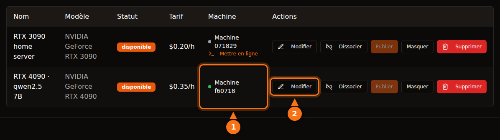

C'est raisonnablement sûr si vous choisissez la plateforme en connaissance de cause, mais « sûr » ne veut pas dire la même chose partout. Sur les plateformes à conteneurs comme Vast.ai, un locataire exécute son propre code sur votre machine et son trafic sort depuis votre adresse IP ; l'isolation le tient à l'écart de vos fichiers, pas de votre réseau ni de votre facture d'électricité. Avec une architecture limitée à une API, comme GPUFlow, un locataire peut seulement envoyer des requêtes de chat aux modèles que vous avez installés, et le risque s'inverse : les prompts sont lisibles sur votre machine, donc les locataires ne doivent rien y envoyer de secret.

Cet article traite les deux sens. Les affirmations concernant les autres plateformes ont été vérifiées dans leur propre documentation en septembre 2026, et tout ce qui concerne GPUFlow vient de son code source et de sa documentation. Les sources sont en fin d'article.

## Ce qu'un locataire peut faire sur une plateforme à conteneurs

La plupart des places de marché de GPU louent un conteneur. Le locataire choisit une image, obtient un shell et lance ce qu'il veut. Cela vous laisse, en tant qu'hôte, cinq points à considérer.

- **Du code arbitraire.** Le code du locataire tourne sur votre noyau, dans un conteneur ou une VM. L'isolation est bonne mais pas parfaite ; les évasions de conteneur sont rares, et c'est précisément le genre de faille corrigée par les mises à jour du noyau et des pilotes que vous devez installer.
- **Votre adresse IP.** Le trafic sortant du conteneur passe par votre connexion Internet. Si un locataire aspire un site, envoie du spam ou scanne Internet, le signalement d'abus part chez votre fournisseur d'accès, au nom de votre IP. Les conditions de Vast.ai prévoient que les utilisateurs garantissent les fournisseurs contre les réclamations liées au contenu des utilisateurs, ce qui aide en cas de litige avec un tiers, mais n'empêche en rien votre fournisseur d'accès de vous envoyer un avertissement.
- **Des ports ouverts.** Le guide d'hébergement de Vast.ai indique « les clients ont besoin de ports ouverts pour se connecter directement à la machine pour la plupart des tâches » : vous redirigez donc des ports sur votre routeur.
- **Le disque.** Les locataires téléchargent des images, des modèles et des jeux de données sur vos disques. Vast.ai libère l'espace quand un client supprime un volume, mais tant que la location dure, cet espace est à lui.
- **Électricité, chaleur et pilotes.** Vast.ai prévient les hôtes : « attendez-vous à ce que le GPU soit utilisé presque à pleine capacité pendant la location ». Cela veut dire des heures à pleine puissance, de la chaleur dans la pièce et des ventilateurs qui tournent. Les plateformes à conteneurs demandent aussi une installation spécifique : le guide de Vast.ai prévoit d'installer Ubuntu, de partitionner les disques, d'installer les pilotes NVIDIA et d'ouvrir des ports sur le routeur.

## Comment Vast.ai, Salad et RunPod isolent les locataires

| | Vast.ai | Salad | RunPod Community Cloud |
| --- | --- | --- | --- |
| **Le locataire obtient** | Un conteneur (ou une VM) avec SSH ou Jupyter | Un conteneur qu'il a déployé, avec SSH et un terminal web à l'intérieur | Un pod (conteneur) |
| **Isolation** | Conteneurs Docker non privilégiés | VM Linux sur un hyperviseur, avec le conteneur à l'intérieur | « Son propre conteneur, avec une séparation stricte » |
| **Ports entrants** | Nécessaires pour la plupart des tâches | Bloqués par défaut | Non précisé |
| **Nouveaux hôtes** | Oui, sous Ubuntu | Oui, sous Windows 10/11 | Plus acceptés |

- **Vast.ai** indique « les clients sont isolés dans des conteneurs Docker non privilégiés et n'ont accès qu'à leurs propres données », avec des namespaces et des cgroups séparés et une isolation du réseau, du système de fichiers et des processus. La plateforme prévient aussi les locataires que « la sécurité varie beaucoup d'un fournisseur à l'autre » et oriente les travaux sensibles vers son offre Secure Cloud, hébergée dans des data centers certifiés.
- **Salad** indique « votre charge de travail tourne dans un conteneur compatible OCI sur une machine virtuelle Linux, isolée de Windows et de tous les autres processus de l'hôte », avec les connexions entrantes bloquées par défaut. Salad protège aussi les locataires contre les hôtes : si un hôte « tente d'accéder à l'environnement Linux, nous détruisons automatiquement l'environnement et mettons la machine sur liste noire ». Par ailleurs, Salad propose des tâches facultatives de partage de bande passante qui « traitent du contenu vidéo de plateformes de streaming premium » via votre connexion ; sa page d'assistance prévient que cela augmente votre consommation de données et peut entraîner « une restriction de contenu rare et temporaire, généralement 1 à 2 jours, sur ces plateformes de streaming ».
- **RunPod** indique « RunPod n'accepte plus de nouveaux hôtes pour le Community Cloud ». Pour la capacité existante, « chaque pod ou worker fonctionne dans son propre conteneur », et ses conditions « interdisent aux hôtes d'inspecter les données de votre pod ou worker ».

Les trois isolent le locataire de votre système. Aucune ne peut empêcher un trafic d'apparence légitime de sortir par votre connexion, et aucune ne prétend le faire.

## En quoi l'architecture de GPUFlow diffère

GPUFlow loue un modèle d'IA derrière une API compatible OpenAI, pas une machine. Cela change ce à quoi un locataire a accès. Voici ce que fait le code.

**L'agent.** L'installateur place un unique binaire Go dans `/usr/local/bin/gpuflow-agent` et le lance comme service systemd. Il n'y a pas de Docker. L'unité de service utilise `DynamicUser=yes` (un utilisateur temporaire non privilégié), `NoNewPrivileges=yes` (il ne peut pas obtenir de droits supplémentaires), `ProtectSystem=strict` (le système lui est accessible en lecture seule), `ProtectHome=yes` (les dossiers personnels lui sont invisibles) et `PrivateTmp=yes`. Le moteur d'inférence est Ollama par défaut, installé par le propre installateur d'Ollama comme service distinct (un fournisseur peut aussi faire pointer l'agent vers son propre serveur compatible OpenAI). Ce durcissement s'applique à l'agent, pas à Ollama.

**Le réseau.** L'agent n'établit que des connexions sortantes : un WebSocket sur TLS vers `wss://ws.gpuflow.app`, et du HTTPS vers `gpuflow.app` pour l'enregistrement et pour envoyer un signal de présence (heartbeat) toutes les 15 secondes. Il n'ouvre aucun port, vous ne redirigez rien sur votre routeur, et les locataires ne connaissent jamais votre adresse IP. Il communique avec Ollama sur `127.0.0.1:11434`, l'adresse de bouclage par défaut d'Ollama.

**Ce que les locataires peuvent appeler.** Un locataire reçoit une clé API pour `https://gpuflow.app/v1`. GPUFlow répond lui-même à `GET /v1/models`, et la seule requête transmise à votre machine est `POST /v1/chat/completions`. L'agent a son propre second verrou : il ne relaie que quatre chemins exacts (`/v1/chat/completions`, `/v1/completions`, `/v1/embeddings` et `/v1/models`) et refuse tout le reste, y compris les endpoints natifs `/api/*` d'Ollama qui permettraient de télécharger, supprimer ou créer des modèles. L'agent ne traite qu'un seul type de message, une requête d'inférence ; tout le reste est ignoré.

Un locataire n'a donc ni shell, ni SSH, ni fichiers, ni accès réseau à votre machine. Il ne peut pas télécharger un modèle de 70 Go sur votre disque, ni utiliser votre connexion pour sortir sur Internet. Ce qu'il peut faire, c'est occuper votre GPU pendant les heures réservées et indiquer dans le champ `model` n'importe quel modèle que vous avez installé.

<figure>
<svg viewBox="0 0 720 380" role="img" aria-labelledby="d1-title" xmlns="http://www.w3.org/2000/svg" font-family="system-ui, sans-serif" font-size="15">
<title id="d1-title">Ce qu'un locataire peut faire chez un hôte à conteneurs, comparé à une architecture limitée à une API comme GPUFlow</title>
<rect x="0" y="0" width="720" height="380" fill="#ffffff"/>
<text x="20" y="40" fill="#64748b" font-weight="bold">Ce que le locataire peut faire</text>
<text x="470" y="40" text-anchor="middle" fill="#1e1b4b" font-weight="bold">Hôte à conteneurs</text>
<text x="630" y="40" text-anchor="middle" fill="#1e1b4b" font-weight="bold">GPUFlow (API)</text>
<line x1="20" y1="55" x2="700" y2="55" stroke="#e2e8f0" stroke-width="2"/>
<text x="20" y="89" fill="#1e1b4b">Lancer ses propres programmes</text>
<rect x="430" y="70" width="80" height="28" rx="14" fill="#fff7ed" stroke="#f97316" stroke-width="2"/>
<text x="470" y="89" text-anchor="middle" fill="#1e1b4b">Oui</text>
<rect x="590" y="70" width="80" height="28" rx="14" fill="#f0fdf4" stroke="#16a34a" stroke-width="2"/>
<text x="630" y="89" text-anchor="middle" fill="#1e1b4b">Non</text>
<line x1="20" y1="110" x2="700" y2="110" stroke="#e2e8f0" stroke-width="1"/>
<text x="20" y="133" fill="#1e1b4b">Ouvrir un shell ou une session SSH</text>
<rect x="430" y="114" width="80" height="28" rx="14" fill="#fff7ed" stroke="#f97316" stroke-width="2"/>
<text x="470" y="133" text-anchor="middle" fill="#1e1b4b">Oui</text>
<rect x="590" y="114" width="80" height="28" rx="14" fill="#f0fdf4" stroke="#16a34a" stroke-width="2"/>
<text x="630" y="133" text-anchor="middle" fill="#1e1b4b">Non</text>
<line x1="20" y1="154" x2="700" y2="154" stroke="#e2e8f0" stroke-width="1"/>
<text x="20" y="177" fill="#1e1b4b">Écrire des fichiers sur votre disque</text>
<rect x="430" y="158" width="80" height="28" rx="14" fill="#fff7ed" stroke="#f97316" stroke-width="2"/>
<text x="470" y="177" text-anchor="middle" fill="#1e1b4b">Oui</text>
<rect x="590" y="158" width="80" height="28" rx="14" fill="#f0fdf4" stroke="#16a34a" stroke-width="2"/>
<text x="630" y="177" text-anchor="middle" fill="#1e1b4b">Non</text>
<line x1="20" y1="198" x2="700" y2="198" stroke="#e2e8f0" stroke-width="1"/>
<text x="20" y="221" fill="#1e1b4b">Émettre du trafic depuis votre IP</text>
<rect x="430" y="202" width="80" height="28" rx="14" fill="#fff7ed" stroke="#f97316" stroke-width="2"/>
<text x="470" y="221" text-anchor="middle" fill="#1e1b4b">Oui</text>
<rect x="590" y="202" width="80" height="28" rx="14" fill="#f0fdf4" stroke="#16a34a" stroke-width="2"/>
<text x="630" y="221" text-anchor="middle" fill="#1e1b4b">Non</text>
<line x1="20" y1="242" x2="700" y2="242" stroke="#e2e8f0" stroke-width="1"/>
<text x="20" y="265" fill="#1e1b4b">Exiger des ports ouverts sur votre routeur</text>
<rect x="430" y="246" width="80" height="28" rx="14" fill="#fff7ed" stroke="#f97316" stroke-width="2"/>
<text x="470" y="265" text-anchor="middle" fill="#1e1b4b">Souvent</text>
<rect x="590" y="246" width="80" height="28" rx="14" fill="#f0fdf4" stroke="#16a34a" stroke-width="2"/>
<text x="630" y="265" text-anchor="middle" fill="#1e1b4b">Non</text>
<line x1="20" y1="286" x2="700" y2="286" stroke="#e2e8f0" stroke-width="1"/>
<text x="20" y="309" fill="#1e1b4b">Télécharger ou supprimer des modèles</text>
<rect x="430" y="290" width="80" height="28" rx="14" fill="#fff7ed" stroke="#f97316" stroke-width="2"/>
<text x="470" y="309" text-anchor="middle" fill="#1e1b4b">Oui</text>
<rect x="590" y="290" width="80" height="28" rx="14" fill="#f0fdf4" stroke="#16a34a" stroke-width="2"/>
<text x="630" y="309" text-anchor="middle" fill="#1e1b4b">Non</text>
<line x1="20" y1="330" x2="700" y2="330" stroke="#e2e8f0" stroke-width="1"/>
<text x="20" y="353" fill="#1e1b4b">Occuper votre GPU pendant des heures</text>
<rect x="430" y="334" width="80" height="28" rx="14" fill="#eef2ff" stroke="#6366f1" stroke-width="2"/>
<text x="470" y="353" text-anchor="middle" fill="#1e1b4b">Oui</text>
<rect x="590" y="334" width="80" height="28" rx="14" fill="#eef2ff" stroke="#6366f1" stroke-width="2"/>
<text x="630" y="353" text-anchor="middle" fill="#1e1b4b">Oui</text>
</svg>
<figcaption>La colonne conteneurs décrit un hébergement de type Vast.ai, où fichiers et trafic restent dans le conteneur du locataire mais utilisent tout de même votre disque et votre connexion. Les détails varient : Salad fait tourner les conteneurs dans une VM Linux et bloque les connexions entrantes par défaut. Sur GPUFlow, le locataire envoie seulement des requêtes de chat aux modèles que vous avez installés.</figcaption>
</figure>

## Le chemin des données, étape par étape

C'est la partie que les locataires doivent lire. Une requête de chat traverse quatre logiciels, et le texte est lisible à plus d'un endroit.

<figure>
<svg viewBox="0 0 720 330" role="img" aria-labelledby="d2-title" xmlns="http://www.w3.org/2000/svg" font-family="system-ui, sans-serif" font-size="15">
<title id="d2-title">Une requête de chat GPUFlow va de l'application du locataire à gpuflow.app, puis au relais, à l'agent sur le PC du fournisseur et à Ollama, et la réponse revient en flux par le même chemin</title>
<rect x="0" y="0" width="720" height="330" fill="#ffffff"/>
<rect x="480" y="50" width="230" height="200" rx="12" fill="#fff7ed" stroke="#f97316" stroke-width="2" stroke-dasharray="6 4"/>
<text x="595" y="76" text-anchor="middle" fill="#1e1b4b" font-weight="bold">PC du fournisseur</text>
<rect x="10" y="110" width="110" height="70" rx="10" fill="#eef2ff" stroke="#6366f1" stroke-width="2"/>
<text x="65" y="141" text-anchor="middle" fill="#1e1b4b">App du</text>
<text x="65" y="161" text-anchor="middle" fill="#1e1b4b">locataire</text>
<rect x="160" y="110" width="120" height="70" rx="10" fill="#eef2ff" stroke="#6366f1" stroke-width="2"/>
<text x="220" y="141" text-anchor="middle" fill="#1e1b4b">API GPUFlow</text>
<text x="220" y="161" text-anchor="middle" fill="#64748b" font-size="12">gpuflow.app/v1</text>
<rect x="320" y="110" width="105" height="70" rx="10" fill="#eef2ff" stroke="#6366f1" stroke-width="2"/>
<text x="372" y="141" text-anchor="middle" fill="#1e1b4b">Relais</text>
<text x="372" y="161" text-anchor="middle" fill="#64748b" font-size="12">ws.gpuflow.app</text>
<rect x="492" y="110" width="90" height="70" rx="10" fill="#ffffff" stroke="#6366f1" stroke-width="2"/>
<text x="537" y="141" text-anchor="middle" fill="#1e1b4b">Agent</text>
<text x="537" y="161" text-anchor="middle" fill="#1e1b4b">GPUFlow</text>
<rect x="610" y="110" width="90" height="70" rx="10" fill="#ffffff" stroke="#6366f1" stroke-width="2"/>
<text x="655" y="141" text-anchor="middle" fill="#1e1b4b">Ollama</text>
<text x="655" y="161" text-anchor="middle" fill="#64748b" font-size="12">127.0.0.1</text>
<line x1="124" y1="145" x2="156" y2="145" stroke="#16a34a" stroke-width="4"/>
<line x1="284" y1="145" x2="316" y2="145" stroke="#64748b" stroke-width="4"/>
<line x1="429" y1="145" x2="488" y2="145" stroke="#16a34a" stroke-width="4"/>
<line x1="586" y1="145" x2="606" y2="145" stroke="#f97316" stroke-width="4"/>
<text x="140" y="102" text-anchor="middle" fill="#16a34a" font-size="13">TLS</text>
<text x="300" y="102" text-anchor="middle" fill="#64748b" font-size="13">interne</text>
<text x="452" y="102" text-anchor="middle" fill="#16a34a" font-size="13">TLS</text>
<text x="596" y="102" text-anchor="middle" fill="#f97316" font-size="13">en clair</text>
<text x="65" y="212" text-anchor="middle" fill="#64748b" font-size="12">Le texte est</text>
<text x="65" y="228" text-anchor="middle" fill="#64748b" font-size="12">rédigé ici</text>
<text x="220" y="212" text-anchor="middle" fill="#64748b" font-size="12">Lit le texte,</text>
<text x="220" y="228" text-anchor="middle" fill="#64748b" font-size="12">ne stocke que</text>
<text x="220" y="244" text-anchor="middle" fill="#64748b" font-size="12">le nombre de tokens</text>
<text x="372" y="212" text-anchor="middle" fill="#64748b" font-size="12">Le transmet,</text>
<text x="372" y="228" text-anchor="middle" fill="#64748b" font-size="12">sans journaliser</text>
<text x="372" y="244" text-anchor="middle" fill="#64748b" font-size="12">le contenu</text>
<text x="595" y="212" text-anchor="middle" fill="#1e1b4b" font-size="13" font-weight="bold">Texte en clair en mémoire</text>
<text x="595" y="230" text-anchor="middle" fill="#1e1b4b" font-size="13" font-weight="bold">Le propriétaire est root</text>
<line x1="20" y1="295" x2="50" y2="295" stroke="#16a34a" stroke-width="4"/>
<text x="58" y="300" fill="#1e1b4b" font-size="13">TLS sur Internet</text>
<line x1="235" y1="295" x2="265" y2="295" stroke="#64748b" stroke-width="4"/>
<text x="273" y="300" fill="#1e1b4b" font-size="13">interne à GPUFlow</text>
<line x1="420" y1="295" x2="450" y2="295" stroke="#f97316" stroke-width="4"/>
<text x="458" y="300" fill="#1e1b4b" font-size="13">en clair sur le PC du fournisseur</text>
</svg>
<figcaption>La requête va de gauche à droite et la réponse revient en flux par le même chemin. TLS protège chaque tronçon qui traverse Internet, mais il s'arrête à chaque serveur : le texte est donc lisible sur les serveurs de GPUFlow pendant qu'ils le transmettent, et sur le PC du fournisseur, où Ollama fait tourner le modèle.</figcaption>
</figure>

1. **Du locataire à gpuflow.app :** HTTPS. Le site est derrière Cloudflare.
2. **De l'API GPUFlow à son relais :** une connexion interne, côté GPUFlow. L'API vérifie la clé, transmet le corps de la requête tel quel et enregistre le nombre de tokens. Elle ne conserve pas le texte des requêtes ni des réponses, et la politique de confidentialité le précise.
3. **Du relais à l'agent du fournisseur :** un WebSocket TLS ouvert par l'agent. Le relais journalise le type de chaque message, pas son contenu.
4. **De l'agent à Ollama :** du HTTP en clair sur l'adresse de bouclage, à l'intérieur du PC du fournisseur. L'agent ne journalise pas non plus le corps des requêtes.

Il n'y a pas de chiffrement de bout en bout jusqu'au modèle, et il ne peut pas y en avoir avec un moteur d'inférence ordinaire : le modèle doit lire le prompt pour y répondre.

## Ce que le fournisseur peut voir

Disons-le clairement : **l'ordinateur du fournisseur traite vos prompts et les réponses en clair.** Ollama tourne dessus, et le fournisseur a les droits root sur la machine (l'installateur l'exige). Un fournisseur qui le voudrait pourrait capturer le trafic sur l'adresse de bouclage, changer de moteur ou faire pointer l'agent vers un autre serveur.

Ce qui l'en empêche est d'ordre contractuel. Les conditions de GPUFlow stipulent que les fournisseurs « ne doivent pas enregistrer, lire, conserver ou partager les requêtes ou les réponses des locataires, ni modifier les réponses ». C'est une règle dont la violation a des conséquences sur le compte, pas un blocage technique. La politique de confidentialité dit la même chose aux locataires : requêtes et réponses passent par l'ordinateur du fournisseur pendant la location.

Au-delà des prompts, le fournisseur voit votre nom d'utilisateur GPUFlow et reçoit un avis au début d'une location (identifiant de location, annonce et nombre d'heures). Les locataires ne voient rien des statistiques de la machine du fournisseur ; la température du GPU, la VRAM, la consommation électrique et le reste de la télémétrie ne s'affichent que dans le tableau de bord du propriétaire.

La règle pratique pour les locataires : **n'envoyez ni secrets, ni identifiants, ni données personnelles concernant d'autres personnes, ni données réglementées (santé, finance, confidentialité client) via un GPU communautaire, quel qu'il soit.** Cela vaut pour GPUFlow, et tout autant pour un conteneur sur le PC d'un particulier, où l'hôte peut inspecter la mémoire et le disque avec les mêmes droits root. Pour les travaux sensibles, faites tourner le modèle sur du matériel que vous contrôlez, ou passez par un prestataire qui signe le contrat qu'exige votre conformité. [Pourquoi certaines entreprises interdisent les outils d'IA publics](/fr/why-corporate-policies-banning-chatgpt/) couvre l'aspect politique interne, et [sécuriser un jeu de données sur un nœud GPU public](/fr/how-to-secure-dataset-on-public-gpu-node/) l'aspect conteneurs.

## Ce qui reste risqué sur GPUFlow

Se limiter à une API réduit la surface d'attaque. Cela ne la supprime pas, et je préfère lister ce qui reste plutôt que de faire semblant.

- **Ollama analyse des entrées non fiables.** Chaque requête d'un locataire finit en JSON transmis à Ollama. Une faille dans Ollama est la voie d'entrée la plus probable : tenez-le à jour. La liste blanche de l'agent tient les locataires à l'écart des endpoints de gestion des modèles d'Ollama, mais elle ne peut rien contre une faille dans le chemin du chat.
- **L'installateur tourne en root.** Vous envoyez un script de gpuflow.app dans `sudo bash`, et il lance aussi le script d'installation d'Ollama. Lisez les deux avant ; c'est une bonne pratique pour n'importe quel logiciel d'hébergement.
- **Pas de mise à jour automatique.** L'agent ne se met pas à jour tout seul. Pour obtenir une nouvelle version, relancez l'installateur, qui vérifie le binaire avec un fichier SHA256SUMS lorsqu'il en existe un.
- **La charge.** Il n'y a pas de plafond de requêtes. Un locataire peut maintenir votre GPU à pleine charge pendant toutes les heures réservées, et il peut utiliser n'importe quel modèle que vous avez installé, y compris le plus gros.
- **Chaleur et électricité.** Comme partout : des heures louées sont des heures en charge.

## Liste de contrôle pour les fournisseurs

1. **Utilisez une machine que vous pouvez vous permettre de prêter.** Idéalement une machine dédiée. Au minimum, ne gardez ni fichiers de travail ni gestionnaire de mots de passe sur l'ordinateur que vous louez, quelle que soit la plateforme. Sur GPUFlow, l'agent tourne déjà sous un utilisateur système temporaire, sans accès aux dossiers personnels, mais Ollama est un service à part.
2. **Plafonnez la puissance.** `sudo nvidia-smi -pl 280` fixe la limite de puissance de la carte en watts (il faut les droits root, et la valeur doit rester entre les limites min et max de la carte). Puget Systems rapporte que des RTX 3090 limitées à 270-280 W conservent environ 95 % de leurs performances, et montre comment réappliquer la limite à chaque démarrage avec une unité systemd.
3. **Faites d'abord le calcul de l'électricité.** Relevez la consommation dans **Mes machines** pendant que le GPU travaille, puis multipliez les kilowatts par votre prix du kWh. [Ce que peut rapporter votre GPU gaming](/fr/how-much-can-you-earn-renting-out-your-gpu/) fait ce calcul pour les cartes courantes et cinq pays.
4. **Surveillez la température.** Les statistiques en direct affichent les températures du GPU, du point chaud et de la mémoire, ainsi que la vitesse des ventilateurs. Vérifiez que le boîtier est bien ventilé.
5. **Tenez le système à jour.** Installez les mises à jour de Linux, du pilote GPU et d'Ollama. L'installateur de GPUFlow ne gère pas votre pilote GPU ; systemd relance l'agent après un redémarrage.
6. **Sachez mettre en pause.** Masquez l'annonce dans **Mes GPU**, ou lancez `sudo systemctl stop gpuflow-agent` (`start` la remet en route). Pendant une location active, le tableau de bord ne vous laisse modifier ni l'annonce ni la machine, et vous ne pouvez pas y mettre fin à la location d'un locataire. Arrêter l'agent en cours de location met fin à celle-ci au bout de 10 minutes, et vous n'êtes payé que jusqu'au dernier signal de présence.
7. **Sachez désinstaller.** Les étapes figurent dans la [documentation de dépannage](https://docs.gpuflow.app/fr/providers/troubleshooting/). Ollama reste installé tant que vous ne le supprimez pas.

Sur les plateformes à conteneurs, ajoutez deux points : décidez si vous voulez vraiment des ports ouverts sur votre routeur, et demandez à votre fournisseur d'accès ce qu'il fait des signalements d'abus, car le trafic des locataires portera votre adresse IP.

## Liste de contrôle pour les locataires

1. **Traitez chaque GPU communautaire comme l'ordinateur d'un inconnu.** Pas de clés API, de mots de passe, de fichiers clients, ni de données médicales ou financières dans les prompts.
2. **Retirez ce qui n'est pas nécessaire.** Remplacez les noms et les numéros de compte par des substituts avant l'envoi.
3. **Protégez votre clé.** Sur GPUFlow, la clé cesse de fonctionner à la fin de la location. Si elle fuit, **Nouvelle clé** révoque immédiatement l'ancienne, et **Terminer maintenant** arrête la facturation et rembourse le temps non utilisé.
4. **Partez du principe que les réponses peuvent être fausses ou altérées.** Les conditions interdisent aux fournisseurs de modifier les réponses, mais vérifiez tout ce qui est important.
5. **Prenez le bon outil pour les travaux sensibles.** Hébergez vous-même, ou passez par un prestataire qui propose le contrat dont vous avez besoin. [Utiliser la clé dans vos applications](/fr/use-openai-compatible-api-key-in-apps/) couvre tout le reste.

## Sources

Toutes vérifiées en septembre 2026.

- GPUFlow : [ce à quoi les locataires ont accès](https://docs.gpuflow.app/fr/providers/security/), [premiers pas pour les fournisseurs](https://docs.gpuflow.app/fr/providers/getting-started/), [prix et électricité](https://docs.gpuflow.app/fr/providers/pricing/), [dépannage et désinstallation](https://docs.gpuflow.app/fr/providers/troubleshooting/), [démarrage rapide de l'API](https://docs.gpuflow.app/fr/renters/api-quickstart/)
- Vast.ai : [présentation de l'hébergement](https://docs.vast.ai/host/hosting-overview.md), [FAQ sécurité](https://docs.vast.ai/documentation/reference/faq/security), [machines virtuelles Linux](https://docs.vast.ai/linux-virtual-machines), [conditions d'utilisation](https://vast.ai/terms), [faire tourner des modèles d'IA privés](https://vast.ai/article/running-private-ai-models-without-the-risk-of-data-exposure)
- Salad : [sécurité](https://salad.com/security), [les charges de travail en conteneur et votre PC](https://community.salad.com/container-workloads-and-your-pc/), [partage de bande passante](https://support.salad.com/faq/jobs/what-is-bandwidth-sharing/), [SSH et terminal](https://docs.salad.com/container-engine/explanation/container-groups/ssh-and-terminal.md), [téléchargement et configuration requise](https://salad.com/download/)
- RunPod : [choisir un pod](https://docs.runpod.io/pods/choose-a-pod), [sécurité des données et conformité légale](https://docs.runpod.io/hosting/partner-requirements)
- Ollama : [FAQ (adresse d'écoute par défaut)](https://docs.ollama.com/faq)
- NVIDIA : [manuel de nvidia-smi](https://docs.nvidia.com/deploy/nvidia-smi/index.html)
- Puget Systems : [limitation de puissance des RTX 3090 avec systemd et nvidia-smi](https://www.pugetsystems.com/labs/hpc/quad-rtx3090-gpu-power-limiting-with-systemd-and-nvidia-smi-1983/)
