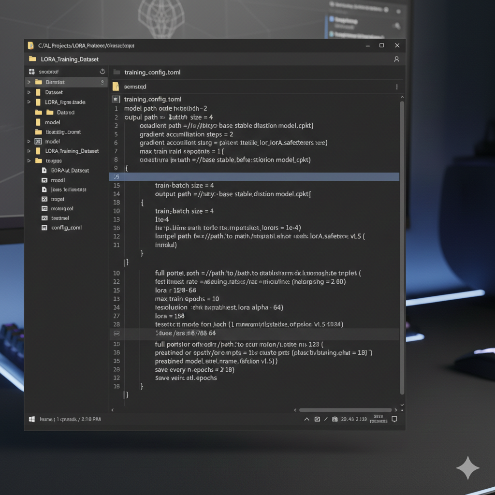

# Comment entraîner des modèles LoRA Stable Diffusion pour moins de 10 $

L’entraînement de modèles LoRA personnalisés pour Stable Diffusion est aujourd’hui l’un des moyens les plus accessibles de produire des images générées par IA parfaitement adaptées à un besoin précis. Qu’il s’agisse de reproduire un style artistique spécifique, d’obtenir une cohérence faciale pour un personnage, ou d’adapter le modèle à la photographie produit, le LoRA permet d’atteindre ces objectifs sans supporter le coût computationnel d’un fine-tuning complet.

Beaucoup supposent que cette démarche nécessite un matériel local coûteux ou un budget cloud conséquent. Ce n’est plus le cas. Grâce aux tarifs actuels de location de GPU et à des configurations d’entraînement efficaces, il est possible d’obtenir un LoRA exploitable en production pour moins de dix dollars — souvent nettement moins.

Ce guide détaille l’ensemble du processus : choix du matériel, préparation du dataset, configuration des paramètres d’entraînement, exécution, validation des résultats et optimisation des coûts. Les montants seront précisés à chaque étape, car les promesses vagues d’« IA abordable » n’aident personne à établir un budget réel.

**Pré-requis :**

- Vingt à cent images d’entraînement
- Une familiarité minimale avec la ligne de commande
- Une carte bancaire ou un portefeuille crypto pour la location GPU
- Deux à quatre heures disponibles
- Un budget initial de 5 à 15 dollars


---

## Table des matières

- [Comprendre le LoRA et son intérêt](#comprendre-le-lora-et-son-intérêt)
- [Choisir le GPU adapté](#choisir-le-gpu-adapté)
- [Comparatif des fournisseurs de GPU](#comparatif-des-fournisseurs-de-gpu)
- [Préparer le dataset d’entraînement](#préparer-le-dataset-dentraînement)
- [Configurer l’environnement d’entraînement](#configurer-lenvironnement-dentraînement)
- [Définir les paramètres d’entraînement](#définir-les-paramètres-dentraînement)
- [Lancer l’entraînement](#lancer-lentraînement)
- [Valider et tester le LoRA](#valider-et-tester-le-lora)
- [Optimisation des coûts](#optimisation-des-coûts)
- [Problèmes fréquents et solutions](#problèmes-fréquents-et-solutions)
- [Questions fréquentes](#questions-fréquentes)

---

## Comprendre le LoRA et son intérêt

LoRA signifie _Low-Rank Adaptation_. Il s’agit d’une méthode permettant d’adapter un grand réseau neuronal en entraînant un nombre limité de paramètres supplémentaires, plutôt que de modifier l’intégralité du modèle.

Stable Diffusion contient près d’un milliard de paramètres. Un fine-tuning complet impliquerait de tous les ajuster, ce qui nécessite une VRAM importante et des temps d’entraînement prolongés.

Le LoRA adopte une approche plus efficace : les poids du modèle d’origine sont gelés, et de petites matrices d’adaptation sont entraînées pour modifier le comportement du réseau. Un fichier LoRA pèse généralement entre 10 et 200 Mo, contre 2 à 6 Go pour un checkpoint complet.

Les implications pratiques sont importantes :

**Efficacité mémoire.**  
Le LoRA requiert bien moins de VRAM qu’un fine-tuning intégral. Une carte 24 Go suffit confortablement pour entraîner un LoRA SDXL, là où un fine-tuning complet pourrait exiger 40 Go ou davantage.

**Vitesse d’entraînement.**  
Moins de paramètres signifie des époques plus rapides. Ce qui demanderait 12 heures en fine-tuning complet peut souvent être réalisé en 90 minutes avec un LoRA.

**Composabilité.**  
Plusieurs LoRA peuvent être combinés à l’inférence. Il est possible d’en utiliser un pour le style et un autre pour un personnage, avec des pondérations distinctes.

**Stockage et distribution.**  
La taille réduite facilite l’archivage et le partage. Il est réaliste de conserver des dizaines de LoRA spécialisés.

C’est cette efficacité qui rend possible un entraînement sous la barre des dix dollars : vous louez un GPU performant pour une à trois heures, non pour une journée entière.

---

## Choisir le GPU adapté

Le choix du GPU repose sur trois critères : capacité VRAM, vitesse d’entraînement et coût horaire.

### Exigences en VRAM

Pour Stable Diffusion 1.5, 12 Go constituent le minimum pratique.  
Pour SDXL, 16 Go sont nécessaires, 24 Go étant nettement préférables.

Une VRAM insuffisante entraîne un swap mémoire constant et des échecs fréquents.

### Compromis vitesse / coût

| GPU          | VRAM  | Temps estimé | Tarif horaire | Coût total estimé |
| ------------ | ----- | ------------ | ------------- | ----------------- |
| RTX 3090     | 24 Go | 2,5 h        | $0,50         | $1,25             |
| RTX 4090     | 24 Go | 1,5 h        | $0,70         | $1,05             |
| RTX A6000    | 48 Go | 1,5 h        | $0,80         | $1,20             |
| A100 (40 Go) | 40 Go | 1 h          | $1,50         | $1,50             |

La RTX 4090 offre généralement le meilleur équilibre coût/temps.  
La RTX 3090 reste pertinente en cas de disponibilité limitée.  
L’A100 devient intéressant pour des projets SDXL complexes.

Pour une analyse détaillée des tarifs actuels, consultez notre  
[comparatif complet des prix de location GPU 2026](/fr/gpu-rental-pricing-comparison-2026/).


## Comparatif des fournisseurs de GPU

Pour un entraînement LoRA abordable, la location de GPU est souvent plus pratique que l’achat. Trois fournisseurs dominent actuellement le marché pour ce type de tâche :

| Fournisseur | Points forts                                             | Points faibles                                             | Tarif moyen RTX 4090 |
| ----------- | -------------------------------------------------------- | ---------------------------------------------------------- | -------------------- |
| **Vast.ai** | Tarifs les plus bas, choix de GPU large, paiement crypto | Interface moins intuitive pour débutants                   | 0,60 $/h             |
| **RunPod**  | Très simple à utiliser, déploiement rapide               | Parfois moins de disponibilités, coût légèrement supérieur | 0,75 $/h             |
| **GPUFlow** | Paiement crypto, pas de vérification KYC, GPU récents    | Interface un peu rudimentaire, options avancées limitées   | 0,65 $/h             |

**Astuce :** Pour maximiser la rentabilité, surveillez les GPU inactifs ou les offres horaires réduites sur Vast.ai. La disponibilité fluctue selon le fuseau horaire et les périodes de forte demande.

---

## Préparer le dataset d’entraînement

La qualité d’un LoRA dépend presque entièrement de la qualité du dataset. Voici les étapes pour obtenir un dataset optimal :

### 1. Collecte des images

- **Nombre d’images recommandé :** 20 à 100
- **Qualité :** haute résolution, nettes, sans filigrane
- **Diversité :** multiples angles et expressions si le LoRA cible un personnage ou un style
- **Formats :** PNG ou JPG, 512×512 minimum pour SD1.5, 1024×1024 recommandé pour SDXL

### 2. Nommage et organisation

Organisez les images dans un dossier unique avec un nom clair, par exemple :

```

/dataset-lora-monpersonnage/
001.png
002.png
...

```

### 3. Création des légendes

Chaque image doit avoir une **légende textuelle** décrivant précisément le contenu, le style, l’éclairage, la pose, etc. Exemple pour un portrait :

```

"Portrait d’une femme souriante, style réaliste, lumière douce, fond flou"

```

Pour SDXL, des légendes plus détaillées améliorent considérablement la qualité.

### 4. Nettoyage et augmentation

- Supprimez les images floues ou bruitées.
- Éventuellement, utilisez des techniques simples d’augmentation : rotation légère, inversion horizontale, ajustement de luminosité.
- Vérifiez la cohérence des légendes : chaque image doit correspondre exactement à sa légende.



---

## Configurer l’environnement d’entraînement

Une fois le dataset prêt, il est temps de configurer l’environnement. L’objectif est d’avoir un GPU prêt à entraîner un LoRA en quelques minutes.

### 1. Louer le GPU

- Connectez-vous à votre fournisseur choisi (Vast.ai, RunPod ou GPUFlow).
- Sélectionnez un GPU avec **au moins 24 Go de VRAM** pour SDXL ou 12 Go pour SD1.5.
- Définissez la durée : commencez avec 2–3 heures pour un premier test.

### 2. Préparer le serveur

La plupart des fournisseurs proposent une instance Linux avec un accès SSH ou un environnement Web (ex : Jupyter Notebook, Google Colab-like). Les étapes typiques :

1. Installer **Python 3.10+**
2. Installer **pip et venv** pour gérer les dépendances
3. Installer **PyTorch avec CUDA** correspondant à la version du GPU
4. Installer **diffusers** ou **Stable Diffusion WebUI** selon votre workflow
5. Installer **loralib** et tout package spécifique à LoRA (souvent inclus dans les scripts officiels)

### 3. Transférer le dataset

- Utilisez `scp`, `rsync` ou le gestionnaire de fichiers Web pour envoyer votre dossier `dataset-lora-monpersonnage` sur le GPU.
- Vérifiez les permissions et le chemin d’accès. Exemple :

```

/home/username/lora-training/dataset-lora-monpersonnage/

```

### 4. Tester l’environnement

Avant de lancer l’entraînement complet, vérifiez :

```bash
python -c "import torch; print(torch.cuda.is_available())"
```

Si `True` s’affiche, votre GPU est correctement détecté et prêt pour l’entraînement.

## Paramètres d’entraînement LoRA

Pour un LoRA efficace et stable, certains paramètres sont essentiels :

| Paramètre           | Recommandation   | Commentaire                                                                                        |
| ------------------- | ---------------- | -------------------------------------------------------------------------------------------------- |
| **epochs**          | 10–30            | Plus d’epochs pour des datasets petits ou complexes, mais risque de surapprentissage si trop élevé |
| **batch size**      | 1–4 (selon VRAM) | Taille trop grande = erreurs mémoire, trop petite = apprentissage lent                             |
| **learning rate**   | 1e-4 à 5e-4      | Ajuster selon la convergence, diminuer si les résultats deviennent flous                           |
| **network rank**    | 4–16             | Plus le rang est élevé, plus le LoRA peut capturer de détails, mais plus coûteux                   |
| **mixed precision** | FP16 ou BF16     | FP16 recommandé pour accélérer l’entraînement sur GPU récents                                      |
| **save every**      | 100–200 steps    | Permet de sauvegarder des checkpoints réguliers                                                    |

**Astuce :** Commencez petit avec un batch de 1 et un learning rate modéré pour tester le dataset avant de lancer un entraînement complet.

---

## Lancer l’entraînement

1. Vérifiez que le dataset est bien accessible.
2. Choisissez le modèle de base : SD1.5, SD2.1 ou SDXL selon votre besoin.
3. Lancez le script d’entraînement LoRA. Exemple avec `diffusers` :

```bash
python train_network.py \
  --pretrained_model_name_or_path="runwayml/stable-diffusion-v1-5" \
  --train_data_dir="./dataset-lora-monpersonnage" \
  --output_dir="./lora-monpersonnage" \
  --network_alpha=128 \
  --network_module="lora" \
  --learning_rate=3e-4 \
  --max_train_steps=800 \
  --save_model_every_n_steps=200 \
  --mixed_precision="fp16" \
  --cache_latents
```

4. Surveillez la consommation de GPU et le loss dans la console.

---

## Validation du LoRA

Après l’entraînement, testez votre LoRA pour vérifier la qualité :

```bash
python generate_test.py \
  --model_path="./lora-monpersonnage" \
  --prompt="Portrait du personnage en style réaliste"
```

- Si le résultat est fidèle au dataset, le LoRA est prêt.
- Sinon, ajustez learning rate, epochs ou network rank et relancez.

---

## Optimisation des coûts

- Louez le GPU **hors heures de pointe** pour réduire le coût.
- Utilisez **mixed precision** et **cache_latents** pour réduire la VRAM utilisée et accélérer l’entraînement.
- Pour des tests rapides, limitez les **max_train_steps**.
- Surveillez l’usage réel : certains fournisseurs facturent au demi-step si vous dépassez légèrement.

---

## Problèmes fréquents

| Problème              | Solution                                                                                                 |
| --------------------- | -------------------------------------------------------------------------------------------------------- |
| GPU out of memory     | Réduire batch size, utiliser FP16/BF16, limiter la résolution                                            |
| Loss qui n’avance pas | Vérifier le dataset et les légendes, diminuer learning rate                                              |
| Images floues         | Vérifier que les images sont nettes et cohérentes, augmenter epochs ou network rank                      |
| Checkpoints corrompus | Sauvegarder régulièrement avec `save_model_every_n_steps`, ne pas interrompre brutalement l’entraînement |

---

**Bravo !** Vous avez maintenant un guide complet en français pour créer, entraîner et optimiser un LoRA avec vos propres datasets. Vous pouvez suivre exactement le même flux pour les autres langues tout en adaptant les prompts et légendes.
