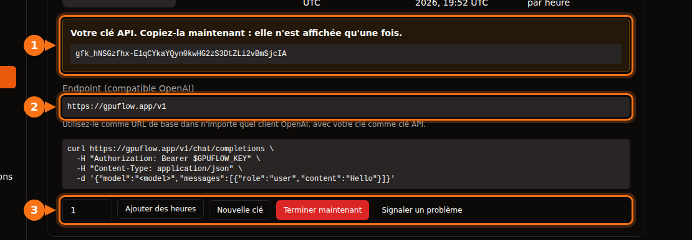

Beaucoup d'outils d'IA vous permettent de remplacer OpenAI par un autre fournisseur, du moment qu'il expose la même API. Il vous faut toujours les trois mêmes éléments :

| Élément | Exemple |
| --- | --- |
| **URL de base** (aussi appelée API base, endpoint ou host) | `https://gpuflow.app/v1` |
| **Clé API** | `gfk_...` |
| **Nom du modèle** | `qwen2.5:7b` |

Tout au long de l'article, nous prenons l'exemple d'une location GPUFlow, mais la marche à suivre est la même pour n'importe quel serveur compatible OpenAI : Ollama ou llama.cpp en local, vLLM, OpenRouter et bien d'autres. Il suffit de changer les trois valeurs.

Sur GPUFlow, vous trouverez ces trois valeurs dans **Tableau de bord → Locations Actuelles** après avoir loué un GPU :



## Avant de commencer : vérifiez l'endpoint et le nom du modèle

Une seule commande vous dit si la clé fonctionne et comment s'appelle le modèle :

```bash
curl https://gpuflow.app/v1/models \
  -H "Authorization: Bearer gfk_your_key"
```

La réponse liste les modèles. Copiez l'`id`, par exemple `qwen2.5:7b`, exactement tel qu'il est écrit. Un nom de modèle erroné est la cause la plus fréquente quand une application refuse de fonctionner.

**Sachez ce que votre endpoint prend en charge.** L'endpoint de GPUFlow propose `/v1/models` et `/v1/chat/completions`, avec streaming. Il ne propose ni les embeddings, ni la Responses API, plus récente, ni la génération d'images. Certaines fonctions des applications en ont besoin : nous les signalons ci-dessous.

## Applications de chat

### Open WebUI

1. Ouvrez **Settings → Admin → Connections**.
2. Sous **Manage OpenAI API Connections**, cliquez sur **+ (Add Connection)**.
3. Renseignez :
   - **URL** : `https://gpuflow.app/v1`
   - **API Key** : votre clé
4. Cliquez sur **Verify Connection** pour la tester (enregistrer ne suffit pas à tester), puis sur **Save**.

Open WebUI récupère tout seul la liste des modèles via `/models`. Si vous le lancez avec Docker, vous pouvez à la place définir `OPENAI_API_BASE_URL` et `OPENAI_API_KEY`, mais ces variables ne sont lues qu'au tout premier démarrage d'Open WebUI. Ensuite, modifiez-les dans l'écran d'administration.

L'import et la recherche de documents dans Open WebUI utilisent un petit modèle d'embeddings qui tourne en local par défaut : ils continuent donc de fonctionner. Ne passez pas le moteur d'embeddings sur OpenAI avec votre endpoint de chat comme URL.

### LibreChat

Ajoutez un endpoint personnalisé dans `librechat.yaml` :

```yaml
endpoints:
  custom:
    - name: "GPUFlow"
      apiKey: "${GPUFLOW_API_KEY}"
      baseURL: "https://gpuflow.app/v1"
      models:
        default: ["qwen2.5:7b"]
        fetch: true
      titleConvo: true
      titleModel: "qwen2.5:7b"
      modelDisplayLabel: "GPUFlow"
```

Mettez votre clé dans `.env` sous la forme `GPUFLOW_API_KEY=gfk_...`. Utilisez `apiKey: "user_provided"` si chaque utilisateur doit saisir sa propre clé. Avec `fetch: true`, LibreChat récupère la liste des modèles auprès de l'endpoint.

La recherche de documents de LibreChat (la RAG API) utilise par défaut les embeddings d'OpenAI. Laissez-la sur OpenAI, Ollama ou Hugging Face ; ne faites pas pointer `RAG_OPENAI_BASEURL` vers un endpoint qui ne fait que du chat.

### AnythingLLM

1. Ouvrez les réglages du LLM et choisissez **Generic OpenAI**.
2. Renseignez **Base URL** (`https://gpuflow.app/v1`), **API Key**, **Chat Model Name** (`qwen2.5:7b`), **Token context window** et **Max Tokens**.

Avec Docker, les mêmes réglages passent par des variables d'environnement :

```bash
LLM_PROVIDER='generic-openai'
GENERIC_OPEN_AI_BASE_PATH='https://gpuflow.app/v1'
GENERIC_OPEN_AI_MODEL_PREF='qwen2.5:7b'
GENERIC_OPEN_AI_MODEL_TOKEN_LIMIT=32768
GENERIC_OPEN_AI_API_KEY=gfk_your_key
```

Laissez le modèle d'embeddings sur **AnythingLLM Default**.

### Jan

1. Ouvrez **Settings → Model Providers** et cliquez sur **Add Provider**.
2. Choisissez **OpenAI-compatible**.
3. Saisissez un nom, la **Base URL** terminée par `/v1` et votre **API key**. Cliquez sur **Create**.

Jan charge la liste des modèles à l'enregistrement. Si ce n'est pas le cas, ajoutez le nom du modèle à la main avec le bouton **+** dans la liste des modèles du fournisseur.

## Assistants de code

### Continue (VS Code et JetBrains)

Ajoutez un modèle dans votre `config.yaml` :

```yaml
models:
  - name: GPUFlow Qwen 2.5 7B
    provider: openai
    model: qwen2.5:7b
    apiBase: https://gpuflow.app/v1
    apiKey: ${{ secrets.GPUFLOW_API_KEY }}
    roles:
      - chat
      - edit
      - apply
```

Ne lui attribuez pas les rôles `autocomplete` ni `embed` : ce point de terminaison ne propose que le chat, et les embeddings ont besoin de `/v1/embeddings`. Dans VS Code, Continue dispose d'un modèle d'embeddings intégré pour la recherche dans le code. Dans JetBrains, non : configurez-y un modèle d'embeddings séparé.

Le mode Agent de Continue nécessite un modèle qui gère les appels d'outils. N'ajoutez `capabilities: [tool_use]` que si vous savez que le vôtre en est capable.

### Cline

1. Ouvrez les réglages de Cline.
2. Réglez **API Provider** sur **OpenAI Compatible**.
3. Renseignez **Base URL**, **API Key** et **Model** (`qwen2.5:7b`).
4. Sous **Model Configuration**, réglez la fenêtre de contexte [en fonction de votre modèle](/fr/which-ai-models-fit-your-gpu-vram/).

Une remarque sur **Roo Code** : sa documentation indique qu'il ne fonctionne qu'avec des modèles qui prennent en charge l'appel d'outils natif, sans solution de repli. Un simple endpoint de chat risque de ne pas fonctionner avec lui.

## Code

### Les bibliothèques Python et Node d'OpenAI

Python (`pip install openai`) :

```python
from openai import OpenAI

client = OpenAI(base_url="https://gpuflow.app/v1", api_key="gfk_your_key")

reply = client.chat.completions.create(
    model="qwen2.5:7b",
    messages=[{"role": "user", "content": "Say hello in five languages."}],
)
print(reply.choices[0].message.content)
```

Node (`npm install openai`) :

```js
import OpenAI from "openai";

const client = new OpenAI({ baseURL: "https://gpuflow.app/v1", apiKey: "gfk_your_key" });

const reply = await client.chat.completions.create({
  model: "qwen2.5:7b",
  messages: [{ role: "user", content: "Say hello in five languages." }],
});
console.log(reply.choices[0].message.content);
```

Les deux bibliothèques lisent aussi `OPENAI_BASE_URL` et `OPENAI_API_KEY` dans l'environnement. Notez que leurs README commencent désormais par `client.responses.create(...)`. C'est la Responses API ; utilisez `client.chat.completions.create(...)` comme ci-dessus.

### LangChain

Python (`pip install -U langchain-openai`) :

```python
from langchain_openai import ChatOpenAI

llm = ChatOpenAI(
    model="qwen2.5:7b",
    base_url="https://gpuflow.app/v1",
    api_key="gfk_your_key",
    use_responses_api=False,
)
print(llm.invoke("Name three uses for a GPU.").content)
```

JavaScript (`npm install @langchain/openai @langchain/core`). Définissez d'abord votre clé dans l'environnement, `export OPENAI_API_KEY=gfk_your_key`, puis :

```js
import { ChatOpenAI } from "@langchain/openai";

const llm = new ChatOpenAI({
  model: "qwen2.5:7b",
  configuration: { baseURL: "https://gpuflow.app/v1" },
});
```

LangChain bascule sur la Responses API quand vous utilisez certaines fonctions, comme les outils intégrés ou la sortie de raisonnement. `use_responses_api=False` le maintient sur Chat Completions.

### LlamaIndex

Utilisez `OpenAILike` (`pip install llama-index-llms-openai-like`) :

```python
from llama_index.llms.openai_like import OpenAILike

llm = OpenAILike(
    model="qwen2.5:7b",
    api_base="https://gpuflow.app/v1",
    api_key="gfk_your_key",
    context_window=32768,
    is_chat_model=True,
    is_function_calling_model=False,
)
```

**Définissez `is_chat_model=True`.** La valeur par défaut est `False`, ce qui envoie les requêtes vers `/v1/completions` au lieu de `/v1/chat/completions`. Pour indexer des documents, réglez `Settings.embed_model` sur un vrai modèle d'embeddings ; LlamaIndex utilise par défaut les embeddings d'OpenAI.

## Les outils qui ne fonctionneront pas avec un endpoint limité au chat

- **Codex CLI.** Il a abandonné la prise en charge de Chat Completions début 2026 et n'accepte plus que la Responses API.
- **OpenAI Agents SDK.** Il utilise la Responses API par défaut. Appelez `set_default_openai_api("chat_completions")`, ou enveloppez votre client dans `OpenAIChatCompletionsModel`, et désactivez le tracing avec `set_tracing_disabled(True)`, car le tracing exige une clé OpenAI.
- **Tout ce qui a besoin d'embeddings** issus du même endpoint : recherche dans les documents, « chat avec vos fichiers », recherche sémantique dans le code. Utilisez le modèle d'embeddings intégré à l'application ou un fournisseur d'embeddings séparé.

## Si cela ne fonctionne toujours pas

| Ce que vous voyez | Cause habituelle |
| --- | --- |
| `404` ou « not found » | Il manque `/v1` à l'URL de base, ou l'application ajoute `/v1` elle-même et vous l'avez ajouté une seconde fois. |
| `401` ou `invalid_api_key` | Mauvaise clé, ou la location est terminée. Sur GPUFlow, cliquez sur **Nouvelle clé** dans Locations Actuelles si vous l'avez perdue. |
| « Model not found » | Le nom du modèle ne correspond pas exactement à `/v1/models`. |
| Les requêtes vers `/v1/completions` ou `/v1/responses` échouent | L'application utilise une autre API. Cherchez un réglage « chat model » ou « chat completions ». |

## Articles liés

- [GPU à l'heure ou API au token ? Le vrai coût d'un modèle 7B–8B](/fr/hourly-gpu-vs-per-token-api/)
- [GPUFlow, Vast.ai, RunPod ou SaladCloud : quelle plateforme choisir selon votre usage](/fr/gpuflow-vs-vast-ai-vs-runpod/)

## Sources

Toutes vérifiées en septembre 2026.

- Open WebUI : [fournisseurs compatibles OpenAI](https://docs.openwebui.com/getting-started/quick-start/connect-a-provider/starting-with-openai-compatible/), [variables d'environnement](https://docs.openwebui.com/reference/env-configuration)
- LibreChat : [endpoints personnalisés](https://www.librechat.ai/docs/configuration/librechat_yaml/object_structure/custom_endpoint), [RAG API](https://www.librechat.ai/docs/configuration/rag_api)
- AnythingLLM : [Generic OpenAI](https://docs.anythingllm.com/setup/llm-configuration/cloud/openai-generic)
- Jan : [endpoints personnalisés](https://www.jan.ai/docs/desktop/remote-models/custom-endpoint)
- Continue : [fournisseur OpenAI](https://docs.continue.dev/customize/model-providers/top-level/openai), [référence de configuration](https://docs.continue.dev/reference)
- Cline : [OpenAI Compatible](https://docs.cline.bot/provider-config/openai-compatible) ; Roo Code : [OpenAI Compatible](https://roocodeinc.github.io/Roo-Code/providers/openai-compatible/)
- Bibliothèques OpenAI : [openai-python](https://github.com/openai/openai-python), [openai-node](https://github.com/openai/openai-node)
- LangChain : [Python](https://docs.langchain.com/oss/python/integrations/chat/openai), [JavaScript](https://docs.langchain.com/oss/javascript/integrations/chat/openai)
- LlamaIndex : [OpenAILike](https://developers.llamaindex.ai/python/framework-api-reference/llms/openai_like/)
- OpenAI Agents SDK : [modèles](https://openai.github.io/openai-agents-python/models/)
- Codex et Chat Completions : [github.com/openai/codex/discussions/7782](https://github.com/openai/codex/discussions/7782)
- API GPUFlow : [Utiliser votre clé API](https://docs.gpuflow.app/fr/renters/api-quickstart/)
