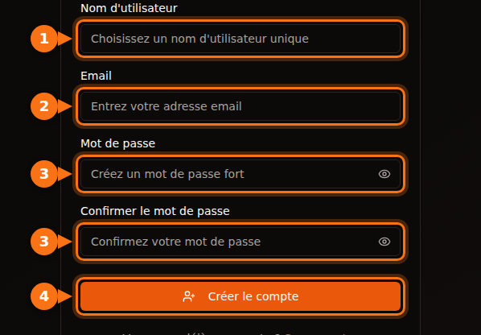
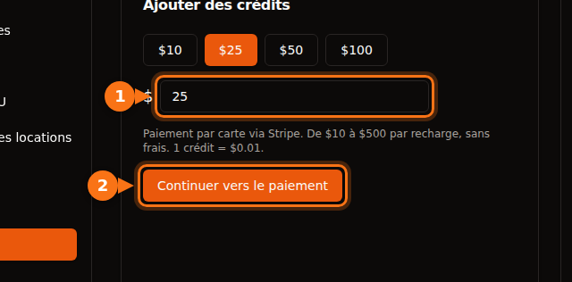

Avant de louer votre premier GPU, chaque plateforme vous demande quelque chose : une adresse e-mail, une carte, parfois un numéro de téléphone, et sur les grands clouds une demande de quota qui peut prendre des jours. Cet article recense ce que chacune exige, pour que vous puissiez en choisir une qui vous permette de commencer dès aujourd'hui.

Tout a été vérifié en septembre 2026 dans la documentation des plateformes elles-mêmes. Les sources sont en fin d'article.

## La comparaison rapide

| Plateforme | Pour créer un compte | Avant de pouvoir louer | Vérification d'identité des locataires | Minimum pour commencer |
| --- | --- | --- | --- | --- |
| **GPUFlow** | E-mail et mot de passe, ou Google ou GitHub | Confirmer votre e-mail, ajouter des crédits par carte | Aucune dans les étapes de location | Recharge de 10 $, sans frais |
| **Vast.ai** | E-mail | Vérifier votre e-mail, ajouter du crédit | Absente de la documentation | Dépôt de 5 $ |
| **RunPod** | E-mail | Ajouter du crédit | Seulement avant un premier paiement en crypto | 1 heure de crédit ; 100 $ par transaction avec une carte prépayée |
| **SaladCloud** | Compte sur le portail | Ajouter un moyen de facturation à votre organisation | Absente de la documentation | Recharges à partir de 5 $ |
| **Lambda** | Compte | Ajouter une carte de crédit | Absente de la documentation | Pré-autorisation de 10 $ sur la carte, remboursée |
| **TensorDock** | Compte | Déposer de l'argent | Les conditions autorisent des vérifications de compte | « Dès 5 $ » |
| **AWS** | E-mail, code PIN par téléphone, moyen de paiement, CAPTCHA | Demander un quota de GPU : les nouveaux comptes partent de 0 | Pas pour la plupart des comptes | Paiement à l'usage |
| **Google Cloud** | Compte avec facturation | Demander un quota de GPU ; les comptes d'essai gratuit n'en ont pas | Pas pour la plupart des comptes | Paiement à l'usage |

« Absente de la documentation » signifie que nous n'avons trouvé aucune exigence d'identité pour les locataires dans la documentation de la plateforme. Les plateformes peuvent tout de même demander des vérifications quand quelque chose leur paraît inhabituel.

## Les petites plateformes : quelques minutes, pas quelques jours

Vast.ai, RunPod, SaladCloud, TensorDock et GPUFlow fonctionnent toutes en prépayé. Vous versez d'abord de l'argent, puis vous le dépensez à la seconde ou à la minute. Comme vous ne pouvez pas dépenser plus que ce que vous avez versé, elles n'ont pas besoin de vérifier votre solvabilité ni votre entreprise.

Ce qui les distingue :

- **La vérification de l'e-mail.** Vast.ai et GPUFlow l'exigent toutes deux avant que vous puissiez louer ou ajouter des crédits. Regardez dans vos spams si l'e-mail n'arrive pas.
- **Les moyens de paiement.**
  - Vast.ai : carte, BitPay, Crypto.com.
  - RunPod : Visa, Mastercard, Amex, crypto, et paiement sur facture au-delà de 5 000 $.
  - SaladCloud : carte, ou USDC, USDT et RENDER sur Solana.
  - Lambda : principales cartes de crédit uniquement, et seulement dans les pays pris en charge.
  - GPUFlow : cartes via Stripe.
- **Ce que devient votre argent si vous ne l'utilisez pas.** Le crédit SaladCloud expire 12 mois après l'achat. Les crédits GPUFlow n'expirent pas.

## Les grands clouds : prévoyez une demande de quota

AWS et Google Cloud ne vous bloquent pas à l'inscription. Ils vous bloquent au moment de lancer un GPU.

- **AWS :** le quota « Running On-Demand G and VT instances » (la famille d'instances avec les NVIDIA L4 et A10G) démarre à **0 vCPU** sur les nouveaux comptes. Vous en demandez davantage dans la console Service Quotas. AWS relève aussi automatiquement les quotas à mesure que l'utilisation du compte augmente.
- **Google Cloud :** les comptes d'essai gratuit n'ont aucun quota de GPU. Une fois que le projet a un historique de facturation, les demandes de quota sont plus facilement acceptées. Le quota est défini par région, et les GPU préemptibles ont besoin de leur propre quota.

Si vous avez besoin d'un GPU aujourd'hui, ne commencez pas par un nouveau compte AWS ou Google Cloud.

## S'inscrire sur GPUFlow, étape par étape

GPUFlow est conçu pour le cas « il me faut un modèle d'IA dans cinq minutes ». Ce que vous obtenez, c'est une clé API compatible OpenAI pour un GPU, pas une machine.

1. **Créez un compte** sur gpuflow.app avec un nom d'utilisateur, votre adresse e-mail et un mot de passe, ou avec Google ou GitHub.

   

2. **Confirmez votre e-mail.** Cliquez sur le lien dans l'e-mail que GPUFlow vous envoie. Vous ne pouvez pas ajouter de crédits avant de l'avoir fait.
3. **Ajoutez des crédits** dans **Tableau de bord → Paiements**, de 10 $ à 500 $ par carte via Stripe. 1 crédit = 0,01 $, et il n'y a pas de frais.

   

4. **Louez un GPU** pour le nombre d'heures voulu, et copiez votre clé API. Vous payez à la seconde ; si vous terminez plus tôt, le reste revient sur vos crédits.

Le guide complet, écran par écran, se trouve dans la documentation : [Louer un GPU, étape par étape](https://docs.gpuflow.app/fr/renters/getting-started/).

## Si vous voulez plutôt mettre un GPU en location

C'est quand on est payé que les vérifications d'identité entrent en jeu. Les sociétés de paiement sont tenues de savoir à qui elles envoient de l'argent.

- **GPUFlow :** pour retirer vos gains, vous configurez un compte de versement avec Stripe, qui vérifie votre identité et vous demande vos coordonnées bancaires. Les versements fonctionnent aux États-Unis, au Canada, au Royaume-Uni, en Suisse et dans l'Espace économique européen.
- **Vast.ai :** les hôtes sont payés via Wise, PayPal ou Stripe, et ces services se chargent des vérifications d'identité.
- **Salad :** les récompenses sont versées via PayPal, des cartes cadeaux et d'autres options.

Pour savoir ce que rapporte l'hébergement, lisez [combien rapporte la location de votre GPU gaming](/fr/how-much-can-you-earn-renting-out-your-gpu/).

## Avant de payer : une courte liste de vérification

1. **Confirmez d'abord votre e-mail**, pour ne pas rester bloqué à l'étape du paiement.
2. **Vérifiez que votre pays et votre carte sont acceptés.** Lambda, par exemple, n'accepte les paiements que depuis une liste de pays.
3. **Renseignez-vous sur les frais de votre banque pour les paiements à l'étranger.** La plupart des plateformes facturent en dollars américains. [En savoir plus sur les coûts cachés](/fr/hidden-fees-in-gpu-rental/).
4. **Commencez petit.** Ajoutez de quoi tenir quelques heures, testez, puis rechargez.

## Articles liés

- [GPUFlow, Vast.ai, RunPod ou SaladCloud : quelle plateforme choisir selon votre usage](/fr/gpuflow-vs-vast-ai-vs-runpod/)
- [Utiliser une clé API compatible OpenAI dans Open WebUI, Continue, LangChain et d'autres outils](/fr/use-openai-compatible-api-key-in-apps/)

## Sources

Toutes vérifiées en septembre 2026.

- GPUFlow : [Louer un GPU, étape par étape](https://docs.gpuflow.app/fr/renters/getting-started/), [crédits et facturation](https://docs.gpuflow.app/fr/renters/billing/), [être payé](https://docs.gpuflow.app/fr/providers/getting-paid/)
- Vast.ai : [guide de démarrage](https://docs.vast.ai/guides/get-started/quickstart.md), [facturation](https://docs.vast.ai/documentation/reference/billing), [versements aux hôtes](https://docs.vast.ai/host/payment.md)
- RunPod : [informations de facturation](https://docs.runpod.io/references/billing-information)
- SaladCloud : [configuration du compte](https://docs.salad.com/general/tutorials/account-setup.md), [facturation](https://docs.salad.com/general/explanation/billing.md)
- Lambda : [gestion de la facturation](https://docs.lambda.ai/public-cloud/manage-billing/)
- TensorDock : [GPU cloud](https://www.tensordock.com/cloud-gpus.html), [conditions d'utilisation](https://docs.tensordock.com/legal-information/terms-of-service-tos)
- AWS : [créer un compte](https://docs.aws.amazon.com/accounts/latest/reference/manage-acct-creating.html), [quotas des instances On-Demand](https://docs.aws.amazon.com/AWSEC2/latest/UserGuide/ec2-on-demand-instances.html)
- Google Cloud : [résolution des problèmes de quota de GPU](https://docs.cloud.google.com/deep-learning-vm/docs/troubleshooting)
- Récompenses Salad : [retrait via PayPal](https://support.salad.com/rewards/redeeming-your-rewards/how-to-redeem-paypal/)
