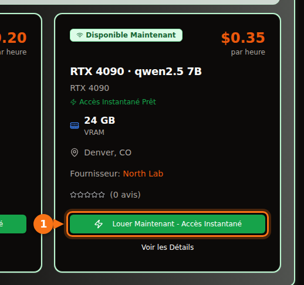

Avec la quantification 4 bits qu'Ollama fournit par défaut, un modèle 7B ou 8B demande une carte de 8 Go, un modèle 12B à 14B demande 12 Go (16 Go si vous voulez des prompts longs), et un modèle 27B à 32B demande 24 Go. Un modèle 70B en 4 bits fait 43 Go, ce qui veut dire 48 Go de VRAM ou plus.

La version longue compte, parce que la taille du téléchargement n'est pas toute la facture. Le contexte que vous utilisez prend lui aussi de la mémoire, et un modèle qui semble tenir peut se retrouver à moitié sur le CPU, plusieurs fois plus lent. Voici la formule que j'utilise, ce que veulent dire les étiquettes de quantification, et un tableau des modèles ouverts actuels avec leurs vraies tailles de téléchargement dans la bibliothèque Ollama. Tailles et caractéristiques vérifiées en septembre 2026 ; les sources sont en fin d'article.

## La réponse courte, par quantité de VRAM

| VRAM | Cartes typiques | Ce qui tourne entièrement sur le GPU (4 bits) |
| --- | --- | --- |
| 8 Go | RTX 4060, RTX 5060, RTX 3070 | Modèles 7B à 8B : Llama 3.1 8B, Qwen3 8B, Mistral 7B |
| 12 Go | RTX 3060 12 Go, RTX 4070, RTX 5070 | Modèles 12B à 14B avec un contexte court ; 7B à 8B en Q8_0 |
| 16 Go | RTX 4060 Ti 16 Go, RTX 4080, RTX 5080 | 14B avec un contexte long, gpt-oss 20B |
| 24 Go | RTX 3090, RTX 4090 | 24B à 32B : Mistral Small 3.2, Gemma 3 27B, Qwen3 32B |
| 32 Go | RTX 5090 | 32B avec un contexte long, modèles mixture-of-experts 35B |
| 48 à 80 Go | L40S (48 Go), H100 (80 Go) | 70B en 4 bits, gpt-oss 120B sur 80 Go |

Les capacités mémoire des cartes viennent des fiches techniques de NVIDIA. Certaines cartes existent en deux versions : la RTX 3060 en 12 Go et en 8 Go, les RTX 4060 Ti et RTX 5060 Ti en 16 Go et en 8 Go. Vérifiez laquelle vous achetez ou louez.

## Estimer la VRAM dont un modèle a besoin

Trois choses occupent la mémoire du GPU pendant qu'un modèle vous répond :

1. **Les poids.** Paramètres × bits par poids ÷ 8 = octets.
2. **Le cache KV.** Le modèle conserve les clés et les valeurs de chaque token de la conversation pour ne pas les recalculer. Par token, cela fait 2 × couches × têtes KV × taille de tête × 2 octets (avec le cache 16 bits par défaut). Multipliez par la longueur de contexte.
3. **Le surcoût fixe.** Le contexte CUDA, les tampons de travail et le runtime lui-même. Je compte environ 1 Go. Cela varie selon le moteur et les réglages : c'est un ordre de grandeur, pas une spécification.

Le nombre de couches et de têtes se trouve dans le `config.json` de chaque modèle sur Hugging Face.

### Exemple chiffré : Qwen 2.5 14B sur une carte de 16 Go

Qwen 2.5 14B compte 14,7 milliards de paramètres, 48 couches, 8 têtes KV et une taille de tête de 128 (dimension cachée de 5 120 ÷ 40 têtes d'attention).

- **Poids en Q4_K_M :** llama.cpp indique environ 4,89 bits par poids pour Q4_K_M. 14,7 milliards × 4,89 ÷ 8 = 8,99 Go. Le téléchargement `qwen2.5:14b` d'Ollama fait 9,0 Go : le calcul correspond au vrai fichier.
- **Cache KV par token :** 2 × 48 × 8 × 128 × 2 octets = 196 608 octets, soit environ 0,2 Mo.
- **Cache KV pour tout le contexte :** 4 096 tokens = 0,8 Go. 16 384 tokens = 3,2 Go. 32 768 tokens = 6,4 Go.
- **Total :** 9,0 + 0,8 + 1 = 10,8 Go avec un contexte de 4K. 9,0 + 3,2 + 1 = 13,2 Go à 16K. 9,0 + 6,4 + 1 = 16,4 Go à 32K, ce qui ne tient plus sur une carte de 16 Go.

<figure>
<svg viewBox="0 0 720 340" role="img" aria-labelledby="d1-title" xmlns="http://www.w3.org/2000/svg" font-family="system-ui, sans-serif" font-size="15">
<title id="d1-title">Ce qui remplit la VRAM pour Qwen 2.5 14B en Q4_K_M sur une carte de 16 Go : les poids, le cache KV pour trois longueurs de contexte, et le surcoût fixe</title>
<rect x="0" y="0" width="720" height="340" fill="#ffffff"/>
<rect x="150" y="20" width="16" height="16" rx="3" fill="#6366f1"/>
<text x="172" y="33" fill="#1e1b4b">Poids 9,0 Go</text>
<rect x="330" y="20" width="16" height="16" rx="3" fill="#a5b4fc"/>
<text x="352" y="33" fill="#1e1b4b">Cache KV</text>
<rect x="510" y="20" width="16" height="16" rx="3" fill="#e2e8f0"/>
<text x="532" y="33" fill="#1e1b4b">Surcoût ~1 Go</text>
<line x1="582.0" y1="66" x2="582.0" y2="278" stroke="#f97316" stroke-width="2" stroke-dasharray="5 4"/>
<text x="576.0" y="60" text-anchor="end" fill="#f97316" font-weight="600">Carte 16 Go</text>
<text x="140" y="106" text-anchor="end" fill="#1e1b4b">Contexte 4K</text>
<rect x="150" y="80" width="243.0" height="40" fill="#6366f1"/>
<text x="271.5" y="106" text-anchor="middle" fill="#ffffff">poids</text>
<rect x="393.0" y="80" width="21.6" height="40" fill="#a5b4fc"/>
<rect x="414.6" y="80" width="27.0" height="40" fill="#e2e8f0"/>
<text x="449.6" y="106" fill="#16a34a" font-weight="600">10,8 Go</text>
<text x="140" y="180" text-anchor="end" fill="#1e1b4b">Contexte 16K</text>
<rect x="150" y="154" width="243.0" height="40" fill="#6366f1"/>
<text x="271.5" y="180" text-anchor="middle" fill="#ffffff">poids</text>
<rect x="393.0" y="154" width="86.4" height="40" fill="#a5b4fc"/>
<text x="436.2" y="180" text-anchor="middle" fill="#1e1b4b">3,2</text>
<rect x="479.4" y="154" width="27.0" height="40" fill="#e2e8f0"/>
<text x="514.4" y="180" fill="#16a34a" font-weight="600">13,2 Go</text>
<text x="140" y="254" text-anchor="end" fill="#1e1b4b">Contexte 32K</text>
<rect x="150" y="228" width="243.0" height="40" fill="#6366f1"/>
<text x="271.5" y="254" text-anchor="middle" fill="#ffffff">poids</text>
<rect x="393.0" y="228" width="172.8" height="40" fill="#a5b4fc"/>
<text x="479.4" y="254" text-anchor="middle" fill="#1e1b4b">6,4</text>
<rect x="565.8" y="228" width="27.0" height="40" fill="#e2e8f0"/>
<text x="600.8" y="254" fill="#f97316" font-weight="600">16,4 Go</text>
<line x1="150" y1="278" x2="690" y2="278" stroke="#64748b"/>
<line x1="150.0" y1="278" x2="150.0" y2="283" stroke="#64748b"/>
<text x="150.0" y="300" text-anchor="middle" fill="#64748b">0</text>
<line x1="258.0" y1="278" x2="258.0" y2="283" stroke="#64748b"/>
<text x="258.0" y="300" text-anchor="middle" fill="#64748b">4</text>
<line x1="366.0" y1="278" x2="366.0" y2="283" stroke="#64748b"/>
<text x="366.0" y="300" text-anchor="middle" fill="#64748b">8</text>
<line x1="474.0" y1="278" x2="474.0" y2="283" stroke="#64748b"/>
<text x="474.0" y="300" text-anchor="middle" fill="#64748b">12</text>
<line x1="582.0" y1="278" x2="582.0" y2="283" stroke="#64748b"/>
<text x="582.0" y="300" text-anchor="middle" fill="#64748b">16</text>
<line x1="690.0" y1="278" x2="690.0" y2="283" stroke="#64748b"/>
<text x="690.0" y="300" text-anchor="middle" fill="#64748b">20</text>
<text x="420.0" y="326" text-anchor="middle" fill="#64748b">Go de VRAM</text>
</svg>
<figcaption>Qwen 2.5 14B en Q4_K_M sur une carte de 16 Go. Les poids restent à 9,0 Go ; le cache KV grossit avec le contexte jusqu'à ce que, à 32K tokens, le total dépasse 16 Go. Le surcoût fixe est une estimation de 1 Go.</figcaption>
</figure>

Deux conséquences. D'abord, le contexte que vous réglez peut coûter autant de mémoire que le modèle. Llama 3.1 8B (32 couches, 8 têtes KV, taille de tête 128) demande 131 072 octets de cache KV par token : son contexte complet de 128K demanderait donc 17,2 Go de cache à lui seul, environ trois fois et demie son téléchargement de 4,9 Go. Ensuite, la taille du cache KV par token varie beaucoup d'un modèle à l'autre. Qwen 2.5 7B n'a que 4 têtes KV et 28 couches : il lui faut 57 344 octets par token, moins de la moitié de Llama 3.1 8B. Vérifiez la config avant de supposer quoi que ce soit.

### Ce qu'Ollama fait du contexte par défaut

Ollama choisit une longueur de contexte par défaut selon la VRAM qu'il trouve : 4K tokens sous 24 Gio, 32K tokens de 24 à 48 Gio, et 256K à partir de 48 Gio. Vous pouvez la changer avec la variable d'environnement `OLLAMA_CONTEXT_LENGTH`, et `ollama ps` affiche le contexte réellement alloué dans sa colonne CONTEXT. Deux autres réglages changent le calcul :

- `OLLAMA_NUM_PARALLEL` (1 par défaut) : la documentation d'Ollama indique que les requêtes parallèles multiplient la taille du contexte par le nombre de requêtes parallèles. Quatre emplacements parallèles, c'est quatre fois le cache KV.
- `OLLAMA_KV_CACHE_TYPE` : `q8_0` utilise environ la moitié de la mémoire du cache `f16` par défaut, `q4_0` environ le quart. Il faut que la flash attention soit activée.

## Ce que veulent dire les niveaux de quantification

Les modèles ouverts sont publiés en précision 16 bits (les configs citées plus bas indiquent bfloat16) : deux octets par paramètre. La quantification stocke les poids sur moins de bits. Dans les fichiers GGUF, le format qu'utilisent Ollama et llama.cpp, les étiquettes veulent dire à peu près ceci :

| Étiquette | Bits par poids | Taille de Llama 3.1 8B | Perplexité sur Llama 3 8B (plus bas = mieux) |
| --- | --- | --- | --- |
| F16 | 16,0 | 14,96 Gio | 6,233 |
| Q8_0 | 8,50 | 7,95 Gio | 6,234 |
| Q6_K | 6,56 | 6,14 Gio | 6,253 |
| Q5_K_M | 5,70 | 5,33 Gio | 6,289 |
| Q4_K_M | 4,89 | 4,58 Gio | 6,407 |
| Q3_K_M | 4,00 | 3,74 Gio | 6,888 |
| Q2_K_S / Q2_K | 2,97 | 2,78 Gio | 9,752 (Q2_K) |

Les bits par poids et les tailles viennent du README de quantize de llama.cpp (Llama 3.1 8B). La perplexité vient du README de perplexity de llama.cpp (Llama 3 8B, Wikitext). Les types « K » sont les k-quants de llama.cpp, qui mélangent plusieurs précisions dans le modèle ; `_S`, `_M` et `_L` désignent des mélanges petit, moyen et grand.

Ce que disent les chiffres : Q8_0 est pratiquement sans perte (perplexité de 6,234 contre 6,233). Q4_K_M coûte environ 3 % de perplexité, et le même README indique que son token suivant le plus probable est identique à celui du modèle en pleine précision dans 91,9 % des cas. Q3 est nettement moins bon, et Q2 s'effondre.

La perplexité ne mesure pas l'utilité réelle. D'où l'intérêt d'une étude de janvier 2026 d'Uygar Kurt, qui a fait passer à Llama 3.1 8B Instruct des benchmarks de raisonnement, de connaissances, de suivi d'instructions et de véracité à chaque niveau de llama.cpp. La moyenne non pondérée était de 69,47 en F16, 69,41 en Q8_0, 69,36 en Q5_K_M et 69,15 en Q4_K_M. C'est pour cela que presque tout le monde, Ollama compris, utilise Q4_K_M par défaut : le fichier fait moins d'un tiers du FP16, pour une perte que vous remarquerez rarement. Sur Ollama, le tag simple correspond à cette version 4 bits : `qwen3:8b` et `qwen3:8b-q4_K_M` font tous deux 5,2 Go, `phi4:14b` et `phi4:14b-q4_K_M` tous deux 9,1 Go.

Ma règle : prenez le plus gros modèle qui tient en Q4_K_M avant de prendre un modèle plus petit en Q8_0. Un 14B en Q4 bat généralement un 7B en Q8, pour des fichiers de taille à peu près équivalente. Passez en Q5 ou Q8 quand il vous reste de la mémoire et que la tâche supporte mal les petites erreurs, comme le code ou l'extraction exacte.

Les tags Ollama récents incluent aussi des formats comme `qat` (les versions de Gemma entraînées avec la quantification, quantization-aware training), `nvfp4` et `mxfp8`. gpt-oss est livré en MXFP4 par OpenAI elle-même, à 4,25 bits par paramètre pour les poids mixture-of-experts.

## Quels modèles tiennent : tailles et paliers de VRAM

Le tableau liste les modèles ouverts présents dans la bibliothèque Ollama en septembre 2026, avec leur taille de téléchargement. La colonne « 4 bits » donne la taille du tag par défaut. Pour la plupart des modèles, c'est le même fichier que le tag `q4_K_M` ; quand le tag par défaut est une autre version, le tableau donne les deux tailles (le défaut de Mistral Nemo fait 7,1 Go, son `q4_K_M` 7,5 Go). « Plus petite carte » signifie que le modèle, plus environ 1 Go de surcoût, plus un contexte de 4K à 8K, tient entièrement sur le GPU. Vous voulez un contexte long ? Montez d'un palier.

| Modèle | Tag Ollama | Taille 4 bits | Taille Q8_0 | Plus petite carte (4 bits / Q8_0) |
| --- | --- | --- | --- | --- |
| Mistral 7B v0.3 | [`mistral:7b`](https://ollama.com/library/mistral/tags) | 4,4 Go | 7,7 Go | 8 Go / 12 Go |
| Qwen 2.5 7B | [`qwen2.5:7b`](https://ollama.com/library/qwen2.5/tags) | 4,7 Go | 8,1 Go | 8 Go / 12 Go |
| DeepSeek-R1 distill 7B (Qwen 2.5) | [`deepseek-r1:7b`](https://ollama.com/library/deepseek-r1/tags) | 4,7 Go | non vérifié | 8 Go |
| Llama 3.1 8B | [`llama3.1:8b`](https://ollama.com/library/llama3.1/tags) | 4,9 Go | 8,5 Go | 8 Go / 12 Go |
| Qwen3 8B | [`qwen3:8b`](https://ollama.com/library/qwen3/tags) | 5,2 Go | 8,9 Go | 8 Go / 12 Go |
| DeepSeek-R1-0528 (Qwen3 8B) | [`deepseek-r1:8b`](https://ollama.com/library/deepseek-r1/tags) | 5,2 Go | non vérifié | 8 Go |
| Qwen3.5 9B | [`qwen3.5:9b`](https://ollama.com/library/qwen3.5/tags) | 6,6 Go | 11 Go | 8 Go, contexte court uniquement / 16 Go |
| Mistral Nemo 12B | [`mistral-nemo:12b`](https://ollama.com/library/mistral-nemo/tags) | 7,1 Go (q4_K_M : 7,5 Go) | 13 Go | 12 Go / 16 Go |
| Gemma 4 12B | [`gemma4:12b`](https://ollama.com/library/gemma4/tags) | 7,6 Go | 13 Go | 12 Go / 16 Go |
| Gemma 3 12B | [`gemma3:12b`](https://ollama.com/library/gemma3/tags) | 8,1 Go | 13 Go | 12 Go / 16 Go |
| Qwen 2.5 14B | [`qwen2.5:14b`](https://ollama.com/library/qwen2.5/tags) | 9,0 Go | 16 Go | 12 Go / 24 Go |
| DeepSeek-R1 distill 14B (Qwen 2.5) | [`deepseek-r1:14b`](https://ollama.com/library/deepseek-r1/tags) | 9,0 Go | non vérifié | 12 Go |
| Phi-4 14B | [`phi4:14b`](https://ollama.com/library/phi4/tags) | 9,1 Go | 16 Go | 12 Go / 24 Go |
| Qwen3 14B | [`qwen3:14b`](https://ollama.com/library/qwen3/tags) | 9,3 Go | 16 Go | 12 Go / 24 Go |
| gpt-oss 20B (MoE) | [`gpt-oss:20b`](https://ollama.com/library/gpt-oss/tags) | 14 Go (MXFP4) | sans objet | 16 Go |
| Mistral Small 3.2 24B | [`mistral-small3.2:24b`](https://ollama.com/library/mistral-small3.2/tags) | 15 Go | 26 Go | 24 Go / 32 Go |
| Gemma 3 27B | [`gemma3:27b`](https://ollama.com/library/gemma3/tags) | 17 Go | 30 Go | 24 Go / 48 Go |
| Qwen3.5 27B | [`qwen3.5:27b`](https://ollama.com/library/qwen3.5/tags) | 17 Go | 30 Go | 24 Go / 48 Go |
| Qwen3.6 27B | [`qwen3.6:27b`](https://ollama.com/library/qwen3.6/tags) | 18 Go (q4_K_M : 17 Go) | 30 Go | 24 Go / 48 Go |
| Gemma 4 26B (MoE, 3,8B actifs) | [`gemma4:26b`](https://ollama.com/library/gemma4/tags) | 19 Go (q4_K_M : 18 Go) | 28 Go | 24 Go / 32 Go |
| Qwen3 30B-A3B (MoE) | [`qwen3:30b`](https://ollama.com/library/qwen3/tags) | 19 Go | non vérifié | 24 Go |
| Gemma 4 31B | [`gemma4:31b`](https://ollama.com/library/gemma4/tags) | 20 Go | 34 Go | 24 Go / 48 Go |
| Qwen3 32B | [`qwen3:32b`](https://ollama.com/library/qwen3/tags) | 20 Go | 35 Go | 24 Go / 48 Go |
| Qwen 2.5 32B | [`qwen2.5:32b`](https://ollama.com/library/qwen2.5/tags) | 20 Go | 35 Go | 24 Go / 48 Go |
| DeepSeek-R1 distill 32B (Qwen 2.5) | [`deepseek-r1:32b`](https://ollama.com/library/deepseek-r1/tags) | 20 Go | non vérifié | 24 Go |
| Qwen3.6 35B-A3B (MoE) | [`qwen3.6:35b`](https://ollama.com/library/qwen3.6/tags) | 23 Go (q4_K_M : 24 Go) | 39 Go | 32 Go / 48 Go |
| Qwen3.5 35B-A3B (MoE) | [`qwen3.5:35b`](https://ollama.com/library/qwen3.5/tags) | 24 Go | 39 Go | 32 Go / 48 Go |
| Llama 3.3 70B | [`llama3.3:70b`](https://ollama.com/library/llama3.3/tags) | 43 Go | 75 Go | 48 Go, juste / 80 Go, juste |
| Qwen 2.5 72B | [`qwen2.5:72b`](https://ollama.com/library/qwen2.5/tags) | 47 Go | non vérifié | 80 Go |
| gpt-oss 120B (MoE) | [`gpt-oss:120b`](https://ollama.com/library/gpt-oss/tags) | 65 Go (MXFP4) | sans objet | 80 Go |

J'ai retenu la taille du tag par défaut pour le palier, puisque c'est ce que télécharge `ollama pull` avec le nom court.

Les paliers 24 Go et 32 Go cachent un piège. Le contexte par défaut d'Ollama passe de 4K à 32K à partir de 24 Gio : un modèle de 20 Go sur une RTX 4090 peut donc recevoir un cache de 32K qui ne tient pas à côté. Si `ollama ps` affiche une part de CPU, réduisez le contexte. Et ne jugez pas un modèle au nombre qui figure dans son nom : le modèle edge de Gemma 4, `gemma4:e4b` (4,5B paramètres effectifs), pèse 9,6 Go au téléchargement, plus que `gemma4:12b` à 7,6 Go. Vérifiez la taille.

<figure>
<svg viewBox="0 0 720 546" role="img" aria-labelledby="d2-title" xmlns="http://www.w3.org/2000/svg" font-family="system-ui, sans-serif" font-size="14">
<title id="d2-title">Taille de téléchargement de modèles Ollama courants dans leur quantification 4 bits par défaut, comparée à 8, 12, 16, 24 et 32 Go de VRAM</title>
<rect x="0" y="0" width="720" height="546" fill="#ffffff"/>
<line x1="320.0" y1="58" x2="320.0" y2="486" stroke="#f97316" stroke-width="2" stroke-dasharray="5 4"/>
<text x="320.0" y="50" text-anchor="middle" fill="#f97316" font-weight="600">8 Go</text>
<line x1="380.0" y1="58" x2="380.0" y2="486" stroke="#f97316" stroke-width="2" stroke-dasharray="5 4"/>
<text x="380.0" y="50" text-anchor="middle" fill="#f97316" font-weight="600">12 Go</text>
<line x1="440.0" y1="58" x2="440.0" y2="486" stroke="#f97316" stroke-width="2" stroke-dasharray="5 4"/>
<text x="440.0" y="50" text-anchor="middle" fill="#f97316" font-weight="600">16 Go</text>
<line x1="560.0" y1="58" x2="560.0" y2="486" stroke="#f97316" stroke-width="2" stroke-dasharray="5 4"/>
<text x="560.0" y="50" text-anchor="middle" fill="#f97316" font-weight="600">24 Go</text>
<line x1="680.0" y1="58" x2="680.0" y2="486" stroke="#f97316" stroke-width="2" stroke-dasharray="5 4"/>
<text x="680.0" y="50" text-anchor="middle" fill="#f97316" font-weight="600">32 Go</text>
<text x="20" y="50" fill="#64748b">Paliers de VRAM</text>
<text x="190" y="84" text-anchor="end" fill="#1e1b4b">mistral:7b</text>
<rect x="200" y="70" width="66.0" height="18" rx="3" fill="#6366f1"/>
<text x="272.0" y="84" fill="#1e1b4b">4,4</text>
<text x="190" y="110" text-anchor="end" fill="#1e1b4b">qwen2.5:7b</text>
<rect x="200" y="96" width="70.5" height="18" rx="3" fill="#6366f1"/>
<text x="276.5" y="110" fill="#1e1b4b">4,7</text>
<text x="190" y="136" text-anchor="end" fill="#1e1b4b">llama3.1:8b</text>
<rect x="200" y="122" width="73.5" height="18" rx="3" fill="#6366f1"/>
<text x="279.5" y="136" fill="#1e1b4b">4,9</text>
<text x="190" y="162" text-anchor="end" fill="#1e1b4b">qwen3:8b</text>
<rect x="200" y="148" width="78.0" height="18" rx="3" fill="#6366f1"/>
<text x="284.0" y="162" fill="#1e1b4b">5,2</text>
<text x="190" y="188" text-anchor="end" fill="#1e1b4b">qwen3.5:9b</text>
<rect x="200" y="174" width="99.0" height="18" rx="3" fill="#6366f1"/>
<text x="297.0" y="188" text-anchor="end" fill="#ffffff">6,6</text>
<text x="190" y="214" text-anchor="end" fill="#1e1b4b">gemma4:12b</text>
<rect x="200" y="200" width="114.0" height="18" rx="3" fill="#6366f1"/>
<text x="324.0" y="214" fill="#1e1b4b">7,6</text>
<text x="190" y="240" text-anchor="end" fill="#1e1b4b">gemma3:12b</text>
<rect x="200" y="226" width="121.5" height="18" rx="3" fill="#6366f1"/>
<text x="327.5" y="240" fill="#1e1b4b">8,1</text>
<text x="190" y="266" text-anchor="end" fill="#1e1b4b">qwen2.5:14b</text>
<rect x="200" y="252" width="135.0" height="18" rx="3" fill="#6366f1"/>
<text x="341.0" y="266" fill="#1e1b4b">9,0</text>
<text x="190" y="292" text-anchor="end" fill="#1e1b4b">qwen3:14b</text>
<rect x="200" y="278" width="139.5" height="18" rx="3" fill="#6366f1"/>
<text x="345.5" y="292" fill="#1e1b4b">9,3</text>
<text x="190" y="318" text-anchor="end" fill="#1e1b4b">gpt-oss:20b</text>
<rect x="200" y="304" width="210.0" height="18" rx="3" fill="#6366f1"/>
<text x="416.0" y="318" fill="#1e1b4b">14</text>
<text x="190" y="344" text-anchor="end" fill="#1e1b4b">mistral-small3.2:24b</text>
<rect x="200" y="330" width="225.0" height="18" rx="3" fill="#6366f1"/>
<text x="423.0" y="344" text-anchor="end" fill="#ffffff">15</text>
<text x="190" y="370" text-anchor="end" fill="#1e1b4b">gemma3:27b</text>
<rect x="200" y="356" width="255.0" height="18" rx="3" fill="#6366f1"/>
<text x="461.0" y="370" fill="#1e1b4b">17</text>
<text x="190" y="396" text-anchor="end" fill="#1e1b4b">qwen3.5:27b</text>
<rect x="200" y="382" width="255.0" height="18" rx="3" fill="#6366f1"/>
<text x="461.0" y="396" fill="#1e1b4b">17</text>
<text x="190" y="422" text-anchor="end" fill="#1e1b4b">gemma4:31b</text>
<rect x="200" y="408" width="300.0" height="18" rx="3" fill="#6366f1"/>
<text x="506.0" y="422" fill="#1e1b4b">20</text>
<text x="190" y="448" text-anchor="end" fill="#1e1b4b">qwen3:32b</text>
<rect x="200" y="434" width="300.0" height="18" rx="3" fill="#6366f1"/>
<text x="506.0" y="448" fill="#1e1b4b">20</text>
<text x="190" y="474" text-anchor="end" fill="#1e1b4b">qwen3.6:35b</text>
<rect x="200" y="460" width="345.0" height="18" rx="3" fill="#6366f1"/>
<text x="539.0" y="474" text-anchor="end" fill="#ffffff">23</text>
<line x1="200" y1="486" x2="680" y2="486" stroke="#64748b" stroke-width="1"/>
<line x1="200.0" y1="486" x2="200.0" y2="491" stroke="#64748b"/>
<text x="200.0" y="506" text-anchor="middle" fill="#64748b">0</text>
<line x1="260.0" y1="486" x2="260.0" y2="491" stroke="#64748b"/>
<text x="260.0" y="506" text-anchor="middle" fill="#64748b">4</text>
<line x1="320.0" y1="486" x2="320.0" y2="491" stroke="#64748b"/>
<text x="320.0" y="506" text-anchor="middle" fill="#64748b">8</text>
<line x1="380.0" y1="486" x2="380.0" y2="491" stroke="#64748b"/>
<text x="380.0" y="506" text-anchor="middle" fill="#64748b">12</text>
<line x1="440.0" y1="486" x2="440.0" y2="491" stroke="#64748b"/>
<text x="440.0" y="506" text-anchor="middle" fill="#64748b">16</text>
<line x1="500.0" y1="486" x2="500.0" y2="491" stroke="#64748b"/>
<text x="500.0" y="506" text-anchor="middle" fill="#64748b">20</text>
<line x1="560.0" y1="486" x2="560.0" y2="491" stroke="#64748b"/>
<text x="560.0" y="506" text-anchor="middle" fill="#64748b">24</text>
<line x1="620.0" y1="486" x2="620.0" y2="491" stroke="#64748b"/>
<text x="620.0" y="506" text-anchor="middle" fill="#64748b">28</text>
<line x1="680.0" y1="486" x2="680.0" y2="491" stroke="#64748b"/>
<text x="680.0" y="506" text-anchor="middle" fill="#64748b">32</text>
<text x="440.0" y="530" text-anchor="middle" fill="#64748b">Taille de téléchargement en Go (tag Ollama par défaut, 4 bits)</text>
</svg>
<figcaption>Tailles de téléchargement des tags Ollama 4 bits par défaut, à l'échelle, face aux capacités de VRAM courantes. Pour tenir, une barre doit s'arrêter nettement à gauche d'une ligne : comptez environ 1 Go de surcoût, plus la place du cache KV.</figcaption>
</figure>

## Les modèles mixture-of-experts changent un peu la donne

gpt-oss, Gemma 4 26B et les modèles Qwen « A3B » sont des modèles mixture-of-experts (MoE). Pour chaque token, seuls quelques experts travaillent : Gemma 4 26B compte 25,2B paramètres, dont 3,8B actifs. La règle mémoire ne change pas, puisque tous les poids doivent quand même être chargés quelque part. Ce qui change, c'est la vitesse quand ils ne tiennent pas tous en VRAM. Comme chaque token ne touche qu'une fraction des poids, un modèle MoE qui déborde en RAM système ralentit bien moins qu'un modèle dense de même taille. Les mesures de la section suivante montrent l'ampleur de l'écart.

## Quand un modèle ne tient pas

Ollama ne refuse pas de charger un modèle trop gros. Il place autant de couches que possible sur le GPU et exécute le reste sur le CPU, depuis la RAM système. `ollama ps` vous dit dans quel cas vous êtes : `100% GPU` signifie que tout tient, `100% CPU` que rien ne tient, et un mélange comme `48%/52% CPU/GPU` indique un partage.

Un partage coûte cher : générer chaque token oblige à lire tous les poids actifs, et la RAM système est bien plus lente que la VRAM. Une série de tests llama.cpp sur une RTX 4080 de 16 Go, publiée par Rost sur DEV Community en avril 2026, le montre clairement :

| Modèle (quantification, taille du fichier) | Contexte | Charge GPU / CPU | Tokens par seconde |
| --- | --- | --- | --- |
| Qwen3.5 27B dense (IQ3_XXS, 11,5 Go) | 32K | 98 % / 100 % | 45,1 |
| Qwen3.5 27B dense | 64K | 45 % / 410 % | 22,7 |
| Qwen3.5 27B dense | 128K | 16 % / 625 % | 9,6 |
| Qwen3.5 35B-A3B MoE (IQ3_S, 13,6 Go) | 64K | 88 % / 115 % | 136,8 |
| Qwen3.5 122B-A10B MoE (IQ3_XXS, 44,7 Go) | 32K | 30 % / 480 % | 21,8 |

Un chiffre CPU élevé avec un chiffre GPU bas signifie que l'essentiel du travail est passé sur le CPU ; l'auteur lit les chiffres de la même façon.

Le même modèle dense a perdu la moitié de sa vitesse en passant de 32K à 64K de contexte, uniquement parce que le cache KV plus gros a poussé des couches hors du GPU, et presque 80 % à 128K. Le modèle MoE 122B, un fichier de 44,7 Go sur une carte de 16 Go, tournait encore à environ 22 tokens par seconde, parce que seuls 10B paramètres sont actifs par token. Pour un modèle dense, « en partie sur le CPU » veut dire « plusieurs fois plus lent ». Pour un modèle MoE, le compromis peut être acceptable.

Si vous tombez sur un partage, voici les solutions, de la moins coûteuse à la plus coûteuse : réduire le contexte, quantifier le cache KV en `q8_0`, prendre une quantification plus petite du même modèle (Q4_K_M plutôt que Q5), prendre un modèle plus petit, ou passer à une carte avec plus de mémoire.

## 32 Go et cartes de data center

La RTX 5090 a 32 Go. Cela vous donne un 32B en 4 bits avec un contexte long, ou les modèles MoE 35B-A3B de 23 à 24 Go avec de la place pour le cache. Cela ne suffit pas pour un 70B : `llama3.3:70b` fait 43 Go, même en 4 bits.

Pour un 70B, il faut 48 Go ou plus. Une L40S a 48 Go, ce qui contient le fichier de 43 Go avec peu de marge pour le contexte. Une H100 SXM a 80 Go (la H100 NVL en a 94), de quoi faire tenir Llama 3.3 70B en 4 bits avec un contexte long, gpt-oss 120B (65 Go ; la page d'Ollama indique qu'il tient sur un seul GPU de 80 Go), ou Llama 3.3 70B en Q8_0 (75 Go) avec un contexte court. Qwen3.5 122B, à 81 Go, dépasse déjà une carte unique de 80 Go.

## Louer plutôt qu'acheter : vérifier une annonce GPUFlow

Si vous louez un GPU sur GPUFlow, c'est le fournisseur qui sert les modèles depuis sa propre machine (avec Ollama, que l'installateur GPUFlow configure par défaut) et qui choisit les modèles installés. Vous ne téléchargez pas de modèles vous-même : vous obtenez une clé API compatible OpenAI pour ce GPU, pas un shell. L'installateur GPUFlow utilise `qwen2.5:7b` par défaut, et les tags cités dans l'installateur et la documentation sont `qwen2.5:0.5b`, `deepseek-r1:1.5b`, `qwen2.5:7b`, `deepseek-r1:7b`, `llama3.1:8b` et `qwen2.5:14b`. Les fournisseurs peuvent en installer d'autres.

Sur la [place de marché](https://gpuflow.app/fr/marketplace), chaque carte affiche le GPU, sa VRAM et le prix à l'heure, et la description du fournisseur liste les modèles qu'il sert. La documentation de GPUFlow donne une version un peu plus prudente de la même règle : un modèle 7B tourne bien avec 8 Go ou plus, un modèle 14B avec 16 Go ou plus. Une fois votre clé en main, `GET /v1/models` renvoie un nom de modèle ; si la description en liste d'autres, vous pouvez aussi utiliser ces noms dans le champ `model`.

Deux choses à savoir. GPUFlow n'impose pas de limite de contexte à son niveau : ce sont les réglages par défaut d'Ollama sur la machine du fournisseur qui s'appliquent, sauf s'il les a modifiés. Et un modèle que le fournisseur n'a pas installé ne vous est pas accessible : choisissez l'annonce d'abord selon le modèle dont vous avez besoin, ensuite selon le GPU. [Brancher la clé dans Open WebUI, Continue ou LangChain](/fr/use-openai-compatible-api-key-in-apps/) se fait exactement comme avec n'importe quelle API de type OpenAI.

## Articles liés

- [Utiliser une clé API compatible OpenAI dans Open WebUI, Continue, LangChain et d'autres outils](/fr/use-openai-compatible-api-key-in-apps/)
- [GPU à l'heure ou API au token ? Le vrai coût d'un modèle 7B–8B](/fr/hourly-gpu-vs-per-token-api/)
- [Ollama vs vLLM vs TGI : benchmark d'inférence sur RTX 4090](/fr/ollama-vs-vllm-vs-tgi-rtx-4090-benchmark/)
- [Location de GPU : comparatif des prix 2026](/fr/gpu-rental-pricing-comparison-2026/)

## Sources

Toutes vérifiées en septembre 2026.

- Tailles de téléchargement de la bibliothèque Ollama : [mistral](https://ollama.com/library/mistral/tags), [qwen2.5](https://ollama.com/library/qwen2.5/tags), [qwen3](https://ollama.com/library/qwen3/tags), [qwen3.5](https://ollama.com/library/qwen3.5/tags), [qwen3.6](https://ollama.com/library/qwen3.6/tags), [llama3.1](https://ollama.com/library/llama3.1/tags), [llama3.3](https://ollama.com/library/llama3.3/tags), [deepseek-r1](https://ollama.com/library/deepseek-r1/tags), [page du modèle DeepSeek-R1 (modèles de base des distillations)](https://ollama.com/library/deepseek-r1), [gemma3](https://ollama.com/library/gemma3/tags), [gemma4](https://ollama.com/library/gemma4/tags), [page du modèle Gemma 4 (MoE et paramètres actifs)](https://ollama.com/library/gemma4), [mistral-nemo](https://ollama.com/library/mistral-nemo/tags), [mistral-small3.2](https://ollama.com/library/mistral-small3.2/tags), [phi4](https://ollama.com/library/phi4/tags), [gpt-oss](https://ollama.com/library/gpt-oss/tags), [page du modèle gpt-oss (MXFP4, mémoire)](https://ollama.com/library/gpt-oss), [index de la bibliothèque Ollama](https://ollama.com/library)
- Architecture des modèles : [fiche du modèle Qwen2.5-14B-Instruct](https://huggingface.co/Qwen/Qwen2.5-14B-Instruct), [config.json de Qwen2.5-14B-Instruct](https://huggingface.co/Qwen/Qwen2.5-14B-Instruct/blob/main/config.json), [config.json de Qwen2.5-7B-Instruct](https://huggingface.co/Qwen/Qwen2.5-7B-Instruct/blob/main/config.json), [config.json de Llama-3.1-8B-Instruct (miroir unsloth)](https://huggingface.co/unsloth/Llama-3.1-8B-Instruct/blob/main/config.json)
- Réglages de contexte et de mémoire d'Ollama : [documentation Ollama, Context length](https://docs.ollama.com/context-length), [FAQ Ollama](https://docs.ollama.com/faq)
- Tailles de quantification et bits par poids : [README de quantize de llama.cpp](https://github.com/ggml-org/llama.cpp/blob/master/tools/quantize/README.md)
- Perplexité selon la quantification : [README de perplexity de llama.cpp](https://github.com/ggml-org/llama.cpp/blob/master/tools/perplexity/README.md)
- Étude de benchmarks sur la quantification : [Uygar Kurt, Which Quantization Should I Use? (arXiv 2601.14277)](https://arxiv.org/abs/2601.14277)
- Mesures de déchargement sur le CPU : [Rost, 16 GB VRAM LLM benchmarks with llama.cpp (DEV Community, avril 2026)](https://dev.to/rosgluk/16-gb-vram-llm-benchmarks-with-llamacpp-speed-and-context-3hgg)
- Capacités mémoire des GPU : [comparatif NVIDIA RTX série 50](https://www.nvidia.com/en-us/geforce/graphics-cards/compare/), [RTX série 40](https://www.nvidia.com/en-us/geforce/graphics-cards/40-series/), [RTX série 30](https://www.nvidia.com/en-us/geforce/graphics-cards/30-series/), [L40S](https://www.nvidia.com/en-us/data-center/l40s/), [H100](https://www.nvidia.com/en-us/data-center/h100/)
- GPUFlow : [Louer un GPU, étape par étape](https://docs.gpuflow.app/fr/renters/getting-started/), [démarrage rapide de l'API](https://docs.gpuflow.app/fr/renters/api-quickstart/), [premiers pas pour les fournisseurs](https://docs.gpuflow.app/fr/providers/getting-started/)
