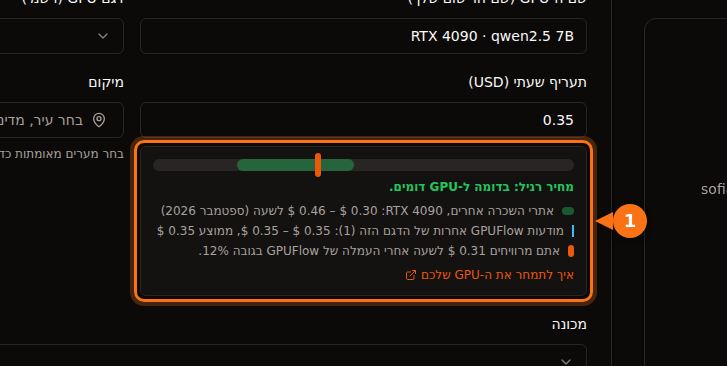

בספטמבר 2026, ‏H100 אחד עולה כ-$6.90 לשעה ב-AWS או ב-Azure, ‏$11.06 ל-GPU ב-Google Cloud, ‏$3.99 ב-Lambda, ‏$2.69 עד $3.49 ב-RunPod, ומכ-$1.50 ב-Vast.ai. כרטיסים צרכניים יש רק בשווקים: ‏RTX 4090 עולה $0.31 עד $0.34 לשעה בקצה הזול ו-$0.74 בדרג מרכזי הנתונים של RunPod. על אותו H100, השעה הכי יקרה לפי דרישה עולה בערך פי שבעה וחצי מהזולה ביותר.

בהמשך: מאיפה מגיע כל מספר, מה המחיר לשעה כולל, וכמה עולות שלוש משימות טיפוסיות מההתחלה ועד הסוף. כל המחירים הם לפי דרישה אלא אם צוין אחרת, באזורים בארה"ב (us-east-1 ב-AWS, ‏East US ב-Azure, ‏us-central1 ב-Google Cloud), ‏Linux, ונבדקו בספטמבר 2026. המחירים זזים כל חודש, אז התייחסו אליהם כתמונת מצב ובדקו את המקור לפני שאתם מתחייבים לכסף.

## המחירים במבט אחד

GPU של מרכזי נתונים, דולר ל-GPU לשעה:

| ספק | L4 24 GB | A10G / A10 24 GB | A100 80 GB | H100 |
| --- | --- | --- | --- | --- |
| AWS | $0.81 (g6.xlarge) | $1.01 (g5.xlarge, A10G) | $3.43 (רק p4de עם 8 GPU) | $6.88 (p5.4xlarge) |
| Google Cloud | $0.71 (g2-standard-4) | אין | $5.07 (a2-ultragpu-1g) | $11.06 (A3 עם 8 GPU, ÷ 8) |
| Azure | אין | $3.20 (NV36ads A10 v5) | $3.67 (NC24ads A100 v4) | $6.98 (NC40ads H100 v5, NVL 94 GB) |
| Lambda | אין | אין | $2.79 | $3.99 |
| RunPod Community / Secure | אין / $0.49 | אין | $1.39 / $1.59 | $2.69 / $3.49 |
| Vast.ai | מכ-$0.27 | אין | מכ-$0.43 | מכ-$1.47 |

"אין" אומר שלא מצאנו אפשרות מתאימה עם GPU יחיד במחירון של אותו ספק. כרטיסים צרכניים, דולר לשעה:

| GPU | ‏Vast.ai (המודעה הזולה ביותר) | RunPod Community / Secure | טווח מקובל באתרי השכרה |
| --- | --- | --- | --- |
| RTX 3090 24 GB | $0.11 – $0.13 | $0.22 / $0.50 | $0.11 – $0.31 |
| RTX 4090 24 GB | $0.31 – $0.33 | $0.34 / $0.74 | $0.30 – $0.46 |
| RTX 5090 32 GB | $0.41 – $0.47 | $0.69 / $0.99 | $0.41 – $0.69 |

‏AWS, ‏Google Cloud, ‏Azure ו-Lambda לא מציעים כרטיסי RTX צרכניים. המספרים של Vast.ai הם טווחים כי שתי תמונות מצב של getdeploying.com מאותו יום נתנו מינימום קצת שונה, וזה כבר אומר משהו על מחירים בשווקים. העמודה האחרונה היא הטווח ש[מדריך התמחור לספקים של GPUFlow](https://docs.gpuflow.app/he/providers/pricing/) אסף מ-Vast.ai, ‏RunPod, ‏Salad, ‏SimplePod, ‏TensorDock, ‏Hyperstack ו-Lambda בספטמבר 2026.

## מה המחיר לשעה כולל

המספרים האלה לא מתארים בדיוק אותו מוצר, וזה חשוב יותר מהספרה השנייה אחרי הנקודה.

instance אצל ענק ענן כולל הרבה מעבר ל-GPU. ‏p5.4xlarge של AWS מגיע עם 16 vCPU, ‏256 GiB של RAM ו-3.84 TB של NVMe מקומי. ל-NC24ads A100 v4 של Azure יש 24 vCPU ו-220 GiB של RAM. ‏NV36ads A10 v5, הגודל של Azure עם A10 שלם, מגיע עם 36 vCPU, ‏440 GiB של RAM ורישיון GRID לתחנות עבודה וירטואליות, וזה חלק מההסבר למה הוא עולה פי שלושה ממה ש-AWS גובה על כרטיס דומה. אם אתם צריכים רק את ה-GPU, אתם משלמים על כל השאר בכל מקרה.

חלק מה-GPU מגיעים רק בקופסאות גדולות. ב-AWS ה-A100 80 GB נמכר כ-p4de.24xlarge: שמונה GPU, ‏$27.45 לשעה, בלי גודל קטן יותר. מכונת A3 High עם H100 של Google Cloud שבטבלה היא a3-highgpu-8g עם 8 כרטיסים ב-$88.49 לשעה. המחירון של Lambda מציג מחיר ל-GPU, אבל מפרט המכונה שמופיע לצד ה-H100 ‏(208 vCPU, ‏1,800 GiB RAM) מתאר מערכת מרובת GPU, אז בדקו אילו גדלים באמת זמינים לפני שאתם מתכננים סביב $3.99.

בשווקים את המחיר קובע מי שהמכונה שלו. ב-Vast.ai כל מארח קובע תעריף משלו, ואחסון ורוחב פס מתומחרים בנפרד בכל מודעה. ‏Community Cloud של RunPod מחבר ספקים עצמאיים; ה-Secure Cloud שלו רץ במרכזי נתונים ברמת Tier 3 ו-Tier 4. אותו RTX 4090 עולה $0.34 בראשון ו-$0.74 בשני.

מה שהמחיר לשעה לא כולל (דיסק, העברת נתונים, זמן הקמה, זמן בטלה) מפורט ב[העלות האמיתית של השכרת GPU](/he/hidden-fees-in-gpu-rental/). במשימה קטנה התוספות האלה יכולות לעלות יותר מזמן ה-GPU.

## מחירי H100 זה לצד זה

<figure>
<svg viewBox="0 0 720 380" role="img" aria-labelledby="d1-title" xmlns="http://www.w3.org/2000/svg" font-family="system-ui, sans-serif" font-size="15">
<title id="d1-title">גרף עמודות של מחירי H100 לפי דרישה ל-GPU לשעה בספטמבר 2026, מ-11.06 דולר ב-Google Cloud ועד 1.47 דולר ב-Vast.ai</title>
<rect x="0" y="0" width="720" height="380" fill="#ffffff"/>
<text x="20" y="28" fill="#1e1b4b" font-weight="600" text-anchor="end" direction="rtl">H100 אחד, לפי דרישה, דולר לשעת GPU</text>
<line x1="190" y1="44" x2="190" y2="316" stroke="#e2e8f0" stroke-width="1"/>
<text x="190" y="336" text-anchor="middle" fill="#64748b" font-size="13">$0</text>
<line x1="270" y1="44" x2="270" y2="316" stroke="#e2e8f0" stroke-width="1"/>
<text x="270" y="336" text-anchor="middle" fill="#64748b" font-size="13">$2</text>
<line x1="350" y1="44" x2="350" y2="316" stroke="#e2e8f0" stroke-width="1"/>
<text x="350" y="336" text-anchor="middle" fill="#64748b" font-size="13">$4</text>
<line x1="430" y1="44" x2="430" y2="316" stroke="#e2e8f0" stroke-width="1"/>
<text x="430" y="336" text-anchor="middle" fill="#64748b" font-size="13">$6</text>
<line x1="510" y1="44" x2="510" y2="316" stroke="#e2e8f0" stroke-width="1"/>
<text x="510" y="336" text-anchor="middle" fill="#64748b" font-size="13">$8</text>
<line x1="590" y1="44" x2="590" y2="316" stroke="#e2e8f0" stroke-width="1"/>
<text x="590" y="336" text-anchor="middle" fill="#64748b" font-size="13">$10</text>
<line x1="670" y1="44" x2="670" y2="316" stroke="#e2e8f0" stroke-width="1"/>
<text x="670" y="336" text-anchor="middle" fill="#64748b" font-size="13">$12</text>
<text x="180" y="69" text-anchor="end" fill="#1e1b4b">Google Cloud</text>
<rect x="190" y="50" width="442.4" height="26" rx="3" fill="#6366f1"/>
<text x="640.4" y="69" fill="#1e1b4b">$11.06</text>
<text x="180" y="107" text-anchor="end" fill="#1e1b4b">Azure (H100 NVL)</text>
<rect x="190" y="88" width="279.2" height="26" rx="3" fill="#6366f1"/>
<text x="477.2" y="107" fill="#1e1b4b">$6.98</text>
<text x="180" y="145" text-anchor="end" fill="#1e1b4b">AWS</text>
<rect x="190" y="126" width="275.2" height="26" rx="3" fill="#6366f1"/>
<text x="473.2" y="145" fill="#1e1b4b">$6.88</text>
<text x="180" y="183" text-anchor="end" fill="#1e1b4b">Lambda</text>
<rect x="190" y="164" width="159.6" height="26" rx="3" fill="#16a34a"/>
<text x="357.6" y="183" fill="#1e1b4b">$3.99</text>
<text x="180" y="221" text-anchor="end" fill="#1e1b4b">RunPod Secure</text>
<rect x="190" y="202" width="139.6" height="26" rx="3" fill="#16a34a"/>
<text x="337.6" y="221" fill="#1e1b4b">$3.49</text>
<text x="180" y="259" text-anchor="end" fill="#1e1b4b">RunPod Community</text>
<rect x="190" y="240" width="107.6" height="26" rx="3" fill="#16a34a"/>
<text x="305.6" y="259" fill="#1e1b4b">$2.69</text>
<text x="180" y="297" text-anchor="start" fill="#1e1b4b" direction="rtl">Vast.ai (הכי זול)</text>
<rect x="190" y="278" width="58.8" height="26" rx="3" fill="#16a34a"/>
<text x="256.8" y="297" fill="#1e1b4b">$1.47</text>
<line x1="190" y1="44" x2="190" y2="316" stroke="#64748b" stroke-width="1.5"/>
<rect x="190" y="352" width="14" height="14" fill="#6366f1"/>
<text x="212" y="364" fill="#64748b" font-size="13" text-anchor="end" direction="rtl">עננים ציבוריים גדולים</text>
<rect x="360" y="352" width="14" height="14" fill="#16a34a"/>
<text x="382" y="364" fill="#64748b" font-size="13" text-anchor="end" direction="rtl">ענני GPU ושווקים</text>
</svg>
<figcaption>מחירי H100 לפי דרישה ל-GPU אחד, ספטמבר 2026. המחיר של Google Cloud הוא מכונת A3 עם 8 כרטיסים חלקי 8. הגודל של Azure עם GPU יחיד משתמש ב-H100 NVL עם 94 GB. ‏Vast.ai הוא המודעה הזולה ביותר ש-getdeploying.com דיווח עליה באותו יום.</figcaption>
</figure>

הגרף בקנה מידה. שני דברים בולטים. שלושת העננים הגדולים מתקבצים סביב $7 ל-GPU, ו-Google Cloud הרבה מעל זה עם מכונת A3 של 8 כרטיסים. והפער בין AWS למודעה הזולה ביותר ב-Vast.ai הוא יותר מפי ארבעה, על כרטיס שעושה בדיוק אותו חשבון.

מה שהכסף הנוסף קונה הוא אמיתי: ‏SLA, ניירת של תאימות רגולטורית, שאר התשתית שלכם בשכנות, וחוזה תמיכה. גם מה שמוותרים עליו בשוק הוא אמיתי: המארח יכול להיות מפעיל קטן, האמינות משתנה ממודעה למודעה, ואין SLA. לניסוי של סוף שבוע השוק מנצח בקלות. למערכת ייצור בתחום מפוקח הוא הרבה פעמים בכלל לא אופציה.

## מחירי spot ו-instances שניתנים להפסקה

כל ספק בהשוואה הזו מוכר קיבולת פנויה בזול, עם הסיכון שייקחו אותה בחזרה.

| Instance | לפי דרישה | Spot | חיסכון |
| --- | --- | --- | --- |
| AWS g6.xlarge (1× L4) | $0.805 | $0.605 | 25% |
| AWS g5.xlarge (1× A10G) | $1.006 | $0.469 | 53% |
| AWS p5.4xlarge (1× H100) | $6.88 | $2.623 | 62% |
| Google Cloud g2-standard-4 (1× L4) | $0.707 | $0.403 | 43% |
| Google Cloud a3-highgpu-8g (8× H100) | $88.49 | $41.60 | 53% |
| Azure NC24ads A100 v4 (1× A100 80 GB) | $3.673 | $0.679 | 82% |
| Azure NC40ads H100 v5 (1× H100 NVL) | $6.98 | $1.29 | 82% |

מחירי ה-spot של Azure לקוחים מה-API של מחירי הקמעונאות שלה, שבו תעריפי ה-spot ל-A100 ול-H100 נכנסו לתוקף ביולי ובאוגוסט 2026. תעריף ה-spot של H100 היה נמוך מהמודעה הזולה ביותר ל-H100 לפי דרישה שמצאנו בשווקים. מחירי spot משתנים לעתים קרובות והזמינות לא מובטחת, אז זו תמונת מצב בלבד.

ב-Vast.ai, לפי התיעוד, instances שניתנים להפסקה "לרוב זולים ב-50% ויותר מאשר לפי דרישה"; ב-getdeploying.com הופיעו הצעות כאלה ל-RTX 3090 מ-$0.08. ‏spot חוסך כסף רק אם המשימה שלכם כותבת checkpoints ויכולה להמשיך מהמקום שבו נעצרה. אחרת, הפסקה אומרת שאתם משלמים פעמיים על אותן שעות.

## איפה GPUFlow נכנס

גם GPUFlow הוא שוק, אבל הוא משכיר משהו צר יותר. ספקים מריצים מודלי AI (בדרך כלל עם Ollama) על מכונות Linux משלהם, ואתם שוכרים אחד מה-GPU האלה לפי שעה ומקבלים מפתח API תואם OpenAI ‏(base URL ‏`https://gpuflow.app/v1`, עם `/v1/chat/completions` ו-`/v1/models`). אין SSH, אין shell ואין גישה לקבצים, כך שאי אפשר לאמן, לעשות fine-tuning או להריץ קוד משלכם. כדי לקרוא למודל פתוח מסקריפט או מאפליקציה, אתם מדלגים לגמרי על ההקמה: המודל כבר מותקן על המכונה של הספק.

GPUFlow לא קובעת מחירים, אז אין מחיר של GPUFlow לשים בטבלאות. במקום זה, כך עובד התמחור:

- כל ספק קובע מחיר לשעה בדולרים למודעה שלו. כשהוא קובע אותו, טופס המודעה מראה איפה המחיר עומד ביחס לטווח באתרי השכרה אחרים וכמה הוא ירוויח אחרי העמלה.
- אתם מזמינים שעות שלמות, 1 עד 168 כברירת מחדל. כל הסכום שהוזמן נשמר מהקרדיטים שלכם כשההשכרה מתחילה.
- אתם משלמים לפי שנייה, עם מינימום של דקה, מעוגל כלפי מעלה לסנט הבא (החשבון המלא ב[חיוב לפי שנייה או לפי שעה](/he/per-second-vs-hourly-gpu-billing/)). כשאתם מסיימים מוקדם או שהזמן נגמר, החלק שלא נוצל מהסכום השמור חוזר ישר לקרדיטים שלכם.
- אם המכונה של הספק מפסיקה להגיב במשך 10 דקות, ההשכרה מסתיימת ואתם משלמים רק עד ה-heartbeat האחרון של המכונה.
- טוקנים נספרים אבל לא מחויבים. אין בחשבון שורה של דיסק או העברת נתונים, כי אף פעם לא מקבלים מכונה לשמור עליה קבצים.
- קרדיטים נקנים בכרטיס אשראי דרך Stripe, ‏$10 עד $500 לכל טעינה, בלי עמלה. קרדיט אחד הוא $0.01 וקרדיטים לא פגים. הספקים מקבלים 88% מכל חיוב ו-GPUFlow שומרת 12%.

להשוואה ארוכה יותר בין השכרת מפתח API להשכרת קונטיינר, ראו [GPUFlow מול Vast.ai מול RunPod מול SaladCloud](/he/gpuflow-vs-vast-ai-vs-runpod/). אם אתם משווים מחירי GPU לשעה ל-API לפי טוקן, [החשבון נמצא כאן](/he/hourly-gpu-vs-per-token-api/).

## דוגמה 1: משימת אצווה של 3 שעות על כרטיס 24 GB

נניח שאתם רוצים להריץ מודל פתוח של 7B עד 8B על ערימת מסמכים במשך כשלוש שעות. כל כרטיס 24 GB יספיק.

| אפשרות | חישוב | עלות GPU |
| --- | --- | --- |
| Vast.ai RTX 4090 | 3 × $0.31 | $0.93 |
| RunPod Community RTX 4090 | 3 × $0.34 | $1.02 |
| Google Cloud L4 (g2-standard-4) | 3 × $0.707 | $2.12 |
| RunPod Secure RTX 4090 | 3 × $0.74 | $2.22 |
| AWS L4 (g6.xlarge) | 3 × $0.805 | $2.42 |
| AWS A10G (g5.xlarge) | 3 × $1.006 | $3.02 |

בכל אחת מהאפשרויות האלה אתם משלמים גם על ההקמה: התקנת שרת הסקה והורדת המודל על זמן בתשלום. עשרים דקות כאלה מוסיפות $0.10 על הכרטיס ב-Vast.ai ו-$0.27 על ה-L4 ב-AWS.

ב-GPUFlow, קחו לדוגמה מודעה ב-$0.35 לשעה (זה המחיר בצילום המסך שלנו, לא הצעת מחיר). אתם מזמינים 3 שעות, אז $1.05 נשמרים. המשימה מסתיימת אחרי שעתיים ו-10 דקות (7,800 שניות) ואתם מסיימים את ההשכרה. החיוב הוא 7,800 × 35 ÷ 3,600 = 75.8 סנט, מעוגל ל-$0.76, ו-$0.29 חוזרים לקרדיטים שלכם. זה עובד רק אם יש ספק שמריץ את המודל שאתם צריכים.

## דוגמה 2: ‏8 שעות fine-tuning על A100 80 GB

fine-tuning דורש מכונה בשליטתכם, אז GPUFlow לא רלוונטי כאן.

| אפשרות | חישוב | עלות |
| --- | --- | --- |
| ‏Vast.ai, מודעת ה-A100 הזולה ביותר | 8 × $0.43 | $3.44 |
| RunPod Community A100 SXM | 8 × $1.39 | $11.12 |
| RunPod Secure A100 SXM | 8 × $1.59 | $12.72 |
| Lambda A100 SXM 80 GB | 8 × $2.79 | $22.32 |
| Azure NC24ads A100 v4 | 8 × $3.673 | $29.38 |
| Google Cloud a2-ultragpu-1g | 8 × $5.069 | $40.55 |
| AWS p4de.24xlarge (8 GPU) | 8 × $27.45 | $219.60 |

השורה של Vast.ai היא מודעת ה-A100 הזולה ביותר ש-getdeploying.com דיווח עליה (כרטיס SXM במכונה עם 2 GPU; גודל הזיכרון לא הוצג), אז בדקו את המודעה לפני שאתם סומכים על המחיר הזה. השורה של AWS היא לא טעות הקלדה: אם אתם צריכים A100 80 GB אחד ב-AWS, אתם שוכרים שמונה. השורה של Lambda מניחה גודל שאפשר באמת לקבל, ראו את ההערה למעלה.

אם לולאת האימון שלכם שומרת checkpoints כל 15 עד 30 דקות, מחיר ה-spot של Azure,‏ $0.679 לשעה, מוריד את המשימה ל-$5.43, אבל רק אם אתם מצליחים לקבל את הקיבולת.

## דוגמה 3: ‏L4 שמגיש מודל מסביב לשעון

נקודת קצה קטנה להסקה שרצה חודש של 720 שעות:

| אפשרות | חישוב | לחודש |
| --- | --- | --- |
| ‏Vast.ai L4, המודעה הזולה ביותר | 720 × $0.27 | $194.40 |
| RunPod Secure L4 | 720 × $0.49 | $352.80 |
| ‏AWS g6.xlarge, שמור לשנה | 720 × $0.524 | $377.28 |
| Google Cloud g2-standard-4 | 720 × $0.707 | $509.04 |
| ‏AWS g6.xlarge, לפי דרישה | 720 × $0.805 | $579.60 |

במשך כזה ההנחות על התחייבות מתחילות להשפיע: התעריף השמור לשנה של AWS לאותו instance נמוך ב-35% מלפי דרישה. השוק עדיין הכי זול, אבל מארח יחיד הוא נקודת כשל יחידה. אם לנקודת הקצה יש משתמשים, כנראה תרצו שתי מכונות, וזה מכפיל את השורה של השוק ומקטין את הפער ממה שהוא נראה.

## איך הייתי בוחר

לניסויים, יצירת תמונות, אימון LoRA וכל מה שאפשר להריץ מחדש: ‏RTX 3090 או 4090 משוק. הקצה הזול הוא $0.11 עד $0.34 לשעה, ושום דבר בעננים הגדולים לא מתקרב לזה.

למודל גדול שצריך A100 או H100 ולא נמצא בתחום מפוקח: קודם RunPod או Lambda, ו-Vast.ai אם אתם מוכנים לבדוק את ציון האמינות של כל מארח. הסתכלו על מחירי ה-spot ב-Azure וב-Google Cloud לפני שאתם מחליטים; בספטמבר 2026 הם היו תחרותיים באופן מפתיע.

לנתונים מפוקחים, לחברה שכבר רצה על AWS, ‏Azure או Google Cloud, או לכל דבר שדורש SLA: הישארו בענן שלכם וקנו התחייבויות או קיבולת spot כדי להוריד את המחיר. לשלם $7 לשעה על H100 זה הרבה פעמים זול יותר מסקירת אבטחה של ספק חדש.

כדי לקרוא למודל פתוח מקוד בלי להריץ שרת: ‏API. או API לפי טוקן, אם יש כזה שמארח את המודל שאתם רוצים, או השכרה לפי שעה ב-GPUFlow, אם אתם רוצים מחיר קבוע לשעה על מודל של ספק מסוים. [מה צריך כדי לשכור GPU](/he/what-you-need-to-rent-a-gpu/) עובר על צד החשבון.

## מקורות

- AWS: [תמחור EC2 לפי דרישה](https://aws.amazon.com/ec2/pricing/on-demand/), [instances מסוג P5](https://aws.amazon.com/ec2/instance-types/p5/), [instances מסוג P4](https://aws.amazon.com/ec2/instance-types/p4/). המחירים לשעה נקראו מהעותק של Vantage למחירון של AWS: [g6.xlarge](https://instances.vantage.sh/aws/ec2/g6.xlarge?region=us-east-1), [g5.xlarge](https://instances.vantage.sh/aws/ec2/g5.xlarge?region=us-east-1), [p5.4xlarge](https://instances.vantage.sh/aws/ec2/p5.4xlarge?region=us-east-1), [p5.48xlarge](https://instances.vantage.sh/aws/ec2/p5.48xlarge?region=us-east-1), [p4de.24xlarge](https://instances.vantage.sh/aws/ec2/p4de.24xlarge?region=us-east-1)
- Google Cloud: [תמחור VM ממוטבי מאיצים](https://cloud.google.com/products/compute/pricing/accelerator-optimized), [תמחור VM instances](https://cloud.google.com/compute/vm-instance-pricing)
- Azure: [תמחור VM של Linux](https://azure.microsoft.com/en-us/pricing/details/virtual-machines/linux/), [API מחירי הקמעונאות של Azure](https://prices.azure.com/api/retail/prices), גדלים: [NC A100 v4](https://learn.microsoft.com/en-us/azure/virtual-machines/sizes/gpu-accelerated/nca100v4-series), [NCads H100 v5](https://learn.microsoft.com/en-us/azure/virtual-machines/sizes/gpu-accelerated/ncadsh100v5-series), [NVads A10 v5](https://learn.microsoft.com/en-us/azure/virtual-machines/sizes/gpu-accelerated/nvadsa10v5-series)
- Lambda: [תמחור](https://lambda.ai/pricing)
- RunPod: [תמחור](https://www.runpod.io/pricing), [RTX 3090](https://www.runpod.io/gpu-models/rtx-3090), [RTX 4090](https://www.runpod.io/gpu-models/rtx-4090), [RTX 5090](https://www.runpod.io/gpu-models/rtx-5090), [A100 SXM](https://www.runpod.io/gpu-models/a100-sxm), [H100 SXM](https://www.runpod.io/gpu-models/h100-sxm), [סקירת pods](https://docs.runpod.io/pods/overview)
- Vast.ai: [תיעוד התמחור](https://docs.vast.ai/guides/instances/pricing.md). מחירי השוק מ-getdeploying.com: [Vast.ai](https://getdeploying.com/vast-ai), [RTX 3090](https://getdeploying.com/reference/cloud-gpu/nvidia-rtx-3090), [RTX 4090](https://getdeploying.com/reference/cloud-gpu/nvidia-rtx-4090), [RTX 5090](https://getdeploying.com/reference/cloud-gpu/nvidia-rtx-5090), [A100](https://getdeploying.com/reference/cloud-gpu/nvidia-a100), [H100](https://getdeploying.com/reference/cloud-gpu/nvidia-h100)
- GPUFlow: [איך לתמחר את ה-GPU שלכם](https://docs.gpuflow.app/he/providers/pricing/), [חיוב](https://docs.gpuflow.app/he/renters/billing/), [התחלה מהירה עם ה-API](https://docs.gpuflow.app/he/renters/api-quickstart/), [השוק](https://gpuflow.app/he/marketplace)

כולם נבדקו בספטמבר 2026.
