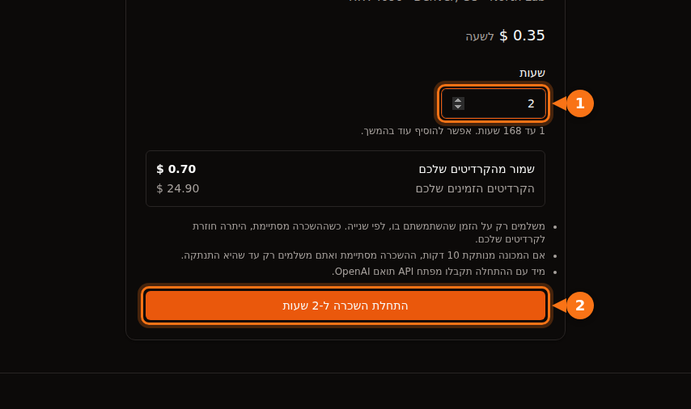

המחיר לשעה במודעת GPU מכסה זמן GPU ותו לא. ברוב הפלטפורמות אתם משלמים גם על מקום בדיסק (הרבה פעמים יותר כשהמכונה עצורה מאשר כשהיא רצה), על העברת נתונים בחלק מהשווקים, על זמן הקמה וזמן בטלה שהמונה סופר כמו עבודה אמיתית, ועל עמלת המטבע של הבנק שלכם. בדוגמה המחושבת בהמשך, חודש שתוכנן ב-$13.60 של זמן RTX 4090 נגמר בחשבון של $42.23.

שום דבר מזה לא מוסתר בכוונה. פשוט קל לפספס את זה כשמשווים פלטפורמות לפי המספר הבולט. כל מה שבהמשך נבדק מול התיעוד ודפי התמחור של כל פלטפורמה בספטמבר 2026; הקישורים בסוף. למחירים הבולטים עצמם, ראו את [השוואת מחירי השכרת GPU](/he/gpu-rental-pricing-comparison-2026/).

## התוספות לפי פלטפורמה

| עלות | Vast.ai | RunPod | Lambda | AWS EC2 | GPUFlow |
| --- | --- | --- | --- | --- | --- |
| יחידת חיוב | לפי שנייה | לפי שנייה | לפי דקה | לפי שנייה, מינימום 60 ש' | לפי שנייה, מינימום דקה |
| אחסון בזמן עצירה | בתעריף של המארח | ‏volume disk ‏$0.20 ל-GB לחודש | מערכות קבצים מחויבות לפי GiB לחודש | ‏EBS ממשיך לחייב | אין |
| העברת נתונים | בתעריף של המארח, כל בייט | בלי עמלות | בלי עמלות | יוצא: 100 GB בחודש בחינם, אחר כך לפי GB | אין |
| כדי להתחיל | פיקדון מינימלי $5 | קרדיט לשעה אחת; $100 לכרטיסים נטענים | תפיסת מסגרת של $10 בכרטיס | אמצעי תשלום | טעינה של $10; ההזמנה נשמרת במלואה |
| היתרה מגיעה לאפס | נעצר, אחר כך נמחק | נעצר; בלי network volume הנתונים אובדים | חיוב שבועי אחרי השימוש | לא רלוונטי | לא יכול לקרות באמצע השכרה |

GPUFlow יכולה לדלג על השורות של אחסון והעברת נתונים כי היא משכירה משהו אחר: מפתח API תואם OpenAI למודלי AI שכבר רצים על GPU של ספק, ולא מכונה שנכנסים אליה. הצד השני של המטבע הוא שאי אפשר להריץ עליה קוד משלכם, לאמן או לעשות fine-tuning. אם אתם צריכים מכונה, ארבע העמודות האחרות הן אלה שרלוונטיות לכם.

## אחסון, במיוחד בזמן עצירה

בכל פלטפורמה שמשכירה לכם מכונה או קונטיינר, הקבצים שלכם יושבים על דיסק, והדיסק עולה כסף כל עוד הוא קיים.

- **RunPod** גובה $0.10 ל-GB לחודש על container disk ועל volume disk בזמן שה-pod רץ. כשעוצרים את ה-pod, ה-container disk נמחק ולא עולה כלום, אבל ה-volume disk עולה ל-$0.20 ל-GB לחודש. ‏network volumes עולים $0.07 ל-GB לחודש מתחת ל-1 TB ו-$0.05 מעל, רץ או לא. תוכניות החיסכון מכסות רק חישוב GPU; אחסון מחויב בתעריף הרגיל.
- **Vast.ai** מחייבת אחסון "על כל שנייה שה-instance שלכם קיים", בכל מצב חוץ מלא מקוון. התיעוד שלה ישיר: "עצירת instance לא חוסכת את עלויות האחסון". את התעריף קובע המארח.
- **AWS** לא גובה על חישוב או העברת נתונים של instance עצור, אבל "נגבים חיובים על אחסון נפחי Amazon EBS", ו-Elastic IP שמחובר ל-instance עצור ממשיך לחייב. נפח gp3 ב-us-east-1 עולה כ-$0.08 ל-GB לחודש.
- **Lambda** מחייבת מערכות קבצים לפי GiB בשימוש לחודש, בקפיצות של שעה.

‏volume disk של 200 GB על pod עצור ב-RunPod עולה 200 × $0.20 = $40 לחודש, גם אם לא תפעילו את ה-pod שוב אף פעם. זה יותר מ-100 שעות של RTX 4090 במחיר ה-Community Cloud של RunPod.

כשהקרדיט נגמר, המצב גרוע יותר. כשהיתרה ב-RunPod מגיעה ל-$0, ‏pods נעצרים, ו"Pods בלי network volume נמחקים, ואי אפשר לשחזר את הנתונים שלהם". גם Vast.ai עוצרת instances, ואם אין לכם כרטיס שמור, "ה-instances והנתונים השמורים שלכם יימחקו" אחרי תקופת חסד קצרה. כך ש-volume ששכחתם או ממשיך לחייב אתכם, או נעלם יחד עם העבודה שעליו.

מה שאני עושה: למחוק volumes ביום שפרויקט נגמר, להשאיר רק את מה שעוד צריך על network volume קטן, ולהחזיק עותק של כל דבר חשוב במקום שהוא לא פלטפורמת ה-GPU.

## העברת נתונים

הורדה של מודל של 15 GB והעלאה של dataset יכולות להזיז עשרות גיגה-בייטים בכל סשן.

- **Vast.ai** גובה "מחירי רוחב פס על כל בייט שנשלח או מתקבל אל ה-instance או ממנו, בלי קשר למצב שלו". כל מארח קובע מחיר משלו להעלאה ולהורדה, והתיעוד מזהיר שזה "יכול להשפיע משמעותית על העלות הכוללת בעומסי עבודה עתירי נתונים". הסתכלו על זה במודעה לפני שאתם שוכרים.
- **RunPod** אומרת של-pods "אין עמלות על תעבורה נכנסת ויוצאת".
- **Lambda**: "לא מחויבים על תעבורה נכנסת או יוצאת".
- **AWS**: תעבורה נכנסת בחינם. תעבורה יוצאת לאינטרנט בחינם ל-100 GB הראשונים בחודש בכל השירותים והאזורים יחד, ואחר כך מחויבת לפי GB בתעריף מדורג. כל כתובת IPv4 ציבורית עולה $0.005 לשעה, בשימוש או לא, כלומר $3.60 בחודש של 720 שעות.

## פיקדונות, תפיסות מסגרת וקרדיט מראש

רוב פלטפורמות ה-GPU עובדות בתשלום מראש: קונים קרדיט, ואז מוציאים אותו. הכסף שחונה שם הוא גם עלות, במיוחד כשאי אפשר להחזיר אותו.

- **Vast.ai**: פיקדון מינימלי של $5, בכרטיס, ב-BitPay או ב-Crypto.com. קרדיט שלא נוצל ונקנה בכרטיס אפשר להחזיר לפי בקשה דרך הצ'אט באתר; קרדיט שנוצל, לא.
- **RunPod**: צריך קרדיט של שעה אחת לפחות ל-pod שבחרתם, ובכרטיסים נטענים כדאי להפקיד לפחות $100 בכל עסקה. קרדיטים לא ניתנים להחזר ולא למשיכה.
- **Lambda** עובדת הפוך: היא מחייבת כל שבוע על השימוש של השבוע הקודם, ותופסת מסגרת של $10 כשמוסיפים כרטיס, שמשתחררת תוך כמה ימים. היא מקבלת רק כרטיסי אשראי מהרשתות הגדולות; כרטיסים נטענים וכרטיסי דביט נדחים.
- **SaladCloud**: טעינות מ-$5 ועד $10,000, והקרדיט פג 12 חודשים אחרי הרכישה.
- **GPUFlow**: טעינות מ-$10 ועד $500 בכרטיס דרך Stripe, בלי עמלה, וקרדיטים לא פגים. כשמתחילים השכרה, כל הסכום שהוזמן נשמר מהקרדיטים שלכם, לא פיקדון קטן. מזמינים 10 שעות ב-$0.40, ו-$4.00 נשמרים עד שההשכרה מסתיימת; מה שלא ניצלתם חוזר בשלב הזה. אי אפשר לפדות קרדיטים שנקנו, והחזרים לכרטיס ניתנים רק על חיוב כפול או שגוי, קרדיטים שלא הגיעו, או דרישה חוקית, בתוך 60 יום.

קרדיט שפג, או שיושב בפלטפורמה שהפסקתם להשתמש בה, הוא כסף שהוצא. טענו לפי העבודה שאתם מצפים לה החודש, לא לשנה.

## זמן הקמה וזמן בטלה

מכונה שכורה מחייבת על זמן, לא על עבודה. שני סוגי זמן עולים כמו עבודה אמיתית ולא מייצרים כלום.

### הקמה

המונה מתחיל כשהמכונה עולה. ב-Lambda, "החיוב מתחיל ברגע שמפעילים instance וה-instance עובר את בדיקות התקינות". התקנת ספריות, משיכת image של קונטיינר והורדת מודל, הכול קורה על זמן בתשלום. ב-$0.34 לשעה, רבע שעה של הקמה עולה כ-$0.09. זניח פעם אחת, אבל תעשו את זה כל יום במשך חודש ויצאו כמה שעות של זמן GPU.

שני דברים עוזרים: להתחיל מתבנית או מ-image שכבר כוללים את הסביבה שלכם, ולהחזיק מודלים על volume כדי להוריד אותם פעם אחת (ואז לשקלל את זה מול עלות האחסון שלמעלה).

ב-GPUFlow אין שלב הקמה מהצד שלכם: הספק כבר התקין את המודלים על המכונה, ואתם מקבלים את מפתח ה-API מיד כשההשכרה מתחילה.

### בטלה

Lambda אומרת את זה בפשטות: "instances מחויבים כל עוד הם רצים, בין אם משתמשים בהם בפועל ובין אם לא". ‏Google Cloud אומרת אותו דבר על VM בטל שעדיין במצב RUNNING. להשאיר pod פועל בלילה כדי שיהיה מוכן בבוקר עולה לילה של זמן GPU.

ב-Azure יש מלכודת נוספת. ‏VM שהוא רק "Stopped" (למשל, כובה מתוך מערכת ההפעלה) עדיין מחויב על הליבות שלו. הוא צריך להיות "Stopped (Deallocated)" מהפורטל או מה-CLI כדי שחיוב החישוב ייגמר.

גם GPUFlow לא חסינה: אתם משלמים עד שאתם לוחצים על **סיום עכשיו** או שהזמן שהוזמן נגמר. סיום מוקדם לא עולה כלום והחלק שלא נוצל מהסכום השמור חוזר, אז הפתרון הוא פשוט לסיים את ההשכרה כשסיימתם. [איך עובד החיוב ב-GPUFlow](https://docs.gpuflow.app/he/renters/billing/).

## יחידות חיוב ומינימום

חיוב לפי שנייה נפוץ היום, אבל הפרטים שונים:

| פלטפורמה | איך הזמן מחויב |
| --- | --- |
| Vast.ai | לפי שנייה |
| ‏RunPod pods | לפי שנייה (דף הסקירה של pods עדיין אומר לפי דקה) |
| ‏RunPod serverless | לפי שנייה, מעוגל כלפי מעלה, כולל זמן העלייה של ה-worker ו-idle timeout ‏(5 שניות כברירת מחדל) |
| Lambda | בקפיצות של דקה |
| ‏AWS EC2 ‏(Linux) | לפי שנייה, מינימום 60 שניות |
| Google Cloud | לפי שנייה אחרי מינימום של דקה |
| Azure | דקות שלמות |
| GPUFlow | לפי שנייה, מינימום דקה, מעוגל כלפי מעלה לסנט הבא |

במשימות ארוכות ההבדלים האלה זניחים. הם משנים כשיש הרבה סשנים קצרים וב-serverless, שם זמן העלייה וה-idle timeout מחויבים בנוסף לבקשות. אם אתם שולחים בקשות קצרות עם הפסקות ביניהן, אלה יכולים לעלות יותר מהבקשות עצמן. [חיוב לפי שנייה או לפי שעה](/he/per-second-vs-hourly-gpu-billing/) עובר על החשבון.

## instances שניתנים להפסקה

קיבולת שניתנת להפסקה (spot) זולה יותר, לפעמים הרבה יותר, אבל אפשר לקחת אותה בחזרה.

- ‏Vast.ai אומרת ש-instances שניתנים להפסקה "לרוב זולים ב-50% ויותר מאשר לפי דרישה".
- ב-AWS בספטמבר 2026, ‏p5.4xlarge ‏(H100 אחד) עלה $2.62 לשעה ב-spot לעומת $6.88 לפי דרישה.
- ב-TensorDock, אחסון מחויב בתעריף הרגיל בנוסף להצעה שלכם, ואתם ממשיכים לשלם עליו גם כשמישהו הציע יותר מכם. המארחים קובעים הצעת מינימום, בדרך כלל סביב 50% מהמחיר לפי דרישה.

העלות הנסתרת היא עבודה שחוזרת על עצמה. אם המשימה שלכם לא יכולה להמשיך מ-checkpoint, הפסקה אחת יכולה למחוק את החיסכון. שמרו checkpoints לעתים קרובות מספיק כדי שאובדן המקטע האחרון לא יכאב.

## העמלות של הבנק שלכם

כמעט כל פלטפורמות ה-GPU, כולל GPUFlow, גובות בדולרים. אם הכרטיס שלכם במטבע אחר, הבנק עלול להוסיף עמלה משלו:

- עמלות עסקה במט"ח הן בדרך כלל 1% עד 3%, וחלק מהבנקים גובים אותן על רכישות מבתי עסק זרים גם כשהמחיר מוצג בדולרים.
- רוב כרטיסי האשראי הקנדיים גובים כ-2.5% על רכישות במטבע אחר.
- בברזיל, מס ה-IOF על רכישות בינלאומיות בכרטיס עומד על 3.5% מאז יולי 2025.

בטעינה של $100 זה $1 עד $3.50 שלא תראו בחשבונית של הפלטפורמה. כרטיס בלי עמלת עסקה במט"ח מבטל את רוב זה.

## דוגמה מחושבת: ‏$0.34 לשעה, ‏$42 לחודש

הנה חודש מציאותי על RTX 4090 מה-Community Cloud של RunPod ב-$0.34 לשעה, עם כרטיס אשראי קנדי:

- 40 שעות של עבודה בפועל: ‏40 × $0.34 = $13.60. זה המספר שאנשים מתקצבים.
- 20 סשנים עם רבע שעה של הקמה בכל אחד, 5 שעות: ‏5 × $0.34 = $1.70.
- שני לילות שבהם ה-pod נשאר פועל, 10 שעות כל אחד: ‏20 × $0.34 = $6.80.
- ‏volume disk של 100 GB שנשמר כל החודש. הוא רץ 65 מתוך 720 שעות החודש ועומד עצור ב-655 האחרות: ‏100 × ($0.10 × 65/720 + $0.20 × 655/720) = כ-$19.10.
- סכום ביניים $41.20, ועוד עמלת עסקה במט"ח של 2.5%: ‏$1.03.

סך הכול: ‏$42.23, כמעט פי 3.1 מעבודת ה-GPU שתכננתם. ‏RunPod לא גובה על העברת נתונים, כך שאצל מארח ב-Vast.ai עם מחיר לרוחב פס הייתה עוד שורה אחת.

<figure>
<svg viewBox="0 0 720 300" role="img" aria-labelledby="d1-title" xmlns="http://www.w3.org/2000/svg" font-family="system-ui, sans-serif" font-size="15">
<title id="d1-title">גרף עמודות מוערמות: חודש שתוכנן ב-13.60 דולר של זמן RTX 4090 הופך לחשבון של 42.23 דולר אחרי זמן הקמה, לילות בטלה, אחסון בדיסק ועמלת כרטיס</title>
<rect x="0" y="0" width="720" height="300" fill="#ffffff"/>
<text x="20" y="28" fill="#1e1b4b" font-weight="600" text-anchor="end" direction="rtl">חודש אחד על RTX 4090 ב-$0.34 לשעה</text>
<line x1="130" y1="50" x2="130" y2="170" stroke="#e2e8f0" stroke-width="1"/>
<text x="130" y="190" text-anchor="middle" fill="#64748b" font-size="13">$0</text>
<line x1="250" y1="50" x2="250" y2="170" stroke="#e2e8f0" stroke-width="1"/>
<text x="250" y="190" text-anchor="middle" fill="#64748b" font-size="13">$10</text>
<line x1="370" y1="50" x2="370" y2="170" stroke="#e2e8f0" stroke-width="1"/>
<text x="370" y="190" text-anchor="middle" fill="#64748b" font-size="13">$20</text>
<line x1="490" y1="50" x2="490" y2="170" stroke="#e2e8f0" stroke-width="1"/>
<text x="490" y="190" text-anchor="middle" fill="#64748b" font-size="13">$30</text>
<line x1="610" y1="50" x2="610" y2="170" stroke="#e2e8f0" stroke-width="1"/>
<text x="610" y="190" text-anchor="middle" fill="#64748b" font-size="13">$40</text>
<text x="120" y="84" text-anchor="start" fill="#1e1b4b" direction="rtl">מתוכנן</text>
<rect x="130" y="62" width="163.2" height="34" rx="3" fill="#6366f1"/>
<text x="301.2" y="84" fill="#1e1b4b">$13.60</text>
<text x="120" y="144" text-anchor="start" fill="#1e1b4b" direction="rtl">חויב</text>
<rect x="130" y="122" width="163.2" height="34" fill="#6366f1"/>
<rect x="293.2" y="122" width="20.4" height="34" fill="#eef2ff" stroke="#6366f1" stroke-width="1.5"/>
<rect x="313.6" y="122" width="81.6" height="34" fill="#f97316"/>
<rect x="395.2" y="122" width="229.2" height="34" fill="#64748b"/>
<rect x="624.4" y="122" width="12.4" height="34" fill="#1e1b4b"/>
<text x="644.8" y="144" fill="#1e1b4b" font-weight="600">$42.23</text>
<line x1="130" y1="50" x2="130" y2="170" stroke="#64748b" stroke-width="1.5"/>
<rect x="20" y="209" width="16" height="16" fill="#6366f1"/>
<text x="44" y="222" fill="#1e1b4b" text-anchor="end" direction="rtl">עבודת GPU: ‏$13.60</text>
<rect x="250" y="209" width="16" height="16" fill="#eef2ff" stroke="#6366f1" stroke-width="1.5"/>
<text x="274" y="222" fill="#1e1b4b" text-anchor="end" direction="rtl">הקמה: ‏$1.70</text>
<rect x="480" y="209" width="16" height="16" fill="#f97316"/>
<text x="504" y="222" fill="#1e1b4b" text-anchor="end" direction="rtl">לילות בטלה: ‏$6.80</text>
<rect x="20" y="245" width="16" height="16" fill="#64748b"/>
<text x="44" y="258" fill="#1e1b4b">‏volume disk: ‏$19.10</text>
<rect x="250" y="245" width="16" height="16" fill="#1e1b4b"/>
<text x="274" y="258" fill="#1e1b4b" text-anchor="end" direction="rtl">עמלת כרטיס: ‏$1.03</text>
</svg>
<figcaption>הדוגמה המחושבת מהסעיף הזה, בקנה מידה: 40 שעות של עבודת GPU אמיתית ב-$0.34 לשעה, ועוד 5 שעות הקמה, שני לילות שנשכחו, ‏volume disk של 100 GB שנשמר כל החודש ועמלת כרטיס של 2.5%. עבודת ה-GPU היא פחות משליש מהחשבון.</figcaption>
</figure>

הפריט הגדול ביותר הוא בכלל לא ה-GPU, אלא דיסק שעמד עצור 91% מהחודש. הפתרון משעמם: למחוק את ה-volume או להקטין אותו, ולסיים את ה-pod כשמפסיקים לעבוד.

### רשימת בדיקה לפני שמשכירים

1. חברו זמן GPU ועוד אחסון לכל התקופה שבה תשמרו את הקבצים, בתעריף של זמן עצירה.
2. בדקו את מחיר רוחב הפס במודעה אם לפלטפורמה יש כזה, והעריכו כמה תורידו.
3. ספרו את זמן ההקמה כזמן בתשלום.
4. דעו איך תפסיקו לשלם: לסיים את ההשכרה, לעצור את המכונה או לבצע לה deallocate, למחוק את ה-volume.
5. דעו [מה קורה לנתונים שלכם אם היתרה מגיעה לאפס](/he/runpod-vs-vastapi-comparison/).
6. בדקו את עמלת העסקה במט"ח של הכרטיס שלכם.

אם מה שאתם צריכים הוא מודל AI שאפשר לקרוא לו מהקוד, ולא מכונה להריץ עליה תוכנה משלכם, השכרה מבוססת API חוסכת לגמרי את השורות של אחסון, העברת נתונים והקמה. [GPU לפי שעה או API לפי טוקן](/he/hourly-gpu-vs-per-token-api/) משווה את זה לתשלום לפי טוקן, ו[GPUFlow מול Vast.ai מול RunPod מול SaladCloud](/he/gpuflow-vs-vast-ai-vs-runpod/) מסביר איזו פלטפורמה מתאימה לאיזו עבודה. לאימון או לכל דבר אחר שדורש מכונה מלאה, רשימת הבדיקה הזו היא הדרך לשמור את החשבון קרוב למחיר לשעה.

## מקורות

- RunPod: [תמחור pods ואחסון](https://docs.runpod.io/pods/pricing), [דף התמחור](https://www.runpod.io/pricing), [סקירת pods](https://docs.runpod.io/pods/overview), [תמחור serverless](https://docs.runpod.io/serverless/pricing), [מידע על חיוב](https://docs.runpod.io/references/billing-information), [מחירי RTX 4090](https://www.runpod.io/gpu-models/rtx-4090)
- Vast.ai: [תמחור](https://docs.vast.ai/guides/instances/pricing.md), [חיוב](https://docs.vast.ai/documentation/reference/billing), [התחלה מהירה (פיקדון מינימלי)](https://docs.vast.ai/guides/get-started/quickstart.md)
- Lambda: [חיוב](https://docs.lambda.ai/public-cloud/billing/), [ניהול חיוב](https://docs.lambda.ai/public-cloud/manage-billing/)
- SaladCloud: [חיוב](https://docs.salad.com/general/explanation/billing.md)
- TensorDock: [spot instances](https://docs.tensordock.com/virtual-machines/spot-instances)
- AWS: [תמחור EC2 לפי דרישה](https://aws.amazon.com/ec2/pricing/on-demand/), [איך עובדים עצירה והפעלה](https://docs.aws.amazon.com/AWSEC2/latest/UserGuide/how-ec2-instance-stop-start-works.html), [תמחור VPC ‏(IPv4 ציבורי)](https://aws.amazon.com/vpc/pricing/), [מחירי p5.4xlarge דרך Vantage](https://instances.vantage.sh/aws/ec2/p5.4xlarge?region=us-east-1), מחיר gp3: [מדריך התמחור של EBS מ-CloudBurn](https://cloudburn.io/blog/amazon-ebs-pricing)
- Google Cloud: [תמחור VM instances](https://cloud.google.com/compute/vm-instance-pricing)
- Azure: [תמחור VM של Linux ושאלות נפוצות](https://azure.microsoft.com/en-us/pricing/details/virtual-machines/linux/)
- עמלות כרטיס: [Experian](https://www.experian.com/blogs/ask-experian/what-is-a-foreign-transaction-fee/), [NerdWallet קנדה](https://www.nerdwallet.com/ca/p/best/credit-cards/best-no-foreign-transaction-fee-credit-cards), ‏IOF בברזיל: [Wise ברזיל](https://wise.com/br/blog/iof-cartao-internacional)
- GPUFlow: [חיוב](https://docs.gpuflow.app/he/renters/billing/), [צעדים ראשונים](https://docs.gpuflow.app/he/renters/getting-started/), [השוק](https://gpuflow.app/he/marketplace)

כולם נבדקו בספטמבר 2026.
