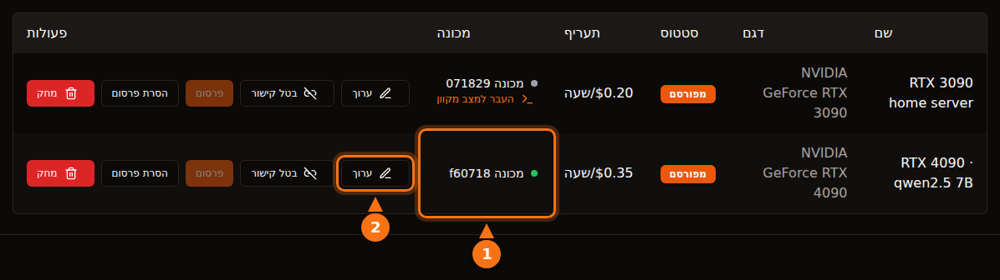

זה בטוח במידה סבירה אם בוחרים פלטפורמה בעיניים פקוחות, אבל "בטוח" אומר דברים שונים בפלטפורמות שונות. בפלטפורמות קונטיינרים כמו Vast.ai, שוכר מריץ קוד משלו על המכונה שלכם, והתעבורה שלו יוצאת מכתובת ה-IP שלכם; הבידוד מרחיק אותו מהקבצים שלכם, לא מהרשת שלכם ולא מחשבון החשמל. בתכנון שמבוסס רק על API, כמו GPUFlow, שוכר יכול רק לשלוח בקשות צ'אט למודלים שהתקנתם, והסיכון מתהפך: הפרומפטים קריאים במכונה שלכם, ולכן שוכרים לא צריכים לשלוח שום דבר סודי.

הפוסט הזה עובר על שני הכיוונים. טענות של צד שלישי נבדקו מול התיעוד של כל פלטפורמה בספטמבר 2026, וכל מה שנכתב על GPUFlow מבוסס על קוד המקור והתיעוד שלו. המקורות מופיעים בסוף.

## מה שוכר יכול לעשות בפלטפורמת קונטיינרים

רוב שווקי ה-GPU משכירים קונטיינר. השוכר בוחר image, מקבל shell ומריץ מה שהוא רוצה. זה משאיר לכם, המארחים, חמישה דברים לחשוב עליהם.

- **קוד שרירותי.** הקוד של השוכר רץ על הקרנל שלכם, בתוך קונטיינר או VM. הבידוד טוב אבל לא מושלם; בריחה מקונטיינר היא נדירה, והיא בדיוק סוג הבאג שמתוקן בעדכוני קרנל ודרייברים שאתם צריכים להתקין.
- **כתובת ה-IP שלכם.** תעבורה יוצאת מהקונטיינר עוברת דרך חיבור האינטרנט שלכם. אם שוכר עושה scraping לאתר, שולח ספאם או סורק את האינטרנט, תלונת השימוש לרעה מגיעה לספק האינטרנט שלכם, ממוענת לכתובת ה-IP שלכם. תנאי השימוש של Vast.ai קובעים שמשתמשים משפים את הספקים מפני תביעות שנובעות מתוכן של משתמשים. זה עוזר בסכסוך עם צד שלישי, אבל לא מונע מספק האינטרנט לשלוח לכם אזהרה.
- **פורטים פתוחים.** מדריך האירוח של Vast.ai אומר ש"ברוב העבודות לקוחות צריכים פורטים פתוחים כדי להתחבר ישירות למכונה", ולכן אתם מבצעים port forwarding בראוטר.
- **דיסק.** שוכרים מורידים images, מודלים ודאטהסטים לכוננים שלכם. Vast.ai משחרר את המקום כשלקוח מוחק volume, אבל כל עוד ההשכרה רצה, המקום שלו.
- **חשמל, חום ודרייברים.** Vast.ai אומר למארחים: "צפו שה-GPU ינוצל קרוב לקיבולת המרבית לאורך כל תקופת ההשכרה". מדובר בשעות של צריכת הספק מלאה של הכרטיס, חום בחדר ומאווררים שמסתובבים. פלטפורמות קונטיינרים דורשות גם הגדרה מסוימת: המדריך של Vast.ai כולל התקנת Ubuntu, חלוקת דיסקים למחיצות, התקנת דרייברים של NVIDIA ופתיחת פורטים בראוטר.

## איך Vast.ai, ‏Salad ו-RunPod מבודדים שוכרים

| | Vast.ai | Salad | RunPod Community Cloud |
| --- | --- | --- | --- |
| **מה השוכר מקבל** | קונטיינר (או VM) עם SSH או Jupyter | קונטיינר שהוא עצמו פרס; SSH וטרמינל web לתוכו | pod (קונטיינר) |
| **בידוד** | קונטיינרים של Docker ללא הרשאות מיוחדות | VM של Linux על hypervisor, וקונטיינר בתוכו | "קונטיינר משלו עם הפרדה קפדנית" |
| **פורטים נכנסים** | נדרשים ברוב העבודות | חסומים כברירת מחדל | לא צוין |
| **מארחים חדשים** | כן, על Ubuntu | כן, על Windows 10/11 | כבר לא מתקבלים |

- **Vast.ai** אומר ש"לקוחות מבודדים בקונטיינרים של Docker ללא הרשאות מיוחדות, ויש להם גישה רק לנתונים שלהם", עם namespaces ו-cgroups נפרדים, ובידוד של רשת, מערכת קבצים ותהליכים. הוא גם מזהיר שוכרים ש"רמת האבטחה של ספקים משתנה מאוד", ומפנה עבודה רגישה לשכבת Secure Cloud שלו, של דאטה סנטרים מוסמכים.
- **Salad** אומר: "עומס העבודה שלכם רץ בתוך קונטיינר תואם OCI על מכונה וירטואלית של Linux, מבודד מ-Windows ומכל תהליך אחר על המארח", כשחיבורים נכנסים חסומים כברירת מחדל. הוא מגן על שוכרים גם מפני מארחים: אם מארח "מנסה לגשת לסביבת ה-Linux, אנחנו מפרקים את הסביבה אוטומטית ומכניסים את המכונה לרשימה שחורה". בנפרד, Salad מציע עבודות אופציונליות של שיתוף רוחב פס, שבהן מעבדים "תוכן וידאו מפלטפורמות סטרימינג בתשלום" דרך החיבור שלכם; דף התמיכה שלו מזהיר שזה מגדיל את צריכת הנתונים שלכם ועלול לגרום ל"הגבלת תוכן נדירה וזמנית (בדרך כלל 1-2 ימים) בפלטפורמות הסטרימינג האלה".
- **RunPod** אומר: "Runpod כבר לא מקבל מארחים חדשים ל-Community Cloud". לגבי הקיבולת הקיימת, "כל Pod/worker פועל בקונטיינר משלו", ותנאי השימוש שלו "אוסרים על מארחים לבחון את הנתונים של ה-Pod/worker שלכם".

שלושתם מבודדים את השוכר מהמערכת שלכם. אף אחד מהם לא יכול למנוע מתעבורה שנראית לגיטימית של שוכר לצאת דרך החיבור שלכם, ואף אחד מהם לא טוען אחרת.

## במה התכנון של GPUFlow שונה

GPUFlow משכיר מודל AI מאחורי API תואם OpenAI, לא מכונה. זה משנה למה שוכר יכול להגיע. הנה מה שהקוד עושה.

**הסוכן.** המתקין שם קובץ בינארי יחיד של Go ב-`/usr/local/bin/gpuflow-agent` ומריץ אותו כשירות systemd. אין Docker. יחידת השירות משתמשת ב-`DynamicUser=yes` (משתמש זמני ללא הרשאות), ‏`NoNewPrivileges=yes` (הוא לא יכול לקבל הרשאות נוספות), ‏`ProtectSystem=strict` (המערכת לקריאה בלבד מבחינתו), ‏`ProtectHome=yes` (תיקיות הבית לא נראות לו) ו-`PrivateTmp=yes`. מנוע ההסקה הוא Ollama כברירת מחדל, שמותקן על ידי המתקין של Ollama עצמו כשירות נפרד (ספק יכול במקום זאת להפנות את הסוכן לשרת תואם OpenAI משלו). ההקשחה חלה על הסוכן, לא על Ollama.

**רשת.** הסוכן יוצר רק חיבורים יוצאים: WebSocket על גבי TLS אל `wss://ws.gpuflow.app`, ו-HTTPS אל `gpuflow.app` כדי להירשם ולשלוח heartbeat כל 15 שניות. הוא לא פותח פורטים, אתם לא מבצעים port forwarding בראוטר, ושוכרים לעולם לא לומדים את כתובת ה-IP שלכם. הוא מדבר עם Ollama בכתובת `127.0.0.1:11434`, כתובת ה-loopback שהיא ברירת המחדל של Ollama.

**מה שוכרים יכולים לקרוא.** שוכר מקבל מפתח API ל-`https://gpuflow.app/v1`. ‏GPUFlow עונה בעצמו על `GET /v1/models`, והבקשה היחידה שהוא מעביר למכונה שלכם היא `POST /v1/chat/completions`. לסוכן יש מנעול שני משלו: הוא מעביר רק ארבעה נתיבים מדויקים (`/v1/chat/completions`, ‏`/v1/completions`, ‏`/v1/embeddings` ו-`/v1/models`) ודוחה כל דבר אחר, כולל נקודות הקצה המקוריות `/api/*` של Ollama, שדרכן אפשר היה להוריד, למחוק או ליצור מודלים. הסוכן מטפל בסוג הודעה אחד, בקשת הסקה; כל דבר אחר מתעלמים ממנו.

כלומר, לשוכר אין shell, אין SSH, אין קבצים ואין גישת רשת למכונה שלכם. הוא לא יכול להוריד מודל של 70 GB לדיסק שלכם, והוא לא יכול להשתמש בחיבור שלכם כדי לצאת לאינטרנט. מה שהוא כן יכול לעשות זה להעסיק את ה-GPU שלכם במשך השעות שהזמין, ולציין בשדה `model` כל מודל שהתקנתם.

<figure>
<svg viewBox="0 0 720 380" role="img" aria-labelledby="d1-title" xmlns="http://www.w3.org/2000/svg" font-family="system-ui, sans-serif" font-size="15">
<title id="d1-title">מה שוכר יכול לעשות אצל מארח קונטיינרים, בהשוואה לתכנון שמבוסס רק על API כמו GPUFlow</title>
<rect x="0" y="0" width="720" height="380" fill="#ffffff"/>
<text x="20" y="40" fill="#64748b" font-weight="bold" text-anchor="end" direction="rtl">מה השוכר יכול לעשות</text>
<text x="470" y="40" text-anchor="middle" fill="#1e1b4b" font-weight="bold" direction="rtl">מארח קונטיינרים</text>
<text x="630" y="40" text-anchor="middle" fill="#1e1b4b" font-weight="bold">GPUFlow (API)</text>
<line x1="20" y1="55" x2="700" y2="55" stroke="#e2e8f0" stroke-width="2"/>
<text x="20" y="89" fill="#1e1b4b" text-anchor="end" direction="rtl">להריץ תוכנות משלו</text>
<rect x="430" y="70" width="80" height="28" rx="14" fill="#fff7ed" stroke="#f97316" stroke-width="2"/>
<text x="470" y="89" text-anchor="middle" fill="#1e1b4b" direction="rtl">כן</text>
<rect x="590" y="70" width="80" height="28" rx="14" fill="#f0fdf4" stroke="#16a34a" stroke-width="2"/>
<text x="630" y="89" text-anchor="middle" fill="#1e1b4b" direction="rtl">לא</text>
<line x1="20" y1="110" x2="700" y2="110" stroke="#e2e8f0" stroke-width="1"/>
<text x="20" y="133" fill="#1e1b4b" text-anchor="end" direction="rtl">לפתוח shell או SSH</text>
<rect x="430" y="114" width="80" height="28" rx="14" fill="#fff7ed" stroke="#f97316" stroke-width="2"/>
<text x="470" y="133" text-anchor="middle" fill="#1e1b4b" direction="rtl">כן</text>
<rect x="590" y="114" width="80" height="28" rx="14" fill="#f0fdf4" stroke="#16a34a" stroke-width="2"/>
<text x="630" y="133" text-anchor="middle" fill="#1e1b4b" direction="rtl">לא</text>
<line x1="20" y1="154" x2="700" y2="154" stroke="#e2e8f0" stroke-width="1"/>
<text x="20" y="177" fill="#1e1b4b" text-anchor="end" direction="rtl">לכתוב קבצים לדיסק שלכם</text>
<rect x="430" y="158" width="80" height="28" rx="14" fill="#fff7ed" stroke="#f97316" stroke-width="2"/>
<text x="470" y="177" text-anchor="middle" fill="#1e1b4b" direction="rtl">כן</text>
<rect x="590" y="158" width="80" height="28" rx="14" fill="#f0fdf4" stroke="#16a34a" stroke-width="2"/>
<text x="630" y="177" text-anchor="middle" fill="#1e1b4b" direction="rtl">לא</text>
<line x1="20" y1="198" x2="700" y2="198" stroke="#e2e8f0" stroke-width="1"/>
<text x="20" y="221" fill="#1e1b4b" text-anchor="end" direction="rtl">לשלוח תעבורה מכתובת ה-IP שלכם</text>
<rect x="430" y="202" width="80" height="28" rx="14" fill="#fff7ed" stroke="#f97316" stroke-width="2"/>
<text x="470" y="221" text-anchor="middle" fill="#1e1b4b" direction="rtl">כן</text>
<rect x="590" y="202" width="80" height="28" rx="14" fill="#f0fdf4" stroke="#16a34a" stroke-width="2"/>
<text x="630" y="221" text-anchor="middle" fill="#1e1b4b" direction="rtl">לא</text>
<line x1="20" y1="242" x2="700" y2="242" stroke="#e2e8f0" stroke-width="1"/>
<text x="20" y="265" fill="#1e1b4b" text-anchor="end" direction="rtl">לדרוש פורטים פתוחים בראוטר שלכם</text>
<rect x="430" y="246" width="80" height="28" rx="14" fill="#fff7ed" stroke="#f97316" stroke-width="2"/>
<text x="470" y="265" text-anchor="middle" fill="#1e1b4b" direction="rtl">לרוב</text>
<rect x="590" y="246" width="80" height="28" rx="14" fill="#f0fdf4" stroke="#16a34a" stroke-width="2"/>
<text x="630" y="265" text-anchor="middle" fill="#1e1b4b" direction="rtl">לא</text>
<line x1="20" y1="286" x2="700" y2="286" stroke="#e2e8f0" stroke-width="1"/>
<text x="20" y="309" fill="#1e1b4b" text-anchor="end" direction="rtl">להוריד או למחוק מודלים</text>
<rect x="430" y="290" width="80" height="28" rx="14" fill="#fff7ed" stroke="#f97316" stroke-width="2"/>
<text x="470" y="309" text-anchor="middle" fill="#1e1b4b" direction="rtl">כן</text>
<rect x="590" y="290" width="80" height="28" rx="14" fill="#f0fdf4" stroke="#16a34a" stroke-width="2"/>
<text x="630" y="309" text-anchor="middle" fill="#1e1b4b" direction="rtl">לא</text>
<line x1="20" y1="330" x2="700" y2="330" stroke="#e2e8f0" stroke-width="1"/>
<text x="20" y="353" fill="#1e1b4b" text-anchor="end" direction="rtl">להעסיק את ה-GPU שלכם במשך שעות</text>
<rect x="430" y="334" width="80" height="28" rx="14" fill="#eef2ff" stroke="#6366f1" stroke-width="2"/>
<text x="470" y="353" text-anchor="middle" fill="#1e1b4b" direction="rtl">כן</text>
<rect x="590" y="334" width="80" height="28" rx="14" fill="#eef2ff" stroke="#6366f1" stroke-width="2"/>
<text x="630" y="353" text-anchor="middle" fill="#1e1b4b" direction="rtl">כן</text>
</svg>
<figcaption>עמודת הקונטיינרים מתארת אירוח בסגנון Vast.ai, שבו קבצים ותעבורה נשארים בתוך הקונטיינר של השוכר, אבל עדיין משתמשים בדיסק ובחיבור שלכם. הפרטים משתנים: Salad מריץ קונטיינרים בתוך VM של Linux וחוסם חיבורים נכנסים כברירת מחדל. ב-GPUFlow השוכר רק שולח בקשות צ'אט למודלים שהתקנתם.</figcaption>
</figure>

## מסלול הנתונים, תחנה אחר תחנה

את החלק הזה שוכרים צריכים לקרוא. בקשת צ'אט עוברת דרך ארבעה רכיבי תוכנה, והטקסט קריא ביותר מאחד מהם.

<figure>
<svg viewBox="0 0 720 330" role="img" aria-labelledby="d2-title" xmlns="http://www.w3.org/2000/svg" font-family="system-ui, sans-serif" font-size="15">
<title id="d2-title">בקשת צ'אט ב-GPUFlow עוברת מהאפליקציה של השוכר ל-gpuflow.app, לממסר, לסוכן במחשב של הספק ול-Ollama, והתשובה זורמת חזרה באותה דרך</title>
<rect x="0" y="0" width="720" height="330" fill="#ffffff"/>
<rect x="480" y="50" width="230" height="200" rx="12" fill="#fff7ed" stroke="#f97316" stroke-width="2" stroke-dasharray="6 4"/>
<text x="595" y="76" text-anchor="middle" fill="#1e1b4b" font-weight="bold" direction="rtl">המחשב של הספק</text>
<rect x="10" y="110" width="110" height="70" rx="10" fill="#eef2ff" stroke="#6366f1" stroke-width="2"/>
<text x="65" y="141" text-anchor="middle" fill="#1e1b4b" direction="rtl">האפליקציה</text>
<text x="65" y="161" text-anchor="middle" fill="#1e1b4b" direction="rtl">של השוכר</text>
<rect x="160" y="110" width="120" height="70" rx="10" fill="#eef2ff" stroke="#6366f1" stroke-width="2"/>
<text x="220" y="141" text-anchor="middle" fill="#1e1b4b" font-size="13" direction="rtl">ה-API של GPUFlow</text>
<text x="220" y="161" text-anchor="middle" fill="#64748b" font-size="12">gpuflow.app/v1</text>
<rect x="320" y="110" width="105" height="70" rx="10" fill="#eef2ff" stroke="#6366f1" stroke-width="2"/>
<text x="372" y="141" text-anchor="middle" fill="#1e1b4b" direction="rtl">ממסר</text>
<text x="372" y="161" text-anchor="middle" fill="#64748b" font-size="12">ws.gpuflow.app</text>
<rect x="492" y="110" width="90" height="70" rx="10" fill="#ffffff" stroke="#6366f1" stroke-width="2"/>
<text x="537" y="141" text-anchor="middle" fill="#1e1b4b" direction="rtl">הסוכן</text>
<text x="537" y="161" text-anchor="middle" fill="#1e1b4b" direction="rtl">של GPUFlow</text>
<rect x="610" y="110" width="90" height="70" rx="10" fill="#ffffff" stroke="#6366f1" stroke-width="2"/>
<text x="655" y="141" text-anchor="middle" fill="#1e1b4b">Ollama</text>
<text x="655" y="161" text-anchor="middle" fill="#64748b" font-size="12">127.0.0.1</text>
<line x1="124" y1="145" x2="156" y2="145" stroke="#16a34a" stroke-width="4"/>
<line x1="284" y1="145" x2="316" y2="145" stroke="#64748b" stroke-width="4"/>
<line x1="429" y1="145" x2="488" y2="145" stroke="#16a34a" stroke-width="4"/>
<line x1="586" y1="145" x2="606" y2="145" stroke="#f97316" stroke-width="4"/>
<text x="140" y="102" text-anchor="middle" fill="#16a34a" font-size="13">TLS</text>
<text x="300" y="102" text-anchor="middle" fill="#64748b" font-size="13" direction="rtl">פנימי</text>
<text x="452" y="102" text-anchor="middle" fill="#16a34a" font-size="13">TLS</text>
<text x="596" y="102" text-anchor="middle" fill="#f97316" font-size="13" direction="rtl">לא מוצפן</text>
<text x="65" y="212" text-anchor="middle" fill="#64748b" font-size="12" direction="rtl">כאן הטקסט</text>
<text x="65" y="228" text-anchor="middle" fill="#64748b" font-size="12" direction="rtl">נכתב</text>
<text x="220" y="212" text-anchor="middle" fill="#64748b" font-size="12" direction="rtl">קורא את הטקסט,</text>
<text x="220" y="228" text-anchor="middle" fill="#64748b" font-size="12" direction="rtl">שומר רק</text>
<text x="220" y="244" text-anchor="middle" fill="#64748b" font-size="12" direction="rtl">ספירת טוקנים</text>
<text x="372" y="212" text-anchor="middle" fill="#64748b" font-size="12" direction="rtl">מעביר הלאה,</text>
<text x="372" y="228" text-anchor="middle" fill="#64748b" font-size="12" direction="rtl">לא רושם</text>
<text x="372" y="244" text-anchor="middle" fill="#64748b" font-size="12" direction="rtl">את התוכן</text>
<text x="595" y="212" text-anchor="middle" fill="#1e1b4b" font-size="13" font-weight="bold" direction="rtl">טקסט גלוי בזיכרון</text>
<text x="595" y="230" text-anchor="middle" fill="#1e1b4b" font-size="13" font-weight="bold" direction="rtl">לבעלים יש root</text>
<line x1="20" y1="295" x2="50" y2="295" stroke="#16a34a" stroke-width="4"/>
<text x="58" y="300" fill="#1e1b4b" font-size="13" text-anchor="end" direction="rtl">TLS דרך האינטרנט</text>
<line x1="235" y1="295" x2="265" y2="295" stroke="#64748b" stroke-width="4"/>
<text x="273" y="300" fill="#1e1b4b" font-size="13" text-anchor="end" direction="rtl">בתוך GPUFlow</text>
<line x1="420" y1="295" x2="450" y2="295" stroke="#f97316" stroke-width="4"/>
<text x="458" y="300" fill="#1e1b4b" font-size="13" text-anchor="end" direction="rtl">טקסט גלוי במחשב של הספק</text>
</svg>
<figcaption>הבקשה עוברת משמאל לימין והתשובה זורמת חזרה באותה דרך. TLS מגן על כל קטע שעובר באינטרנט, אבל הוא מסתיים בכל שרת, כך שהטקסט קריא בשרתים של GPUFlow בזמן שהם מעבירים אותו, ובמחשב של הספק, שבו Ollama מריץ את המודל.</figcaption>
</figure>

1. **מהשוכר ל-gpuflow.app:** ‏HTTPS. האתר יושב מאחורי Cloudflare.
2. **מה-API של GPUFlow לממסר שלו:** חיבור פנימי בצד של GPUFlow. ה-API בודק את המפתח, מעביר את גוף הבקשה בלי שינוי ורושם את ספירת הטוקנים. הוא לא שומר את הטקסט של בקשות או של תשובות, ומדיניות הפרטיות שלו אומרת זאת.
3. **מהממסר לסוכן של הספק:** ‏WebSocket על גבי TLS, שהסוכן פתח. הממסר רושם את הסוג של כל הודעה, לא את התוכן שלה.
4. **מהסוכן ל-Ollama:** ‏HTTP לא מוצפן בכתובת ה-loopback בתוך המחשב של הספק. גם הסוכן לא רושם את גוף הבקשות.

אין הצפנה מקצה לקצה עד המודל, ועם מנוע הסקה רגיל גם לא יכולה להיות: המודל צריך לקרוא את הפרומפט כדי לענות עליו.

## מה הספק יכול לראות

במילים פשוטות: **המחשב של הספק מטפל בפרומפטים ובתשובות שלכם כטקסט גלוי.** ‏Ollama רץ שם, ולספק יש הרשאות root במכונה (המתקין דורש אותן). ספק שירצה בכך יכול להקליט את התעבורה ב-loopback, להחליף את המנוע או להפנות את הסוכן לשרת אחר.

מה שעומד בדרך הוא חוזי. תנאי השימוש של GPUFlow קובעים שספקים "אסור להם לתעד, לקרוא, לשמור או לשתף את הבקשות או התשובות של השוכרים, או לשנות את התשובות". זה כלל שיש לו השלכות על החשבון, לא חסימה טכנית. מדיניות הפרטיות אומרת לשוכרים את אותו הדבר: בקשות ותשובות עוברות דרך המחשב של הספק בזמן שההשכרה פעילה.

מעבר לפרומפטים, הספק רואה את שם המשתמש שלכם ב-GPUFlow ומקבל הודעה כשהשכרה מתחילה (מזהה ההשכרה, המודעה ומספר השעות). שוכרים לא רואים שום נתון מהמכונה של הספק; טמפרטורת ה-GPU, ה-VRAM, צריכת החשמל ושאר הטלמטריה מגיעים רק ללוח המחוונים של הבעלים.

הכלל המעשי לשוכרים: **אל תשלחו סודות, פרטי התחברות, מידע אישי על אנשים אחרים או מידע מפוקח (רפואי, פיננסי, חסוי של לקוחות) דרך שום GPU קהילתי.** זה נכון ל-GPUFlow, ובאותה מידה לקונטיינר על מחשב ביתי של מישהו, שבו המארח יכול לבחון את הזיכרון והדיסק עם אותה גישת root. לעבודה רגישה, הריצו את המודל על חומרה שבשליטתכם, או השתמשו בספק שחותם על ההסכם שדרישות הציות שלכם מחייבות. [למה חברות מסוימות אוסרות כלי AI ציבוריים](/he/why-corporate-policies-banning-chatgpt/) עוסק בצד המדיניות, ו[אבטחת דאטהסט על צומת GPU ציבורי](/he/how-to-secure-dataset-on-public-gpu-node/) עוסק בצד הקונטיינרים.

## מה עדיין כרוך בסיכון ב-GPUFlow

גישה של API בלבד מצמצמת את שטח התקיפה. היא לא מבטלת אותו, ועדיף לנו לפרט מה נשאר מאשר להעמיד פנים שאין כלום.

- **Ollama מפענח קלט לא מהימן.** כל בקשה של שוכר מגיעה בסוף כ-JSON שמועבר ל-Ollama. באג ב-Ollama הוא הדרך הסבירה ביותר לפרוץ פנימה, אז עדכנו אותו. רשימת ההיתרים של הסוכן מרחיקה שוכרים מנקודות הקצה של Ollama לניהול מודלים, אבל היא לא יכולה לתקן באג במסלול הצ'אט.
- **המתקין רץ כ-root.** אתם מעבירים סקריפט מ-gpuflow.app ל-`sudo bash`, והוא מריץ גם את סקריפט ההתקנה של Ollama. קראו את שניהם קודם; זה נוהג טוב לכל תוכנת אירוח.
- **אין עדכון אוטומטי.** הסוכן לא מעדכן את עצמו. כדי לקבל גרסה חדשה, הריצו שוב את המתקין, שבודק את הקובץ הבינארי מול קובץ SHA256SUMS כשקובץ כזה מפורסם.
- **עומס.** אין מגבלה על מספר הבקשות. שוכר יכול להחזיק את ה-GPU שלכם בעומס מלא בכל שעה שהזמין, והוא יכול להשתמש בכל מודל שהתקנתם, כולל הגדול ביותר.
- **חום וחשמל.** כמו בכל מקום אחר: שעות מושכרות הן שעות בעומס.

## רשימת בדיקות לספקים

1. **השתמשו במכונה שאתם יכולים להרשות לעצמכם להשאיל.** באופן אידיאלי מחשב ייעודי. לכל הפחות, אל תשמרו קובצי עבודה או מנהלי סיסמאות על המחשב שאתם משכירים, בכל פלטפורמה. ב-GPUFlow הסוכן כבר רץ כמשתמש מערכת זמני כשתיקיות הבית מוסתרות ממנו, אבל Ollama הוא שירות נפרד.
2. **הגבילו את ההספק.** ‏`sudo nvidia-smi -pl 280` קובע את מגבלת ההספק של הכרטיס בוואטים (זה דורש root, והערך חייב להיות בין המגבלה המינימלית למקסימלית של הכרטיס). Puget Systems מדווחים שכרטיסי RTX 3090 שהוגבלו ל-270-280 W שמרו על כ-95% מהביצועים, ומראים איך להחיל את המגבלה מחדש בכל אתחול עם יחידת systemd.
3. **עשו קודם את חשבון החשמל.** קראו את צריכת החשמל בדף **המכונות שלי** בזמן שה-GPU עסוק, ואז הכפילו את הקילוואטים במחיר שלכם לקוט"ש. [כמה ה-GPU לגיימינג שלכם יכול להרוויח](/he/how-much-can-you-earn-renting-out-your-gpu/) עושה את החשבון הזה לכרטיסים נפוצים ולחמש מדינות.
4. **שימו עין על הטמפרטורה.** הנתונים החיים מציגים את טמפרטורות ה-GPU, ה-hotspot והזיכרון ואת מהירות המאוורר. ודאו שלמארז יש זרימת אוויר.
5. **שמרו על המערכת מעודכנת.** התקינו עדכונים של Linux, של דרייבר ה-GPU ושל Ollama. המתקין של GPUFlow לא מנהל את דרייבר ה-GPU שלכם; ‏systemd מפעיל מחדש את הסוכן אחרי אתחול.
6. **דעו איך לעצור.** הסירו את הפרסום של המודעה בדף **ה-GPU שלי**, או הריצו `sudo systemctl stop gpuflow-agent` (‏`start` מחזיר אותו). כל עוד השכרה פעילה, לוח המחוונים לא ישנה את המודעה או את המכונה, ואי אפשר לסיים ממנו השכרה של שוכר. עצירת הסוכן באמצע השכרה מסיימת את ההשכרה אחרי 10 דקות, ואתם מקבלים תשלום רק עד ה-heartbeat האחרון.
7. **דעו איך להסיר את ההתקנה.** השלבים מופיעים ב[תיעוד פתרון הבעיות](https://docs.gpuflow.app/he/providers/troubleshooting/). ‏Ollama נשאר מותקן עד שתסירו אותו.

בפלטפורמות קונטיינרים, הוסיפו עוד שני סעיפים: החליטו אם אתם באמת רוצים פורטים פתוחים בראוטר, ובררו עם ספק האינטרנט מה הוא עושה עם תלונות על שימוש לרעה, כי התעבורה של השוכרים תישא את כתובת ה-IP שלכם.

## רשימת בדיקות לשוכרים

1. **התייחסו לכל GPU קהילתי כאל מחשב של אדם זר.** בלי מפתחות API, סיסמאות, רשומות לקוחות, מידע רפואי או פיננסי בפרומפטים.
2. **הסירו את מה שלא צריך.** החליפו שמות ומספרי חשבון במצייני מקום לפני השליחה.
3. **שמרו על המפתח.** ב-GPUFlow המפתח מפסיק לעבוד כשההשכרה מסתיימת. אם הוא דלף, **מפתח חדש** מבטל את הישן מיד, ו-**סיום עכשיו** עוצר את החיוב ומחזיר את הזמן שלא נוצל.
4. **הניחו שתשובות יכולות להיות שגויות או משובשות.** תנאי השימוש אוסרים על ספקים לשנות תשובות, אבל בדקו כל דבר חשוב.
5. **השתמשו בכלי הנכון לעבודה רגישה.** הריצו בעצמכם, או השתמשו בספק שמציע את החוזה שאתם צריכים. [איך להשתמש במפתח באפליקציות שלכם](/he/use-openai-compatible-api-key-in-apps/) מיועד לכל השאר.

## מקורות

כולם נבדקו בספטמבר 2026.

- GPUFlow: [למה שוכרים יכולים להגיע](https://docs.gpuflow.app/he/providers/security/), [תחילת עבודה לספקים](https://docs.gpuflow.app/he/providers/getting-started/), [תמחור וחשמל](https://docs.gpuflow.app/he/providers/pricing/), [פתרון בעיות והסרת התקנה](https://docs.gpuflow.app/he/providers/troubleshooting/), [מדריך מהיר ל-API](https://docs.gpuflow.app/he/renters/api-quickstart/)
- Vast.ai: [סקירת אירוח](https://docs.vast.ai/host/hosting-overview.md), [שאלות נפוצות על אבטחה](https://docs.vast.ai/documentation/reference/faq/security), [מכונות וירטואליות של Linux](https://docs.vast.ai/linux-virtual-machines), [תנאי שימוש](https://vast.ai/terms), [הרצת מודלי AI פרטיים](https://vast.ai/article/running-private-ai-models-without-the-risk-of-data-exposure)
- Salad: [אבטחה](https://salad.com/security), [עומסי עבודה בקונטיינרים והמחשב שלכם](https://community.salad.com/container-workloads-and-your-pc/), [שיתוף רוחב פס](https://support.salad.com/faq/jobs/what-is-bandwidth-sharing/), [SSH וטרמינל](https://docs.salad.com/container-engine/explanation/container-groups/ssh-and-terminal.md), [הורדה ודרישות מערכת](https://salad.com/download/)
- RunPod: [בחירת pod](https://docs.runpod.io/pods/choose-a-pod), [אבטחת נתונים ועמידה בדרישות חוקיות](https://docs.runpod.io/hosting/partner-requirements)
- Ollama: [שאלות נפוצות (כתובת ברירת המחדל להאזנה)](https://docs.ollama.com/faq)
- NVIDIA: [המדריך של nvidia-smi](https://docs.nvidia.com/deploy/nvidia-smi/index.html)
- Puget Systems: [הגבלת הספק של RTX 3090 עם systemd ו-nvidia-smi](https://www.pugetsystems.com/labs/hpc/quad-rtx3090-gpu-power-limiting-with-systemd-and-nvidia-smi-1983/)
