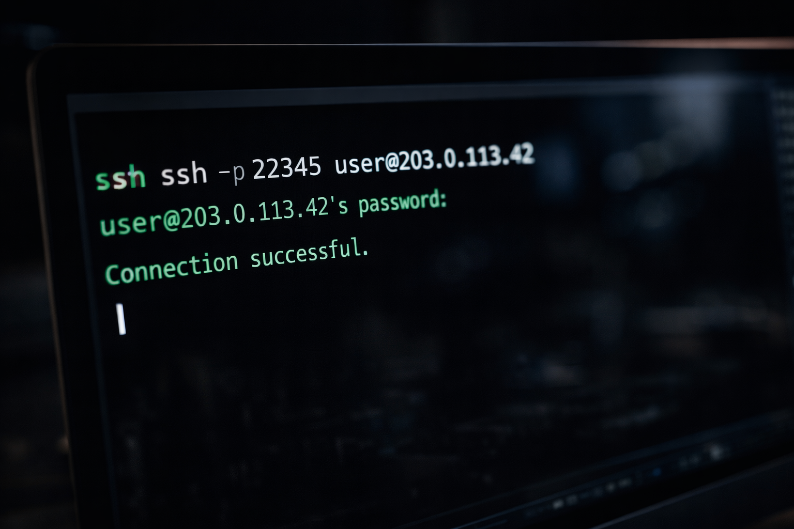
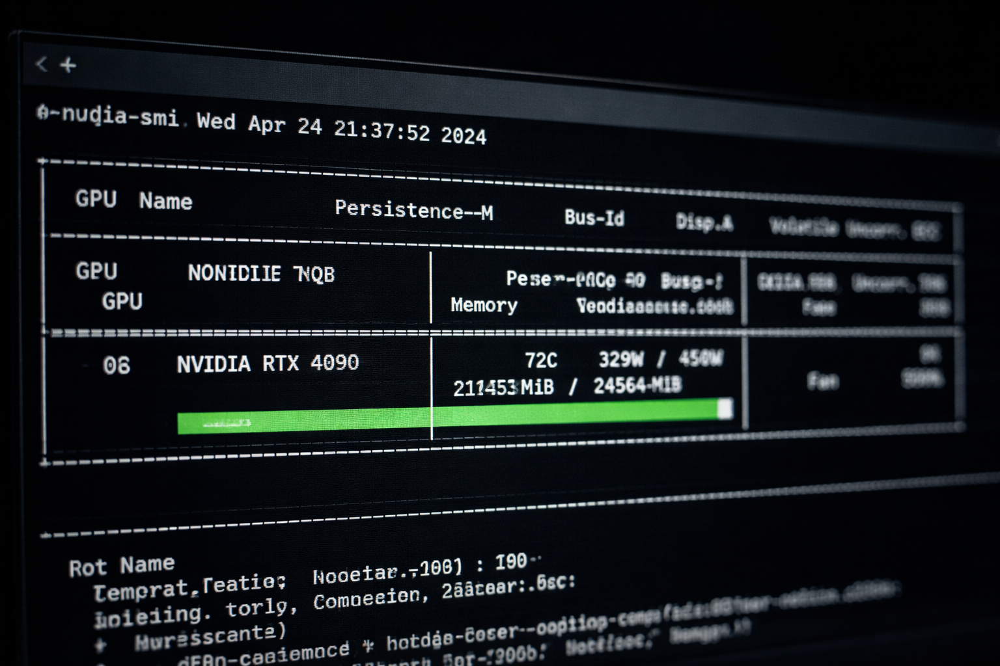

אם אתם קוראים את זה, כנראה יש לכם מערך נתונים שאתם לא יכולים, או לא מוכנים, להעלות ל-OpenAI.

אתם לא לבד. עבור ארגונים רבים ומפתחים עצמאיים, הנוחות של ChatGPT לא שווה את הסיכון הבלתי קביל של דליפת מידע. בין אם מדובר ברשומות רפואיות שכפופות ל-HIPAA, בקוד קנייני שמגלם שנים של השקעה הנדסית או במודלים פיננסיים רגישים שיכולים להזיז שווקים, שימוש ב-AI בענן פירושו פעמים רבות להפקיד בידי צד שלישי את הקניין הרוחני היקר ביותר שלכם.

כשהצד השלישי הוא תאגיד טכנולוגיה עם היסטוריה של שימוש בנתוני לקוחות לאימון מודלים עתידיים, "אמון" הופך למילה לא נוחה.

הפתרון הוא לא לוותר על AI. הפתרון הוא להחזיק בתשתית.

כוונון עדין של מודלים עם משקלים פתוחים על חומרה שבשליטתכם כבר מזמן אינו תחביב אקדמי. זו דרישה עסקית לארגונים שמקפידים על פרטיות. מודלים כמו Llama, ‏Mistral, ‏Qwen ועשרות אחרים זמינים לשימוש מסחרי, בלי עמלות API ובלי חובה לשתף נתונים. האתגר תמיד היה הגישה למחשוב. רכישת אשכולות NVIDIA H100 דורשת השקעה של מיליונים. השכרה מ-AWS דורשת אימות זהות, הסכמים ארגוניים ותעריפים שעתיים שהופכים הרצות אימון ארוכות ליקרות מדי.

המדריך הזה מציג דרך שלישית. תלמדו איך לבצע כוונון עדין למודל שפה עם משקלים פתוחים על GPU שאתם שוכרים במרקטפלייס, לרוב חומרה שבבעלות אנשים פרטיים ברחבי העולם. נעבור על הקמת הסביבה, נוהלי אבטחה לעבודה על צמתים ציבוריים והרצת האימון המלאה.

דוגמאות הקוד משתמשות ב-Llama-3.1-8B כנקודת ייחוס מעשית, אבל תהליך העבודה זהה לכל מודל שתואם ל-Hugging Face. החליפו את מזהה המודל ותוכלו לכוונן את Mistral-7B, ‏Qwen2-7B או כל מודל עם משקלים פתוחים שמתאים לצרכים שלכם.

כל זה בלי חוזים לטווח ארוך, ובשבריר ממה שספקי הענן המסורתיים גובים.



## הכלכלה של כוונון עדין פרטי

לפני שנצלול למימוש הטכני, כדאי להבין את התמונה הכספית.

אימון מודל ב-AWS פירושו מופעים גדולים ובקשות להגדלת מכסה. המופע p4d.24xlarge ‏(8x A100) עולה 32.77$ לשעה, וחשבונות AWS חדשים מתחילים עם מכסת GPU של אפס.

במרקטפלייס GPU שוכרים כוח מחשוב ישירות מבעלי החומרה. להבדל הזה יש השלכות משמעותיות:

**הוזלת עלויות:** RTX 4090 מושכר במרקטפלייסים בכ-0.30$ עד 0.46$ לשעה (ספטמבר 2026). במודלים של 8B פרמטרים עם QLoRA, כרטיס 4090 יחיד עם 24GB של VRAM מסיים הרצת כוונון עדין תוך שעתיים עד שש שעות, בהתאם לגודל מערך הנתונים. עלות המחשוב הכוללת נעה בין שלושה לשמונה דולר.

**הנתונים נשארים על מכונה אחת:** מעתיקים את מערך הנתונים ישירות למכונה המושכרת דרך SSH, מאמנים, מורידים את התוצאה ומוחקים הכול. בלי דלי אחסון ובלי עותק שלישי.

**בלי שומרי סף:** לא צריך אישור מצוות המכירות הארגוני של ספק ענן או הגדלת מכסה. מוסיפים קרדיט בתשלום מראש ושוכרים חומרה.

לשם השוואה: A10G יחיד ב-AWS ‏(g5.xlarge, האפשרות הזולה ביותר עם 24GB של VRAM) עולה כ-1.01$ לשעה ב-us-east-1. הוסיפו את בקשת המכסה, זמן ההקמה ומחשוב שעומד בטל בזמן שאתם מגדירים את הסביבה, והעלות האמיתית של הרצה ראשונה גבוהה בהרבה מכמה הדולרים שהיא עולה במרקטפלייס.

פירטנו את החשבון הזה בכתבות [השוואת מחירי השכרת GPU](/he/gpu-rental-pricing-comparison-2026/) ו[העלות האמיתית של השכרת GPU](/he/hidden-fees-in-gpu-rental/).

## דרישות מוקדמות

המדריך מניח היכרות עם שורת הפקודה של Linux. לא צריך תואר מתקדם בלמידת מכונה, אבל כדאי שתרגישו בנוח לנווט במערכת קבצים, לערוך קבצי טקסט ולפענח הודעות שגיאה.

**דרישות חומרה:**

- **GPU:** לפחות 24GB של VRAM. ‏RTX 3090, ‏RTX 4090 ו-A10G עומדים בדרישה. למודל של 70B פרמטרים צריך 48GB ומעלה (A6000, שני A100 או H100).
- **זיכרון RAM:** ‏32GB ומעלה. בזמן טעינת המודל המשקלים נטענים קודם לזיכרון המערכת ורק אחר כך מועברים ל-GPU.
- **אחסון:** ‏100GB ומעלה של NVMe SSD. משקלי הבסיס של Llama-3 8B תופסים כ-16GB. מערך הנתונים, נקודות הביקורת (checkpoints) והמתאם שמתקבל בסוף מוסיפים עוד.

**הערה לגבי בחירת המודל:** המדריך משתמש ב-Llama-3.1-8B של Meta כדוגמה
מעשית, כי זו הקטגוריה הגדולה ביותר של מודלים שנכנסת ל-GPU יחיד של 24GB
עם קוונטיזציית QLoRA. משפחת Llama כוללת היום גם את Llama 4 Scout ו-Maverick,
אבל הם בנויים בארכיטקטורת Mixture of Experts עם 109B ו-400B פרמטרים בסך הכול
בהתאמה, ודורשים תצורות מרובות GPU שחורגות מהיקף של השכרת צומת
יחיד. תהליך העבודה שמתואר כאן מתאים באותה מידה ל-Mistral-7B, ‏Qwen2-7B, ‏Gemma-2-9B
ולכל מודל אחר שתואם ל-Hugging Face ונכנס למגבלות ה-VRAM של החומרה
שאתם שוכרים.

**דרישות תוכנה:**

- Python 3.10 ומעלה
- שליטה בסיסית ב-PyTorch
- חשבון Hugging Face (נדרש להורדת מודלים מוגבלים כמו Llama, שמחייבים אישור רישיון)
- חשבון עם קרדיט בתשלום מראש במרקטפלייס GPU שמשכיר מכונות שלמות עם גישת SSH, כמו Vast.ai, ‏RunPod או TensorDock

לא בטוחים באיזה לבחור? קראו [מה צריך כדי לשכור GPU](/he/what-you-need-to-rent-a-gpu/) ואת [GPUFlow מול Vast.ai מול RunPod מול SaladCloud](/he/gpuflow-vs-vast-ai-vs-runpod/). שימו לב ש-GPUFlow עצמה לא מתאימה למדריך הזה: היא משכירה גישה למודלי AI דרך API, לא מכונה שאפשר להתחבר אליה.

## שלב 1: השגת צומת מחשוב מאובטח

השלב הראשון הוא להשיג חומרה. בפלטפורמות הענן הגדולות זה אומר לפתוח חשבון, לבקש מכסת GPU ולחכות לאישור. במרקטפלייס התהליך ישיר הרבה יותר.

היכנסו למרקטפלייס שבחרתם והוסיפו קרדיט. הממשק מציג את המכונות הזמינות עם המפרט, התעריף השעתי וציון האמינות של כל אחת.

סננו מכונות עם המאפיינים הבאים:

- **GPU:** ‏RTX 4090 ‏(24GB VRAM) או RTX 6000 Ada ‏(48GB VRAM)
- **RAM:** לפחות 32GB
- **אחסון:** ‏100GB ומעלה פנויים
- **אמינות:** ציון זמינות של 95% ומעלה

בחרו מכונה והתחילו את ההשכרה. בחרו אימג' שכבר מותקנים בו CUDA ו-PyTorch; זה חוסך זמן הקמה, וגם על זמן ההקמה משלמים.

**שיקולי אבטחה בצמתים ציבוריים:**

כשאתם שוכרים מכונה ברשת מרוחקת כלשהי, אתם ניגשים לחומרה שבבעלות אדם זר ובשליטתו הפיזית. שכבת הווירטואליזציה מספקת בידוד של ממש, אבל צריך לעבוד בזהירות המתאימה:

1. **אל תשמרו מפתחות פרטיים על המכונה המרוחקת.** מפתחות SSH למערכות אחרות, פרטי גישה לענן וטוקני API של שירותי ייצור לא צריכים להיות על צומת מושכר אף פעם.

2. **התייחסו למערכת הקבצים כעוינת.** הניחו שכל מה שאתם כותבים לדיסק יכול, לפחות בתיאוריה, להיות משוחזר על ידי המארח אחרי שתתנתקו. בשלב 6 נעבור על נוהלי מחיקה מאובטחת.

3. **הצפינו נתונים רגישים בזמן ההעברה.** נטפל בזה בשלב 3.

4. **אל תשתמשו שוב באותן סיסמאות.** אם ממשק ההשכרה נותן פרטי התחברות ברירת מחדל, שנו אותם מיד או צרו זוג מפתחות SSH חדש.

אחרי שההשכרה מאושרת, לוח הבקרה מציג את פרטי החיבור. תקבלו פקודת SSH שנראית בערך כך:

```bash
ssh -p 22345 user@203.0.113.42
```

פתחו טרמינל במחשב המקומי והריצו את הפקודה. אשרו את טביעת האצבע של מפתח המארח כשתתבקשו. עכשיו אתם מחוברים לצומת ה-GPU ששכרתם.

ודאו שהחומרה תואמת להזמנה:

```bash
nvidia-smi
```

הפלט אמור להציג את ה-GPU ששכרתם, את נפח הזיכרון שלו ואת גרסת הדרייבר המותקנת. אם ה-GPU לא מופיע או שהמפרט שונה ממה שהזמנתם, התנתקו מיד ודווחו על הפער לתמיכה של המרקטפלייס.

## שלב 2: הגדרת הסביבה

אחרי שחיבור ה-SSH אומת, העדיפות הבאה היא לבנות סביבת Python נקייה. רוב הצמתים המושכרים מגיעים עם דרייברים של NVIDIA וערכות CUDA מותקנות מראש, אבל הסתמכות על חבילות ה-Python ברמת המערכת של המארח מזמינה התנגשויות תלויות שיגזלו שעות של דיבאג.

ניצור סביבה וירטואלית מבודדת כדי להבטיח יציבות ויכולת שחזור.

הריצו את הפקודות הבאות כדי ליצור את סביבת העבודה:

```bash
mkdir ~/llama3-finetune
cd ~/llama3-finetune
python3 -m venv venv
source venv/bin/activate
```

שורת הפקודה אמורה להציג עכשיו `(venv)`, סימן שהסביבה הווירטואלית פעילה. כל התקנות החבילות מכאן והלאה יישארו בתוך התיקייה הזו, ומערכת המארח לא תיפגע.

לפני התקנת חבילות Python, ודאו שערכת הכלים של CUDA נגישה:

```bash
nvcc --version
```

רשמו את מספר הגרסה של CUDA. תצטרכו אותו כדי להבטיח תאימות ל-PyTorch. רוב הצמתים המושכרים מריצים CUDA 11.8 או 12.1. אם `nvcc` לא נמצא, ייתכן שערכת הכלים של CUDA לא נמצאת ב-PATH. בדרך כלל אפשר לפתור את זה בטעינת קובץ הסביבה המתאים:

```bash
source /etc/profile.d/cuda.sh
```

אם הקובץ הזה לא קיים, עיינו בתיעוד של המרקטפלייס לגבי התצורה של הצומת שלכם.

עכשיו התקינו את האקוסיסטם של PyTorch. הפקודה הבאה מתקינה PyTorch עם תמיכה ב-CUDA 12.1. אם הצומת מריץ גרסה אחרת, התאימו את סיומת גרסת ה-CUDA:

```bash
pip install torch torchvision torchaudio --index-url https://download.pytorch.org/whl/cu121
```

לאחר מכן התקינו את הספריות שנדרשות לכוונון עדין יעיל. אנחנו משתמשים באקוסיסטם של Hugging Face, יחד עם bitsandbytes לקוונטיזציה ו-PEFT לאימון יעיל בפרמטרים:

```bash
pip install transformers==4.40.0 datasets==2.19.0 peft==0.10.0 bitsandbytes==0.43.1 trl==0.8.6 accelerate==0.29.0
```

**נעילת גרסאות חשובה.** הגרסאות שלמעלה נבדקו ונמצאו תואמות בזמן הכתיבה. האקוסיסטם של Hugging Face מתפתח מהר, והתקנות בלי גרסאות נעולות מכניסות לא פעם שינויים שוברים. אם נתקלתם בשגיאות import או בהתנהגות לא צפויה, אי-התאמת גרסאות היא החשודה העיקרית.

לבסוף, התחברו ל-Hugging Face. המשקלים של Llama-3 מוגנים בהסכם רישיון שדורש חשבון Hugging Face. היכנסו ל[מאגר Meta Llama-3](https://huggingface.co) ואשרו את תנאי הרישיון. אחר כך צרו טוקן גישה בדף ההגדרות של Hugging Face.

הריצו את פקודת ההתחברות:

```bash
huggingface-cli login
```

הדביקו את טוקן הגישה כשתתבקשו. הטוקן נשמר ב-`~/.cache/huggingface/token`. עכשיו יש לכם הרשאה להוריד משקלים של מודלים מוגבלים ישירות לצומת המושכר.


## שלב 3: העברת נתונים מאובטחת

החלק הזה עוסק בסיבה העיקרית לכך שאתם שוכרים מכונה במקום לקרוא ל-API: ריבונות על הנתונים.

תהליך העבודה המקובל בענן כולל העלאה של מערך הנתונים לדלי אחסון, כמו S3, ‏Google Cloud Storage או Azure Blob, ואז הורדה שלו למופע המחשוב. הגישה הזו יוצרת כמה עותקים של הנתונים הרגישים שלכם במערכות שאינן בשליטתכם. לספק האחסון יש גישה. לספק המחשוב יש גישה. שניהם שומרים לוגים של הפעילות שלכם.

אנחנו נעקוף את כל זה בעזרת העברה מוצפנת ישירה.

פרוטוקול SSH כולל את `scp` ‏(Secure Copy Protocol), שמעביר קבצים באותו ערוץ מוצפן שמשמש לגישה לטרמינל. הנתונים עוברים ישירות מהמחשב המקומי לצומת המושכר, בלי לגעת באחסון ביניים כלשהו.

פתחו **חלון טרמינל חדש** ב**מחשב המקומי**. אל תסגרו את סשן ה-SSH הקיים לצומת המושכר. הריצו את הפקודה הבאה, עם נתיב הקובץ ופרטי החיבור האמיתיים שלכם:

```bash
scp -P 22345 /path/to/your/dataset.jsonl user@203.0.113.42:~/llama3-finetune/
```

הדגל `-P` מציין את מספר הפורט (שימו לב ל-P גדולה, בשונה מ-`-p` הקטנה של ssh). במערכי נתונים גדולים ההעברה עשויה להימשך כמה דקות. תראו פלט התקדמות עם כמות הבתים שהועברו.

**במערכי נתונים שגדולים מ-1GB**, כדאי לדחוס לפני ההעברה:

```bash
# On your local machine
gzip -k dataset.jsonl
scp -P 22345 dataset.jsonl.gz user@203.0.113.42:~/llama3-finetune/

# Then on the remote node
cd ~/llama3-finetune
gunzip dataset.jsonl.gz
```

**אמצעי אבטחה נוספים:**

אם מודל האיומים שלכם כולל יריבים מתוחכמים, אפשר להצפין את מערך הנתונים לפני ההעברה עם GPG או age. זו שכבת הגנה נוספת: גם אם ההעברה איכשהו יורטה, התוכן יישאר בלתי קריא.

```bash
# On your local machine (using age encryption)
age -p dataset.jsonl > dataset.jsonl.age
scp -P 22345 dataset.jsonl.age user@203.0.113.42:~/llama3-finetune/

# On the remote node
age -d dataset.jsonl.age > dataset.jsonl
rm dataset.jsonl.age
```

לרוב המשתמשים, העברת SCP רגילה מספקת הגנה מספקת. פרוטוקול SSH משתמש בהצפנת AES-256. אימות מפתח המארח מונע מתקפות אדם-בתווך. הנתונים שלכם לא עוברים דרך אף מערכת אחסון של צד שלישי.

## שלב 4: סקריפט הכוונון העדין

נשתמש במחלקה `SFTTrainer` של הספרייה TRL ‏(Transformer Reinforcement Learning) כדי לבצע כוונון עדין מפוקח. הספרייה מסתירה הרבה מהמורכבות ועדיין מאפשרת הגדרה מלאה לעומסי עבודה בסביבת ייצור.

לפני כתיבת סקריפט האימון, צריך להבין באיזה פורמט הוא מצפה לקבל את הנתונים.

**דרישות הפורמט של מערך הנתונים:**

הסקריפט מצפה לקובץ JSONL ‏(JSON Lines) שבו כל שורה מכילה אובייקט JSON תקין עם שדה `text`. השדה `text` צריך להכיל את דוגמת האימון המלאה כמחרוזת אחת.

הנה דוגמה לשלוש שורות בפורמט הנכון:

```json
{"text": "### Instruction: Summarize the following legal clause in plain English.\n\n### Input: Party A shall indemnify, defend, and hold harmless Party B from any claims, damages, or expenses arising from Party A's negligence or willful misconduct.\n\n### Response: Party A agrees to protect Party B from any legal claims or costs that result from Party A's mistakes or intentional wrongdoing."}
{"text": "### Instruction: Extract the key financial metrics from this earnings report.\n\n### Input: Q3 revenue reached $4.2B, up 12% YoY. Operating margin improved to 23.5% from 21.2%. Free cash flow was $890M.\n\n### Response: Revenue: $4.2 billion (12% year-over-year growth). Operating margin: 23.5% (up from 21.2%). Free cash flow: $890 million."}
{"text": "### Instruction: Identify potential HIPAA violations in this process description.\n\n### Input: Patient records are emailed to the billing department as PDF attachments. The billing staff prints these for manual review and shreds them after processing.\n\n### Response: Potential violations include: unencrypted email transmission of PHI, physical documents that may be visible to unauthorized personnel during processing, and lack of documented chain of custody. Recommend encrypted file transfer and on-screen review only."}
```

**הערות פורמט קריטיות:**

1. כל אובייקט JSON חייב לתפוס שורה אחת בדיוק. בלי JSON שמתפרס על כמה שורות.
2. ירידות שורה בתוך השדה `text` חייבות להיות מסומנות כ-`\n`.
3. מירכאות בתוך הטקסט חייבות להיות מסומנות כ-`\"`.
4. הקובץ חייב להיות בקידוד UTF-8.

אם נתוני המקור בפורמט אחר (CSV, ‏Parquet, עמודות נפרדות להוראה ולתשובה), צריך לעבד אותם למבנה הזה לפני ההעברה. הספרייה `json` של Python מטפלת בסימון התווים המיוחדים אוטומטית:

```python
import json

with open('dataset.jsonl', 'w') as f:
    for example in your_data:
        text = f"### Instruction: {example['instruction']}\n\n### Input: {example['input']}\n\n### Response: {example['output']}"
        f.write(json.dumps({"text": text}) + '\n')
```

אחרי שמערך הנתונים במקום, צרו את סקריפט האימון בצומת המרוחק:

```bash
cd ~/llama3-finetune
nano train.py
```

הדביקו את התצורה הבאה. הסקריפט משתמש ב-QLoRA כדי לכוונן מודל של 8B פרמטרים במסגרת מגבלות הזיכרון של GPU עם 24GB. הדוגמה משתמשת ב-Llama-3.1-8B, אבל אפשר להחליף לכל מודל תואם על ידי שינוי המשתנה MODEL_NAME:

```python
import torch
from datasets import load_dataset
from transformers import (
    AutoModelForCausalLM,
    AutoTokenizer,
    BitsAndBytesConfig,
    TrainingArguments,
)
from peft import LoraConfig
from trl import SFTTrainer

# ============================================
# CONFIGURATION - Modify these values as needed
# ============================================

# Base model identifier on Hugging Face
# Change this to fine-tune a different model (e.g., "mistralai/Mistral-7B-v0.1")
MODEL_NAME = "meta-llama/Llama-3.1-8B"

# Name for your fine-tuned adapter
OUTPUT_NAME = "llama-3-8b-custom"

# Path to your dataset
DATASET_PATH = "dataset.jsonl"

# Training hyperparameters
NUM_EPOCHS = 1
BATCH_SIZE = 4
LEARNING_RATE = 2e-4
MAX_SEQ_LENGTH = 512

# LoRA hyperparameters
LORA_RANK = 16
LORA_ALPHA = 16
LORA_DROPOUT = 0.05

# ============================================
# QUANTIZATION CONFIGURATION
# ============================================

bnb_config = BitsAndBytesConfig(
    load_in_4bit=True,
    bnb_4bit_quant_type="nf4",
    bnb_4bit_compute_dtype=torch.float16,
    bnb_4bit_use_double_quant=True,
)

# ============================================
# MODEL LOADING
# ============================================

print("Loading base model...")
model = AutoModelForCausalLM.from_pretrained(
    MODEL_NAME,
    quantization_config=bnb_config,
    device_map="auto",
    trust_remote_code=True,
)
model.config.use_cache = False

print("Loading tokenizer...")
tokenizer = AutoTokenizer.from_pretrained(MODEL_NAME, trust_remote_code=True)
tokenizer.pad_token = tokenizer.eos_token
tokenizer.padding_side = "right"

# ============================================
# DATASET LOADING
# ============================================

print(f"Loading dataset from {DATASET_PATH}...")
dataset = load_dataset("json", data_files=DATASET_PATH, split="train")
print(f"Dataset contains {len(dataset)} examples")

# ============================================
# LORA CONFIGURATION
# ============================================

peft_config = LoraConfig(
    r=LORA_RANK,
    lora_alpha=LORA_ALPHA,
    lora_dropout=LORA_DROPOUT,
    bias="none",
    task_type="CAUSAL_LM",
    target_modules=["q_proj", "k_proj", "v_proj", "o_proj"],
)

# ============================================
# TRAINING ARGUMENTS
# ============================================

training_args = TrainingArguments(
    output_dir="./results",
    num_train_epochs=NUM_EPOCHS,
    per_device_train_batch_size=BATCH_SIZE,
    gradient_accumulation_steps=1,
    learning_rate=LEARNING_RATE,
    weight_decay=0.001,
    fp16=True,
    logging_steps=10,
    save_steps=100,
    save_total_limit=3,
    optim="paged_adamw_32bit",
    lr_scheduler_type="cosine",
    warmup_ratio=0.03,
    report_to="none",
)

# ============================================
# TRAINER INITIALIZATION AND EXECUTION
# ============================================

print("Initializing trainer...")
trainer = SFTTrainer(
    model=model,
    train_dataset=dataset,
    peft_config=peft_config,
    dataset_text_field="text",
    max_seq_length=MAX_SEQ_LENGTH,
    tokenizer=tokenizer,
    args=training_args,
)

print("Starting training...")
trainer.train()

print(f"Saving adapter to {OUTPUT_NAME}...")
trainer.model.save_pretrained(OUTPUT_NAME)
tokenizer.save_pretrained(OUTPUT_NAME)

print("Training complete.")
```

שמרו את הקובץ עם `Ctrl+O` וצאו עם `Ctrl+X`.

**הפרמטרים המרכזיים:**

- **LORA_RANK (r=16):** קובע את כושר הביטוי של המתאם המכוונן. ערכים גבוהים לומדים יותר אבל דורשים יותר זיכרון. ערכים בין 8 ל-64 מקובלים.

- **LORA_ALPHA (16):** מקדם קנה המידה של משקלי ה-LoRA. כלל אצבע נפוץ הוא לקבוע אותו שווה לדרגה.

- **MAX_SEQ_LENGTH (512):** האורך המרבי בטוקנים של דוגמת אימון. רצפים ארוכים יותר דורשים יותר זיכרון. אם נתקלתם בשגיאות OOM, הקטינו את הערך הזה קודם.

- **BATCH_SIZE (4):** מספר הדוגמאות שמעובדות במקביל. הקטינו ל-2 או ל-1 אם אין מספיק זיכרון.

- **target_modules:** השכבות הספציפיות שבהן מוזרקים מתאמי ה-LoRA. ב-Llama-3, שכבות ההטלה של מנגנון הקשב (q, k, v, o) נותנות את התוצאות הטובות ביותר.

כדי להתחיל את האימון, הריצו:

```bash
python train.py
```

הסקריפט יוריד קודם את משקלי מודל הבסיס (כ-16GB למודל 8B). זה קורה רק פעם אחת; בהרצות הבאות ייעשה שימוש במשקלים השמורים במטמון. בסיום הטעינה תראו את התקדמות האימון, עם ערכי loss שמודפסים כל 10 צעדים.

## שלב 5: מעקב אחרי הרצת האימון

בזמן שסקריפט האימון רץ, צריך לעקוב אחרי מצב ה-GPU. אם ה-VRAM מתמלא או שהטמפרטורה עוברת את הסף הבטוח, התהליך יקרוס, עלול להשחית את נקודת הביקורת ולבזבז את זמן ההשכרה שלכם.

פתחו חלון טרמינל שני במחשב המקומי ופתחו חיבור SSH נוסף לצומת המושכר:

```bash
ssh -p 22345 user@203.0.113.42
```

הריצו את הפקודה הבאה כדי לראות נתוני GPU בזמן אמת:

```bash
watch -n 1 nvidia-smi
```



הכלי מתרענן כל שנייה ומציג ניצול זיכרון, אחוז ניצול GPU וטמפרטורה. ב-RTX 4090 שמריץ את התצורה מהמדריך, אתם אמורים לראות:

- **ניצול זיכרון:** ‏18GB עד 22GB מתוך 24GB הזמינים
- **ניצול GPU:** ‏90% עד 100% בזמן צעדי אימון פעילים
- **טמפרטורה:** ‏60°C עד 80°C, בהתאם לפתרון הקירור של המארח

**פתרון בעיות נפוצות:**

**הזיכרון מתקרב ל-24GB:** אם ניצול הזיכרון נוגע בתקרה באופן קבוע, הקטינו את הפרמטר `BATCH_SIZE` בסקריפט האימון ל-2 או ל-1. לחלופין, הקטינו את `MAX_SEQ_LENGTH` ל-256. כל אחד מהשינויים מחייב להפעיל את האימון מחדש.

**ניצול GPU קרוב ל-0%:** בדרך כלל זה מעיד על צוואר בקבוק בטעינת הנתונים. ה-CPU לא מספיק להזין דוגמאות ל-GPU מהר מספיק. זה פחות נפוץ בצמתים עם NVMe, אבל יכול לקרות עם מערכי נתונים גדולים מאוד. שקלו לעבד מראש את מערך הנתונים לפורמט יעיל יותר (Arrow/Parquet) לפני ההעברה.

**טמפרטורה מעל 85°C:** יש מארחים שמריצים GPU במארזים עם אוורור גרוע. טמפרטורה גבוהה לאורך זמן עלולה להפעיל האטה תרמית (thermal throttling) ולהאט את האימון. אם הטמפרטורה עוברת 85°C באופן קבוע, שקלו לסיים את ההשכרה ולבחור צומת אחר. נזק לחומרה הוא הבעיה של המארח, אבל זמן אבוד ונקודות ביקורת פגומות הם הבעיה שלכם.

**איך לקרוא את עקומת ה-loss:**

סקריפט האימון מדפיס ערך loss כל 10 צעדים. המספר הזה מייצג עד כמה התחזיות של המודל "שגויות", וככל שהוא נמוך יותר, טוב יותר. אתם אמורים לראות:

- **loss התחלתי:** בדרך כלל בין 1.5 ל-3.0, בהתאם למערך הנתונים
- **מגמה:** ירידה עקבית לאורך כמה מאות הצעדים הראשונים
- **loss סופי:** בדרך כלל בין 0.5 ל-1.5 בהרצה מוגדרת היטב

אם ה-loss נתקע מיד (בלי ירידה אחרי 100 צעדים), ייתכן שקצב הלמידה נמוך מדי. אם ה-loss קופץ בפראות או עולה, קצב הלמידה גבוה מדי. ערך ברירת המחדל `2e-4` עובד טוב ברוב מערכי הנתונים, אבל ייתכן שתצטרכו לכוונן אותו.

אם ה-loss יורד בצורה חלקה ואז מזנק פתאום לערכים גבוהים מאוד (10 ומעלה), כנראה שיש במערך הנתונים דוגמאות פגומות. עצרו את האימון, בדקו את קובץ ה-JSONL לאיתור שגיאות קידוד או תווים שלא סומנו כראוי, והפעילו מחדש.

הרצת כוונון עדין טיפוסית על 1,000 דוגמאות מסתיימת תוך 30 עד 60 דקות על RTX 4090. במערכי נתונים גדולים יותר הזמן גדל בערך באופן ליניארי: 10,000 דוגמאות דורשות 5 עד 10 שעות.

## שלב 6: הורדת המודל וניקוי הסביבה

כשהאימון מסתיים, המשקלים המכווננים נמצאים כמתאם LoRA בתיקייה שהוגדרה ב-`OUTPUT_NAME`. המתאם קומפקטי, בדרך כלל 100MB עד 500MB, לעומת 16GB של מודל הבסיס המלא.

קודם כול, ודאו שקבצי המתאם קיימים:

```bash
ls -la ~/llama3-finetune/llama-3-8b-custom/
```

אתם אמורים לראות קבצים כמו `adapter_config.json`, ‏`adapter_model.safetensors` וקבצי הטוקנייזר.

**אל תמזגו את המתאם בצומת המושכר.** מיזוג משלב את משקלי ה-LoRA עם מודל הבסיס ויוצר מודל מכוונן עצמאי. הפעולה הזו דורשת לטעון לזיכרון את מודל הבסיס המלא ב-16 ביט, וזה עלול לחרוג מה-VRAM הזמין בכרטיס של 24GB. בצעו את המיזוג בתשתית המקומית שלכם, או פשוט טענו את המתאם לצד מודל הבסיס בזמן ההסקה. הספרייה PEFT מטפלת בזה בקלות:

```python
from peft import PeftModel
from transformers import AutoModelForCausalLM

base_model = AutoModelForCausalLM.from_pretrained(
    "meta-llama/Llama-3.1-8B",
    device_map="auto",
)
model = PeftModel.from_pretrained(base_model, "./llama-3-8b-custom")
```

כדי להוריד את המתאם, חזרו ל**טרמינל המקומי** (לא לסשן ה-SSH) והריצו:

```bash
scp -r -P 22345 user@203.0.113.42:~/llama3-finetune/llama-3-8b-custom ./
```

הדגל `-r` מאפשר העתקה רקורסיבית של התיקייה כולה. ודאו שההעברה הושלמה בהצלחה על ידי השוואת גודלי הקבצים המקומיים לאלה שבצומת המרוחק.

**ניקוי הסביבה המרוחקת:**

השלב הזה מבדיל בין אנשי מקצוע לחובבים. הצומת המושכר מכיל עכשיו את מערך הנתונים הקנייני שלכם, את קוד האימון ומשקלי מודל שמורים במטמון. להשאיר את כל זה על מכונה שאינה בשליטתכם זו הפרה של כללי אבטחה בסיסיים.

חזרו לסשן ה-SSH בצומת המושכר והריצו את הפקודות הבאות:

```bash
# Remove your working directory and all contents
rm -rf ~/llama3-finetune

# Clear the Hugging Face cache (contains downloaded model weights)
rm -rf ~/.cache/huggingface

# Clear Python package cache
rm -rf ~/.cache/pip

# Clear bash history
history -c
cat /dev/null > ~/.bash_history

# Clear any potential swap residue (may require sudo depending on node config)
sync
```

אם בצומת יש `shred` ואתם רוצים ביטחון נוסף שלא ניתן יהיה לשחזר את הקבצים שנמחקו:

```bash
# Secure deletion (slower but more thorough)
find ~/llama3-finetune -type f -exec shred -u {} \;
rm -rf ~/llama3-finetune
```

התנתקו מסשן ה-SSH:

```bash
exit
```

חזרו ללוח הבקרה של המרקטפלייס וסיימו את ההשכרה, כולל כל נפח אחסון שמחובר אליה, כדי להפסיק לשלם עליה.

## הרצת הסקה עם המודל המכוונן

אחרי שהמתאם הורד למחשב המקומי, אפשר להריץ הסקה בלי שום תלות בענן. הנה דוגמה מינימלית:

```python
import torch
from transformers import AutoModelForCausalLM, AutoTokenizer, BitsAndBytesConfig
from peft import PeftModel

# Quantization config (same as training)
bnb_config = BitsAndBytesConfig(
    load_in_4bit=True,
    bnb_4bit_quant_type="nf4",
    bnb_4bit_compute_dtype=torch.float16,
)

# Load base model
base_model = AutoModelForCausalLM.from_pretrained(
    "meta-llama/Llama-3.1-8B",
    quantization_config=bnb_config,
    device_map="auto",
)

# Load your fine-tuned adapter
model = PeftModel.from_pretrained(base_model, "./llama-3-8b-custom")

# Load tokenizer
tokenizer = AutoTokenizer.from_pretrained("meta-llama/Llama-3.1-8B")

# Generate a response
prompt = "### Instruction: Summarize the contract clause.\n\n### Input: The Licensee shall not reverse engineer, decompile, or disassemble the Software.\n\n### Response:"

inputs = tokenizer(prompt, return_tensors="pt").to("cuda")
outputs = model.generate(**inputs, max_new_tokens=100, temperature=0.7)
response = tokenizer.decode(outputs[0], skip_special_tokens=True)

print(response)
```

לפריסה בסביבת ייצור, שקלו לעטוף את הקוד הזה ב-API עם FastAPI או Flask, או לפרוס אותו דרך שרתי הסקה כמו vLLM או Text Generation Inference ‏(TGI). השווינו ביניהם ב-[Ollama מול vLLM מול TGI על RTX 4090](/he/ollama-vs-vllm-vs-tgi-rtx-4090-benchmark/).

## סיכום

ביצעתם כוונון עדין למודל שפה גדול על נתונים קנייניים, והנתונים ישבו על מכונה אחת בלבד לזמן הקצר ביותר האפשרי. עשיתם את זה בלי לחתום על חוזים ארגוניים ובלי לתת לתאגיד טכנולוגיה גישה לקניין הרוחני שלכם.

העלות הכוללת של התהליך, בהנחה של הרצת אימון של שעתיים על RTX 4090 ב-0.45$ לשעה, הייתה תשעים סנט. A10G יחיד ב-AWS עולה כ-1.01$ לשעה, כך שגם שם ההרצה עצמה לא יקרה. ההבדל הוא בבקשת המכסה ובהקמה.

וחשוב מזה: מערך הנתונים שלכם לא עבר דרך אף שירות אחסון, והוא נמחק מהמכונה המושכרת כשסיימתם.

עידן התלות ב-API סגורים מתקרב לסופו. לארגונים שזקוקים לפרטיות, לחוקרים שמעריכים ריבונות ולמפתחים שרוצים שליטה יש חלופה. GPU בהשכרה מחזיר לידיהם את התשתית, את העלויות ואת הנתונים.

המודל המכוונן שלכם נמצא עכשיו על חומרה שבשליטתכם. ההחלטות איך לפרוס אותו, למי תהיה גישה אליו ולאילו מטרות הוא ישמש שייכות לכם בלבד.

---

## מה לקרוא בהמשך

המדריך הזה כיסה את תהליך העבודה המרכזי של כוונון עדין פרטי של LLM. המקורות הבאים מרחיבים בנושאים קשורים:

**להבין את העלויות:**

- [השוואת מחירי השכרת GPU ב-2026](/he/gpu-rental-pricing-comparison-2026/): ניתוח עלויות במרקטפלייסים ובעננים הגדולים
- [העלות האמיתית של השכרת GPU](/he/hidden-fees-in-gpu-rental/): גורמי עלות שדפי המחירים לא מפרסמים

**להתחיל לעבוד:**

- [מה צריך כדי לשכור GPU ב-2026](/he/what-you-need-to-rent-a-gpu/): הרשמה, אימות ותשלום בכל פלטפורמה
- [איך לאבטח את מערך הנתונים על צומת GPU ציבורי](/he/how-to-secure-dataset-on-public-gpu-node/): נוהלי אבטחה לפני האימון, במהלכו ואחריו

**להשוות אפשרויות:**

- [השוואה בין RunPod ל-Vast.ai](/he/runpod-vs-vastapi-comparison/): במה נבדלים שני המרקטפלייסים הגדולים
- [GPUFlow מול Vast.ai מול RunPod מול SaladCloud](/he/gpuflow-vs-vast-ai-vs-runpod/): מכונות, קונטיינרים ומפתחות API בהשוואה
