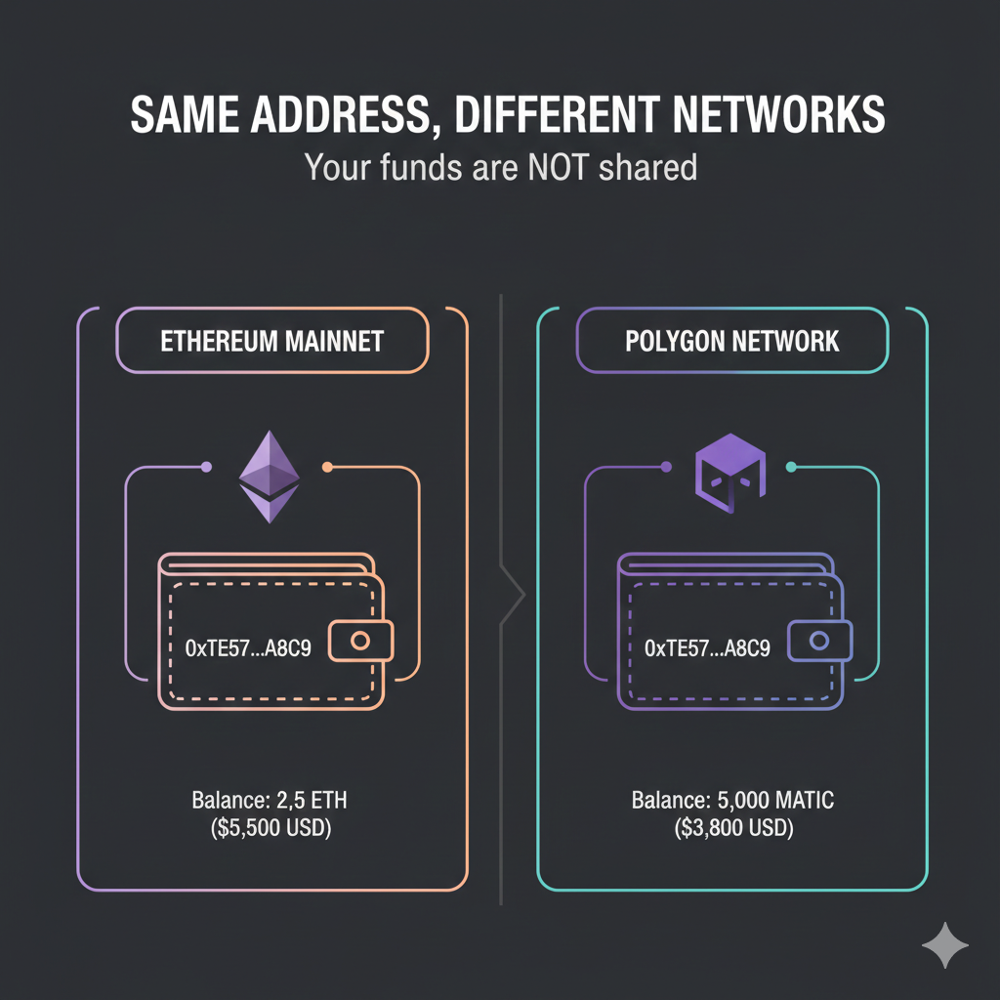
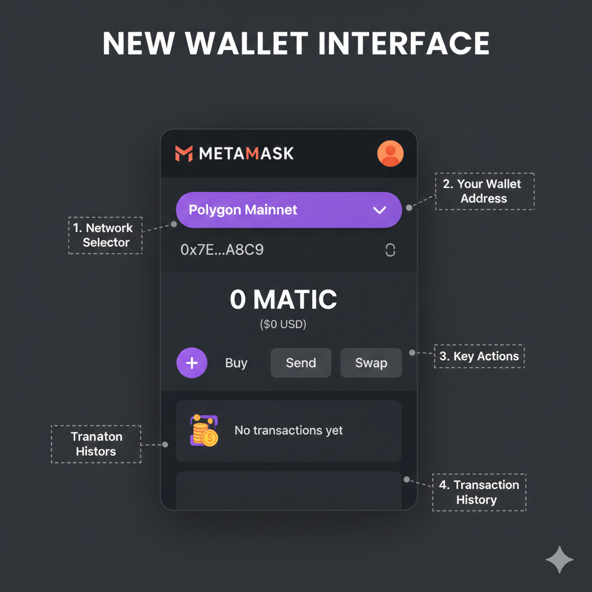
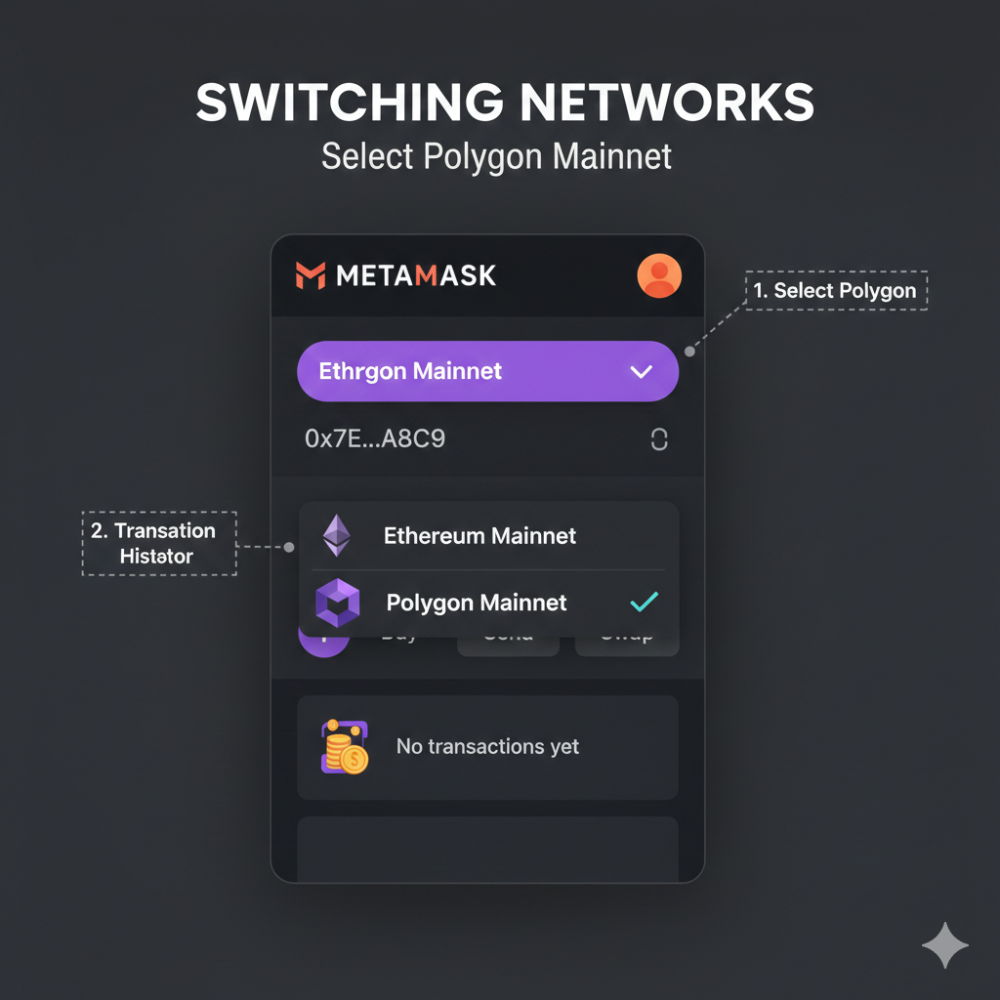
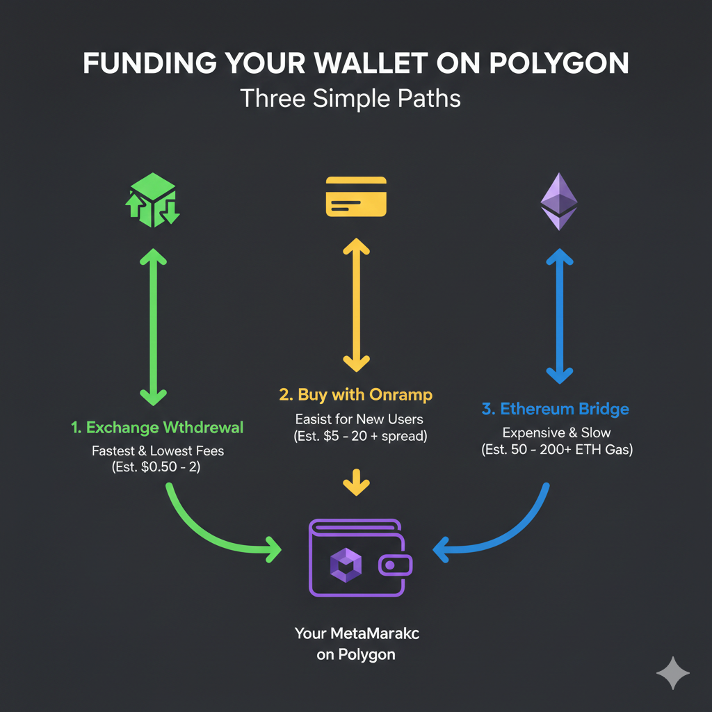
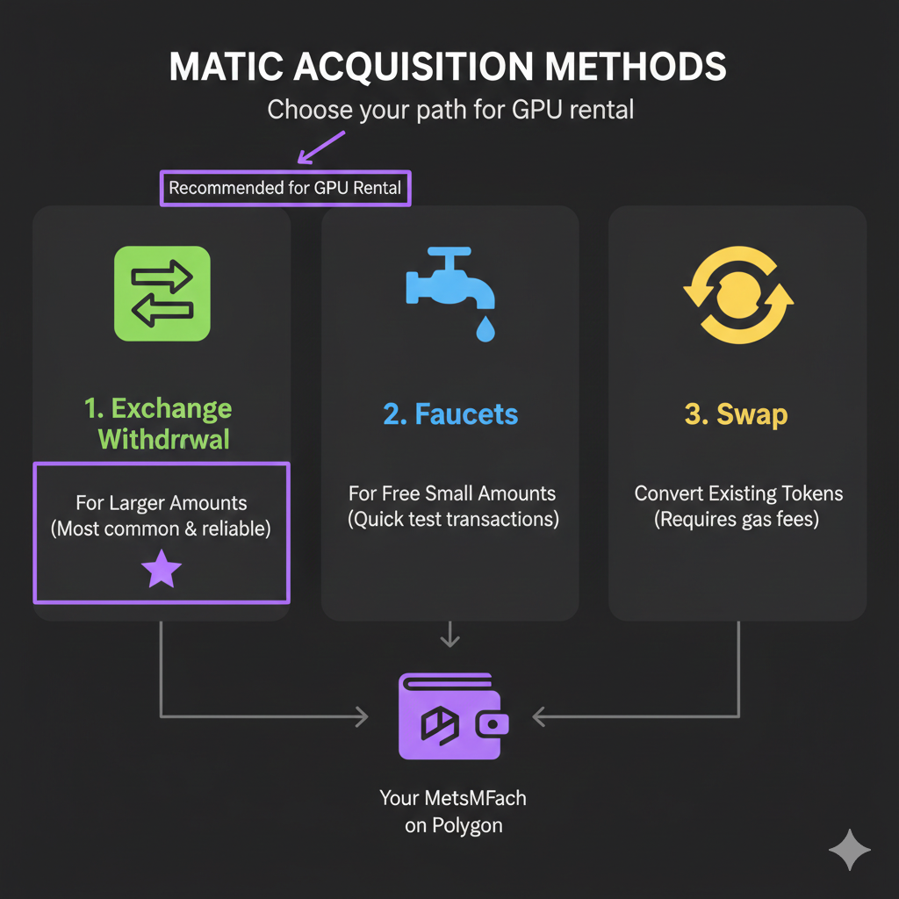
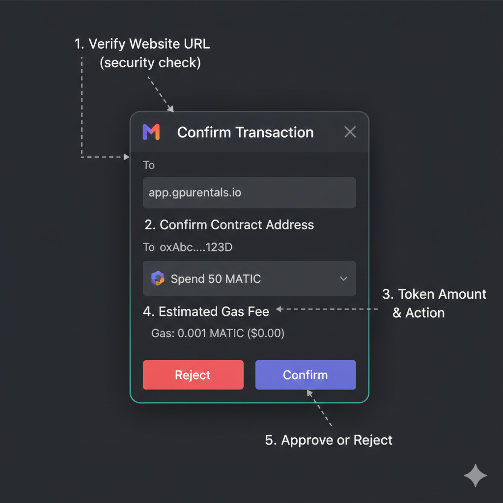
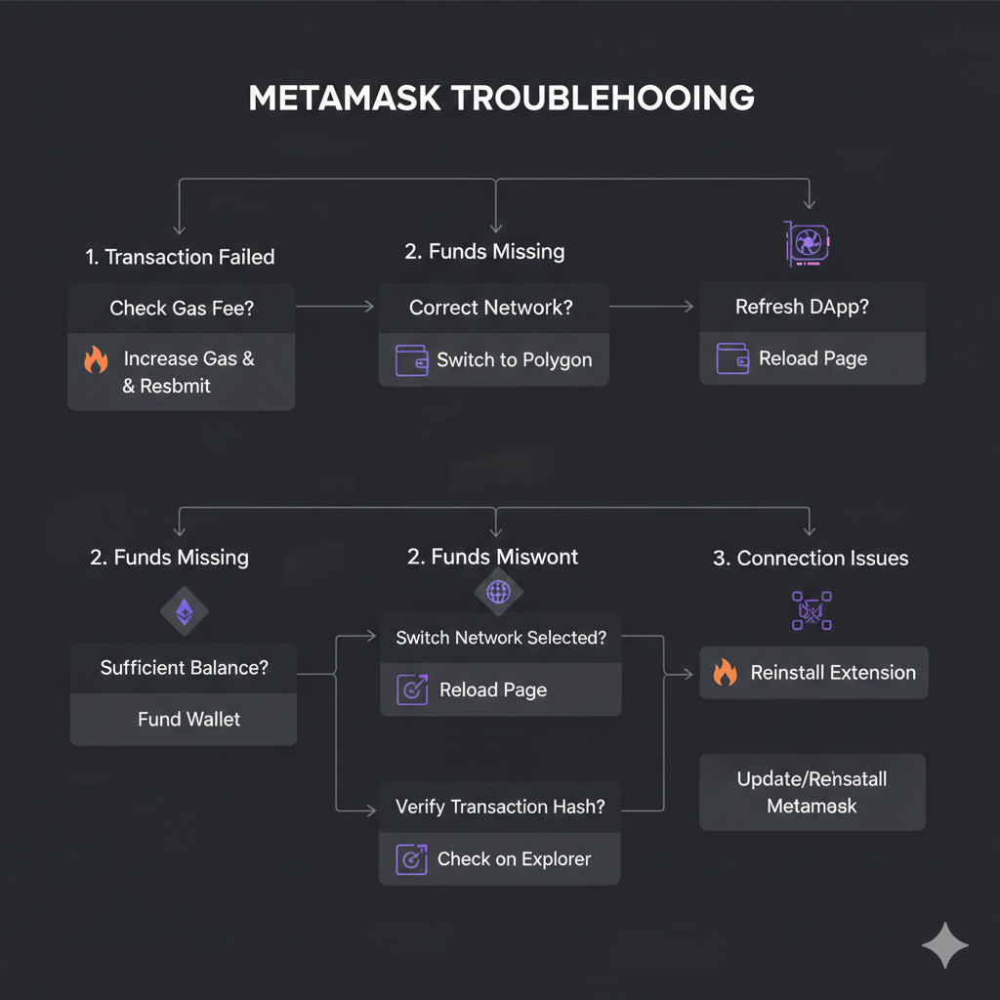
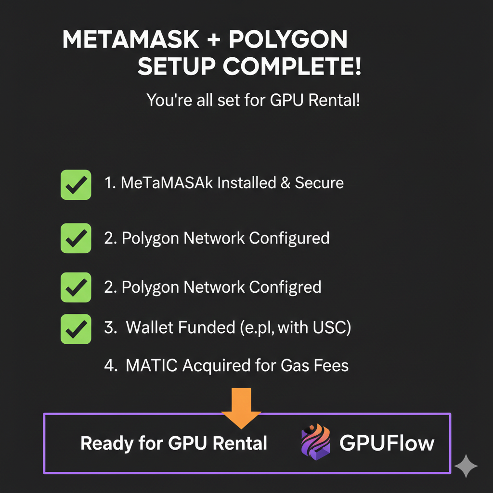

הפער בין המחשבה "אני רוצה לשכור GPU באמצעות קריפטו" לבין ביצוע הפעולה בפועל מסתכם בדרך כלל בדבר אחד: הגדרת הארנק. השכרת ה-GPU עצמה לוקחת שלושים שניות. השגת ארנק קריפטו עם כסף המחובר לרשת הנכונה לוקחת יותר זמן אם מעולם לא עשית זאת בעבר, ורוב המדריכים מניחים שאתה כבר מחזיק בקריפטו ומבין מהן עמלות גז.

מדריך זה מתחיל מאפס. לא נדרש ניסיון קודם במטבעות דיגיטליים. בסופו, יהיה לך ארנק MetaMask המחובר לרשת Polygon עם מספיק כספים כדי לשכור את ה-GPU הראשון שלך. התהליך כולו עולה פחות מ-$2 בעמלות ולוקח כחמש עשרה דקות, שרובן הן זמן המתנה לאישורי משיכה מהבורסה (Exchange).

לתהליך השכרת ה-GPU המלא לאחר הגדרת הארנק – כולל השוואות פלטפורמות, הפקדה בנאמנות (Escrow) באמצעות חוזה חכם, וניהול ההשכרה – ראה את [המדריך המלא להשכרת GPUs באמצעות קריפטו](/he/rent-gpu-with-crypto/).

---

## למה רשת Polygon במקום Ethereum Mainnet

לפני שמגדירים משהו, הבנה מדוע Polygon חשובה תחסוך לך כסף בכל עסקה.

### בעיית עמלות הגז (Gas Fee Problem)

כל עסקת בלוקצ'יין דורשת עמלה המשולמת למאמתי הרשת (Validators). ברשת Ethereum הראשית (Mainnet), עמלות אלו (הנקראות "גז" או "Gas") משתנות בהתאם לביקוש ברשת:

**עלויות גז ברשת Ethereum Mainnet:**

- העברה פשוטה: $1-5
- אישור אסימון (Token approval): $2-8
- עסקה מורכבת (הפקדה בנאמנות): $5-15
- בזמן ביקוש גבוה: $20-50+

**עבור השכרת GPU, זה יוצר בעיה:**

תאר לעצמך השכרת כרטיס RTX 4090 לשעתיים במחיר של $0.60 לשעה:

- עלות ה-GPU: $1.20
- גז ב-Ethereum עבור הפקדה: $5.00
- גז ב-Ethereum עבור משיכה: $5.00
- **סה"כ: $11.20 עבור $1.20 של זמן GPU**

כאשר עמלות הגז עולות על עלות ההשכרה, עסקאות קטנות הופכות לבלתי רציונליות מבחינה כלכלית.

### רשת Polygon: אותה אבטחה, עמלות נמוכות פי 100

Polygon היא רשת "שכבה 2" (Layer 2) הבנויה על גבי Ethereum. היא יורשת את מודל האבטחה של Ethereum תוך עיבוד עסקאות בעלות נמוכה באופן דרמטי:

**עלויות גז ברשת Polygon:**

- העברה פשוטה: $0.001-0.01
- אישור אסימון: $0.005-0.02
- עסקה מורכבת (הפקדה בנאמנות): $0.01-0.05
- בזמן ביקוש גבוה: $0.05-0.20

**אותו תרחיש השכרת GPU ב-Polygon:**

- עלות ה-GPU: $1.20
- גז ב-Polygon עבור הפקדה: $0.02
- גז ב-Polygon עבור משיכה: $0.02
- **סה"כ: $1.24 עבור $1.20 של זמן GPU**

עמלות הגז הופכות לזניחות במקום להיות חסם כניסה.

### פרטים טכניים (לסקרנים)

Polygon משיגה עמלות נמוכות באמצעות מנגנוני קונצנזוס שונים ועיבוד עסקאות באצווה. הארכיטקטורה הטכנית חשובה פחות מהתוצאה המעשית:

| רשת              | זמן אישור   | עמלת עסקה    | אבטחה                        |
| ---------------- | ----------- | ------------ | ---------------------------- |
| Ethereum mainnet | 15-60 שניות | $1-15        | הגבוהה ביותר                 |
| Polygon          | 2-5 שניות   | $0.001-0.05  | גבוהה (מאובטחת ע"י Ethereum) |
| Solana           | <1 שניה     | $0.0001-0.01 | גבוהה                        |

GPUFlow ופלטפורמות GPU קריפטו-נייטיב אחרות משתמשות ב-Polygon מכיוון ש:

- העמלות לא הורסות את הכלכלה של השכרות קטנות
- אישור מהיר משמעותו גישה מהירה
- האבטחה נשארת חזקה באמצעות עיגון ל-Ethereum
- זמינות רחבה של מטבעות יציבים (Stablecoins) כמו USDC ו-USDT

### הארנק שלך עובד בשתי הרשתות

זהו מושג המפתח: **כתובת ארנק ה-MetaMask שלך זהה ב-Ethereum וב-Polygon.**

הכתובת `0x7a3B...4f2D` קיימת בשתי הרשתות. כספים שנשלחים לכתובת זו ב-Polygon נשארים ב-Polygon. כספים שנשלחים ב-Ethereum נשארים ב-Ethereum. אותה כתובת, רשתות שונות, יתרות נפרדות.

זו הסיבה שבחירת הרשת חשובה בעת שליחת כספים. שליחת USDC ברשת Ethereum Mainnet לכתובת שלך לא הופכת את הכספים הללו לזמינים ב-Polygon – הם נמצאים ברשתות שונות למרות הכתובת הזהה.



---

## התקנת MetaMask ואבטחת משפט השחזור

MetaMask הוא ארנק הפועל כתוסף לדפדפן המאחסן את המטבע הדיגיטלי שלך ומאפשר לך לתקשר עם יישומי בלוקצ'יין. ההתקנה לוקחת כחמש דקות.

### שלב 1: הורדת MetaMask

**גש ישירות למקור הרשמי:**

1. פתח את הדפדפן שלך (Chrome, Firefox, Brave או Edge)
2. בקר ב-**metamask.io** (ודא את הכתובת בקפידה – אתרי דיוג קיימים)
3. לחץ על "Download" (הורדה)
4. בחר את הדפדפן שלך
5. לחץ על "Add to [Browser]" בחנות התוספים
6. אשר את ההתקנה כאשר תתבקש

**אזהרה:** הורד את MetaMask רק מ-metamask.io או מחנויות התוספים הרשמיות של הדפדפן. לעולם אל תתקין מקישורים באימיילים, הודעות Discord או מודעות חיפוש. תוספי MetaMask מזויפים גונבים כספים.

### שלב 2: יצירת ארנק חדש

לאחר ההתקנה:

1. לחץ על סמל השועל של MetaMask בסרגל הכלים של הדפדפן
2. לחץ על "Get Started" (התחל)
3. בחר "Create a new wallet" (צור ארנק חדש)
4. הסכם לתנאים (קרא אם תרצה, אלו תנאי תוכנה סטנדרטיים)
5. צור סיסמה

**סיסמה זו:**

- פותחת את MetaMask במכשיר הספציפי הזה
- **לא** משחזרת את הארנק שלך אם תאבד גישה
- צריכה להיות חזקה אך אין צורך לזכור אותה לנצח
- נפרדת ממשפט השחזור שלך (מוסבר בהמשך)

### שלב 3: אבטחת משפט השחזור (Seed Phrase)

**זהו השלב הקריטי ביותר. קרא בעיון.**

MetaMask יציג 12 מילים בסדר מסוים. מילים אלו הן "משפט השחזור" (Seed Phrase) או "משפט הגיבוי" שלך.

**מה עושה משפט השחזור:**

- מעניק גישה מלאה לארנק שלך מכל מכשיר
- מאפשר שחזור אם המחשב שלך מתקלקל, הדפדפן קורס, או ש-MetaMask נהרס
- לא ניתן לשינוי או לאיפוס – 12 מילים אלו הן קבועות עבור ארנק זה
- כל מי שמחזיק במילים אלו יכול לקחת את כל הכספים שלך באופן מיידי

**מה לעשות:**

1. MetaMask מציג 12 מילים על המסך
2. **כתוב אותן על נייר בסדר המדויק** (מילה 1, מילה 2... מילה 12)
3. אל תצלם, אל תעשה צילום מסך, ואל תקליד אותן במכשיר דיגיטלי כלשהו
4. אל תשמור במנהל סיסמאות, בכונן ענן או באפליקציית פתקים
5. אחסן את הנייר במקום מאובטח (כספת, תיבה נעולה, כספת בבנק)
6. שקול להכין עותק שני המאוחסן במיקום פיזי שונה

**מה לא לעשות:**

- לעולם אל תזין את משפט השחזור באתר אינטרנט כלשהו (אתרים לגיטימיים לעולם לא מבקשים אותו)
- לעולם אל תשתף אותו עם מישהו הטוען שהוא מ"תמיכה טכנית"
- לעולם אל תשמור אותו באופן דיגיטלי בשום צורה
- לעולם אל תקריא אותו בקול רם בטווח שמיעה של אחרים או מכשירים

**מדוע זה חשוב:**

בניגוד לחשבונות בנק, לארנקי קריפטו אין שירות לקוחות, אין מחלקת הונאה ואין ביטול עסקאות. אם מישהו משיג את משפט השחזור שלך:

- הוא מרוקן את הארנק שלך בשניות
- שום רשות לא יכולה להפוך את העסקה
- אין אפשרות לשחזור
- הכספים אבודים לצמיתות

משפט השחזור _הוא_ הארנק. הגן עליו בהתאם.

### שלב 4: אימות משפט השחזור

MetaMask יבקש ממך לאשר על ידי בחירת המילים בסדר הנכון:

1. לחץ על המילים ברצף הנכון
2. זה מאמת שבאמת כתבת אותן
3. אל תדלג על זה על ידי שינון זמני – אתה זקוק לגיבוי הכתוב

### שלב 5: הארנק מוכן

לאחר האישור, הארנק שלך נוצר ומוכן לשימוש. אתה תראה:

- את כתובת הארנק שלך (מתחילה ב-`0x`, ואחריה 40 תווים)
- יתרה המציגה 0 ETH (עדיין לא מימנת אותו)
- מחוון רשת המציג "Ethereum Mainnet"

**כתובת הארנק שלך:**

- היא ציבורית – בטוח לשתף אותה כדי לקבל כספים
- כמו כתובת אימייל למטבעות דיגיטליים
- אינה משתנה ולא ניתנת לשינוי
- אותה כתובת עובדת במספר רשתות (Ethereum, Polygon וכו')



---

## הוספת רשת Polygon ל-MetaMask

MetaMask מוגדר כברירת מחדל לרשת Ethereum Mainnet. כדי להשתמש בעמלות הנמוכות של Polygon, עליך להוסיף את הרשת.

### שיטה 1: הוספה אוטומטית (הכי קל)

1. בקר ב-**chainlist.org**
2. חפש "Polygon"
3. מצא את "Polygon Mainnet" (מזהה רשת - Chain ID: 137)
4. לחץ על "Add to MetaMask" (הוסף ל-MetaMask)
5. חלונית MetaMask תופיע – לחץ על "Approve" (אשר)
6. לחץ על "Switch to Network" (עבור לרשת) כדי להפעיל את Polygon

**בוצע.** Polygon זמינה כעת בתפריט הרשתות שלך.

### שיטה 2: הוספה ידנית

אם chainlist.org לא עובד, הוסף ידנית:

1. לחץ על סמל התוסף של MetaMask
2. לחץ על תפריט הרשתות (מציג "Ethereum Mainnet")
3. לחץ על "Add network" (הוסף רשת)
4. לחץ על "Add a network manually" (הוסף רשת ידנית)
5. הזן את הפרטים המדויקים האלה:

```

Network Name: Polygon Mainnet
New RPC URL: https://polygon-rpc.com
Chain ID: 137
Currency Symbol: MATIC
Block Explorer URL: https://polygonscan.com

```

6. לחץ על "Save" (שמור)
7. Polygon תופיע ברשימת הרשתות שלך

### מעבר בין רשתות

לאחר הוספת Polygon:

1. לחץ על תפריט הרשתות ב-MetaMask (למעלה במרכז התוסף)
2. בחר "Polygon Mainnet" או "Ethereum Mainnet"
3. תצוגת היתרה שלך תשתנה כדי להציג כספים ברשת שנבחרה

**זכור:** אותה כתובת, רשתות שונות. כספים ב-Ethereum אינם גלויים כשאתה צופה ב-Polygon, ולהפך. אתה מסתכל על אותה תיבת דואר אבל בסניפי דואר שונים.

### אימות הוספת הרשת

וודא ש-Polygon עובדת:

1. עבור ל-Polygon Mainnet
2. היתרה צריכה להציג "0 MATIC" (לא מימנת אותה עדיין)
3. לוגו קטן של Polygon מופיע לצד שם הרשת
4. הכתובת נשארת זהה לזו שב-Ethereum

אם אתה רואה שגיאות לגבי חיבורי RPC:

- נסה כתובת RPC חלופית: `https://rpc-mainnet.matic.quiknode.pro`
- או: `https://polygon-bor.publicnode.com`
- עומס ברשת גורם לעיתים לבעיות ב-RPC



---

## מימון הארנק שלך ב-USDC

הארנק שלך קיים כעת אך הוא ריק. חלק זה מכסה כיצד להשיג USDC (המטבע היציב המומלץ להשכרת GPU) בארנק MetaMask שלך ברשת Polygon.

### למה USDC להשכרת GPU

**מטבעות יציבים (Stablecoins) מבטלים תנודתיות מחירים:**

- USDC שומר על הצמדה של 1:1 לדולר האמריקאי.
- 100 USDC היום שווים 100 USDC מחר.
- אין סיכון שתנודות במחירי הקריפטו ישפיעו על תקציב ה-GPU שלך.

**השווה למטבעות קריפטו תנודתיים:**

- הפקדת $100 ב-ETH להשכרת GPU.
- ETH ירד ב-10% במהלך הלילה.
- היתרה שנותרה קונה 10% פחות זמן GPU.
- המחיר זז נגדך ללא כל פעולה מצדך.

**USDC נמנע מזה לחלוטין.** תקציב השכרת ה-GPU שלך נשאר יציב ללא קשר לתנאי השוק.

### שיטת מימון 1: משיכה מבורסה (מומלץ)

אם כבר יש לך קריפטו בבורסה (כגון Coinbase, Binance, Kraken וכו'), משיכה ישירות ל-Polygon היא האפשרות הזולה ביותר.

**צעד-אחר-צעד עבור Coinbase:**

1. היכנס ל-Coinbase.
2. נווט ליתרת ה-USDC שלך.
3. לחץ על "Send" (שלח).
4. הזן את כתובת ארנק ה-MetaMask שלך (העתק מ-MetaMask).
5. **קריטי:** בחר "Polygon" כרשת (Network).
6. הזן את הסכום למשלוח.
7. בדוק את העמלות (בדרך כלל $0.10-1.00 למשיכה ב-Polygon).
8. אשר את המשיכה.
9. המתן לאישור (בדרך כלל 1-10 דקות).

**צעד-אחר-צעד עבור Binance:**

1. היכנס ל-Binance.
2. נווט ל-Wallet ← Spot Wallet.
3. מצא USDC, לחץ על "Withdraw" (משוך).
4. הדבק את כתובת ארנק ה-MetaMask שלך.
5. **קריטי:** בחר ברשת "MATIC" או "Polygon".
6. הזן סכום.
7. השלם אימות אבטחה.
8. המתן לאישור (בדרך כלל 5-15 דקות).

**בורסות נפוצות התומכות במשיכת USDC ברשת Polygon:**

| בורסה      | תמיכה ב-Polygon | עמלה טיפוסית |
| ---------- | --------------- | ------------ |
| Coinbase   | כן              | $0.10-0.50   |
| Binance    | כן              | $0.10-0.30   |
| Kraken     | כן              | $0.10-0.50   |
| Crypto.com | כן              | $0.10-0.25   |
| KuCoin     | כן              | $0.10-0.30   |
| OKX        | כן              | $0.10-0.20   |

**אם הבורסה שלך לא תומכת במשיכה ל-Polygon:**

יש לך שתי אפשרויות:

1. למשוך ל-Ethereum, ואז להשתמש ב"גשר" (Bridge) ל-Polygon (עולה יותר בגז).
2. להשתמש בבורסה אחרת התומכת ב-Polygon.

שימוש בגשר מ-Ethereum עולה $5-15 בעמלות גז. שימוש בבורסה עם תמיכה מובנית ב-Polygon עולה $0.10-0.50. הבחירה ברורה עבור סכומים קטנים.

### שיטת מימון 2: רכישה ישירה (Onramp)

אם אין לך קריפטו בשום מקום, שירותי "onramp" מאפשרים לך לקנות ישירות באמצעות כרטיס אשראי או העברה בנקאית.

**שירותי onramp פופולריים:**

| שירות   | שיטות תשלום | עמלות | תמיכה ב-Polygon |
| ------- | ----------- | ----- | --------------- |
| Transak | כרטיס, בנק  | 1-3%  | כן              |
| MoonPay | כרטיס, בנק  | 2-4%  | כן              |
| Ramp    | כרטיס, בנק  | 1-3%  | כן              |
| Banxa   | כרטיס, בנק  | 2-4%  | כן              |

**צעד-אחר-צעד עם Transak:**

1. בקר ב-transak.com.
2. בחר "Buy" (קנה).
3. בחר USDC כמטבע הקריפטו.
4. בחר Polygon כרשת.
5. הזן סכום במטבע המקומי שלך.
6. לחץ על "Buy Now" (קנה עכשיו).
7. חבר ארנק MetaMask או הדבק כתובת.
8. השלם תשלום (כרטיס או בנק).
9. USDC מגיע ישירות ל-MetaMask שלך ב-Polygon.

**העמלות גבוהות יותר ממשיכה מבורסה** (1-4% לעומת $0.10-0.50 קבוע), אבל שירותי onramp נוחים אם אתה מתחיל מאפס.

### שיטת מימון 3: רכישה מובנית ב-MetaMask

MetaMask כולל פונקציונליות רכישה דרך שירותי שותפים:

1. פתח את MetaMask.
2. וודא שרשת Polygon נבחרה.
3. לחץ על "Buy" (קנה).
4. בחר שיטת תשלום.
5. בחר סכום.
6. השלם את הרכישה דרך השותף (Transak, MoonPay וכו').

**אותן עמלות כמו onramp ישיר** מכיוון ש-MetaMask מפנה דרך אותם שירותים, אבל האינטגרציה מעט נוחה יותר.

### שיטת מימון 4: גשר מ-Ethereum (Bridge)

אם יש לך USDC ברשת Ethereum Mainnet ואינך יכול למשוך ישירות ל-Polygon מהבורסה שלך:

**שימוש בגשר הרשמי של Polygon:**

1. בקר ב-portal.polygon.technology/bridge.
2. חבר את MetaMask.
3. בחר "Deposit" (הפקדה) (Ethereum → Polygon).
4. בחר USDC.
5. הזן סכום.
6. אשר את הוצאת ה-USDC (עלות גז: $2-8).
7. אשר את עסקת הגשר (עלות גז: $5-15).
8. המתן 15-30 דקות להשלמה.
9. USDC מופיע בארנק ב-Polygon.

**עלות גז כוללת ב-Ethereum: בין $7-23** תלוי בעומס ברשת.

**זו האפשרות היקרה.** השתמש בגשר רק אם:

- הבורסה שלך לא תומכת במשיכה ל-Polygon.
- כבר יש לך USDC תקוע ב-Ethereum.
- הסכום גדול מספיק כדי שעמלות הגשר יהיו קטנות באופן יחסי.

עבור סכומים מתחת ל-$200, מציאת בורסה עם תמיכה ב-Polygon חסכונית יותר משימוש בגשר.

### אימות הגעת הכספים

לאחר כל שיטת מימון:

1. פתח את MetaMask.
2. **וודא שרשת Polygon נבחרה** (טעות נפוצה: בדיקת הרשת הלא נכונה).
3. לחץ על "Import tokens" (ייבא אסימונים) אם USDC לא מופיע אוטומטית.
4. חוזה USDC ב-Polygon הוא: `0x3c499c542cEF5E3811e1192ce70d8cC03d5c3359`
5. היתרה צריכה לשקף את ההפקדה שלך.

**אם הכספים לא מופיעים:**

- אשר שהעסקה הושלמה בצד השולח (בורסה, onramp).
- וודא שאתה צופה ברשת Polygon ב-MetaMask.
- בדוק את העסקה ב-Polygonscan באמצעות כתובת הארנק שלך.
- אסימונים מסוימים דורשים ייבוא ידני (הוסף אסימון באמצעות כתובת חוזה).



---

## השגת MATIC עבור עמלות גז

יש לך USDC להשכרת GPU, אבל אתה עדיין לא יכול לבצע עסקאות. כל עסקת Polygon דורשת כמות קטנה של MATIC לתשלום עמלות גז – אפילו עסקאות המערבות אסימונים אחרים כמו USDC.

### למה אתה צריך MATIC

**מבנה עמלות הבלוקצ'יין:**

- עמלות גז חייבות להיות משולמות במטבע המקורי של הרשת.
- המטבע המקורי של Polygon הוא MATIC.
- גם אם משלמים עבור השכרת GPU ב-USDC, העסקה עצמה עולה MATIC.
- אין MATIC = לא ניתן לשלוח עסקאות.

**הכמות הנדרשת זעירה:**

| פעולה              | עלות MATIC משוערת | שווי דולרי  |
| ------------------ | ----------------- | ----------- |
| שליחת USDC         | 0.001-0.01 MATIC  | $0.001-0.01 |
| אישור הוצאת אסימון | 0.005-0.02 MATIC  | $0.005-0.02 |
| הפקדה לפלטפורמה    | 0.01-0.05 MATIC   | $0.01-0.05  |
| עסקה מורכבת        | 0.02-0.10 MATIC   | $0.02-0.10  |

**$1-2 ב-MATIC מכסים עשרות עסקאות.** אתה לא צריך הרבה, אבל אתה צריך משהו.

### שיטה 1: משיכת MATIC מבורסה

אותו תהליך כמו משיכת USDC:

1. בבורסה שלך, מצא MATIC.
2. לחץ על "Withdraw" (משוך).
3. הזן את כתובת ה-MetaMask.
4. **בחר רשת Polygon** (חלק מהבורסות קוראות לה "MATIC").
5. משוך סכום קטן (בשווי $2-5).
6. MATIC מגיע לארנק.

**רוב הבורסות הגדולות תומכות במשיכת MATIC ב-Polygon.** העמלות הן בדרך כלל $0.01-0.10.

### שיטה 2: שימוש בברז (Faucet)

ברזים מספקים כמויות קטנות של MATIC בחינם, ומיועדים למשתמשים חדשים שצריכים גז כדי להתחיל.

**ברזים זמינים:**

| ברז                                                  | כמות              | תדירות    |
| ---------------------------------------------------- | ----------------- | --------- |
| Polygon Faucet (faucet.polygon.technology)           | 0.001-0.002 MATIC | יומי      |
| Alchemy Faucet (alchemy.com/faucets/polygon-mainnet) | 0.5 MATIC         | לכל חשבון |
| QuickNode Faucet                                     | משתנה             | מוגבל     |

**שימוש בברז Alchemy (מומלץ):**

1. בקר ב-alchemy.com/faucets/polygon-mainnet.
2. צור חשבון Alchemy חינמי (או היכנס).
3. הדבק את כתובת ארנק ה-MetaMask שלך.
4. לחץ על "Send Me MATIC" (שלח לי MATIC).
5. 0.5 MATIC מגיע תוך דקות.

**0.5 MATIC מספיק לכ-50-100 עסקאות** – מספיק לחודשים של שימוש טיפוסי בהשכרת GPU.

### שיטה 3: המרת USDC ל-MATIC (Swap)

אם יש לך USDC אבל אין לך MATIC, השתמש בהמרה המובנית של MetaMask:

1. פתח את MetaMask ברשת Polygon.
2. לחץ על "Swap" (המר).
3. בחר USDC כאסימון ה"מקור" (from).
4. בחר MATIC כאסימון ה"יעד" (to).
5. הזן סכום קטן (בשווי $1-2).
6. בדוק שער ועמלות.
7. לחץ על "Swap" (המר).

**בעיה:** המרה זו עצמה דורשת MATIC עבור הגז. אם יש לך בדיוק אפס MATIC, לא תוכל לבצע את ההמרה.

**פתרון למצב של "אפס MATIC":**

- השתמש בברז תחילה כדי לקבל מינימום MATIC.
- חלק מצוברי ההמרה מציעים "המרות ללא גז" (gasless swaps) שבהן הם מממנים את הגז.
- בקש ממישהו לשלוח לך 0.01 MATIC (חברי קהילה עוזרים לעיתים קרובות למצטרפים חדשים).

### שיטה 4: מימון גז (Gas Sponsorship)

פלטפורמות מסוימות מממנות את עמלות הגז למשתמשים חדשים:

**גישת GPUFlow:**

GPUFlow מזהה כאשר למשתמשים יש USDC אך אין מספיק MATIC ומציעה לממן את עמלת הגז של העסקה הראשונה. זה מאפשר למשתמשים:

1. להפקיד USDC לפלטפורמה.
2. הפלטפורמה מכסה את עלות הגז להפקדה הראשונית.
3. המשתמש יכול מאוחר יותר למשוך כמות קטנה של MATIC מיתרת הפלטפורמה במידת הצורך.

**אפשרויות מימון אחרות:**

- פרוטוקולי DeFi מסוימים מממנים גז למשתמשים בפעם הראשונה.
- ברזי קהילה בשרתי Discord.
- שירותי onramp של שכבה 2 הכוללים כמות קטנה של MATIC עם רכישות USDC.

### כמה MATIC להחזיק

**יתרת MATIC מומלצת להשכרת GPU:**

| רמת שימוש               | יתרת MATIC | שווי דולרי | משך זמן משוער |
| ----------------------- | ---------- | ---------- | ------------- |
| קל (השכרות בודדות/חודש) | 0.5 MATIC  | ~$0.50     | 3-6 חודשים    |
| בינוני (השכרות שבועיות) | 2 MATIC    | ~$2.00     | 6-12 חודשים   |
| כבד (עסקאות יומיות)     | 5 MATIC    | ~$5.00     | 6-12 חודשים   |

**אתה לא צריך הרבה.** אפילו משתמשים כבדים כמעט ולא צריכים יותר מ-$5 ב-MATIC לגז על פני חודשים רבים של שימוש. העלות לעסקה כה נמוכה שיתרת ה-MATIC מידלדלת לאט מאוד.

### אימות יתרת MATIC

1. פתח את MetaMask.
2. בחר רשת Polygon.
3. יתרת MATIC מוצגת למעלה (זהו המטבע המקורי, תמיד גלוי).
4. אשר שהיתרה גדולה מ-0.

**עם USDC וגם MATIC בארנק שלך, אתה מוכן להתחבר לפלטפורמות GPU.**



---

## חיבור הארנק שלך לפלטפורמות השכרת GPU

הארנק שלך ממומן. כעת חבר אותו לפלטפורמת השכרת GPU. חלק זה מסביר מה קורה במהלך החיבור ואילו הרשאות אתה מעניק.

### הבנת חיבור הארנק

כאשר אתר מבקש חיבור ארנק, אתה מעניק גישה מוגבלת:

**מה שהחיבור כן מאפשר:**

- האתר יכול לראות את כתובת הארנק שלך.
- האתר יכול לראות את יתרות האסימונים שלך.
- האתר יכול לבקש עסקאות (שעליך לאשר באופן פרטני).

**מה שהחיבור לא מאפשר:**

- האתר לא יכול להזיז כספים ללא אישורך.
- האתר לא יכול לחתום על עסקאות באופן אוטומטי.
- האתר לא יכול לגשת למפתחות הפרטיים או למשפט השחזור שלך.

**חיבור ארנק הוא כמו להציג תעודת זהות**, לא למסור את המפתחות שלך. האתר לומד מי אתה (הכתובת שלך) אך לא יכול לפעול בשמך.

### חיבור ל-GPUFlow

**צעד-אחר-צעד:**

1. בקר ב-gpuflow.app.
2. וודא ש-MetaMask מוגדר לרשת Polygon.
3. לחץ על "Connect Wallet" (חבר ארנק) (בדרך כלל למעלה מימין).
4. חלונית MetaMask תופיע המציגה בקשת חיבור.
5. וודא שכתובת ה-URL של האתר נכונה (הגנה מפני פישינג).
6. לחץ על "Connect" (חבר).
7. כתובת הארנק שלך מופיעה כעת באתר.

**מה קרה:**

- GPUFlow יכול כעת להציג את יתרת ה-USDC שלך.
- GPUFlow יכול להכין עסקאות שעליך לחתום עליהן.
- GPUFlow לא יכול לגשת לכספים שלך ללא אישור מפורש.

### הבנת אישורי עסקאות

לאחר החיבור, תיתקל בשני סוגים של עסקאות:

**סוג 1: אישור אסימון (Approval)**

לפני שפלטפורמה יכולה להשתמש ב-USDC שלך, עליך "לאשר" (approve) את האסימון עבור החוזה החכם שלהם:

```

חלונית MetaMask מציגה:
"Give permission to access your USDC?" (לתת הרשאה לגשת ל-USDC שלך?)
התבקש ע"י: gpuflow.app
עבור חוזה: 0x7a3B...

```

**מה זה אומר:**

- אתה מאפשר לחוזה שצוין להעביר USDC מהארנק שלך.
- רק אותו חוזה ספציפי יכול להשתמש בהרשאה זו.
- אתה יכול לבטל הרשאה זו מאוחר יותר.
- נפוץ לאשר סכום "בלתי מוגבל" לנוחות (מונע אישורים חוזרים).

**סוג 2: אישור עסקה (Confirmation)**

כשאתה בפועל מפקיד, שוכר או מושך:

```

חלונית MetaMask מציגה:
"Confirm transaction" (אשר עסקה)
פעולה: Deposit 50 USDC to escrow (הפקדת 50 USDC בנאמנות)
עמלת גז: 0.02 MATIC (~$0.02)

```

**מה זה אומר:**

- אתה מאשר פעולה ספציפית עם סכומים ספציפיים.
- עמלת הגז המוצגת תנוכה מיתרת ה-MATIC שלך.
- לחיצה על "Confirm" (אשר) מבצעת את העסקה בבלוקצ'יין.
- העסקה בלתי הפיכה לאחר אישורה.

### שיטות עבודה מומלצות לאבטחה

**לפני התחברות לכל אתר:**

1. **אמת כתובת URL:** בדוק איות בקפידה (gpuflow.app לעומת gpufl0w.app).
2. **בדוק תעודה:** חפש https:// ותעודת אבטחה תקפה.
3. **שמור במועדפים אתרים לגיטימיים:** הימנע מחיפוש ולחיצה על מודעות.

**בעת אישור עסקאות:**

1. **קרא מה אתה מאשר:** סכום אסימון, חוזה מקבל.
2. **ודא שעמלות הגז סבירות:** עסקאות Polygon צריכות להיות מתחת ל-$0.10.
3. **בדוק רשת:** אשר שאתה ברשת הצפויה (Polygon).
4. **אל תמהר:** קח את הזמן לאמת פרטים.

**תחזוקה תקופתית:**

1. **סקור אישורים:** בקר ב-revoke.cash כדי לראות את כל אישורי האסימונים.
2. **בטל אישורים לא בשימוש:** הסר הרשאות לפלטפורמות שאינך משתמש בהן יותר.
3. **השתמש בארנקים נפרדים:** שקול ארנק ייעודי להשכרת GPU עם כספים מוגבלים.

### חיבור לפלטפורמות אחרות

**Vast.ai עם מטבע קריפטו:**

1. צור חשבון Vast.ai (נדרש אימייל).
2. נווט ל-Billing (חיוב).
3. לחץ על "Add Credit" (הוסף אשראי) ← "Cryptocurrency".
4. בחר סוג קריפטו.
5. השלם תשלום דרך שער CoinPayments.
6. לא נדרש חיבור ארנק ישיר (תשלום דרך שער).

**RunPod עם מטבע קריפטו:**

1. צור חשבון RunPod.
2. נווט ל-Billing.
3. לחץ על "Add Funds" (הוסף כספים) ← "Crypto".
4. בחר סוג קריפטו.
5. השלם תשלום דרך Coinbase Commerce.
6. לא נדרש חיבור ארנק ישיר.

**הערה:** Vast.ai ו-RunPod משתמשות בשערי תשלום במקום בחיבור ישיר לארנק. אתה שולח קריפטו לכתובת מסופקת במקום לחבר את הארנק שלך לאתר שלהם. זהו מודל שונה מאינטגרציית הארנק הישירה של GPUFlow.

להשוואה מקיפה של האופן שבו פלטפורמות שונות מטפלות בתשלומי קריפטו, ראה את [המדריך המלא להשכרת GPUs באמצעות קריפטו](/he/rent-gpu-with-crypto/).

### מה אומרת כל הרשאה

| בקשת הרשאה           | מה היא מאפשרת                        | רמת סיכון     |
| -------------------- | ------------------------------------ | ------------- |
| "Connect wallet"     | לראות את הכתובת והיתרות שלך          | נמוכה מאוד    |
| "Approve [token]"    | החוזה יכול להעביר את האסימון שאושר   | נמוכה-בינונית |
| "Unlimited approval" | החוזה יכול להעביר כל כמות של האסימון | בינונית       |
| "Sign message"       | להוכיח שאתה הבעלים של הארנק          | נמוכה מאוד    |
| "Send transaction"   | לבצע פעולת בלוקצ'יין ספציפית         | תלוי בפעולה   |

**דגלים אדומים לדחייה:**

- בקשות אישור לאסימונים שאינך מתכוון להשתמש בהם.
- סכומי עסקה שונים ממה שציפית.
- עמלות גז גבוהות באופן דרמטי מהרגיל (רשת לא נכונה?).
- בקשות למשפט השחזור (לעולם לא לגיטימי).
- חתימה על הודעות למטרות לא מוכרות.



---

## פתרון בעיות נפוצות

אפילו הגדרות פשוטות נתקלות בבעיות. חלק זה מתייחס לבעיות הנפוצות ביותר שמשתמשים חדשים מתמודדים איתן.

### שגיאות "עסקה נכשלה" (Transaction Failed)

**תסמין:** העסקה מציגה סטטוס כישלון ב-MetaMask לאחר ניסיון האישור.

**סיבות נפוצות ופתרונות:**

**אין מספיק MATIC לגז:**

- הודעת השגיאה מציינת לעיתים קרובות "insufficient funds for gas".
- יש לך USDC אבל אין לך MATIC.
- פתרון: השג MATIC באמצעות ברז (faucet) או משיכה מבורסה.

**יתרת אסימון לא מספקת:**

- מנסה לשלוח יותר USDC ממה שיש לך.
- זכור: עמלות גז מפחיתות את ה-MATIC הזמין, לא את ה-USDC.
- פתרון: הקטן את סכום העסקה או הוסף עוד אסימונים.

**החלקה (Slippage) נמוכה מדי (עבור המרות):**

- המחיר זז בין הצעת המחיר לבין הביצוע.
- פתרון: הגדל את סובלנות ההחלקה בהגדרות ההמרה (1-3% בדרך כלל מספיק).

**בעיות Nonce:**

- עסקה קודמת תקועה, וחוסמת עסקאות עוקבות.
- פתרון: בהגדרות MetaMask, עבור אל מתקדם (Advanced) ← אפס חשבון (Reset Account) (זה לא גורם לאובדן כספים).

### כספים אינם מופיעים

**תסמין:** שלחת כספים אך הארנק מציג יתרה אפס.

**בדוק את הדברים הבאים לפי הסדר:**

**1. האם נבחרה הרשת הנכונה?**

- הבעיה הנפוצה ביותר: צפייה ב-Ethereum כאשר הכספים נמצאים ב-Polygon (או להפך).
- לחץ על תפריט הרשתות, עבור לרשת הנכונה.
- אותה כתובת, רשתות שונות = יתרות שונות.

**2. האם העסקה באמת הושלמה?**

- בדוק בצד השולח (בורסה, ארנק אחר).
- מצא את גיבוב העסקה (Transaction Hash).
- חפש בסייר הבלוקים המתאים:
  - עבור Polygon: polygonscan.com
  - עבור Ethereum: etherscan.io
- אשר שהעסקה מציגה סטטוס "Success" (הצלחה).

**3. האם האסימון זקוק לייבוא?**

- אסימונים מסוימים לא מופיעים אוטומטית.
- לחץ על "Import tokens" (ייבא אסימונים) ב-MetaMask.
- הדבק את כתובת חוזה האסימון:
  - USDC ב-Polygon: `0x3c499c542cEF5E3811e1192ce70d8cC03d5c3359`
- האסימון אמור להופיע לאחר הייבוא.

**4. נשלח לרשת הלא נכונה?**

- נשלח ב-Ethereum אך ציפית ב-Polygon?
- הכספים לא אבדו – הם פשוט ברשת שונה.
- עבור ב-MetaMask לרשת שבה באמת שלחת.
- השתמש בגשר כדי להעביר כספים לרשת המיועדת במידת הצורך.

### בעיות חיבור ל-MetaMask

**תסמין:** האתר לא מתחבר ל-MetaMask או שהחיבור מתנתק.

**פתרונות:**

**רענן ונסה שוב:**

- רענן את דף האינטרנט.
- לחץ שוב על "Connect Wallet".
- אשר בחלונית הקופצת של MetaMask.

**בדוק ש-MetaMask לא נעול:**

- לחץ על סמל MetaMask.
- הזן סיסמה אם הוא נעול.
- נסה להתחבר מחדש.

**השבת תוספים מתנגשים:**

- תוספי ארנק אחרים יכולים להפריע.
- השבת זמנית את Phantom, Coinbase Wallet וכו'.
- נסה להתחבר מחדש כאשר רק MetaMask פעיל.

**נסה דפדפן אחר:**

- קיימות בעיות ספציפיות לדפדפן.
- נסה את Chrome, Firefox, או Brave.
- התקן מחדש את תוסף MetaMask אם הבעיה נמשכת.

**נקה חיבור MetaMask:**

- ב-MetaMask: הגדרות (Settings) ← חיבורים (Connections).
- מצא את האתר הבעייתי.
- לחץ על "Disconnect" (נתק).
- התחבר מחדש.

### שגיאות רשת שגויה

**תסמין:** האתר מציג "Wrong network" או "Please switch to Polygon".

**פתרון:**

1. לחץ על תפריט הרשתות ב-MetaMask.
2. בחר "Polygon Mainnet".
3. אם Polygon לא מופיעה ברשימה, הוסף אותה (ראה סעיף קודם).
4. רענן את דף האינטרנט.
5. חבר מחדש את הארנק במידת הצורך.

**רוב פלטפורמות ה-GPU מציגות בקשה** להחלפת רשתות באופן אוטומטי. לחץ על "Switch Network" בחלונית MetaMask כאשר תתבקש.

### כישלון בהערכת גז (Gas Estimation Failed)

**תסמין:** MetaMask מציג "Gas estimation failed" בעת ניסיון לבצע עסקה.

**סיבות נפוצות:**

**החוזה דוחה את העסקה:**

- יתרת אסימון לא מספקת לפעולה.
- ניסיון לאינטראקציה עם חוזה לא תואם.
- תחזוקת פלטפורמה או בעיות טכניות.

**עומס ברשת:**

- נדיר ב-Polygon אך אפשרי.
- המתן מספר דקות ונסה שוב.

**גישת פתרון:**

1. וודא שיש לך יתרה מספקת לפעולה המיועדת.
2. וודא שאתה ברשת הנכונה.
3. נסה סכום עסקה קטן יותר.
4. בדוק את סטטוס הפלטפורמה (Discord, Twitter) לבעיות ידועות.
5. נסה שוב מאוחר יותר אם קיים חשד לעומס ברשת.

### עסקה תלויה (Pending) תקועה

**תסמין:** העסקה מציגה "Pending" למשך זמן ממושך (יותר מ-5 דקות ב-Polygon).

**זמני המתנה רגילים:**

- רשת Polygon: בין 5-30 שניות.
- רשת Ethereum: בין 30 שניות ל-5 דקות.
- זמן ארוך יותר מצביע על בעיה.

**פתרונות:**

**האץ את העסקה:**

1. לחץ על העסקה הממתינה ב-MetaMask.
2. לחץ על "Speed Up" (האץ).
3. הגדל את מחיר הגז.
4. אשר את העסקה החדשה.
5. גז גבוה יותר מחליף את העסקה התקועה.

**בטל את העסקה:**

1. לחץ על העסקה הממתינה.
2. לחץ על "Cancel" (בטל).
3. אשר ביטול (עולה גז).
4. העסקה המקורית נזנחת.

**מוצא אחרון - איפוס חשבון:**

1. הגדרות MetaMask ← מתקדם (Advanced).
2. לחץ על "Reset Account" (אפס חשבון).
3. מנקה את היסטוריית העסקאות וה-nonce.
4. **לא** משפיע על היתרות.
5. נסה שוב את העסקה המקורית.

### תרחישי שחזור

**סיסמה אבדה (אך יש לך את משפט השחזור):**

1. הסר את התקנת MetaMask.
2. התקן מחדש את MetaMask.
3. בחר "Import using Secret Recovery Phrase" (ייבא באמצעות משפט שחזור סודי).
4. הזן את 12 המילים שלך.
5. צור סיסמה חדשה.
6. הארנק שוחזר עם כל הכספים.

**משפט שחזור אבד (אך יש לך גישה ל-MetaMask):**

1. פתח את MetaMask כל עוד יש לך גישה.
2. הגדרות ← אבטחה ופרטיות.
3. לחץ על "Reveal Secret Recovery Phrase" (חשוף משפט שחזור סודי).
4. הזן סיסמה.
5. כתוב את משפט השחזור כראוי הפעם.
6. אחסן בצורה מאובטחת.

**איבדת גם את הסיסמה וגם את משפט השחזור:**

- הכספים אבודים לצמיתות.
- אין אפשרות שחזור.
- שום צוות תמיכה לא יכול לעזור.
- זו הסיבה שגיבוי משפט השחזור הוא קריטי.



---

## סיכום: מוכן להשכרה

כעת יש לך את כל מה שנדרש להשכרת GPU מבוססת קריפטו:

- ✅ ארנק MetaMask מותקן ומאובטח.
- ✅ רשת Polygon מוגדרת לעמלות נמוכות.
- ✅ ממומן ב-USDC לתשלומי השכרת GPU יציבים.
- ✅ MATIC זמין לעמלות גז לעסקאות.
- ✅ הבנה של חיבורי ארנק והרשאות.

### רשימת תיוג לעיון מהיר

לפני השכרת ה-GPU הראשונה שלך, אשר:

**הגדרת ארנק:**

- [ ] MetaMask מותקן מהמקור הרשמי (metamask.io).
- [ ] משפט שחזור כתוב על נייר ומאוחסן בצורה מאובטחת.
- [ ] נוצרה סיסמה לגישה מקומית.

**הגדרת רשת:**

- [ ] Polygon Mainnet נוספה ל-MetaMask.
- [ ] יכול לעבור בין רשתות Ethereum ו-Polygon.

**מימון:**

- [ ] יתרת USDC ב-Polygon (בדוק רשת נכונה).
- [ ] יתרת MATIC לעמלות גז (לפחות 0.1 MATIC).

**אבטחה:**

- [ ] משפט שחזור מאוחסן במצב לא מקוון, לעולם לא דיגיטלית.
- [ ] אתרי פלטפורמה לגיטימיים שמורים במועדפים.
- [ ] מבין את ההבדל בין אישור (Approval) לבין ביצוע עסקה (Confirmation).

### מה הלאה

כשהארנק מוכן, תהליך השכרת ה-GPU עצמו הוא מהיר:

1. **התחבר:** בקר ב-gpuflow.app, חבר את MetaMask.
2. **הפקד:** העבר USDC לנאמנות הפלטפורמה.
3. **בחר:** בחר GPU התואם לדרישותיך.
4. **שכור:** אשר את ההשכרה, קבל פרטי גישה.
5. **עבוד:** גש ל-GPU דרך SSH או מסוף אינטרנט.
6. **סיים:** סיים את ההשכרה, כספים שלא נוצלו חוזרים אוטומטית.

**זמן כולל ממוכנות הארנק ועד לגישה ל-GPU: פחות מ-2 דקות**

לתהליך המלא של השכרת GPU, כולל בחירת פלטפורמה, מנגנון הנאמנות ואופטימיזציה של עלויות, ראה את [המדריך המלא להשכרת GPUs באמצעות קריפטו](/he/rent-gpu-with-crypto/).

### טעויות נפוצות של מתחילים שיש להימנע מהן

**אל:**

- תאחסן את משפט השחזור דיגיטלית (צילומי מסך, ענן, אפליקציית פתקים).
- תשלח כספים מבלי לוודא שהרשת תואמת.
- תאשר עסקאות מבלי לקרוא את הפרטים.
- תחזיק יתרות גדולות בפלטפורמה אחת כלשהי.
- תתעלם מדרישות עמלת הגז (צריך MATIC, לא רק USDC).

**כן:**

- תתחיל עם עסקאות בדיקה קטנות.
- תאמת כתובות URL של אתרים לפני התחברות.
- תשמור יתרת MATIC צנועה לגז.
- תשמור במועדפים אתרי פלטפורמה לגיטימיים.
- תצטרף ל-Discord של הפלטפורמה לתמיכה קהילתית.

### עלויות הקמה כוללות משוערות

| פריט                | עלות                               |
| ------------------- | ---------------------------------- |
| התקנת MetaMask      | חינם                               |
| הגדרת רשת Polygon   | חינם                               |
| USDC להשכרת GPU     | בחירה שלך ($20-100 התחלה טיפוסית)  |
| MATIC לגז           | $0.50-2.00 (או חינם דרך ברז)       |
| עמלת משיכה מבורסה   | $0.10-0.50                         |
| **סה"כ כדי להתחיל** | **~$1-3 בעמלות + תקציב ה-GPU שלך** |

השווה זאת לעלויות הקמה של ספקי ענן מסורתיים של $0 עמלות ישירות אך שעות של זמן אימות ועמלות פלטפורמה גבוהות יותר באופן מתמשך.

### משאבים קשורים

**מאתר זה:**

- [המדריך המלא להשכרת GPUs באמצעות קריפטו](/he/rent-gpu-with-crypto/) — מדריך השכרה מלא מבחירת פלטפורמה ועד סיום.
- [כיצד לשכור GPUs ללא KYC או אימות זהות](/he/how-to-rent-gpu-without-kyc/) — אפשרויות השכרת GPU המתמקדות בפרטיות.
- [עמלות נסתרות בהשכרת GPU: כיצד קריפטו חוסך כסף למשתמשים בינלאומיים](/he/hidden-fees-in-gpu-rental/) — ניתוח עלויות למשתמשים בינלאומיים.

**משאבים חיצוניים:**

- [תמיכת MetaMask](https://support.metamask.io) — תיעוד רשמי ופתרון תקלות.
- [תיעוד Polygon](https://wiki.polygon.technology) — פרטים טכניים של הרשת.
- [Polygonscan](https://polygonscan.com) — סייר בלוקים לאימות עסקאות.



---

## שאלות נפוצות (FAQ)

### למה אני צריך MetaMask להשכרת GPU?

MetaMask הוא ארנק מטבעות דיגיטליים המאחסן את הכספים שלך ומאפשר לך לתקשר עם פלטפורמות מבוססות בלוקצ'יין. פלטפורמות להשכרת GPU המשתמשות בתשלומי קריפטו דורשות ארנק כדי להחזיק את הכספים שלך ולאשר עסקאות. כשאתה שוכר GPU בפלטפורמות כמו GPUFlow, התשלום שלך עובר לחוזה חכם בנאמנות (Escrow) – ארנק MetaMask הוא הדרך שבה אתה מאשר את ההפקדה הזו ולאחר מכן מקבל בחזרה כספים שלא נוצלו. MetaMask מומלץ מכיוון שהוא הארנק התואם ביותר, העובד עם כמעט כל הפלטפורמות שמקבלות קריפטו. הוא מותקן כתוסף לדפדפן, לוקח כ-5 דקות להגדרה והשימוש בו בחינם.

### למה להשתמש ב-Polygon במקום ב-Ethereum להשכרת GPU?

Polygon מציעה עמלות עסקה נמוכות באופן דרמטי – $0.001-0.05 לעסקה בהשוואה ל-$1-10 ומעלה ב-Ethereum. עבור השכרת GPU, שבה ייתכן שתפקיד כספים, תתחיל השכרה, תעצור השכרה ותמשוך את היתרה הנותרת (מינימום ארבע עסקאות), עמלות הגז של Ethereum עלולות לעלות בקלות על העלות של השכרות GPU קצרות. השכרה של שעתיים בעלות $1.20 ב-RTX 4090 תדרוש $10-20 בעמלות גז של Ethereum, מה שהופך אותה ללא רציונלית כלכלית. אותו תהליך עבודה ב-Polygon עולה פחות מ-$0.10 בעמלות כוללות. פלטפורמות GPU כמו GPUFlow משתמשות ב-Polygon במיוחד מכיוון שהעמלות הנמוכות הופכות עסקאות קטנות ובינוניות למעשיות.

### מהו משפט שחזור (Seed Phrase) ומדוע הוא כל כך חשוב?

משפט שחזור (נקרא גם משפט גיבוי או Secret Recovery Phrase) הוא רצף של 12 או 24 מילים המספק גישה מלאה לארנק הקריפטו שלך. מילים אלו, בסדר המדויק שלהן, גוזרות מתמטית את המפתחות הפרטיים שלך. כל מי שמחזיק במילים אלו יכול לגשת לכל הכספים בארנק מכל מכשיר, בכל מקום בעולם. אין איפוס סיסמה, אין אימות זהות ואין צוות תמיכה שיכול לעזור אם תאבד את משפט השחזור – זו הדרך היחידה לשחזר ארנק אם המכשיר שלך מתקלקל. עליך לכתוב אותו על נייר, לעולם לא לאחסן אותו דיגיטלית ולשמור אותו במיקום פיזי מאובטח. אובדן משפט השחזור יחד עם כשל במכשיר פירושו אובדן קבוע ובלתי הפיך של כל הכספים.

### כמה MATIC אני צריך עבור עמלות גז?

מעט מאוד. עמלות העסקה ב-Polygon הן כ-$0.001-0.05 לעסקה, כך ש-$0.50-2.00 ב-MATIC (בערך 0.5-2 MATIC במחירים הנוכחיים) מספקים מספיק גז ל-50-200 עסקאות או יותר. זה מכסה חודשים של שימוש טיפוסי בהשכרת GPU כולל הפקדות, השכרות ומשיכות. אתה זקוק ל-MATIC במיוחד עבור הגז גם כשאתה משלם עבור השכרת ה-GPU ב-USDC, מכיוון שעמלות עסקה בבלוקצ'יין חייבות להיות משולמות במטבע המקורי של הרשת. אם אתה רק מתחיל, קבלת 0.5 MATIC מברז (חינם) מספיקה לעסקאות ראשוניות, ותוכל לרכוש עוד מאוחר יותר במידת הצורך.

### האם אני יכול להשתמש בארנק אחר מלבד MetaMask?

כן. חלופות כוללות את Rainbow (חוויית מובייל מצוינת), Coinbase Wallet (נוח למשתמשי Coinbase), Rabby (תכונות ידידותיות למפתחים), Trust Wallet (ממוקד מובייל), וארנקי חומרה כמו Ledger עם אינטגרציה לתוסף דפדפן. פלטפורמות להשכרת GPU תומכות בדרך כלל בכל ארנק התואם לפרוטוקול WalletConnect או בחיבור ישיר של תוסף דפדפן התואם ל-Ethereum. MetaMask מומלץ למתחילים בשל התיעוד הנרחב, התאימות הרחבה ביותר בין פלטפורמות, קהילת המשתמשים הגדולה ביותר לעזרה בפתרון בעיות והרקורד הארוך ביותר. ברגע שתהיה בטוח עם קריפטו, תוכל לחקור חלופות שמתאימות יותר להעדפותיך.

### מה קורה אם אני שולח כספים לרשת הלא נכונה?

כספים שנשלחו לרשת הלא נכונה לא אבדו – הם פשוט ברשת שונה מהצפוי. כתובת הארנק שלך זהה ב-Ethereum וב-Polygon, כך שכספים שנשלחו לכתובת שלך בכל אחת מהרשתות שייכים לך. אם שלחת USDC ב-Ethereum אבל ציפית לו ב-Polygon: עבור ב-MetaMask ל-Ethereum Mainnet ותראה את הכספים שם. כדי להעביר אותם ל-Polygon, השתמש בגשר (portal.polygon.technology), מה שעולה עמלות גז של Ethereum (בין $5-15). הטעות עולה עמלות וזמן נוספים אך לא גורמת לאובדן כספים. תמיד אמת את הרשת שנבחרה לפני אישור כל עסקת שליחה.

### איך אני יודע אם אתר בטוח לחיבור הארנק שלי?

אמת בטיחות באמצעות מספר בדיקות. ראשית, אשר שכתובת ה-URL מאויתת נכון – אתרי דיוג משתמשים בדומיינים בעלי מראה דומה (gpufl0w.app במקום gpuflow.app). שנית, בדוק HTTPS ותעודת אבטחה תקפה. שלישית, שמור אתרים לגיטימיים במועדפים והשתמש בהם במקום לחפש בכל פעם. רביעית, חקור את הפלטפורמה דרך ערוצי קהילה (Discord, Reddit, Twitter) לפני החיבור. כאשר החלונית הקופצת של החיבור מופיעה, MetaMask מציג את האתר המבקש – וודא שזה תואם לציפיות שלך. זכור שחיבור ארנק חושף רק את הכתובת והיתרות שלך; העברות כספים בפועל דורשות אישור נפרד. התחל עם סכומים קטנים בפלטפורמות חדשות עד שאימתת לגיטימיות באמצעות עסקאות מוצלחות.

### מה זה אומר "לאשר" (Approving) אסימון?

אישור אסימון מעניק לחוזה חכם ספציפי הרשאה להעביר אסימון מסוים מהארנק שלך. זה נפרד מהעברת כספים בפועל. כשאתה מפקיד USDC לפלטפורמת השכרת GPU, מתרחשות שתי עסקאות: ראשית, אתה מאשר לחוזה הנאמנות של הפלטפורמה לגשת ל-USDC שלך; שנית, אתה מאשר את ההפקדה בפועל. האישור נדרש בגלל האופן שבו עובדים אסימוני בלוקצ'יין – חוזים לא יכולים למשוך אסימונים מהארנק שלך ללא הרשאה מפורשת. אתה יכול לאשר סכום מוגבל (צריך לאשר מחדש כשהוא נגמר) או סכום בלתי מוגבל (נוח אך דורש אמון בחוזה). ניתן לסקור ולבטל אישורים בכל עת באתרים כמו revoke.cash.

### למה העסקה שלי נכשלה?

לכישלונות עסקה יש מספר סיבות נפוצות. חוסר ב-MATIC לגז הוא הנפוץ ביותר – אתה צריך MATIC כדי לשלם עמלות גם כשאתה עוסק ב-USDC. יתרת אסימון לא מספקת (ניסיון לשלוח יותר ממה שיש לך) גורמת גם היא לכישלונות. אינטראקציה עם חוזה באופן שגוי (רשת לא נכונה, פרמטרים לא תואמים) מעוררת כישלונות. עומס ברשת גורם לעיתים לבעיות למרות שזה נדיר ב-Polygon. הודעת השגיאה ב-MetaMask בדרך כלל נותנת רמז לסיבה. בדוק יתרת MATIC תחילה (הבעיה הנפוצה ביותר למשתמשים חדשים), לאחר מכן וודא שאתה ברשת הנכונה, ואז נסה להקטין את סכום העסקה.

### האם אני יכול לשחזר את הארנק שלי אם אני מאבד את הסיסמה?

כן, אם יש לך את משפט השחזור שלך. אובדן סיסמת ה-MetaMask שלך אומר שאינך יכול לגשת לארנק במכשיר הספציפי הזה, אך משפט השחזור מספק שחזור מלא. הסר את התקנת MetaMask, התקן מחדש, בחר "Import using Secret Recovery Phrase", הזן את 12 המילים שלך וצור סיסמה חדשה. הארנק שלך – כולל כל היתרות – משוחזר במלואו. עם זאת, אם תאבד גם את הסיסמה וגם את משפט השחזור, השחזור בלתי אפשרי. שום חברה, צוות תמיכה או תהליך טכני לא יכולים לשחזר ארנק ללא משפט השחזור. זו הסיבה שגיבוי מאובטח של משפט השחזור הוא קריטי לחלוטין לפני הוספת כספים לארנק שלך.

### כמה זמן לוקחות עסקאות ב-Polygon?

עסקאות Polygon בדרך כלל מאושרות תוך 2-5 שניות בתנאים רגילים. אתה תראה את העסקה מופיעה כ-"pending" לזמן קצר ב-MetaMask, ואז משתנה ל-"confirmed". לעיתים, בזמן שימוש גבוה ברשת, האישור עשוי לקחת 15-30 שניות. אם עסקה נשארת בהמתנה יותר מ-5 דקות, משהו כנראה לא בסדר – מחיר גז לא מספק, בעיות רשת או בעיות nonce. אתה יכול "להאיץ" עסקאות תקועות ב-MetaMask על ידי לחיצה על העסקה הממתינה ובחירת "Speed Up", מה שמגיש אותה מחדש עם גז גבוה יותר. בהשוואה לרשת Ethereum Mainnet (30 שניות עד מספר דקות) וביטקוין (10-60 דקות), המהירות של Polygon היא למעשה מיידית לצרכים מעשיים.

---

**מוכן להגדיר את הארנק שלך?** התחל בהורדת MetaMask מ-[metamask.io](https://metamask.io), ולאחר מכן עקוב אחר השלבים במדריך זה. תוך חמש עשרה דקות, תהיה מוכן לשכור את ה-GPU הראשון שלך עם מטבעות דיגיטליים ב-[GPUFlow](https://gpuflow.app/) ללא צורך באימות זהות, ללא הגדרת חשבון ארוכה וללא צורך בכרטיס אשראי.
