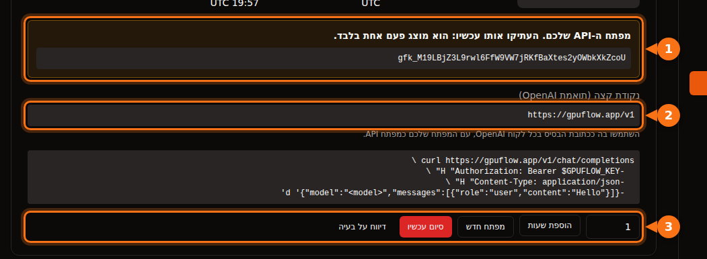

הרבה כלי AI מאפשרים להחליף את OpenAI בספק אחר, כל עוד הוא תומך באותו API. תמיד צריך את אותם שלושה דברים:

| מה | דוגמה |
| --- | --- |
| **כתובת בסיס** (נקראת גם API base, endpoint או host) | `https://gpuflow.app/v1` |
| **מפתח API** | `gfk_...` |
| **שם המודל** | `qwen2.5:7b` |

לאורך המאמר אנחנו משתמשים בהשכרה ב-GPUFlow כדוגמה, אבל השלבים זהים לכל שרת תואם OpenAI: Ollama או llama.cpp מקומיים, vLLM, OpenRouter ועוד רבים. פשוט מחליפים את שלושת הערכים.

ב-GPUFlow תמצאו את שלושתם ב-**לוח מחוונים ← השכרות נוכחיות** אחרי ששכרתם GPU:



## לפני שמתחילים: בודקים את ה-endpoint ואת שם המודל

פקודה אחת תגיד לכם שהמפתח עובד ואיך קוראים למודל:

```bash
curl https://gpuflow.app/v1/models \
  -H "Authorization: Bearer gfk_your_key"
```

התשובה מפרטת את המודלים. העתיקו את ה-`id`, למשל `qwen2.5:7b`, בדיוק כפי שהוא כתוב. שם מודל שגוי הוא הסיבה הנפוצה ביותר לכך שאפליקציה מסרבת לעבוד.

**בדקו במה ה-endpoint שלכם תומך.** ה-endpoint של GPUFlow מציע את `/v1/models` ואת `/v1/chat/completions`, עם streaming. הוא לא מציע embeddings, את ה-Responses API החדש יותר או יצירת תמונות. חלק מהיכולות באפליקציות דורשות אותם, ונציין אותן בהמשך.

## אפליקציות צ'אט

### Open WebUI

1. פתחו את **Settings → Admin → Connections**.
2. תחת **Manage OpenAI API Connections**, לחצו על **+ (Add Connection)**.
3. מלאו:
   - **URL:** `https://gpuflow.app/v1`
   - **API Key:** המפתח שלכם
4. לחצו על **Verify Connection** כדי לבדוק את החיבור (שמירה לבדה לא בודקת אותו), ואז על **Save**.

Open WebUI קורא את רשימת המודלים מ-`/models` בעצמו. אם אתם מריצים אותו ב-Docker, אפשר במקום זאת להגדיר את `OPENAI_API_BASE_URL` ואת `OPENAI_API_KEY`, אבל הם נקראים רק בהפעלה הראשונה של Open WebUI. אחרי זה משנים אותם במסך הניהול.

העלאת מסמכים וחיפוש בהם ב-Open WebUI משתמשים במודל embedding קטן שרץ מקומית כברירת מחדל, כך שהם ממשיכים לעבוד. אל תעבירו את מנוע ה-embedding ל-OpenAI עם ה-endpoint של הצ'אט ככתובת שלו.

### LibreChat

הוסיפו endpoint מותאם ל-`librechat.yaml`:

```yaml
endpoints:
  custom:
    - name: "GPUFlow"
      apiKey: "${GPUFLOW_API_KEY}"
      baseURL: "https://gpuflow.app/v1"
      models:
        default: ["qwen2.5:7b"]
        fetch: true
      titleConvo: true
      titleModel: "qwen2.5:7b"
      modelDisplayLabel: "GPUFlow"
```

שימו את המפתח ב-`.env` בתור `GPUFLOW_API_KEY=gfk_...`. השתמשו ב-`apiKey: "user_provided"` אם כל משתמש צריך להזין מפתח משלו. עם `fetch: true`, LibreChat קורא את רשימת המודלים מה-endpoint.

החיפוש במסמכים של LibreChat (ה-RAG API) משתמש ב-embeddings של OpenAI כברירת מחדל. השאירו אותו על OpenAI, Ollama או Hugging Face; אל תפנו את `RAG_OPENAI_BASEURL` ל-endpoint שמציע רק צ'אט.

### AnythingLLM

1. פתחו את הגדרות ה-LLM ובחרו **Generic OpenAI**.
2. מלאו את **Base URL** (`https://gpuflow.app/v1`), **API Key**, **Chat Model Name** (`qwen2.5:7b`), **Token context window** ו-**Max Tokens**.

ב-Docker, אותן הגדרות הן משתני סביבה:

```bash
LLM_PROVIDER='generic-openai'
GENERIC_OPEN_AI_BASE_PATH='https://gpuflow.app/v1'
GENERIC_OPEN_AI_MODEL_PREF='qwen2.5:7b'
GENERIC_OPEN_AI_MODEL_TOKEN_LIMIT=32768
GENERIC_OPEN_AI_API_KEY=gfk_your_key
```

השאירו את ה-embedder על **AnythingLLM Default**.

### Jan

1. פתחו את **Settings → Model Providers** ולחצו על **Add Provider**.
2. בחרו **OpenAI-compatible**.
3. הזינו שם, את ה-**Base URL** עם `/v1` בסוף ואת ה-**API key** שלכם. לחצו על **Create**.

Jan טוען את רשימת המודלים בזמן השמירה. אם זה לא קורה, הוסיפו את שם המודל ידנית עם כפתור ה-**+** ברשימת המודלים של הספק.

## עוזרי קוד

### Continue (VS Code ו-JetBrains)

הוסיפו מודל ל-`config.yaml`:

```yaml
models:
  - name: GPUFlow Qwen 2.5 7B
    provider: openai
    model: qwen2.5:7b
    apiBase: https://gpuflow.app/v1
    apiKey: ${{ secrets.GPUFLOW_API_KEY }}
    roles:
      - chat
      - edit
      - apply
```

אל תתנו לו את התפקידים `autocomplete` ו-`embed`: ה-endpoint הזה מציע רק צ'אט, ו-embeddings דורשים `/v1/embeddings`. ב-VS Code יש ל-Continue embedder מובנה לחיפוש בקוד. ב-JetBrains אין, אז שם צריך להגדיר מודל embeddings נפרד.

מצב ה-Agent של Continue דורש מודל שיודע לטפל בקריאות לכלים (tool calls). הוסיפו `capabilities: [tool_use]` רק אם אתם יודעים שהמודל שלכם תומך בזה.

### Cline

1. פתחו את ההגדרות של Cline.
2. הגדירו את **API Provider** ל-**OpenAI Compatible**.
3. מלאו את **Base URL**, **API Key** ו-**Model** (`qwen2.5:7b`).
4. תחת **Model Configuration**, הגדירו את חלון ה-context כך ש[יתאים למודל שלכם](/he/which-ai-models-fit-your-gpu-vram/).

הערה לגבי **Roo Code**: התיעוד שלו אומר שהוא עובד רק עם מודלים שתומכים ב-tool calling מובנה, בלי חלופה. ייתכן ש-endpoint צ'אט רגיל לא יעבוד איתו.

## קוד

### הספריות של OpenAI ל-Python ול-Node

Python (`pip install openai`):

```python
from openai import OpenAI

client = OpenAI(base_url="https://gpuflow.app/v1", api_key="gfk_your_key")

reply = client.chat.completions.create(
    model="qwen2.5:7b",
    messages=[{"role": "user", "content": "Say hello in five languages."}],
)
print(reply.choices[0].message.content)
```

Node (`npm install openai`):

```js
import OpenAI from "openai";

const client = new OpenAI({ baseURL: "https://gpuflow.app/v1", apiKey: "gfk_your_key" });

const reply = await client.chat.completions.create({
  model: "qwen2.5:7b",
  messages: [{ role: "user", content: "Say hello in five languages." }],
});
console.log(reply.choices[0].message.content);
```

שתי הספריות קוראות גם את `OPENAI_BASE_URL` ואת `OPENAI_API_KEY` ממשתני הסביבה. שימו לב שקובצי ה-README שלהן פותחים היום עם `client.responses.create(...)`. זה ה-Responses API; השתמשו ב-`client.chat.completions.create(...)` כמו בדוגמה למעלה.

### LangChain

Python (`pip install -U langchain-openai`):

```python
from langchain_openai import ChatOpenAI

llm = ChatOpenAI(
    model="qwen2.5:7b",
    base_url="https://gpuflow.app/v1",
    api_key="gfk_your_key",
    use_responses_api=False,
)
print(llm.invoke("Name three uses for a GPU.").content)
```

JavaScript (`npm install @langchain/openai @langchain/core`). קודם הגדירו את המפתח במשתני הסביבה, `export OPENAI_API_KEY=gfk_your_key`, ואז:

```js
import { ChatOpenAI } from "@langchain/openai";

const llm = new ChatOpenAI({
  model: "qwen2.5:7b",
  configuration: { baseURL: "https://gpuflow.app/v1" },
});
```

LangChain עובר ל-Responses API כשמשתמשים ביכולות מסוימות, כמו כלים מובנים או פלט הסקה (reasoning). `use_responses_api=False` משאיר אותו על Chat Completions.

### LlamaIndex

השתמשו ב-`OpenAILike` (`pip install llama-index-llms-openai-like`):

```python
from llama_index.llms.openai_like import OpenAILike

llm = OpenAILike(
    model="qwen2.5:7b",
    api_base="https://gpuflow.app/v1",
    api_key="gfk_your_key",
    context_window=32768,
    is_chat_model=True,
    is_function_calling_model=False,
)
```

**הגדירו `is_chat_model=True`.** ערך ברירת המחדל הוא `False`, ששולח בקשות ל-`/v1/completions` במקום ל-`/v1/chat/completions`. לאינדוקס מסמכים, הגדירו את `Settings.embed_model` למודל embedding אמיתי; LlamaIndex משתמש ב-embeddings של OpenAI כברירת מחדל.

## כלים שלא יעבדו עם endpoint שמציע רק צ'אט

- **Codex CLI.** הוא הפסיק לתמוך ב-Chat Completions בתחילת 2026, ומקבל היום רק את ה-Responses API.
- **OpenAI Agents SDK.** הוא משתמש ב-Responses API כברירת מחדל. קראו ל-`set_default_openai_api("chat_completions")`, או עטפו את ה-client שלכם ב-`OpenAIChatCompletionsModel`, וכבו את ה-tracing עם `set_tracing_disabled(True)`, כי tracing דורש מפתח של OpenAI.
- **כל מה שצריך embeddings** מאותו endpoint: חיפוש במסמכים, "צ'אט עם הקבצים שלכם", חיפוש סמנטי בקוד. השתמשו ב-embedder המובנה של האפליקציה או בספק embeddings נפרד.

## אם זה עדיין לא עובד

| מה רואים | הסיבה הנפוצה |
| --- | --- |
| `404` או "not found" | בכתובת הבסיס חסר `/v1`, או שהאפליקציה מוסיפה `/v1` בעצמה והוספתם אותו פעמיים. |
| `401` או `invalid_api_key` | מפתח שגוי, או שההשכרה הסתיימה. ב-GPUFlow, אם איבדתם את המפתח, לחצו על **מפתח חדש** בדף ההשכרות הנוכחיות. |
| "Model not found" | שם המודל לא תואם בדיוק את מה שמופיע ב-`/v1/models`. |
| בקשות ל-`/v1/completions` או ל-`/v1/responses` נכשלות | האפליקציה משתמשת ב-API אחר. חפשו הגדרה בשם "chat model" או "chat completions". |

## מאמרים קשורים

- [GPU לפי שעה או API לפי טוקן? כמה באמת עולה להריץ מודל 7B–8B](/he/hourly-gpu-vs-per-token-api/)
- [GPUFlow מול Vast.ai מול RunPod מול SaladCloud: מה מתאים למשימה שלכם](/he/gpuflow-vs-vast-ai-vs-runpod/)

## מקורות

כולם נבדקו בספטמבר 2026.

- Open WebUI: [ספקים תואמי OpenAI](https://docs.openwebui.com/getting-started/quick-start/connect-a-provider/starting-with-openai-compatible/), [משתני סביבה](https://docs.openwebui.com/reference/env-configuration)
- LibreChat: [endpoints מותאמים](https://www.librechat.ai/docs/configuration/librechat_yaml/object_structure/custom_endpoint), [RAG API](https://www.librechat.ai/docs/configuration/rag_api)
- AnythingLLM: [Generic OpenAI](https://docs.anythingllm.com/setup/llm-configuration/cloud/openai-generic)
- Jan: [endpoints מותאמים](https://www.jan.ai/docs/desktop/remote-models/custom-endpoint)
- Continue: [ספק OpenAI](https://docs.continue.dev/customize/model-providers/top-level/openai), [מדריך ההגדרות](https://docs.continue.dev/reference)
- Cline: [OpenAI Compatible](https://docs.cline.bot/provider-config/openai-compatible); Roo Code: [OpenAI Compatible](https://roocodeinc.github.io/Roo-Code/providers/openai-compatible/)
- הספריות של OpenAI: [openai-python](https://github.com/openai/openai-python), [openai-node](https://github.com/openai/openai-node)
- LangChain: [Python](https://docs.langchain.com/oss/python/integrations/chat/openai), [JavaScript](https://docs.langchain.com/oss/javascript/integrations/chat/openai)
- LlamaIndex: [OpenAILike](https://developers.llamaindex.ai/python/framework-api-reference/llms/openai_like/)
- OpenAI Agents SDK: [מודלים](https://openai.github.io/openai-agents-python/models/)
- Codex ו-Chat Completions: [github.com/openai/codex/discussions/7782](https://github.com/openai/codex/discussions/7782)
- ה-API של GPUFlow: [שימוש במפתח ה-API](https://docs.gpuflow.app/he/renters/api-quickstart/)
