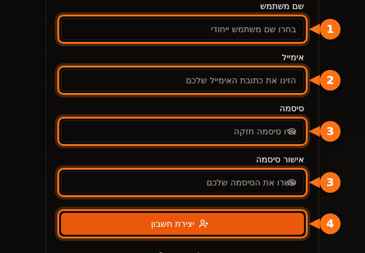
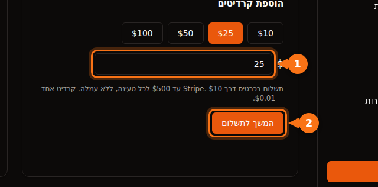

לפני שאתם שוכרים את ה-GPU הראשון, כל פלטפורמה מבקשת משהו: כתובת אימייל, כרטיס אשראי, לפעמים מספר טלפון, ובעננים הגדולים גם בקשת מכסה שיכולה לקחת ימים. המאמר הזה מפרט מה כל אחת מבקשת, כדי שתוכלו לבחור פלטפורמה שתאפשר לכם להתחיל עוד היום.

הכול נבדק בספטמבר 2026 בתיעוד של הפלטפורמות עצמן. המקורות מופיעים בסוף.

## השוואה מהירה

| פלטפורמה | ליצירת חשבון | לפני שאפשר לשכור | אימות זהות לשוכרים | מינימום להתחלה |
| --- | --- | --- | --- | --- |
| **GPUFlow** | אימייל וסיסמה, או Google או GitHub | לאשר את האימייל, להוסיף קרדיטים בכרטיס | לא נדרש בשלבי השכירה | טעינה של $10, בלי עמלה |
| **Vast.ai** | אימייל | לאמת את האימייל, להוסיף קרדיט | לא מופיע בתיעוד | הפקדה של $5 |
| **RunPod** | אימייל | להוסיף קרדיט | רק לפני תשלום קריפטו ראשון | קרדיט לשעה אחת; $100 לעסקה בכרטיס נטען |
| **SaladCloud** | חשבון בפורטל | להוסיף אמצעי חיוב לארגון | לא מופיע בתיעוד | טעינות מ-$5 |
| **Lambda** | חשבון | להוסיף כרטיס אשראי | לא מופיע בתיעוד | תפיסת מסגרת של $10 בכרטיס, מוחזרת |
| **TensorDock** | חשבון | להפקיד כסף | התנאים מתירים בדיקות חשבון | "החל מ-$5 בלבד" |
| **AWS** | אימייל, אימות PIN בטלפון, אמצעי תשלום, CAPTCHA | לבקש מכסת GPU: חשבונות חדשים מתחילים ב-0 | לא ברוב החשבונות | תשלום לפי שימוש |
| **Google Cloud** | חשבון עם חיוב | לבקש מכסת GPU; חשבונות ניסיון חינמי לא מקבלים מכסה | לא ברוב החשבונות | תשלום לפי שימוש |

"לא מופיע בתיעוד" אומר שלא מצאנו דרישה לאימות זהות של שוכרים בתיעוד של אותה פלטפורמה. פלטפורמות עדיין יכולות לבקש בדיקות כשמשהו נראה חריג.

## הפלטפורמות הקטנות: דקות, לא ימים

Vast.ai, RunPod, SaladCloud, TensorDock ו-GPUFlow עובדות כולן בתשלום מראש. מוסיפים כסף קודם ומשתמשים בו לפי שנייה או לפי דקה. מכיוון שאי אפשר לצבור חוב על משהו שלא שילמתם עליו, הן לא צריכות לבדוק את האשראי שלכם או את החברה שלכם.

במה הן כן שונות:

- **אימות אימייל.** גם Vast.ai וגם GPUFlow דורשות אותו לפני שאפשר לשכור או להוסיף קרדיטים. אם האימייל לא מגיע, בדקו בתיקיית הספאם.
- **אמצעי תשלום.**
  - Vast.ai: כרטיס, BitPay, Crypto.com.
  - RunPod: Visa, Mastercard, Amex, קריפטו, וחשבונית לתשלומים מעל $5,000.
  - SaladCloud: כרטיס, או USDC, USDT ו-RENDER על Solana.
  - Lambda: רק כרטיסי אשראי של החברות הגדולות, ורק במדינות נתמכות.
  - GPUFlow: כרטיסים דרך Stripe.
- **מה קורה לכסף שלא השתמשתם בו.** הקרדיט ב-SaladCloud פג 12 חודשים אחרי הרכישה. הקרדיטים ב-GPUFlow לא פגים.

## העננים הגדולים: תכננו בקשת מכסה

AWS ו-Google Cloud לא עוצרות אתכם בהרשמה. הן עוצרות אתכם כשמגיעים ל-GPU.

- **AWS:** המכסה של "Running On-Demand G and VT instances" (משפחת המופעים עם NVIDIA L4 ו-A10G) מתחילה ב-**0 vCPU** בחשבונות חדשים. מבקשים הגדלה בקונסולת Service Quotas. AWS גם מעלה מכסות אוטומטית ככל שהחשבון צובר היסטוריית שימוש.
- **Google Cloud:** חשבונות ניסיון חינמי לא מקבלים מכסת GPU. אחרי שלפרויקט יש היסטוריית חיובים, בקשות מכסה מאושרות בקלות רבה יותר. המכסה היא לפי אזור, ו-GPU מסוג preemptible צריכים מכסה משלהם.

אם אתם צריכים GPU היום, אל תתחילו מחשבון AWS או Google Cloud חדש.

## הרשמה ל-GPUFlow, צעד אחר צעד

GPUFlow בנויה למקרה של "צריך מודל AI תוך חמש דקות". מה שמקבלים הוא מפתח API תואם OpenAI ל-GPU, לא מכונה.

1. **צרו חשבון** ב-gpuflow.app עם שם משתמש, כתובת אימייל וסיסמה, או עם Google או GitHub.

   

2. **אשרו את האימייל.** לחצו על הקישור באימייל ש-GPUFlow שולחת לכם. אי אפשר להוסיף קרדיטים לפני שעושים את זה.
3. **הוסיפו קרדיטים** ב-**לוח מחוונים ← תשלומים**, מ-$10 עד $500 בכרטיס אשראי דרך Stripe. קרדיט אחד = $0.01, ואין עמלה.

   

4. **שכרו GPU** למספר השעות שאתם רוצים, והעתיקו את מפתח ה-API. משלמים לפי שנייה; אם מסיימים מוקדם, היתרה חוזרת לקרדיטים שלכם.

המדריך המלא, עם כל המסכים, נמצא בתיעוד: [שכירת GPU, צעד אחר צעד](https://docs.gpuflow.app/he/renters/getting-started/).

## אם אתם רוצים דווקא להשכיר GPU

כשמקבלים כסף, נכנס לתמונה אימות זהות. חברות תשלומים מחויבות לדעת למי הן שולחות כסף.

- **GPUFlow:** כדי למשוך, מגדירים חשבון משיכות ב-Stripe, שמאמתת את הזהות שלכם ומבקשת את פרטי הבנק. משיכות עובדות בארצות הברית, בקנדה, בבריטניה, בשווייץ ובאזור הכלכלי האירופי.
- **Vast.ai:** מארחים מקבלים תשלום דרך Wise, PayPal או Stripe, והשירותים האלה מטפלים באימות הזהות.
- **Salad:** התגמולים נשלחים דרך PayPal, כרטיסי מתנה ואפשרויות נוספות.

עוד על כמה משתלם לארח ב-[כמה כרטיס המסך שלכם יכול להרוויח](/he/how-much-can-you-earn-renting-out-your-gpu/).

## לפני שמשלמים: רשימת בדיקה קצרה

1. **אשרו את האימייל קודם**, כדי לא להיתקע בשלב התשלום.
2. **בדקו שהמדינה והכרטיס שלכם נתמכים.** Lambda, למשל, מקבלת תשלומים רק מרשימה מסוימת של מדינות.
3. **בדקו מה עמלת מטבע החוץ של הבנק שלכם.** רוב הפלטפורמות גובות בדולר אמריקאי. [עוד על עלויות נסתרות](/he/hidden-fees-in-gpu-rental/).
4. **התחילו בקטן.** הוסיפו מספיק לכמה שעות, בדקו, ואז הוסיפו עוד.

## מאמרים קשורים

- [GPUFlow מול Vast.ai מול RunPod מול SaladCloud: מה מתאים למשימה שלכם](/he/gpuflow-vs-vast-ai-vs-runpod/)
- [איך להשתמש במפתח API תואם OpenAI ב-Open WebUI, ב-Continue, ב-LangChain ועוד](/he/use-openai-compatible-api-key-in-apps/)

## מקורות

כולם נבדקו בספטמבר 2026.

- GPUFlow: [שכירת GPU, צעד אחר צעד](https://docs.gpuflow.app/he/renters/getting-started/), [קרדיטים וחיובים](https://docs.gpuflow.app/he/renters/billing/), [קבלת תשלום](https://docs.gpuflow.app/he/providers/getting-paid/)
- Vast.ai: [התחלה מהירה](https://docs.vast.ai/guides/get-started/quickstart.md), [חיוב](https://docs.vast.ai/documentation/reference/billing), [תשלומים למארחים](https://docs.vast.ai/host/payment.md)
- RunPod: [מידע על חיובים](https://docs.runpod.io/references/billing-information)
- SaladCloud: [הגדרת חשבון](https://docs.salad.com/general/tutorials/account-setup.md), [חיוב](https://docs.salad.com/general/explanation/billing.md)
- Lambda: [ניהול חיובים](https://docs.lambda.ai/public-cloud/manage-billing/)
- TensorDock: [GPU בענן](https://www.tensordock.com/cloud-gpus.html), [תנאי שימוש](https://docs.tensordock.com/legal-information/terms-of-service-tos)
- AWS: [יצירת חשבון](https://docs.aws.amazon.com/accounts/latest/reference/manage-acct-creating.html), [מכסות למופעי On-Demand](https://docs.aws.amazon.com/AWSEC2/latest/UserGuide/ec2-on-demand-instances.html)
- Google Cloud: [פתרון בעיות במכסות GPU](https://docs.cloud.google.com/deep-learning-vm/docs/troubleshooting)
- תגמולי Salad: [מימוש ב-PayPal](https://support.salad.com/rewards/redeeming-your-rewards/how-to-redeem-paypal/)
