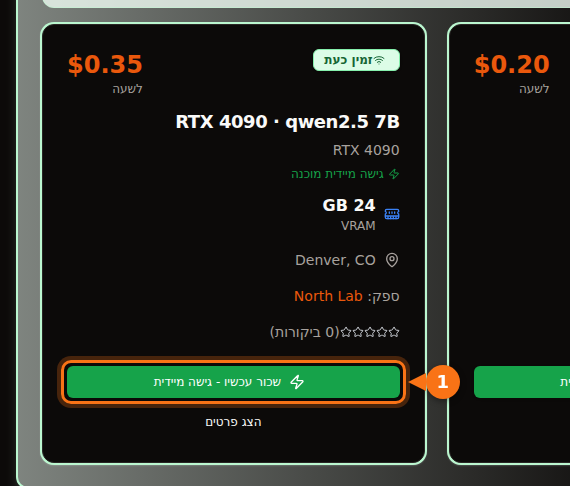

בקוונטיזציה של 4 ביט, שבה Ollama מפיץ מודלים כברירת מחדל, מודל 7B או 8B צריך כרטיס של 8 GB, מודלים של 12B עד 14B צריכים 12 GB (או 16 GB אם אתם רוצים פרומפטים ארוכים), ומודלים של 27B עד 32B צריכים 24 GB. מודל 70B ב-4 ביט שוקל 43 GB, כלומר 48 GB של VRAM או יותר.

הגרסה הארוכה חשובה כי גודל ההורדה הוא לא כל החשבון. גם ה-context שאתם משתמשים בו תופס זיכרון, ומודל שנראה כאילו הוא נכנס יכול להגיע למצב שחציו רץ על ה-CPU, פי כמה לאט. בהמשך: הנוסחה שבה אנחנו משתמשים, מה אומרות תוויות הקוונטיזציה, וטבלה של מודלים פתוחים עדכניים עם גדלי ההורדה האמיתיים שלהם מספריית Ollama. הגדלים והמפרטים נבדקו בספטמבר 2026; המקורות מופיעים בסוף.

## תשובה מהירה לפי גודל VRAM

| VRAM | כרטיסים טיפוסיים | מה רץ כולו על ה-GPU (4 ביט) |
| --- | --- | --- |
| 8 GB | RTX 4060, RTX 5060, RTX 3070 | מודלים של 7B עד 8B: Llama 3.1 8B, Qwen3 8B, Mistral 7B |
| 12 GB | RTX 3060 12 GB, RTX 4070, RTX 5070 | מודלים של 12B עד 14B עם context קצר; 7B עד 8B ב-Q8_0 |
| 16 GB | RTX 4060 Ti 16 GB, RTX 4080, RTX 5080 | 14B עם context ארוך, gpt-oss 20B |
| 24 GB | RTX 3090, RTX 4090 | 24B עד 32B: Mistral Small 3.2, Gemma 3 27B, Qwen3 32B |
| 32 GB | RTX 5090 | 32B עם context ארוך, מודלי mixture-of-experts של 35B |
| 48 עד 80 GB | L40S (48 GB), H100 (80 GB) | 70B ב-4 ביט, gpt-oss 120B על 80 GB |

גודלי הזיכרון של הכרטיסים לקוחים מדפי המפרט של NVIDIA. חלק מהכרטיסים מגיעים בשתי גרסאות: RTX 3060 קיים עם 12 GB ועם 8 GB, ו-RTX 4060 Ti ו-RTX 5060 Ti עם 16 GB ועם 8 GB. בדקו איזו גרסה אתם קונים או שוכרים.

## איך מעריכים כמה VRAM מודל צריך

שלושה דברים יושבים בזיכרון ה-GPU בזמן שהמודל עונה לכם:

1. **המשקלים.** פרמטרים × ביטים למשקל ÷ 8 = בייטים.
2. **מטמון ה-KV.** המודל שומר את ה-keys וה-values של כל טוקן בשיחה כדי לא לחשב אותם מחדש. לכל טוקן זה 2 × שכבות × ראשי KV × גודל ראש × 2 בייטים (במטמון ברירת המחדל של 16 ביט). מכפילים באורך ה-context.
3. **תקורה.** ה-CUDA context, באפרים זמניים וסביבת ההרצה עצמה. אנחנו מקצים לזה כ-1 GB. זה משתנה לפי המנוע וההגדרות, אז התייחסו לזה ככלל אצבע, לא כמפרט.

מספר השכבות והראשים מופיע בקובץ `config.json` של כל מודל ב-Hugging Face.

### דוגמה מחושבת: Qwen 2.5 14B על כרטיס של 16 GB

ל-Qwen 2.5 14B יש 14.7 מיליארד פרמטרים, 48 שכבות, 8 ראשי KV וגודל ראש של 128 (hidden size של 5,120 ÷ 40 ראשי attention).

- **משקלים ב-Q4_K_M:** llama.cpp מציין ש-Q4_K_M הוא כ-4.89 ביט למשקל. 14.7 מיליארד × 4.89 ÷ 8 = 8.99 GB. ההורדה של `qwen2.5:14b` ב-Ollama שוקלת 9.0 GB, כך שהחשבון מתאים לקובץ האמיתי.
- **מטמון KV לטוקן:** 2 × 48 × 8 × 128 × 2 בייטים = 196,608 בייטים, כ-0.2 MB.
- **מטמון KV לכל ה-context:** 4,096 טוקנים = 0.8 GB. 16,384 טוקנים = 3.2 GB. 32,768 טוקנים = 6.4 GB.
- **סך הכול:** 9.0 + 0.8 + 1 = 10.8 GB עם context של 4K. 9.0 + 3.2 + 1 = 13.2 GB עם 16K. 9.0 + 6.4 + 1 = 16.4 GB עם 32K, וזה כבר לא נכנס לכרטיס של 16 GB.

<figure>
<svg viewBox="0 0 720 340" role="img" aria-labelledby="d1-title" xmlns="http://www.w3.org/2000/svg" font-family="system-ui, sans-serif" font-size="15">
<title id="d1-title">מה ממלא את ה-VRAM עבור Qwen 2.5 14B ב-Q4_K_M על כרטיס של 16 GB: משקלים, מטמון KV בשלושה אורכי context, ותקורה</title>
<rect x="0" y="0" width="720" height="340" fill="#ffffff"/>
<rect x="150" y="20" width="16" height="16" rx="3" fill="#6366f1"/>
<text x="172" y="33" fill="#1e1b4b" text-anchor="end" direction="rtl">משקלים 9.0 GB</text>
<rect x="330" y="20" width="16" height="16" rx="3" fill="#a5b4fc"/>
<text x="352" y="33" fill="#1e1b4b" text-anchor="end" direction="rtl">מטמון KV</text>
<rect x="510" y="20" width="16" height="16" rx="3" fill="#e2e8f0"/>
<text x="532" y="33" fill="#1e1b4b" text-anchor="end" direction="rtl">תקורה ~1 GB</text>
<line x1="582.0" y1="66" x2="582.0" y2="278" stroke="#f97316" stroke-width="2" stroke-dasharray="5 4"/>
<text x="576.0" y="60" text-anchor="start" fill="#f97316" font-weight="600" direction="rtl">כרטיס 16 GB</text>
<text x="140" y="106" text-anchor="start" fill="#1e1b4b" direction="rtl">context של 4K</text>
<rect x="150" y="80" width="243.0" height="40" fill="#6366f1"/>
<text x="271.5" y="106" text-anchor="middle" fill="#ffffff" direction="rtl">משקלים</text>
<rect x="393.0" y="80" width="21.6" height="40" fill="#a5b4fc"/>
<rect x="414.6" y="80" width="27.0" height="40" fill="#e2e8f0"/>
<text x="449.6" y="106" fill="#16a34a" font-weight="600">10.8 GB</text>
<text x="140" y="180" text-anchor="start" fill="#1e1b4b" direction="rtl">context של 16K</text>
<rect x="150" y="154" width="243.0" height="40" fill="#6366f1"/>
<text x="271.5" y="180" text-anchor="middle" fill="#ffffff" direction="rtl">משקלים</text>
<rect x="393.0" y="154" width="86.4" height="40" fill="#a5b4fc"/>
<text x="436.2" y="180" text-anchor="middle" fill="#1e1b4b">3.2</text>
<rect x="479.4" y="154" width="27.0" height="40" fill="#e2e8f0"/>
<text x="514.4" y="180" fill="#16a34a" font-weight="600">13.2 GB</text>
<text x="140" y="254" text-anchor="start" fill="#1e1b4b" direction="rtl">context של 32K</text>
<rect x="150" y="228" width="243.0" height="40" fill="#6366f1"/>
<text x="271.5" y="254" text-anchor="middle" fill="#ffffff" direction="rtl">משקלים</text>
<rect x="393.0" y="228" width="172.8" height="40" fill="#a5b4fc"/>
<text x="479.4" y="254" text-anchor="middle" fill="#1e1b4b">6.4</text>
<rect x="565.8" y="228" width="27.0" height="40" fill="#e2e8f0"/>
<text x="600.8" y="254" fill="#f97316" font-weight="600">16.4 GB</text>
<line x1="150" y1="278" x2="690" y2="278" stroke="#64748b"/>
<line x1="150.0" y1="278" x2="150.0" y2="283" stroke="#64748b"/>
<text x="150.0" y="300" text-anchor="middle" fill="#64748b">0</text>
<line x1="258.0" y1="278" x2="258.0" y2="283" stroke="#64748b"/>
<text x="258.0" y="300" text-anchor="middle" fill="#64748b">4</text>
<line x1="366.0" y1="278" x2="366.0" y2="283" stroke="#64748b"/>
<text x="366.0" y="300" text-anchor="middle" fill="#64748b">8</text>
<line x1="474.0" y1="278" x2="474.0" y2="283" stroke="#64748b"/>
<text x="474.0" y="300" text-anchor="middle" fill="#64748b">12</text>
<line x1="582.0" y1="278" x2="582.0" y2="283" stroke="#64748b"/>
<text x="582.0" y="300" text-anchor="middle" fill="#64748b">16</text>
<line x1="690.0" y1="278" x2="690.0" y2="283" stroke="#64748b"/>
<text x="690.0" y="300" text-anchor="middle" fill="#64748b">20</text>
<text x="420.0" y="326" text-anchor="middle" fill="#64748b" direction="rtl">GB של VRAM</text>
</svg>
<figcaption>Qwen 2.5 14B ב-Q4_K_M על כרטיס של 16 GB. המשקלים נשארים 9.0 GB; מטמון ה-KV גדל עם ה-context עד שב-32K טוקנים הסך הכולל עובר את 16 GB. התקורה היא כלל אצבע של 1 GB.</figcaption>
</figure>

משתמע מזה שני דברים. ראשית, ה-context שאתם מגדירים יכול לעלות בזיכרון כמו המודל עצמו. Llama 3.1 8B (32 שכבות, 8 ראשי KV, גודל ראש 128) צריך 131,072 בייטים של מטמון KV לטוקן, כך שה-context המלא שלו, 128K, היה דורש 17.2 GB למטמון בלבד, בערך פי שלושה וחצי מההורדה שלו, 4.9 GB. שנית, גודל מטמון ה-KV לטוקן משתנה מאוד בין מודלים. ל-Qwen 2.5 7B יש רק 4 ראשי KV ו-28 שכבות, ולכן הוא צריך 57,344 בייטים לטוקן, פחות מחצי מ-Llama 3.1 8B. בדקו את ה-config לפני שאתם מניחים משהו.

### מה Ollama עושה עם ה-context כברירת מחדל

Ollama בוחר אורך context ברירת מחדל לפי ה-VRAM שהוא מוצא: 4K טוקנים מתחת ל-24 GiB, 32K טוקנים בין 24 ל-48 GiB, ו-256K מ-48 GiB ומעלה. אפשר לשנות את זה עם משתנה הסביבה `OLLAMA_CONTEXT_LENGTH`, ו-`ollama ps` מראה בעמודה CONTEXT את ה-context שהוקצה בפועל. שתי הגדרות נוספות משנות את החשבון:

- `OLLAMA_NUM_PARALLEL` (ברירת מחדל 1): התיעוד של Ollama אומר שבקשות מקבילות מגדילות את ה-context פי מספר הבקשות המקבילות. ארבעה ערוצים מקבילים פירושם פי ארבעה מטמון KV.
- `OLLAMA_KV_CACHE_TYPE`: ‏`q8_0` תופס בערך חצי מהזיכרון של מטמון ברירת המחדל `f16`, ו-`q4_0` בערך רבע. זה דורש ש-flash attention יהיה מופעל.

## מה אומרות רמות הקוונטיזציה

מודלים פתוחים מתפרסמים בדיוק של 16 ביט (קובצי ה-config שמקושרים בהמשך מציינים bfloat16): שני בייטים לפרמטר. קוונטיזציה שומרת את המשקלים בפחות ביטים. בקובצי GGUF, הפורמט ש-Ollama ו-llama.cpp משתמשים בו, התוויות אומרות בערך את זה:

| תווית | ביטים למשקל | גודל Llama 3.1 8B | Perplexity על Llama 3 8B (נמוך יותר עדיף) |
| --- | --- | --- | --- |
| F16 | 16.0 | 14.96 GiB | 6.233 |
| Q8_0 | 8.50 | 7.95 GiB | 6.234 |
| Q6_K | 6.56 | 6.14 GiB | 6.253 |
| Q5_K_M | 5.70 | 5.33 GiB | 6.289 |
| Q4_K_M | 4.89 | 4.58 GiB | 6.407 |
| Q3_K_M | 4.00 | 3.74 GiB | 6.888 |
| Q2_K_S / Q2_K | 2.97 | 2.78 GiB | 9.752 (Q2_K) |

הביטים למשקל והגדלים לקוחים מקובץ ה-README של quantize ב-llama.cpp ‏(Llama 3.1 8B). ה-perplexity לקוח מקובץ ה-README של perplexity ב-llama.cpp ‏(Llama 3 8B, Wikitext). סוגי ה-"K" הם ה-k-quants של llama.cpp, שמערבבים רמות דיוק שונות בחלקים שונים של המודל; `_S`, `_M` ו-`_L` הם תערובת קטנה, בינונית וגדולה.

מה המספרים אומרים: Q8_0 כמעט ללא אובדן (perplexity של 6.234 מול 6.233). Q4_K_M עולה כ-3% ב-perplexity, ולפי אותו README הטוקן הבא הסביר ביותר שלו זהה לזה של המודל בדיוק מלא ב-91.9% מהמקרים. Q3 גרוע באופן מורגש, ו-Q2 מתפרק.

Perplexity זה לא אותו דבר כמו תועלת, ולכן עוזר שמחקר של Uygar Kurt מינואר 2026 הריץ את Llama 3.1 8B Instruct דרך בנצ'מרקים של הסקה, ידע, ציות להוראות ואמינות בכל רמה של llama.cpp. הממוצע הלא-משוקלל היה 69.47 ב-F16, ‏69.41 ב-Q8_0, ‏69.36 ב-Q5_K_M ו-69.15 ב-Q4_K_M. זו הסיבה שכמעט כולם, כולל Ollama, בוחרים ב-Q4_K_M כברירת מחדל: הקובץ קטן משליש מ-FP16, תמורת אובדן שכמעט לא תרגישו. ב-Ollama התג הפשוט הוא גרסת ה-4 ביט הזו: `qwen3:8b` ו-`qwen3:8b-q4_K_M` שוקלים שניהם 5.2 GB, ‏`phi4:14b` ו-`phi4:14b-q4_K_M` שניהם 9.1 GB.

הכלל שלנו: קחו את המודל הגדול ביותר שנכנס ב-Q4_K_M לפני שאתם לוקחים מודל קטן יותר ב-Q8_0. מודל 14B ב-Q4 בדרך כלל עדיף על 7B ב-Q8, והקבצים בערך באותו גודל. עברו ל-Q5 או ל-Q8 כשנשאר לכם זיכרון והמשימה רגישה לטעויות קטנות, כמו קוד או חילוץ מדויק.

תגים חדשים יותר ב-Ollama כוללים גם פורמטים כמו `qat` (הגרסאות של Gemma שאומנו עם מודעות לקוונטיזציה), ‏`nvfp4` ו-`mxfp8`. ‏gpt-oss מופץ על ידי OpenAI עצמה ב-MXFP4, ב-4.25 ביט לפרמטר עבור משקלי ה-mixture-of-experts.

## אילו מודלים נכנסים: גדלים ודרגות VRAM

הטבלה מפרטת מודלים פתוחים עדכניים בספריית Ollama נכון לספטמבר 2026, עם גדלי ההורדה שלהם. עמודת "4 ביט" היא הגודל של תג ברירת המחדל. ברוב המודלים זה אותו קובץ כמו התג `q4_K_M`; כשברירת המחדל היא גרסה אחרת, הטבלה נותנת את שני הגדלים (ברירת המחדל של Mistral Nemo היא 7.1 GB, וה-`q4_K_M` שלו 7.5 GB). "הכרטיס הקטן ביותר" פירושו שהמודל, ועוד כ-1 GB תקורה ועוד context של 4K עד 8K, נכנסים כולם ל-GPU. רוצים context ארוך? עלו דרגה אחת.

| מודל | תג Ollama | גודל ב-4 ביט | גודל ב-Q8_0 | הכרטיס הקטן ביותר (4 ביט / Q8_0) |
| --- | --- | --- | --- | --- |
| Mistral 7B v0.3 | [`mistral:7b`](https://ollama.com/library/mistral/tags) | 4.4 GB | 7.7 GB | 8 GB / 12 GB |
| Qwen 2.5 7B | [`qwen2.5:7b`](https://ollama.com/library/qwen2.5/tags) | 4.7 GB | 8.1 GB | 8 GB / 12 GB |
| DeepSeek-R1 distill 7B (Qwen 2.5) | [`deepseek-r1:7b`](https://ollama.com/library/deepseek-r1/tags) | 4.7 GB | לא נבדק | 8 GB |
| Llama 3.1 8B | [`llama3.1:8b`](https://ollama.com/library/llama3.1/tags) | 4.9 GB | 8.5 GB | 8 GB / 12 GB |
| Qwen3 8B | [`qwen3:8b`](https://ollama.com/library/qwen3/tags) | 5.2 GB | 8.9 GB | 8 GB / 12 GB |
| DeepSeek-R1-0528 (Qwen3 8B) | [`deepseek-r1:8b`](https://ollama.com/library/deepseek-r1/tags) | 5.2 GB | לא נבדק | 8 GB |
| Qwen3.5 9B | [`qwen3.5:9b`](https://ollama.com/library/qwen3.5/tags) | 6.6 GB | 11 GB | 8 GB, רק עם context קצר / 16 GB |
| Mistral Nemo 12B | [`mistral-nemo:12b`](https://ollama.com/library/mistral-nemo/tags) | 7.1 GB ‏(q4_K_M: 7.5 GB) | 13 GB | 12 GB / 16 GB |
| Gemma 4 12B | [`gemma4:12b`](https://ollama.com/library/gemma4/tags) | 7.6 GB | 13 GB | 12 GB / 16 GB |
| Gemma 3 12B | [`gemma3:12b`](https://ollama.com/library/gemma3/tags) | 8.1 GB | 13 GB | 12 GB / 16 GB |
| Qwen 2.5 14B | [`qwen2.5:14b`](https://ollama.com/library/qwen2.5/tags) | 9.0 GB | 16 GB | 12 GB / 24 GB |
| DeepSeek-R1 distill 14B (Qwen 2.5) | [`deepseek-r1:14b`](https://ollama.com/library/deepseek-r1/tags) | 9.0 GB | לא נבדק | 12 GB |
| Phi-4 14B | [`phi4:14b`](https://ollama.com/library/phi4/tags) | 9.1 GB | 16 GB | 12 GB / 24 GB |
| Qwen3 14B | [`qwen3:14b`](https://ollama.com/library/qwen3/tags) | 9.3 GB | 16 GB | 12 GB / 24 GB |
| gpt-oss 20B (MoE) | [`gpt-oss:20b`](https://ollama.com/library/gpt-oss/tags) | 14 GB ‏(MXFP4) | לא רלוונטי | 16 GB |
| Mistral Small 3.2 24B | [`mistral-small3.2:24b`](https://ollama.com/library/mistral-small3.2/tags) | 15 GB | 26 GB | 24 GB / 32 GB |
| Gemma 3 27B | [`gemma3:27b`](https://ollama.com/library/gemma3/tags) | 17 GB | 30 GB | 24 GB / 48 GB |
| Qwen3.5 27B | [`qwen3.5:27b`](https://ollama.com/library/qwen3.5/tags) | 17 GB | 30 GB | 24 GB / 48 GB |
| Qwen3.6 27B | [`qwen3.6:27b`](https://ollama.com/library/qwen3.6/tags) | 18 GB ‏(q4_K_M: 17 GB) | 30 GB | 24 GB / 48 GB |
| Gemma 4 26B (MoE, ‏3.8B פעילים) | [`gemma4:26b`](https://ollama.com/library/gemma4/tags) | 19 GB ‏(q4_K_M: 18 GB) | 28 GB | 24 GB / 32 GB |
| Qwen3 30B-A3B (MoE) | [`qwen3:30b`](https://ollama.com/library/qwen3/tags) | 19 GB | לא נבדק | 24 GB |
| Gemma 4 31B | [`gemma4:31b`](https://ollama.com/library/gemma4/tags) | 20 GB | 34 GB | 24 GB / 48 GB |
| Qwen3 32B | [`qwen3:32b`](https://ollama.com/library/qwen3/tags) | 20 GB | 35 GB | 24 GB / 48 GB |
| Qwen 2.5 32B | [`qwen2.5:32b`](https://ollama.com/library/qwen2.5/tags) | 20 GB | 35 GB | 24 GB / 48 GB |
| DeepSeek-R1 distill 32B (Qwen 2.5) | [`deepseek-r1:32b`](https://ollama.com/library/deepseek-r1/tags) | 20 GB | לא נבדק | 24 GB |
| Qwen3.6 35B-A3B (MoE) | [`qwen3.6:35b`](https://ollama.com/library/qwen3.6/tags) | 23 GB ‏(q4_K_M: 24 GB) | 39 GB | 32 GB / 48 GB |
| Qwen3.5 35B-A3B (MoE) | [`qwen3.5:35b`](https://ollama.com/library/qwen3.5/tags) | 24 GB | 39 GB | 32 GB / 48 GB |
| Llama 3.3 70B | [`llama3.3:70b`](https://ollama.com/library/llama3.3/tags) | 43 GB | 75 GB | 48 GB, בדוחק / 80 GB, בדוחק |
| Qwen 2.5 72B | [`qwen2.5:72b`](https://ollama.com/library/qwen2.5/tags) | 47 GB | לא נבדק | 80 GB |
| gpt-oss 120B (MoE) | [`gpt-oss:120b`](https://ollama.com/library/gpt-oss/tags) | 65 GB ‏(MXFP4) | לא רלוונטי | 80 GB |

לקביעת הדרגה השתמשנו בגודל של תג ברירת המחדל, כי זה מה ש-`ollama pull` עם השם הקצר מוריד.

בדרגות של 24 GB ו-32 GB יש מלכודת. ה-context שהוא ברירת המחדל ב-Ollama קופץ מ-4K ל-32K ב-24 GiB, כך שמודל של 20 GB על RTX 4090 עלול לקבל מטמון של 32K שלא נכנס לצידו. אם `ollama ps` מראה חלק של CPU, הגדירו context קטן יותר. ואל תשפטו מודל לפי המספר שבשם שלו: מודל הקצה של Gemma 4, ‏`gemma4:e4b` (‏4.5B פרמטרים אפקטיביים), הוא הורדה של 9.6 GB, גדולה יותר מ-`gemma4:12b` שמגיע ל-7.6 GB. בדקו את הגודל.

<figure>
<svg viewBox="0 0 720 546" role="img" aria-labelledby="d2-title" xmlns="http://www.w3.org/2000/svg" font-family="system-ui, sans-serif" font-size="14">
<title id="d2-title">גודל ההורדה של מודלים פופולריים ב-Ollama בקוונטיזציית ברירת המחדל של 4 ביט, בהשוואה ל-8, 12, 16, 24 ו-32 GB של VRAM</title>
<rect x="0" y="0" width="720" height="546" fill="#ffffff"/>
<line x1="320.0" y1="58" x2="320.0" y2="486" stroke="#f97316" stroke-width="2" stroke-dasharray="5 4"/>
<text x="320.0" y="50" text-anchor="middle" fill="#f97316" font-weight="600">8 GB</text>
<line x1="380.0" y1="58" x2="380.0" y2="486" stroke="#f97316" stroke-width="2" stroke-dasharray="5 4"/>
<text x="380.0" y="50" text-anchor="middle" fill="#f97316" font-weight="600">12 GB</text>
<line x1="440.0" y1="58" x2="440.0" y2="486" stroke="#f97316" stroke-width="2" stroke-dasharray="5 4"/>
<text x="440.0" y="50" text-anchor="middle" fill="#f97316" font-weight="600">16 GB</text>
<line x1="560.0" y1="58" x2="560.0" y2="486" stroke="#f97316" stroke-width="2" stroke-dasharray="5 4"/>
<text x="560.0" y="50" text-anchor="middle" fill="#f97316" font-weight="600">24 GB</text>
<line x1="680.0" y1="58" x2="680.0" y2="486" stroke="#f97316" stroke-width="2" stroke-dasharray="5 4"/>
<text x="680.0" y="50" text-anchor="middle" fill="#f97316" font-weight="600">32 GB</text>
<text x="20" y="50" fill="#64748b" text-anchor="end" direction="rtl">דרגות VRAM</text>
<text x="190" y="84" text-anchor="end" fill="#1e1b4b">mistral:7b</text>
<rect x="200" y="70" width="66.0" height="18" rx="3" fill="#6366f1"/>
<text x="272.0" y="84" fill="#1e1b4b">4.4</text>
<text x="190" y="110" text-anchor="end" fill="#1e1b4b">qwen2.5:7b</text>
<rect x="200" y="96" width="70.5" height="18" rx="3" fill="#6366f1"/>
<text x="276.5" y="110" fill="#1e1b4b">4.7</text>
<text x="190" y="136" text-anchor="end" fill="#1e1b4b">llama3.1:8b</text>
<rect x="200" y="122" width="73.5" height="18" rx="3" fill="#6366f1"/>
<text x="279.5" y="136" fill="#1e1b4b">4.9</text>
<text x="190" y="162" text-anchor="end" fill="#1e1b4b">qwen3:8b</text>
<rect x="200" y="148" width="78.0" height="18" rx="3" fill="#6366f1"/>
<text x="284.0" y="162" fill="#1e1b4b">5.2</text>
<text x="190" y="188" text-anchor="end" fill="#1e1b4b">qwen3.5:9b</text>
<rect x="200" y="174" width="99.0" height="18" rx="3" fill="#6366f1"/>
<text x="297.0" y="188" text-anchor="end" fill="#ffffff">6.6</text>
<text x="190" y="214" text-anchor="end" fill="#1e1b4b">gemma4:12b</text>
<rect x="200" y="200" width="114.0" height="18" rx="3" fill="#6366f1"/>
<text x="324.0" y="214" fill="#1e1b4b">7.6</text>
<text x="190" y="240" text-anchor="end" fill="#1e1b4b">gemma3:12b</text>
<rect x="200" y="226" width="121.5" height="18" rx="3" fill="#6366f1"/>
<text x="327.5" y="240" fill="#1e1b4b">8.1</text>
<text x="190" y="266" text-anchor="end" fill="#1e1b4b">qwen2.5:14b</text>
<rect x="200" y="252" width="135.0" height="18" rx="3" fill="#6366f1"/>
<text x="341.0" y="266" fill="#1e1b4b">9.0</text>
<text x="190" y="292" text-anchor="end" fill="#1e1b4b">qwen3:14b</text>
<rect x="200" y="278" width="139.5" height="18" rx="3" fill="#6366f1"/>
<text x="345.5" y="292" fill="#1e1b4b">9.3</text>
<text x="190" y="318" text-anchor="end" fill="#1e1b4b">gpt-oss:20b</text>
<rect x="200" y="304" width="210.0" height="18" rx="3" fill="#6366f1"/>
<text x="416.0" y="318" fill="#1e1b4b">14</text>
<text x="190" y="344" text-anchor="end" fill="#1e1b4b">mistral-small3.2:24b</text>
<rect x="200" y="330" width="225.0" height="18" rx="3" fill="#6366f1"/>
<text x="423.0" y="344" text-anchor="end" fill="#ffffff">15</text>
<text x="190" y="370" text-anchor="end" fill="#1e1b4b">gemma3:27b</text>
<rect x="200" y="356" width="255.0" height="18" rx="3" fill="#6366f1"/>
<text x="461.0" y="370" fill="#1e1b4b">17</text>
<text x="190" y="396" text-anchor="end" fill="#1e1b4b">qwen3.5:27b</text>
<rect x="200" y="382" width="255.0" height="18" rx="3" fill="#6366f1"/>
<text x="461.0" y="396" fill="#1e1b4b">17</text>
<text x="190" y="422" text-anchor="end" fill="#1e1b4b">gemma4:31b</text>
<rect x="200" y="408" width="300.0" height="18" rx="3" fill="#6366f1"/>
<text x="506.0" y="422" fill="#1e1b4b">20</text>
<text x="190" y="448" text-anchor="end" fill="#1e1b4b">qwen3:32b</text>
<rect x="200" y="434" width="300.0" height="18" rx="3" fill="#6366f1"/>
<text x="506.0" y="448" fill="#1e1b4b">20</text>
<text x="190" y="474" text-anchor="end" fill="#1e1b4b">qwen3.6:35b</text>
<rect x="200" y="460" width="345.0" height="18" rx="3" fill="#6366f1"/>
<text x="539.0" y="474" text-anchor="end" fill="#ffffff">23</text>
<line x1="200" y1="486" x2="680" y2="486" stroke="#64748b" stroke-width="1"/>
<line x1="200.0" y1="486" x2="200.0" y2="491" stroke="#64748b"/>
<text x="200.0" y="506" text-anchor="middle" fill="#64748b">0</text>
<line x1="260.0" y1="486" x2="260.0" y2="491" stroke="#64748b"/>
<text x="260.0" y="506" text-anchor="middle" fill="#64748b">4</text>
<line x1="320.0" y1="486" x2="320.0" y2="491" stroke="#64748b"/>
<text x="320.0" y="506" text-anchor="middle" fill="#64748b">8</text>
<line x1="380.0" y1="486" x2="380.0" y2="491" stroke="#64748b"/>
<text x="380.0" y="506" text-anchor="middle" fill="#64748b">12</text>
<line x1="440.0" y1="486" x2="440.0" y2="491" stroke="#64748b"/>
<text x="440.0" y="506" text-anchor="middle" fill="#64748b">16</text>
<line x1="500.0" y1="486" x2="500.0" y2="491" stroke="#64748b"/>
<text x="500.0" y="506" text-anchor="middle" fill="#64748b">20</text>
<line x1="560.0" y1="486" x2="560.0" y2="491" stroke="#64748b"/>
<text x="560.0" y="506" text-anchor="middle" fill="#64748b">24</text>
<line x1="620.0" y1="486" x2="620.0" y2="491" stroke="#64748b"/>
<text x="620.0" y="506" text-anchor="middle" fill="#64748b">28</text>
<line x1="680.0" y1="486" x2="680.0" y2="491" stroke="#64748b"/>
<text x="680.0" y="506" text-anchor="middle" fill="#64748b">32</text>
<text x="440.0" y="530" text-anchor="middle" fill="#64748b" direction="rtl">גודל ההורדה ב-GB (תג ברירת המחדל ב-Ollama, 4 ביט)</text>
</svg>
<figcaption>גדלי ההורדה של תגי ברירת המחדל של 4 ביט ב-Ollama, בקנה מידה מול גודלי VRAM נפוצים. כדי שמודל ייכנס, הפס צריך להסתיים הרבה משמאל לקו: השאירו כ-1 GB לתקורה ועוד מקום למטמון ה-KV.</figcaption>
</figure>

## מודלי mixture-of-experts משנים קצת את התמונה

gpt-oss, ‏Gemma 4 26B ומודלי ה-"A3B" של Qwen הם מודלי mixture-of-experts ‏(MoE). לכל טוקן רצים רק כמה מומחים: ל-Gemma 4 26B יש 25.2B פרמטרים, אבל רק 3.8B פעילים. כלל הזיכרון לא משתנה, כי את כל המשקלים עדיין צריך לטעון לאנשהו. מה שמשתנה הוא המהירות כשהם לא נכנסים כולם. מכיוון שכל טוקן נוגע רק בחלק מהמשקלים, מודל MoE שגולש ל-RAM של המערכת מאט הרבה פחות ממודל צפוף באותו גודל. המדידות בסעיף הבא מראות כמה גדול ההבדל.

## מה קורה כשמודל לא נכנס

Ollama לא מסרב לטעון מודל גדול מדי. הוא שם על ה-GPU כמה שכבות שנכנסות, ומריץ את השאר על ה-CPU מתוך ה-RAM של המערכת. ‏`ollama ps` אומר לכם באיזה מצב אתם: `100% GPU` אומר שהכול נכנס, `100% CPU` אומר ששום דבר לא נכנס, ושילוב כמו `48%/52% CPU/GPU` אומר שיש פיצול.

פיצול עולה ביוקר, כי יצירת כל טוקן מחייבת לקרוא כל משקל פעיל, וה-RAM של המערכת איטי בהרבה מ-VRAM. סדרת הרצות של llama.cpp על RTX 4080 עם 16 GB, שפרסם Rost ב-DEV Community באפריל 2026, מראה את זה בבירור:

| מודל (קוונטיזציה, גודל קובץ) | Context | עומס GPU / CPU | טוקנים לשנייה |
| --- | --- | --- | --- |
| Qwen3.5 27B צפוף (IQ3_XXS, ‏11.5 GB) | 32K | 98% / 100% | 45.1 |
| Qwen3.5 27B צפוף | 64K | 45% / 410% | 22.7 |
| Qwen3.5 27B צפוף | 128K | 16% / 625% | 9.6 |
| Qwen3.5 35B-A3B MoE ‏(IQ3_S, ‏13.6 GB) | 64K | 88% / 115% | 136.8 |
| Qwen3.5 122B-A10B MoE ‏(IQ3_XXS, ‏44.7 GB) | 32K | 30% / 480% | 21.8 |

נתון CPU גבוה עם נתון GPU נמוך אומר שרוב העבודה עברה ל-CPU; כך גם הכותב קורא את המספרים.

אותו מודל צפוף איבד חצי מהמהירות שלו במעבר מ-context של 32K ל-64K, רק בגלל שמטמון ה-KV הגדול יותר דחק שכבות החוצה מה-GPU, ואיבד כמעט 80% ב-128K. מודל ה-MoE של 122B, קובץ של 44.7 GB על כרטיס של 16 GB, עדיין רץ בכ-22 טוקנים לשנייה, כי רק 10B פרמטרים פעילים בכל טוקן. במודלים צפופים, תתייחסו ל"חלקית על ה-CPU" כאל "פי כמה יותר לאט". במודלי MoE זו יכולה להיות פשרה סבירה.

אם נתקלתם בפיצול, הפתרונות לפי סדר העלות: הקטינו את ה-context, העבירו את מטמון ה-KV לקוונטיזציה של `q8_0`, בחרו קוונטיזציה קטנה יותר של אותו מודל (Q4_K_M במקום Q5), בחרו מודל קטן יותר, או עברו לכרטיס עם יותר זיכרון.

## 32 GB וכרטיסי דאטה סנטר

ל-RTX 5090 יש 32 GB. זה מספיק למודל 32B ב-4 ביט עם context ארוך, או למודלי ה-MoE מסוג 35B-A3B, שוקלים 23 עד 24 GB, עם מקום למטמון. זה לא מביא אתכם ל-70B: ‏`llama3.3:70b` שוקל 43 GB גם ב-4 ביט.

ל-70B צריך 48 GB או יותר. ל-L40S יש 48 GB, שמכילים את הקובץ של 43 GB עם מעט מקום ל-context. ל-H100 SXM יש 80 GB (ול-H100 NVL יש 94 GB), ושם נכנסים Llama 3.3 70B ב-4 ביט עם context ארוך, gpt-oss 120B ‏(65 GB, והדף שלו ב-Ollama אומר שהוא נכנס ל-GPU יחיד של 80 GB), או Llama 3.3 70B ב-Q8_0 ‏(75 GB) עם context קצר. ‏Qwen3.5 122B, עם 81 GB, כבר גדול מכרטיס יחיד של 80 GB.

## שוכרים במקום לקנות: איך בודקים מודעה ב-GPUFlow

אם אתם שוכרים GPU ב-GPUFlow, הספק מגיש את המודלים מהמכונה שלו (עם Ollama, שהמתקין של GPUFlow מתקין כברירת מחדל) ובוחר אילו מודלים מותקנים. אתם לא מורידים מודלים בעצמכם: אתם מקבלים מפתח API תואם OpenAI ל-GPU הזה, לא shell. המתקין של GPUFlow משתמש ב-`qwen2.5:7b` כברירת מחדל, והתגים שמוזכרים במתקין ובתיעוד הם `qwen2.5:0.5b`, ‏`deepseek-r1:1.5b`, ‏`qwen2.5:7b`, ‏`deepseek-r1:7b`, ‏`llama3.1:8b` ו-`qwen2.5:14b`. ספקים יכולים להתקין מודלים אחרים.

ב[שוק](https://gpuflow.app/he/marketplace), כל כרטיס מציג את ה-GPU, את ה-VRAM שלו ואת המחיר לשעה, והתיאור של הספק מפרט את המודלים שהוא מגיש. התיעוד של GPUFlow נותן גרסה קצת יותר זהירה של אותו כלל: מודל 7B רץ היטב על 8 GB ומעלה, ומודל 14B על 16 GB ומעלה. כשיש לכם מפתח, `GET /v1/models` מחזיר שם מודל אחד; אם התיאור מפרט מודלים נוספים, אפשר להשתמש גם בשמות שלהם בשדה `model`.

שני דברים שכדאי לדעת. GPUFlow לא מגדיר מגבלת context משלו, כך שחלות ברירות המחדל של Ollama במכונה של הספק, אלא אם הספק שינה אותן. ומודל שהספק לא התקין לא זמין לכם, אז בחרו מודעה קודם כול לפי המודל שאתם צריכים, ורק אחר כך לפי ה-GPU. [חיבור המפתח ל-Open WebUI, ל-Continue או ל-LangChain](/he/use-openai-compatible-api-key-in-apps/) עובד בדיוק כמו עם כל API בסגנון OpenAI.

## מאמרים קשורים

- [איך להשתמש במפתח API תואם OpenAI ב-Open WebUI, ב-Continue, ב-LangChain ועוד](/he/use-openai-compatible-api-key-in-apps/)
- [GPU לפי שעה או API לפי טוקן? כמה באמת עולה להריץ מודל 7B–8B](/he/hourly-gpu-vs-per-token-api/)
- [Ollama מול vLLM מול TGI: בנצ'מרק הסקה על RTX 4090](/he/ollama-vs-vllm-vs-tgi-rtx-4090-benchmark/)
- [השוואת מחירי השכרת GPU ב-2026](/he/gpu-rental-pricing-comparison-2026/)

## מקורות

כולם נבדקו בספטמבר 2026.

- גדלי הורדה בספריית Ollama: [mistral](https://ollama.com/library/mistral/tags), [qwen2.5](https://ollama.com/library/qwen2.5/tags), [qwen3](https://ollama.com/library/qwen3/tags), [qwen3.5](https://ollama.com/library/qwen3.5/tags), [qwen3.6](https://ollama.com/library/qwen3.6/tags), [llama3.1](https://ollama.com/library/llama3.1/tags), [llama3.3](https://ollama.com/library/llama3.3/tags), [deepseek-r1](https://ollama.com/library/deepseek-r1/tags), [דף המודל DeepSeek-R1 (מודלי הבסיס של ה-distill)](https://ollama.com/library/deepseek-r1), [gemma3](https://ollama.com/library/gemma3/tags), [gemma4](https://ollama.com/library/gemma4/tags), [דף המודל Gemma 4 (MoE ופרמטרים פעילים)](https://ollama.com/library/gemma4), [mistral-nemo](https://ollama.com/library/mistral-nemo/tags), [mistral-small3.2](https://ollama.com/library/mistral-small3.2/tags), [phi4](https://ollama.com/library/phi4/tags), [gpt-oss](https://ollama.com/library/gpt-oss/tags), [דף המודל gpt-oss (MXFP4, זיכרון)](https://ollama.com/library/gpt-oss), [אינדקס הספרייה של Ollama](https://ollama.com/library)
- ארכיטקטורת המודלים: [כרטיס המודל Qwen2.5-14B-Instruct](https://huggingface.co/Qwen/Qwen2.5-14B-Instruct), [config.json של Qwen2.5-14B-Instruct](https://huggingface.co/Qwen/Qwen2.5-14B-Instruct/blob/main/config.json), [config.json של Qwen2.5-7B-Instruct](https://huggingface.co/Qwen/Qwen2.5-7B-Instruct/blob/main/config.json), [config.json של Llama-3.1-8B-Instruct (מראה של unsloth)](https://huggingface.co/unsloth/Llama-3.1-8B-Instruct/blob/main/config.json)
- הגדרות context וזיכרון ב-Ollama: [התיעוד של Ollama, אורך context](https://docs.ollama.com/context-length), [שאלות נפוצות של Ollama](https://docs.ollama.com/faq)
- גדלי קוונטיזציה וביטים למשקל: [ה-README של quantize ב-llama.cpp](https://github.com/ggml-org/llama.cpp/blob/master/tools/quantize/README.md)
- Perplexity לפי קוונטיזציה: [ה-README של perplexity ב-llama.cpp](https://github.com/ggml-org/llama.cpp/blob/master/tools/perplexity/README.md)
- מחקר בנצ'מרקים של קוונטיזציה: [Uygar Kurt, Which Quantization Should I Use? ‏(arXiv 2601.14277)](https://arxiv.org/abs/2601.14277)
- מדידות של העברה ל-CPU: [Rost, בנצ'מרקים של LLM על 16 GB VRAM עם llama.cpp ‏(DEV Community, אפריל 2026)](https://dev.to/rosgluk/16-gb-vram-llm-benchmarks-with-llamacpp-speed-and-context-3hgg)
- גודלי זיכרון של כרטיסים: [השוואת סדרת RTX 50 של NVIDIA](https://www.nvidia.com/en-us/geforce/graphics-cards/compare/), [סדרת RTX 40](https://www.nvidia.com/en-us/geforce/graphics-cards/40-series/), [סדרת RTX 30](https://www.nvidia.com/en-us/geforce/graphics-cards/30-series/), [L40S](https://www.nvidia.com/en-us/data-center/l40s/), [H100](https://www.nvidia.com/en-us/data-center/h100/)
- GPUFlow: [שכירת GPU, צעד אחר צעד](https://docs.gpuflow.app/he/renters/getting-started/), [מדריך מהיר ל-API](https://docs.gpuflow.app/he/renters/api-quickstart/), [תחילת עבודה לספקים](https://docs.gpuflow.app/he/providers/getting-started/)
