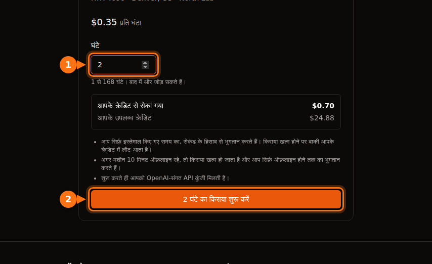

GPU लिस्टिंग पर लिखी प्रति घंटा कीमत सिर्फ़ GPU समय को कवर करती है, और कुछ नहीं। ज़्यादातर प्लेटफ़ॉर्म पर आप डिस्क स्पेस का भी पैसा देते हैं (अक्सर मशीन चालू होने से ज़्यादा उसके रुके होने पर), कुछ मार्केटप्लेस पर data transfer का, setup और idle समय का जिसे मीटर असली काम की तरह गिनता है, और अपने बैंक की currency फ़ीस का। आगे के उदाहरण में RTX 4090 के $13.60 के समय के लिए बनाया गया महीने का बजट $42.23 के बिल पर पहुँचता है।

इनमें से कुछ भी जान-बूझकर छिपाया नहीं गया है। बस जब आप प्लेटफ़ॉर्म की तुलना सबसे ऊपर लिखे आँकड़े से करते हैं, तो ये चीज़ें आसानी से छूट जाती हैं। नीचे की हर बात सितंबर 2026 में हर प्लेटफ़ॉर्म के अपने docs और pricing pages पर जाँची गई है; links आख़िर में हैं। ख़ुद प्रति घंटा कीमतों के लिए [GPU किराये की कीमतों की तुलना](/hi/gpu-rental-pricing-comparison-2026/) देखें।

## प्लेटफ़ॉर्म के हिसाब से अतिरिक्त ख़र्च

| ख़र्च | Vast.ai | RunPod | Lambda | AWS EC2 | GPUFlow |
| --- | --- | --- | --- | --- | --- |
| बिलिंग इकाई | प्रति सेकंड | प्रति सेकंड | प्रति मिनट | प्रति सेकंड, 60 s न्यूनतम | प्रति सेकंड, 1 मिनट न्यूनतम |
| रुकी मशीन का storage | host की दर पर बिल | volume डिस्क $0.20/GB/माह | filesystems का बिल प्रति GiB/माह | EBS का बिल चलता रहता है | कोई नहीं |
| data transfer | host की दर, हर byte | कोई शुल्क नहीं | कोई शुल्क नहीं | बाहर: 100 GB/माह मुफ़्त, फिर प्रति GB | कोई नहीं |
| शुरू करने के लिए | $5 न्यूनतम deposit | 1 घंटे का क्रेडिट; prepaid कार्ड के लिए $100 | $10 कार्ड pre-authorization | एक भुगतान का तरीका | $10 top-up; पूरी बुकिंग रोकी जाती है |
| बैलेंस शून्य होने पर | रुकता है, बाद में destroy | रुकता है; network volume नहीं = डेटा गया | इस्तेमाल के बाद हर हफ़्ते बिल | n/a | किराये के बीच में नहीं हो सकता |

GPUFlow storage और transfer वाली पंक्तियाँ इसलिए छोड़ सकता है क्योंकि वह कुछ और किराये पर देता है: provider के GPU पर पहले से चल रहे AI मॉडल के लिए OpenAI-compatible API key, कोई मशीन नहीं जिसमें आप login करें। दूसरा पहलू यह है कि उस पर आप अपना code नहीं चला सकते, train या fine-tune नहीं कर सकते। अगर आपको मशीन चाहिए, तो बाक़ी चार कॉलम ही आप पर लागू होते हैं।

## storage, ख़ासकर मशीन रुकी होने पर

जो भी प्लेटफ़ॉर्म आपको मशीन या container किराये पर देता है, वहाँ आपकी फ़ाइलें किसी डिस्क पर रहती हैं, और डिस्क तब तक पैसा लेती है जब तक वह मौजूद है।

- **RunPod** pod चालू रहने पर container और volume डिस्क के $0.10 प्रति GB प्रति माह लेता है। pod रोकने पर container डिस्क मिटा दी जाती है और उसका कुछ नहीं लगता, लेकिन volume डिस्क $0.20 प्रति GB प्रति माह हो जाती है। network volumes 1 TB से कम पर $0.07 प्रति GB प्रति माह और उससे ऊपर $0.05 के हैं, pod चले या न चले। savings plans सिर्फ़ GPU compute को कवर करते हैं; storage का बिल सामान्य दरों पर बनता है।
- **Vast.ai** storage का बिल "हर उस सेकंड का बनाता है जब तक आपका instance मौजूद है", offline को छोड़कर हर हालत में। उसके docs सीधी बात कहते हैं: "instance रोकने से storage की लागत नहीं बचती।" दर host तय करता है।
- **AWS** रुके हुए instance के compute या data transfer का पैसा नहीं लेता, लेकिन "Amazon EBS storage volumes रखने का शुल्क लगता है", और रुके हुए instance से जुड़ा Elastic IP भी बिल बनाता रहता है। us-east-1 में एक gp3 volume लगभग $0.08 प्रति GB प्रति माह का है।
- **Lambda** filesystems का बिल इस्तेमाल हुए प्रति GiB प्रति माह के हिसाब से, एक घंटे की इकाइयों में बनाता है।

रुके हुए RunPod pod पर 200 GB की volume डिस्क हर महीने 200 × $0.20 = $40 की पड़ती है, भले ही आप pod दोबारा कभी शुरू न करें। यह RunPod की Community Cloud कीमत पर RTX 4090 के 100 घंटे से ज़्यादा है।

क्रेडिट ख़त्म होना इसे और बिगाड़ देता है। RunPod बैलेंस $0 पर पहुँचते ही pods रुक जाते हैं, और "जिन Pods पर network volume नहीं है, वे terminate कर दिए जाते हैं, और उनका डेटा वापस नहीं मिल सकता।" Vast.ai भी instances रोक देता है, और अगर आपका कार्ड सेव नहीं है, तो थोड़ी मोहलत के बाद "आपके instances और रखा गया डेटा destroy कर दिया जाएगा"। यानी भूला हुआ volume या तो आपसे पैसा लेता रहता है, या आपके काम के साथ ग़ायब हो जाता है।

मैं यह करता हूँ: प्रोजेक्ट ख़त्म होने के दिन volumes हटा देता हूँ, जो अब भी चाहिए वह सिर्फ़ एक छोटे network volume पर रखता हूँ, और जो भी ज़रूरी है उसकी एक कॉपी GPU प्लेटफ़ॉर्म के बाहर कहीं और रखता हूँ।

## data transfer

15 GB का मॉडल डाउनलोड करने और dataset upload करने में हर सेशन में दसियों गीगाबाइट इधर-उधर हो सकते हैं।

- **Vast.ai** "instance पर भेजे या उससे पाए गए हर byte के लिए bandwidth की कीमत लेता है, चाहे वह किसी भी हालत में हो।" हर host अपनी upload और download कीमत तय करता है, और docs चेतावनी देते हैं कि यह "डेटा-भारी workloads की कुल लागत पर काफ़ी असर डाल सकती है।" किराये पर लेने से पहले लिस्टिंग पर इसे देख लें।
- **RunPod** कहता है कि pods पर "ingress/egress का कोई शुल्क नहीं" है।
- **Lambda**: "ingress या egress का आपसे कोई शुल्क नहीं लिया जाता।"
- **AWS**: अंदर आने वाला डेटा मुफ़्त है। इंटरनेट पर बाहर जाने वाला डेटा सभी services और regions को मिलाकर हर महीने पहले 100 GB तक मुफ़्त है, फिर tiered स्केल पर प्रति GB बिल बनता है। हर public IPv4 address $0.005 प्रति घंटा का है, इस्तेमाल हो या idle पड़ा हो, जो 720 घंटे के महीने में $3.60 होता है।

## deposit, hold और prepaid क्रेडिट

ज़्यादातर GPU प्लेटफ़ॉर्म prepaid हैं: आप क्रेडिट ख़रीदते हैं, फिर उसे ख़र्च करते हैं। वहाँ पड़ा पैसा भी एक लागत है, ख़ासकर जब वह वापस न आ सके।

- **Vast.ai**: न्यूनतम deposit $5, कार्ड, BitPay या Crypto.com से। कार्ड से ख़रीदा गया बिना ख़र्च हुआ क्रेडिट साइट के chat से माँगने पर रिफ़ंड हो सकता है; ख़र्च हुआ क्रेडिट नहीं।
- **RunPod**: आपके चुने pod के कम से कम एक घंटे का क्रेडिट चाहिए, और prepaid कार्ड से हर transaction में कम से कम $100 डालने चाहिए। क्रेडिट non-refundable हैं और निकाले नहीं जा सकते।
- **Lambda** उल्टा चलता है: वह पिछले हफ़्ते के इस्तेमाल का बिल हर हफ़्ते बनाता है, और कार्ड जोड़ने पर $10 का pre-authorization करता है, जो कुछ दिनों में लौट आता है। वह सिर्फ़ बड़े credit cards लेता है; prepaid और debit कार्ड अस्वीकार हो जाते हैं।
- **SaladCloud**: top-up $5 से $10,000 तक, और क्रेडिट ख़रीद के 12 महीने बाद expire हो जाता है।
- **GPUFlow**: Stripe के ज़रिए कार्ड से $10 से $500 तक के top-up, बिना फ़ीस, और क्रेडिट की कोई expiry नहीं। किराया शुरू करने पर बुक की गई पूरी राशि आपके क्रेडिट से रोक ली जाती है, कोई छोटा deposit नहीं। $0.40 पर 10 घंटे बुक करें, तो किराया ख़त्म होने तक $4.00 रुके रहते हैं; जो इस्तेमाल नहीं हुआ, वह उसी समय लौट आता है। ख़रीदे गए क्रेडिट cash out नहीं हो सकते, और कार्ड रिफ़ंड सिर्फ़ दोहरे या ग़लत शुल्क, न पहुँचे क्रेडिट, या क़ानूनी ज़रूरत के मामले में, 60 दिनों के भीतर मिलता है।

जो क्रेडिट expire हो जाता है, या किसी ऐसे प्लेटफ़ॉर्म पर पड़ा है जिसे आप अब इस्तेमाल नहीं करते, वह ख़र्च हो चुका पैसा है। top-up इस महीने के अनुमानित काम के लिए करें, पूरे साल के लिए नहीं।

## setup और idle समय

किराये की मशीन समय का बिल बनाती है, काम का नहीं। दो तरह का समय असली काम जितना ही महँगा है और कुछ पैदा नहीं करता।

### setup

मीटर मशीन के साथ ही शुरू होता है। Lambda पर "बिलिंग उसी पल शुरू होती है जब आप instance launch करते हैं और instance health checks पास कर लेता है।" libraries install करना, container image pull करना और मॉडल डाउनलोड करना, सब पैसे वाले समय में होता है। $0.34 प्रति घंटा पर 15 मिनट का setup लगभग $0.09 है। एक बार में मामूली, लेकिन महीने भर हर दिन करें तो यह GPU के कुछ घंटे बन जाता है।

दो चीज़ें मदद करती हैं: ऐसे template या image से शुरू करें जिसमें आपका stack पहले से हो, और मॉडल किसी volume पर रखें ताकि उन्हें एक ही बार डाउनलोड करना पड़े (फिर इसे ऊपर वाली storage लागत से तौलें)।

GPUFlow पर आपकी तरफ़ से कोई setup नहीं है: provider ने मशीन पर मॉडल पहले से install कर रखे हैं, और किराया शुरू होते ही आपको API key मिल जाती है।

### idle

Lambda सीधे कहता है: "instances का बिल तब तक बनता है जब तक वे चल रहे हैं, चाहे उनका सक्रिय रूप से इस्तेमाल हो रहा हो या नहीं।" Google Cloud भी RUNNING हालत में पड़ी idle VM के बारे में यही कहता है। सुबह तैयार मिलने के लिए pod को रात भर चालू छोड़ना एक रात के GPU समय का पड़ता है।

Azure में एक और जाल है। जो VM सिर्फ़ "Stopped" है (जैसे OS के अंदर से shut down की गई), उसके cores का बिल बनता रहता है। compute शुल्क ख़त्म करने के लिए उसे portal या CLI से "Stopped (Deallocated)" करना पड़ता है।

GPUFlow भी इससे बचा नहीं है: जब तक आप **अभी खत्म करें** पर क्लिक नहीं करते या बुक किया समय पूरा नहीं होता, आप पैसा देते हैं। जल्दी ख़त्म करना मुफ़्त है और रोकी गई राशि का इस्तेमाल न हुआ हिस्सा लौट आता है, इसलिए उपाय बस इतना है कि काम पूरा होते ही किराया ख़त्म कर दें। [GPUFlow बिलिंग कैसे काम करती है](https://docs.gpuflow.app/hi/renters/billing/)।

## बिलिंग की इकाइयाँ और न्यूनतम शुल्क

प्रति सेकंड बिलिंग अब आम है, लेकिन ब्योरे अलग-अलग हैं:

| प्लेटफ़ॉर्म | समय का बिल कैसे बनता है |
| --- | --- |
| Vast.ai | प्रति सेकंड |
| RunPod pods | प्रति सेकंड (pods overview पेज अब भी प्रति मिनट कहता है) |
| RunPod serverless | प्रति सेकंड, ऊपर राउंड, worker के शुरू होने का समय और idle timeout (डिफ़ॉल्ट 5 सेकंड) मिलाकर |
| Lambda | एक मिनट की इकाइयाँ |
| AWS EC2 (Linux) | प्रति सेकंड, 60 सेकंड न्यूनतम |
| Google Cloud | 1 मिनट न्यूनतम के बाद प्रति सेकंड |
| Azure | पूरे मिनट |
| GPUFlow | प्रति सेकंड, 1 मिनट न्यूनतम, अगले सेंट तक ऊपर राउंड |

लंबे जॉब के लिए ये अंतर न के बराबर हैं। ये बहुत सारे छोटे सेशनों में और serverless में मायने रखते हैं, जहाँ शुरू होने का समय और idle timeout requests के ऊपर से बिल होते हैं। अगर आप बीच-बीच में ठहराव के साथ छोटे requests भेजते हैं, तो ये requests से ज़्यादा महँगे पड़ सकते हैं। [प्रति सेकंड बनाम प्रति घंटा बिलिंग](/hi/per-second-vs-hourly-gpu-billing/) में पूरा हिसाब है।

## interruptible instances

interruptible (spot) क्षमता सस्ती है, कभी-कभी बहुत सस्ती, लेकिन उसे वापस लिया जा सकता है।

- Vast.ai कहता है कि interruptible instances "अक्सर on-demand से 50%+ सस्ते" होते हैं।
- सितंबर 2026 में AWS पर p5.4xlarge (एक H100) spot पर $2.62 प्रति घंटा था, जबकि on-demand पर $6.88।
- TensorDock पर storage का बिल आपकी bid के ऊपर सामान्य दर पर बनता है, और outbid होने पर भी आप इसे देते रहते हैं। hosts एक न्यूनतम bid तय करते हैं, आमतौर पर on-demand कीमत का लगभग 50%।

छिपी लागत दोहराया गया काम है। अगर आपका जॉब checkpoint से दोबारा शुरू नहीं हो सकता, तो एक रुकावट पूरी बचत मिटा सकती है। checkpoints इतनी बार सेव करें कि आख़िरी अंतराल का काम खोना चुभे नहीं।

## आपके बैंक की फ़ीस

लगभग हर GPU प्लेटफ़ॉर्म, GPUFlow समेत, US डॉलर में पैसा लेता है। अगर आपका कार्ड किसी और currency में है, तो आपका बैंक अपनी फ़ीस जोड़ सकता है:

- foreign transaction fees आमतौर पर 1% से 3% होती हैं, और कुछ बैंक विदेशी merchants से ख़रीद पर यह फ़ीस लेते हैं, भले ही कीमत US डॉलर में दिखाई गई हो।
- ज़्यादातर कनाडाई credit cards दूसरी currency में ख़रीद पर लगभग 2.5% लेते हैं।
- ब्राज़ील में अंतरराष्ट्रीय कार्ड ख़रीद पर IOF टैक्स जुलाई 2025 से 3.5% है।

$100 के top-up पर यह $1 से $3.50 है, जो आपको प्लेटफ़ॉर्म के invoice पर नहीं दिखेगा। बिना foreign transaction fee वाला कार्ड इसका ज़्यादातर हिस्सा हटा देता है।

## एक उदाहरण: $0.34 प्रति घंटा, $42 प्रति माह

RunPod के Community Cloud पर $0.34 प्रति घंटा वाले RTX 4090 पर एक यथार्थवादी महीना, कनाडाई credit card के साथ:

- 40 घंटे का असली काम: 40 × $0.34 = $13.60। लोग बजट में यही आँकड़ा रखते हैं।
- 20 सेशन, हर एक में 15 मिनट का setup, कुल 5 घंटे: 5 × $0.34 = $1.70।
- दो रातें जब pod चालू छूट गया, हर बार 10 घंटे: 20 × $0.34 = $6.80।
- पूरे महीने रखी गई 100 GB की volume डिस्क। वह महीने के 720 घंटों में से 65 घंटे चलती है और बाक़ी 655 घंटे रुकी रहती है: 100 × ($0.10 × 65/720 + $0.20 × 655/720) = लगभग $19.10।
- उप-योग $41.20, साथ में 2.5% foreign transaction fee: $1.03।

कुल: $42.23, योजना वाले GPU काम का लगभग 3.1 गुना। RunPod data transfer का पैसा नहीं लेता, इसलिए bandwidth कीमत वाले Vast.ai host पर एक पंक्ति और होती।

<figure>
<svg viewBox="0 0 720 300" role="img" aria-labelledby="d1-title" xmlns="http://www.w3.org/2000/svg" font-family="system-ui, sans-serif" font-size="15">
<title id="d1-title">stacked बार चार्ट: RTX 4090 के 13.60 डॉलर के समय के लिए बनाया गया महीना setup समय, idle रातों, डिस्क storage और कार्ड फ़ीस के बाद 42.23 डॉलर का बिल बन जाता है</title>
<rect x="0" y="0" width="720" height="300" fill="#ffffff"/>
<text x="20" y="28" fill="#1e1b4b" font-weight="600">$0.34 प्रति घंटा पर RTX 4090 का एक महीना</text>
<line x1="130" y1="50" x2="130" y2="170" stroke="#e2e8f0" stroke-width="1"/>
<text x="130" y="190" text-anchor="middle" fill="#64748b" font-size="13">$0</text>
<line x1="250" y1="50" x2="250" y2="170" stroke="#e2e8f0" stroke-width="1"/>
<text x="250" y="190" text-anchor="middle" fill="#64748b" font-size="13">$10</text>
<line x1="370" y1="50" x2="370" y2="170" stroke="#e2e8f0" stroke-width="1"/>
<text x="370" y="190" text-anchor="middle" fill="#64748b" font-size="13">$20</text>
<line x1="490" y1="50" x2="490" y2="170" stroke="#e2e8f0" stroke-width="1"/>
<text x="490" y="190" text-anchor="middle" fill="#64748b" font-size="13">$30</text>
<line x1="610" y1="50" x2="610" y2="170" stroke="#e2e8f0" stroke-width="1"/>
<text x="610" y="190" text-anchor="middle" fill="#64748b" font-size="13">$40</text>
<text x="120" y="84" text-anchor="end" fill="#1e1b4b">योजना</text>
<rect x="130" y="62" width="163.2" height="34" rx="3" fill="#6366f1"/>
<text x="301.2" y="84" fill="#1e1b4b">$13.60</text>
<text x="120" y="144" text-anchor="end" fill="#1e1b4b">असली बिल</text>
<rect x="130" y="122" width="163.2" height="34" fill="#6366f1"/>
<rect x="293.2" y="122" width="20.4" height="34" fill="#eef2ff" stroke="#6366f1" stroke-width="1.5"/>
<rect x="313.6" y="122" width="81.6" height="34" fill="#f97316"/>
<rect x="395.2" y="122" width="229.2" height="34" fill="#64748b"/>
<rect x="624.4" y="122" width="12.4" height="34" fill="#1e1b4b"/>
<text x="644.8" y="144" fill="#1e1b4b" font-weight="600">$42.23</text>
<line x1="130" y1="50" x2="130" y2="170" stroke="#64748b" stroke-width="1.5"/>
<rect x="20" y="209" width="16" height="16" fill="#6366f1"/>
<text x="44" y="222" fill="#1e1b4b">GPU काम: $13.60</text>
<rect x="250" y="209" width="16" height="16" fill="#eef2ff" stroke="#6366f1" stroke-width="1.5"/>
<text x="274" y="222" fill="#1e1b4b">setup: $1.70</text>
<rect x="480" y="209" width="16" height="16" fill="#f97316"/>
<text x="504" y="222" fill="#1e1b4b">idle रातें: $6.80</text>
<rect x="20" y="245" width="16" height="16" fill="#64748b"/>
<text x="44" y="258" fill="#1e1b4b">volume डिस्क: $19.10</text>
<rect x="250" y="245" width="16" height="16" fill="#1e1b4b"/>
<text x="274" y="258" fill="#1e1b4b">कार्ड फ़ीस: $1.03</text>
</svg>
<figcaption>इस हिस्से का उदाहरण, स्केल पर: $0.34 प्रति घंटा पर 40 घंटे का असली GPU काम, साथ में 5 घंटे का setup, भूली हुई दो रातें, पूरे महीने रखी 100 GB की volume डिस्क और 2.5% कार्ड फ़ीस। GPU का काम बिल के एक तिहाई से भी कम है।</figcaption>
</figure>

सबसे बड़ी मद GPU है ही नहीं, बल्कि एक डिस्क है जो महीने के 91% समय रुकी पड़ी रही। उपाय उबाऊ है: volume हटा दें या छोटा कर दें, और काम रोकते ही pod ख़त्म कर दें।

### किराये पर लेने से पहले की checklist

1. GPU समय जोड़ें, और साथ में उतने समय का storage जितने समय आप फ़ाइलें रखेंगे, रुकी मशीन वाली दर पर।
2. अगर प्लेटफ़ॉर्म पर bandwidth की कीमत है, तो लिस्टिंग पर देखें, और अंदाज़ा लगाएँ कि आप कितना डाउनलोड करेंगे।
3. setup के समय को पैसे वाला समय मानें।
4. पता रखें कि पैसा देना कैसे बंद होगा: किराया ख़त्म करें, मशीन stop या deallocate करें, volume हटाएँ।
5. पता रखें कि बैलेंस शून्य होने पर आपके डेटा का क्या होगा।
6. अपने कार्ड की foreign transaction fee जाँच लें।

अगर आपको एक AI मॉडल चाहिए जिसे अपने code से कॉल कर सकें, न कि अपना software चलाने के लिए मशीन, तो API पर आधारित किराया storage, transfer और setup वाली पंक्तियों से पूरी तरह बच जाता है। [घंटे के हिसाब से GPU या प्रति token API](/hi/hourly-gpu-vs-per-token-api/) इसकी तुलना प्रति token भुगतान से करता है, और [GPUFlow vs Vast.ai vs RunPod vs SaladCloud](/hi/gpuflow-vs-vast-ai-vs-runpod/) बताता है कि कौन-सा प्लेटफ़ॉर्म किस काम के लिए ठीक है। training या किसी भी ऐसे काम के लिए जिसे पूरी मशीन चाहिए, यह checklist बिल को प्रति घंटा कीमत के क़रीब रखने का तरीका है।

## स्रोत

- RunPod: [pod की कीमतें और storage](https://docs.runpod.io/pods/pricing), [pricing पेज](https://www.runpod.io/pricing), [pods का परिचय](https://docs.runpod.io/pods/overview), [serverless की कीमतें](https://docs.runpod.io/serverless/pricing), [बिलिंग की जानकारी](https://docs.runpod.io/references/billing-information), [RTX 4090 की कीमतें](https://www.runpod.io/gpu-models/rtx-4090)
- Vast.ai: [कीमतें](https://docs.vast.ai/guides/instances/pricing.md), [बिलिंग](https://docs.vast.ai/documentation/reference/billing), [quickstart (न्यूनतम deposit)](https://docs.vast.ai/guides/get-started/quickstart.md)
- Lambda: [बिलिंग](https://docs.lambda.ai/public-cloud/billing/), [बिलिंग का प्रबंधन](https://docs.lambda.ai/public-cloud/manage-billing/)
- SaladCloud: [बिलिंग](https://docs.salad.com/general/explanation/billing.md)
- TensorDock: [spot instances](https://docs.tensordock.com/virtual-machines/spot-instances)
- AWS: [EC2 on-demand की कीमतें](https://aws.amazon.com/ec2/pricing/on-demand/), [stop और start कैसे काम करता है](https://docs.aws.amazon.com/AWSEC2/latest/UserGuide/how-ec2-instance-stop-start-works.html), [VPC की कीमतें (public IPv4)](https://aws.amazon.com/vpc/pricing/), [Vantage के ज़रिए p5.4xlarge की कीमतें](https://instances.vantage.sh/aws/ec2/p5.4xlarge?region=us-east-1), gp3 की कीमत: [CloudBurn EBS pricing guide](https://cloudburn.io/blog/amazon-ebs-pricing)
- Google Cloud: [VM instance की कीमतें](https://cloud.google.com/compute/vm-instance-pricing)
- Azure: [Linux VM की कीमतें और FAQ](https://azure.microsoft.com/en-us/pricing/details/virtual-machines/linux/)
- कार्ड फ़ीस: [Experian](https://www.experian.com/blogs/ask-experian/what-is-a-foreign-transaction-fee/), [NerdWallet Canada](https://www.nerdwallet.com/ca/p/best/credit-cards/best-no-foreign-transaction-fee-credit-cards), ब्राज़ील IOF: [Wise Brazil](https://wise.com/br/blog/iof-cartao-internacional)
- GPUFlow: [बिलिंग](https://docs.gpuflow.app/hi/renters/billing/), [शुरुआत करें](https://docs.gpuflow.app/hi/renters/getting-started/), [मार्केटप्लेस](https://gpuflow.app/hi/marketplace)

सभी की जाँच सितंबर 2026 में की गई।
