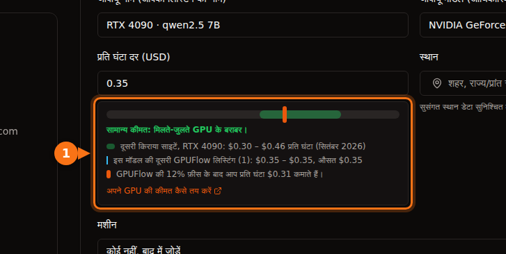

अगर आपके पास गेमिंग GPU है जो दिन के ज़्यादातर समय खाली पड़ा रहता है, तो आप उसे किसी मार्केटप्लेस पर किराये पर देकर घंटे के हिसाब से कमा सकते हैं। यह फ़ायदेमंद है या नहीं, यह चार आँकड़ों पर टिका है:

1. **किरायेदार आपके कार्ड के लिए प्रति घंटा कितना देते हैं।**
2. **प्लेटफ़ॉर्म कितना रखता है।**
3. **चलते समय बिजली पर आपका कितना खर्च होता है।**
4. **दिन में यह असल में कितने घंटे किराये पर रहता है।**

पहले तीन आसानी से पता चल जाते हैं। चौथे का वादा कोई नहीं कर सकता, इसलिए हम एक रेंज दिखाते हैं। नीचे दी गई सभी कीमतें सितंबर 2026 में जाँची गईं; स्रोत आख़िर में हैं।

## 1. किरायेदार कितना देते हैं

सितंबर 2026 में GPU रेंटल साइटों (Vast.ai, RunPod, Salad, SimplePod, TensorDock, Hyperstack, Lambda) पर प्रति घंटे की आम on-demand कीमतें ये थीं:

| GPU | प्रति घंटे की आम कीमत | रेंज का बीच |
| --- | --- | --- |
| RTX 3060 12 GB | $0.05 – $0.08 | $0.065 |
| RTX 4070 | $0.07 – $0.15 | $0.11 |
| RTX 3090 | $0.11 – $0.31 | $0.21 |
| RTX 4080 | $0.23 – $0.27 | $0.25 |
| RTX 4090 | $0.30 – $0.46 | $0.38 |
| RTX 5090 | $0.41 – $0.69 | $0.55 |

मेमोरी उतनी ही मायने रखती है जितनी स्पीड। 3090 या 4090 जैसा 24 GB कार्ड [12 GB या 16 GB कार्ड से बड़े AI मॉडल चला सकता है](/hi/which-ai-models-fit-your-gpu-vram/), और किरायेदार इसके पैसे देते हैं।

## 2. प्लेटफ़ॉर्म कितना रखता है

| प्लेटफ़ॉर्म | हिस्सा | Payouts |
| --- | --- | --- |
| GPUFlow | 12% रखता है, आपको 88% मिलता है | Stripe के ज़रिए आपके बैंक में। न्यूनतम $25, हर निकासी पर $2.50। |
| Vast.ai | Vast के मुताबिक़ लिस्ट की गई कीमतें आमतौर पर hosts की कमाई से लगभग 25% ज़्यादा होती हैं | Wise, PayPal या Stripe। न्यूनतम $20, हर हफ़्ते invoice। |
| Salad | प्रकाशित नहीं | PayPal, गिफ़्ट कार्ड, गेम और बहुत कुछ |

सेटअप भी अलग-अलग हैं। Vast.ai के hosts Ubuntu चलाते हैं, और किरायेदारों को host पर SSH या Jupyter एक्सेस वाले containers मिलते हैं। Salad Windows 10 या 11 पर चलता है। GPUFlow पर आप systemd वाले Linux कंप्यूटर पर एक कमांड चलाते हैं; किरायेदार सिर्फ़ API के ज़रिए आपके AI मॉडल तक पहुँचते हैं, [आपकी मशीन के shell तक कभी नहीं](/hi/is-it-safe-to-rent-out-your-gpu/)। [किरायेदार किन चीज़ों तक पहुँच सकते हैं और किन तक नहीं](https://docs.gpuflow.app/hi/providers/security/)।

## 3. बिजली का खर्च कितना है

फ़ॉर्मूला: **kW में बिजली की खपत × आपकी प्रति kWh कीमत = प्रति घंटा लागत।**

बिजली की खपत के लिए हम हर कार्ड का आधिकारिक board power इस्तेमाल करते हैं। यह कार्ड की अधिकतम खपत के क़रीब है; AI टेक्स्ट बनाते समय खपत अक्सर इससे कम होती है। बाक़ी PC इसमें और जोड़ता है। सबसे सही तरीका है ख़ुद मापना: GPUFlow **मेरी मशीनें** पर आपके GPU की लाइव बिजली खपत दिखाता है, और प्लग में लगने वाला power meter पूरे PC की खपत दिखाता है।

| GPU | Board power |
| --- | --- |
| RTX 3060 | 170 W |
| RTX 4070 | 200 W |
| RTX 3090 | 350 W |
| RTX 4080 | 320 W |
| RTX 4090 | 450 W |
| RTX 5090 | 575 W |

450 W पर RTX 4090 के एक घंटे की बिजली का खर्च:

| कहाँ | घरेलू कीमत | 450 W पर एक घंटा |
| --- | --- | --- |
| अमेरिका (2026 का औसत अनुमान) | 18.2 ¢/kWh | लगभग $0.08 |
| कनाडा | C$0.170/kWh | लगभग C$0.08 |
| यूनाइटेड किंगडम (अक्टूबर–दिसंबर 2026 price cap) | 26.32 p/kWh | लगभग 11.8 p |
| जर्मनी | €0.3869/kWh | लगभग €0.17 |
| फ़्रांस | €0.2561/kWh | लगभग €0.12 |

किराये के हर घंटे में 4090 जितना कमाता है, अमेरिका में उसका लगभग एक-चौथाई बिजली में चला जाता है। जर्मनी में वही घंटा लगभग €0.17 का पड़ता है, इसलिए कीमत तय करने से पहले अपनी दर ज़रूर देख लें।

## 4. सब जोड़कर

रेंज के बीच वाली कीमत पर, GPUFlow के 88% हिस्से और पूरे board power पर अमेरिका की औसत बिजली के साथ, किराये के हर घंटे का हिसाब:

| GPU | आपको मिलता है (88%) | बिजली | किराये के हर घंटे पर बचत | रोज़ 4 घंटे (120 घंटे/महीना) | रोज़ 12 घंटे (360 घंटे/महीना) |
| --- | --- | --- | --- | --- | --- |
| RTX 3060 12 GB | $0.057 | $0.031 | **$0.026** | $3.15 | $9.45 |
| RTX 4070 | $0.097 | $0.036 | **$0.060** | $7.25 | $21.74 |
| RTX 3090 | $0.185 | $0.064 | **$0.121** | $14.53 | $43.60 |
| RTX 4080 | $0.220 | $0.058 | **$0.162** | $19.41 | $58.23 |
| RTX 4090 | $0.334 | $0.082 | **$0.253** | $30.30 | $90.90 |
| RTX 5090 | $0.484 | $0.105 | **$0.379** | $45.52 | $136.57 |

तीन चीज़ें इस टेबल में शामिल नहीं हैं:

- **इंतज़ार का समय।** किरायेदारों को आपका PC मिले, इसके लिए उसे चालू और ऑनलाइन रहना होगा। इंतज़ार के दौरान भी वह बिजली खाता है। idle हालत में अपने PC की खपत मापें और उसे भी घटाएँ।
- **घिसाव।** लंबे लोड में पंखे और thermal paste जल्दी पुराने होते हैं। केस में हवा का अच्छा बहाव रखें और तापमान पर नज़र रखें।
- **टैक्स।** किराये की आमदनी भी आमदनी है। उस पर टैक्स कैसे लगेगा, यह इस पर निर्भर है कि आप कहाँ रहते हैं।

## आँकड़े क्या कहते हैं

- **RTX 3090, 4080, 4090 और 5090** ठीक-ठाक कमा सकते हैं, अगर वे दिन में कई घंटे किराये पर रहें। 3090 सबसे फ़ायदे का सौदा है: कम बिजली खर्च पर 24 GB मेमोरी।
- **RTX 3060 और 4070** प्रति घंटा बहुत कम कमाते हैं। $3 महीने की दर से 3060 को GPUFlow की $25 की न्यूनतम निकासी तक पहुँचने में लगभग आठ महीने लगेंगे। यह तभी फ़ायदेमंद है जब आपकी बिजली सस्ती हो या PC वैसे भी चालू रहता हो।
- **सब कुछ इस्तेमाल पर टिका है।** वही 4090 महीने में $30 कमाता है या $91, यह इस पर निर्भर है कि वह रोज़ 4 घंटे किराये पर रहता है या 12। कुछ सेंट की छूट के मुक़ाबले वाजिब कीमत और भरोसेमंद ढंग से ऑनलाइन रहने वाली मशीन ज़्यादा किराये दिलाती है।

## किराये के ज़्यादा घंटे कैसे पाएँ

1. **शुरुआत में रेंज के निचले आधे हिस्से में कीमत रखें।** किरायेदार तुलना करते हैं। किराये मिलने लगें तो आप कीमत बढ़ा सकते हैं।
2. **ऑनलाइन रहें।** ऑफ़लाइन GPU किराये पर नहीं लिया जा सकता। GPUFlow पर किरायेदार ऑफ़लाइन GPU पर **ऑनलाइन होने पर सूचित करें** पर क्लिक कर सकते हैं; जब कोई इंतज़ार कर रहा हो, तो आपको ईमेल मिलता है।
3. **लोकप्रिय मॉडल चलाएँ।** अपनी लिस्टिंग में उन मॉडल के नाम लिखें जो आप चलाते हैं, जैसे `qwen2.5:7b` या `llama3.1:8b`। किरायेदार इन्हीं को खोजते हैं।
4. **एक हफ़्ते बाद फिर देखें।** ज़्यादातर समय किराये पर रहा? कीमत थोड़ी बढ़ा दें। कोई किराया नहीं मिला? थोड़ी घटा दें।

GPUFlow पर लिस्टिंग फ़ॉर्म दिखाता है कि आपकी कीमत दूसरी रेंटल साइटों और उसी कार्ड की दूसरी GPUFlow लिस्टिंग के मुक़ाबले कहाँ है, और शुल्क के बाद आप प्रति घंटा कितना कमाते हैं:

## GPUFlow payouts कहाँ काम करते हैं

GPUFlow Stripe के ज़रिए **अमेरिका, कनाडा, यूनाइटेड किंगडम, स्विट्ज़रलैंड और यूरोपियन इकोनॉमिक एरिया** के बैंक खातों में भुगतान करता है। अगर आप कहीं और रहते हैं, तब भी आप GPU लिस्ट कर सकते हैं और अपनी कमाई दूसरे GPU किराये पर लेने में ख़र्च कर सकते हैं, लेकिन फ़िलहाल बैंक में पैसे नहीं निकाल सकते। कमाई निकालने से पहले 7 दिन तक रोककर रखी जाती है (30 दिन से कम पुराने खातों के लिए 14 दिन)। [GPUFlow पर भुगतान पाना](https://docs.gpuflow.app/hi/providers/getting-paid/)।

## अपने आँकड़ों से हिसाब लगाएँ

**(प्रति घंटा कीमत × 0.88) − (वॉट ÷ 1,000 × प्रति kWh कीमत) = किराये के हर घंटे पर बचत**

फिर इसे उतने घंटों से गुणा करें जितने की आप असल में उम्मीद कर सकते हैं। अगर जवाब महीने के कुछ ही डॉलर है, तो शायद यह हार्डवेयर के घिसाव के लायक नहीं है। अगर दसियों डॉलर है, तो एक महीना आज़माकर असली आँकड़े देखना फ़ायदेमंद है।

शुरू करने के लिए देखें [अपना GPU ऑनलाइन लाएँ](https://docs.gpuflow.app/hi/providers/getting-started/) और [अपने GPU की कीमत कैसे तय करें](https://docs.gpuflow.app/hi/providers/pricing/)।

## संबंधित लेख

- [GPUFlow vs Vast.ai vs RunPod vs SaladCloud: आपके काम के लिए कौन-सा सही है](/hi/gpuflow-vs-vast-ai-vs-runpod/)
- [GPU किराये पर लेने की असली लागत: घंटे की कीमत में क्या शामिल नहीं होता](/hi/hidden-fees-in-gpu-rental/)

## स्रोत

सभी की जाँच सितंबर 2026 में की गई।

- GPU किराये की कीमतों की रेंज: [GPUFlow docs, अपने GPU की कीमत कैसे तय करें](https://docs.gpuflow.app/hi/providers/pricing/)
- GPUFlow शुल्क, होल्ड और payouts: [GPUFlow docs, भुगतान पाना](https://docs.gpuflow.app/hi/providers/getting-paid/)
- Vast.ai host की कमाई: [vast.ai लेख](https://vast.ai/article/how-much-money-can-you-earn-renting-out-your-gpu-on-vast-ai) (18 मई 2026); payouts: [docs.vast.ai/host/payment.md](https://docs.vast.ai/host/payment.md); hosting की ज़रूरतें: [docs.vast.ai/host/hosting-overview.md](https://docs.vast.ai/host/hosting-overview.md)
- Salad: [salad.com/download](https://salad.com/download/), [PayPal redemption](https://support.salad.com/rewards/redeeming-your-rewards/how-to-redeem-paypal/)
- Board power: NVIDIA के product pages, [RTX 3060](https://www.nvidia.com/en-us/geforce/graphics-cards/30-series/rtx-3060-3060ti/), [RTX 4080](https://www.nvidia.com/en-us/geforce/graphics-cards/40-series/rtx-4080-family/), [RTX 4090](https://www.nvidia.com/en-us/geforce/graphics-cards/40-series/rtx-4090/), [RTX 5090](https://www.nvidia.com/en-us/geforce/graphics-cards/50-series/rtx-5090/); RTX 3090: [TechPowerUp](https://www.techpowerup.com/gpu-specs/geforce-rtx-3090.c3622); RTX 4070: [TechSpot](https://www.techspot.com/review/2663-nvidia-geforce-rtx-4070/)
- अमेरिका में बिजली: [EIA Short-Term Energy Outlook](https://www.eia.gov/outlooks/steo/report/elec_coal_renew.php) (सितंबर 2026)
- UK में बिजली: [Ofgem price cap](https://www.ofgem.gov.uk/your-energy-supply/your-energy-bill/energy-price-cap-unit-rates-and-standing-charges)
- जर्मनी और फ़्रांस में बिजली, 2025 की दूसरी छमाही: [Eurostat बिजली कीमत आँकड़े](https://ec.europa.eu/eurostat/statistics-explained/index.php?title=Electricity_price_statistics), [फ़्रांस के लिए Eurostat nrg_pc_204 डेटा](https://ec.europa.eu/eurostat/api/dissemination/statistics/1.0/data/nrg_pc_204?geo=FR&nrg_cons=KWH2500-4999&unit=KWH&tax=I_TAX&currency=EUR&lastTimePeriod=1)
- कनाडा में बिजली, जून 2025: [GlobalPetrolPrices](https://www.globalpetrolprices.com/Canada/electricity_prices/)
