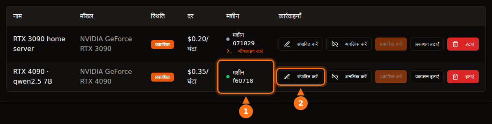

प्लेटफ़ॉर्म सोच-समझकर चुनें तो यह काफ़ी हद तक सुरक्षित है, लेकिन अलग-अलग प्लेटफ़ॉर्म पर "सुरक्षित" का मतलब अलग है। Vast.ai जैसे container प्लेटफ़ॉर्म पर किरायेदार आपकी मशीन पर अपना code चलाता है और उसका ट्रैफ़िक आपके IP पते से बाहर जाता है; अलगाव उसे आपकी फ़ाइलों से दूर रखता है, आपके नेटवर्क या बिजली के बिल से नहीं। GPUFlow जैसे सिर्फ़ API वाले डिज़ाइन में किरायेदार सिर्फ़ आपके इंस्टॉल किए मॉडल को chat अनुरोध भेज सकता है, और जोखिम पलट जाता है: prompt आपकी मशीन पर पढ़े जा सकते हैं, इसलिए किरायेदारों को कोई गोपनीय चीज़ नहीं भेजनी चाहिए।

यह लेख दोनों दिशाओं को देखता है। दूसरे प्लेटफ़ॉर्म के दावे सितंबर 2026 में उनके अपने docs से जाँचे गए, और GPUFlow के बारे में सब कुछ उसके source code और docs से लिया गया है। स्रोत आख़िर में हैं।

## container प्लेटफ़ॉर्म पर किरायेदार क्या कर सकता है

ज़्यादातर GPU मार्केटप्लेस एक container किराये पर देते हैं। किरायेदार एक image चुनता है, shell पाता है और जो चाहे चलाता है। इससे आपको, यानी host को, पाँच बातें सोचनी पड़ती हैं।

- **मनचाहा code।** किरायेदार का code आपके kernel पर चलता है, container या VM के अंदर। अलगाव अच्छा है पर पूरी तरह पक्का नहीं; container escape कम होते हैं, और ठीक यही वे bug हैं जो kernel और driver अपडेट में ठीक होते हैं, जिन्हें आपको इंस्टॉल करना होता है।
- **आपका IP पता।** container से बाहर जाने वाला ट्रैफ़िक आपके इंटरनेट कनेक्शन से जाता है। अगर किरायेदार किसी साइट को scrape करता है, spam भेजता है या इंटरनेट स्कैन करता है, तो abuse report आपके ISP के पास आपके IP के नाम से जाती है। Vast.ai की शर्तें कहती हैं कि यूज़र अपने content से पैदा होने वाले दावों के ख़िलाफ़ provider की भरपाई करेंगे। किसी तीसरे पक्ष से विवाद में यह काम आता है, लेकिन इससे आपका ISP आपको चेतावनी भेजने से नहीं रुकता।
- **खुले ports।** Vast.ai की hosting guide कहती है कि "ज़्यादातर jobs में clients को मशीन से सीधे जुड़ने के लिए खुले ports चाहिए", इसलिए आपको राउटर पर ports forward करने पड़ते हैं।
- **डिस्क।** किरायेदार images, मॉडल और datasets आपकी drives पर डाउनलोड करते हैं। client के volume मिटाने पर Vast.ai जगह ख़ाली कर देता है, लेकिन जब तक किराया चल रहा है, वह जगह उसकी है।
- **बिजली, गर्मी और drivers।** Vast.ai hosts से कहता है: "मानकर चलें कि किराये की पूरी अवधि में GPU लगभग अपनी अधिकतम क्षमता पर इस्तेमाल होगा।" यानी घंटों तक पूरी board power, कमरे में गर्मी और लगातार घूमते पंखे। container प्लेटफ़ॉर्म के लिए ख़ास सेटअप भी चाहिए: Vast.ai की guide में Ubuntu इंस्टॉल करना, डिस्क partition करना, NVIDIA drivers इंस्टॉल करना और राउटर के ports खोलना शामिल है।

## Vast.ai, Salad और RunPod किरायेदारों को कैसे अलग रखते हैं

| | Vast.ai | Salad | RunPod Community Cloud |
| --- | --- | --- | --- |
| **किरायेदार को मिलता है** | SSH या Jupyter वाला container (या VM) | उसका deploy किया container; उसमें SSH और web terminal | एक pod (container) |
| **अलगाव** | Unprivileged Docker containers | hypervisor पर Linux VM, उसके अंदर container | "सख़्त अलगाव वाला अपना container" |
| **अंदर आने वाले ports** | ज़्यादातर jobs के लिए ज़रूरी | डिफ़ॉल्ट रूप से बंद | बताया नहीं गया |
| **नए hosts** | हाँ, Ubuntu पर | हाँ, Windows 10/11 पर | अब स्वीकार नहीं |

- **Vast.ai** कहता है कि "clients unprivileged Docker containers में अलग रखे जाते हैं और उनकी पहुँच सिर्फ़ अपने डेटा तक होती है", अलग namespaces और cgroups के साथ, और नेटवर्क, फ़ाइल सिस्टम और process का अलगाव। वह किरायेदारों को यह चेतावनी भी देता है कि "provider की सुरक्षा में काफ़ी फ़र्क़ होता है", और संवेदनशील काम के लिए certified data centers वाले अपने Secure Cloud tier की सलाह देता है।
- **Salad** कहता है कि "आपका workload एक Linux virtual machine पर OCI-compatible container के अंदर चलता है, जो Windows और host के हर दूसरे process से अलग है", और अंदर आने वाले कनेक्शन डिफ़ॉल्ट रूप से बंद रहते हैं। वह किरायेदारों को hosts से भी बचाता है: अगर कोई host "Linux environment तक पहुँचने की कोशिश करता है, तो हम environment को अपने-आप नष्ट कर देते हैं और मशीन को blacklist कर देते हैं।" इसके अलावा Salad वैकल्पिक bandwidth-sharing jobs देता है, जो आपके कनेक्शन से "premium streaming प्लेटफ़ॉर्म का video content process करते हैं"; उसका support पेज चेतावनी देता है कि इससे आपका डेटा इस्तेमाल बढ़ता है और "उन streaming प्लेटफ़ॉर्म पर कभी-कभार, अस्थायी (आमतौर पर 1-2 दिन की) content पाबंदी" लग सकती है।
- **RunPod** कहता है कि "Runpod अब Community Cloud के लिए नए hosts स्वीकार नहीं कर रहा।" मौजूदा क्षमता के लिए "हर Pod/worker अपने container में चलता है", और उसकी शर्तें "hosts को आपके Pod/worker का डेटा जाँचने से मना करती हैं।"

तीनों किरायेदार को आपके सिस्टम से अलग रखते हैं। इनमें से कोई भी किरायेदार के जायज़ दिखने वाले ट्रैफ़िक को आपके कनेक्शन से बाहर जाने से नहीं रोक सकता, और कोई ऐसा दावा भी नहीं करता।

## GPUFlow का डिज़ाइन कैसे अलग है

GPUFlow मशीन नहीं, बल्कि OpenAI-compatible API के पीछे एक AI मॉडल किराये पर देता है। इससे बदल जाता है कि किरायेदार कहाँ तक पहुँच सकता है। code असल में यह करता है।

**एजेंट।** installer `/usr/local/bin/gpuflow-agent` पर एक Go binary रखता है और उसे systemd service के रूप में चलाता है। Docker नहीं है। service unit में `DynamicUser=yes` (एक अस्थायी, बिना अधिकार वाला यूज़र), `NoNewPrivileges=yes` (वह नए अधिकार नहीं ले सकता), `ProtectSystem=strict` (सिस्टम उसके लिए read-only है), `ProtectHome=yes` (होम फ़ोल्डर उसे दिखते ही नहीं) और `PrivateTmp=yes` हैं। inference engine डिफ़ॉल्ट रूप से Ollama है, जिसे Ollama का अपना installer अलग service के रूप में इंस्टॉल करता है (provider चाहे तो एजेंट को अपने OpenAI-compatible server की ओर भी मोड़ सकता है)। यह सख़्ती एजेंट पर लागू है, Ollama पर नहीं।

**नेटवर्क।** एजेंट सिर्फ़ बाहर जाने वाले कनेक्शन बनाता है: `wss://ws.gpuflow.app` पर TLS वाला WebSocket, और enroll करने और हर 15 सेकंड में heartbeat भेजने के लिए `gpuflow.app` पर HTTPS। वह कोई port नहीं खोलता, आपको राउटर पर कुछ forward नहीं करना पड़ता, और किरायेदारों को आपका IP पता कभी पता नहीं चलता। वह Ollama से `127.0.0.1:11434` पर बात करता है, जो Ollama का डिफ़ॉल्ट loopback पता है।

**किरायेदार क्या कॉल कर सकता है।** किरायेदार को `https://gpuflow.app/v1` के लिए API key मिलती है। `GET /v1/models` का जवाब GPUFlow ख़ुद देता है, और आपकी मशीन तक वह सिर्फ़ `POST /v1/chat/completions` अनुरोध भेजता है। एजेंट का अपना एक दूसरा ताला भी है: वह सिर्फ़ चार तय paths (`/v1/chat/completions`, `/v1/completions`, `/v1/embeddings` और `/v1/models`) को आगे भेजता है और बाक़ी सब मना कर देता है, जिसमें Ollama के अपने `/api/*` endpoints भी हैं, जिनसे मॉडल pull, delete या create किए जाते हैं। एजेंट सिर्फ़ एक तरह का message संभालता है, inference अनुरोध; बाक़ी सब नज़रअंदाज़ होता है।

यानी किरायेदार को आपकी मशीन पर न shell मिलता है, न SSH, न फ़ाइलें, न नेटवर्क तक पहुँच। वह आपकी डिस्क पर 70 GB का मॉडल डाउनलोड नहीं कर सकता, और आपके कनेक्शन से इंटरनेट तक नहीं पहुँच सकता। वह इतना कर सकता है कि बुक किए गए घंटों तक आपका GPU व्यस्त रखे और `model` field में आपका इंस्टॉल किया कोई भी मॉडल चुने।

<figure>
<svg viewBox="0 0 720 380" role="img" aria-labelledby="d1-title" xmlns="http://www.w3.org/2000/svg" font-family="system-ui, sans-serif" font-size="15">
<title id="d1-title">container host पर किरायेदार क्या कर सकता है, और GPUFlow जैसे सिर्फ़ API वाले डिज़ाइन पर क्या</title>
<rect x="0" y="0" width="720" height="380" fill="#ffffff"/>
<text x="20" y="40" fill="#64748b" font-weight="bold">किरायेदार क्या कर सकता है</text>
<text x="470" y="40" text-anchor="middle" fill="#1e1b4b" font-weight="bold">container host</text>
<text x="630" y="40" text-anchor="middle" fill="#1e1b4b" font-weight="bold">GPUFlow (API)</text>
<line x1="20" y1="55" x2="700" y2="55" stroke="#e2e8f0" stroke-width="2"/>
<text x="20" y="89" fill="#1e1b4b">अपने प्रोग्राम चलाना</text>
<rect x="430" y="70" width="80" height="28" rx="14" fill="#fff7ed" stroke="#f97316" stroke-width="2"/>
<text x="470" y="89" text-anchor="middle" fill="#1e1b4b">हाँ</text>
<rect x="590" y="70" width="80" height="28" rx="14" fill="#f0fdf4" stroke="#16a34a" stroke-width="2"/>
<text x="630" y="89" text-anchor="middle" fill="#1e1b4b">नहीं</text>
<line x1="20" y1="110" x2="700" y2="110" stroke="#e2e8f0" stroke-width="1"/>
<text x="20" y="133" fill="#1e1b4b">shell या SSH खोलना</text>
<rect x="430" y="114" width="80" height="28" rx="14" fill="#fff7ed" stroke="#f97316" stroke-width="2"/>
<text x="470" y="133" text-anchor="middle" fill="#1e1b4b">हाँ</text>
<rect x="590" y="114" width="80" height="28" rx="14" fill="#f0fdf4" stroke="#16a34a" stroke-width="2"/>
<text x="630" y="133" text-anchor="middle" fill="#1e1b4b">नहीं</text>
<line x1="20" y1="154" x2="700" y2="154" stroke="#e2e8f0" stroke-width="1"/>
<text x="20" y="177" fill="#1e1b4b">आपकी डिस्क पर फ़ाइलें लिखना</text>
<rect x="430" y="158" width="80" height="28" rx="14" fill="#fff7ed" stroke="#f97316" stroke-width="2"/>
<text x="470" y="177" text-anchor="middle" fill="#1e1b4b">हाँ</text>
<rect x="590" y="158" width="80" height="28" rx="14" fill="#f0fdf4" stroke="#16a34a" stroke-width="2"/>
<text x="630" y="177" text-anchor="middle" fill="#1e1b4b">नहीं</text>
<line x1="20" y1="198" x2="700" y2="198" stroke="#e2e8f0" stroke-width="1"/>
<text x="20" y="221" fill="#1e1b4b">आपके IP से ट्रैफ़िक भेजना</text>
<rect x="430" y="202" width="80" height="28" rx="14" fill="#fff7ed" stroke="#f97316" stroke-width="2"/>
<text x="470" y="221" text-anchor="middle" fill="#1e1b4b">हाँ</text>
<rect x="590" y="202" width="80" height="28" rx="14" fill="#f0fdf4" stroke="#16a34a" stroke-width="2"/>
<text x="630" y="221" text-anchor="middle" fill="#1e1b4b">नहीं</text>
<line x1="20" y1="242" x2="700" y2="242" stroke="#e2e8f0" stroke-width="1"/>
<text x="20" y="265" fill="#1e1b4b">आपके राउटर पर खुले ports की ज़रूरत</text>
<rect x="430" y="246" width="80" height="28" rx="14" fill="#fff7ed" stroke="#f97316" stroke-width="2"/>
<text x="470" y="265" text-anchor="middle" fill="#1e1b4b">अक्सर</text>
<rect x="590" y="246" width="80" height="28" rx="14" fill="#f0fdf4" stroke="#16a34a" stroke-width="2"/>
<text x="630" y="265" text-anchor="middle" fill="#1e1b4b">नहीं</text>
<line x1="20" y1="286" x2="700" y2="286" stroke="#e2e8f0" stroke-width="1"/>
<text x="20" y="309" fill="#1e1b4b">मॉडल डाउनलोड करना या मिटाना</text>
<rect x="430" y="290" width="80" height="28" rx="14" fill="#fff7ed" stroke="#f97316" stroke-width="2"/>
<text x="470" y="309" text-anchor="middle" fill="#1e1b4b">हाँ</text>
<rect x="590" y="290" width="80" height="28" rx="14" fill="#f0fdf4" stroke="#16a34a" stroke-width="2"/>
<text x="630" y="309" text-anchor="middle" fill="#1e1b4b">नहीं</text>
<line x1="20" y1="330" x2="700" y2="330" stroke="#e2e8f0" stroke-width="1"/>
<text x="20" y="353" fill="#1e1b4b">आपका GPU घंटों व्यस्त रखना</text>
<rect x="430" y="334" width="80" height="28" rx="14" fill="#eef2ff" stroke="#6366f1" stroke-width="2"/>
<text x="470" y="353" text-anchor="middle" fill="#1e1b4b">हाँ</text>
<rect x="590" y="334" width="80" height="28" rx="14" fill="#eef2ff" stroke="#6366f1" stroke-width="2"/>
<text x="630" y="353" text-anchor="middle" fill="#1e1b4b">हाँ</text>
</svg>
<figcaption>container वाला कॉलम Vast.ai जैसी hosting का है, जहाँ फ़ाइलें और ट्रैफ़िक किरायेदार के container के अंदर रहते हैं, पर इस्तेमाल आपकी डिस्क और आपका कनेक्शन ही होता है। ब्योरे अलग-अलग हैं: Salad containers को Linux VM में चलाता है और अंदर आने वाले कनेक्शन डिफ़ॉल्ट रूप से बंद रखता है। GPUFlow पर किरायेदार सिर्फ़ आपके इंस्टॉल किए मॉडल को chat अनुरोध भेजता है।</figcaption>
</figure>

## डेटा का रास्ता, एक-एक पड़ाव

यह हिस्सा किरायेदारों के लिए है। एक chat अनुरोध चार software से होकर गुज़रता है, और टेक्स्ट एक से ज़्यादा जगह पढ़ा जा सकता है।

<figure>
<svg viewBox="0 0 720 330" role="img" aria-labelledby="d2-title" xmlns="http://www.w3.org/2000/svg" font-family="system-ui, sans-serif" font-size="15">
<title id="d2-title">GPUFlow का chat अनुरोध किरायेदार के ऐप से gpuflow.app, रिले, provider के PC पर एजेंट और Ollama तक जाता है, और जवाब उसी रास्ते stream होकर लौटता है</title>
<rect x="0" y="0" width="720" height="330" fill="#ffffff"/>
<rect x="480" y="50" width="230" height="200" rx="12" fill="#fff7ed" stroke="#f97316" stroke-width="2" stroke-dasharray="6 4"/>
<text x="595" y="76" text-anchor="middle" fill="#1e1b4b" font-weight="bold">provider का PC</text>
<rect x="10" y="110" width="110" height="70" rx="10" fill="#eef2ff" stroke="#6366f1" stroke-width="2"/>
<text x="65" y="141" text-anchor="middle" fill="#1e1b4b">किरायेदार</text>
<text x="65" y="161" text-anchor="middle" fill="#1e1b4b">का ऐप</text>
<rect x="160" y="110" width="120" height="70" rx="10" fill="#eef2ff" stroke="#6366f1" stroke-width="2"/>
<text x="220" y="141" text-anchor="middle" fill="#1e1b4b">GPUFlow API</text>
<text x="220" y="161" text-anchor="middle" fill="#64748b" font-size="12">gpuflow.app/v1</text>
<rect x="320" y="110" width="105" height="70" rx="10" fill="#eef2ff" stroke="#6366f1" stroke-width="2"/>
<text x="372" y="141" text-anchor="middle" fill="#1e1b4b">रिले</text>
<text x="372" y="161" text-anchor="middle" fill="#64748b" font-size="12">ws.gpuflow.app</text>
<rect x="492" y="110" width="90" height="70" rx="10" fill="#ffffff" stroke="#6366f1" stroke-width="2"/>
<text x="537" y="141" text-anchor="middle" fill="#1e1b4b">GPUFlow</text>
<text x="537" y="161" text-anchor="middle" fill="#1e1b4b">एजेंट</text>
<rect x="610" y="110" width="90" height="70" rx="10" fill="#ffffff" stroke="#6366f1" stroke-width="2"/>
<text x="655" y="141" text-anchor="middle" fill="#1e1b4b">Ollama</text>
<text x="655" y="161" text-anchor="middle" fill="#64748b" font-size="12">127.0.0.1</text>
<line x1="124" y1="145" x2="156" y2="145" stroke="#16a34a" stroke-width="4"/>
<line x1="284" y1="145" x2="316" y2="145" stroke="#64748b" stroke-width="4"/>
<line x1="429" y1="145" x2="488" y2="145" stroke="#16a34a" stroke-width="4"/>
<line x1="586" y1="145" x2="606" y2="145" stroke="#f97316" stroke-width="4"/>
<text x="140" y="102" text-anchor="middle" fill="#16a34a" font-size="13">TLS</text>
<text x="300" y="102" text-anchor="middle" fill="#64748b" font-size="13">आंतरिक</text>
<text x="452" y="102" text-anchor="middle" fill="#16a34a" font-size="13">TLS</text>
<text x="596" y="102" text-anchor="middle" fill="#f97316" font-size="13">सादा</text>
<text x="65" y="212" text-anchor="middle" fill="#64748b" font-size="12">टेक्स्ट यहाँ</text>
<text x="65" y="228" text-anchor="middle" fill="#64748b" font-size="12">लिखा जाता है</text>
<text x="220" y="212" text-anchor="middle" fill="#64748b" font-size="12">टेक्स्ट पढ़ता है,</text>
<text x="220" y="228" text-anchor="middle" fill="#64748b" font-size="12">सिर्फ़ token गिनती</text>
<text x="220" y="244" text-anchor="middle" fill="#64748b" font-size="12">सहेजता है</text>
<text x="372" y="212" text-anchor="middle" fill="#64748b" font-size="12">आगे भेजता है,</text>
<text x="372" y="228" text-anchor="middle" fill="#64748b" font-size="12">body लॉग</text>
<text x="372" y="244" text-anchor="middle" fill="#64748b" font-size="12">नहीं करता</text>
<text x="595" y="212" text-anchor="middle" fill="#1e1b4b" font-size="13" font-weight="bold">मेमोरी में सादा टेक्स्ट</text>
<text x="595" y="230" text-anchor="middle" fill="#1e1b4b" font-size="13" font-weight="bold">मालिक के पास root है</text>
<line x1="20" y1="295" x2="50" y2="295" stroke="#16a34a" stroke-width="4"/>
<text x="58" y="300" fill="#1e1b4b" font-size="13">इंटरनेट पर TLS</text>
<line x1="235" y1="295" x2="265" y2="295" stroke="#64748b" stroke-width="4"/>
<text x="273" y="300" fill="#1e1b4b" font-size="13">GPUFlow के अंदर</text>
<line x1="420" y1="295" x2="450" y2="295" stroke="#f97316" stroke-width="4"/>
<text x="458" y="300" fill="#1e1b4b" font-size="13">provider के PC पर सादा टेक्स्ट</text>
</svg>
<figcaption>अनुरोध बाएँ से दाएँ जाता है और जवाब उसी रास्ते stream होकर लौटता है। इंटरनेट पार करने वाले हर पड़ाव को TLS बचाता है, लेकिन वह हर server पर ख़त्म हो जाता है, इसलिए टेक्स्ट GPUFlow के servers पर आगे भेजे जाते समय और provider के PC पर, जहाँ Ollama मॉडल चलाता है, पढ़ा जा सकता है।</figcaption>
</figure>

1. **किरायेदार से gpuflow.app तक:** HTTPS। साइट Cloudflare के पीछे है।
2. **GPUFlow के API से उसके रिले तक:** GPUFlow की तरफ़ का एक आंतरिक कनेक्शन। API key जाँचता है, अनुरोध की body बिना बदले आगे भेजता है और token की गिनती दर्ज करता है। वह अनुरोधों या जवाबों का टेक्स्ट नहीं सहेजता, और उसकी privacy policy भी यही कहती है।
3. **रिले से provider के एजेंट तक:** एक TLS WebSocket, जिसे एजेंट ने खोला था। रिले हर message का प्रकार लॉग करता है, उसकी सामग्री नहीं।
4. **एजेंट से Ollama तक:** provider के PC के अंदर loopback पते पर सादा HTTP। एजेंट भी अनुरोध की body लॉग नहीं करता।

मॉडल तक end-to-end encryption नहीं है, और किसी सामान्य inference engine के साथ हो भी नहीं सकता: जवाब देने के लिए मॉडल को prompt पढ़ना ही पड़ता है।

## provider क्या देख सकता है

सीधी बात: **provider का कंप्यूटर आपके prompt और जवाबों को सादे टेक्स्ट में संभालता है।** Ollama वहीं चलता है, और मशीन पर provider के पास root है (installer के लिए यह ज़रूरी है)। provider चाहे तो loopback ट्रैफ़िक capture कर सकता है, engine बदल सकता है या एजेंट को किसी दूसरे server की ओर मोड़ सकता है।

इसके आड़े अनुबंध आता है। GPUFlow की शर्तें कहती हैं कि provider को "किरायेदारों के अनुरोध या जवाब रिकॉर्ड नहीं करने, पढ़ने, रखने या साझा नहीं करने हैं, और न ही जवाब बदलने हैं।" यह नियम है जिसके उल्लंघन पर खाते पर कार्रवाई होती है, कोई तकनीकी रोक नहीं। privacy policy किरायेदारों को भी यही बताती है: किराये के दौरान अनुरोध और जवाब provider के कंप्यूटर से होकर जाते हैं।

prompt के अलावा, provider आपका GPUFlow username देखता है और किराया शुरू होने पर उसे एक सूचना मिलती है (rental id, लिस्टिंग और घंटे)। किरायेदार provider की मशीन के आँकड़ों में से कुछ नहीं देखते; GPU का तापमान, VRAM, बिजली की खपत और बाक़ी telemetry सिर्फ़ मालिक के डैशबोर्ड पर जाती है।

किरायेदारों के लिए व्यावहारिक नियम: **किसी भी community GPU से secrets, credentials, दूसरे लोगों का निजी डेटा या नियमों के दायरे वाला डेटा (स्वास्थ्य, वित्तीय, client की गोपनीय जानकारी) न भेजें।** यह GPUFlow पर लागू होता है, और उतना ही किसी के घर के PC पर चल रहे container पर भी, जहाँ host उसी root access से मेमोरी और डिस्क देख सकता है। संवेदनशील काम के लिए मॉडल अपने नियंत्रण वाले हार्डवेयर पर चलाएँ, या ऐसा provider लें जो आपके compliance के लिए ज़रूरी agreement पर दस्तख़त करे। [कुछ कंपनियाँ public AI टूल पर रोक क्यों लगाती हैं](/hi/why-corporate-policies-banning-chatgpt/) नीति वाला पक्ष बताता है, और [public GPU node पर dataset कैसे सुरक्षित रखें](/hi/how-to-secure-dataset-on-public-gpu-node/) container वाला पक्ष।

## GPUFlow पर अब भी क्या जोखिम है

सिर्फ़ API वाला डिज़ाइन हमले की गुंजाइश घटाता है, ख़त्म नहीं करता। जो बचा है, उसे गिनाना मुझे बेहतर लगता है, बजाय यह दिखाने के कि कुछ नहीं बचा।

- **Ollama अनजान input parse करता है।** किरायेदार का हर अनुरोध आख़िर में JSON बनकर Ollama तक पहुँचता है। Ollama में कोई bug अंदर घुसने का सबसे संभावित रास्ता है, इसलिए उसे अपडेट रखें। एजेंट की allowlist किरायेदारों को Ollama के मॉडल-प्रबंधन वाले endpoints से दूर रखती है, लेकिन chat वाले रास्ते का bug ठीक नहीं कर सकती।
- **installer root के रूप में चलता है।** आप gpuflow.app से एक script `sudo bash` में pipe करते हैं, और वह Ollama की install script भी चलाता है। दोनों पहले पढ़ लें; किसी भी hosting software के लिए यह अच्छी आदत है।
- **कोई auto-update नहीं।** एजेंट ख़ुद को अपडेट नहीं करता। नया वर्ज़न पाने के लिए installer दोबारा चलाएँ, जो binary को SHA256SUMS फ़ाइल से जाँचता है, अगर वह फ़ाइल प्रकाशित हो।
- **load।** अनुरोधों की कोई सीमा नहीं है। किरायेदार बुक किए हर घंटे में आपका GPU पूरे load पर रख सकता है, और आपका इंस्टॉल किया कोई भी मॉडल इस्तेमाल कर सकता है, सबसे बड़ा भी।
- **गर्मी और बिजली।** बाक़ी जगहों जैसा ही: किराये के घंटे यानी load वाले घंटे।

## provider के लिए checklist

1. **ऐसी मशीन इस्तेमाल करें जिसे आप उधार दे सकें।** आदर्श रूप से एक अलग मशीन। कम से कम, जिस कंप्यूटर को किराये पर देते हैं उस पर काम की फ़ाइलें या password stores न रखें, प्लेटफ़ॉर्म कोई भी हो। GPUFlow पर एजेंट पहले से एक अस्थायी सिस्टम यूज़र के रूप में, होम फ़ोल्डर छिपाकर चलता है, लेकिन Ollama एक अलग service है।
2. **बिजली की सीमा तय करें।** `sudo nvidia-smi -pl 280` board power की सीमा watts में तय करता है (इसके लिए root चाहिए, और मान कार्ड की न्यूनतम और अधिकतम सीमा के बीच होना चाहिए)। Puget Systems के मुताबिक़ 270-280 W पर सीमित RTX 3090 अपने लगभग 95% performance बनाए रखते हैं, और वे बताते हैं कि systemd unit से यह सीमा हर boot पर फिर से कैसे लागू करें।
3. **पहले बिजली का हिसाब लगाएँ।** GPU व्यस्त हो तब **मेरी मशीनें** पर बिजली की खपत देखें, फिर kilowatts को अपने प्रति kWh दाम से गुणा करें। [आपका gaming GPU कितना कमा सकता है](/hi/how-much-can-you-earn-renting-out-your-gpu/) आम कार्ड और पाँच देशों के लिए यह हिसाब करता है।
4. **तापमान पर नज़र रखें।** लाइव आँकड़ों में GPU, hotspot और मेमोरी का तापमान और पंखे की स्पीड दिखती है। ध्यान रखें कि कैबिनेट में हवा आती-जाती रहे।
5. **सिस्टम अपडेट रखें।** Linux, GPU driver और Ollama के अपडेट इंस्टॉल करें। GPUFlow का installer आपके GPU driver को नहीं संभालता; reboot के बाद systemd एजेंट को फिर से शुरू कर देता है।
6. **रोकना सीख लें।** **मेरे जीपीयू** पर लिस्टिंग का प्रकाशन हटाएँ, या `sudo systemctl stop gpuflow-agent` चलाएँ (`start` से वह वापस आ जाता है)। किराया चलते समय डैशबोर्ड लिस्टिंग या मशीन में बदलाव नहीं करने देता, और आप वहाँ से किरायेदार का किराया ख़त्म नहीं कर सकते। किराये के बीच एजेंट रोकने पर 10 मिनट बाद किराया ख़त्म हो जाता है, और आपको सिर्फ़ आख़िरी heartbeat तक का भुगतान मिलता है।
7. **uninstall करना सीख लें।** तरीका [troubleshooting docs](https://docs.gpuflow.app/hi/providers/troubleshooting/) में है। Ollama तब तक इंस्टॉल रहता है जब तक आप उसे हटाएँ नहीं।

container प्लेटफ़ॉर्म पर दो बातें और जोड़ें: तय करें कि क्या आप सच में अपने राउटर पर खुले ports चाहते हैं, और अपने ISP से पूछें कि वह abuse reports के साथ क्या करता है, क्योंकि किरायेदारों का ट्रैफ़िक आपका IP पता लेकर जाएगा।

## किरायेदार के लिए checklist

1. **हर community GPU को किसी अजनबी का कंप्यूटर मानें।** prompt में API keys, passwords, ग्राहकों के रिकॉर्ड, मेडिकल या वित्तीय डेटा न डालें।
2. **जो ज़रूरी नहीं, हटा दें।** भेजने से पहले नाम और खाता नंबर की जगह placeholders लगाएँ।
3. **अपनी key संभालकर रखें।** GPUFlow पर किराया ख़त्म होते ही key काम करना बंद कर देती है। अगर वह लीक हो जाए, तो **नई कुंजी** पुरानी को तुरंत रद्द कर देती है, और **अभी खत्म करें** बिलिंग रोककर बचे समय का पैसा लौटा देता है।
4. **मानकर चलें कि जवाब ग़लत या बदले हुए हो सकते हैं।** शर्तें provider को जवाब बदलने से मना करती हैं, फिर भी कोई भी अहम चीज़ जाँच लें।
5. **संवेदनशील काम के लिए सही टूल चुनें।** ख़ुद host करें, या ऐसा provider लें जो आपको ज़रूरी अनुबंध देता हो। बाक़ी सब के लिए [अपने ऐप्स में key कैसे इस्तेमाल करें](/hi/use-openai-compatible-api-key-in-apps/) देखें।

## स्रोत

सभी की जाँच सितंबर 2026 में की गई।

- GPUFlow: [किरायेदार कहाँ तक पहुँच सकते हैं](https://docs.gpuflow.app/hi/providers/security/), [provider के लिए शुरुआत](https://docs.gpuflow.app/hi/providers/getting-started/), [कीमत और बिजली](https://docs.gpuflow.app/hi/providers/pricing/), [troubleshooting और uninstall](https://docs.gpuflow.app/hi/providers/troubleshooting/), [API quickstart](https://docs.gpuflow.app/hi/renters/api-quickstart/)
- Vast.ai: [hosting का परिचय](https://docs.vast.ai/host/hosting-overview.md), [security FAQ](https://docs.vast.ai/documentation/reference/faq/security), [Linux virtual machines](https://docs.vast.ai/linux-virtual-machines), [सेवा की शर्तें](https://vast.ai/terms), [private AI मॉडल चलाना](https://vast.ai/article/running-private-ai-models-without-the-risk-of-data-exposure)
- Salad: [security](https://salad.com/security), [container workloads और आपका PC](https://community.salad.com/container-workloads-and-your-pc/), [bandwidth sharing](https://support.salad.com/faq/jobs/what-is-bandwidth-sharing/), [SSH और terminal](https://docs.salad.com/container-engine/explanation/container-groups/ssh-and-terminal.md), [डाउनलोड और सिस्टम की ज़रूरतें](https://salad.com/download/)
- RunPod: [pod चुनना](https://docs.runpod.io/pods/choose-a-pod), [डेटा सुरक्षा और क़ानूनी अनुपालन](https://docs.runpod.io/hosting/partner-requirements)
- Ollama: [FAQ (डिफ़ॉल्ट bind पता)](https://docs.ollama.com/faq)
- NVIDIA: [nvidia-smi manual](https://docs.nvidia.com/deploy/nvidia-smi/index.html)
- Puget Systems: [systemd और nvidia-smi से RTX 3090 की power सीमा](https://www.pugetsystems.com/labs/hpc/quad-rtx3090-gpu-power-limiting-with-systemd-and-nvidia-smi-1983/)
