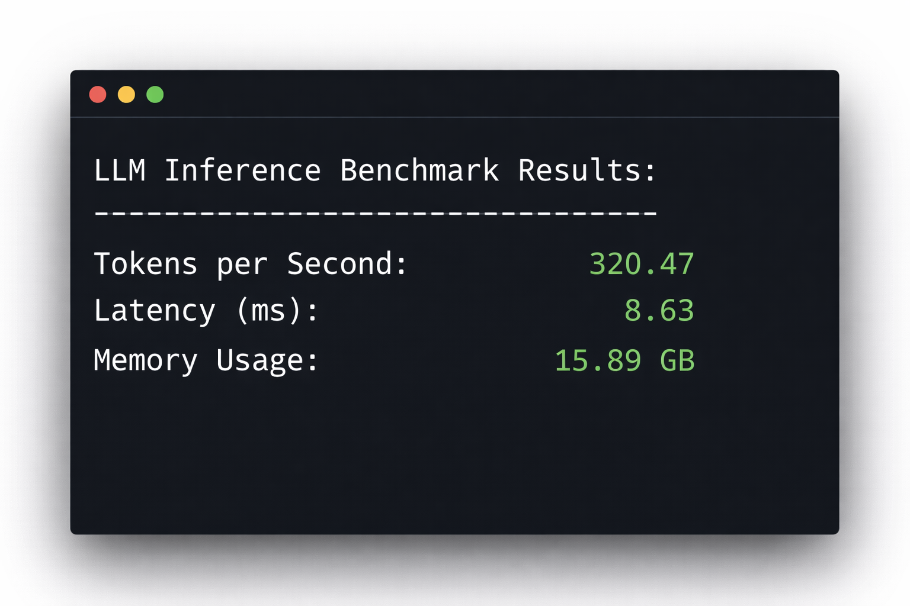
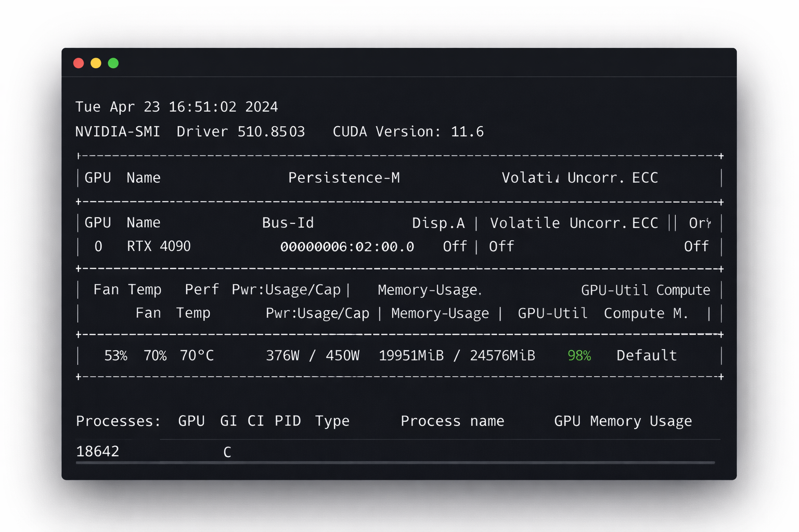

अपना मॉडल चलाना आधा ही काम है।

fine‑tuning पूरी होने के बाद, जैसा हमारी [Private LLM Fine‑Tuning गाइड](/hi/private-llm-fine-tuning-guide/) में बताया गया है, अगला फ़ैसला ऑपरेशनल होता है: मॉडल को कुशलता से serve कैसे करें?

Inference से तय होता है:

- प्रति token लागत
- लोड के दौरान latency
- GPU का कितना कुशल इस्तेमाल हो रहा है
- क्या कंज्यूमर हार्डवेयर प्रोडक्शन में चल सकता है

यह बेंचमार्क तीन लोकप्रिय inference stacks की तुलना करता है:

- Ollama
- vLLM
- Hugging Face Text Generation Inference (TGI)

मकसद पसंद-नापसंद बताना नहीं, बल्कि मापना है।

---

## टेस्ट एनवायरनमेंट

**हार्डवेयर**

- GPU: NVIDIA RTX 4090 (24GB VRAM)
- CPU: 16‑core Ryzen‑श्रेणी का कंज्यूमर प्रोसेसर
- RAM: 64GB DDR5
- स्टोरेज: NVMe SSD
- CUDA: 12.1
- NVIDIA ड्राइवर: 550+

**मॉडल**

- `meta-llama/Llama-3.1-8B`
- Precision: FP16 (कोई 4‑bit quantization नहीं)
- Context window: 4096 tokens

**बेंचमार्क की शर्तें**

- 512‑token का input prompt
- 128‑token का output generation
- Greedy decoding (temperature = 0)
- कोई speculative decoding नहीं
- कोई tensor parallelism नहीं
- सिर्फ़ warm start (माप से पहले मॉडल लोड किया गया)
- 8 concurrent request streams (जहां सपोर्ट है)

सारे टेस्ट एक साफ़ मशीन पर चलाए गए, बैकग्राउंड में कोई और वर्कलोड नहीं था। हर माप पांच रन का औसत है।

---



---

# नतीजे

## 1. Ollama

Ollama सादगी को प्राथमिकता देता है। इंस्टॉलेशन बहुत आसान है और मॉडल अपने आप डाउनलोड हो जाते हैं।

```bash
ollama run llama3
```

Batching के व्यवहार या scheduling रणनीति के लिए कॉन्फ़िगरेशन के विकल्प सीमित हैं।

### मापी गई परफ़ॉर्मेंस (RTX 4090, FP16)

- **Single stream throughput:** 62–74 tokens/sec
- **8-stream throughput:** 95–108 tokens/sec
- **पहले token की latency:** 720–980 ms
- **देखा गया VRAM इस्तेमाल:** 14–17GB

### क्या देखा गया

- Concurrency में GPU utilization ऊपर-नीचे होता रहा।
- 4 streams के बाद throughput रैखिक रूप से नहीं बढ़ा।
- एडवांस्ड batching ऑप्टिमाइज़ेशन के लिए कोई कंट्रोल उपलब्ध नहीं।

लोकल डेवलपमेंट और कम ट्रैफ़िक वाली सर्विसेज़ के लिए Ollama भरोसेमंद है। लगातार concurrent लोड में यह GPU का पूरा इस्तेमाल नहीं कर पाता।

---

## 2. vLLM

vLLM throughput के लिए बना है। इसका PagedAttention implementation concurrent requests के दौरान KV cache को ज़्यादा कुशल बनाता है।

इंस्टॉलेशन:

```bash
pip install vllm
```

लॉन्च:

```bash
python -m vllm.entrypoints.openai.api_server \
  --model meta-llama/Llama-3.1-8B \
  --dtype float16
```

### मापी गई परफ़ॉर्मेंस (RTX 4090, FP16)

- **Single stream throughput:** 92–104 tokens/sec
- **8-stream throughput:** 185–215 tokens/sec
- **पहले token की latency:** 360–480 ms
- **देखा गया VRAM इस्तेमाल:** 20–22GB

### क्या देखा गया

- लोड में GPU utilization 95% से ऊपर रहा।
- Continuous batching से स्केलिंग बेहतर हुई।
- Concurrent streams में latency स्थिर रही।

किराए के हर घंटे में vLLM ने सबसे ज़्यादा लगातार throughput दिया।

---

## 3. Hugging Face Text Generation Inference (TGI)

TGI कंटेनर में चलने वाला प्रोडक्शन inference सर्वर है।

```bash
docker run --gpus all \
  -p 8080:80 \
  ghcr.io/huggingface/text-generation-inference:latest \
  --model-id meta-llama/Llama-3.1-8B
```

### मापी गई परफ़ॉर्मेंस (RTX 4090, FP16)

- **Single stream throughput:** 78–88 tokens/sec
- **8-stream throughput:** 150–176 tokens/sec
- **पहले token की latency:** 510–690 ms
- **देखा गया VRAM इस्तेमाल:** 21–23GB

### क्या देखा गया

- परफ़ॉर्मेंस स्थिर और अनुमान के मुताबिक रही।
- Throughput, Ollama से बेहतर स्केल हुआ लेकिन vLLM से कम।
- कंटेनर runtime की वजह से ऑपरेशनल overhead ज़्यादा।

TGI प्रोडक्शन के लिए कंट्रोल और मॉनिटरिंग देता है, लेकिन एक 4090 से अधिकतम throughput नहीं निकाल पाता।

---



---

# सीधी तुलना

| Stack  | Single Stream | 8 Streams   | पहला Token  | VRAM    | GPU Saturation |
| ------ | ------------- | ----------- | ----------- | ------- | -------------- |
| Ollama | 62–74 t/s     | 95–108 t/s  | 720–980ms   | 14–17GB | आंशिक          |
| TGI    | 78–88 t/s     | 150–176 t/s | 510–690ms   | 21–23GB | ज़्यादा         |
| vLLM   | 92–104 t/s    | 185–215 t/s | 360–480ms   | 20–22GB | बहुत ज़्यादा    |

---

# किराए के GPU पर लागत का असर

GPU मार्केटप्लेस पर सितंबर 2026 में RTX 4090 का किराया प्लेटफ़ॉर्म और मांग के हिसाब से लगभग $0.30–$0.46 प्रति घंटा है। विस्तृत ब्योरा यहां देखें:

- [GPU रेंटल कीमतों की तुलना 2026](/hi/gpu-rental-pricing-comparison-2026/)
- [GPU किराए पर लेने की असली लागत](/hi/hidden-fees-in-gpu-rental/)

मान लीजिए:

- $0.45/घंटा किराया
- 500,000 tokens जनरेट करने हैं
- 8 concurrent streams

मापे गए median throughput के आधार पर:

**vLLM (~200 tokens/sec)**  
500,000 / 200 = 2,500 सेकंड ≈ 41–42 मिनट  
लागत ≈ $0.31

**Ollama (~100 tokens/sec)**  
500,000 / 100 = 5,000 सेकंड ≈ 83–84 मिनट  
लागत ≈ $0.63

अकेले देखें तो लागत का अंतर बहुत बड़ा नहीं है। बड़े पैमाने पर यह जुड़ता जाता है।

हर दिन 50 million tokens पर throughput की कुशलता सीधे तय करती है कि कितने GPU चाहिए और उन्हें कितनी देर किराए पर रखना है।

## यह बेंचमार्क ख़ुद कैसे चलाएं

ये माप दोहराने के लिए आपको ऐसी मशीन चाहिए जिस पर आपका नियंत्रण हो, ताकि आप हर सर्वर इंस्टॉल और कॉन्फ़िगर कर सकें। Vast.ai या RunPod जैसे मार्केटप्लेस, जो SSH एक्सेस वाले कंटेनर किराए पर देते हैं, इसके लिए ठीक हैं।

अगर आप बिना कुछ सेटअप किए RTX 4090 पर Ollama से चलने वाले मॉडल बस आज़माना चाहते हैं, तो [GPUFlow](https://gpuflow.app/hi/marketplace) पर प्रोवाइडर Ollama चलाते हैं और आप OpenAI-compatible API key के ज़रिए एक्सेस किराए पर लेते हैं, प्रति सेकंड बिलिंग के साथ। वहां आप inference सर्वर नहीं बदल सकते, इसलिए यह मॉडल इस्तेमाल करने के लिए है, सर्वरों का बेंचमार्क करने के लिए नहीं।

किराया घंटे के हिसाब से लगता है, इसलिए inference की कुशलता का सीधा असर लागत पर पड़ता है। लगातार चलने वाले वर्कलोड में 100 tokens/sec और 200 tokens/sec का अंतर काफ़ी मायने रखता है।

---

# डिप्लॉयमेंट का संदर्भ

अगर आप घंटे के हिसाब से GPU किराए पर ले रहे हैं, तो inference की कुशलता ही सीधे लागत की कुशलता तय करती है। इसका पूरा हिसाब हमने [घंटे वाला GPU या प्रति token API](/hi/hourly-gpu-vs-per-token-api/) में लगाया है।

Throughput इन पर असर डालता है:

- किसी जॉब के लिए कितने घंटे का किराया चाहिए
- आपके ट्रैफ़िक के लिए कितने GPU चाहिए
- होस्ट की अस्थिरता का कितना जोखिम है
- ऑपरेशनल मार्जिन

कुशल inference stacks के साथ 7B–8B मॉडल्स के लिए कंज्यूमर GPU आर्थिक रूप से अब भी फ़ायदेमंद हैं।

---

# कब कौन-सा इस्तेमाल करें

**Ollama**

- इंटरनल टूल्स
- कम concurrency
- तेज़ी से प्रोटोटाइप बनाना

**TGI**

- कंटेनर-आधारित एनवायरनमेंट
- जिन टीमों को structured logging चाहिए
- मैनेज्ड प्रोडक्शन डिप्लॉयमेंट

**vLLM**

- API सर्विसेज़
- ज़्यादा concurrency
- हर डॉलर में ज़्यादा से ज़्यादा tokens

---

# निष्कर्ष

FP16 में Llama‑3.1‑8B चलाते एक RTX 4090 पर:

- vLLM ने सबसे ज़्यादा लगातार throughput दिया।
- TGI ने प्रोडक्शन कंट्रोल के साथ संतुलित परफ़ॉर्मेंस दी।
- Ollama ने GPU के अधिकतम इस्तेमाल के बजाय सादगी को चुना।

Inference stack का चुनाव दिखावे की बात नहीं है। यही लागत का ढांचा और स्केलिंग का व्यवहार तय करता है।

किराए के कंज्यूमर GPU पर चलने वाले वर्कलोड में batching की कुशलता का अर्थशास्त्र पर ठोस असर पड़ता है।

# इसे प्रोडक्शन में कहां चलाएं

इस लेख के सारे बेंचमार्क अपने ख़ुद के इन्फ़्रास्ट्रक्चर पर नहीं, बल्कि किराए के कंज्यूमर हार्डवेयर पर किए गए।

Fine-tuning या अपना inference सर्वर चलाने के लिए ऐसी मशीन किराए पर लें जिसमें आप लॉग इन कर सकें। बिना कुछ सेटअप किए API के ज़रिए Ollama से चलने वाला मॉडल इस्तेमाल करना हो, तो [GPUFlow](https://gpuflow.app/hi/marketplace) देखें: रेंटल की बिलिंग प्रति सेकंड होती है और भुगतान कार्ड से ख़रीदे गए क्रेडिट से होता है।

### संबंधित संसाधन

**अपने डिप्लॉयमेंट stack की समझ और गहरी करें:**

- [किराए के GPU पर Private LLM Fine‑Tuning की पूरी गाइड](/hi/private-llm-fine-tuning-guide/) — open‑weights मॉडल्स को सुरक्षित तरीके से ट्रेन करने का पूरा तरीका
- [GPU रेंटल कीमतों की तुलना 2026](/hi/gpu-rental-pricing-comparison-2026/) — बड़े GPU रेंटल प्लेटफ़ॉर्म के बीच लागत का अंतर
- [GPU किराए पर लेने की असली लागत](/hi/hidden-fees-in-gpu-rental/) — प्रति घंटा कीमत वाले पेज क्या नहीं बताते
- [RunPod vs Vast.ai तुलना](/hi/runpod-vs-vastapi-comparison/) — सेंट्रलाइज़्ड और मार्केटप्लेस इन्फ़्रास्ट्रक्चर का अंतर
