# क्रिप्टोकरेंसी के साथ GPU किराये पर लेने की पूरी गाइड

> **अंतिम अपडेट:** 11 फरवरी, 2026 | **पढ़ने का समय:** 16 मिनट

क्रिप्टोकरेंसी भुगतान के साथ GPU कंप्यूटिंग पावर किराये पर लेना उन दो तकनीकों को जोड़ता है जो विकेंद्रीकरण (decentralization) और बिचौलियों को कम करने को महत्व देती हैं। यह गाइड पूरी प्रक्रिया से गुजरेगी—एक क्रिप्टो-फ्रेंडली प्रदाता चुनने से लेकर ब्लॉकचेन-आधारित भुगतान का उपयोग करके अपना पहला रेंटल पूरा करने तक।

AWS, Azure, या Google Cloud के माध्यम से पारंपरिक GPU रेंटल के लिए क्रेडिट कार्ड, कॉर्पोरेट खाते और पहचान सत्यापन की आवश्यकता होती है। क्रिप्टोकरेंसी विकल्प इन बाधाओं को समाप्त करता है और अक्सर पीयर-टू-पीयर (P2P) मार्केटप्लेस और कम प्लेटफॉर्म फीस के माध्यम से लागत को कम करता है।

---

## क्रिप्टोकरेंसी के साथ GPU किराये पर क्यों लें?

क्रिप्टोकरेंसी भुगतान और GPU रेंटल का मिलन विकेंद्रीकरण के लिए वैचारिक प्राथमिकता से परे कई व्यावहारिक उद्देश्यों को पूरा करता है।

**गोपनीयता और कम सत्यापन आवश्यकताएं।** कई क्रिप्टो-नेतेव (crypto-native) GPU प्लेटफॉर्म अनिवार्य KYC (अपने ग्राहक को जानें) सत्यापन के बिना काम करते हैं। आप केवल वॉलेट एड्रेस और क्रिप्टोकरेंसी बैलेंस का उपयोग करके कंप्यूटिंग संसाधन किराये पर ले सकते हैं। यह गोपनीयता के प्रति जागरूक उपयोगकर्ताओं, सीमित बैंकिंग बुनियादी ढांचे वाले क्षेत्रों के व्यक्तियों और उन डेवलपर्स को आकर्षित करता है जो छद्म नाम (pseudonymous) से लेनदेन करना पसंद करते हैं।

**कम प्लेटफॉर्म फीस का मतलब बेहतर मूल्य निर्धारण है।** क्रेडिट कार्ड और भुगतान गेटवे के माध्यम से पारंपरिक भुगतान प्रसंस्करण में 2.5-3.5% प्लस निश्चित शुल्क लगता है। क्रिप्टोकरेंसी लेनदेन मर्चेंट प्रोसेसिंग फीस को पूरी तरह से समाप्त कर देते हैं—आप केवल ब्लॉकचेन नेटवर्क फीस का भुगतान करते हैं, जो आमतौर पर राशि की परवाह किए बिना $0.10-2.00 प्रति लेनदेन होती है। प्लेटफॉर्म इन बचतों को कम प्लेटफॉर्म शुल्क के माध्यम से उपयोगकर्ताओं तक पहुंचा सकते हैं।

**स्मार्ट कॉन्ट्रैक्ट एस्क्रो प्रतिपक्ष जोखिम (counterparty risk) को समाप्त करता है।** पारंपरिक GPU मार्केटप्लेस फंड को केंद्रीय रूप से रखते हैं, जिसके लिए प्लेटफॉर्म ऑपरेटरों पर भरोसा करने की आवश्यकता होती है। ब्लॉकचेन-आधारित एस्क्रो भुगतान को स्मार्ट कॉन्ट्रैक्ट्स में लॉक कर देता है जो रेंटल पूरा होने पर स्वचालित रूप से फंड जारी करते हैं। कोई भी पक्ष एस्क्रो किए गए फंड को एकतरफा एक्सेस नहीं कर सकता है, जिससे केंद्रीय प्राधिकरण पर भरोसा करने की आवश्यकता समाप्त हो जाती है।

**मुद्रा रूपांतरण के बिना अंतर्राष्ट्रीय पहुंच।** क्रिप्टोकरेंसी सीमाओं के पार समान रूप से संचालित होती है। नाइजीरिया का एक डेवलपर सिंगापुर या ब्राजील के किसी व्यक्ति के समान मूल्य निर्धारण और भुगतान प्रक्रिया का उपयोग कर सकता है। कोई मुद्रा विनिमय शुल्क नहीं, कोई क्षेत्रीय भुगतान विधि प्रतिबंध नहीं, कोई विलंबित अंतर्राष्ट्रीय हस्तांतरण नहीं।

**तत्काल पहुंच और निपटान।** क्रिप्टोकरेंसी भुगतान 2-5 व्यावसायिक दिन के ACH या वायर ट्रांसफर समयसीमा के बजाय मिनटों में कंफर्म हो जाते हैं। स्मार्ट कॉन्ट्रैक्ट एस्क्रो ब्लॉकचेन पुष्टि पूरी होते ही तत्काल GPU एक्सेस को सक्षम बनाता है।

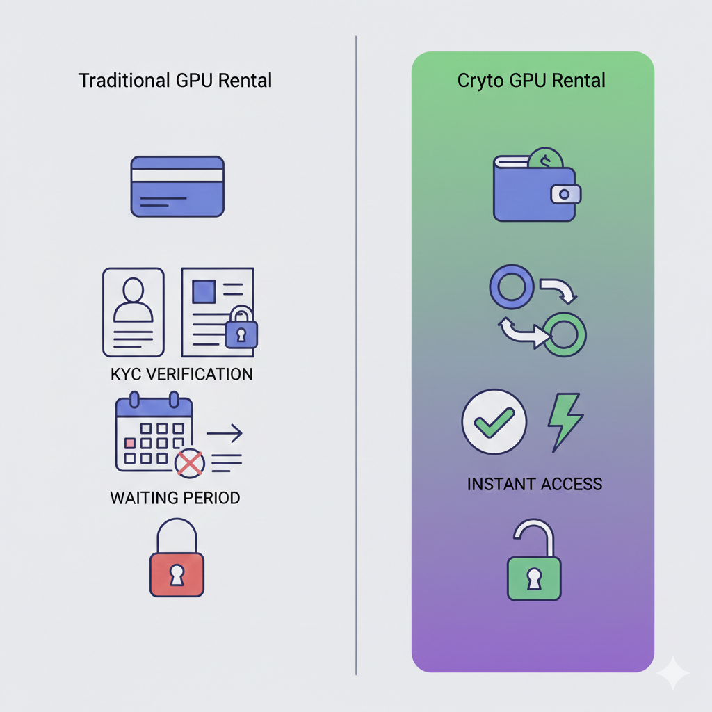

---

## क्रिप्टोकरेंसी-फ्रेंडली GPU प्रदाता

GPU रेंटल बाजार में मूल क्रिप्टोकरेंसी समर्थन वाले कई प्लेटफॉर्म शामिल हैं। प्रत्येक क्रिप्टो एकीकरण के लिए एक अलग दृष्टिकोण अपनाता है और अलग-अलग उपयोगकर्ता प्राथमिकताओं को पूरा करता है।

### GPUFlow

GPUFlow ने अपना मार्केटप्लेस विशेष रूप से क्रिप्टोकरेंसी भुगतान और ब्लॉकचेन-सत्यापित लेनदेन के आसपास बनाया है। प्लेटफॉर्म पूरी तरह से कम शुल्क वाले लेनदेन के लिए पॉलीगॉन (Polygon) नेटवर्क का उपयोग करते हुए स्मार्ट कॉन्ट्रैक्ट एस्क्रो पर संचालित होता है।

**भुगतान विधियां:** एथेरियम (ETH), पॉलीगॉन (MATIC), सोलाना (SOL), USDC, USDT  
**KYC आवश्यकता:** कोई नहीं  
**एस्क्रो तंत्र:** स्वचालित रिलीज के साथ पॉलीगॉन स्मार्ट कॉन्ट्रैक्ट्स  
**प्लेटफॉर्म शुल्क:** 10-15%  
**सामान्य GPU मूल्य निर्धारण:** RTX 4090 $0.50-0.80/घंटा, A100 $1.20-1.80/घंटा। सभी प्रदाताओं की विस्तृत तुलना के लिए, हमारी [GPU किराये की कीमत तुलना 2026](/hi/gpu-rental-pricing-comparison-2026/) देखें।

GPUFlow तत्काल पहुंच को प्राथमिकता देता है। यह प्लेटफॉर्म उन उपयोगकर्ताओं को लक्षित करता है जो गोपनीयता को महत्व देते हैं, पहचान सत्यापन से बचना चाहते हैं, या ब्लॉकचेन-नेतेव वर्कफ़्लो पसंद करते हैं। सेटअप में लगभग 30 सेकंड लगते हैं—वॉलेट कनेक्ट करें, क्रिप्टोकरेंसी जमा करें, GPU चुनें, और वेब टर्मिनल के माध्यम से एक्सेस करें।

रेंटल शुरू होने पर स्मार्ट कॉन्ट्रैक्ट एस्क्रो सिस्टम आपके भुगतान को लॉक कर देता है। सफल समापन पर, फंड स्वचालित रूप से GPU प्रदाता को जारी हो जाते हैं। यदि सेवा विनिर्देशों (specifications) को पूरा करने में विफल रहती है, तो विवाद समाधान समर्थन टिकटों के बजाय अनुबंध मापदंडों के माध्यम से होता है।

**इसके लिए सर्वश्रेष्ठ:** गोपनीयता के प्रति जागरूक उपयोगकर्ता, क्रिप्टो-नेतेव डेवलपर्स, KYC आवश्यकताओं से बचने वाला कोई भी व्यक्ति, कम प्लेटफॉर्म शुल्क को प्राथमिकता देने वाले उपयोगकर्ता।

### Vast.ai

Vast.ai मुख्य रूप से पारंपरिक भुगतान विधियों के साथ काम करता है लेकिन तीसरे पक्ष के भुगतान प्रोसेसर के माध्यम से क्रिप्टोकरेंसी स्वीकार करता है। एकीकरण GPUFlow की तरह निर्बाध नहीं है लेकिन एक बड़े प्रदाता नेटवर्क तक क्रिप्टो पहुंच प्रदान करता है।

**भुगतान विधियां:** बिटकॉइन (BTC), एथेरियम (ETH), और CoinPayments के माध्यम से 15+ ऑल्टकॉइन्स  
**KYC आवश्यकता:** बुनियादी रेंटल के लिए कोई नहीं, प्रदाता पेआउट (payout) के लिए आवश्यक हो सकता है  
**एस्क्रो तंत्र:** प्लेटफॉर्म-held, ब्लॉकचेन-आधारित नहीं  
**प्लेटफॉर्म शुल्क:** ~20%  
**विशिष्ट GPU मूल्य निर्धारण:** RTX 4090 $0.29-0.78/घंटा पर, A100 $0.84-1.49/घंटा पर

Vast.ai अपने पीयर-टू-पीयर मार्केटप्लेस में उपलब्ध GPUs का सबसे बड़ा चयन प्रदान करता है। क्रिप्टोकरेंसी भुगतान एकीकरण प्राथमिक डिजाइन सुविधा के बजाय क्रेडिट कार्ड के विकल्प के रूप में कार्य करता है। फंड स्मार्ट कॉन्ट्रैक्ट्स के बजाय प्लेटफॉर्म द्वारा रखे जाते हैं।

**इसके लिए सर्वश्रेष्ठ:** GPU चयन और सबसे कम पूर्ण मूल्य निर्धारण को प्राथमिकता देने वाले उपयोगकर्ता, जो प्लेटफॉर्म-held एस्क्रो के साथ सहज हैं।

### RunPod

RunPod ने 2025 में भुगतान गेटवे प्रदाताओं के साथ एकीकरण के माध्यम से क्रिप्टोकरेंसी भुगतान विकल्प जोड़े। प्लेटफॉर्म मुख्य रूप से पारंपरिक तरीकों से भुगतान करने वाले उपयोगकर्ताओं की सेवा करता है लेकिन क्रिप्टो उपयोगकर्ताओं को समायोजित करता है।

**भुगतान विधियां:** बिटकॉइन (BTC), एथेरियम (ETH), Coinbase Commerce के माध्यम से USDC  
**KYC आवश्यकता:** वैकल्पिक—केवल कुछ खाता सीमाओं के लिए आवश्यक  
**एस्क्रो तंत्र:** प्लेटफॉर्म-held क्रेडिट सिस्टम  
**प्लेटफॉर्म शुल्क:** ~20%  
**विशिष्ट GPU मूल्य निर्धारण:** RTX 4090 $0.59/घंटा पर, A100 $1.39-1.49/घंटा पर

RunPod क्रिप्टोकरेंसी भुगतान को प्लेटफॉर्म क्रेडिट में परिवर्तित करता है जो प्रीपेड बैलेंस की तरह कार्य करते हैं। प्रक्रिया में एक अतिरिक्त रूपांतरण चरण शामिल है लेकिन यह RunPod के प्रबंधित बुनियादी ढांचे और पूर्व-कॉन्फ़िगर किए गए टेम्प्लेट तक पहुंच प्रदान करता है।

**इसके लिए सर्वश्रेष्ठ:** वे उपयोगकर्ता जो क्रिप्टोकरेंसी से भुगतान करते हुए RunPod की विश्वसनीयता और टेम्प्लेट चाहते हैं।

### मार्केटप्लेस पर व्यक्तिगत प्रदाता

Massed Compute या व्यक्तिगत Discord समुदायों जैसे मार्केटप्लेस पर कुछ GPU प्रदाता प्लेटफॉर्म के बुनियादी ढांचे के बाहर प्रत्यक्ष क्रिप्टोकरेंसी भुगतान स्वीकार करते हैं। यह दृष्टिकोण अधिकतम लचीलापन प्रदान करता है लेकिन अधिक विश्वास मूल्यांकन (trust evaluation) की आवश्यकता होती है।

**भुगतान विधियां:** प्रदाता द्वारा भिन्न होती हैं—आमतौर पर BTC, ETH, स्टेबलकॉइन्स  
**KYC आवश्यकता:** प्रदाता-निर्भर  
**एस्क्रो तंत्र:** कोई नहीं, या तीसरे पक्ष की एस्क्रो सेवाएं  
**प्लेटफॉर्म शुल्क:** 0% (प्रत्यक्ष बातचीत)  
**मूल्य निर्धारण:** व्यक्तिगत रूप से बातचीत

प्रत्यक्ष क्रिप्टोकरेंसी व्यवस्था प्लेटफॉर्म शुल्क को पूरी तरह से समाप्त कर देती है लेकिन इसके लिए प्रदाताओं को स्वतंत्र रूप से जांचने की आवश्यकता होती है। प्रतिष्ठा प्रणाली, सामुदायिक प्रतिक्रिया, और Particl या OpenBazaar जैसी एस्क्रो सेवाएं जोखिम को कम कर सकती हैं।

**इसके लिए सर्वश्रेष्ठ:** अनुभवी उपयोगकर्ता जो प्रतिपक्ष जोखिम का मूल्यांकन करने में सहज हैं, वे जो प्रत्यक्ष बातचीत के माध्यम से सबसे कम मूल्य निर्धारण चाहते हैं।

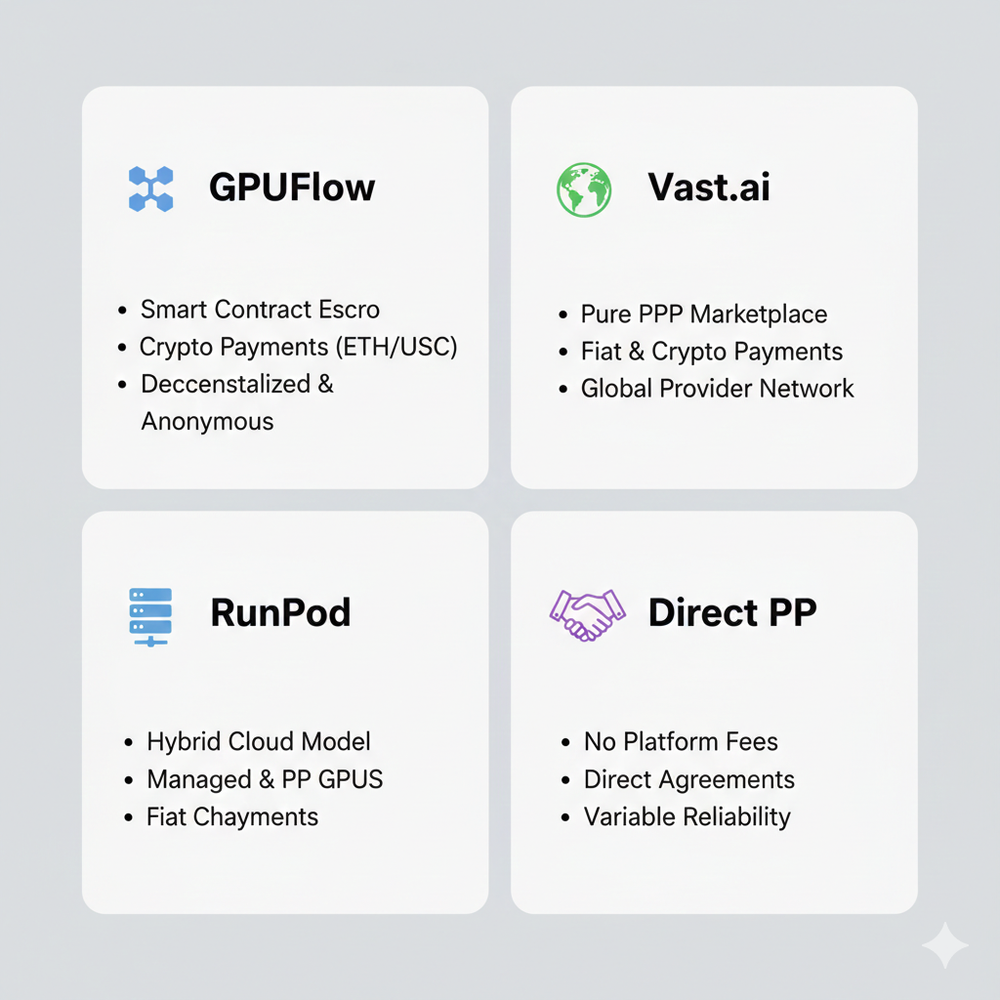

---

## स्वीकार्य क्रिप्टोकरेंसी और भुगतान नेटवर्क

GPU रेंटल प्लेटफॉर्म लेनदेन लागत, निपटान गति और उपयोगकर्ता की मांग के आधार पर विभिन्न क्रिप्टोकरेंसी स्वीकार करते हैं। नेटवर्क विशेषताओं को समझने से भुगतान लागत को अनुकूलित करने में मदद मिलती है।

### एथेरियम (ETH)

उच्च लेनदेन शुल्क के बावजूद GPU रेंटल के लिए एथेरियम सबसे व्यापक रूप से स्वीकार्य क्रिप्टोकरेंसी बना हुआ है। लेयर-2 स्केलिंग समाधानों ने 2024 से लागत को काफी कम कर दिया है।

**लेनदेन लागत:** एथेरियम मेननेट पर $0.50-3.00, Polygon/Arbitrum पर $0.01-0.10  
**पुष्टिकरण समय:** मेननेट पर 15-60 सेकंड, L2 पर 2-5 सेकंड  
**स्वीकृति:** क्रिप्टो-फ्रेंडली प्लेटफॉर्म के बीच सार्वभौमिक

DeFi और स्मार्ट कॉन्ट्रैक्ट्स में एथेरियम का प्रभुत्व इसे एस्क्रो-आधारित रेंटल सिस्टम के लिए स्वाभाविक विकल्प बनाता है। GPUFlow जैसे प्लेटफॉर्म एथेरियम संगतता बनाए रखते हुए गैस फीस को कम करने के लिए पॉलीगॉन (एक एथेरियम साइडचेन) पर कॉन्ट्रैक्ट्स तैनात करते हैं।

### बिटकॉइन (BTC)

बिटकॉइन स्वीकृति उन उपयोगकर्ताओं की सेवा करती है जो BTC रखते हैं और अन्य क्रिप्टोकरेंसी में परिवर्तित नहीं करना चाहते हैं। लेनदेन शुल्क और पुष्टिकरण समय इसे लगातार छोटे रेंटल के लिए कम व्यावहारिक बनाते हैं।

**लेनदेन लागत:** नेटवर्क की भीड़ के आधार पर $1-10  
**पुष्टिकरण समय:** सुरक्षित पुष्टि के लिए 10-60 मिनट  
**स्वीकृति:** अधिकांश प्लेटफॉर्म पर भुगतान प्रोसेसर के माध्यम से उपलब्ध

बिटकॉइन बड़े प्रीपेड क्रेडिट डिपॉजिट या विस्तारित रेंटल अवधि के लिए अच्छा काम करता है जहां लेनदेन शुल्क रेंटल लागत के सापेक्ष नगण्य हो जाते हैं। $20 से कम के प्रति घंटा रेंटल के लिए, वैकल्पिक क्रिप्टोकरेंसी बेहतर अर्थशास्त्र प्रदान करती हैं।

### स्टेबलकॉइन्स (USDC, USDT, DAI)

अमेरिकी डॉलर से जुड़े स्टेबलकॉइन्स रेंटल अवधि के दौरान क्रिप्टोकरेंसी मूल्य की अस्थिरता को समाप्त करते हैं। अधिकांश क्रिप्टो-स्वीकार्य GPU प्लेटफॉर्म इस पूर्वानुमेयता के लिए स्टेबलकॉइन भुगतान पसंद करते हैं।

**लेनदेन लागत:** नेटवर्क (Polygon, Solana, या Ethereum) के आधार पर $0.01-0.50  
**पुष्टिकरण समय:** नेटवर्क के आधार पर 2-30 सेकंड  
**स्वीकृति:** तेजी से बढ़ रही है, अब अधिकांश क्रिप्टो प्लेटफॉर्म द्वारा समर्थित

$100 USDC जमा करने वाला डेवलपर जानता है कि क्रिप्टोकरेंसी बाजार की गतिविधियों की परवाह किए बिना वह कितने GPU घंटे प्रदान करता है। स्टेबलकॉइन भुगतान प्राप्त करते समय प्रदाता भी अस्थिरता जोखिम से बचते हैं।

### सोलाना (SOL)

सोलाना की कम फीस और तेज़ पुष्टि इसे GPU रेंटल भुगतान के लिए तेजी से लोकप्रिय बना रही है, विशेष रूप से GPUFlow जैसे प्लेटफॉर्म पर जो उपयोगकर्ता अनुभव को प्राथमिकता देते हैं।

**लेनदेन लागत:** $0.0001-0.001 (प्रभावी रूप से मुफ़्त)  
**पुष्टिकरण समय:** 400-800 मिलीसेकंड  
**स्वीकृति:** GPUFlow और चुनिंदा प्लेटफॉर्म

सोलाना का लगभग-तत्काल निपटान और नगण्य शुल्क इसे अल्पकालिक GPU रेंटल के लिए आदर्श बनाते हैं जहां बार-बार शुरू/बंद करने के चक्र अन्य नेटवर्क पर लेनदेन लागत जमा करेंगे।

### पॉलीगॉन (MATIC)

पॉलीगॉन कई GPU रेंटल स्मार्ट कॉन्ट्रैक्ट्स के लिए प्राथमिक नेटवर्क के रूप में कार्य करता है, जो एथेरियम इकोसिस्टम संगतता के साथ कम फीस को संतुलित करता है।

**लेनदेन लागत:** $0.001-0.05  
**पुष्टिकरण समय:** 2-5 सेकंड  
**स्वीकृति:** GPUFlow प्राथमिक नेटवर्क, अन्य प्लेटफॉर्म पर उपलब्ध

एथेरियम साइडचेन के रूप में पॉलीगॉन की स्थिति एथेरियम टूल से परिचित डेवलपर्स को नाटकीय रूप से कम लेनदेन लागत का आनंद लेते हुए नई प्रणालियों को सीखे बिना रेंटल कॉन्ट्रैक्ट्स के साथ बातचीत करने की अनुमति देती है।

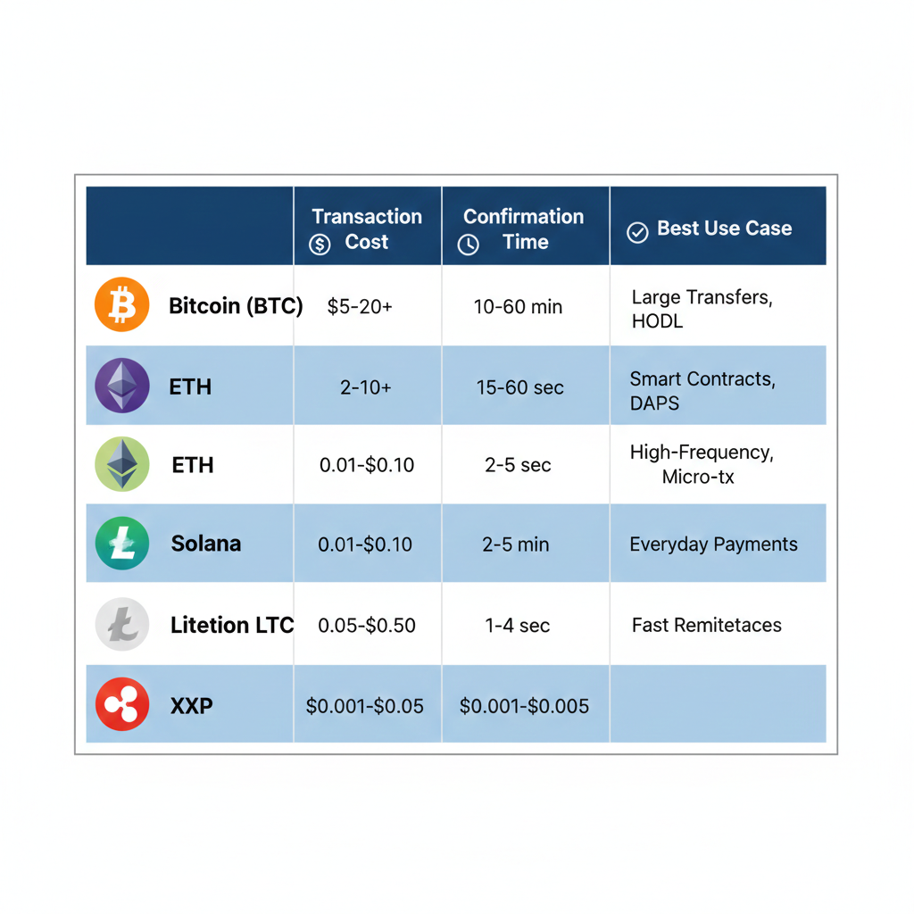

## स्मार्ट कॉन्ट्रैक्ट एस्क्रो (Escrow) कैसे काम करता है

पारंपरिक एस्क्रो (escrow) के लिए फंड रखने और विवादों में मध्यस्थता करने के लिए किसी तीसरे पक्ष पर भरोसा करने की आवश्यकता होती है। स्मार्ट कॉन्ट्रैक्ट एस्क्रो कोड के माध्यम से इस मध्यस्थ को समाप्त कर देता है जो स्वचालित रूप से समझौतों को लागू करता है।

### पारंपरिक एस्क्रो की समस्या

जब आप पारंपरिक प्लेटफॉर्म के माध्यम से GPU किराये पर लेते हैं, तो आप प्लेटफॉर्म ऑपरेटर के पास फंड जमा करते हैं। प्लेटफॉर्म वादा करता है:

- रेंटल के दौरान फंड को सुरक्षित रखना
- सफल सेवा वितरण के बाद ही प्रदाताओं को भुगतान करना
- सेवा विफल होने पर आपको रिफंड (refund) करना
- निष्पक्ष रूप से विवादों में मध्यस्थता करना

इस मॉडल के लिए फंड की कस्टडी (custody) के साथ प्लेटफॉर्म ऑपरेटरों पर भरोसा करने की आवश्यकता होती है। प्लेटफॉर्म का दिवालिया होना, सुरक्षा उल्लंघन, या नीति परिवर्तन आपकी जमा राशि को खतरे में डाल सकते हैं। विवाद समाधान प्लेटफॉर्म समर्थन की प्रतिक्रिया और निष्पक्षता पर निर्भर करता है।

### स्मार्ट कॉन्ट्रैक्ट का विकल्प

ब्लॉकचेन-आधारित एस्क्रो प्लेटफॉर्म कस्टडी को पब्लिक ब्लॉकचेन पर तैनात निष्पादन योग्य कोड (executable code) से बदल देता है। स्मार्ट कॉन्ट्रैक्ट एक क्रिप्टोग्राफ़िक पते में फंड रखता है जिसे कोई भी पक्ष एकतरफा नियंत्रित नहीं कर सकता है।

**जब आप GPU रेंटल शुरू करते हैं:**

1. आप अपने वॉलेट से एक विशिष्ट राशि ट्रांसफर करने के लिए स्मार्ट कॉन्ट्रैक्ट को अप्रूव (approve) करते हैं
2. कॉन्ट्रैक्ट इन फंडों को एस्क्रो में लॉक कर देता है, जो ऑन-चेन (on-chain) देखा जा सकता है लेकिन किसी भी पक्ष के लिए अप्राप्य है
3. कॉन्ट्रैक्ट रेंटल मापदंडों को रिकॉर्ड करता है: अवधि, GPU विनिर्देश, और शुरू होने का समय
4. प्रदाता कंफर्म एस्क्रो देखता है और GPU एक्सेस प्रदान करता है

**जब रेंटल सफलतापूर्वक पूरा होता है:**

1. रेंटल अवधि समाप्त हो जाती है या आप मैन्युअल रूप से सत्र समाप्त करते हैं
2. कॉन्ट्रैक्ट वास्तविक उपयोग समय के आधार पर कुल लागत की गणना करता है
3. कॉन्ट्रैक्ट स्वचालित रूप से प्रदाता के वॉलेट में भुगतान ट्रांसफर करता है
4. कोई भी अप्रयुक्त एस्क्रो आपके वॉलेट में वापस आ जाता है
5. दोनों ट्रांसफर परमाणु रूप (atomically) से निष्पादित होते हैं—या तो दोनों सफल होते हैं या कोई नहीं

**यदि सेवा विनिर्देशों को पूरा करने में विफल रहती है:**

1. आप या प्रदाता कॉन्ट्रैक्ट के भीतर विवाद शुरू कर सकते हैं
2. कॉन्ट्रैक्ट वस्तुनिष्ठ मानदंडों (objective criteria) की जांच करता है: रेंटल अवधि, कनेक्शन लॉग, अपटाइम मेट्रिक्स
3. पूर्वनिर्धारित नियम साक्ष्य के आधार पर फंड वितरण निर्धारित करते हैं
4. व्यक्तिपरक विवादों के लिए, कॉन्ट्रैक्ट्स में DAO गवर्नेंस या मध्यस्थता ओरेकल शामिल हो सकते हैं

### प्लेटफॉर्म-held एस्क्रो पर लाभ

**पारदर्शिता (Transparency):** सभी एस्क्रो पते और कॉन्ट्रैक्ट कोड ब्लॉकचेन एक्सप्लोरर पर सार्वजनिक रूप से दिखाई देते हैं। आप सत्यापित कर सकते हैं कि आपके फंड प्लेटफॉर्म बैलेंस डिस्प्ले पर भरोसा करने के बजाय कॉन्ट्रैक्ट में लॉक हैं।

**सेंसरशिप प्रतिरोध:** स्मार्ट कॉन्ट्रैक्ट्स कोड तर्क (logic) के आधार पर निष्पादित होते हैं, प्लेटफॉर्म के नीतिगत निर्णयों पर नहीं। प्लेटफॉर्म फंड फ्रीज नहीं कर सकते, भुगतान शर्तों को पूर्वव्यापी रूप से नहीं बदल सकते, या निकासी से इनकार नहीं कर सकते।

**स्वचालित निष्पादन:** शर्तें पूरी होने पर भुगतान जारी करना स्वचालित रूप से होता है। प्लेटफॉर्म प्रोसेसिंग के लिए कोई प्रतीक्षा नहीं, नियमित लेनदेन के लिए किसी समर्थन टिकट की आवश्यकता नहीं।

**कम प्रतिपक्ष जोखिम:** न तो प्लेटफॉर्म ऑपरेटर, न ही GPU प्रदाता, और न ही किराएदार एस्क्रो किए गए फंड को एकतरफा एक्सेस कर सकते हैं। कोड प्रवर्तन मानवीय अभिनेताओं में विश्वास की जगह लेता है।

### सीमाएं और विचार

स्मार्ट कॉन्ट्रैक्ट एस्क्रो सही नहीं है। कोड बग कमजोरियां पैदा कर सकते हैं—ब्लॉकचेन इतिहास में कॉन्ट्रैक्ट कारनामों (exploits) के कई उदाहरण शामिल हैं। GPUFlow जैसे स्थापित प्लेटफॉर्म ऑडिट किए गए कॉन्ट्रैक्ट्स और बग बाउंटी कार्यक्रमों के माध्यम से इसे कम करते हैं।

स्मार्ट कॉन्ट्रैक्ट्स में विवाद समाधान के लिए पूर्वनिर्धारित वस्तुनिष्ठ मानदंडों की आवश्यकता होती है। व्यक्तिपरक सेवा गुणवत्ता विवादों को अकेले कोड के माध्यम से न्याय करना चुनौतीपूर्ण बना रहता है। कुछ प्लेटफॉर्म जटिल मामलों के लिए वैकल्पिक मानव मध्यस्थता के साथ स्मार्ट कॉन्ट्रैक्ट एस्क्रो को जोड़ते हैं।

ब्लॉकचेन की अपरिवर्तनीयता (immutability) का मतलब है कि लेनदेन की त्रुटियों को उल्टा नहीं किया जा सकता है। गलत पतों पर फंड भेजना या दुर्भावनापूर्ण कॉन्ट्रैक्ट्स को मंजूरी देने से स्थायी नुकसान हो सकता है। यह ग्राहक सेवा वसूली विकल्पों वाले पारंपरिक प्लेटफॉर्म की तुलना में उपयोगकर्ताओं पर अधिक जिम्मेदारी डालता है।

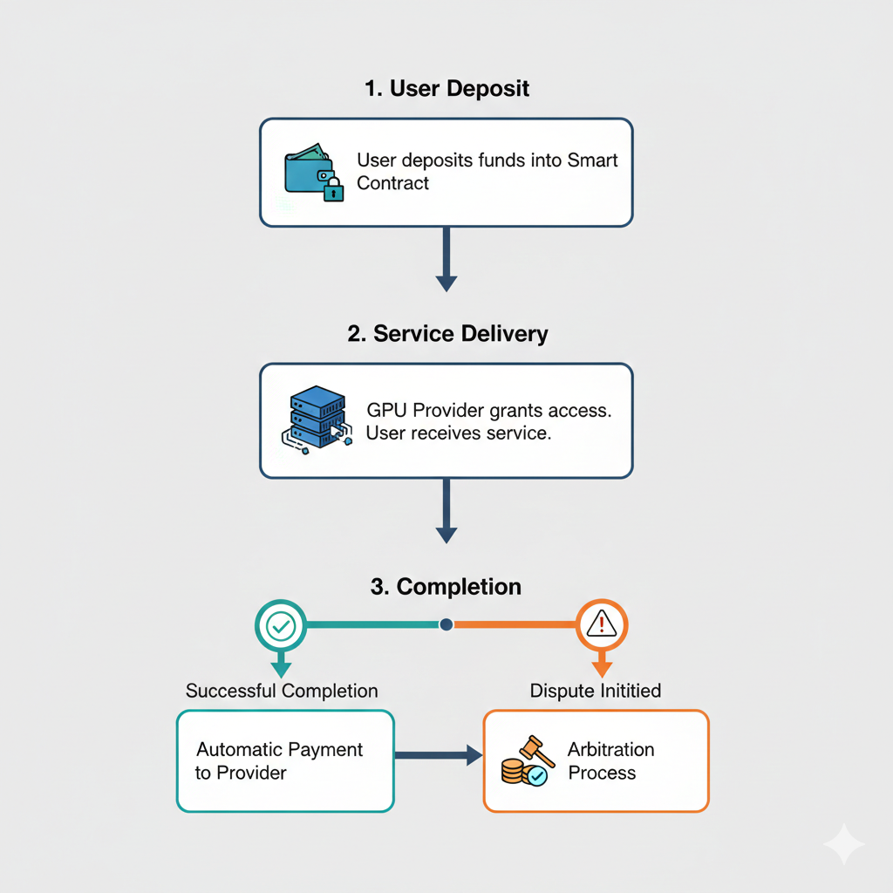

---

## चरण-दर-चरण: आपका पहला क्रिप्टोकरेंसी GPU रेंटल

यह अनुभाग वॉलेट सेटअप से लेकर सत्र समाप्ति तक, क्रिप्टोकरेंसी भुगतान का उपयोग करके GPU किराये पर लेने की पूरी प्रक्रिया से गुजरता है।

### पूर्वापेक्षाएँ (Prerequisites)

शुरू करने से पहले, आपको चाहिए:

**एक क्रिप्टोकरेंसी वॉलेट।** MetaMask एथेरियम और पॉलीगॉन नेटवर्क के लिए सबसे व्यापक रूप से संगत विकल्प बना हुआ है। वैकल्पिक वॉलेट में Rainbow, Coinbase Wallet, या Ledger जैसे हार्डवेयर वॉलेट शामिल हैं। सोलाना-आधारित प्लेटफॉर्म के लिए, Phantom वॉलेट सबसे अच्छा अनुभव प्रदान करता है।

**क्रिप्टोकरेंसी बैलेंस।** Coinbase, Kraken, या Binance जैसे एक्सचेंजों के माध्यम से क्रिप्टोकरेंसी प्राप्त करें। आपके पहले रेंटल के लिए, ETH, MATIC, या स्टेबलकॉइन्स में $20-50 परीक्षण के लिए कई घंटों का GPU एक्सेस प्रदान करता है।

**बुनियादी ब्लॉकचेन ज्ञान।** वॉलेट पते, लेनदेन की पुष्टि और गैस फीस जैसी अवधारणाओं को समझें। आवश्यक तकनीकी गहराई न्यूनतम है—किसी भी नई भुगतान प्रणाली को सीखने के बराबर।

### चरण 1: अपना वॉलेट सेट करें

यदि आपके पास पहले से कोई क्रिप्टोकरेंसी वॉलेट नहीं है:

**MetaMask इंस्टॉल करें:**

- metamask.io पर जाएं और ब्राउज़र एक्सटेंशन इंस्टॉल करें
- एक नया वॉलेट बनाएं और अपने सीड फ्रेज़ (seed phrase) को सुरक्षित रूप से स्टोर करें
- अपना सीड फ्रेज़ कभी साझा न करें—यह फंड तक पूरी पहुंच प्रदान करता है

**पॉलीगॉन नेटवर्क जोड़ें:**

MetaMask एथेरियम मेननेट पर डिफ़ॉल्ट होता है। GPU रेंटल प्लेटफॉर्म अक्सर कम फीस के लिए पॉलीगॉन का उपयोग करते हैं।

- नेटवर्क ड्रॉपडाउन पर क्लिक करें ("Ethereum Mainnet" दिखाता है)
- "Add Network" चुनें और पॉलीगॉन विवरण दर्ज करें:
  - Network Name: Polygon
  - RPC URL: https://polygon-rpc.com
  - Chain ID: 137
  - Currency Symbol: MATIC
  - Block Explorer: https://polygonscan.com

वैकल्पिक रूप से, chainlist.org पर जाएं और एक क्लिक के साथ पॉलीगॉन जोड़ने के लिए MetaMask कनेक्ट करें।

**अपने वॉलेट को फंड करें:**

अपने एक्सचेंज खाते से अपने MetaMask वॉलेट पते पर क्रिप्टोकरेंसी ट्रांसफर करें। आपका पता MetaMask के शीर्ष पर दिखाई देता है ("0x..." से शुरू होता है)।

पॉलीगॉन नेटवर्क के लिए, आपको गैस फीस के लिए थोड़ी मात्रा में MATIC की आवश्यकता होती है, भले ही आप USDC या ETH में भुगतान कर रहे हों। अधिकांश प्लेटफॉर्म पहली बार उपयोग करने वालों के लिए मुफ्त MATIC नल (faucets) प्रदान करते हैं।

### चरण 2: एक प्लेटफॉर्म चुनें और वॉलेट कनेक्ट करें

यह उदाहरण अपने सीधे क्रिप्टो-नेतेव दृष्टिकोण के लिए GPUFlow का उपयोग करता है। अन्य प्लेटफॉर्म पर प्रक्रिया समान है।

**GPUFlow.app पर जाएं:**

- मार्केटप्लेस होमपेज पर नेविगेट करें
- ऊपर दाईं ओर "Connect Wallet" पर क्लिक करें
- वॉलेट विकल्पों में से MetaMask चुनें
- MetaMask में कनेक्शन अनुरोध को स्वीकार करें

वॉलेट कनेक्शन फंड एक्सेस नहीं देता है—यह केवल वेबसाइट को आपका पता देखने और उन लेनदेन का अनुरोध करने की अनुमति देता है जिन्हें आपको मैन्युअल रूप से स्वीकार करना होगा।

**नेटवर्क सत्यापित करें:**

सुनिश्चित करें कि आपका वॉलेट सही नेटवर्क (GPUFlow के लिए पॉलीगॉन) से जुड़ा है। यदि आवश्यक हो तो साइट आपको नेटवर्क स्विच करने के लिए प्रेरित करेगी।

### चरण 3: उपलब्ध GPUs ब्राउज़ करें

मार्केटप्लेस रीयल-टाइम मूल्य निर्धारण के साथ उपलब्ध GPUs प्रदर्शित करता है:

**आवश्यकताओं के अनुसार फ़िल्टर करें:**

- GPU मॉडल (RTX 4090, RTX 3090, A100, आदि)
- मेमोरी का आकार
- मूल्य सीमा
- प्रदाता विश्वसनीयता रेटिंग
- भौगोलिक स्थिति

**प्रदाताओं का मूल्यांकन करें:**

मार्केटप्लेस लिस्टिंग प्रदाता के आंकड़े दिखाती है:

- पिछले 30 दिनों में अपटाइम प्रतिशत
- कुल पूर्ण रेंटल
- औसत उपयोगकर्ता रेटिंग
- समस्याओं के लिए प्रतिक्रिया समय

उच्च विश्वसनीयता वाले प्रदाता मामूली प्रीमियम लेते हैं। अपने पहले रेंटल के लिए, पूर्ण न्यूनतम कीमत पर विश्वसनीयता को प्राथमिकता दें।

**GPU विनिर्देशों (Specifications) की समीक्षा करें:**

विस्तृत विनिर्देश देखने के लिए किसी भी लिस्टिंग पर क्लिक करें:

- सटीक GPU मॉडल और VRAM
- CPU कोर और RAM
- स्टोरेज क्षमता और प्रकार
- नेटवर्क बैंडविड्थ
- इंस्टॉल किए गए सॉफ़्टवेयर और ड्राइवर

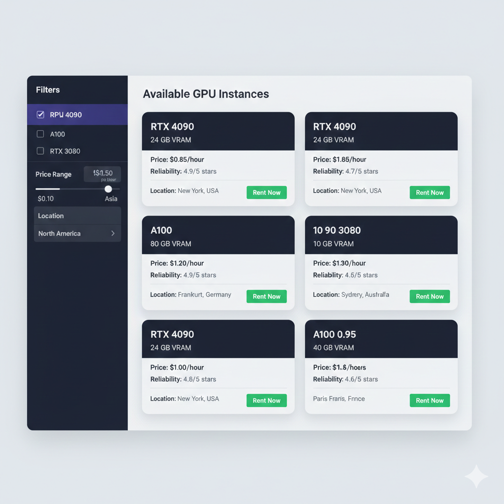

### चरण 4: फंड जमा करें और एस्क्रो को मंजूरी दें

एक बार जब आप GPU चुन लेते हैं, तो आपको स्मार्ट कॉन्ट्रैक्ट एस्क्रो में फंड जमा करने की आवश्यकता होती है।

**रेंटल शुरू करें:**

- अपनी चयनित GPU लिस्टिंग पर "Rent Now" पर क्लिक करें
- रेंटल अवधि निर्दिष्ट करें (या बिना किसी पूर्व निर्धारित समाप्ति समय के प्रति घंटा चुनें)
- प्लेटफॉर्म शुल्क सहित कुल अनुमानित लागत की समीक्षा करें

**स्मार्ट कॉन्ट्रैक्ट को मंजूरी दें:**

पहला लेनदेन स्मार्ट कॉन्ट्रैक्ट को आपकी क्रिप्टोकरेंसी तक पहुंचने के लिए मंजूरी देता है। यह प्रति टोकन प्रकार एक बार की अनुमति है।

- MetaMask आपको टोकन खर्च को मंजूरी देने के लिए प्रेरित करेगा
- कॉन्ट्रैक्ट पते की समीक्षा करें (सत्यापित करें कि यह प्लेटफॉर्म के दस्तावेजी कॉन्ट्रैक्ट से मेल खाता है)
- अनुमोदन राशि निर्धारित करें (कई उपयोगकर्ता बार-बार अनुमोदन से बचने के लिए असीमित अनुमोदन करते हैं, हालांकि सीमित अनुमोदन अधिक सुरक्षित है)
- लेनदेन की पुष्टि करें और ब्लॉकचेन पुष्टि की प्रतीक्षा करें (पॉलीगॉन पर 5-30 सेकंड)

**एस्क्रो में जमा करें:**

दूसरा लेनदेन आपके वॉलेट से फंड को एस्क्रो कॉन्ट्रैक्ट में ले जाता है।

- जमा करने के लिए राशि निर्दिष्ट करें (न्यूनतम रेंटल लागत है; अतिरिक्त प्लेटफॉर्म क्रेडिट के रूप में रहता है)
- गैस फीस की समीक्षा करें (आमतौर पर पॉलीगॉन पर $0.01-0.10)
- MetaMask में लेनदेन की पुष्टि करें
- पुष्टि की प्रतीक्षा करें—पुष्टि होने के बाद रेंटल स्वचालित रूप से शुरू हो जाएगा

**लेनदेन शुल्क समझाया गया:**

आप दो प्रकार के शुल्क का भुगतान करेंगे:

- **गैस फीस:** ब्लॉकचेन सत्यापनकर्ताओं को MATIC में भुगतान किया जाता है (आमतौर पर $0.01-0.05 प्रति लेनदेन)
- **प्लेटफॉर्म शुल्क:** मार्केटप्लेस को भुगतान की गई रेंटल लागत का प्रतिशत (प्लेटफॉर्म के आधार पर 10-20%)

गैस फीस MetaMask में दिखाई देती है। प्लेटफॉर्म शुल्क प्रदर्शित रेंटल मूल्य में शामिल है।

### चरण 5: अपने किराये के GPU को एक्सेस करें

एस्क्रो पुष्टि के बाद, GPU एक्सेस सेकंड के भीतर सक्रिय हो जाता है।

**कनेक्शन के तरीके प्लेटफॉर्म के अनुसार भिन्न होते हैं:**

**वेब-आधारित टर्मिनल (GPUFlow, कुछ Vast.ai प्रदाता):**

- किसी सॉफ़्टवेयर इंस्टॉलेशन की आवश्यकता नहीं है
- अपने रेंटल डैशबोर्ड में "Open Terminal" पर क्लिक करें
- ब्राउज़र-आधारित SSH/टर्मिनल इंटरफ़ेस दिखाई देता है
- वेब इंटरफ़ेस के माध्यम से फ़ाइल अपलोड/डाउनलोड का समर्थन करता है

**SSH एक्सेस (अधिकांश प्रदाता):**

- रेंटल डैशबोर्ड SSH क्रेडेंशियल्स प्रदर्शित करता है
- कनेक्शन स्ट्रिंग प्रारूप: `ssh user@ip.address -p port`
- Mac/Linux पर टर्मिनल या Windows पर PuTTY का उपयोग करें
- प्रदान किए गए पासवर्ड या SSH कुंजी के माध्यम से प्रमाणीकरण

**रिमोट डेस्कटॉप (Windows GPU इंस्टेंस):**

- RDP क्लाइंट डाउनलोड करें (Windows पर बिल्ट-इन, Mac/Linux के लिए डाउनलोड करें)
- प्रदान किया गया IP पता और क्रेडेंशियल्स दर्ज करें
- पूर्ण विंडोज डेस्कटॉप इंटरफ़ेस दिखाई देता है
- GUI-आधारित अनुप्रयोगों के लिए उपयुक्त

**Jupyter नोटबुक (पूर्व-कॉन्फ़िगर वातावरण):**

- डैशबोर्ड में दिए गए Jupyter लिंक पर क्लिक करें
- ब्राउज़र-आधारित पायथन नोटबुक वातावरण
- सामान्य ML लाइब्रेरी पहले से इंस्टॉल हैं
- इंटरैक्टिव विकास और प्रयोग के लिए अच्छा है

**पहला कनेक्शन सत्यापन:**

एक बार कनेक्ट होने के बाद, GPU उपलब्धता सत्यापित करें:

```bash
nvidia-smi
```

यह कमांड मॉडल, मेमोरी, तापमान और वर्तमान उपयोग सहित GPU जानकारी प्रदर्शित करता है। पुष्टि करें कि GPU आपके रेंटल विनिर्देशों से मेल खाता है।

CUDA इंस्टॉलेशन की जाँच करें:

```bash
nvcc --version
```

अधिकांश प्रदाताओं में CUDA टूलकिट पहले से इंस्टॉल होता है। संस्करण को आपके फ्रेमवर्क आवश्यकताओं (PyTorch, TensorFlow, आदि) से मेल खाना चाहिए।

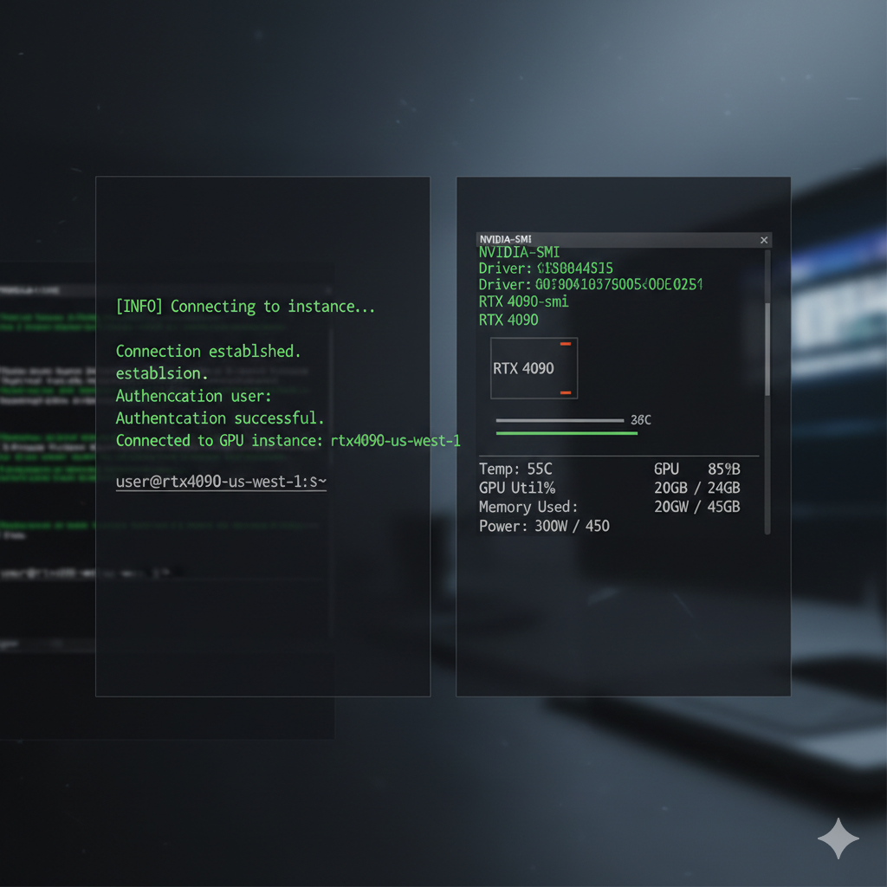

### चरण 6: अपने GPU पर काम करें और उपयोग की निगरानी करें

GPU एक्सेस स्थापित होने के साथ, आप अपना कम्प्यूटेशनल कार्य शुरू कर सकते हैं। प्रभावी सत्र प्रबंधन लागत को कम करता है।

**अपना डेटा और कोड अपलोड करें:**

**वेब इंटरफ़ेस के माध्यम से:**

- अधिकांश प्लेटफॉर्म वेब टर्मिनलों में फ़ाइल अपलोड बटन प्रदान करते हैं
- छोटी फ़ाइलों (100MB से कम) के लिए ड्रैग-एंड-ड्रॉप समर्थन
- कोड फ़ाइलों, कॉन्फ़िगरेशन, छोटे डेटासेट के लिए उपयुक्त

**SCP/SFTP के माध्यम से:**

- बड़े ट्रांसफर के लिए `scp` कमांड या FileZilla का उपयोग करें
- उदाहरण: `scp -P port localfile.tar.gz user@ip:/remote/path/`
- मल्टी-GB डेटासेट के लिए अधिक कुशल

**क्लाउड स्टोरेज के माध्यम से:**

- S3, Google Drive, या समान से सीधे GPU इंस्टेंस पर डाउनलोड करें
- आपके कनेक्शन के माध्यम से अपलोड करने से बचता है
- उदाहरण: `wget https://your-bucket.s3.amazonaws.com/dataset.tar.gz`

**वास्तविक समय में लागत की निगरानी करें:**

प्लेटफॉर्म डैशबोर्ड प्रदर्शित करते हैं:

- वर्तमान सत्र अवधि
- अब तक जमा हुई लागत
- शेष क्रेडिट बैलेंस
- वर्तमान रन रेट पर अनुमानित लागत

क्रेडिट बैलेंस सीमा तक पहुंचने पर आपको सूचित करने के लिए अलर्ट सेट करें। यह प्रशिक्षण के बीच में अप्रत्याशित सत्र समाप्ति को रोकता है।

**संसाधन निगरानी:**

मूल्य को अधिकतम करने के लिए GPU उपयोग को उच्च रखें:

```bash
watch -n 1 nvidia-smi
```

यह हर सेकंड GPU आंकड़ों को अपडेट करता है। कम उपयोग डेटा लोडिंग, प्रीप्रोसेसिंग, या कोड अक्षमता में बाधाओं का सुझाव देता है।

CPU और RAM उपयोग की निगरानी करें:

```bash
htop
```

रेंटल इंस्टेंस में GPU के साथ CPU कोर और सिस्टम RAM शामिल हैं। उन सभी संसाधनों का उपयोग करें जिनके लिए आप भुगतान कर रहे हैं।

**सत्र प्रबंधन सर्वोत्तम प्रथाएं:**

**बार-बार काम सेव करें:**

- हर एपोक (epoch) पर मॉडल वेट्स (model weights) को चेकपॉइंट करें
- चेकपॉइंट्स को बाहरी स्टोरेज पर अपलोड करें
- इंस्टेंस स्टोरेज अस्थायी है—रेंटल समाप्त होने पर हटा दिया जाता है

**screen या tmux का उपयोग करें:**

- यदि कनेक्शन ड्रॉप होता है तो टर्मिनल मल्टीप्लेक्सर प्रक्रियाओं को चालू रखते हैं
- काम खोए बिना डिस्कनेक्शन के बाद सत्रों को फिर से जोड़ें
- बहु-घंटे के प्रशिक्षण रन के लिए आवश्यक

उदाहरण:

```bash
screen -S training
python train.py
# अलग होने के लिए Ctrl+A फिर D दबाएं
# बाद में इसके साथ फिर से कनेक्ट करें: screen -r training
```

**लागत दक्षता के लिए अनुकूलित करें:**

- GPU रेंटल शुरू करने से पहले कोड और डेटा तैयार करें
- स्थानीय मशीनों या CPU इंस्टेंस पर डीबग करें
- केवल वास्तविक प्रशिक्षण/अनुमान के लिए GPU समय का उपयोग करें
- काम पूरा होने पर तुरंत सत्र समाप्त करें

### चरण 7: रेंटल पूरा करें और फंड निकालें

जब आपका काम समाप्त हो जाए, तो बिलिंग रोकने के लिए रेंटल को ठीक से समाप्त करें।

**मैनुअल समाप्ति:**

- प्लेटफॉर्म डैशबोर्ड में "Stop Rental" या "Terminate Instance" पर क्लिक करें
- समाप्ति की पुष्टि करें—यह क्रिया तत्काल और अपरिवर्तनीय है
- समाप्त करने से पहले कोई भी परिणाम डाउनलोड करें

**स्वचालित समाप्ति:**

- पूर्व निर्धारित अवधि वाले रेंटल स्वचालित रूप से समाप्त हो जाते हैं
- सुनिश्चित करें कि समय समाप्त होने से पहले काम पूरा हो जाए
- यदि आवश्यक हो तो समाप्ति से पहले रेंटल बढ़ाएं

**अंतिम लागत निपटान:**

स्मार्ट कॉन्ट्रैक्ट वास्तविक उपयोग के आधार पर अंतिम लागत की गणना करता है:

- प्रति घंटा दर × उपयोग किए गए वास्तविक घंटे (प्रति सेकंड बिल किया गया)
- कुल पर लागू प्लेटफॉर्म शुल्क
- अप्रयुक्त एस्क्रो फंड स्वचालित रूप से वापस आ जाते हैं

**फंड वापसी प्रक्रिया:**

अप्रयुक्त एस्क्रो बैलेंस या तो:

- स्वचालित रूप से आपके वॉलेट में वापस आ जाता है (ब्लॉकचेन-आधारित एस्क्रो)
- भविष्य के रेंटल के लिए प्लेटफॉर्म क्रेडिट के रूप में रहता है (केंद्रीकृत प्लेटफॉर्म)
- वॉलेट में तत्काल निकासी के लिए उपलब्ध है

GPUFlow और स्मार्ट-कॉन्ट्रैक्ट प्लेटफॉर्म के लिए:

- अप्रयुक्त फंड मिनटों के भीतर आपके वॉलेट में जारी हो जाते हैं
- किसी निकासी अनुरोध या अनुमोदन की आवश्यकता नहीं है
- वॉलेट बैलेंस चेक करें—फंड अपने आप दिखाई देते हैं

प्लेटफॉर्म-क्रेडिट सिस्टम के लिए:

- निकासी अनुभाग पर नेविगेट करें
- राशि और गंतव्य वॉलेट निर्दिष्ट करें
- निकासी लेनदेन को मंजूरी दें
- प्लेटफॉर्म प्रोसेसिंग की प्रतीक्षा करें (आमतौर पर 24 घंटे से कम)

**लेनदेन इतिहास:**

रेंटल रसीदें डाउनलोड करें जो दिखाती हैं:

- रेंटल शुरू और समाप्त होने का समय
- कुल अवधि और लागत
- GPU विनिर्देश
- लेनदेन हैश (ब्लॉकचेन-आधारित भुगतान के लिए)

व्यय ट्रैकिंग या व्यावसायिक लेखांकन के लिए रिकॉर्ड बनाए रखें।

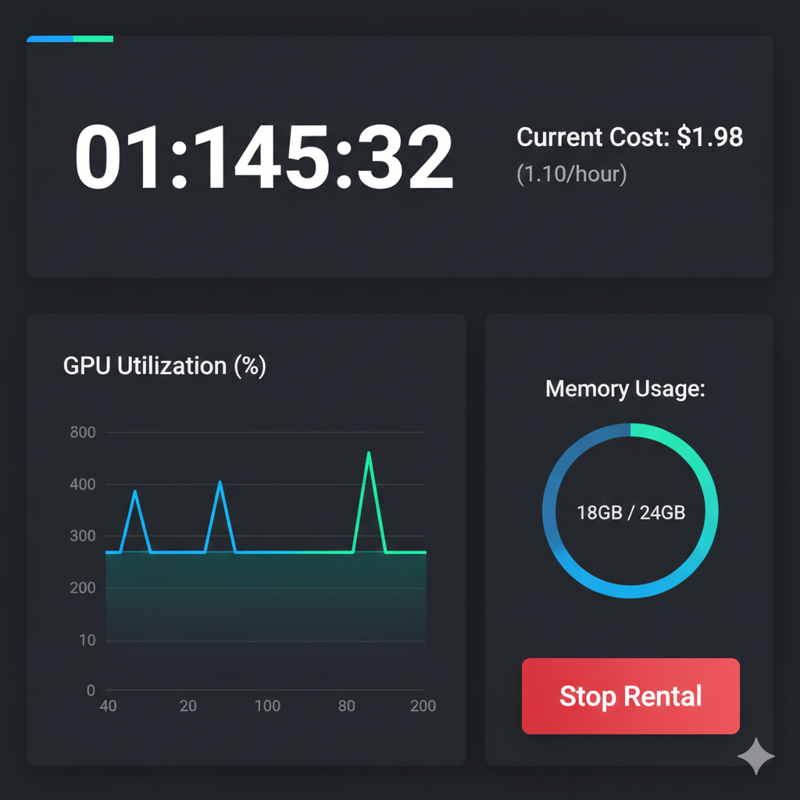

---

## लागत अनुकूलन रणनीतियाँ

क्रिप्टोकरेंसी भुगतान लेनदेन ओवरहेड को कम करते हैं, लेकिन रेंटल लागत अभी भी GPU उपयोग के समय के आधार पर जमा होती है। रणनीतिक योजना कुल व्यय को कम करती है।

### विकास कार्यप्रवाह को अनुकूलित करें

सबसे महंगी गलती GPU समय को उन कार्यों पर जलाना है जो स्थानीय रूप से हो सकते हैं।

**पहले स्थानीय विकास:**

- अपने लैपटॉप या CPU इंस्टेंस पर कोड लिखें और डीबग करें
- सत्यापित करें कि डेटा पाइपलाइन सही ढंग से काम करती हैं
- स्थानीय रूप से छोटे डेटा सबसेट के साथ परीक्षण करें
- केवल वास्तविक प्रशिक्षण के लिए तैयार होने पर ही GPU पर जाएं

**उदाहरण लागत तुलना:**

- स्थानीय मशीन पर 3 घंटे के लिए कोड डीबगिंग: $0
- $0.60/घंटा पर किराए के RTX 4090 पर उसी कोड को डीबग करना: $1.80
- दर्जनों डीबगिंग सत्रों में इसे गुणा करें: $50+ बर्बाद

**रेंटल से पहले सब कुछ तैयार करें:**

- GPU इंस्टेंस से सुलभ क्लाउड स्टोरेज में डेटासेट डाउनलोड करें
- कोड और निर्भरता को Docker कंटेनर या conda वातावरण में पैकेज करें
- सेटअप स्क्रिप्ट बनाएं जो वातावरण को स्वचालित रूप से कॉन्फ़िगर करें
- प्रशिक्षण शुरू करने के लिए आवश्यक सटीक कमांड का दस्तावेजीकरण करें

लक्ष्य: GPU इंस्टेंस शुरू होने से लेकर प्रशिक्षण चलने तक में 5 मिनट से कम समय लगना चाहिए।

### स्पॉट प्राइसिंग और बाधित होने वाले इंस्टेंस का लाभ उठाएं

कुछ प्लेटफॉर्म रियायती "स्पॉट" या "interruptible" इंस्टेंस प्रदान करते हैं जिन्हें छोटी सूचना के साथ वापस लिया जा सकता है।

**बचत क्षमता:** ऑन-डिमांड मूल्य निर्धारण पर 50-70% की छूट

**उन वर्कलोड के लिए सर्वश्रेष्ठ जो:**

- अक्सर चेकपॉइंट कर सकते हैं (हर कुछ मिनट में)
- चेकपॉइंट से स्वचालित रूप से फिर से शुरू हो सकते हैं
- डेटा हानि के बिना रुकावट को सहन कर सकते हैं

**कार्यान्वयन दृष्टिकोण:**

- हर N मिनट में चेकपॉइंट सेव करने के लिए प्रशिक्षण कोड को संशोधित करें
- प्लेटफॉर्म से रुकावट संकेतों का पता लगाएं
- स्थिति (state) सहेजें और इत्मीनान से बंद करें
- इंस्टेंस वापस आने पर नवीनतम चेकपॉइंट से स्वचालित रूप से फिर से शुरू करें

अधिकांश डीप लर्निंग फ्रेमवर्क इसका समर्थन करते हैं:

```python
# PyTorch example
if os.path.exists('checkpoint.pth'):
    checkpoint = torch.load('checkpoint.pth')
    model.load_state_dict(checkpoint['model'])
    optimizer.load_state_dict(checkpoint['optimizer'])
    start_epoch = checkpoint['epoch']
```

### समान वर्कलोड का बैच (Batch) बनाएं

रेंटल ओवरहेड (कनेक्शन सेटअप, वातावरण कॉन्फ़िगरेशन, डेटा ट्रांसफर) प्रति सत्र तय होता है। इसे लंबे सत्रों में अमॉर्टाइज (amortize) करें।

**अकुशल दृष्टिकोण:**

- मॉडल वैरिएंट A को प्रशिक्षित करने के लिए 1 घंटे के लिए GPU किराये पर लें
- समाप्त करें, वैरिएंट B को प्रशिक्षित करने के लिए फिर से किराये पर लें
- वैरिएंट C के लिए दोहराएं
- कुल ओवरहेड: 15 मिनट × 3 सत्र = 45 मिनट बर्बाद

**कुशल दृष्टिकोण:**

- 3.5 घंटे के लिए GPU किराये पर लें
- एक सत्र में तीनों वैरिएंट को प्रशिक्षित करें
- ओवरहेड: एक बार 15 मिनट
- बचत: 30 मिनट = GPU के आधार पर $0.30+

**बैच प्रयोग स्क्रिप्ट तैयार करें:**

```bash
#!/bin/bash
python train.py --config config_a.yaml
python train.py --config config_b.yaml
python train.py --config config_c.yaml
python evaluate.py --all-models
```

इस स्क्रिप्ट को GPU इंस्टेंस पर चलाएं और इसे सभी कार्यों को पूरा करने दें।

### वर्कलोड के लिए उपयुक्त GPU चुनें

जरूरत से ज्यादा GPU किराये पर लेना पैसे बर्बाद करता है। अपर्याप्त GPU किराये पर लेना समय बर्बाद करता है।

**GPU चयन मानदंड:**

**मेमोरी की आवश्यकताएं (Memory requirements) चुनाव पर हावी हैं:**

- मॉडल का आकार और बैच आकार न्यूनतम आवश्यक VRAM निर्धारित करते हैं
- 8GB GPUs: छोटे मॉडल, अनुमान (inference), छवि वर्गीकरण
- 16-24GB GPUs: अधिकांश प्रशिक्षण कार्य, Stable Diffusion, मध्यम आकार के LLM
- 40-80GB GPUs: बड़े भाषा मॉडल, बड़े पैमाने पर बैच आकार
- 80GB+ GPUs: 70B+ पैरामीटर मॉडल, अनुसंधान-स्तरीय प्रयोग

**कंप्यूट आवश्यकताएं गति निर्धारित करती हैं:**

- प्रशिक्षण गति TFLOPS (फ्लोटिंग-पॉइंट ऑपरेशंस प्रति सेकंड) के साथ बढ़ती है
- RTX 4090 FP16 वर्कलोड के लिए सर्वोत्तम मूल्य/प्रदर्शन प्रदान करता है
- A100/H100 LLM अनुमान के लिए FP8 और INT8 में उत्कृष्टता प्राप्त करते हैं
- पुराने GPU (V100, P100) शायद ही कभी अपने मूल्य निर्धारण को सही ठहराते हैं

**लागत उदाहरण:**

प्रशिक्षण कार्य के लिए 24GB VRAM की आवश्यकता होती है, जो पूरा होता है:

- RTX 4090 ($0.60/घंटा) पर 2 घंटे में = $1.20 कुल
- RTX 3090 ($0.45/घंटा) पर 3 घंटे में = $1.35 कुल
- A100 ($1.40/घंटा) पर 1.5 घंटे में = $2.10 कुल

उच्च प्रति घंटा दर के बावजूद RTX 4090 सर्वोत्तम मूल्य प्रदान करता है क्योंकि तेजी से पूरा होने का समय कुल लागत को कम करता है।

### अस्थायी स्टोरेज (Preemptible Storage) का बुद्धिमानी से उपयोग करें

GPU इंस्टेंस में अस्थायी स्टोरेज शामिल है जो रेंटल समाप्त होने पर हटा दिया जाता है। बाहरी स्टोरेज की अतिरिक्त लागत होती है।

**रणनीति:**

- सत्र शुरू होने पर सीधे इंस्टेंस में डेटासेट डाउनलोड करें
- प्रक्रिया और प्रशिक्षण करें
- केवल अंतिम आउटपुट (प्रशिक्षित वेट्स, परिणाम) अपलोड करें
- बाकी सब कुछ हटा दें—इंस्टेंस समाप्त होने पर यह वैसे भी गायब हो जाता है

**बाहरी स्टोरेज को कम करें:**

- जब तक आवश्यक न हो मध्यवर्ती चेकपॉइंट को बाहरी रूप से स्टोर न करें
- अपलोड करने से पहले परिणामों को कंप्रेस करें (प्रशिक्षित मॉडल अच्छी तरह से कंप्रेस होते हैं)
- जब प्रदाता इसकी पेशकश करते हैं तो डेटासेट कैशिंग का उपयोग करें

**उदाहरण स्टोरेज लागत बचाव:**

प्रशिक्षण 50GB चेकपॉइंट और लॉग उत्पन्न करता है:

- S3 पर सभी 50GB को स्टोर करना: $1.15/माह × अनिश्चित काल के लिए
- केवल अंतिम 2GB मॉडल को स्टोर करना: $0.05/माह
- बचत: $1.10/माह प्रति प्रयोग

दर्जनों प्रयोगों में, स्टोरेज की लागत GPU रेंटल लागत से अधिक हो सकती है।

### हाइपरपैरामीटर को बुद्धिमानी से अनुकूलित करें

रैंडम हाइपरपैरामीटर खोज GPU समय को जला देती है। बुद्धिमान खोज तेजी से परिवर्तित होती है।

**इन तकनीकों का उपयोग करें:**

- बायेसियन अनुकूलन (लाइब्रेरी: Optuna, Weights & Biases)
- सत्यापन मेट्रिक्स पर प्रारंभिक रोक (Early stopping)
- मल्टी-फिडेलिटी तरीके (पूर्ण डेटासेट से पहले सबसेट पर परीक्षण)

**उदाहरण:**

- 1 घंटे में 50 कॉन्फ़िगरेशन का परीक्षण करने वाली रैंडम खोज: 50 घंटे
- 15 पुनरावृत्तियों में इष्टतम खोजने वाला बायेसियन अनुकूलन: 15 घंटे
- बचत: 35 घंटे = $0.60/घंटा पर $21+

कई हाइपरपैरामीटर अनुकूलन लाइब्रेरी पिछले परिणामों के आधार पर अच्छा प्रदर्शन करने की संभावना वाले कॉन्फ़िगरेशन को स्वचालित रूप से चुनने के लिए प्रयोग ट्रैकिंग टूल के साथ एकीकृत होती हैं।

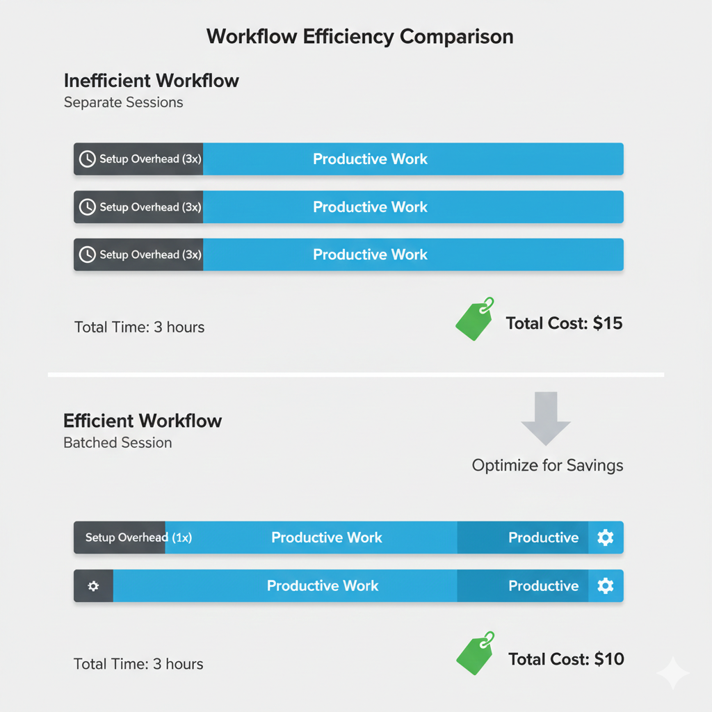
Here is Part 3 (the final part) of the Hindi (`hi`) translation.

## सुरक्षा संबंधी बातें और सर्वोत्तम प्रथाएं (Best Practices)

क्रिप्टोकरेंसी लेनदेन अपरिवर्तनीय (irreversible) और छद्म नाम (pseudonymous) वाले होते हैं। यह गोपनीयता लाभ प्रदान करता है लेकिन अतिरिक्त सुरक्षा सतर्कता की आवश्यकता होती है।

### वॉलेट सुरक्षा के मूल सिद्धांत

आपका क्रिप्टोकरेंसी वॉलेट फंड तक पहुंचने का एकमात्र तंत्र है। अगर इससे समझौता किया जाता है, तो आप सब कुछ खो देते हैं।

**सीड फ्रेज़ (Seed Phrase) सर्वोच्च है:**

- वॉलेट बनाते समय उत्पन्न 12-24 शब्दों का वाक्यांश
- सभी फंडों तक पूर्ण पहुंच प्रदान करता है
- वेबसाइटों पर कभी भी सीड फ्रेज़ दर्ज न करें (वैध प्लेटफॉर्म कभी भी इसका अनुरोध नहीं करते हैं)
- सुरक्षित रूप से ऑफ़लाइन स्टोर करें—तिजोरी में भौतिक प्रति, एन्क्रिप्टेड डिजिटल बैकअप

**ब्राउज़र एक्सटेंशन जोखिम:**

MetaMask और समान ब्राउज़र वॉलेट सुविधा प्रदान करते हैं लेकिन हमले की सतह (attack surface) बनाते हैं:

- फ़िशिंग साइटें अनुमोदन (approvals) चुराने के लिए वैध प्लेटफ़ॉर्म की नकल करती हैं
- दुर्भावनापूर्ण ब्राउज़र एक्सटेंशन वॉलेट डेटा पढ़ सकते हैं
- समझौता किए गए कंप्यूटरों में कीलॉगर्स (keyloggers) हो सकते हैं

**शमन रणनीतियाँ:**

- क्रिप्टो गतिविधियों के लिए समर्पित ब्राउज़र प्रोफ़ाइल का उपयोग करें
- वॉलेट कनेक्ट करने से पहले URL को सावधानीपूर्वक सत्यापित करें
- सर्च करने के बजाय वैध प्लेटफ़ॉर्म URL को बुकमार्क करें
- महत्वपूर्ण फंड के लिए हार्डवेयर वॉलेट (जैसे Ledger) पर विचार करें

### स्मार्ट कॉन्ट्रैक्ट इंटरेक्शन सुरक्षा

अपने वॉलेट को वेबसाइटों से कनेक्ट करने से उन साइटों को लेनदेन का अनुरोध करने की अनुमति मिलती है। दुर्भावनापूर्ण साइटें हानिकारक अनुबंध अनुमोदनों के माध्यम से फंड निकाल सकती हैं।

**वॉलेट कनेक्ट करने से पहले:**

- सत्यापित करें कि आप वैध डोमेन पर हैं (वर्तनी, प्रमाणपत्र जांचें)
- प्लेटफ़ॉर्म प्रतिष्ठा पर शोध करें (सोशल मीडिया, समीक्षाएं, सामुदायिक चर्चा)
- अपरिचित प्लेटफॉर्म पर छोटी परीक्षण राशि के साथ शुरुआत करें

**लेनदेन को मंजूरी देते समय:**

MetaMask पुष्टि से पहले लेनदेन विवरण प्रदर्शित करता है:

- **कॉन्ट्रैक्ट पता:** सत्यापित करें कि यह प्लेटफ़ॉर्म के दस्तावेजी कॉन्ट्रैक्ट से मेल खाता है
- **फ़ंक्शन जिसे कॉल किया जा रहा है:** समझें कि लेनदेन क्या करता है
- **मूल्य:** हस्तांतरित की जा रही राशि
- **गैस फीस:** उचित होनी चाहिए (विशिष्ट लेनदेन के लिए $0.01-0.50)

**अस्वीकार करने के लिए रेड फ्लैग्स:**

- अप्रत्याशित लेनदेन अनुरोध
- नए प्लेटफॉर्म पर असीमित टोकन अनुमोदन के लिए अनुरोध
- $5 से अधिक गैस फीस (पॉलीगॉन/सोलाना पर—गलत नेटवर्क का संकेत देता है)
- दस्तावेज़ों से अलग कॉन्ट्रैक्ट पते

**अनावश्यक अनुमोदन रद्द (Revoke) करें:**

अनुमोदित स्मार्ट कॉन्ट्रैक्ट स्पष्ट रूप से रद्द किए जाने तक अनुमति बनाए रखते हैं। समय-समय पर ऑडिट और रद्द करें:

- revoke.cash या समान अनुमोदन प्रबंधन टूल पर जाएं
- सभी सक्रिय अनुमोदन देखने के लिए वॉलेट कनेक्ट करें
- अप्रयुक्त प्लेटफॉर्म के लिए अनुमोदन रद्द करें

### डेटा और गणना सुरक्षा

किराये के GPU सुरक्षित वातावरण नहीं हैं। प्रदाता सैद्धांतिक रूप से इंस्टेंस सामग्री तक पहुंच सकते हैं।

**किराये के इंस्टेंस पर कभी भी संवेदनशील डेटा स्टोर न करें:**

- निजी कुंजी (Private keys) या सीड फ्रेज़
- गोपनीय व्यावसायिक डेटा
- HIPAA/GDPR अनुपालन की आवश्यकता वाली व्यक्तिगत जानकारी
- मालिकाना कोड या एल्गोरिदम (जब तक एन्क्रिप्ट न हो)

**संवेदनशील वर्कलोड के लिए:**

- इंस्टेंस पर अपलोड करने से पहले डेटा को एन्क्रिप्ट करें
- गोपनीय कंप्यूटिंग GPU (सीमित उपलब्धता) का उपयोग करें
- मार्केटप्लेस प्रदाताओं के बजाय समर्पित (dedicated) प्रदाताओं पर विचार करें
- अतिरिक्त एक्सेस नियंत्रण लागू करें

**अपने SSH एक्सेस को सुरक्षित करें:**

- जब संभव हो पासवर्ड के बजाय SSH कुंजी (keys) का उपयोग करें
- डिफ़ॉल्ट पासवर्ड तुरंत बदलें
- यदि केवल-कुंजी का समर्थन करते हैं तो पासवर्ड प्रमाणीकरण अक्षम करें
- सक्रिय रूप से उपयोग नहीं होने पर सत्र बंद करें

**अनधिकृत पहुंच के लिए निगरानी करें:**

- इंस्टेंस लॉग में लॉगिन इतिहास की समीक्षा करें
- चल रही अप्रत्याशित प्रक्रियाओं की जाँच करें
- संदिग्ध गतिविधि के लिए नेटवर्क कनेक्शन की निगरानी करें

अधिकांश GPU रेंटल इंस्टेंस डिफ़ॉल्ट कॉन्फ़िगरेशन के साथ मानक लिनक्स वितरण चलाते हैं। यदि सुरक्षा आवश्यकताएं इसकी मांग करती हैं तो इन प्रणालियों को सख्त (hardening) करना आपकी जिम्मेदारी है।

### प्लेटफॉर्म-विशिष्ट जोखिम

विभिन्न GPU रेंटल प्लेटफॉर्म अलग-अलग जोखिम प्रोफाइल रखते हैं।

**स्मार्ट कॉन्ट्रैक्ट प्लेटफॉर्म (GPUFlow):**

- जोखिम: कॉन्ट्रैक्ट की कमजोरियां फंड को लॉक या उजागर कर सकती हैं
- शमन: प्लेटफॉर्म को ऑडिट, बग बाउंटी प्रकाशित करनी चाहिए
- जाँच: ब्लॉकचेन एक्सप्लोरर पर कॉन्ट्रैक्ट कोड, सामुदायिक प्रतिष्ठा

**केंद्रीकृत प्लेटफॉर्म (RunPod):**

- जोखिम: प्लेटफॉर्म का दिवालिया होना, खाता फ्रीज होना, नीति परिवर्तन
- शमन: बड़ी शेष राशि जमा न करें, नियमित रूप से निकालें
- जाँच: कंपनी पंजीकरण, सेवा की शर्तें, सामुदायिक विश्वास

**पीयर-टू-पीयर मार्केटप्लेस (Vast.ai):**

- जोखिम: व्यक्तिगत प्रदाता की बेईमानी, सेवा विफलताएं
- शमन: उच्च-रेटेड प्रदाताओं को चुनें, छोटी शुरुआत करें
- जाँच: प्रदाता अपटाइम इतिहास, उपयोगकर्ता समीक्षाएं

**प्रत्यक्ष प्रदाता व्यवस्था:**

- जोखिम: प्लेटफॉर्म मध्यस्थता के बिना पूर्ण प्रतिपक्ष जोखिम
- शमन: एस्क्रो सेवाओं का उपयोग करें, न्यूनतम प्रतिबद्धताओं के साथ शुरू करें
- जाँच: समुदाय में प्रदाता की प्रतिष्ठा, सत्यापन योग्य इतिहास

कोई भी प्लेटफॉर्म जोखिम-मुक्त नहीं है। जोखिम वितरित करें:

- एकल प्लेटफॉर्म पर फंड केंद्रित न करके
- निकट अवधि की रेंटल आवश्यकताओं तक जमा राशि को सीमित करके
- न्यूनतम राशि के साथ नए प्लेटफॉर्म का परीक्षण करके
- कई वॉलेट में क्रिप्टोकरेंसी बनाए रखकर

### लेनदेन की सर्वोत्तम प्रथाएं

क्रिप्टोकरेंसी लेनदेन अपरिवर्तनीय हैं। गलतियों के परिणामस्वरूप स्थायी नुकसान होता है।

**कोई भी लेनदेन भेजने से पहले:**

- गंतव्य पते को चरित्र-दर-चरित्र सत्यापित करें (मैलवेयर कॉपी किए गए पते को बदल सकता है)
- पुष्टि करें कि राशि सही है
- जांचें कि नेटवर्क इच्छित ब्लॉकचेन से मेल खाता है
- राशि प्लस गैस फीस के लिए पर्याप्त बैलेंस सुनिश्चित करें

**पहले छोटी राशि के साथ परीक्षण करें:**

- नए पते पर न्यूनतम लेनदेन भेजें
- बड़ी राशि भेजने से पहले रसीद की पुष्टि करें
- एक बार की परेशानी विनाशकारी त्रुटियों को रोकती है

**बचने के लिए सामान्य गलतियाँ:**

- कॉन्ट्रैक्ट पतों पर टोकन भेजना (जमा कार्यों के बजाय)
- गलत नेटवर्क का उपयोग करना (जब प्लेटफॉर्म पॉलीगॉन की अपेक्षा करता है तो एथेरियम पर भेजना)
- अपर्याप्त गैस टोकन (गैस के लिए MATIC की आवश्यकता है लेकिन केवल USDC होल्ड करना)
- क्लिपबोर्ड मैलवेयर से गलत पता कॉपी करना

**यदि आप कोई गलती करते हैं:**

- ब्लॉकचेन लेनदेन को उलटा नहीं किया जा सकता है
- गलत पते पर भेजे गए फंड स्थायी रूप से खो जाते हैं
- कोई भी ग्राहक सेवा गलत हस्तांतरण को पुनर्प्राप्त नहीं कर सकती है
- रोकथाम ही एकमात्र सुरक्षा है

### गोपनीयता विचार

क्रिप्टोकरेंसी छद्म नाम (pseudonymity) प्रदान करती है, पूर्ण गुमनामी नहीं। सभी लेनदेन ब्लॉकचेन एक्सप्लोरर पर सार्वजनिक रूप से दिखाई देते हैं।

**ब्लॉकचेन पारदर्शिता:**

- कोई भी आपके वॉलेट बैलेंस और लेनदेन इतिहास को देख सकता है
- पता पुन: उपयोग (Address reuse) सभी गतिविधियों को एकल पहचान से जोड़ता है
- पते को वास्तविक पहचान से जोड़ना सभी लेनदेन को डी-अनामित (deanonymizes) करता है

**गोपनीयता बढ़ाएँ:**

- विभिन्न उद्देश्यों के लिए विभिन्न पतों का उपयोग करें
- वॉलेट पते को सार्वजनिक करने से बचें
- संवेदनशील लेनदेन के लिए गोपनीयता-केंद्रित चेन पर विचार करें
- प्लेटफॉर्म डेटा प्रतिधारण नीतियों को समझें

**प्लेटफॉर्म ट्रैकिंग:**

- GPU रेंटल प्लेटफॉर्म रेंटल गतिविधि, कनेक्शन IP लॉग करते हैं
- भुगतान प्रोसेसर (उनका उपयोग करने वाले प्लेटफॉर्म के लिए) लेनदेन डेटा एकत्र करते हैं
- प्रदाता इंस्टेंस आपकी कम्प्यूटेशनल गतिविधि को लॉग कर सकते हैं

पूर्ण गोपनीयता के लिए, आपको सभी परतों को संबोधित करना होगा: ब्लॉकचेन छद्म नाम, प्लेटफॉर्म नीतियां, और प्रदाता विश्वसनीयता।

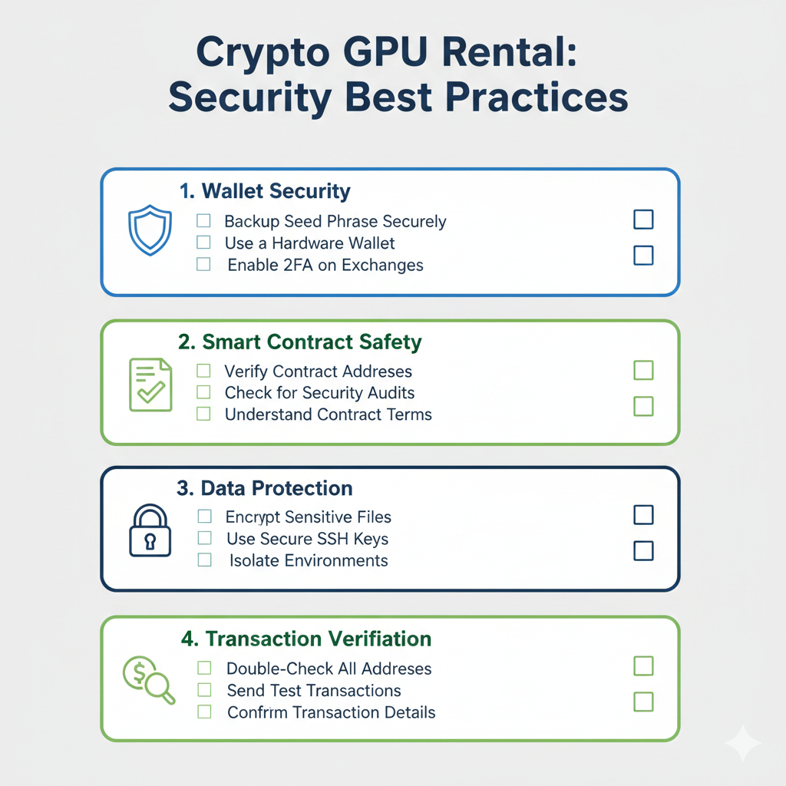

---

## लागत की तुलना: क्रिप्टोकरेंसी बनाम पारंपरिक भुगतान

क्या क्रेडिट कार्ड की तुलना में क्रिप्टोकरेंसी से भुगतान करने पर वास्तव में पैसे की बचत होती है? इसका उत्तर लेनदेन की आवृत्ति और रेंटल पैटर्न पर निर्भर करता है।

### लेनदेन शुल्क तुलना

**क्रिप्टोकरेंसी नेटवर्क:**

- एथेरियम मेननेट: $0.50-3.00 प्रति लेनदेन
- पॉलीगॉन/सोलाना: $0.01-0.10 प्रति लेनदेन
- बिटकॉइन: $1-10 प्रति लेनदेन

**पारंपरिक भुगतान विधियां:**

- क्रेडिट कार्ड मर्चेंट फीस: लेनदेन का 2.5-3.5% + $0.30 निश्चित शुल्क
- ACH/बैंक हस्तांतरण: $0-1 शुल्क, 2-5 व्यावसायिक दिन निपटान
- वायर ट्रांसफर: $10-30 घरेलू, $30-50 अंतरराष्ट्रीय

**ब्रेक-ईवन विश्लेषण:**

$50 GPU रेंटल डिपॉजिट के लिए:

- क्रेडिट कार्ड: मर्चेंट फीस में $1.55-2.05 (मूल्य निर्धारण या फीस के माध्यम से ग्राहक को दिया जाता है)
- पॉलीगॉन क्रिप्टोकरेंसी: $0.05 लेनदेन शुल्क
- बचत: ~$1.50 प्रति जमा

$500 GPU रेंटल डिपॉजिट के लिए:

- क्रेडिट कार्ड: फीस में $12.80-17.80
- पॉलीगॉन क्रिप्टोकरेंसी: $0.05 लेनदेन शुल्क
- बचत: ~$12.75 प्रति जमा

जैसे-जैसे लेनदेन का आकार बढ़ता है, क्रिप्टोकरेंसी अधिक किफायती हो जाती है। क्रेडिट कार्ड प्रतिशत शुल्क राशि के साथ बढ़ते हैं; ब्लॉकचेन लेनदेन शुल्क स्थिर रहते हैं।

### प्लेटफॉर्म शुल्क अंतर

कम परिचालन ओवरहेड के कारण क्रिप्टो-नेतेव प्लेटफॉर्म अक्सर कम प्लेटफॉर्म शुल्क लेते हैं।

**विशिष्ट प्लेटफॉर्म शुल्क:**

- AWS/Azure/GCP: मूल्य निर्धारण में निर्मित (हार्डवेयर लागत पर प्रभावी 200-400% मार्कअप)
- RunPod: ~20% प्लेटफॉर्म शुल्क
- Vast.ai: ~20% प्लेटफॉर्म शुल्क
- GPUFlow: 10-15% प्लेटफॉर्म शुल्क

क्रिप्टो प्लेटफॉर्म पर कम शुल्क दर्शाता है:

- कोई भुगतान प्रसंस्करण शुल्क नहीं (2.5-3.5% समाप्त)
- कोई चार्जबैक जोखिम या धोखाधड़ी रिजर्व नहीं
- कम ग्राहक सहायता ओवरहेड (स्मार्ट कॉन्ट्रैक्ट विवादों को संभालते हैं)
- छोटा अनुपालन और नियामक बोझ

### छिपी हुई लागतें (Hidden Costs)

क्रिप्टोकरेंसी भुगतान कुछ लागतों को समाप्त करते हैं लेकिन अन्य को पेश करते हैं।

**समाप्त लागतें:**

- क्रेडिट कार्ड विदेशी लेनदेन शुल्क (आमतौर पर 1-3%)
- मुद्रा रूपांतरण शुल्क
- अंतर्राष्ट्रीय वायर हस्तांतरण शुल्क
- भुगतान प्रोसेसर मासिक शुल्क (प्रदाताओं के लिए)

**नई लागतें:**

- प्रारंभिक क्रिप्टोकरेंसी अधिग्रहण शुल्क (एक्सचेंज ट्रेडिंग शुल्क 0.1-0.5%)
- ब्लॉकचेन लेनदेन शुल्क (नेटवर्क द्वारा परिवर्तनीय)
- एक्सचेंजों पर खरीद/बिक्री की कीमतों के बीच स्प्रेड (0.1-1%)
- क्रिप्टोकरेंसी लेनदेन के संभावित कर निहितार्थ

**शुद्ध परिणाम भूगोल द्वारा भिन्न होता है:**

- अंतर्राष्ट्रीय उपयोगकर्ता सबसे अधिक बचत करते हैं (मुद्रा रूपांतरण, अंतर्राष्ट्रीय शुल्क से बचते हुए)
- अच्छे क्रेडिट कार्ड वाले अमेरिकी उपयोगकर्ता मामूली बचत देखते हैं
- क्रिप्टो-फ्रेंडली क्षेत्राधिकारों में उपयोगकर्ता लाभ को अधिकतम करते हैं

### गति और पहुंच का मूल्य

प्रत्यक्ष लागत से परे, क्रिप्टोकरेंसी भुगतान सुविधा मूल्य प्रदान करते हैं।

**तत्काल पहुंच लाभ:**

- क्रेडिट कार्ड: धोखाधड़ी जांच के लिए 24-72 घंटे की होल्ड अवधि (नए उपयोगकर्ताओं के लिए सामान्य)
- बैंक हस्तांतरण: 2-5 व्यावसायिक दिन निपटान
- क्रिप्टोकरेंसी: 1-60 मिनट की पुष्टि, तत्काल पहुंच

समय के प्रति संवेदनशील वर्कलोड के लिए, तेजी से पहुंच का डॉलर लागत बचत से परे मूल्य है।

### कुल स्वामित्व की लागत (TCO) उदाहरण

**परिदृश्य:** ब्राजील में एक डेवलपर ML प्रशिक्षण के लिए मासिक 20 घंटे GPU किराये पर ले रहा है

**पारंपरिक भुगतान पथ (क्रेडिट कार्ड के साथ RunPod):**

- आधार किराया: 20घंटे × $0.59 = $11.80
- अंतर्राष्ट्रीय क्रेडिट कार्ड शुल्क (3%): $0.35
- मुद्रा रूपांतरण BRL→USD (1% स्प्रेड): $0.12
- कुल: $12.27

**क्रिप्टोकरेंसी भुगतान पथ (GPUFlow):**

- आधार किराया: 20घंटे × $0.65 = $13.00
- पॉलीगॉन लेनदेन शुल्क: $0.05
- USDC अधिग्रहण शुल्क (0.5%): $0.07
- कुल: $13.12

अंतर: इस परिदृश्य में क्रिप्टोकरेंसी के माध्यम से $0.85 अधिक महंगा।

**लेकिन विचार करें:**

- कोई धोखाधड़ी होल्ड देरी नहीं (48 घंटे बनाम 2 मिनट में पहुंच)
- कोई KYC दस्तावेज की आवश्यकता नहीं
- गोपनीयता लाभ
- कम प्लेटफॉर्म शुल्क (12% बनाम 20%) आंशिक रूप से उच्च प्रति घंटा दर की भरपाई करता है

मूल्य शुद्ध लागत से परे व्यक्तिगत प्राथमिकताओं पर निर्भर करता है।

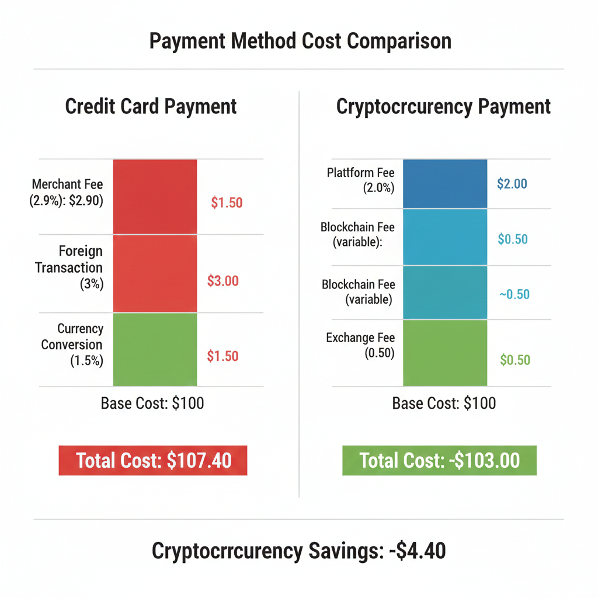

## सामान्य समस्याएं और समस्या निवारण (Troubleshooting)

क्रिप्टोकरेंसी GPU रेंटल दो तकनीकी डोमेन को जोड़ती है, जिससे अद्वितीय समस्या निवारण परिदृश्य बनते हैं। यह खंड लगातार मुद्दों और उनके समाधानों को संबोधित करता है।

### वॉलेट कनेक्शन समस्याएं

**समस्या:** MetaMask प्लेटफॉर्म से कनेक्ट नहीं होगा

**सामान्य कारण और समाधान:**

ब्राउज़र संगतता मुद्दे:

- MetaMask Chrome, Firefox, Brave पर सबसे अच्छा काम करता है
- Safari समर्थन सीमित है—यदि समस्याएं बनी रहती हैं तो ब्राउज़र बदलें
- ब्राउज़र कैश और कुकीज़ साफ़ करें, ब्राउज़र पुनरारंभ करें
- परस्पर विरोधी एक्सटेंशन को अस्थायी रूप से अक्षम करें

गलत नेटवर्क चुना गया:

- जांचें कि MetaMask सही नेटवर्क (Polygon, Ethereum, Solana) दिखाता है
- नेटवर्क ड्रॉपडाउन पर क्लिक करें और आवश्यक नेटवर्क पर स्विच करें
- यदि गलत नेटवर्क का पता चलता है तो प्लेटफॉर्म आमतौर पर स्विच करने के लिए संकेत देगा

पुराना वॉलेट संस्करण:

- MetaMask स्वचालित रूप से अपडेट होता है लेकिन मैन्युअल अपडेट की आवश्यकता हो सकती है
- अपडेट के लिए chrome://extensions/ जांचें
- यदि लगातार समस्याएं हैं तो MetaMask को फिर से इंस्टॉल करें (सीड फ्रेज़ से वॉलेट पुनर्प्राप्त करें)

**समस्या:** पर्याप्त शेष राशि के बावजूद लेनदेन "अपर्याप्त फंड" (Insufficient funds) के साथ विफल हो जाता है

इस भ्रमित करने वाली त्रुटि का आमतौर पर मतलब है अपर्याप्त गैस टोकन, अपर्याप्त भुगतान टोकन नहीं।

**समाधान:**

- आपको गैस फीस के लिए मूल नेटवर्क टोकन की आवश्यकता है (पॉलीगॉन पर MATIC, एथेरियम पर ETH)
- यदि आपके पास गैस के लिए MATIC की कमी है तो USDC बैलेंस होने से कोई मदद नहीं मिलती है
- थोड़ी मात्रा में गैस टोकन प्राप्त करें (आमतौर पर $1-5 पर्याप्त है)
- कई प्लेटफॉर्म नए उपयोगकर्ताओं के लिए मुफ्त गैस टोकन नल (faucets) प्रदान करते हैं

**समस्या:** वॉलेट प्लेटफॉर्म से अलग बैलेंस दिखाता है

**कारण:**

- प्लेटफॉर्म एस्क्रो कॉन्ट्रैक्ट में बैलेंस दिखाता है, वॉलेट मुख्य पता बैलेंस दिखाता है
- विभिन्न नेटवर्क (एथेरियम बैलेंस की जांच करना जब फंड पॉलीगॉन पर हों)
- लेनदेन अभी भी पुष्टि के लिए लंबित है

**समाधान:**

- ब्लॉकचेन पुष्टि के लिए 1-2 मिनट प्रतीक्षा करें
- सत्यापित करें कि आप वॉलेट में सही नेटवर्क देख रहे हैं
- यह पुष्टि करने के लिए कि लेनदेन पूरा हो गया है, ब्लॉकचेन एक्सप्लोरर पर प्लेटफॉर्म के जमा पते की जांच करें
- वॉलेट और प्लेटफॉर्म पेज दोनों को रिफ्रेश करें

### लेनदेन और एस्क्रो मुद्दे

**समस्या:** विस्तारित समय के लिए लेनदेन लंबित (Pending) है

**सामान्य प्रतीक्षा समय:**

- पॉलीगॉन: 5-30 सेकंड
- एथेरियम: 1-5 मिनट
- सोलाना: 1-3 सेकंड
- बिटकॉइन: 10-60 मिनट

**यदि अधिक हो गया है:**

- लेनदेन हैश का उपयोग करके ब्लॉकचेन एक्सप्लोरर (Polygonscan, Etherscan) की जांच करें
- लेनदेन की स्थिति देखें: लंबित, पुष्टि, या विफल
- विफल लेनदेन फंड वापस करते हैं लेकिन गैस फीस का उपभोग करते हैं

**अटके हुए लेनदेन को गति दें:**

- MetaMask गैस की कीमत बढ़ाने के लिए "Speed Up" विकल्प प्रदान करता है
- यह उच्च शुल्क के साथ प्रतिस्थापन लेनदेन प्रस्तुत करता है
- केवल तभी काम करता है जब मूल लेनदेन अभी भी लंबित हो

**समस्या:** रेंटल पूरा होने के बाद एस्क्रो कॉन्ट्रैक्ट फंड जारी नहीं करेगा

**पहले सत्यापित करें कि रेंटल वास्तव में समाप्त हो गया है:**

- सत्र की स्थिति के लिए प्लेटफॉर्म डैशबोर्ड की जांच करें
- कुछ प्लेटफॉर्म को मैन्युअल "End Rental" कार्रवाई की आवश्यकता होती है
- समय के आधार पर स्वचालित समाप्ति में थोड़ी देरी हो सकती है

**यदि वैध रूप से अटका हुआ है:**

- स्मार्ट कॉन्ट्रैक्ट प्लेटफॉर्म: हालिया गतिविधि के लिए ब्लॉकचेन एक्सप्लोरर पर कॉन्ट्रैक्ट की जांच करें
- खुले विवाद या लंबित रिलीज लेनदेन की तलाश करें
- लेनदेन हैश और वॉलेट पते के साथ प्लेटफॉर्म समर्थन से संपर्क करें

**समस्या:** गलत पते या गलत नेटवर्क पर फंड भेजा गया

दुर्भाग्य से, यह आमतौर पर पुनर्प्राप्त करने योग्य नहीं है।

**एथेरियम/पॉलीगॉन पता भ्रम:**

- एक ही पता दोनों नेटवर्क पर काम करता है (वे समान पता प्रारूप का उपयोग करते हैं)
- गलत नेटवर्क पर आपके पते पर भेजे गए फंड अभी भी आपके हैं
- फंड देखने के लिए MetaMask में सही नेटवर्क जोड़ें
- वास्तव में खोया नहीं, बस अप्रत्याशित नेटवर्क पर है

**पूरी तरह से गलत पता:**

- ब्लॉकचेन लेनदेन अपरिवर्तनीय हैं
- कोई भी ग्राहक सेवा धन की वसूली नहीं कर सकती है
- फंड को स्थायी रूप से खोया हुआ मानें
- सावधानीपूर्वक सत्यापन के माध्यम से रोकथाम ही एकमात्र सुरक्षा है

### GPU एक्सेस और प्रदर्शन मुद्दे

**समस्या:** रेंटल शुरू होने के बाद GPU इंस्टेंस से कनेक्ट नहीं हो सकता

**पहले मूल बातें जांचें:**

- रेंटल स्थिति प्लेटफॉर्म डैशबोर्ड पर "Active" दिखाती है
- कनेक्शन विवरण प्राप्त हुआ (IP पता, पोर्ट, क्रेडेंशियल्स)
- इंस्टेंस ने आरंभीकरण समाप्त कर लिया है (30-60 सेकंड लग सकते हैं)

**कनेक्शन अस्वीकृत (Connection refused) त्रुटियां:**

- सही IP पता और पोर्ट नंबर सत्यापित करें
- जांचें कि क्या आपका नेटवर्क आउटगोइंग SSH कनेक्शन को रोकता है (कॉर्पोरेट फ़ायरवॉल)
- समस्या को अलग करने के लिए विभिन्न नेटवर्क (मोबाइल हॉटस्पॉट) से कनेक्शन का प्रयास करें

**प्रमाणीकरण विफलताएं:**

- सत्यापित करें कि पासवर्ड सही ढंग से कॉपी किया गया है (कोई अतिरिक्त रिक्त स्थान नहीं)
- उपयोगकर्ता नाम केस-संवेदी (case-sensitive) है
- SSH कुंजी प्रमाणीकरण के लिए आवश्यक है कि निजी कुंजी अपलोड की गई सार्वजनिक कुंजी से मेल खाती हो

**समस्या:** GPU का पता नहीं चला या गलत मॉडल दिखाता है

**nvidia-smi के साथ सत्यापित करें:**

```bash
nvidia-smi
```

यदि यह कमांड विफल हो जाता है:

- ड्राइवर इंस्टॉल नहीं हैं या ठीक से लोड नहीं हुए हैं
- प्रदाता समर्थन से संपर्क करें—यह बुनियादी ढांचे की समस्या है
- अलग इंस्टेंस या प्रदाता का अनुरोध करें

यदि गलत GPU मॉडल दिखाता है:

- प्रदाता ने गलत विनिर्देश सूचीबद्ध किए (प्लेटफॉर्म को रिपोर्ट करें)
- धनवापसी का अनुरोध करें और अलग प्रदाता चुनें

**समस्या:** GPU प्रदर्शन अपेक्षा से काफी कम है

**बेंचमार्क वास्तविक प्रदर्शन:**

```bash
# इंस्टॉल बेंचमार्क टूल
pip install torch torchvision

# रन सिंपल बेंचमार्क
python -c "import torch; x=torch.randn(10000,10000).cuda(); torch.mm(x,x); print('Success')"
```

समान GPU मॉडल के लिए स्थानीय बेंचमार्क या प्रकाशित परिणामों के खिलाफ प्रशिक्षण गति की तुलना करें।

### भुगतान और बिलिंग विवाद

**समस्या:** रेंटल समाप्त करने के बाद समय के लिए शुल्क लिया गया

**समाप्ति टाइमस्टैम्प सत्यापित करें:**

- सटीक समाप्ति समय के लिए प्लेटफॉर्म लेनदेन इतिहास की जांच करें
- स्मार्ट कॉन्ट्रैक्ट प्लेटफॉर्म: ब्लॉकचेन एक्सप्लोरर पर कॉन्ट्रैक्ट देखें
- बिलिंग आमतौर पर प्रति-सेकंड होती है, गोल (rounded up) की जाती है

**समस्या:** प्लेटफॉर्म एस्क्रो फंड या क्रेडिट जारी नहीं करेगा

**स्मार्ट कॉन्ट्रैक्ट प्लेटफॉर्म के लिए:**

- कॉन्ट्रैक्ट रिलीज कोड के आधार पर स्वचालित होना चाहिए
- जांचें कि क्या रेंटल अवधि की आवश्यकता पूरी हुई है
- सत्यापित करें कि रेंटल पर कोई सक्रिय विवाद ध्वज नहीं है

**समस्या:** रेंटल अवधि के दौरान क्रिप्टोकरेंसी का मूल्य गिर गया

यह बाजार जोखिम है, प्लेटफॉर्म का मुद्दा नहीं है, लेकिन प्रभावी रेंटल लागत को प्रभावित करता है।

**शमन:**

- अस्थिरता को समाप्त करने के लिए स्टेबलकॉइन्स (USDC, USDT) का उपयोग करें
- केवल तत्काल रेंटल के लिए आवश्यक राशि जमा करें

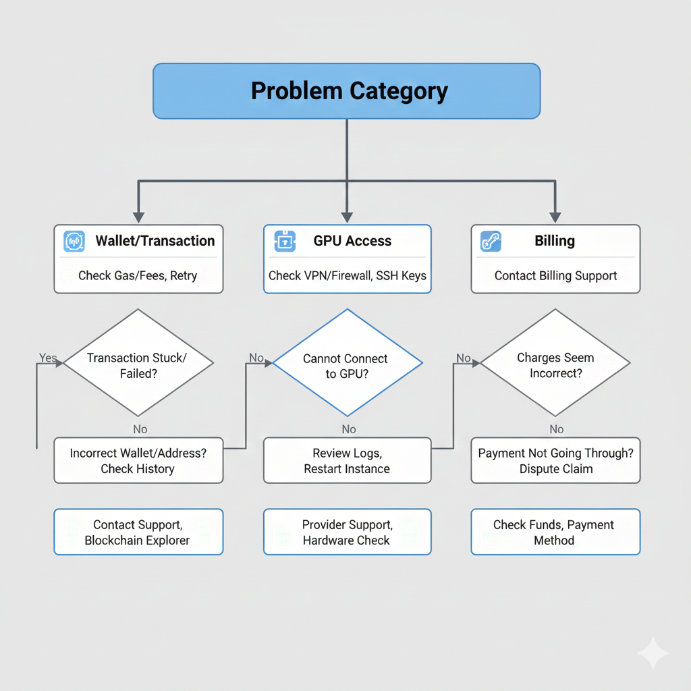

---

## कर और विनियामक विचार

क्रिप्टोकरेंसी लेनदेन अधिकांश न्यायालयों में कर रिपोर्टिंग दायित्व बनाते हैं। GPU रेंटल व्यावसायिक व्यय के विचार जोड़ता है।

**अस्वीकरण:** यह खंड सामान्य जानकारी प्रदान करता है, कर सलाह नहीं। अपनी विशिष्ट स्थिति के लिए योग्य कर पेशेवरों से परामर्श लें।

### क्रिप्टोकरेंसी कर की मूल बातें

अधिकांश कर प्राधिकरण क्रिप्टोकरेंसी को संपत्ति मानते हैं, मुद्रा नहीं। यह लेनदेन पर कर घटनाएं (tax events) बनाता है।

**कर योग्य घटनाओं में शामिल हैं:**

- फिएट मुद्रा को क्रिप्टोकरेंसी में परिवर्तित करना (लागत आधार स्थापित करता है)
- एक क्रिप्टोकरेंसी को दूसरे के लिए व्यापार करना (पूंजीगत लाभ/हानि)
- GPU रेंटल जैसी सेवाओं पर क्रिप्टोकरेंसी खर्च करना (पूंजीगत लाभ/हानि)
- आय के रूप में क्रिप्टोकरेंसी प्राप्त करना (साधारण आय)

### व्यावसायिक व्यय के रूप में GPU रेंटल

यदि व्यावसायिक उद्देश्यों के लिए GPU किराये पर लिया जाता है, तो रेंटल लागत आमतौर पर कटौती योग्य (deductible) व्यय है।

**व्यवसायों और स्वरोजगार के लिए:**

- GPU रेंटल लागत साधारण व्यावसायिक व्यय के रूप में कटौती करती है
- भुगतान के लिए उपयोग की जाने वाली क्रिप्टोकरेंसी व्यय कटौती को नहीं बदलती है
- भुगतान के समय क्रिप्टोकरेंसी के उचित बाजार मूल्य (fair market value) की गणना करनी चाहिए
- रिकॉर्ड बनाए रखें: रेंटल रसीदें, लेनदेन हैश, तारीख, USD मूल्य

**निवेशकों और व्यापारियों के लिए:**

- निवेश के प्रबंधन के लिए GPU रेंटल निवेश व्यय के रूप में अर्हता प्राप्त कर सकता है
- क्षेत्राधिकार के अनुसार उपचार काफी भिन्न होता है

### रिकॉर्ड रखने की आवश्यकताएं

कर अनुपालन और ऑडिट रक्षा के लिए उचित दस्तावेज आवश्यक है।

**इनके रिकॉर्ड बनाए रखें:**

**क्रिप्टोकरेंसी अधिग्रहण:**

- खरीद की तारीख और समय
- अधिग्रहित क्रिप्टोकरेंसी की मात्रा
- स्थानीय मुद्रा में खरीद मूल्य
- उपयोग किया गया एक्सचेंज या प्लेटफॉर्म

**GPU रेंटल लेनदेन:**

- प्लेटफॉर्म का नाम और रेंटल विवरण
- रेंटल की तारीख और अवधि
- खर्च की गई क्रिप्टोकरेंसी राशि
- लेनदेन के समय USD/स्थानीय मुद्रा समकक्ष
- ब्लॉकचेन पर लेनदेन हैश
- रेंटल का व्यावसायिक उद्देश्य

**अनुशंसित उपकरण:**

- CoinTracker, Koinly, या समान क्रिप्टो कर सॉफ़्टवेयर
- ये एक्सचेंज लेनदेन आयात करते हैं और स्वचालित रूप से लाभ की गणना करते हैं

### सीमा पार विचार (Cross-Border Considerations)

क्रिप्टोकरेंसी की सीमाहीन प्रकृति जटिल कर परिदृश्य बनाती है।

**प्लेटफॉर्म स्थान बनाम उपयोगकर्ता स्थान:**

- आपके कर दायित्व आपके निवास/नागरिकता पर निर्भर करते हैं
- उपयोगकर्ता कर के लिए प्लेटफॉर्म स्थान आम तौर पर अप्रासंगिक होता है
- गैर-अमेरिकी उपयोगकर्ता आमतौर पर विदेशी प्लेटफॉर्म लेनदेन पर अमेरिकी करों का भुगतान नहीं करते हैं

**रिपोर्टिंग थ्रेसहोल्ड:**

- कई देशों को थ्रेसहोल्ड से ऊपर क्रिप्टोकरेंसी होल्डिंग्स की रिपोर्टिंग की आवश्यकता होती है
- यूएस: यदि विदेशी खाते $10,000 से अधिक हैं तो FBAR फाइलिंग आवश्यक है

**सेवाओं पर वैट/जीएसटी:**

- कुछ क्षेत्राधिकार डिजिटल सेवाओं पर उपभोग कर (consumption tax) लगाते हैं
- B2B लेनदेन रिवर्स-चार्ज हो सकते हैं (ग्राहक वैट का भुगतान करता है)
- क्रिप्टोकरेंसी भुगतान उपभोग करों से छूट नहीं देता है

### KYC और गोपनीयता निहितार्थ

नो-KYC प्लेटफॉर्म गोपनीयता प्रदान करते हैं लेकिन दस्तावेज़ीकरण चुनौतियां पैदा करते हैं।

**कर प्राधिकरण की अपेक्षाएं:**

- आपको प्लेटफॉर्म रिपोर्टिंग की परवाह किए बिना आय और लाभ की रिपोर्ट करनी होगी
- "उन्होंने मुझे फॉर्म नहीं भेजा" एक कानूनी कर बचाव रणनीति नहीं है
- ऑडिट में सबूत का बोझ करदाता पर आता है

**ऑडिट जोखिम कारक:**

- न्यूनतम रिपोर्ट किए गए लाभ के साथ बड़ी क्रिप्टोकरेंसी होल्डिंग्स
- रिपोर्ट की गई आय के साथ असंगत जीवनशैली
- कर अधिकारियों के साथ क्रिप्टोकरेंसी एक्सचेंज सूचना साझाकरण

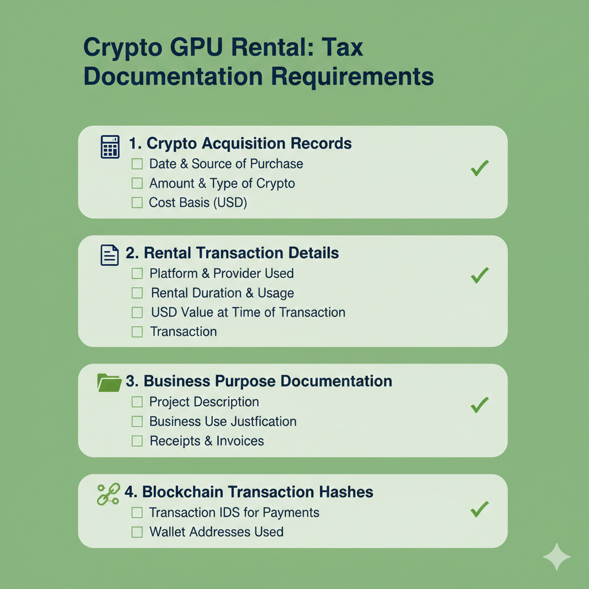

---

## क्रिप्टोकरेंसी GPU रेंटल का भविष्य

क्रिप्टोकरेंसी भुगतान और GPU रेंटल का अभिसरण (convergence) तेज हो रहा है। कई रुझान बाजार के विकास को आकार देंगे।

### विकेन्द्रीकृत कंप्यूट नेटवर्क

वर्तमान GPU रेंटल प्लेटफॉर्म आपूर्ति को केंद्रीय रूप से एकत्रित करते हैं। उभरते प्रोटोकॉल इस मध्यस्थ को पूरी तरह से समाप्त कर देते हैं।

**Render Network, Akash Network, Golem:**

- स्मार्ट कॉन्ट्रैक्ट्स पर काम करने वाले पूरी तरह से विकेन्द्रीकृत मार्केटप्लेस
- प्रदाता संसाधनों को सीधे ब्लॉकचेन पर सूचीबद्ध करते हैं
- किराएदार प्रोटोकॉल टोकन के माध्यम से खोजते हैं और भुगतान करते हैं
- कोई प्लेटफॉर्म ऑपरेटर नहीं—कोड सभी इंटरैक्शन में मध्यस्थता करता है

**पूर्ण विकेंद्रीकरण के लाभ:**

- प्लेटफॉर्म जोखिम का उन्मूलन (शटडाउन, नीति परिवर्तन)
- वैश्विक सेंसरशिप प्रतिरोध
- संभावित रूप से कम शुल्क (कोई केंद्रीय ऑपरेटर नहीं)

**प्रक्षेपवक्र (Trajectory):** जैसे-जैसे प्रोटोकॉल परिपक्व होते हैं और इंटरफेस में सुधार होता है, विकेन्द्रीकृत कंप्यूट केंद्रीकृत प्लेटफॉर्म से बढ़ता बाजार हिस्सा हासिल करेगा।

### DeFi इकोसिस्टम के साथ एकीकरण

क्रिप्टोकरेंसी GPU रेंटल तेजी से विकेन्द्रीकृत वित्त (DeFi) के साथ जुड़ता है।

**उपज देने वाला संपार्श्विक (Yield-bearing collateral):**

- स्टेबलकॉइन्स जमा करें, उपज अर्जित करें, GPU रेंटल पर ब्याज खर्च करें
- Aave जैसे प्रोटोकॉल आज इसे सक्षम करते हैं
- इसके लिए बड़े पूंजी आधार की आवश्यकता होती है लेकिन जेब से खर्च समाप्त हो जाता है

**NFT-गेटेड एक्सेस:**

- रियायती GPU मूल्य निर्धारण तक पहुंचने के लिए विशिष्ट NFT होल्ड करें
- गैर-हस्तांतरणीय NFT के रूप में प्रदाता प्रतिष्ठा
- क्रेडेंशियल सिस्टम के रूप में ऑन-चेन संग्रहीत रेंटल इतिहास

**DAO-संचालित प्रदाता:**

- समुदाय के स्वामित्व वाला GPU बुनियादी ढांचा
- टोकन धारक मूल्य निर्धारण, प्रदाता मानकों और प्लेटफॉर्म विकास पर वोट करते हैं

### गोपनीयता-संरक्षण गणना

वर्तमान GPU रेंटल के लिए डेटा एक्सेस के साथ प्रदाताओं पर भरोसा करने की आवश्यकता होती है। क्रिप्टोग्राफ़िक प्रगति गोपनीयता-संरक्षण विकल्प सक्षम करती है।

**गोपनीय कंप्यूटिंग (Confidential computing):**

- हार्डवेयर-एन्क्रिप्टेड सुरक्षित एन्क्लेव (AMD SEV, Intel SGX)
- प्रदाता संसाधित किए जा रहे डेटा तक नहीं पहुंच सकता

**होमोमोर्फिक एन्क्रिप्शन:**

- डिक्रिप्शन के बिना एन्क्रिप्टेड डेटा पर गणना
- परिणाम एन्क्रिप्टेड रहते हैं जब तक कि ग्राहक डिक्रिप्ट न कर दे
- वर्तमान में व्यावहारिक ML प्रशिक्षण के लिए बहुत धीमा है, लेकिन अनुसंधान आगे बढ़ रहा है

**शून्य-ज्ञान प्रमाण (Zero-knowledge proofs):**

- इनपुट का खुलासा किए बिना साबित करें कि गणना सही ढंग से पूरी हो गई है
- संवेदनशील डेटा पर सत्यापन योग्य गणना को सक्षम बनाता है
- zkML (शून्य-ज्ञान मशीन लर्निंग) उभरता हुआ क्षेत्र

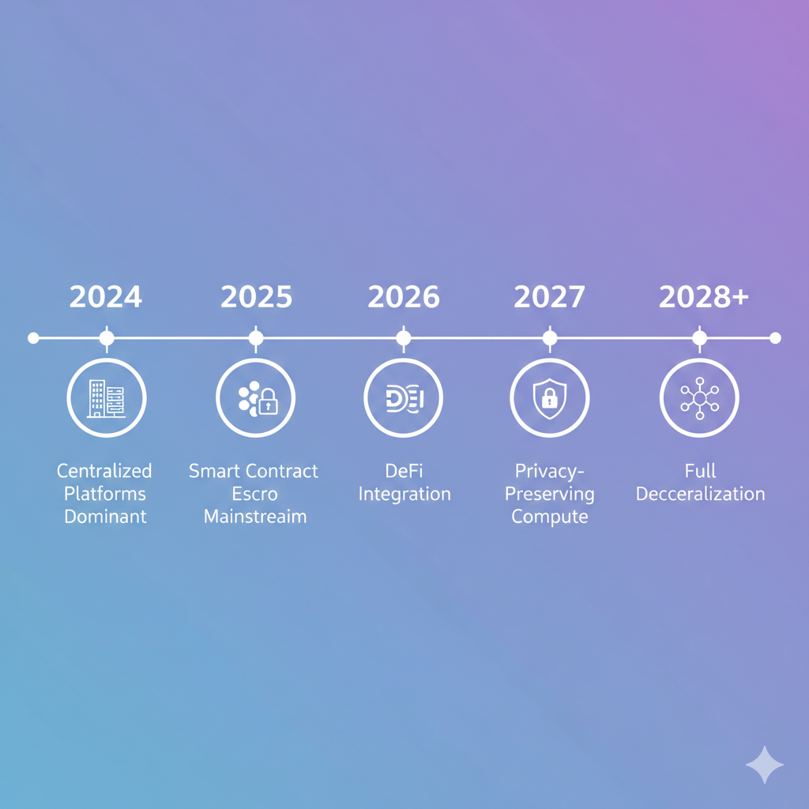

---

## प्लेटफॉर्म-विशिष्ट क्विक स्टार्ट गाइड्स

सबसे लोकप्रिय क्रिप्टोकरेंसी-स्वीकार्य GPU रेंटल प्लेटफॉर्म के लिए चरण-दर-चरण निर्देश।

### GPUFlow क्विक स्टार्ट

**आवश्यक समय:** 5 मिनट
**पूर्वापेक्षाएँ:** MetaMask वॉलेट, पॉलीगॉन नेटवर्क पर $20+ MATIC या USDC

**चरण 1: वॉलेट कनेक्ट करें**

- gpuflow.app पर जाएं
- "Connect Wallet" (ऊपर दाईं ओर) पर क्लिक करें
- MetaMask चुनें, कनेक्शन को मंजूरी दें

**चरण 2: फंड जमा करें**

- वॉलेट पता ड्रॉपडाउन पर क्लिक करें
- "Deposit Funds" चुनें
- टोकन (MATIC, USDC, ETH) चुनें
- राशि दर्ज करें, "Deposit" पर क्लिक करें
- MetaMask में लेनदेन को मंजूरी दें (गैस फीस ~$0.02)

**चरण 3: GPU चुनें**

- मार्केटप्लेस ब्राउज़ करें या फ़िल्टर का उपयोग करें
- विवरण देखने के लिए किसी भी लिस्टिंग पर क्लिक करें
- प्रदाता रेटिंग की समीक्षा करें
- "Rent Now" पर क्लिक करें

**चरण 4: रेंटल शुरू करें**

- रेंटल अवधि निर्दिष्ट करें या "hourly" चुनें
- "Confirm Rental" पर क्लिक करें
- MetaMask में एस्क्रो लेनदेन को मंजूरी दें
- पुष्टि की प्रतीक्षा करें (~15 सेकंड)

**चरण 5: GPU एक्सेस करें**

- "Open Terminal" बटन दिखाई देता है
- वेब-आधारित SSH टर्मिनल खोलने के लिए क्लिक करें

**चरण 6: रेंटल पूरा करें**

- समाप्त होने पर "Stop Rental" पर क्लिक करें
- समाप्ति की पुष्टि करें
- अप्रयुक्त शेष राशि स्वचालित रूप से वॉलेट में वापस आ जाती है

### Vast.ai क्विक स्टार्ट

**आवश्यक समय:** 10 मिनट
**पूर्वापेक्षाएँ:** कोई नहीं—प्रक्रिया के दौरान खाता बनाएं

**चरण 1: खाता बनाएं**

- vast.ai पर जाएं, "Sign Up" पर क्लिक करें

**चरण 2: क्रिप्टोकरेंसी के माध्यम से क्रेडिट जोड़ें**

- Account → Billing पर नेविगेट करें
- "Add Credit" पर क्लिक करें और "Cryptocurrency" चुनें
- मुद्रा (BTC, ETH, USDC) चुनें
- CoinPayments गेटवे के माध्यम से भुगतान पूरा करें
- 2-6 पुष्टिकरणों के बाद क्रेडिट दिखाई देता है

**चरण 3: GPUs खोजें**

- GPU मॉडल, मूल्य, VRAM द्वारा फ़िल्टर करें
- चुने हुए GPU पर "Rent" पर क्लिक करें

**चरण 4: इंस्टेंस एक्सेस करें**

- 30-60 सेकंड के बाद इंस्टेंस स्थिति "Running" दिखाती है
- SSH विवरण के लिए "Connect" पर क्लिक करें

### क्रिप्टो के साथ RunPod क्विक स्टार्ट

**आवश्यक समय:** 15 मिनट

**चरण 1: RunPod खाता बनाएं**

- runpod.io पर जाएं और साइन अप करें

**चरण 2: क्रिप्टो फंड जोड़ें**

- Billing → "Add Funds" पर नेविगेट करें
- "Cryptocurrency" चुनें
- क्रिप्टो (Coinbase Commerce के माध्यम से BTC, ETH, USDC) चुनें
- भुगतान पूरा करें

**चरण 3: GPU पॉड चुनें**

- "GPU Instances" → "Deploy" पर क्लिक करें
- GPU प्रकार और टेम्प्लेट चुनें
- "Deploy" पर क्लिक करें

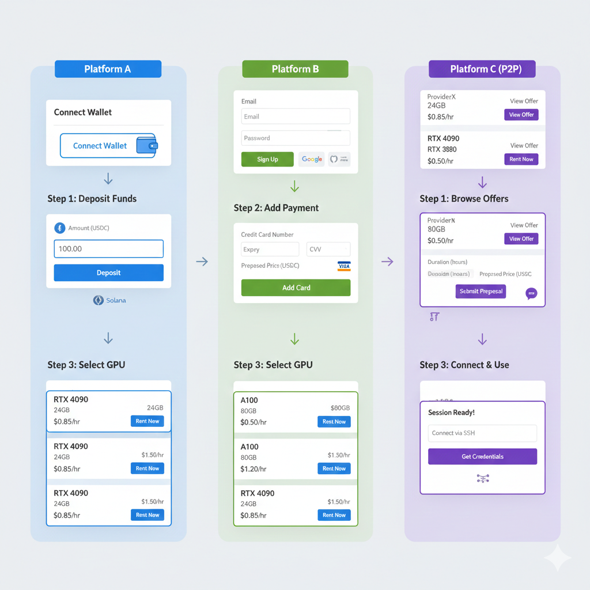

---

## निष्कर्ष

क्रिप्टोकरेंसी भुगतान के साथ GPU कंप्यूटिंग पावर किराये पर लेना लागत दक्षता, गोपनीयता और तेजी से पहुंच को जोड़ता है। इकोसिस्टम काफी परिपक्व हो गया है—2022 में तकनीकी विशेषज्ञता की आवश्यकता अब बुनियादी क्रिप्टोकरेंसी वॉलेट के साथ सहज किसी भी व्यक्ति के लिए सुलभ है।

### मुख्य निष्कर्ष

**क्रिप्टोकरेंसी भुगतान उन बाधाओं को दूर करते हैं** जो कई उपयोगकर्ताओं के लिए पारंपरिक क्लाउड GPU एक्सेस को मुश्किल बनाते हैं। अधिकांश प्लेटफॉर्म के लिए कोई क्रेडिट कार्ड की आवश्यकता नहीं है, कोई KYC सत्यापन नहीं है, और कोई भौगोलिक प्रतिबंध नहीं है। एक वॉलेट और क्रिप्टोकरेंसी बैलेंस कंप्यूटिंग संसाधनों तक वैश्विक पहुंच प्रदान करते हैं।

**लागत लाभ वास्तविक हैं लेकिन संदर्भ-निर्भर हैं।** पीयर-टू-पीयर मार्केटप्लेस AWS या Azure की तुलना में 60-80% बचत प्रदान करते हैं। GPUFlow जैसे क्रिप्टो-नेतेव प्लेटफॉर्म कम ओवरहेड के कारण कम प्लेटफॉर्म शुल्क (10-15%) लेते हैं। पॉलीगॉन जैसे आधुनिक नेटवर्क पर लेनदेन शुल्क नगण्य हैं।

**स्मार्ट कॉन्ट्रैक्ट एस्क्रो मौलिक रूप से विश्वास की गतिशीलता को बदल देता है।** ऑपरेटरों पर फंड रखने का भरोसा करने के बजाय, ब्लॉकचेन-आधारित कोड भुगतान का प्रबंधन करता है। रेंटल पूरा होने पर भुगतान स्वचालित रूप से जारी होता है, और लेनदेन सत्यापन योग्य रहते हैं।

**गोपनीयता लाभ जिम्मेदारी के साथ आते हैं।** नो-KYC प्लेटफॉर्म छद्म नाम प्रदान करते हैं, लेकिन ब्लॉकचेन पारदर्शिता का मतलब है कि लेनदेन दिखाई दे रहे हैं। कर दायित्व प्लेटफॉर्म रिपोर्टिंग की परवाह किए बिना मौजूद हैं। सुरक्षा पूरी तरह से उपयोगकर्ताओं पर आती है—खोई हुई निजी कुंजी को ग्राहक सेवा द्वारा पुनर्प्राप्त नहीं किया जा सकता है।

### शुरुआत के लिए सिफारिश

सबसे कम जोखिम वाला प्रवेश बिंदु: पॉलीगॉन नेटवर्क पर USDC में $20-30 जमा करें, GPUFlow या Vast.ai पर 2-3 घंटे के लिए RTX 4090 किराये पर लें, और एक वास्तविक वर्कलोड पूरा करें। यह न्यूनतम लागत और समय प्रतिबद्धता पर क्रिप्टोकरेंसी GPU रेंटल के साथ सीधा अनुभव प्रदान करता है।

सभी शुल्कों सहित कुल जेब से खर्च: लगभग $25। यह क्रिप्टोकरेंसी अधिग्रहण, नेटवर्क शुल्क, और 3 घंटे के GPU समय को कवर करता है जो एक छोटे मॉडल को प्रशिक्षित करने या पर्याप्त अनुमान वर्कलोड चलाने के लिए पर्याप्त है।

### संबंधित लेख

**इस साइट से:**

- [GPU रेंटल मूल्य निर्धारण तुलना 2026](/hi/gpu-rental-pricing-comparison-2026/)
- [Stable Diffusion LoRA मॉडल को $10 से कम में कैसे प्रशिक्षित करें](/hi/stable-diffusion-lora-training/)
- [RunPod बनाम Vast.ai: विस्तृत तुलना](/hi/runpod-vs-vastai-comparison/)

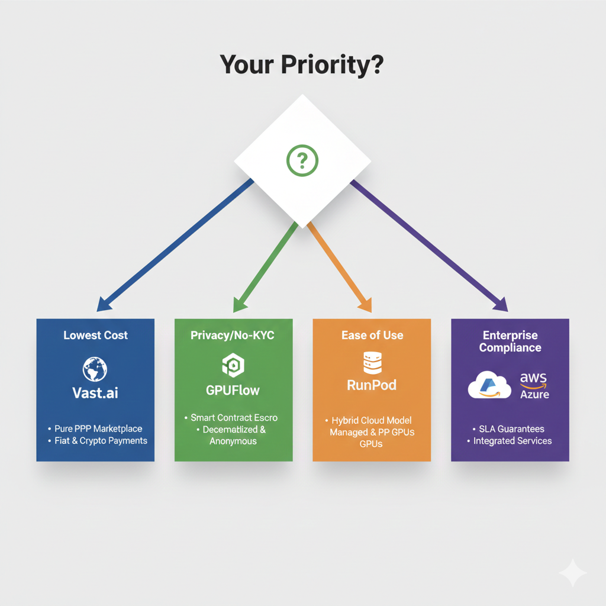

---

## अक्सर पूछे जाने वाले प्रश्न (FAQ)

### क्या मैं क्रिप्टोकरेंसी से GPU किराये पर ले सकता हूं?

हां। GPUFlow, Vast.ai और RunPod सहित कई प्लेटफॉर्म क्रिप्टो स्वीकार करते हैं। भुगतान विकल्पों में आमतौर पर बिटकॉइन, एथेरियम और USDC जैसे स्टेबलकॉइन्स शामिल हैं। GPUFlow पूरी तरह से ब्लॉकचेन-आधारित भुगतान पर काम करता है।

### क्या क्रिप्टो के साथ GPU किराये पर लेने के लिए मुझे KYC सत्यापन की आवश्यकता है?

आवश्यकताएं अलग-अलग होती हैं। GPUFlow और Vast.ai को आमतौर पर बुनियादी रेंटल के लिए पहचान सत्यापन की आवश्यकता नहीं होती है। आप वॉलेट कनेक्ट कर सकते हैं और तुरंत शुरू कर सकते हैं। RunPod को कुछ सुविधाओं के लिए KYC की आवश्यकता हो सकती है।

### क्या क्रिप्टोकरेंसी के साथ GPU किराये पर लेना अधिक महंगा है?

नहीं। अक्सर कम प्लेटफॉर्म शुल्क (GPUFlow पर 10-15%) होता है। आप क्रेडिट कार्ड प्रोसेसिंग फीस से बचते हैं, लेकिन ब्लॉकचेन नेटवर्क फीस का भुगतान करते हैं (पॉलीगॉन पर बहुत कम)।

### स्मार्ट कॉन्ट्रैक्ट एस्क्रो कैसे काम करता है?

कॉन्ट्रैक्ट आपके भुगतान को कोड में लॉक कर देता है जिसे कोई भी पक्ष सीधे नियंत्रित नहीं करता है। रेंटल के अंत में, कॉन्ट्रैक्ट स्वचालित रूप से प्रदाता को भुगतान जारी करता है। यह प्लेटफॉर्म ऑपरेटर पर भरोसा करने की आवश्यकता को समाप्त करता है।

### क्या क्रिप्टो GPU रेंटल लेनदेन कर योग्य हैं?

हां, अधिकांश क्षेत्राधिकारों में। क्रिप्टो को संपत्ति माना जाता है, और इसे सेवाओं पर खर्च करना एक कर घटना है जो पूंजीगत लाभ/हानि पैदा करती है। रेंटल लागत को व्यावसायिक व्यय के रूप में मान्यता दी जा सकती है।

### क्या नो-KYC प्लेटफॉर्म का उपयोग करना सुरक्षित है?

नो-KYC प्लेटफॉर्म रेंटल उद्देश्यों के लिए सुरक्षित हैं, लेकिन जोखिम में प्लेटफॉर्म की लंबी उम्र शामिल है। फंड के लिए जोखिम केवल सक्रिय रेंटल अवधि के दौरान मौजूद होता है जब वे एस्क्रो में होते हैं। जरूरत न होने पर कभी भी बड़ी शेष राशि जमा न करें।

---

**क्रिप्टोकरेंसी के साथ अपना पहला GPU किराये पर लेने के लिए तैयार हैं?** [GPUFlow](https://gpuflow.app) स्मार्ट कॉन्ट्रैक्ट एस्क्रो, प्रतिस्पर्धी मूल्य निर्धारण और बिना किसी KYC आवश्यकताओं के साथ तत्काल पहुंच प्रदान करता है। अपने वॉलेट को कनेक्ट करें और 60 सेकंड से भी कम समय में कंप्यूटिंग शुरू करें।
