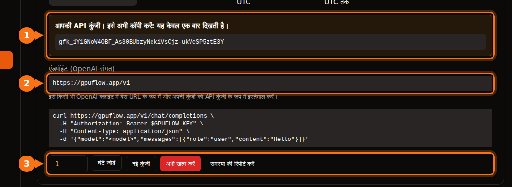

कई AI टूल आपको OpenAI की जगह कोई दूसरा प्रदाता लगाने देते हैं, बशर्ते वह वही API सपोर्ट करता हो। आपको हमेशा यही तीन चीज़ें चाहिए:

| क्या | उदाहरण |
| --- | --- |
| **Base URL** (इसे API base, endpoint या host भी कहते हैं) | `https://gpuflow.app/v1` |
| **API key** | `gfk_...` |
| **मॉडल का नाम** | `qwen2.5:7b` |

पूरे लेख में हम उदाहरण के तौर पर GPUFlow का किराया इस्तेमाल करते हैं, लेकिन किसी भी OpenAI-compatible सर्वर के लिए कदम यही हैं: लोकल Ollama या llama.cpp, vLLM, OpenRouter और कई दूसरे। बस तीनों वैल्यू बदल दें।

GPUFlow पर GPU किराये पर लेने के बाद तीनों चीज़ें आपको **डैशबोर्ड → वर्तमान किराये** पर मिलती हैं:



## शुरू करने से पहले: endpoint और मॉडल का नाम जाँचें

एक कमांड से पता चल जाता है कि key काम करती है या नहीं, और मॉडल का नाम क्या है:

```bash
curl https://gpuflow.app/v1/models \
  -H "Authorization: Bearer gfk_your_key"
```

जवाब में मॉडल की सूची आती है। `id` को, जैसे `qwen2.5:7b`, ठीक वैसे ही कॉपी करें जैसा लिखा है। ऐप के काम न करने की सबसे आम वजह मॉडल का ग़लत नाम होता है।

**जानें कि आपका endpoint क्या-क्या सपोर्ट करता है।** GPUFlow का endpoint `/v1/models` और `/v1/chat/completions` देता है, streaming के साथ। यह embeddings, नया Responses API या इमेज बनाना नहीं देता। कुछ ऐप फ़ीचर को इनकी ज़रूरत होती है, और नीचे हम उन्हें बताते हैं।

## चैट ऐप

### Open WebUI

1. **Settings → Admin → Connections** खोलें।
2. **Manage OpenAI API Connections** के नीचे **+ (Add Connection)** पर क्लिक करें।
3. भरें:
   - **URL:** `https://gpuflow.app/v1`
   - **API Key:** आपकी key
4. टेस्ट करने के लिए **Verify Connection** पर क्लिक करें (सिर्फ़ सेव करने से टेस्ट नहीं होता), फिर **Save**।

Open WebUI मॉडल की सूची `/models` से ख़ुद पढ़ लेता है। अगर आप इसे Docker के साथ चलाते हैं, तो इसकी जगह `OPENAI_API_BASE_URL` और `OPENAI_API_KEY` सेट कर सकते हैं, लेकिन ये सिर्फ़ तब पढ़े जाते हैं जब Open WebUI पहली बार शुरू होता है। उसके बाद इन्हें admin स्क्रीन में बदलें।

Open WebUI में दस्तावेज़ अपलोड और खोज एक छोटे embedding मॉडल से चलते हैं जो डिफ़ॉल्ट रूप से लोकल चलता है, इसलिए ये काम करते रहते हैं। embedding engine को OpenAI पर स्विच करके उसके URL में अपना चैट endpoint न डालें।

### LibreChat

`librechat.yaml` में एक custom endpoint जोड़ें:

```yaml
endpoints:
  custom:
    - name: "GPUFlow"
      apiKey: "${GPUFLOW_API_KEY}"
      baseURL: "https://gpuflow.app/v1"
      models:
        default: ["qwen2.5:7b"]
        fetch: true
      titleConvo: true
      titleModel: "qwen2.5:7b"
      modelDisplayLabel: "GPUFlow"
```

अपनी key को `.env` में `GPUFLOW_API_KEY=gfk_...` के रूप में रखें। अगर हर यूज़र को अपनी key डालनी है, तो `apiKey: "user_provided"` इस्तेमाल करें। `fetch: true` के साथ LibreChat मॉडल की सूची endpoint से पढ़ता है।

LibreChat की दस्तावेज़ खोज (RAG API) डिफ़ॉल्ट रूप से OpenAI embeddings इस्तेमाल करती है। इसे OpenAI, Ollama या Hugging Face पर ही रहने दें; `RAG_OPENAI_BASEURL` को सिर्फ़ चैट वाले endpoint पर पॉइंट न करें।

### AnythingLLM

1. LLM सेटिंग खोलें और **Generic OpenAI** चुनें।
2. **Base URL** (`https://gpuflow.app/v1`), **API Key**, **Chat Model Name** (`qwen2.5:7b`), **Token context window** और **Max Tokens** भरें।

Docker के साथ यही सेटिंग environment variables के रूप में होती हैं:

```bash
LLM_PROVIDER='generic-openai'
GENERIC_OPEN_AI_BASE_PATH='https://gpuflow.app/v1'
GENERIC_OPEN_AI_MODEL_PREF='qwen2.5:7b'
GENERIC_OPEN_AI_MODEL_TOKEN_LIMIT=32768
GENERIC_OPEN_AI_API_KEY=gfk_your_key
```

embedder को **AnythingLLM Default** पर ही रहने दें।

### Jan

1. **Settings → Model Providers** खोलें और **Add Provider** पर क्लिक करें।
2. **OpenAI-compatible** चुनें।
3. एक नाम, आख़िर में `/v1` के साथ **Base URL**, और अपनी **API key** डालें। **Create** पर क्लिक करें।

सेव करते ही Jan मॉडल की सूची लोड कर लेता है। अगर न करे, तो प्रदाता की मॉडल सूची में **+** बटन से मॉडल का नाम ख़ुद जोड़ दें।

## कोडिंग असिस्टेंट

### Continue (VS Code और JetBrains)

अपनी `config.yaml` में एक मॉडल जोड़ें:

```yaml
models:
  - name: GPUFlow Qwen 2.5 7B
    provider: openai
    model: qwen2.5:7b
    apiBase: https://gpuflow.app/v1
    apiKey: ${{ secrets.GPUFLOW_API_KEY }}
    roles:
      - chat
      - edit
      - apply
```

इसे `autocomplete` और `embed` roles न दें: यह endpoint सिर्फ़ chat देता है, और embeddings को `/v1/embeddings` चाहिए। VS Code में Continue के पास codebase खोज के लिए built-in embedder है। JetBrains में नहीं है, इसलिए वहाँ अलग से एक embeddings मॉडल सेट करें।

Continue के Agent मोड को ऐसा मॉडल चाहिए जो tool calls संभाल सके। `capabilities: [tool_use]` तभी जोड़ें जब आपको पता हो कि आपका मॉडल यह करता है।

### Cline

1. Cline की सेटिंग खोलें।
2. **API Provider** को **OpenAI Compatible** पर सेट करें।
3. **Base URL**, **API Key** और **Model** (`qwen2.5:7b`) भरें।
4. **Model Configuration** के नीचे context window को [अपने मॉडल के हिसाब से](/hi/which-ai-models-fit-your-gpu-vram/) सेट करें।

**Roo Code** के बारे में एक बात: इसके docs कहते हैं कि यह सिर्फ़ उन मॉडल के साथ काम करता है जो native tool calling सपोर्ट करते हैं, कोई fallback नहीं है। एक सामान्य चैट endpoint इसके साथ शायद काम न करे।

## कोड

### OpenAI की Python और Node libraries

Python (`pip install openai`):

```python
from openai import OpenAI

client = OpenAI(base_url="https://gpuflow.app/v1", api_key="gfk_your_key")

reply = client.chat.completions.create(
    model="qwen2.5:7b",
    messages=[{"role": "user", "content": "Say hello in five languages."}],
)
print(reply.choices[0].message.content)
```

Node (`npm install openai`):

```js
import OpenAI from "openai";

const client = new OpenAI({ baseURL: "https://gpuflow.app/v1", apiKey: "gfk_your_key" });

const reply = await client.chat.completions.create({
  model: "qwen2.5:7b",
  messages: [{ role: "user", content: "Say hello in five languages." }],
});
console.log(reply.choices[0].message.content);
```

दोनों libraries environment से `OPENAI_BASE_URL` और `OPENAI_API_KEY` भी पढ़ती हैं। ध्यान दें कि इनके README अब `client.responses.create(...)` से शुरू होते हैं। वह Responses API है; ऊपर की तरह `client.chat.completions.create(...)` इस्तेमाल करें।

### LangChain

Python (`pip install -U langchain-openai`):

```python
from langchain_openai import ChatOpenAI

llm = ChatOpenAI(
    model="qwen2.5:7b",
    base_url="https://gpuflow.app/v1",
    api_key="gfk_your_key",
    use_responses_api=False,
)
print(llm.invoke("Name three uses for a GPU.").content)
```

JavaScript (`npm install @langchain/openai @langchain/core`)। पहले अपनी key environment में सेट करें, `export OPENAI_API_KEY=gfk_your_key`, फिर:

```js
import { ChatOpenAI } from "@langchain/openai";

const llm = new ChatOpenAI({
  model: "qwen2.5:7b",
  configuration: { baseURL: "https://gpuflow.app/v1" },
});
```

कुछ फ़ीचर इस्तेमाल करने पर, जैसे built-in tools या reasoning output, LangChain Responses API पर चला जाता है। `use_responses_api=False` इसे Chat Completions पर ही रखता है।

### LlamaIndex

`OpenAILike` इस्तेमाल करें (`pip install llama-index-llms-openai-like`):

```python
from llama_index.llms.openai_like import OpenAILike

llm = OpenAILike(
    model="qwen2.5:7b",
    api_base="https://gpuflow.app/v1",
    api_key="gfk_your_key",
    context_window=32768,
    is_chat_model=True,
    is_function_calling_model=False,
)
```

**`is_chat_model=True` सेट करें।** इसका डिफ़ॉल्ट `False` है, जिससे अनुरोध `/v1/chat/completions` की जगह `/v1/completions` पर जाते हैं। दस्तावेज़ों को index करने के लिए `Settings.embed_model` को किसी असली embedding मॉडल पर सेट करें; LlamaIndex डिफ़ॉल्ट रूप से OpenAI embeddings इस्तेमाल करता है।

## वे टूल जो सिर्फ़ चैट वाले endpoint के साथ काम नहीं करेंगे

- **Codex CLI.** इसने 2026 की शुरुआत में Chat Completions का सपोर्ट हटा दिया और अब सिर्फ़ Responses API स्वीकार करता है।
- **OpenAI Agents SDK.** यह डिफ़ॉल्ट रूप से Responses API इस्तेमाल करता है। `set_default_openai_api("chat_completions")` कॉल करें, या अपने client को `OpenAIChatCompletionsModel` में लपेटें, और `set_tracing_disabled(True)` से tracing बंद करें, क्योंकि tracing को OpenAI key चाहिए।
- **हर वह चीज़ जिसे उसी endpoint से embeddings चाहिए:** दस्तावेज़ खोज, "अपनी फ़ाइलों से चैट", semantic code search। ऐप का built-in embedder या अलग embeddings प्रदाता इस्तेमाल करें।

## अगर फिर भी काम न करे

| आपको क्या दिखता है | आम वजह |
| --- | --- |
| `404` या "not found" | base URL में `/v1` नहीं है, या ऐप ख़ुद `/v1` जोड़ता है और आपने उसे दोबारा जोड़ दिया। |
| `401` या `invalid_api_key` | ग़लत key, या किराया ख़त्म हो चुका है। GPUFlow पर, अगर key खो गई है तो वर्तमान किराये पर **नई कुंजी** पर क्लिक करें। |
| "Model not found" | मॉडल का नाम `/v1/models` से हूबहू मेल नहीं खाता। |
| `/v1/completions` या `/v1/responses` पर अनुरोध फ़ेल होते हैं | ऐप कोई दूसरा API इस्तेमाल कर रहा है। "chat model" या "chat completions" वाली सेटिंग ढूँढें। |

## संबंधित लेख

- [घंटे के हिसाब से GPU या प्रति token API? 7B–8B मॉडल चलाने की असली लागत](/hi/hourly-gpu-vs-per-token-api/)
- [GPUFlow vs Vast.ai vs RunPod vs SaladCloud: आपके काम के लिए कौन-सा सही है](/hi/gpuflow-vs-vast-ai-vs-runpod/)

## स्रोत

सभी की जाँच सितंबर 2026 में की गई।

- Open WebUI: [OpenAI-compatible प्रदाता](https://docs.openwebui.com/getting-started/quick-start/connect-a-provider/starting-with-openai-compatible/), [environment variables](https://docs.openwebui.com/reference/env-configuration)
- LibreChat: [custom endpoints](https://www.librechat.ai/docs/configuration/librechat_yaml/object_structure/custom_endpoint), [RAG API](https://www.librechat.ai/docs/configuration/rag_api)
- AnythingLLM: [Generic OpenAI](https://docs.anythingllm.com/setup/llm-configuration/cloud/openai-generic)
- Jan: [custom endpoints](https://www.jan.ai/docs/desktop/remote-models/custom-endpoint)
- Continue: [OpenAI प्रदाता](https://docs.continue.dev/customize/model-providers/top-level/openai), [config reference](https://docs.continue.dev/reference)
- Cline: [OpenAI Compatible](https://docs.cline.bot/provider-config/openai-compatible); Roo Code: [OpenAI Compatible](https://roocodeinc.github.io/Roo-Code/providers/openai-compatible/)
- OpenAI libraries: [openai-python](https://github.com/openai/openai-python), [openai-node](https://github.com/openai/openai-node)
- LangChain: [Python](https://docs.langchain.com/oss/python/integrations/chat/openai), [JavaScript](https://docs.langchain.com/oss/javascript/integrations/chat/openai)
- LlamaIndex: [OpenAILike](https://developers.llamaindex.ai/python/framework-api-reference/llms/openai_like/)
- OpenAI Agents SDK: [मॉडल](https://openai.github.io/openai-agents-python/models/)
- Codex और Chat Completions: [github.com/openai/codex/discussions/7782](https://github.com/openai/codex/discussions/7782)
- GPUFlow API: [अपनी API key इस्तेमाल करें](https://docs.gpuflow.app/hi/renters/api-quickstart/)
