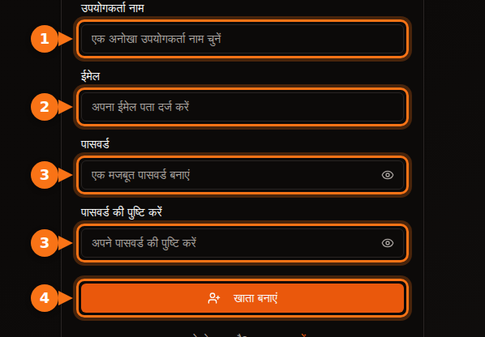
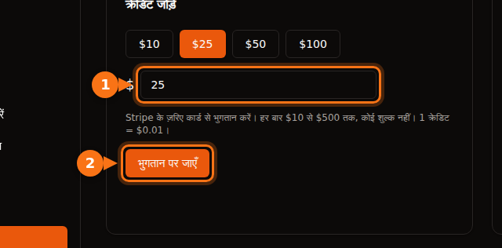

पहला GPU किराये पर लेने से पहले हर प्लेटफ़ॉर्म कुछ न कुछ माँगता है: ईमेल पता, कार्ड, कभी-कभी फ़ोन नंबर, और बड़े clouds पर quota का अनुरोध जिसमें कई दिन लग सकते हैं। यह लेख बताता है कि हर प्लेटफ़ॉर्म क्या माँगता है, ताकि आप ऐसा प्लेटफ़ॉर्म चुन सकें जिस पर आज ही शुरुआत हो जाए।

सब कुछ सितंबर 2026 में प्लेटफ़ॉर्म के अपने docs पर जाँचा गया। स्रोत आख़िर में हैं।

## एक नज़र में तुलना

| प्लेटफ़ॉर्म | खाता बनाने के लिए | किराये पर लेने से पहले | किरायेदारों के लिए ID जाँच | शुरू करने के लिए न्यूनतम |
| --- | --- | --- | --- | --- |
| **GPUFlow** | ईमेल और पासवर्ड, या Google या GitHub | अपना ईमेल कन्फ़र्म करें, कार्ड से क्रेडिट जोड़ें | किरायेदार के चरणों में कोई नहीं | $10 टॉप-अप, कोई शुल्क नहीं |
| **Vast.ai** | ईमेल | अपना ईमेल वेरिफ़ाई करें, क्रेडिट जोड़ें | docs में नहीं | $5 डिपॉज़िट |
| **RunPod** | ईमेल | क्रेडिट जोड़ें | सिर्फ़ पहले crypto भुगतान से पहले | 1 घंटे का क्रेडिट; prepaid कार्ड से हर ट्रांज़ैक्शन में $100 |
| **SaladCloud** | Portal खाता | अपने organization में भुगतान का तरीका जोड़ें | docs में नहीं | $5 से टॉप-अप |
| **Lambda** | खाता | क्रेडिट कार्ड जोड़ें | docs में नहीं | कार्ड पर $10 का pre-authorization, लौटाया जाता है |
| **TensorDock** | खाता | पैसे जमा करें | शर्तें खाते की जाँच की अनुमति देती हैं | "सिर्फ़ $5 से" |
| **AWS** | ईमेल, फ़ोन PIN जाँच, भुगतान का तरीका, CAPTCHA | GPU quota का अनुरोध करें: नए खाते 0 से शुरू होते हैं | ज़्यादातर खातों के लिए नहीं | Pay as you go |
| **Google Cloud** | बिलिंग वाला खाता | GPU quota का अनुरोध करें; free-trial खातों को कोई quota नहीं मिलता | ज़्यादातर खातों के लिए नहीं | Pay as you go |

"docs में नहीं" का मतलब है कि हमें उस प्लेटफ़ॉर्म के दस्तावेज़ों में किरायेदारों के लिए कोई ID शर्त नहीं मिली। कुछ असामान्य दिखे तो प्लेटफ़ॉर्म फिर भी जाँच माँग सकते हैं।

## छोटे प्लेटफ़ॉर्म: दिन नहीं, मिनट

Vast.ai, RunPod, SaladCloud, TensorDock और GPUFlow सभी prepaid हैं। आप पहले पैसे डालते हैं और उन्हें सेकंड या मिनट के हिसाब से ख़र्च करते हैं। चूँकि आप ऐसा बिल नहीं बना सकते जिसका भुगतान न किया हो, इसलिए उन्हें आपकी क्रेडिट हिस्ट्री या आपकी कंपनी की जाँच की ज़रूरत नहीं पड़ती।

इनमें फ़र्क़ इन बातों में है:

- **ईमेल वेरिफ़िकेशन।** Vast.ai और GPUFlow दोनों किराये पर लेने या क्रेडिट जोड़ने से पहले इसे ज़रूरी बनाते हैं। अगर ईमेल न आए तो spam फ़ोल्डर देखें।
- **भुगतान के तरीके।**
  - Vast.ai: कार्ड, BitPay, Crypto.com।
  - RunPod: Visa, Mastercard, Amex, crypto, और $5,000 से ऊपर के भुगतान के लिए invoice।
  - SaladCloud: कार्ड, या Solana पर USDC, USDT और RENDER।
  - Lambda: सिर्फ़ प्रमुख क्रेडिट कार्ड, और सिर्फ़ समर्थित देशों में।
  - GPUFlow: Stripe के ज़रिए कार्ड।
- **इस्तेमाल न होने पर आपके पैसे का क्या होता है।** SaladCloud का क्रेडिट ख़रीद के 12 महीने बाद ख़त्म हो जाता है। GPUFlow के क्रेडिट कभी ख़त्म नहीं होते।

## बड़े clouds: quota के अनुरोध की तैयारी रखें

AWS और Google Cloud आपको साइन-अप पर नहीं रोकते। रोक GPU लेते समय लगती है।

- **AWS:** नए खातों पर "Running On-Demand G and VT instances" (वह instance family जिसमें NVIDIA L4 और A10G हैं) का quota **0 vCPU** से शुरू होता है। ज़्यादा के लिए आप Service Quotas console में अनुरोध करते हैं। खाते का इस्तेमाल बढ़ने के साथ AWS quota अपने-आप भी बढ़ाता है।
- **Google Cloud:** free-trial खातों को कोई GPU quota नहीं मिलता। प्रोजेक्ट की बिलिंग हिस्ट्री बन जाने के बाद quota के अनुरोध ज़्यादा आसानी से मंज़ूर होते हैं। quota हर region के लिए अलग है, और preemptible GPU के लिए अपना अलग quota चाहिए।

अगर आपको आज ही GPU चाहिए, तो नए AWS या Google Cloud खाते से शुरुआत न करें।

## GPUFlow पर साइन-अप, कदम-दर-कदम

GPUFlow "मुझे पाँच मिनट में AI मॉडल चाहिए" वाली स्थिति के लिए बना है। आपको मिलती है एक GPU के लिए OpenAI-compatible API key, मशीन नहीं।

1. **gpuflow.app पर खाता बनाएँ**, यूज़रनेम, अपने ईमेल पते और पासवर्ड से, या Google या GitHub से।

   

2. **अपना ईमेल कन्फ़र्म करें।** GPUFlow जो ईमेल भेजता है, उसमें दिए लिंक पर क्लिक करें। ऐसा किए बिना आप क्रेडिट नहीं जोड़ सकते।
3. **डैशबोर्ड → भुगतान** पर **क्रेडिट जोड़ें**, Stripe के ज़रिए कार्ड से $10 से $500 तक। 1 क्रेडिट = $0.01, और कोई शुल्क नहीं।

   

4. **जितने घंटे चाहिए उतने के लिए GPU किराये पर लें**, और अपनी API key कॉपी करें। [आप सेकंड के हिसाब से भुगतान करते हैं](/hi/per-second-vs-hourly-gpu-billing/); अगर जल्दी ख़त्म करते हैं, तो बाक़ी आपके क्रेडिट में लौट आता है।

हर स्क्रीन के साथ पूरी गाइड docs में है: [GPU किराये पर लें, कदम-दर-कदम](https://docs.gpuflow.app/hi/renters/getting-started/)।

## अगर आप इसकी बजाय GPU किराये पर देना चाहते हैं

पहचान की जाँच वहीं आती है जहाँ आपको भुगतान मिलता है। भुगतान कंपनियों के लिए यह जानना ज़रूरी है कि वे पैसा किसे भेज रही हैं।

- **GPUFlow:** कमाई निकालने के लिए आप Stripe के साथ payout खाता सेट करते हैं, जो आपकी पहचान जाँचता है और आपके बैंक का ब्योरा माँगता है। Payouts अमेरिका, कनाडा, यूनाइटेड किंगडम, स्विट्ज़रलैंड और यूरोपियन इकोनॉमिक एरिया में काम करते हैं।
- **Vast.ai:** hosts को Wise, PayPal या Stripe के ज़रिए भुगतान होता है, और पहचान की जाँच यही सेवाएँ करती हैं।
- **Salad:** rewards PayPal, गिफ़्ट कार्ड और दूसरे विकल्पों से दिए जाते हैं।

hosting से कितनी कमाई होती है, इस पर और जानकारी [आपका गेमिंग GPU कितना कमा सकता है](/hi/how-much-can-you-earn-renting-out-your-gpu/) में है।

## भुगतान से पहले: एक छोटी चेकलिस्ट

1. **पहले अपना ईमेल कन्फ़र्म करें**, ताकि भुगतान वाले चरण पर अटकें नहीं।
2. **देखें कि आपका देश और कार्ड समर्थित हैं।** उदाहरण के लिए, Lambda सिर्फ़ कुछ तय देशों से भुगतान स्वीकार करता है।
3. **अपने बैंक का विदेशी ट्रांज़ैक्शन शुल्क जानें।** ज़्यादातर प्लेटफ़ॉर्म अमेरिकी डॉलर में चार्ज करते हैं। [छिपी लागतों के बारे में और जानें](/hi/hidden-fees-in-gpu-rental/)।
4. **छोटी शुरुआत करें।** कुछ घंटों लायक पैसे डालें, टेस्ट करें, फिर और जोड़ें।

## संबंधित लेख

- [GPUFlow vs Vast.ai vs RunPod vs SaladCloud: आपके काम के लिए कौन-सा सही है](/hi/gpuflow-vs-vast-ai-vs-runpod/)
- [Open WebUI, Continue, LangChain और दूसरे टूल में OpenAI-compatible API key कैसे इस्तेमाल करें](/hi/use-openai-compatible-api-key-in-apps/)

## स्रोत

सभी की जाँच सितंबर 2026 में की गई।

- GPUFlow: [GPU किराये पर लें, कदम-दर-कदम](https://docs.gpuflow.app/hi/renters/getting-started/), [क्रेडिट और बिलिंग](https://docs.gpuflow.app/hi/renters/billing/), [भुगतान पाना](https://docs.gpuflow.app/hi/providers/getting-paid/)
- Vast.ai: [quickstart](https://docs.vast.ai/guides/get-started/quickstart.md), [बिलिंग](https://docs.vast.ai/documentation/reference/billing), [host payouts](https://docs.vast.ai/host/payment.md)
- RunPod: [बिलिंग जानकारी](https://docs.runpod.io/references/billing-information)
- SaladCloud: [खाता सेटअप](https://docs.salad.com/general/tutorials/account-setup.md), [बिलिंग](https://docs.salad.com/general/explanation/billing.md)
- Lambda: [बिलिंग मैनेज करना](https://docs.lambda.ai/public-cloud/manage-billing/)
- TensorDock: [cloud GPUs](https://www.tensordock.com/cloud-gpus.html), [सेवा की शर्तें](https://docs.tensordock.com/legal-information/terms-of-service-tos)
- AWS: [खाता बनाना](https://docs.aws.amazon.com/accounts/latest/reference/manage-acct-creating.html), [On-Demand instance quotas](https://docs.aws.amazon.com/AWSEC2/latest/UserGuide/ec2-on-demand-instances.html)
- Google Cloud: [GPU quota की समस्याएँ हल करना](https://docs.cloud.google.com/deep-learning-vm/docs/troubleshooting)
- Salad rewards: [PayPal redemption](https://support.salad.com/rewards/redeeming-your-rewards/how-to-redeem-paypal/)
