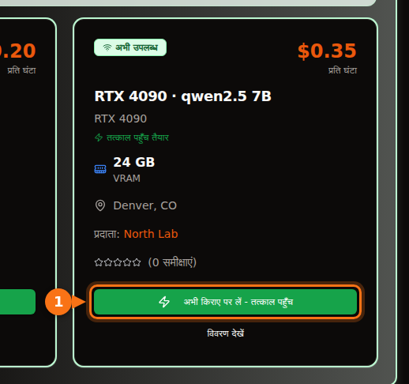

Ollama जिस 4-bit quantization को डिफ़ॉल्ट रूप से देता है, उस पर 7B या 8B मॉडल के लिए 8 GB का कार्ड चाहिए, 12B से 14B मॉडल के लिए 12 GB (लंबे prompt चाहिए तो 16 GB), और 27B से 32B मॉडल के लिए 24 GB। 4-bit पर 70B मॉडल 43 GB का है, यानी 48 GB या उससे ज़्यादा VRAM।

विस्तार से समझना इसलिए ज़रूरी है कि डाउनलोड साइज़ पूरा हिसाब नहीं है। आप जो context इस्तेमाल करते हैं, वह भी मेमोरी लेता है, और जो मॉडल देखने में फ़िट लगता है, वह आधा CPU पर पहुँचकर कई गुना धीमा हो सकता है। नीचे वह फ़ॉर्मूला है जो मैं इस्तेमाल करता हूँ, quantization के लेबल का मतलब, और मौजूदा open मॉडल की एक टेबल, जिसमें Ollama library से लिए गए असली डाउनलोड साइज़ हैं। साइज़ और specs सितंबर 2026 में जाँचे गए; स्रोत आख़िर में हैं।

## VRAM के हिसाब से छोटा जवाब

| VRAM | आम कार्ड | GPU पर पूरी तरह क्या चलता है (4-bit) |
| --- | --- | --- |
| 8 GB | RTX 4060, RTX 5060, RTX 3070 | 7B से 8B मॉडल: Llama 3.1 8B, Qwen3 8B, Mistral 7B |
| 12 GB | RTX 3060 12 GB, RTX 4070, RTX 5070 | छोटे context पर 12B से 14B मॉडल; Q8_0 पर 7B से 8B |
| 16 GB | RTX 4060 Ti 16 GB, RTX 4080, RTX 5080 | लंबे context के साथ 14B, gpt-oss 20B |
| 24 GB | RTX 3090, RTX 4090 | 24B से 32B: Mistral Small 3.2, Gemma 3 27B, Qwen3 32B |
| 32 GB | RTX 5090 | लंबे context के साथ 32B, 35B mixture-of-experts मॉडल |
| 48 से 80 GB | L40S (48 GB), H100 (80 GB) | 4-bit पर 70B, 80 GB पर gpt-oss 120B |

कार्ड की मेमोरी NVIDIA के spec पेजों से ली गई है। कुछ कार्ड दो वर्ज़न में आते हैं: RTX 3060 12 GB और 8 GB में मिलता है, और RTX 4060 Ti और RTX 5060 Ti 16 GB और 8 GB में। ख़रीदने या किराये पर लेने से पहले देख लें कि कौन-सा वर्ज़न है।

## किसी मॉडल के लिए VRAM का अंदाज़ा कैसे लगाएँ

जब मॉडल आपको जवाब दे रहा होता है, तब GPU मेमोरी में तीन चीज़ें होती हैं:

1. **weights।** parameters × bits per weight ÷ 8 = bytes।
2. **KV cache।** मॉडल बातचीत के हर token के keys और values रखता है, ताकि उन्हें दोबारा न निकालना पड़े। प्रति token यह 2 × layers × KV heads × head size × 2 bytes है (डिफ़ॉल्ट 16-bit cache पर)। इसे context की लंबाई से गुणा करें।
3. **overhead।** CUDA context, scratch buffers और ख़ुद runtime। मैं इसके लिए लगभग 1 GB रखता हूँ। यह engine और सेटिंग के हिसाब से बदलता है, इसलिए इसे अंदाज़ा मानें, spec नहीं।

layers और heads की संख्या Hugging Face पर हर मॉडल की `config.json` में मिलती है।

### उदाहरण: 16 GB कार्ड पर Qwen 2.5 14B

Qwen 2.5 14B में 14.7 अरब parameters, 48 layers, 8 KV heads और 128 का head size है (5,120 hidden size ÷ 40 attention heads)।

- **Q4_K_M पर weights:** llama.cpp के मुताबिक़ Q4_K_M लगभग 4.89 bits per weight है। 14.7 अरब × 4.89 ÷ 8 = 8.99 GB। Ollama का `qwen2.5:14b` डाउनलोड 9.0 GB है, यानी हिसाब असली फ़ाइल से मेल खाता है।
- **प्रति token KV cache:** 2 × 48 × 8 × 128 × 2 bytes = 1,96,608 bytes, लगभग 0.2 MB।
- **पूरे context का KV cache:** 4,096 token = 0.8 GB। 16,384 token = 3.2 GB। 32,768 token = 6.4 GB।
- **कुल:** 4K context पर 9.0 + 0.8 + 1 = 10.8 GB। 16K पर 9.0 + 3.2 + 1 = 13.2 GB। 32K पर 9.0 + 6.4 + 1 = 16.4 GB, जो 16 GB कार्ड में नहीं आता।

<figure>
<svg viewBox="0 0 720 340" role="img" aria-labelledby="d1-title" xmlns="http://www.w3.org/2000/svg" font-family="system-ui, sans-serif" font-size="15">
<title id="d1-title">16 GB कार्ड पर Q4_K_M वाले Qwen 2.5 14B से VRAM कैसे भरता है: weights, तीन context लंबाइयों पर KV cache, और overhead</title>
<rect x="0" y="0" width="720" height="340" fill="#ffffff"/>
<rect x="150" y="20" width="16" height="16" rx="3" fill="#6366f1"/>
<text x="172" y="33" fill="#1e1b4b">weights 9.0 GB</text>
<rect x="330" y="20" width="16" height="16" rx="3" fill="#a5b4fc"/>
<text x="352" y="33" fill="#1e1b4b">KV cache</text>
<rect x="510" y="20" width="16" height="16" rx="3" fill="#e2e8f0"/>
<text x="532" y="33" fill="#1e1b4b">overhead ~1 GB</text>
<line x1="582.0" y1="66" x2="582.0" y2="278" stroke="#f97316" stroke-width="2" stroke-dasharray="5 4"/>
<text x="576.0" y="60" text-anchor="end" fill="#f97316" font-weight="600">16 GB कार्ड</text>
<text x="140" y="106" text-anchor="end" fill="#1e1b4b">4K context</text>
<rect x="150" y="80" width="243.0" height="40" fill="#6366f1"/>
<text x="271.5" y="106" text-anchor="middle" fill="#ffffff">weights</text>
<rect x="393.0" y="80" width="21.6" height="40" fill="#a5b4fc"/>
<rect x="414.6" y="80" width="27.0" height="40" fill="#e2e8f0"/>
<text x="449.6" y="106" fill="#16a34a" font-weight="600">10.8 GB</text>
<text x="140" y="180" text-anchor="end" fill="#1e1b4b">16K context</text>
<rect x="150" y="154" width="243.0" height="40" fill="#6366f1"/>
<text x="271.5" y="180" text-anchor="middle" fill="#ffffff">weights</text>
<rect x="393.0" y="154" width="86.4" height="40" fill="#a5b4fc"/>
<text x="436.2" y="180" text-anchor="middle" fill="#1e1b4b">3.2</text>
<rect x="479.4" y="154" width="27.0" height="40" fill="#e2e8f0"/>
<text x="514.4" y="180" fill="#16a34a" font-weight="600">13.2 GB</text>
<text x="140" y="254" text-anchor="end" fill="#1e1b4b">32K context</text>
<rect x="150" y="228" width="243.0" height="40" fill="#6366f1"/>
<text x="271.5" y="254" text-anchor="middle" fill="#ffffff">weights</text>
<rect x="393.0" y="228" width="172.8" height="40" fill="#a5b4fc"/>
<text x="479.4" y="254" text-anchor="middle" fill="#1e1b4b">6.4</text>
<rect x="565.8" y="228" width="27.0" height="40" fill="#e2e8f0"/>
<text x="600.8" y="254" fill="#f97316" font-weight="600">16.4 GB</text>
<line x1="150" y1="278" x2="690" y2="278" stroke="#64748b"/>
<line x1="150.0" y1="278" x2="150.0" y2="283" stroke="#64748b"/>
<text x="150.0" y="300" text-anchor="middle" fill="#64748b">0</text>
<line x1="258.0" y1="278" x2="258.0" y2="283" stroke="#64748b"/>
<text x="258.0" y="300" text-anchor="middle" fill="#64748b">4</text>
<line x1="366.0" y1="278" x2="366.0" y2="283" stroke="#64748b"/>
<text x="366.0" y="300" text-anchor="middle" fill="#64748b">8</text>
<line x1="474.0" y1="278" x2="474.0" y2="283" stroke="#64748b"/>
<text x="474.0" y="300" text-anchor="middle" fill="#64748b">12</text>
<line x1="582.0" y1="278" x2="582.0" y2="283" stroke="#64748b"/>
<text x="582.0" y="300" text-anchor="middle" fill="#64748b">16</text>
<line x1="690.0" y1="278" x2="690.0" y2="283" stroke="#64748b"/>
<text x="690.0" y="300" text-anchor="middle" fill="#64748b">20</text>
<text x="420.0" y="326" text-anchor="middle" fill="#64748b">VRAM (GB में)</text>
</svg>
<figcaption>16 GB कार्ड पर Q4_K_M वाला Qwen 2.5 14B। weights 9.0 GB पर स्थिर रहते हैं; KV cache context के साथ बढ़ता है, और 32K token पर कुल 16 GB से ऊपर चला जाता है। overhead अंदाज़े से 1 GB रखा गया है।</figcaption>
</figure>

इससे दो बातें निकलती हैं। पहली, आप जो context सेट करते हैं, वह मॉडल जितनी ही मेमोरी ले सकता है। Llama 3.1 8B (32 layers, 8 KV heads, head size 128) को प्रति token 1,31,072 bytes KV cache चाहिए, इसलिए इसके पूरे 128K context के लिए अकेले cache में 17.2 GB लगेंगे, जो इसके 4.9 GB डाउनलोड का लगभग साढ़े तीन गुना है। दूसरी, प्रति token KV cache का साइज़ मॉडल-दर-मॉडल बहुत बदलता है। Qwen 2.5 7B में सिर्फ़ 4 KV heads और 28 layers हैं, इसलिए इसे प्रति token 57,344 bytes चाहिए, Llama 3.1 8B के आधे से भी कम। मान लेने से पहले config देख लें।

### Ollama डिफ़ॉल्ट रूप से context के साथ क्या करता है

Ollama उपलब्ध VRAM देखकर डिफ़ॉल्ट context चुनता है: 24 GiB से कम पर 4K token, 24 से 48 GiB पर 32K token, और 48 GiB या उससे ज़्यादा पर 256K। इसे `OLLAMA_CONTEXT_LENGTH` environment variable से बदला जा सकता है, और `ollama ps` अपने CONTEXT कॉलम में असल में दिया गया context दिखाता है। दो और सेटिंग हिसाब बदल देती हैं:

- `OLLAMA_NUM_PARALLEL` (डिफ़ॉल्ट 1): Ollama के docs कहते हैं कि parallel अनुरोध context का साइज़ उतने गुना बढ़ा देते हैं जितने parallel अनुरोध हों। चार parallel slot मतलब चार गुना KV cache।
- `OLLAMA_KV_CACHE_TYPE`: `q8_0` डिफ़ॉल्ट `f16` cache की लगभग आधी मेमोरी लेता है, `q4_0` लगभग एक-चौथाई। इसके लिए flash attention चालू होना चाहिए।

## quantization के स्तरों का मतलब

open मॉडल 16-bit precision में प्रकाशित होते हैं (नीचे लिंक की गई configs में bfloat16 लिखा है): प्रति parameter दो bytes। quantization weights को कम bits में रखता है। GGUF फ़ाइलों में, जो format Ollama और llama.cpp इस्तेमाल करते हैं, लेबल का मोटा मतलब यह है:

| लेबल | bits per weight | Llama 3.1 8B का साइज़ | Llama 3 8B पर perplexity (कम बेहतर) |
| --- | --- | --- | --- |
| F16 | 16.0 | 14.96 GiB | 6.233 |
| Q8_0 | 8.50 | 7.95 GiB | 6.234 |
| Q6_K | 6.56 | 6.14 GiB | 6.253 |
| Q5_K_M | 5.70 | 5.33 GiB | 6.289 |
| Q4_K_M | 4.89 | 4.58 GiB | 6.407 |
| Q3_K_M | 4.00 | 3.74 GiB | 6.888 |
| Q2_K_S / Q2_K | 2.97 | 2.78 GiB | 9.752 (Q2_K) |

bits per weight और साइज़ llama.cpp के quantize README (Llama 3.1 8B) से हैं। perplexity llama.cpp के perplexity README (Llama 3 8B, Wikitext) से है। "K" वाले type llama.cpp के k-quants हैं, जो मॉडल के अलग-अलग हिस्सों में अलग precision रखते हैं; `_S`, `_M` और `_L` छोटे, मध्यम और बड़े मिश्रण हैं।

आँकड़े क्या कहते हैं: Q8_0 व्यवहार में बिना नुकसान के है (perplexity 6.234, जबकि F16 पर 6.233)। Q4_K_M से perplexity लगभग 3% बढ़ती है, और उसी README के मुताबिक़ इसका सबसे संभावित अगला token 91.9% बार full-precision मॉडल से मेल खाता है। Q3 साफ़ तौर पर ख़राब है, और Q2 पर मॉडल बिखर जाता है।

perplexity और उपयोगिता एक चीज़ नहीं हैं, इसलिए Uygar Kurt की जनवरी 2026 की स्टडी काम की है। उन्होंने Llama 3.1 8B Instruct को हर llama.cpp स्तर पर reasoning, knowledge, instruction-following और truthfulness benchmarks से गुज़ारा। बिना वेटेज वाला औसत F16 पर 69.47, Q8_0 पर 69.41, Q5_K_M पर 69.36 और Q4_K_M पर 69.15 रहा। यही वजह है कि लगभग सभी, Ollama समेत, डिफ़ॉल्ट रूप से Q4_K_M रखते हैं: फ़ाइल FP16 के एक-तिहाई से भी छोटी होती है, और नुकसान ऐसा जो शायद ही कभी दिखे। Ollama पर सादा tag यही 4-bit build है: `qwen3:8b` और `qwen3:8b-q4_K_M` दोनों 5.2 GB के हैं, `phi4:14b` और `phi4:14b-q4_K_M` दोनों 9.1 GB के।

मेरा नियम: Q8_0 पर छोटा मॉडल लेने से पहले Q4_K_M पर सबसे बड़ा फ़िट होने वाला मॉडल लें। Q4 पर 14B आमतौर पर Q8 पर 7B से बेहतर रहता है, और फ़ाइलें लगभग एक जितनी बड़ी होती हैं। Q5 या Q8 पर तब जाएँ जब मेमोरी बच रही हो और काम छोटी गलतियों के प्रति संवेदनशील हो, जैसे code या सटीक extraction।

नए Ollama tags में `qat` (Gemma के quantization-aware trained build), `nvfp4` और `mxfp8` जैसे format भी हैं। gpt-oss ख़ुद OpenAI की तरफ़ से MXFP4 में आता है, mixture-of-experts weights के लिए 4.25 bits per parameter पर।

## कौन-से मॉडल फ़िट होते हैं: साइज़ और VRAM स्तर

टेबल में सितंबर 2026 तक Ollama library के मौजूदा open मॉडल और उनके डाउनलोड साइज़ हैं। "4-bit" कॉलम डिफ़ॉल्ट tag का साइज़ है। ज़्यादातर मॉडल में यह वही फ़ाइल है जो `q4_K_M` tag की है; जहाँ डिफ़ॉल्ट कोई अलग build है, वहाँ टेबल दोनों साइज़ देती है (Mistral Nemo का डिफ़ॉल्ट 7.1 GB है, उसका `q4_K_M` 7.5 GB)। "सबसे छोटा कार्ड" का मतलब है कि मॉडल, लगभग 1 GB overhead और 4K से 8K context पूरी तरह GPU पर आ जाते हैं। लंबा context चाहिए? एक स्तर ऊपर जाएँ।

| मॉडल | Ollama tag | 4-bit साइज़ | Q8_0 साइज़ | सबसे छोटा कार्ड (4-bit / Q8_0) |
| --- | --- | --- | --- | --- |
| Mistral 7B v0.3 | [`mistral:7b`](https://ollama.com/library/mistral/tags) | 4.4 GB | 7.7 GB | 8 GB / 12 GB |
| Qwen 2.5 7B | [`qwen2.5:7b`](https://ollama.com/library/qwen2.5/tags) | 4.7 GB | 8.1 GB | 8 GB / 12 GB |
| DeepSeek-R1 distill 7B (Qwen 2.5) | [`deepseek-r1:7b`](https://ollama.com/library/deepseek-r1/tags) | 4.7 GB | जाँचा नहीं | 8 GB |
| Llama 3.1 8B | [`llama3.1:8b`](https://ollama.com/library/llama3.1/tags) | 4.9 GB | 8.5 GB | 8 GB / 12 GB |
| Qwen3 8B | [`qwen3:8b`](https://ollama.com/library/qwen3/tags) | 5.2 GB | 8.9 GB | 8 GB / 12 GB |
| DeepSeek-R1-0528 (Qwen3 8B) | [`deepseek-r1:8b`](https://ollama.com/library/deepseek-r1/tags) | 5.2 GB | जाँचा नहीं | 8 GB |
| Qwen3.5 9B | [`qwen3.5:9b`](https://ollama.com/library/qwen3.5/tags) | 6.6 GB | 11 GB | 8 GB, सिर्फ़ छोटा context / 16 GB |
| Mistral Nemo 12B | [`mistral-nemo:12b`](https://ollama.com/library/mistral-nemo/tags) | 7.1 GB (q4_K_M: 7.5 GB) | 13 GB | 12 GB / 16 GB |
| Gemma 4 12B | [`gemma4:12b`](https://ollama.com/library/gemma4/tags) | 7.6 GB | 13 GB | 12 GB / 16 GB |
| Gemma 3 12B | [`gemma3:12b`](https://ollama.com/library/gemma3/tags) | 8.1 GB | 13 GB | 12 GB / 16 GB |
| Qwen 2.5 14B | [`qwen2.5:14b`](https://ollama.com/library/qwen2.5/tags) | 9.0 GB | 16 GB | 12 GB / 24 GB |
| DeepSeek-R1 distill 14B (Qwen 2.5) | [`deepseek-r1:14b`](https://ollama.com/library/deepseek-r1/tags) | 9.0 GB | जाँचा नहीं | 12 GB |
| Phi-4 14B | [`phi4:14b`](https://ollama.com/library/phi4/tags) | 9.1 GB | 16 GB | 12 GB / 24 GB |
| Qwen3 14B | [`qwen3:14b`](https://ollama.com/library/qwen3/tags) | 9.3 GB | 16 GB | 12 GB / 24 GB |
| gpt-oss 20B (MoE) | [`gpt-oss:20b`](https://ollama.com/library/gpt-oss/tags) | 14 GB (MXFP4) | लागू नहीं | 16 GB |
| Mistral Small 3.2 24B | [`mistral-small3.2:24b`](https://ollama.com/library/mistral-small3.2/tags) | 15 GB | 26 GB | 24 GB / 32 GB |
| Gemma 3 27B | [`gemma3:27b`](https://ollama.com/library/gemma3/tags) | 17 GB | 30 GB | 24 GB / 48 GB |
| Qwen3.5 27B | [`qwen3.5:27b`](https://ollama.com/library/qwen3.5/tags) | 17 GB | 30 GB | 24 GB / 48 GB |
| Qwen3.6 27B | [`qwen3.6:27b`](https://ollama.com/library/qwen3.6/tags) | 18 GB (q4_K_M: 17 GB) | 30 GB | 24 GB / 48 GB |
| Gemma 4 26B (MoE, 3.8B active) | [`gemma4:26b`](https://ollama.com/library/gemma4/tags) | 19 GB (q4_K_M: 18 GB) | 28 GB | 24 GB / 32 GB |
| Qwen3 30B-A3B (MoE) | [`qwen3:30b`](https://ollama.com/library/qwen3/tags) | 19 GB | जाँचा नहीं | 24 GB |
| Gemma 4 31B | [`gemma4:31b`](https://ollama.com/library/gemma4/tags) | 20 GB | 34 GB | 24 GB / 48 GB |
| Qwen3 32B | [`qwen3:32b`](https://ollama.com/library/qwen3/tags) | 20 GB | 35 GB | 24 GB / 48 GB |
| Qwen 2.5 32B | [`qwen2.5:32b`](https://ollama.com/library/qwen2.5/tags) | 20 GB | 35 GB | 24 GB / 48 GB |
| DeepSeek-R1 distill 32B (Qwen 2.5) | [`deepseek-r1:32b`](https://ollama.com/library/deepseek-r1/tags) | 20 GB | जाँचा नहीं | 24 GB |
| Qwen3.6 35B-A3B (MoE) | [`qwen3.6:35b`](https://ollama.com/library/qwen3.6/tags) | 23 GB (q4_K_M: 24 GB) | 39 GB | 32 GB / 48 GB |
| Qwen3.5 35B-A3B (MoE) | [`qwen3.5:35b`](https://ollama.com/library/qwen3.5/tags) | 24 GB | 39 GB | 32 GB / 48 GB |
| Llama 3.3 70B | [`llama3.3:70b`](https://ollama.com/library/llama3.3/tags) | 43 GB | 75 GB | 48 GB, मुश्किल से / 80 GB, मुश्किल से |
| Qwen 2.5 72B | [`qwen2.5:72b`](https://ollama.com/library/qwen2.5/tags) | 47 GB | जाँचा नहीं | 80 GB |
| gpt-oss 120B (MoE) | [`gpt-oss:120b`](https://ollama.com/library/gpt-oss/tags) | 65 GB (MXFP4) | लागू नहीं | 80 GB |

स्तर तय करने के लिए मैंने डिफ़ॉल्ट tag का साइज़ लिया है, क्योंकि छोटे नाम से `ollama pull` करने पर वही डाउनलोड होता है।

24 GB और 32 GB कार्ड वाले स्तरों में एक पेच है। 24 GiB पर Ollama का डिफ़ॉल्ट context 4K से सीधे 32K हो जाता है, इसलिए RTX 4090 पर 20 GB के मॉडल को 32K का cache मिल सकता है, जो उसके साथ मेमोरी में नहीं आता। अगर `ollama ps` में CPU का हिस्सा दिखे, तो context छोटा करें। और मॉडल को उसके नाम में लिखे नंबर से न आँकें: Gemma 4 का edge मॉडल `gemma4:e4b` (4.5B effective parameters) 9.6 GB का डाउनलोड है, जो 7.6 GB वाले `gemma4:12b` से बड़ा है। साइज़ देखें।

<figure>
<svg viewBox="0 0 720 546" role="img" aria-labelledby="d2-title" xmlns="http://www.w3.org/2000/svg" font-family="system-ui, sans-serif" font-size="14">
<title id="d2-title">लोकप्रिय Ollama मॉडल का डिफ़ॉल्ट 4-bit quantization पर डाउनलोड साइज़, 8, 12, 16, 24 और 32 GB VRAM की तुलना में</title>
<rect x="0" y="0" width="720" height="546" fill="#ffffff"/>
<line x1="320.0" y1="58" x2="320.0" y2="486" stroke="#f97316" stroke-width="2" stroke-dasharray="5 4"/>
<text x="320.0" y="50" text-anchor="middle" fill="#f97316" font-weight="600">8 GB</text>
<line x1="380.0" y1="58" x2="380.0" y2="486" stroke="#f97316" stroke-width="2" stroke-dasharray="5 4"/>
<text x="380.0" y="50" text-anchor="middle" fill="#f97316" font-weight="600">12 GB</text>
<line x1="440.0" y1="58" x2="440.0" y2="486" stroke="#f97316" stroke-width="2" stroke-dasharray="5 4"/>
<text x="440.0" y="50" text-anchor="middle" fill="#f97316" font-weight="600">16 GB</text>
<line x1="560.0" y1="58" x2="560.0" y2="486" stroke="#f97316" stroke-width="2" stroke-dasharray="5 4"/>
<text x="560.0" y="50" text-anchor="middle" fill="#f97316" font-weight="600">24 GB</text>
<line x1="680.0" y1="58" x2="680.0" y2="486" stroke="#f97316" stroke-width="2" stroke-dasharray="5 4"/>
<text x="680.0" y="50" text-anchor="middle" fill="#f97316" font-weight="600">32 GB</text>
<text x="20" y="50" fill="#64748b">VRAM स्तर</text>
<text x="190" y="84" text-anchor="end" fill="#1e1b4b">mistral:7b</text>
<rect x="200" y="70" width="66.0" height="18" rx="3" fill="#6366f1"/>
<text x="272.0" y="84" fill="#1e1b4b">4.4</text>
<text x="190" y="110" text-anchor="end" fill="#1e1b4b">qwen2.5:7b</text>
<rect x="200" y="96" width="70.5" height="18" rx="3" fill="#6366f1"/>
<text x="276.5" y="110" fill="#1e1b4b">4.7</text>
<text x="190" y="136" text-anchor="end" fill="#1e1b4b">llama3.1:8b</text>
<rect x="200" y="122" width="73.5" height="18" rx="3" fill="#6366f1"/>
<text x="279.5" y="136" fill="#1e1b4b">4.9</text>
<text x="190" y="162" text-anchor="end" fill="#1e1b4b">qwen3:8b</text>
<rect x="200" y="148" width="78.0" height="18" rx="3" fill="#6366f1"/>
<text x="284.0" y="162" fill="#1e1b4b">5.2</text>
<text x="190" y="188" text-anchor="end" fill="#1e1b4b">qwen3.5:9b</text>
<rect x="200" y="174" width="99.0" height="18" rx="3" fill="#6366f1"/>
<text x="297.0" y="188" text-anchor="end" fill="#ffffff">6.6</text>
<text x="190" y="214" text-anchor="end" fill="#1e1b4b">gemma4:12b</text>
<rect x="200" y="200" width="114.0" height="18" rx="3" fill="#6366f1"/>
<text x="324.0" y="214" fill="#1e1b4b">7.6</text>
<text x="190" y="240" text-anchor="end" fill="#1e1b4b">gemma3:12b</text>
<rect x="200" y="226" width="121.5" height="18" rx="3" fill="#6366f1"/>
<text x="327.5" y="240" fill="#1e1b4b">8.1</text>
<text x="190" y="266" text-anchor="end" fill="#1e1b4b">qwen2.5:14b</text>
<rect x="200" y="252" width="135.0" height="18" rx="3" fill="#6366f1"/>
<text x="341.0" y="266" fill="#1e1b4b">9.0</text>
<text x="190" y="292" text-anchor="end" fill="#1e1b4b">qwen3:14b</text>
<rect x="200" y="278" width="139.5" height="18" rx="3" fill="#6366f1"/>
<text x="345.5" y="292" fill="#1e1b4b">9.3</text>
<text x="190" y="318" text-anchor="end" fill="#1e1b4b">gpt-oss:20b</text>
<rect x="200" y="304" width="210.0" height="18" rx="3" fill="#6366f1"/>
<text x="416.0" y="318" fill="#1e1b4b">14</text>
<text x="190" y="344" text-anchor="end" fill="#1e1b4b">mistral-small3.2:24b</text>
<rect x="200" y="330" width="225.0" height="18" rx="3" fill="#6366f1"/>
<text x="423.0" y="344" text-anchor="end" fill="#ffffff">15</text>
<text x="190" y="370" text-anchor="end" fill="#1e1b4b">gemma3:27b</text>
<rect x="200" y="356" width="255.0" height="18" rx="3" fill="#6366f1"/>
<text x="461.0" y="370" fill="#1e1b4b">17</text>
<text x="190" y="396" text-anchor="end" fill="#1e1b4b">qwen3.5:27b</text>
<rect x="200" y="382" width="255.0" height="18" rx="3" fill="#6366f1"/>
<text x="461.0" y="396" fill="#1e1b4b">17</text>
<text x="190" y="422" text-anchor="end" fill="#1e1b4b">gemma4:31b</text>
<rect x="200" y="408" width="300.0" height="18" rx="3" fill="#6366f1"/>
<text x="506.0" y="422" fill="#1e1b4b">20</text>
<text x="190" y="448" text-anchor="end" fill="#1e1b4b">qwen3:32b</text>
<rect x="200" y="434" width="300.0" height="18" rx="3" fill="#6366f1"/>
<text x="506.0" y="448" fill="#1e1b4b">20</text>
<text x="190" y="474" text-anchor="end" fill="#1e1b4b">qwen3.6:35b</text>
<rect x="200" y="460" width="345.0" height="18" rx="3" fill="#6366f1"/>
<text x="539.0" y="474" text-anchor="end" fill="#ffffff">23</text>
<line x1="200" y1="486" x2="680" y2="486" stroke="#64748b" stroke-width="1"/>
<line x1="200.0" y1="486" x2="200.0" y2="491" stroke="#64748b"/>
<text x="200.0" y="506" text-anchor="middle" fill="#64748b">0</text>
<line x1="260.0" y1="486" x2="260.0" y2="491" stroke="#64748b"/>
<text x="260.0" y="506" text-anchor="middle" fill="#64748b">4</text>
<line x1="320.0" y1="486" x2="320.0" y2="491" stroke="#64748b"/>
<text x="320.0" y="506" text-anchor="middle" fill="#64748b">8</text>
<line x1="380.0" y1="486" x2="380.0" y2="491" stroke="#64748b"/>
<text x="380.0" y="506" text-anchor="middle" fill="#64748b">12</text>
<line x1="440.0" y1="486" x2="440.0" y2="491" stroke="#64748b"/>
<text x="440.0" y="506" text-anchor="middle" fill="#64748b">16</text>
<line x1="500.0" y1="486" x2="500.0" y2="491" stroke="#64748b"/>
<text x="500.0" y="506" text-anchor="middle" fill="#64748b">20</text>
<line x1="560.0" y1="486" x2="560.0" y2="491" stroke="#64748b"/>
<text x="560.0" y="506" text-anchor="middle" fill="#64748b">24</text>
<line x1="620.0" y1="486" x2="620.0" y2="491" stroke="#64748b"/>
<text x="620.0" y="506" text-anchor="middle" fill="#64748b">28</text>
<line x1="680.0" y1="486" x2="680.0" y2="491" stroke="#64748b"/>
<text x="680.0" y="506" text-anchor="middle" fill="#64748b">32</text>
<text x="440.0" y="530" text-anchor="middle" fill="#64748b">डाउनलोड साइज़, GB में (Ollama का डिफ़ॉल्ट tag, 4-bit)</text>
</svg>
<figcaption>डिफ़ॉल्ट 4-bit Ollama tags के डाउनलोड साइज़, आम VRAM साइज़ के मुक़ाबले स्केल पर। फ़िट होने के लिए bar को लाइन से काफ़ी पहले ख़त्म होना चाहिए: overhead के लिए लगभग 1 GB और KV cache के लिए जगह छोड़ें।</figcaption>
</figure>

## mixture-of-experts मॉडल से तस्वीर थोड़ी बदलती है

gpt-oss, Gemma 4 26B और Qwen के "A3B" मॉडल mixture-of-experts (MoE) मॉडल हैं। हर token के लिए सिर्फ़ कुछ experts चलते हैं: Gemma 4 26B में 25.2B parameters हैं, पर active सिर्फ़ 3.8B। मेमोरी का नियम नहीं बदलता, क्योंकि सारे weights कहीं न कहीं load करने ही पड़ते हैं। बदलती है स्पीड, जब सब कुछ VRAM में न आए। हर token weights के सिर्फ़ एक हिस्से को छूता है, इसलिए system RAM में फैलने वाला MoE मॉडल उसी साइज़ के dense मॉडल से कहीं कम धीमा होता है। अगले हिस्से के माप दिखाते हैं कि यह फ़र्क़ कितना बड़ा है।

## जब मॉडल फ़िट नहीं होता तो क्या होता है

Ollama बहुत बड़े मॉडल को load करने से मना नहीं करता। जितनी layers GPU पर आ सकती हैं उतनी वहाँ रखता है, और बाक़ी को system RAM से CPU पर चलाता है। `ollama ps` बताता है कि आप किस स्थिति में हैं: `100% GPU` मतलब सब कुछ फ़िट है, `100% CPU` मतलब कुछ भी नहीं, और `48%/52% CPU/GPU` जैसा मिश्रण मतलब बँटवारा।

बँटवारा महँगा पड़ता है, क्योंकि हर token बनाने के लिए हर active weight पढ़ना पड़ता है, और system RAM VRAM से बहुत धीमी है। अप्रैल 2026 में DEV Community पर Rost के प्रकाशित llama.cpp रन, 16 GB RTX 4080 पर, इसे साफ़ दिखाते हैं:

| मॉडल (quant, फ़ाइल साइज़) | context | GPU / CPU load | token प्रति सेकंड |
| --- | --- | --- | --- |
| Qwen3.5 27B dense (IQ3_XXS, 11.5 GB) | 32K | 98% / 100% | 45.1 |
| Qwen3.5 27B dense | 64K | 45% / 410% | 22.7 |
| Qwen3.5 27B dense | 128K | 16% / 625% | 9.6 |
| Qwen3.5 35B-A3B MoE (IQ3_S, 13.6 GB) | 64K | 88% / 115% | 136.8 |
| Qwen3.5 122B-A10B MoE (IQ3_XXS, 44.7 GB) | 32K | 30% / 480% | 21.8 |

CPU का आँकड़ा ऊँचा और GPU का नीचा हो, तो इसका मतलब है कि ज़्यादातर काम CPU पर चला गया; लेखक भी आँकड़ों को इसी तरह पढ़ते हैं।

वही dense मॉडल 32K से 64K context पर जाते ही अपनी आधी स्पीड खो बैठा, सिर्फ़ इसलिए कि बड़े KV cache ने layers को GPU से बाहर धकेल दिया, और 128K पर लगभग 80% स्पीड चली गई। 122B MoE मॉडल, 16 GB कार्ड पर 44.7 GB की फ़ाइल, फिर भी लगभग 22 token प्रति सेकंड पर चला, क्योंकि प्रति token सिर्फ़ 10B parameters active होते हैं। dense मॉडल के लिए "कुछ हिस्सा CPU पर" को "कई गुना धीमा" समझें। MoE मॉडल के लिए यह एक ठीक-ठाक सौदा हो सकता है।

अगर बँटवारा हो रहा है, तो लागत के क्रम में उपाय ये हैं: context कम करें, KV cache को `q8_0` पर quantize करें, उसी मॉडल का छोटा quantization लें (Q5 की जगह Q4_K_M), छोटा मॉडल लें, या ज़्यादा मेमोरी वाले कार्ड पर जाएँ।

## 32 GB और datacenter कार्ड

RTX 5090 में 32 GB है। इसमें 4-bit पर 32B मॉडल लंबे context के साथ चल जाता है, या 23 से 24 GB वाले 35B-A3B MoE मॉडल cache की जगह के साथ। 70B तक यह नहीं पहुँचता: `llama3.3:70b` 4-bit पर भी 43 GB का है।

70B के लिए 48 GB या उससे ज़्यादा चाहिए। L40S में 48 GB है, जिसमें 43 GB की फ़ाइल आ जाती है, पर context के लिए थोड़ी ही जगह बचती है। H100 SXM में 80 GB है (H100 NVL में 94 GB), जिसमें 4-bit पर Llama 3.3 70B लंबे context के साथ, gpt-oss 120B (65 GB, और Ollama का पेज कहता है कि यह एक 80 GB GPU पर आ जाता है), या छोटे context के साथ Q8_0 पर Llama 3.3 70B (75 GB) आ जाता है। 81 GB वाला Qwen3.5 122B एक 80 GB कार्ड की सीमा पहले ही पार कर चुका है।

## ख़रीदने की जगह किराये पर: GPUFlow लिस्टिंग कैसे जाँचें

अगर आप GPUFlow पर GPU किराये पर लेते हैं, तो provider अपनी मशीन से मॉडल चलाता है (Ollama के साथ, जिसे GPUFlow installer डिफ़ॉल्ट रूप से सेट करता है) और वही तय करता है कि कौन-से मॉडल इंस्टॉल हों। मॉडल आप ख़ुद pull नहीं करते: आपको उस GPU के लिए OpenAI-compatible API key मिलती है, shell नहीं। GPUFlow installer डिफ़ॉल्ट रूप से `qwen2.5:7b` इस्तेमाल करता है, और installer और docs में जिन tags का ज़िक्र है वे हैं `qwen2.5:0.5b`, `deepseek-r1:1.5b`, `qwen2.5:7b`, `deepseek-r1:7b`, `llama3.1:8b` और `qwen2.5:14b`। provider दूसरे मॉडल भी इंस्टॉल कर सकते हैं।

[मार्केटप्लेस](https://gpuflow.app/hi/marketplace) में हर कार्ड GPU, उसका VRAM और प्रति घंटा कीमत दिखाता है, और provider के विवरण में वे मॉडल लिखे होते हैं जो वह चलाता है। GPUFlow के docs यही नियम थोड़ा ज़्यादा सावधानी से बताते हैं: 7B मॉडल 8 GB या उससे ज़्यादा पर अच्छा चलता है, 14B मॉडल 16 GB या उससे ज़्यादा पर। key मिलने के बाद `GET /v1/models` एक मॉडल का नाम लौटाता है; अगर विवरण में और मॉडल लिखे हैं, तो आप वे नाम भी `model` field में इस्तेमाल कर सकते हैं।

दो बातें जान लें। GPUFlow अपनी तरफ़ से कोई context सीमा तय नहीं करता, इसलिए provider की मशीन पर Ollama के डिफ़ॉल्ट लागू होते हैं, जब तक provider ने उन्हें बदला न हो। और जो मॉडल provider ने इंस्टॉल नहीं किया, वह आपको नहीं मिलेगा, इसलिए लिस्टिंग पहले अपने ज़रूरी मॉडल के हिसाब से चुनें और GPU के हिसाब से बाद में। [Open WebUI, Continue या LangChain से key जोड़ना](/hi/use-openai-compatible-api-key-in-apps/) किसी भी OpenAI-style API की तरह ही होता है।

## संबंधित लेख

- [Open WebUI, Continue, LangChain और दूसरे टूल में OpenAI-compatible API key कैसे इस्तेमाल करें](/hi/use-openai-compatible-api-key-in-apps/)
- [घंटे के हिसाब से GPU या प्रति token API? 7B–8B मॉडल चलाने की असली लागत](/hi/hourly-gpu-vs-per-token-api/)
- [Ollama vs vLLM vs TGI: RTX 4090 inference benchmark](/hi/ollama-vs-vllm-vs-tgi-rtx-4090-benchmark/)
- [GPU किराये की कीमतों की तुलना 2026](/hi/gpu-rental-pricing-comparison-2026/)

## स्रोत

सभी की जाँच सितंबर 2026 में की गई।

- Ollama library के डाउनलोड साइज़: [mistral](https://ollama.com/library/mistral/tags), [qwen2.5](https://ollama.com/library/qwen2.5/tags), [qwen3](https://ollama.com/library/qwen3/tags), [qwen3.5](https://ollama.com/library/qwen3.5/tags), [qwen3.6](https://ollama.com/library/qwen3.6/tags), [llama3.1](https://ollama.com/library/llama3.1/tags), [llama3.3](https://ollama.com/library/llama3.3/tags), [deepseek-r1](https://ollama.com/library/deepseek-r1/tags), [DeepSeek-R1 मॉडल पेज (distill के base मॉडल)](https://ollama.com/library/deepseek-r1), [gemma3](https://ollama.com/library/gemma3/tags), [gemma4](https://ollama.com/library/gemma4/tags), [Gemma 4 मॉडल पेज (MoE और active parameters)](https://ollama.com/library/gemma4), [mistral-nemo](https://ollama.com/library/mistral-nemo/tags), [mistral-small3.2](https://ollama.com/library/mistral-small3.2/tags), [phi4](https://ollama.com/library/phi4/tags), [gpt-oss](https://ollama.com/library/gpt-oss/tags), [gpt-oss मॉडल पेज (MXFP4, मेमोरी)](https://ollama.com/library/gpt-oss), [Ollama library की सूची](https://ollama.com/library)
- मॉडल की बनावट: [Qwen2.5-14B-Instruct model card](https://huggingface.co/Qwen/Qwen2.5-14B-Instruct), [Qwen2.5-14B-Instruct config.json](https://huggingface.co/Qwen/Qwen2.5-14B-Instruct/blob/main/config.json), [Qwen2.5-7B-Instruct config.json](https://huggingface.co/Qwen/Qwen2.5-7B-Instruct/blob/main/config.json), [Llama-3.1-8B-Instruct config.json (unsloth mirror)](https://huggingface.co/unsloth/Llama-3.1-8B-Instruct/blob/main/config.json)
- Ollama की context और मेमोरी सेटिंग: [Ollama docs, Context length](https://docs.ollama.com/context-length), [Ollama FAQ](https://docs.ollama.com/faq)
- quantization साइज़ और bits per weight: [llama.cpp quantize README](https://github.com/ggml-org/llama.cpp/blob/master/tools/quantize/README.md)
- quantization perplexity: [llama.cpp perplexity README](https://github.com/ggml-org/llama.cpp/blob/master/tools/perplexity/README.md)
- quantization benchmark स्टडी: [Uygar Kurt, Which Quantization Should I Use? (arXiv 2601.14277)](https://arxiv.org/abs/2601.14277)
- CPU offload के माप: [Rost, llama.cpp के साथ 16 GB VRAM LLM benchmarks (DEV Community, अप्रैल 2026)](https://dev.to/rosgluk/16-gb-vram-llm-benchmarks-with-llamacpp-speed-and-context-3hgg)
- GPU मेमोरी साइज़: [NVIDIA RTX 50 series तुलना](https://www.nvidia.com/en-us/geforce/graphics-cards/compare/), [RTX 40 series](https://www.nvidia.com/en-us/geforce/graphics-cards/40-series/), [RTX 30 series](https://www.nvidia.com/en-us/geforce/graphics-cards/30-series/), [L40S](https://www.nvidia.com/en-us/data-center/l40s/), [H100](https://www.nvidia.com/en-us/data-center/h100/)
- GPUFlow: [GPU किराये पर लें, क़दम-दर-क़दम](https://docs.gpuflow.app/hi/renters/getting-started/), [API quickstart](https://docs.gpuflow.app/hi/renters/api-quickstart/), [provider के लिए शुरुआत](https://docs.gpuflow.app/hi/providers/getting-started/)
